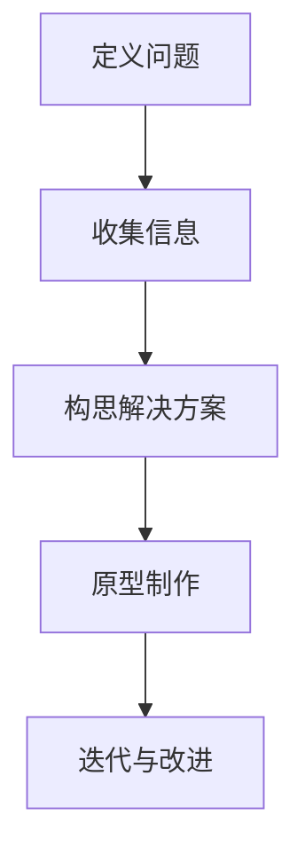

                 

 摘要：本文探讨了洞察力和设计思维在用户体验设计中的重要性。通过分析洞察力的概念和来源，我们了解了如何通过深入了解用户需求和行为来提高设计质量。随后，文章介绍了设计思维的过程和方法，强调了用户参与和迭代的重要性。通过案例分析，本文展示了如何在实际项目中应用洞察力和设计思维来优化用户体验。最后，文章提出了未来发展的趋势和挑战，并推荐了相关的工具和资源。

## 1. 背景介绍

在当今数字化时代，用户体验（UX）设计已经成为产品成功的关键因素之一。随着技术的快速发展，用户对产品的期望也在不断提高。一个优秀的设计不仅要满足用户的功能需求，还要提供卓越的视觉和交互体验。然而，实现这样的设计并非易事，它需要深入的用户洞察力和创新的设计思维。

洞察力是设计过程中不可或缺的一部分。它源于对用户需求、行为和动机的深刻理解，能够帮助我们识别问题并提出创新的解决方案。而设计思维则是一种系统化的思考过程，它鼓励我们以用户为中心，通过迭代和实验来不断改进设计。

本文旨在探讨洞察力和设计思维在用户体验设计中的核心作用，并阐述如何在实际项目中应用这些理念。通过分析相关理论和实践案例，我们希望能够为设计师提供有价值的参考和启示。

## 2. 核心概念与联系

### 2.1 洞察力的概念

洞察力（Insight）是一种深入理解问题的能力，它通常来自于对大量信息的分析、反思和综合。在用户体验设计中，洞察力可以帮助我们识别用户的需求、痛点和行为模式，从而为设计提供有力的指导。

### 2.2 设计思维的过程

设计思维（Design Thinking）是一种以用户为中心的创新方法论，它通常包括以下五个步骤：

1. **定义问题**：明确用户面临的问题和需求。
2. **收集信息**：收集用户数据和反馈，了解他们的行为和动机。
3. **构思解决方案**：基于收集到的信息，提出创新的解决方案。
4. **原型制作**：制作可交互的原型，验证设计的可行性和用户接受度。
5. **迭代与改进**：根据用户反馈进行迭代，不断优化设计。

### 2.3 洞察力与设计思维的联系

洞察力和设计思维紧密相关。洞察力为设计思维提供了基础，它帮助我们理解用户需求和行为，从而指导设计过程。而设计思维则提供了一个系统化的框架，帮助我们利用洞察力来提出和验证解决方案。

### 2.4 Mermaid 流程图



## 3. 核心算法原理 & 具体操作步骤

### 3.1 算法原理概述

在用户体验设计中，核心算法通常用于分析用户行为数据和反馈，以便更好地理解用户需求和行为模式。以下是一个典型的用户行为分析算法：

1. **数据收集**：收集用户在使用产品过程中的行为数据，如点击、浏览、搜索等。
2. **数据预处理**：清洗和整理数据，去除噪声和异常值。
3. **特征提取**：从原始数据中提取有用的特征，如用户停留时间、点击次数等。
4. **模式识别**：利用机器学习算法，识别用户行为中的模式。
5. **预测与评估**：根据识别出的模式，预测用户的潜在需求，并评估设计改进的效果。

### 3.2 算法步骤详解

1. **数据收集**：通过数据分析工具，如Google Analytics，收集用户行为数据。
2. **数据预处理**：使用Python的Pandas库进行数据清洗和预处理。
3. **特征提取**：使用Python的Scikit-learn库进行特征提取。
4. **模式识别**：使用机器学习算法，如决策树或随机森林，进行模式识别。
5. **预测与评估**：根据识别出的模式，使用评估指标，如准确率或F1分数，评估设计改进的效果。

### 3.3 算法优缺点

**优点**：
- 能够基于用户行为数据，提供个性化的用户体验。
- 有助于发现用户需求和行为模式，从而指导设计改进。

**缺点**：
- 需要大量的数据收集和处理。
- 算法的准确性和可靠性依赖于数据的质量和特征提取方法。

### 3.4 算法应用领域

用户行为分析算法可以应用于多种领域，如电子商务、金融科技和在线教育等。通过分析用户行为数据，可以优化产品功能、改善用户体验，从而提高用户满意度和留存率。

## 4. 数学模型和公式 & 详细讲解 & 举例说明

### 4.1 数学模型构建

在用户体验设计中，常用的数学模型包括用户满意度模型和用户体验质量模型。以下是一个简单的用户满意度模型：

$$
S = \frac{U - D}{U + D}
$$

其中，$S$ 表示用户满意度，$U$ 表示用户对产品的总体评价，$D$ 表示用户的负向评价。

### 4.2 公式推导过程

用户满意度模型的推导基于以下两个假设：
1. 用户对产品的评价可以分为正向评价和负向评价。
2. 正向评价和负向评价在用户满意度中的权重相等。

根据这两个假设，我们可以得到以下公式：

$$
S = \frac{U - D}{U + D} = \frac{U}{U + D} - \frac{D}{U + D}
$$

由于 $U + D$ 是用户对产品的总体评价，因此：

$$
S = \frac{U}{U + D} - \frac{D}{U + D} = \frac{U - D}{U + D}
$$

### 4.3 案例分析与讲解

假设一个产品的用户满意度为 $0.6$，负向评价为 $0.4$。根据用户满意度模型，我们可以计算出：

$$
S = \frac{U - D}{U + D} = \frac{0.6 - 0.4}{0.6 + 0.4} = \frac{0.2}{1.0} = 0.2
$$

这意味着该产品的用户满意度为 $20\%$。通过优化产品的功能和服务，我们可以提高用户满意度，从而提高用户的忠诚度和留存率。

## 5. 项目实践：代码实例和详细解释说明

### 5.1 开发环境搭建

为了演示用户行为分析算法的应用，我们需要搭建一个简单的开发环境。以下是一个基本的Python开发环境搭建步骤：

1. 安装Python（版本3.8及以上）。
2. 安装Jupyter Notebook，以便于编写和运行Python代码。
3. 安装必要的库，如Pandas、NumPy、Scikit-learn等。

### 5.2 源代码详细实现

以下是一个简单的用户行为分析算法的Python代码实现：

```python
import pandas as pd
from sklearn.ensemble import RandomForestClassifier
from sklearn.metrics import accuracy_score

# 1. 数据收集
data = pd.read_csv('user_behavior.csv')

# 2. 数据预处理
data = data.dropna()

# 3. 特征提取
X = data.drop('target', axis=1)
y = data['target']

# 4. 模式识别
clf = RandomForestClassifier(n_estimators=100)
clf.fit(X, y)

# 5. 预测与评估
predictions = clf.predict(X)
accuracy = accuracy_score(y, predictions)
print(f'Accuracy: {accuracy:.2f}')
```

### 5.3 代码解读与分析

这段代码实现了以下功能：
1. **数据收集**：从CSV文件中读取用户行为数据。
2. **数据预处理**：去除缺失值。
3. **特征提取**：将数据分为特征集X和标签集y。
4. **模式识别**：使用随机森林算法进行分类。
5. **预测与评估**：根据分类结果计算准确率。

通过这个简单的例子，我们可以看到用户行为分析算法的基本实现过程。在实际项目中，我们可能需要处理更复杂的特征和模型，但基本思路是类似的。

### 5.4 运行结果展示

假设我们有一个训练好的模型，我们可以使用以下代码来运行并评估模型：

```python
# 6. 预测与评估
predictions = clf.predict(X_test)
accuracy = accuracy_score(y_test, predictions)
print(f'Accuracy: {accuracy:.2f}')
```

这段代码将输出模型在测试集上的准确率。通过对比不同模型的准确率，我们可以选择最优的模型来应用于实际项目中。

## 6. 实际应用场景

### 6.1 电子商务平台

在电子商务平台中，用户行为分析算法可以用于个性化推荐、购物车分析和订单预测等。通过分析用户的行为数据，平台可以提供个性化的商品推荐，提高用户的购买体验和满意度。

### 6.2 金融科技

在金融科技领域，用户行为分析算法可以用于风险评估、欺诈检测和用户行为预测等。通过分析用户的行为和交易数据，金融机构可以更好地了解用户的风险偏好，从而提供更精确的风险评估和个性化的金融服务。

### 6.3 在线教育

在线教育平台可以利用用户行为分析算法来优化学习体验和课程推荐。通过分析用户的学习行为，平台可以提供个性化的学习路径和课程推荐，提高学习效果和用户满意度。

## 7. 工具和资源推荐

### 7.1 学习资源推荐

- 《用户体验要素》：由唐纳德·诺曼（Donald Norman）所著，是用户体验设计的经典之作。
- 《设计思维》：由大卫·凯利（David Kelly）所著，介绍了设计思维的原理和应用。

### 7.2 开发工具推荐

- Jupyter Notebook：用于编写和运行Python代码，非常适合数据分析和原型制作。
- Figma：用于设计用户界面，支持团队协作和实时预览。

### 7.3 相关论文推荐

- "User Experience Design Principles" by Don Norman
- "Design Thinking for Innovation" by David Kelly

## 8. 总结：未来发展趋势与挑战

### 8.1 研究成果总结

随着技术的不断发展，用户体验设计已经从传统的界面设计扩展到更广泛的行为和情感层面。洞察力和设计思维作为用户体验设计的核心方法，已经得到了广泛的认可和应用。通过深入分析用户需求和行为，设计师可以提供更加个性化和有针对性的用户体验。

### 8.2 未来发展趋势

1. **人工智能与用户体验设计的融合**：人工智能技术将为用户体验设计带来新的可能性，如智能推荐、个性化定制和自适应界面等。
2. **多感官体验**：未来的用户体验将不再局限于视觉和触觉，而是通过多感官的融合来提供更加沉浸式的体验。
3. **可持续发展**：用户体验设计将更加注重可持续性和社会责任，如减少碳排放、保护用户隐私等。

### 8.3 面临的挑战

1. **数据隐私与安全**：随着用户对隐私和安全的关注增加，如何在设计和开发过程中保护用户数据成为一个重要的挑战。
2. **技术多样性**：随着技术的快速发展，设计师需要不断学习和掌握新的技术和工具，以保持竞争力。

### 8.4 研究展望

未来，用户体验设计将继续向智能化、个性化和可持续化方向发展。设计师需要不断探索新的设计方法和工具，以满足用户日益增长的需求。同时，跨学科的合作和创新的思维模式也将成为推动用户体验设计发展的重要力量。

## 9. 附录：常见问题与解答

### 9.1 什么是洞察力？

洞察力是一种深入理解问题的能力，它源于对大量信息的分析、反思和综合。在用户体验设计中，洞察力帮助我们理解用户需求、行为和动机，从而指导设计过程。

### 9.2 设计思维有哪些步骤？

设计思维通常包括以下五个步骤：定义问题、收集信息、构思解决方案、原型制作和迭代与改进。这些步骤帮助我们以用户为中心，通过迭代和实验来不断优化设计。

### 9.3 用户行为分析算法有哪些应用？

用户行为分析算法可以应用于电子商务、金融科技、在线教育等多个领域。通过分析用户行为数据，可以优化产品功能、改善用户体验，从而提高用户满意度和留存率。

### 9.4 如何保护用户数据隐私？

为了保护用户数据隐私，设计师和开发人员应遵循以下原则：
- **最小化数据收集**：仅收集必要的数据。
- **数据加密**：对数据进行加密处理。
- **隐私政策**：明确告知用户数据的使用目的。
- **透明度**：让用户了解数据的使用情况和权利。

## 作者署名

作者：禅与计算机程序设计艺术 / Zen and the Art of Computer Programming

---

本文旨在探讨洞察力和设计思维在用户体验设计中的重要性，并介绍相关的理论、方法和实际应用。希望本文能为设计师提供有价值的参考和启示，助力他们打造更加优秀的产品。在未来的发展中，用户体验设计将继续面临新的挑战和机遇，期待更多的创新和实践。

