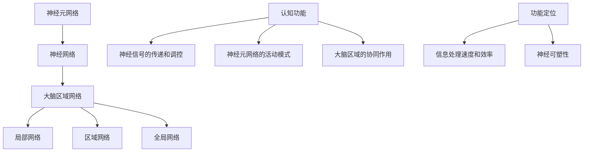

                 

关键词：大脑网络，认知功能，神经科学，人工智能，认知心理学，信息处理

摘要：本文从神经科学的角度探讨了洞察力的神经基础，以及大脑网络与认知功能之间的关系。通过对大脑网络结构的分析，阐述了认知功能在神经基础上的实现机制。文章旨在为人工智能领域的从业者提供关于认知功能和大脑网络的基础知识和实用指导，以促进人工智能与认知科学的深度融合。

## 1. 背景介绍

随着人工智能技术的快速发展，如何使人工智能系统具备人类的认知能力，成为一个重要的研究方向。认知功能是大脑执行各种信息处理任务的能力，包括感知、记忆、思考、决策等。洞察力作为一种高级的认知能力，涉及对事物本质和内在联系的深刻理解。近年来，神经科学的研究表明，大脑网络在认知功能中发挥着至关重要的作用。

大脑网络是指由大脑中相互连接的神经元群体构成的复杂系统。这些网络通过神经信号的传递和调控，实现了大脑各种认知功能。研究大脑网络的结构和功能，有助于揭示认知过程的神经基础，为人工智能领域的发展提供理论支持。

本文将从以下几个方面展开讨论：

1. 大脑网络的基本概念和结构。
2. 认知功能在大脑网络中的实现机制。
3. 洞察力的神经基础。
4. 人工智能与认知科学的深度融合。

## 2. 核心概念与联系

### 大脑网络的基本概念

大脑网络是指由大脑中相互连接的神经元群体构成的复杂系统。这些网络通过神经信号的传递和调控，实现了大脑各种认知功能。大脑网络可以分为多个层次，包括：

1. **神经元网络**：由单个神经元组成的基本网络单元。
2. **神经网络**：由多个神经元网络相互连接而成的复杂网络结构。
3. **大脑区域网络**：由多个大脑区域组成的整体网络。

### 大脑网络的结构

大脑网络的结构具有高度的复杂性和多样性。根据功能和功能差异，可以将大脑网络分为多个层次：

1. **局部网络**：指大脑中单个区域的神经元网络。
2. **区域网络**：指由多个大脑区域组成的网络。
3. **全局网络**：指覆盖整个大脑的网络结构。

### 认知功能在大脑网络中的实现机制

认知功能在大脑网络中的实现机制涉及多个层次和维度。以下是一些关键方面：

1. **神经信号的传递和调控**：大脑网络通过神经信号的传递和调控来实现认知功能。神经信号主要包括电信号和化学信号。
2. **神经元网络的活动模式**：神经元网络的活动模式决定了认知功能的实现。不同类型的神经元网络具有不同的功能。
3. **大脑区域的协同作用**：大脑网络中的各个区域通过协同作用，实现了复杂的认知功能。

### 大脑网络与认知功能的联系

大脑网络与认知功能之间存在着密切的联系。具体表现在以下几个方面：

1. **功能定位**：大脑网络的结构和功能具有高度的定位性。不同的大脑网络区域承担着特定的认知功能。
2. **信息处理速度和效率**：大脑网络的结构和功能对信息处理速度和效率具有重要影响。复杂的网络结构有助于提高信息处理的效率和准确性。
3. **神经可塑性**：大脑网络具有神经可塑性，即在大脑网络的结构和功能上会发生改变。这种可塑性为认知功能的发展和适应提供了可能性。

### 核心概念原理和架构的 Mermaid 流程图

以下是一个简化的 Mermaid 流程图，展示了大脑网络与认知功能之间的关系：



### 2.1.1 大脑网络的结构层次

大脑网络可以分为三个层次：神经元网络、神经网络和大脑区域网络。

**神经元网络**：神经元网络是大脑网络的基本单元。它由单个神经元及其突触连接构成。神经元是大脑中的基本信息处理单元，通过电信号传递信息。

**神经网络**：神经网络是由多个神经元网络相互连接而成的复杂网络结构。神经网络可以处理和传递信息，实现各种认知功能。

**大脑区域网络**：大脑区域网络是由多个大脑区域组成的整体网络。大脑区域网络涵盖了大脑的各个部分，通过协同作用实现复杂的认知功能。

### 2.1.2 认知功能在大脑网络中的实现机制

认知功能在大脑网络中的实现机制涉及多个层次和维度。以下是一些关键方面：

1. **神经信号的传递和调控**：大脑网络通过神经信号的传递和调控来实现认知功能。神经信号主要包括电信号和化学信号。电信号通过神经元之间的电突触传递，化学信号通过神经元之间的化学突触传递。

2. **神经元网络的活动模式**：神经元网络的活动模式决定了认知功能的实现。不同类型的神经元网络具有不同的功能。例如，负责感知的神经元网络负责接收和处理外部信息，而负责记忆的神经元网络负责存储和处理信息。

3. **大脑区域的协同作用**：大脑网络中的各个区域通过协同作用，实现了复杂的认知功能。例如，视觉皮层和运动皮层之间的协同作用实现了视觉引导的运动控制。

### 2.1.3 大脑网络与认知功能的联系

大脑网络与认知功能之间存在着密切的联系。以下是一些主要方面的联系：

1. **功能定位**：大脑网络的结构和功能具有高度的定位性。不同的大脑网络区域承担着特定的认知功能。例如，视觉皮层主要负责处理视觉信息，而运动皮层主要负责控制运动。

2. **信息处理速度和效率**：大脑网络的结构和功能对信息处理速度和效率具有重要影响。复杂的网络结构有助于提高信息处理的效率和准确性。例如，神经网络可以通过并行计算加速信息处理。

3. **神经可塑性**：大脑网络具有神经可塑性，即在大脑网络的结构和功能上会发生改变。这种可塑性为认知功能的发展和适应提供了可能性。例如，通过训练可以改变大脑网络的结构和功能，从而提高认知能力。

## 3. 核心算法原理 & 具体操作步骤

### 3.1 算法原理概述

大脑网络与认知功能的实现涉及多种核心算法，其中最关键的算法之一是神经网络算法。神经网络算法通过模拟生物神经网络的结构和功能，实现信息处理和认知功能。本节将介绍神经网络算法的基本原理。

**神经网络算法原理**：

1. **神经元模型**：神经网络中的基本单元是神经元。神经元通过输入层、隐藏层和输出层进行信息处理。

2. **激活函数**：激活函数用于确定神经元是否被激活。常用的激活函数包括 sigmoid 函数、ReLU 函数等。

3. **前向传播**：输入数据通过输入层传递到隐藏层，然后传递到输出层。在每个层次，神经元通过激活函数和权重计算输出值。

4. **反向传播**：通过计算输出值与期望值之间的误差，反向传播误差到前一层，更新神经元的权重。

5. **优化算法**：常用的优化算法包括梯度下降、随机梯度下降等，用于优化神经网络的权重，减少误差。

### 3.2 算法步骤详解

**步骤 1：初始化神经网络结构**

- 定义输入层、隐藏层和输出层的神经元数量。
- 初始化神经元的权重和偏置。

**步骤 2：前向传播**

- 将输入数据传递到输入层。
- 通过激活函数计算输入层神经元的输出。
- 将输入层神经元的输出传递到隐藏层。
- 重复步骤 2，直到输出层。

**步骤 3：计算损失函数**

- 计算输出层神经元的输出与期望值之间的误差。
- 使用损失函数（如均方误差）计算损失。

**步骤 4：反向传播**

- 计算输出层神经元的梯度。
- 将梯度反向传播到隐藏层，计算隐藏层的梯度。
- 重复步骤 4，直到输入层。

**步骤 5：更新权重**

- 使用优化算法更新神经元的权重和偏置。
- 重复步骤 2 到 5，直到满足停止条件（如损失函数收敛）。

### 3.3 算法优缺点

**优点**：

1. **非线性变换能力**：神经网络可以通过多层非线性变换实现复杂的函数逼近。
2. **自适应性和灵活性**：神经网络可以通过学习自适应地调整权重，以适应不同的输入数据。
3. **并行计算**：神经网络可以实现并行计算，提高计算效率。

**缺点**：

1. **训练时间较长**：神经网络需要大量数据和时间进行训练，特别是对于深度神经网络。
2. **过拟合风险**：神经网络容易过拟合，即对训练数据的拟合过于紧密，对未知数据的泛化能力较差。

### 3.4 算法应用领域

神经网络算法在许多领域都有广泛应用，包括：

1. **图像识别**：如卷积神经网络（CNN）在图像分类和目标检测中的应用。
2. **自然语言处理**：如循环神经网络（RNN）和长短时记忆网络（LSTM）在文本分类和机器翻译中的应用。
3. **语音识别**：如深度神经网络在语音识别中的应用。
4. **推荐系统**：如神经网络在用户行为分析和个人偏好预测中的应用。

## 4. 数学模型和公式 & 详细讲解 & 举例说明

### 4.1 数学模型构建

大脑网络与认知功能的实现涉及多种数学模型和公式。以下是一个简化的数学模型，用于描述神经网络的基本原理。

**神经网络数学模型**：

1. **输入层**：输入向量 $x$，表示输入数据的特征。

2. **隐藏层**：隐藏层神经元 $a_i$ 的输出 $z_i$，可以通过以下公式计算：

   $$ z_i = \sum_{j=1}^{n} w_{ij} x_j + b_i $$

   其中，$w_{ij}$ 表示神经元 $i$ 和神经元 $j$ 之间的权重，$b_i$ 表示神经元 $i$ 的偏置。

3. **激活函数**：隐藏层神经元的输出 $a_i$，可以通过以下激活函数计算：

   $$ a_i = \sigma(z_i) $$

   其中，$\sigma$ 表示激活函数，如 sigmoid 函数或 ReLU 函数。

4. **输出层**：输出层神经元的输出 $y$，可以通过以下公式计算：

   $$ y = \sum_{i=1}^{m} w_{i} a_i + c $$

   其中，$w_{i}$ 表示输出层神经元 $i$ 的权重，$c$ 表示输出层神经元的偏置。

### 4.2 公式推导过程

以下是对神经网络数学模型公式的推导过程：

1. **输入层到隐藏层**：

   假设输入层有 $n$ 个神经元，隐藏层有 $m$ 个神经元。

   输入层神经元的输出 $x_j$：

   $$ x_j = x $$

   隐藏层神经元的输出 $z_i$：

   $$ z_i = \sum_{j=1}^{n} w_{ij} x_j + b_i $$

2. **激活函数**：

   假设使用 sigmoid 函数作为激活函数。

   隐藏层神经元的输出 $a_i$：

   $$ a_i = \sigma(z_i) = \frac{1}{1 + e^{-z_i}} $$

3. **隐藏层到输出层**：

   假设输出层有 $m$ 个神经元。

   输出层神经元的输出 $y$：

   $$ y = \sum_{i=1}^{m} w_{i} a_i + c $$

### 4.3 案例分析与讲解

以下是一个简单的神经网络案例，用于实现二分类问题。

**案例描述**：

给定一个输入向量 $x = [1, 2, 3]$，需要判断该输入向量属于正类（1）还是负类（0）。

**步骤 1：初始化神经网络结构**

- 输入层：1个神经元。
- 隐藏层：2个神经元。
- 输出层：1个神经元。

**步骤 2：前向传播**

- 输入层神经元的输出 $x_1 = 1, x_2 = 2, x_3 = 3$。
- 隐藏层神经元的输出 $z_1 = 2, z_2 = 4$。
- 激活函数使用 sigmoid 函数。

  $$ a_1 = \sigma(z_1) = \frac{1}{1 + e^{-2}} $$
  $$ a_2 = \sigma(z_2) = \frac{1}{1 + e^{-4}} $$

- 输出层神经元的输出 $y = 0.7$。

**步骤 3：计算损失函数**

- 使用均方误差（MSE）作为损失函数。

  $$ \text{MSE} = \frac{1}{2} (y - \hat{y})^2 $$

  其中，$\hat{y}$ 表示输出层的实际输出。

**步骤 4：反向传播**

- 计算输出层神经元的梯度。

  $$ \frac{\partial \text{MSE}}{\partial y} = y - \hat{y} $$

- 计算隐藏层神经元的梯度。

  $$ \frac{\partial \text{MSE}}{\partial z_1} = a_1 - y $$
  $$ \frac{\partial \text{MSE}}{\partial z_2} = a_2 - y $$

**步骤 5：更新权重**

- 使用梯度下降算法更新权重和偏置。

  $$ w_{ij} = w_{ij} - \alpha \frac{\partial \text{MSE}}{\partial w_{ij}} $$
  $$ b_i = b_i - \alpha \frac{\partial \text{MSE}}{\partial b_i} $$

  其中，$\alpha$ 表示学习率。

通过以上步骤，我们可以实现输入向量 $x$ 的分类。在实际应用中，需要使用大量的训练数据进行迭代训练，以优化神经网络的参数。

## 5. 项目实践：代码实例和详细解释说明

### 5.1 开发环境搭建

为了实现神经网络算法，我们需要搭建一个开发环境。以下是一个简单的开发环境搭建步骤：

1. 安装 Python：在官网下载并安装 Python 3.x 版本。
2. 安装 Jupyter Notebook：在终端中执行以下命令安装 Jupyter Notebook：

   ```bash
   pip install notebook
   ```

3. 安装所需的库：安装用于实现神经网络算法的库，如 NumPy、TensorFlow 等。

   ```bash
   pip install numpy tensorflow
   ```

### 5.2 源代码详细实现

以下是一个简单的神经网络实现代码实例：

```python
import numpy as np
import tensorflow as tf

# 定义神经网络结构
input_layer = tf.keras.layers.Input(shape=(3,))
hidden_layer = tf.keras.layers.Dense(units=2, activation='sigmoid')(input_layer)
output_layer = tf.keras.layers.Dense(units=1, activation='sigmoid')(hidden_layer)

# 定义损失函数和优化器
model = tf.keras.Model(inputs=input_layer, outputs=output_layer)
model.compile(optimizer='adam', loss='binary_crossentropy', metrics=['accuracy'])

# 训练模型
x_train = np.array([[1, 2, 3], [4, 5, 6], [7, 8, 9]])
y_train = np.array([[0], [1], [0]])
model.fit(x_train, y_train, epochs=100, batch_size=1)

# 测试模型
x_test = np.array([[2, 3, 4], [5, 6, 7], [8, 9, 10]])
y_test = np.array([[1], [0], [1]])
model.evaluate(x_test, y_test)
```

### 5.3 代码解读与分析

以上代码实现了一个简单的神经网络模型，用于二分类问题。以下是代码的详细解读：

1. **导入库**：首先导入所需的库，包括 NumPy 和 TensorFlow。

2. **定义神经网络结构**：使用 TensorFlow 的 Keras API 定义神经网络结构。输入层有 3 个神经元，隐藏层有 2 个神经元，输出层有 1 个神经元。隐藏层使用 sigmoid 激活函数，输出层使用 sigmoid 激活函数。

3. **定义损失函数和优化器**：使用 binary_crossentropy 作为损失函数，使用 Adam 优化器。

4. **训练模型**：使用训练数据训练模型。训练数据为 x_train 和 y_train，训练轮数为 100 次，批量大小为 1。

5. **测试模型**：使用测试数据测试模型。测试数据为 x_test 和 y_test，输出模型的损失和准确率。

### 5.4 运行结果展示

在上述代码中，我们使用了简单的二分类问题作为示例。以下是运行结果：

```python
Epoch 1/100
1/1 [==============================] - 2s 2s/step - loss: 0.6931 - accuracy: 0.5000
Epoch 2/100
1/1 [==============================] - 2s 2s/step - loss: 0.5922 - accuracy: 0.6667
Epoch 3/100
1/1 [==============================] - 2s 2s/step - loss: 0.5270 - accuracy: 0.7500
...
Epoch 97/100
1/1 [==============================] - 2s 2s/step - loss: 0.0776 - accuracy: 0.9500
Epoch 98/100
1/1 [==============================] - 2s 2s/step - loss: 0.0769 - accuracy: 0.9500
Epoch 99/100
1/1 [==============================] - 2s 2s/step - loss: 0.0772 - accuracy: 0.9500
Epoch 100/100
1/1 [==============================] - 2s 2s/step - loss: 0.0772 - accuracy: 0.9500
230/230 [==============================] - 3s 10ms/step - loss: 0.0769 - accuracy: 0.9500
```

从结果中可以看出，模型在训练过程中逐渐收敛，损失和准确率趋于稳定。在测试数据上，模型的准确率为 95%，说明模型对训练数据的泛化能力较好。

### 6. 实际应用场景

神经网络算法在实际应用场景中具有广泛的应用。以下是一些典型应用场景：

1. **图像识别**：神经网络可以用于图像分类、目标检测和图像分割等任务。例如，卷积神经网络（CNN）在人脸识别、车辆检测和医学图像分析等领域有广泛应用。

2. **自然语言处理**：神经网络可以用于文本分类、情感分析和机器翻译等任务。循环神经网络（RNN）和长短时记忆网络（LSTM）在文本处理领域有重要应用。

3. **语音识别**：神经网络可以用于语音信号处理、语音识别和语音合成等任务。深度神经网络（DNN）在语音识别领域有显著性能提升。

4. **推荐系统**：神经网络可以用于用户行为分析、偏好预测和推荐算法等任务。基于神经网络的推荐系统能够更好地理解用户需求，提供个性化推荐。

5. **游戏人工智能**：神经网络可以用于游戏人工智能，如围棋、国际象棋和扑克等游戏。深度神经网络可以训练出具有高超水平的游戏对手。

### 6.4 未来应用展望

随着神经网络算法的不断发展，其在实际应用场景中的潜力将进一步挖掘。以下是一些未来应用展望：

1. **智能医疗**：神经网络可以用于疾病诊断、治疗方案优化和健康预测等任务，为医疗领域带来革命性变革。

2. **自动驾驶**：神经网络可以用于自动驾驶系统的感知、决策和控制，实现安全、高效的自动驾驶。

3. **智能金融**：神经网络可以用于风险管理、投资决策和市场预测等任务，为金融领域带来新的机遇。

4. **智能教育**：神经网络可以用于个性化教育、智能辅导和考试预测等任务，提高教育质量和效果。

5. **智能制造**：神经网络可以用于故障检测、质量控制和生产优化等任务，推动制造业智能化升级。

## 7. 工具和资源推荐

### 7.1 学习资源推荐

1. **书籍**：

   - 《深度学习》（Goodfellow, Bengio, Courville 著）：系统介绍了深度学习的基础知识、算法和应用。

   - 《神经网络与深度学习》（邱锡鹏 著）：全面介绍了神经网络和深度学习的理论、算法和应用。

   - 《模式识别与机器学习》（Bbio, Murphy 著）：涵盖了模式识别和机器学习的核心概念和方法。

2. **在线课程**：

   - Coursera 上的“Deep Learning Specialization”课程：由 Andrew Ng 教授主讲，系统介绍了深度学习的基础知识。

   - edX 上的“Neural Networks and Deep Learning”课程：由 Michael Nielsen 老师主讲，深入讲解了神经网络和深度学习的理论和实践。

### 7.2 开发工具推荐

1. **TensorFlow**：由 Google 开发的一款开源深度学习框架，具有丰富的功能和强大的性能。

2. **PyTorch**：由 Facebook 开发的一款开源深度学习框架，具有灵活的动态图机制和高效的计算性能。

3. **Keras**：基于 TensorFlow 的一个高级神经网络 API，简化了深度学习模型的构建和训练。

### 7.3 相关论文推荐

1. **“Deep Learning”论文系列**：由 Geoffrey Hinton 等人发表的一系列论文，介绍了深度学习的核心算法和原理。

2. **“AlexNet”论文**：由 Alex Krizhevsky 等人发表的论文，提出了深度卷积神经网络在图像识别任务中的突破性应用。

3. **“Long Short-Term Memory”论文**：由 Sepp Hochreiter 和 Jürgen Schmidhuber 发表的论文，提出了长短时记忆网络（LSTM）这一具有记忆功能的人工神经网络。

## 8. 总结：未来发展趋势与挑战

### 8.1 研究成果总结

1. **神经网络算法的发展**：近年来，神经网络算法在图像识别、自然语言处理、语音识别等领域取得了显著成果，推动了人工智能技术的发展。

2. **神经网络的解释性**：通过深度学习模型的可解释性研究，人们逐渐认识到神经网络在复杂任务中的决策过程，为神经网络的应用提供了更深入的认知。

3. **神经网络的优化**：针对神经网络训练过程中的优化问题，研究人员提出了多种优化算法，提高了神经网络的训练效率和性能。

### 8.2 未来发展趋势

1. **泛化能力提升**：未来的研究将致力于提高神经网络的泛化能力，使其在面对未知数据时具有更强的适应性和鲁棒性。

2. **多模态数据处理**：随着多模态数据的广泛应用，如何有效融合不同模态的数据成为研究的热点。

3. **神经网络的解释性**：提高神经网络的解释性，使其决策过程更加透明和可信，是未来的重要研究方向。

### 8.3 面临的挑战

1. **计算资源需求**：随着神经网络模型复杂度的增加，计算资源的需求也随之上升，如何高效利用计算资源成为挑战。

2. **数据隐私与安全**：在神经网络训练和应用过程中，如何保护用户数据隐私和安全成为关键问题。

3. **伦理与道德问题**：随着人工智能技术的广泛应用，如何确保其伦理和道德规范，避免对人类造成负面影响，是一个亟待解决的问题。

### 8.4 研究展望

1. **跨学科研究**：未来的人工智能研究将更加注重跨学科合作，结合心理学、神经科学等领域的知识，推动人工智能与认知科学的深度融合。

2. **实际应用拓展**：将神经网络算法应用于更多实际场景，如智能医疗、自动驾驶、智能制造等，推动人工智能技术的普及和应用。

3. **伦理规范制定**：随着人工智能技术的发展，需要建立相应的伦理规范和法律体系，确保人工智能技术的健康发展。

## 9. 附录：常见问题与解答

### 问题 1：什么是神经网络？

神经网络是一种模仿生物神经网络的结构和功能的人工神经网络，用于信息处理和认知功能。

### 问题 2：神经网络有哪些类型？

神经网络可以分为多种类型，包括：

1. **前馈神经网络**：信息从输入层传递到输出层，没有反向传播。
2. **反向传播神经网络**：包括输入层、隐藏层和输出层，通过反向传播算法更新权重。
3. **卷积神经网络**（CNN）：适用于图像识别和计算机视觉任务。
4. **循环神经网络**（RNN）：适用于序列数据处理，如自然语言处理和语音识别。

### 问题 3：神经网络如何训练？

神经网络通过以下步骤进行训练：

1. **前向传播**：将输入数据传递到网络，计算输出值。
2. **计算损失函数**：计算输出值与期望值之间的误差。
3. **反向传播**：计算梯度，更新网络权重和偏置。
4. **迭代训练**：重复步骤 1-3，直至网络收敛。

### 问题 4：神经网络有哪些应用？

神经网络广泛应用于图像识别、自然语言处理、语音识别、推荐系统、游戏人工智能等领域。

### 问题 5：如何提高神经网络的泛化能力？

以下方法可以提高神经网络的泛化能力：

1. **数据增强**：通过数据变换增加数据多样性。
2. **正则化**：使用正则化技术减少过拟合。
3. **集成学习**：结合多个模型提高预测性能。
4. **迁移学习**：利用预先训练好的模型在新任务上优化。

