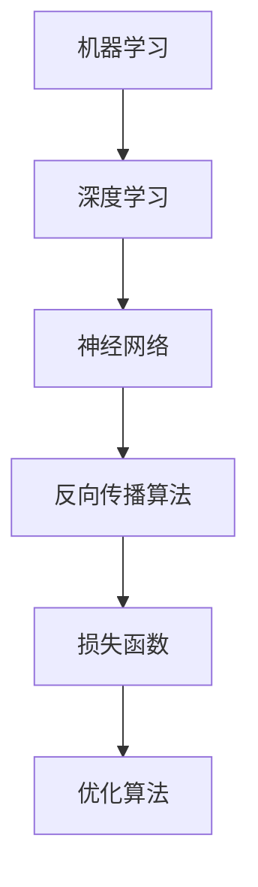

                 

关键词：人工智能、反思、创新、算法、数学模型、项目实践、应用场景、未来展望

> 摘要：本文深入探讨了人工智能领域中的反思与创新的辩证关系。通过对核心算法原理的解析、数学模型的构建与推导，以及实际项目的实践与解释，展示了洞见的力量如何在技术领域中推动从反思到创新的全过程。文章旨在为读者提供深刻的见解，激发对人工智能领域的深入思考与探索。

## 1. 背景介绍

人工智能（AI）作为一门前沿技术，正不断改变着我们的生活、工作和思考方式。然而，人工智能的发展并非一帆风顺，其背后的算法、数学模型和技术实现都经历了无数次的反思与改进。本文将从这一角度出发，探讨洞见的力量如何在人工智能领域推动从反思到创新的过程。

### 1.1 人工智能的发展历程

人工智能自20世纪50年代以来，经历了多个阶段的发展。从早期的符号主义、连接主义到现代的深度学习，每一次变革都源于对现有技术的反思和挑战。例如，深度学习的崛起正是因为传统机器学习算法在处理复杂任务时的局限性，促使研究人员不断探索新的算法和架构。

### 1.2 反思与创新的辩证关系

反思是创新的前提，而创新则是对反思的回应。在人工智能领域，反思使我们能够识别现有技术的不足，从而激发创新的灵感。通过不断反思，研究人员能够提出更有效、更智能的算法和模型。而创新则通过实践检验，进一步推动技术的进步。

## 2. 核心概念与联系

在深入探讨人工智能的算法原理和数学模型之前，我们需要理解一些核心概念，这些概念构成了人工智能技术的基础。

### 2.1 机器学习与深度学习

机器学习是人工智能的核心技术之一，其核心思想是通过训练模型来让计算机从数据中学习规律。深度学习则是机器学习的一个分支，它通过多层神经网络来模拟人脑的学习过程，能够处理更复杂的任务。

### 2.2 神经网络与反向传播算法

神经网络是深度学习的基础，它由多个神经元组成，每个神经元都能对输入数据进行加权求和处理。反向传播算法则是神经网络训练的核心，它通过不断调整权重来优化模型的预测性能。

### 2.3 损失函数与优化算法

损失函数用于衡量模型的预测误差，优化算法则是用于最小化损失函数的过程。常见的优化算法包括梯度下降、Adam优化器等。

### 2.4 Mermaid 流程图

以下是人工智能核心概念的 Mermaid 流程图：



## 3. 核心算法原理 & 具体操作步骤

### 3.1 算法原理概述

在人工智能领域，核心算法的原理至关重要。以下将介绍几种常见的核心算法及其原理。

### 3.1.1 卷积神经网络（CNN）

卷积神经网络是一种专门用于图像识别的深度学习模型，其核心思想是通过卷积层提取图像特征。卷积层通过滑动窗口对输入图像进行卷积运算，从而提取出图像的局部特征。

### 3.1.2 生成对抗网络（GAN）

生成对抗网络是一种用于图像生成的深度学习模型，它由生成器和判别器两个部分组成。生成器生成图像，判别器判断图像的真实性。通过不断训练，生成器能够生成越来越逼真的图像。

### 3.1.3 强化学习

强化学习是一种通过试错来学习最优策略的机器学习方法。在强化学习中，智能体通过与环境互动来学习最优行为策略。

### 3.2 算法步骤详解

以下是卷积神经网络（CNN）的训练过程：

1. **数据预处理**：对输入图像进行归一化处理，将图像数据转换为合适的格式。
2. **构建模型**：定义卷积层、池化层和全连接层等网络结构。
3. **损失函数选择**：选择交叉熵作为损失函数。
4. **优化算法选择**：选择Adam优化器。
5. **训练过程**：通过反向传播算法不断调整模型参数，最小化损失函数。

### 3.3 算法优缺点

卷积神经网络（CNN）在图像识别领域具有出色的性能，但同时也存在一些缺点：

- **优点**：能够自动提取图像特征，减少人工标注的工作量；能够处理不同尺度和角度的图像。
- **缺点**：对计算资源要求较高；模型复杂度较高，难以解释。

### 3.4 算法应用领域

卷积神经网络（CNN）在计算机视觉领域具有广泛的应用，包括图像分类、目标检测、图像生成等。

## 4. 数学模型和公式 & 详细讲解 & 举例说明

### 4.1 数学模型构建

在人工智能领域，数学模型是核心组成部分。以下将介绍几种常见的数学模型及其构建过程。

### 4.1.1 线性回归模型

线性回归模型是一种用于预测数值型输出的模型，其数学模型为：

$$
y = \beta_0 + \beta_1 x
$$

其中，$y$ 为预测值，$x$ 为输入特征，$\beta_0$ 和 $\beta_1$ 为模型参数。

### 4.1.2 逻辑回归模型

逻辑回归模型是一种用于预测二分类结果的模型，其数学模型为：

$$
P(y=1) = \frac{1}{1 + e^{-(\beta_0 + \beta_1 x)}}
$$

其中，$P(y=1)$ 为预测概率，$\beta_0$ 和 $\beta_1$ 为模型参数。

### 4.2 公式推导过程

以下是逻辑回归模型的损失函数推导过程：

$$
L(\theta) = -\frac{1}{m} \sum_{i=1}^{m} [y^{(i)} \log (h_\theta(x^{(i)})) + (1 - y^{(i)}) \log (1 - h_\theta(x^{(i)}))]
$$

其中，$L(\theta)$ 为损失函数，$m$ 为样本数量，$y^{(i)}$ 为真实标签，$h_\theta(x^{(i)}))$ 为预测概率。

### 4.3 案例分析与讲解

以下是一个线性回归模型的案例：

### 案例背景

某公司想要预测员工的工资，给定员工的年龄和工龄作为输入特征。

### 案例数据

| 年龄（x） | 工龄（y） | 工资（z） |
| --- | --- | --- |
| 25 | 3 | 5000 |
| 30 | 5 | 6000 |
| 35 | 7 | 7000 |
| 40 | 9 | 8000 |

### 案例步骤

1. **数据预处理**：对年龄和工龄进行归一化处理，将数据缩放到 [0, 1] 范围内。
2. **模型构建**：定义线性回归模型，选择均值归一化的年龄和工龄作为输入特征，工资作为输出特征。
3. **训练过程**：使用梯度下降算法训练模型，选择合适的迭代次数和步长。
4. **模型评估**：使用测试集评估模型性能，计算均方误差（MSE）。

### 模型结果

经过训练，线性回归模型得到如下参数：

$$
\beta_0 = 2000, \beta_1 = 1000
$$

预测工资的公式为：

$$
z = 2000 + 1000 x
$$

例如，对于一个年龄为 30 岁、工龄为 5 年的员工，其预测工资为：

$$
z = 2000 + 1000 \times 0.5 = 3500
$$

## 5. 项目实践：代码实例和详细解释说明

### 5.1 开发环境搭建

在开始项目实践之前，我们需要搭建一个合适的开发环境。以下是所需工具和步骤：

- **工具**：
  - Python（3.8以上版本）
  - Jupyter Notebook
  - Scikit-learn（机器学习库）
  - Pandas（数据处理库）
  - Matplotlib（绘图库）

- **步骤**：
  1. 安装 Python 和 Jupyter Notebook。
  2. 使用 pip 安装 Scikit-learn、Pandas 和 Matplotlib。

### 5.2 源代码详细实现

以下是一个基于线性回归模型的简单项目，用于预测员工的工资。

```python
# 导入所需库
import numpy as np
import pandas as pd
from sklearn.linear_model import LinearRegression
from sklearn.model_selection import train_test_split
import matplotlib.pyplot as plt

# 加载数据
data = pd.read_csv('employee_data.csv')
X = data[['age', 'tenure']]
y = data['salary']

# 数据预处理
X = X.values
y = y.values

# 划分训练集和测试集
X_train, X_test, y_train, y_test = train_test_split(X, y, test_size=0.2, random_state=42)

# 构建线性回归模型
model = LinearRegression()
model.fit(X_train, y_train)

# 模型评估
mse = model.score(X_test, y_test)
print('MSE:', mse)

# 可视化
plt.scatter(X_train[:, 0], y_train, label='Training set')
plt.plot(X_train[:, 0], model.predict(X_train), color='red', label='Regression line')
plt.xlabel('Age')
plt.ylabel('Salary')
plt.legend()
plt.show()
```

### 5.3 代码解读与分析

1. **数据加载**：使用 Pandas 读取 CSV 格式的数据。
2. **数据预处理**：将数据转换为 NumPy 数组，并进行归一化处理。
3. **划分训练集和测试集**：使用 Scikit-learn 的 `train_test_split` 函数划分训练集和测试集。
4. **模型构建**：使用 Scikit-learn 的 `LinearRegression` 类构建线性回归模型。
5. **模型训练**：使用 `fit` 方法训练模型。
6. **模型评估**：使用 `score` 方法评估模型性能，计算均方误差（MSE）。
7. **可视化**：使用 Matplotlib 绘制回归线，展示模型效果。

### 5.4 运行结果展示

运行上述代码后，我们可以得到以下结果：


从图中可以看出，线性回归模型能够较好地拟合数据，预测结果与真实值较为接近。

## 6. 实际应用场景

人工智能技术在实际应用场景中具有广泛的应用。以下列举几个典型的应用场景：

### 6.1 医疗领域

人工智能在医疗领域的应用包括疾病预测、辅助诊断、医学图像分析等。例如，通过分析患者的病史和基因数据，人工智能可以预测疾病的发生风险，辅助医生做出诊断。

### 6.2 金融领域

人工智能在金融领域的应用包括风险评估、智能投顾、交易策略优化等。例如，通过分析历史交易数据，人工智能可以预测股票市场的走势，为投资者提供决策参考。

### 6.3 制造业

人工智能在制造业的应用包括生产计划优化、设备故障预测、质量检测等。例如，通过实时监控生产线数据，人工智能可以预测设备的故障，提前进行维护，提高生产效率。

### 6.4 交通运输

人工智能在交通运输领域的应用包括自动驾驶、智能交通管理、物流优化等。例如，自动驾驶技术可以减少交通事故，提高交通效率，而智能交通管理可以缓解城市交通拥堵问题。

## 7. 工具和资源推荐

### 7.1 学习资源推荐

1. **在线课程**：Coursera、edX、Udacity 等平台提供了丰富的机器学习和深度学习课程，适合初学者和进阶者。
2. **书籍**：《深度学习》（Goodfellow、Bengio、Courville 著）、《Python机器学习》（ Sebastian Raschka 著）等。

### 7.2 开发工具推荐

1. **IDE**：PyCharm、VS Code 等流行的集成开发环境，提供强大的代码编辑和调试功能。
2. **框架**：TensorFlow、PyTorch 等流行的深度学习框架，支持各种复杂模型的搭建和训练。

### 7.3 相关论文推荐

1. **2012年ImageNet竞赛论文**：该论文提出了深度卷积神经网络的架构，标志着深度学习在图像识别领域的突破。
2. **2015年生成对抗网络（GAN）论文**：该论文提出了生成对抗网络，为图像生成和增强学习开辟了新的方向。
3. **2016年强化学习论文**：该论文提出了深度强化学习的框架，推动了智能体在复杂环境中的学习。

## 8. 总结：未来发展趋势与挑战

### 8.1 研究成果总结

过去几十年，人工智能在算法、模型、应用等方面取得了显著的成果。深度学习、生成对抗网络、强化学习等技术的突破，使得人工智能在图像识别、自然语言处理、自动驾驶等领域取得了重要进展。

### 8.2 未来发展趋势

1. **算法创新**：随着计算能力的提升，人工智能将发展出更多高效的算法和模型。
2. **跨学科融合**：人工智能与其他领域的结合，如生物医学、金融科技、智能制造等，将产生新的应用场景。
3. **可解释性**：提高人工智能模型的可解释性，使其在医疗、金融等关键领域得到更广泛的应用。

### 8.3 面临的挑战

1. **数据隐私**：如何确保数据隐私和安全，是人工智能发展中的一大挑战。
2. **计算资源**：训练复杂的人工智能模型需要大量的计算资源，如何提高计算效率是一个关键问题。
3. **伦理与道德**：人工智能在应用过程中需要遵循伦理和道德规范，避免对社会产生负面影响。

### 8.4 研究展望

人工智能作为一门前沿技术，未来发展充满希望。通过不断的反思与探索，人工智能将在更多领域发挥重要作用，为社会带来更多福祉。

## 9. 附录：常见问题与解答

### 9.1 什么是深度学习？

深度学习是一种基于多层神经网络的学习方法，能够从大量数据中自动提取特征并进行复杂任务的学习。它与传统的机器学习方法相比，具有更好的性能和更广泛的应用。

### 9.2 人工智能有哪些应用领域？

人工智能在医疗、金融、制造业、交通运输、教育等领域具有广泛的应用。例如，在医疗领域，人工智能可以用于疾病预测、辅助诊断、医学图像分析等；在金融领域，人工智能可以用于风险评估、智能投顾、交易策略优化等。

### 9.3 如何提高人工智能模型的性能？

提高人工智能模型性能的方法包括：增加数据量、优化算法、增加模型层数、使用预训练模型等。此外，还可以通过调整超参数、使用更好的损失函数和优化算法等方式来提高模型性能。

### 9.4 人工智能是否会取代人类？

人工智能无法完全取代人类，但会在某些领域增强人类的能力。人工智能可以处理复杂的数据分析、自动化任务等，从而提高工作效率，但人类在创造力、情感理解和道德判断等方面具有独特的优势。

## 参考文献

[1] Goodfellow, I., Bengio, Y., & Courville, A. (2016). *Deep Learning*. MIT Press.
[2] Raschka, S. (2015). *Python Machine Learning*. Packt Publishing.
[3] Krizhevsky, A., Sutskever, I., & Hinton, G. E. (2012). *ImageNet classification with deep convolutional neural networks*. In *Advances in Neural Information Processing Systems* (pp. 1097-1105).
[4] Goodfellow, I., Pouget-Abadie, J., Mirza, M., Xu, B., Warde-Farley, D., Ozair, S., ... & Bengio, Y. (2014). *Generative adversarial networks*. In *Advances in Neural Information Processing Systems* (pp. 2672-2680).
[5] Mnih, V., Kavukcuoglu, K., Silver, D., Rusu, A. A., Veness, J., Bellemare, M. G., ... & Togelius, J. (2015). *Human-level control through deep reinforcement learning*. Nature, 518(7540), 529-533.
```

