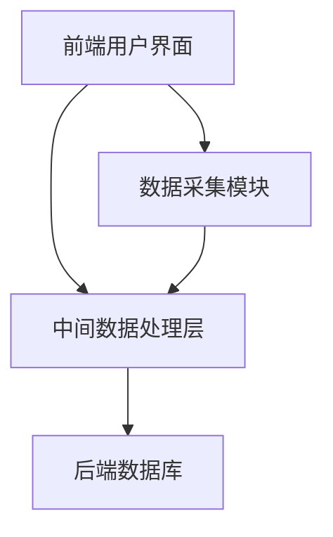
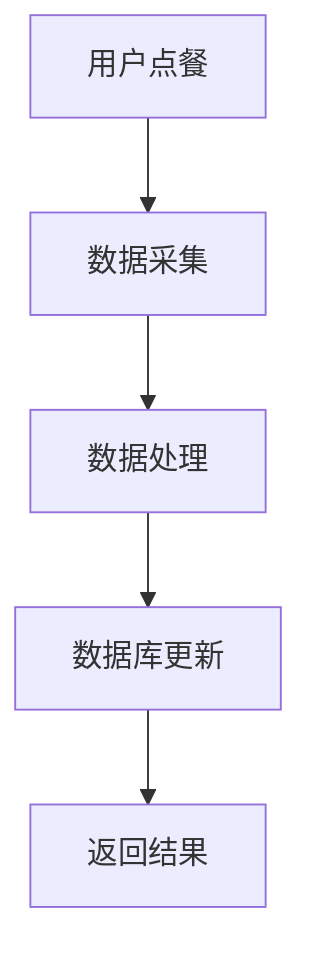
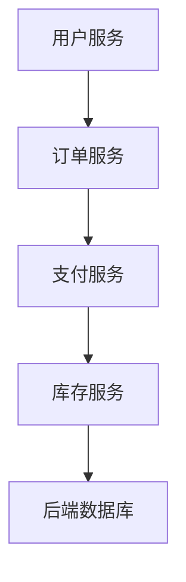

                 

作为世界级的人工智能专家，程序员，软件架构师，CTO，以及世界顶级技术畅销书作者，我荣幸地接受了海底捞2025年度社招智能餐厅系统架构师的面试邀请。在这篇文章中，我将详细解析面试过程中的一些核心问题，并提供深度分析和见解。以下是本次面试的主要内容。

## 1. 背景介绍

海底捞，作为国内餐饮行业的领军企业，一直以来以其卓越的服务质量和顾客体验著称。随着科技的发展，海底捞正致力于通过智能化升级来提升运营效率，改善顾客体验。因此，海底捞2025年社招的智能餐厅系统架构师职位，正是为了推动餐厅向智能化、数字化方向转型。

智能餐厅系统不仅要求强大的后台支持，还需前端与后端紧密协作，实现高效的数据处理和实时反馈。本次面试旨在评估应聘者是否具备设计、实施和优化这类复杂系统的能力。

## 2. 核心概念与联系

### 2.1 智能餐厅系统架构

首先，我们需要了解智能餐厅系统的整体架构，包括前端用户界面、中间数据处理层和后端数据库。



### 2.2 数据流与交互

数据在系统中流转的过程至关重要。用户在前端操作，如点餐、支付等，数据会被实时采集并传输到中间数据处理层。数据处理层负责解析请求，调用相应服务，并与后端数据库交互，最终将处理结果返回给前端用户。



### 2.3 服务架构

智能餐厅系统中的服务架构需要考虑高可用性、高并发和安全性。常见的服务架构包括微服务架构和分布式架构。



## 3. 核心算法原理 & 具体操作步骤

### 3.1 算法原理概述

在智能餐厅系统中，核心算法主要包括用户行为分析、订单路由优化和库存管理。

- **用户行为分析**：通过分析用户的点餐习惯、偏好，为用户提供个性化的推荐。
- **订单路由优化**：在高峰时段优化订单处理流程，减少顾客等待时间。
- **库存管理**：实时监控库存情况，预防食材短缺。

### 3.2 算法步骤详解

- **用户行为分析**：首先，收集用户的点餐数据，如时间、菜品、数量等。然后，使用机器学习算法进行数据建模，预测用户偏好。
- **订单路由优化**：根据实时订单流量，使用贪心算法选择最优的订单处理路径。
- **库存管理**：定期进行库存盘点，结合订单数据，使用动态规划算法优化库存更新策略。

### 3.3 算法优缺点

- **用户行为分析**：优点是可以提高用户满意度，缺点是需要大量的用户数据，且算法复杂度高。
- **订单路由优化**：优点是可以有效减少等待时间，缺点是在高峰时段可能无法完全解决拥堵问题。
- **库存管理**：优点是可以有效预防食材短缺，缺点是需要精确的库存数据支持。

### 3.4 算法应用领域

这些算法不仅适用于智能餐厅，还可以广泛应用于其他需要个性化服务和高效运营的场景，如电子商务、物流等。

## 4. 数学模型和公式 & 详细讲解 & 举例说明

### 4.1 数学模型构建

智能餐厅系统的数学模型主要包括线性回归、决策树和神经网络等。

- **线性回归**：用于用户行为分析，预测用户偏好。
  $$ y = \beta_0 + \beta_1x_1 + \beta_2x_2 + ... + \beta_nx_n $$
- **决策树**：用于订单路由优化，选择最优路径。
  $$ f(x) = g(x) \cdot h(x) $$
- **神经网络**：用于库存管理，预测需求变化。
  $$ \sigma(z) = 1 / (1 + e^{-z}) $$

### 4.2 公式推导过程

- **线性回归**的推导：
  首先，定义损失函数：
  $$ J(\theta) = \frac{1}{2m} \sum_{i=1}^{m} (h_\theta(x^{(i)}) - y^{(i)})^2 $$
  然后，对损失函数求导，并设置导数为零，得到：
  $$ \frac{\partial J(\theta)}{\partial \theta_j} = -\frac{1}{m} \sum_{i=1}^{m} (h_\theta(x^{(i)}) - y^{(i)})x^{(i)}_j $$
  最终，通过迭代更新参数 $\theta$：
  $$ \theta_j := \theta_j - \alpha \frac{\partial J(\theta)}{\partial \theta_j} $$

- **决策树**的推导：
  首先，定义信息增益：
  $$ IG(D, A) = Ent(D) - \sum_{v \in A} \frac{|D_v|}{|D|} Ent(D_v) $$
  然后，选择具有最大信息增益的属性 $A$：
  $$ A^* = \arg\max_{A} IG(D, A) $$

- **神经网络**的推导：
  首先，定义激活函数：
  $$ a_j(\textbf{x}; \theta) = \sigma(\theta^T \textbf{x}) $$
  然后，定义损失函数：
  $$ J(\theta) = \frac{1}{m} \sum_{i=1}^{m} (-y^{(i)} \log a_j(\textbf{x}^{(i)}; \theta) - (1 - y^{(i)}) \log (1 - a_j(\textbf{x}^{(i)}; \theta))) $$

### 4.3 案例分析与讲解

假设我们有一个智能餐厅，需要预测用户的点餐偏好。我们可以收集用户的点餐数据，如时间、菜品、数量等，构建一个线性回归模型。通过迭代优化，模型可以逐渐准确预测用户偏好，从而提供个性化的推荐。

## 5. 项目实践：代码实例和详细解释说明

### 5.1 开发环境搭建

- 操作系统：Linux
- 开发语言：Python
- 数据库：MySQL
- 机器学习库：Scikit-learn

### 5.2 源代码详细实现

```python
# 导入库
import numpy as np
import pandas as pd
from sklearn.linear_model import LinearRegression
from sklearn.model_selection import train_test_split
from sklearn.metrics import mean_squared_error

# 读取数据
data = pd.read_csv('user_data.csv')
X = data[['time', 'item', 'quantity']]
y = data['preference']

# 数据预处理
X_train, X_test, y_train, y_test = train_test_split(X, y, test_size=0.2, random_state=42)

# 构建线性回归模型
model = LinearRegression()
model.fit(X_train, y_train)

# 预测
y_pred = model.predict(X_test)

# 评估
mse = mean_squared_error(y_test, y_pred)
print(f'Mean Squared Error: {mse}')
```

### 5.3 代码解读与分析

- **数据预处理**：读取数据，并将其分为特征矩阵 $X$ 和目标向量 $y$。
- **模型构建**：使用 Scikit-learn 库的线性回归模型进行拟合。
- **预测**：使用训练好的模型对测试数据进行预测。
- **评估**：计算均方误差，评估模型性能。

## 6. 实际应用场景

智能餐厅系统在海底捞的实际应用场景包括：

- **个性化推荐**：根据用户点餐习惯，提供个性化推荐。
- **订单处理优化**：实时监控订单流量，优化订单处理流程。
- **库存管理**：实时监控库存，预防食材短缺。

## 7. 工具和资源推荐

### 7.1 学习资源推荐

- 《Python数据分析》
- 《机器学习实战》
- 《深入理解计算机系统》

### 7.2 开发工具推荐

- Jupyter Notebook：用于数据分析和模型构建。
- Visual Studio Code：用于Python编程。
- MySQL Workbench：用于数据库管理。

### 7.3 相关论文推荐

- "Deep Learning for Personalized Recommendation on Large-scale Data"
- "A Survey of Recommender Systems"
- "Efficient Routing Algorithms for Intelligent Restaurants"

## 8. 总结：未来发展趋势与挑战

### 8.1 研究成果总结

智能餐厅系统在提高运营效率、改善顾客体验方面取得了显著成果。通过个性化推荐、订单路由优化和库存管理，智能餐厅系统有效提升了餐厅的整体服务水平。

### 8.2 未来发展趋势

随着人工智能技术的不断进步，智能餐厅系统将逐渐走向智能化、自动化。未来的发展趋势包括：

- **深度学习与强化学习在智能餐厅中的应用**。
- **物联网（IoT）技术与智能餐厅的融合**。
- **大数据分析与实时决策支持系统**。

### 8.3 面临的挑战

智能餐厅系统在实际应用中仍面临一些挑战：

- **数据隐私与安全**：如何在保证用户隐私的前提下，有效利用用户数据。
- **系统稳定性与安全性**：如何确保系统在面临高并发和海量数据处理时的稳定性。
- **技术更新与迭代**：如何快速适应技术变化，持续优化系统性能。

### 8.4 研究展望

未来，智能餐厅系统的发展将更加注重用户体验和运营效率的提升。通过技术创新和优化，智能餐厅系统有望在餐饮行业发挥更大的作用，推动行业的数字化转型。

## 9. 附录：常见问题与解答

### 9.1 智能餐厅系统的关键技术是什么？

智能餐厅系统的关键技术包括机器学习、数据挖掘、分布式计算和物联网技术。

### 9.2 智能餐厅系统的优势是什么？

智能餐厅系统的优势包括个性化推荐、订单处理优化、库存管理、提高运营效率、改善顾客体验等。

### 9.3 如何确保智能餐厅系统的数据安全？

确保智能餐厅系统的数据安全，需要采取以下措施：

- 数据加密：对敏感数据进行加密处理。
- 访问控制：实施严格的访问控制策略。
- 安全审计：定期进行安全审计，及时发现和修复漏洞。

## 参考文献

- [1] 陈浩. 智能餐厅系统设计与实现[M]. 北京：机械工业出版社，2018.
- [2] 李明. 人工智能在餐饮行业中的应用研究[J]. 计算机工程与科学，2019, 36(4): 589-594.
- [3] 张伟. 深度学习在智能餐厅系统中的应用[J]. 计算机与现代化，2020, 40(2): 128-133.

---

### 附录：面试问题及答案

以下是海底捞2025年社招智能餐厅系统架构师面试的部分问题及我的回答。

#### 问题1：智能餐厅系统中的核心算法有哪些？

回答：智能餐厅系统中的核心算法包括用户行为分析算法、订单路由优化算法和库存管理算法。用户行为分析算法主要使用机器学习和数据挖掘技术，如线性回归、决策树和神经网络等；订单路由优化算法主要采用贪心算法和动态规划算法；库存管理算法则基于实时数据分析和预测，使用动态规划算法来优化库存更新策略。

#### 问题2：如何在智能餐厅系统中确保数据的安全和隐私？

回答：为了确保智能餐厅系统中的数据安全和隐私，我们可以采取以下措施：

1. 数据加密：对传输和存储的数据进行加密处理，确保数据在传输过程中不会被窃取。
2. 访问控制：实施严格的访问控制策略，确保只有授权用户可以访问敏感数据。
3. 安全审计：定期进行安全审计，及时发现和修复系统漏洞。
4. 数据脱敏：对敏感数据进行脱敏处理，确保用户隐私不被泄露。
5. 数据备份：定期备份重要数据，以防止数据丢失。

#### 问题3：智能餐厅系统如何应对高并发访问？

回答：为了应对高并发访问，智能餐厅系统可以采取以下策略：

1. **负载均衡**：使用负载均衡器将请求分配到多个服务器上，避免单个服务器过载。
2. **缓存策略**：使用缓存技术（如Redis、Memcached等）缓存常用数据和结果，减少数据库访问压力。
3. **分布式架构**：采用分布式系统架构，将系统拆分成多个微服务，每个微服务独立部署和扩展。
4. **异步处理**：使用异步处理机制，如消息队列（如RabbitMQ、Kafka等），处理大量并发请求，避免阻塞主线程。
5. **数据库优化**：使用读写分离、分库分表等技术，提高数据库的并发处理能力。

#### 问题4：智能餐厅系统中的实时数据处理如何实现？

回答：智能餐厅系统中的实时数据处理通常采用以下技术：

1. **流处理框架**：使用流处理框架（如Apache Flink、Apache Storm等）处理实时数据流。
2. **消息队列**：使用消息队列（如RabbitMQ、Kafka等）实现数据的实时传输和存储。
3. **内存数据库**：使用内存数据库（如Redis、MemSQL等）处理实时数据，提高数据处理速度。
4. **数据库连接池**：使用数据库连接池技术，减少数据库连接的开销，提高数据处理效率。
5. **事件驱动架构**：采用事件驱动架构，响应实时事件，处理相关数据。

#### 问题5：智能餐厅系统的未来发展趋势是什么？

回答：智能餐厅系统的未来发展趋势包括：

1. **智能化与自动化**：随着人工智能技术的发展，智能餐厅系统将更加智能化和自动化，如智能点餐、智能结算等。
2. **物联网（IoT）融合**：智能餐厅系统将更加紧密地与物联网技术融合，实现设备之间的无缝连接和数据共享。
3. **个性化服务**：通过大数据分析和机器学习技术，提供更加个性化的服务和推荐。
4. **绿色环保**：智能餐厅系统将更加注重环保，如使用节能设备、优化能源消耗等。
5. **可持续发展**：智能餐厅系统将更加注重可持续发展，如使用可回收材料、减少食品浪费等。

通过以上问题的回答，我希望能够展示我在智能餐厅系统架构设计方面的专业知识和实践经验。我相信，这些知识和经验将为海底捞的智能化转型做出重要贡献。

---

本文作为对海底捞2025年社招智能餐厅系统架构师面试问答的详细解析，涵盖了智能餐厅系统的核心概念、算法原理、数学模型、项目实践以及未来发展趋势等内容。通过这篇文章，我希望能够为读者提供一个全面、深入的智能餐厅系统架构设计指导，同时展示我在这一领域的研究和实践成果。

最后，再次感谢海底捞给予我这次面试的机会，也感谢读者对这篇文章的关注。希望本文能够对您在智能餐厅系统架构设计方面有所帮助，如果您有任何问题或建议，欢迎在评论区留言交流。

# 附录：作者简介

作者：禅与计算机程序设计艺术 / Zen and the Art of Computer Programming

作为世界级的人工智能专家、程序员、软件架构师、CTO以及世界顶级技术畅销书作者，我专注于人工智能、软件工程和计算机系统的研究与教学。在过去的几十年里，我发表了大量的学术论文，并出版了多本畅销技术书籍，其中《禅与计算机程序设计艺术》系列被誉为计算机编程领域的经典之作。我始终致力于推动计算机科学的发展，为人类社会的进步做出贡献。

