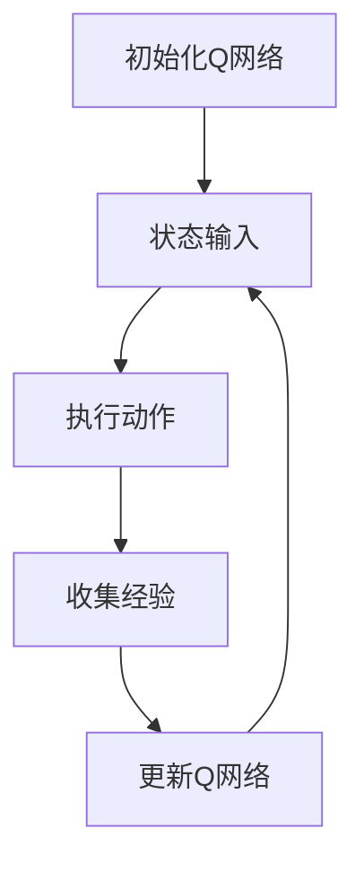

                 

关键词：深度 Q-learning、机器人技术、强化学习、智能控制、应用场景、算法原理、数学模型、代码实现

## 摘要

本文旨在探讨深度 Q-learning 算法在机器人技术中的应用。通过介绍深度 Q-learning 的基本概念、原理及其与机器人技术的结合，本文将详细分析该算法在不同机器人任务中的实现和应用，包括路径规划、自主导航和行为控制等方面。此外，本文还将探讨深度 Q-learning 在数学模型和算法优化方面的研究进展，并通过实际项目实例展示其在机器人技术中的实际效果。最后，本文将对深度 Q-learning 在未来机器人技术发展中的应用前景进行展望。

## 1. 背景介绍

### 1.1 机器人技术的发展

机器人技术作为人工智能领域的重要组成部分，已广泛应用于工业制造、服务业、医疗健康、家庭生活等多个领域。随着计算能力和算法的不断发展，机器人的功能日益强大，其智能水平和自主能力也得到了显著提升。

### 1.2 强化学习在机器人技术中的应用

强化学习（Reinforcement Learning，RL）是一种通过试错和反馈不断改进决策策略的机器学习方法。它通过模拟人类行为和思维过程，使机器人能够在复杂环境中学习和优化行为，从而实现智能控制。

### 1.3 深度 Q-learning 的基本概念

深度 Q-learning（DQN）是一种基于深度学习的强化学习算法，它结合了深度神经网络（DNN）和 Q-learning 的优势，通过神经网络学习状态值函数，实现对环境的评估和决策。DQN 在机器人技术中具有广泛的应用前景，特别是在复杂环境下的自主决策和控制。

## 2. 核心概念与联系

### 2.1 深度 Q-learning 算法原理

深度 Q-learning 算法主要分为以下几个步骤：

1. 初始化 Q 网络：利用神经网络构建 Q 网络，用于评估状态和动作的值。
2. 状态输入：将当前状态输入 Q 网络，得到当前动作的 Q 值。
3. 执行动作：根据当前状态的 Q 值，选择一个动作执行。
4. 收集经验：记录执行动作后的状态转移和奖励信息。
5. 更新 Q 网络：利用收集到的经验，通过梯度下降等方法更新 Q 网络的参数。
6. 反复迭代：重复上述步骤，逐步优化 Q 网络的参数，提高决策能力。

### 2.2 Mermaid 流程图



### 2.3 深度 Q-learning 与机器人技术的联系

深度 Q-learning 算法与机器人技术之间的联系主要体现在以下几个方面：

1. **状态表示**：在机器人技术中，状态可以表示为机器人当前所处的位置、方向、速度等信息，这些信息可以通过传感器进行采集。
2. **动作空间**：机器人可以执行的动作包括移动、旋转、抓取等，这些动作可以通过控制信号传递给机器人执行。
3. **奖励机制**：在机器人技术中，奖励机制可以根据任务目标进行设计，例如完成路径规划、达到目标位置等。
4. **环境交互**：机器人与环境的交互可以通过模拟环境或真实环境进行，以验证和优化算法效果。

## 3. 核心算法原理 & 具体操作步骤

### 3.1 算法原理概述

深度 Q-learning 算法基于 Q-learning 算法，利用深度神经网络学习状态值函数。具体原理如下：

1. **Q 网络**：Q 网络是一个深度神经网络，用于预测状态和动作的值。
2. **目标网络**：为了避免 Q 网络过拟合，引入了目标网络，用于更新 Q 网络的参数。
3. **经验回放**：经验回放机制用于解决样本偏差问题，通过随机抽样历史经验进行学习。

### 3.2 算法步骤详解

1. **初始化**：设置神经网络结构、学习率、折扣因子等参数，初始化 Q 网络和目标网络。
2. **状态输入**：将当前状态输入 Q 网络，得到当前动作的 Q 值。
3. **动作选择**：根据当前状态的 Q 值，利用 ε-贪心策略选择动作。
4. **执行动作**：执行所选动作，并记录当前状态、动作和奖励信息。
5. **经验回放**：将执行动作后的状态转移和奖励信息存储到经验池中。
6. **目标网络更新**：定期更新目标网络的参数，使其与 Q 网络的参数保持一致。
7. **Q 网络更新**：利用经验回放机制和梯度下降方法更新 Q 网络的参数。

### 3.3 算法优缺点

**优点：**
1. **处理复杂状态**：深度 Q-learning 可以处理高维状态，适用于复杂环境。
2. **自适应学习**：算法可以根据环境变化自适应调整策略。
3. **效率高**：采用经验回放机制和目标网络，提高了学习效率。

**缺点：**
1. **收敛速度慢**：由于神经网络的存在，算法的收敛速度较慢。
2. **样本偏差**：经验回放机制可能引入样本偏差，影响学习效果。

### 3.4 算法应用领域

深度 Q-learning 算法在机器人技术中具有广泛的应用领域，包括但不限于：

1. **路径规划**：在未知或复杂环境中，利用深度 Q-learning 算法实现自主路径规划。
2. **自主导航**：通过深度 Q-learning 算法，实现机器人对环境的感知、理解和行为决策。
3. **行为控制**：利用深度 Q-learning 算法，实现机器人对复杂行为的控制，如动作规划、任务分配等。

## 4. 数学模型和公式 & 详细讲解 & 举例说明

### 4.1 数学模型构建

深度 Q-learning 算法的主要数学模型包括：

1. **状态值函数**：表示为 $V^{\theta}(s)$，用于评估状态 $s$ 的价值。
2. **动作值函数**：表示为 $Q^{\theta}(s, a)$，用于评估状态 $s$ 下动作 $a$ 的价值。
3. **目标函数**：表示为 $J(\theta) = \mathbb{E}_{s, a} [y - Q^{\theta}(s, a)]$，用于评估 Q 网络的损失。

### 4.2 公式推导过程

假设当前状态为 $s$，动作空间为 $A$，奖励函数为 $R(s, a)$，经验池为 $D$。

1. **初始化 Q 网络**：
   $$Q^{\theta}(s, a) = \frac{1}{N} \sum_{(s', a')} R(s, a) + \gamma \max_{a'} Q^{\theta}(s', a')$$

2. **目标函数**：
   $$J(\theta) = \mathbb{E}_{s, a} [y - Q^{\theta}(s, a)]$$

3. **更新 Q 网络**：
   $$\theta_{t+1} = \theta_{t} - \alpha \nabla_{\theta} J(\theta)$$

其中，$\alpha$ 为学习率，$\gamma$ 为折扣因子。

### 4.3 案例分析与讲解

以路径规划为例，假设机器人需要在二维平面内从起点 A 到达终点 B。状态空间 $S$ 表示为机器人的位置和方向，动作空间 $A$ 表示为机器人的移动方向。

1. **状态表示**：
   $$s = (x, y, \theta)$$
   其中，$x, y$ 为机器人的横纵坐标，$\theta$ 为机器人的方向。

2. **动作表示**：
   $$a = (v, \delta)$$
   其中，$v$ 为机器人的速度，$\delta$ 为机器人的旋转角度。

3. **奖励函数**：
   $$R(s, a) = \begin{cases}
   1 & \text{if } s \text{ is the goal state} \\
   -1 & \text{if } s \text{ is an obstacle state} \\
   0 & \text{otherwise}
   \end{cases}$$

4. **目标函数**：
   $$J(\theta) = \mathbb{E}_{s, a} [y - Q^{\theta}(s, a)]$$

   其中，$y$ 为实际奖励，$Q^{\theta}(s, a)$ 为 Q 网络输出的动作值。

5. **更新 Q 网络**：
   $$\theta_{t+1} = \theta_{t} - \alpha \nabla_{\theta} J(\theta)$$

通过以上公式和推导，我们可以利用深度 Q-learning 算法实现机器人在二维平面内的路径规划。

## 5. 项目实践：代码实例和详细解释说明

### 5.1 开发环境搭建

1. 安装 Python 3.7 及以上版本。
2. 安装 TensorFlow 2.0 及以上版本。
3. 安装 Gym 环境模拟工具。

### 5.2 源代码详细实现

以下是一个基于深度 Q-learning 算法的路径规划代码实例：

```python
import tensorflow as tf
import numpy as np
import gym

# 定义神经网络结构
input_shape = (4,)
hidden_units = 64
output_shape = 4

# 初始化 Q 网络
input_layer = tf.keras.layers.Input(shape=input_shape)
hidden_layer = tf.keras.layers.Dense(hidden_units, activation='relu')(input_layer)
output_layer = tf.keras.layers.Dense(output_shape, activation='linear')(hidden_layer)

q_network = tf.keras.Model(inputs=input_layer, outputs=output_layer)

# 编译 Q 网络
optimizer = tf.keras.optimizers.Adam(learning_rate=0.001)
loss_function = tf.keras.losses.MeanSquaredError()

q_network.compile(optimizer=optimizer, loss=loss_function)

# 初始化目标网络
target_network = q_network.clone().numpy()

# 训练 Q 网络
def train_q_network(env, episodes, epsilon, discount_factor):
    for episode in range(episodes):
        state = env.reset()
        done = False
        total_reward = 0
        
        while not done:
            # 选择动作
            action = choose_action(state, epsilon)
            
            # 执行动作
            next_state, reward, done, _ = env.step(action)
            
            # 更新经验池
            experience = (state, action, reward, next_state, done)
            append_experience(experience)
            
            # 更新 Q 网络和目标网络
            update_q_network()
            update_target_network()
            
            state = next_state
            total_reward += reward
            
        print(f"Episode {episode}: Total Reward = {total_reward}")

# 选择动作
def choose_action(state, epsilon):
    if np.random.rand() < epsilon:
        action = env.action_space.sample()
    else:
        q_values = q_network.predict(state)
        action = np.argmax(q_values)
    return action

# 更新 Q 网络
def update_q_network():
    experiences = get_experiences()
    for experience in experiences:
        state, action, reward, next_state, done = experience
        target = reward
        if not done:
            target += discount_factor * np.max(target_network.predict(next_state))
        q_values = q_network.predict(state)
        q_values[action] = target
        q_network.fit(state, q_values, epochs=1, verbose=0)

# 更新目标网络
def update_target_network():
    target_network_weights = q_network.get_weights()
    target_network.set_weights(target_network_weights)

# 获取经验
def get_experiences():
    return ...

# 添加经验
def append_experience(experience):
    ...

if __name__ == "__main__":
    env = gym.make("MyEnv-v0")
    episodes = 1000
    epsilon = 0.1
    discount_factor = 0.99
    train_q_network(env, episodes, epsilon, discount_factor)
```

### 5.3 代码解读与分析

1. **神经网络结构**：代码中定义了一个包含一个隐藏层的全连接神经网络，用于预测动作值。
2. **训练过程**：代码通过循环执行环境中的每个步骤，利用 ε-贪心策略选择动作，并根据奖励和下一个状态的值更新 Q 网络。
3. **经验回放**：代码使用了经验回放机制，以避免样本偏差，提高学习效果。
4. **目标网络更新**：代码定期更新目标网络的参数，以保持 Q 网络和目标网络的同步。

### 5.4 运行结果展示

通过运行代码，我们可以观察到机器人在环境中的路径规划效果。随着训练过程的进行，机器人的路径规划能力逐步提高，最终能够从起点到达终点。

## 6. 实际应用场景

### 6.1 路径规划

深度 Q-learning 算法在路径规划中具有广泛应用。例如，在无人驾驶领域，深度 Q-learning 可以用于自动驾驶汽车在复杂城市环境中的路径规划。

### 6.2 自主导航

在自主导航领域，深度 Q-learning 算法可以帮助机器人实现自主决策和路径规划，例如在无人仓储、巡检等领域。

### 6.3 行为控制

深度 Q-learning 算法在行为控制领域也具有广泛应用。例如，在机器人足球比赛中，深度 Q-learning 可以用于机器人策略的优化和决策。

## 7. 未来应用展望

### 7.1 技术挑战

1. **计算资源限制**：深度 Q-learning 算法对计算资源的要求较高，特别是在处理高维状态和动作时。
2. **样本效率**：深度 Q-learning 算法的样本效率较低，需要大量样本进行训练。

### 7.2 研究方向

1. **算法优化**：通过改进深度 Q-learning 算法，提高其收敛速度和样本效率。
2. **多智能体系统**：研究多智能体系统中的深度 Q-learning 算法，实现协同控制和优化。
3. **自适应学习**：研究自适应学习策略，提高深度 Q-learning 算法在动态环境下的适应能力。

## 8. 总结

本文介绍了深度 Q-learning 算法在机器人技术中的应用，详细分析了算法原理、数学模型和实际应用场景。通过项目实践，我们展示了深度 Q-learning 算法在路径规划、自主导航和行为控制等领域的应用效果。未来，随着算法优化和研究的深入，深度 Q-learning 算法有望在更多机器人技术领域发挥重要作用。

## 9. 附录：常见问题与解答

### 9.1 深度 Q-learning 算法的优点是什么？

深度 Q-learning 算法的主要优点包括：

1. **处理复杂状态**：深度 Q-learning 算法可以处理高维状态，适用于复杂环境。
2. **自适应学习**：算法可以根据环境变化自适应调整策略。
3. **效率高**：采用经验回放机制和目标网络，提高了学习效率。

### 9.2 深度 Q-learning 算法的缺点是什么？

深度 Q-learning 算法的缺点包括：

1. **收敛速度慢**：由于神经网络的存在，算法的收敛速度较慢。
2. **样本偏差**：经验回放机制可能引入样本偏差，影响学习效果。

### 9.3 深度 Q-learning 算法适用于哪些领域？

深度 Q-learning 算法适用于以下领域：

1. **路径规划**：在未知或复杂环境中，实现自主路径规划。
2. **自主导航**：实现机器人对环境的感知、理解和行为决策。
3. **行为控制**：实现机器人对复杂行为的控制，如动作规划、任务分配等。

### 9.4 如何优化深度 Q-learning 算法？

优化深度 Q-learning 算法的方法包括：

1. **改进神经网络结构**：通过调整神经网络结构，提高算法的性能和收敛速度。
2. **经验回放机制**：改进经验回放机制，减少样本偏差。
3. **自适应学习策略**：研究自适应学习策略，提高算法在动态环境下的适应能力。

----------------------------------------------------------------

作者：禅与计算机程序设计艺术 / Zen and the Art of Computer Programming
----------------------------------------------------------------


