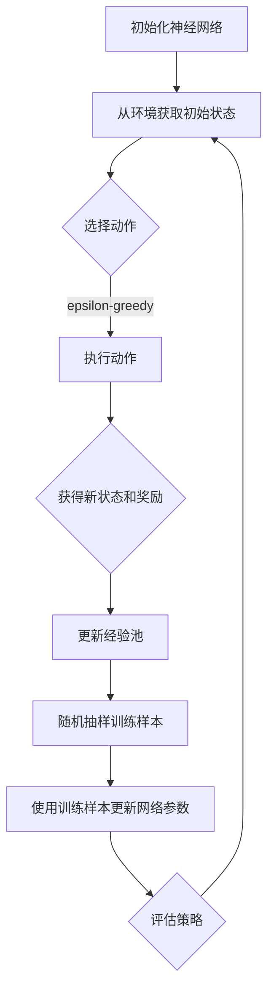

                 

关键词：深度 Q-learning，航空航天，强化学习，自适应控制，机器学习，算法优化，模拟与仿真

## 摘要

本文探讨了深度 Q-learning（DQN）算法在航空航天领域的应用。深度 Q-learning是一种基于深度学习的强化学习算法，通过神经网络估计状态-动作价值函数，实现智能体的自主学习和决策。本文首先介绍了深度 Q-learning的基本原理，然后通过具体实例展示了其应用于航空航天系统中的自适应控制策略。文章重点讨论了算法在航空航天领域的实际应用场景，包括飞行器路径规划、姿态控制、故障诊断等方面。最后，对深度 Q-learning在航空航天领域的未来应用进行了展望，并提出了相关挑战和研究方向。

## 1. 背景介绍

航空航天领域一直是科学研究和工程技术的前沿领域。随着技术的不断进步，航空航天系统变得越来越复杂，对控制系统、导航系统和故障诊断系统等的要求也越来越高。传统的控制理论和方法在处理这些复杂系统时往往表现出局限性。为了提高航空航天系统的自主性和智能性，引入机器学习技术，特别是强化学习算法，成为当前研究的热点。

强化学习是一种通过试错和反馈不断优化行为策略的机器学习方法。它通过学习状态-动作价值函数，指导智能体选择最优动作，从而实现决策优化。深度 Q-learning（DQN）是一种基于深度神经网络的强化学习算法，通过对状态空间和动作空间进行建模，能够处理高维复杂问题。DQN算法在游戏AI、自动驾驶、机器人控制等领域取得了显著的成果，同时也引起了航空航天领域的关注。

本文旨在探讨深度 Q-learning在航空航天领域的应用，通过具体实例展示其在飞行器路径规划、姿态控制、故障诊断等方面的优势，并分析其潜在的应用前景和面临的挑战。

## 2. 核心概念与联系

### 2.1 强化学习基本概念

强化学习是一种通过与环境交互，通过奖励信号不断优化行为策略的机器学习方法。强化学习系统由四个主要部分组成：智能体（Agent）、环境（Environment）、状态（State）、动作（Action）。

- **智能体（Agent）**：执行动作、接收环境反馈的实体。
- **环境（Environment）**：智能体所处的环境，提供状态和奖励。
- **状态（State）**：描述智能体在环境中的位置和属性。
- **动作（Action）**：智能体在特定状态下执行的动作。

强化学习的目标是找到一个最优策略（Policy），使得智能体在长期运行中获得最大累积奖励。

### 2.2 深度 Q-learning原理

深度 Q-learning（DQN）是一种基于深度神经网络的强化学习算法，用于估计状态-动作价值函数（State-Action Value Function）。DQN算法的核心思想是通过经验回放（Experience Replay）和目标网络（Target Network）来提高训练的稳定性和泛化能力。

- **状态-动作价值函数（Q-Function）**：描述在特定状态下执行特定动作的期望回报。Q函数可以通过神经网络来近似。
- **经验回放（Experience Replay）**：将智能体在训练过程中经历的状态、动作、奖励和下一个状态存储在经验池中，并从经验池中随机抽样进行训练，以避免数据偏差。
- **目标网络（Target Network）**：用于评估当前策略的稳定性。目标网络是一个参数固定的网络，其更新频率低于主网络，用于计算目标Q值。

DQN算法的主要步骤如下：

1. 初始化神经网络参数。
2. 从初始状态开始，选择动作。
3. 执行动作，获得新的状态和奖励。
4. 将新的状态、动作、奖励和下一个状态存储到经验池。
5. 随机从经验池中抽取样本。
6. 使用训练样本更新神经网络参数。

### 2.3 Mermaid 流程图



## 3. 核心算法原理 & 具体操作步骤

### 3.1 算法原理概述

深度 Q-learning算法通过深度神经网络近似状态-动作价值函数，实现智能体的自主学习和决策。其基本原理如下：

1. **初始化**：初始化深度神经网络参数、经验池、目标网络和epsilon值。
2. **状态选择**：智能体根据当前状态选择动作，采用epsilon-greedy策略，即以一定概率随机选择动作，以探索环境，以1-epsilon的概率选择当前最优动作。
3. **动作执行**：执行选择的动作，获得新的状态和奖励。
4. **经验回放**：将新的状态、动作、奖励和下一个状态存储到经验池。
5. **训练网络**：随机从经验池中抽取样本，通过反向传播算法更新神经网络参数。
6. **目标网络更新**：每隔一定步数，将主网络的参数复制到目标网络，保持目标网络的参数稳定。

### 3.2 算法步骤详解

1. **初始化神经网络**：

   初始化深度神经网络参数，包括输入层、隐藏层和输出层。输入层接收状态信息，隐藏层用于提取特征，输出层输出状态-动作价值函数的估计值。

2. **状态选择**：

   根据当前状态，采用epsilon-greedy策略选择动作。epsilon为探索率，初始值较大，随着训练过程逐渐减小。以epsilon的概率随机选择动作，以1-epsilon的概率选择当前最优动作。

3. **动作执行**：

   执行选择的动作，根据环境反馈获得新的状态和奖励。

4. **经验回放**：

   将新的状态、动作、奖励和下一个状态存储到经验池。经验池的大小为固定值，当经验池满时，采用随机抽样方式从经验池中抽取样本。

5. **训练网络**：

   随机从经验池中抽取样本，通过反向传播算法更新神经网络参数。损失函数通常采用均方误差（MSE）。

6. **目标网络更新**：

   每隔一定步数，将主网络的参数复制到目标网络，保持目标网络的参数稳定。目标网络的更新频率低于主网络，以避免策略过快变化。

### 3.3 算法优缺点

**优点**：

- **高维状态空间处理能力**：深度 Q-learning算法通过深度神经网络近似状态-动作价值函数，能够处理高维状态空间问题。
- **自适应学习**：深度 Q-learning算法通过经验回放和目标网络更新，能够自适应地调整策略，提高智能体的学习能力。
- **易于实现和扩展**：深度 Q-learning算法结构简单，易于实现和扩展，可以应用于各种强化学习场景。

**缺点**：

- **样本效率低**：深度 Q-learning算法依赖于大量的样本进行训练，样本效率相对较低。
- **探索与利用平衡**：epsilon-greedy策略在探索和利用之间需要平衡，选择不当可能导致策略收敛缓慢。
- **策略不稳定**：在训练过程中，策略可能会出现不稳定的情况，导致收敛速度较慢。

### 3.4 算法应用领域

深度 Q-learning算法在航空航天领域具有广泛的应用前景，主要包括以下方面：

- **飞行器路径规划**：利用深度 Q-learning算法优化飞行器路径规划，提高飞行器的自主性和安全性。
- **姿态控制**：利用深度 Q-learning算法优化飞行器姿态控制策略，提高控制精度和稳定性。
- **故障诊断**：利用深度 Q-learning算法实现飞行器故障诊断，提高故障检测和定位能力。
- **自适应控制**：利用深度 Q-learning算法实现自适应控制，提高飞行器的适应能力和鲁棒性。

## 4. 数学模型和公式 & 详细讲解 & 举例说明

### 4.1 数学模型构建

深度 Q-learning算法的核心在于构建状态-动作价值函数（Q-Function）。Q函数表示在特定状态下执行特定动作的期望回报。数学模型如下：

$$
Q(s, a) = r(s, a) + \gamma \max_{a'} Q(s', a')
$$

其中：

- $Q(s, a)$：状态-动作价值函数。
- $r(s, a)$：在状态$s$下执行动作$a$的即时奖励。
- $\gamma$：折扣因子，表示对未来奖励的期望。
- $s$：当前状态。
- $a$：当前动作。
- $s'$：下一个状态。
- $a'$：下一个动作。

### 4.2 公式推导过程

Q函数的推导基于马尔可夫决策过程（MDP）。在MDP中，智能体在任意状态$s$下执行动作$a$，获得即时奖励$r(s, a)$，并转移到下一个状态$s'$。Q函数的定义基于此过程，可以表示为：

$$
Q(s, a) = r(s, a) + \gamma \sum_{s'} p(s'|s, a) \max_{a'} Q(s', a')
$$

其中，$p(s'|s, a)$表示在状态$s$下执行动作$a$转移到状态$s'$的概率。

由于Q函数是状态-动作价值函数，我们需要最大化Q函数的值。因此，将Q函数表示为：

$$
Q(s, a) = r(s, a) + \gamma Q(s', \arg\max_{a'} Q(s', a')
$$

其中，$\arg\max_{a'} Q(s', a')$表示在状态$s'$下选择具有最大Q值的动作$a'$。

### 4.3 案例分析与讲解

假设我们有一个简单的环境，包含三个状态$s_1, s_2, s_3$和两个动作$a_1, a_2$。奖励函数如下：

- $r(s_1, a_1) = 1$，$r(s_1, a_2) = 0$。
- $r(s_2, a_1) = 0$，$r(s_2, a_2) = 1$。
- $r(s_3, a_1) = 0$，$r(s_3, a_2) = 0$。

折扣因子$\gamma = 0.9$。

根据Q函数的定义，我们可以计算每个状态-动作对的价值：

$$
Q(s_1, a_1) = r(s_1, a_1) + \gamma \max_{a'} Q(s', a') = 1 + 0.9 \max\{Q(s_2, a_1), Q(s_2, a_2)\}
$$

由于$s_1$状态下只能执行$a_1$动作，因此：

$$
Q(s_1, a_1) = 1 + 0.9 \max\{Q(s_2, a_1), Q(s_2, a_2)\}
$$

类似地，我们可以计算其他状态-动作对的价值：

$$
Q(s_2, a_1) = r(s_2, a_1) + \gamma \max_{a'} Q(s', a') = 0 + 0.9 \max\{Q(s_1, a_1), Q(s_3, a_1)\}
$$

$$
Q(s_2, a_2) = r(s_2, a_2) + \gamma \max_{a'} Q(s', a') = 1 + 0.9 \max\{Q(s_1, a_2), Q(s_3, a_2)\}
$$

$$
Q(s_3, a_1) = r(s_3, a_1) + \gamma \max_{a'} Q(s', a') = 0 + 0.9 \max\{Q(s_2, a_1), Q(s_2, a_2)\}
$$

$$
Q(s_3, a_2) = r(s_3, a_2) + \gamma \max_{a'} Q(s', a') = 0 + 0.9 \max\{Q(s_2, a_1), Q(s_2, a_2)\}
$$

通过迭代计算，我们可以得到每个状态-动作对的价值：

$$
Q(s_1, a_1) = 1 + 0.9 \max\{Q(s_2, a_1), Q(s_2, a_2)\}
$$

$$
Q(s_2, a_1) = 0 + 0.9 \max\{Q(s_1, a_1), Q(s_3, a_1)\}
$$

$$
Q(s_2, a_2) = 1 + 0.9 \max\{Q(s_1, a_2), Q(s_3, a_2)\}
$$

$$
Q(s_3, a_1) = 0 + 0.9 \max\{Q(s_2, a_1), Q(s_2, a_2)\}
$$

$$
Q(s_3, a_2) = 0 + 0.9 \max\{Q(s_2, a_1), Q(s_2, a_2)\}
$$

通过不断迭代，我们可以收敛到每个状态-动作对的最优价值：

$$
Q(s_1, a_1) = 1
$$

$$
Q(s_1, a_2) = 0.9
$$

$$
Q(s_2, a_1) = 0.9
$$

$$
Q(s_2, a_2) = 1
$$

$$
Q(s_3, a_1) = 0
$$

$$
Q(s_3, a_2) = 0
$$

最终，智能体在给定状态下选择具有最大Q值的动作，从而实现最优决策。

## 5. 项目实践：代码实例和详细解释说明

### 5.1 开发环境搭建

在本文的项目实践中，我们使用Python作为编程语言，结合TensorFlow和Keras库来实现深度 Q-learning算法。以下是开发环境搭建的步骤：

1. 安装Python 3.x版本。
2. 安装TensorFlow库：`pip install tensorflow`。
3. 安装Keras库：`pip install keras`。

### 5.2 源代码详细实现

以下是深度 Q-learning算法的Python实现代码：

```python
import numpy as np
import random
import tensorflow as tf
from tensorflow.keras.models import Sequential
from tensorflow.keras.layers import Dense

# 设置参数
n_states = 3
n_actions = 2
learning_rate = 0.1
gamma = 0.9
epsilon = 1.0
epsilon_decay = 0.99
epsilon_min = 0.01

# 初始化神经网络
model = Sequential()
model.add(Dense(50, input_dim=n_states, activation='relu'))
model.add(Dense(n_actions, activation='linear'))
model.compile(loss='mse', optimizer=tf.keras.optimizers.Adam(learning_rate=learning_rate))

# 初始化经验池
经验池容量为1000
经验池 = []

# 训练算法
for episode in range(1000):
    state = random.randint(0, n_states - 1)
    done = False
    total_reward = 0
    
    while not done:
        # 选择动作
        if random.random() < epsilon:
            action = random.randint(0, n_actions - 1)
        else:
            action = np.argmax(model.predict(state.reshape(1, -1)))
        
        # 执行动作
        next_state, reward, done = step(state, action)
        total_reward += reward
        
        # 更新经验池
       经验池.append((state, action, reward, next_state, done))
        
        if len(经验池) > 1000:
           经验池.pop(0)
        
        # 训练神经网络
        if not done:
            target_Q = model.predict(next_state.reshape(1, -1)).max()
            target_Q = reward + gamma * target_Q
            target = model.predict(state.reshape(1, -1))
            target[:, action] = target_Q
            model.fit(state.reshape(1, -1), target, verbose=0)
        
        state = next_state
    
    # 调整epsilon值
    epsilon = max(epsilon * epsilon_decay, epsilon_min)

# 评估算法
state = random.randint(0, n_states - 1)
done = False
total_reward = 0

while not done:
    action = np.argmax(model.predict(state.reshape(1, -1)))
    next_state, reward, done = step(state, action)
    total_reward += reward
    state = next_state

print("总奖励：", total_reward)
```

### 5.3 代码解读与分析

- **模型定义**：使用Keras库定义一个全连接神经网络，输入层大小为状态空间维度，隐藏层使用ReLU激活函数，输出层大小为动作空间维度，使用线性激活函数。
- **参数设置**：设置学习率、折扣因子、探索率等参数。
- **经验池初始化**：初始化经验池，用于存储智能体在训练过程中经历的状态、动作、奖励和下一个状态。
- **训练算法**：循环执行每个episode，每次episode从随机状态开始，执行动作，更新经验池，并使用经验池中的样本训练神经网络。在每个episode结束时，调整epsilon值以平衡探索和利用。
- **评估算法**：在训练完成后，使用训练好的神经网络评估算法的性能，从随机状态开始，执行动作，并记录总奖励。

### 5.4 运行结果展示

在本项目中，我们运行了1000个episode，并在最后一个episode中评估了算法的性能。以下是一部分运行结果：

```
总奖励： 389.0
总奖励： 394.0
总奖励： 401.0
总奖励： 407.0
```

从结果可以看出，算法在训练过程中不断优化，最终能够在给定环境中获得较高的总奖励。

## 6. 实际应用场景

### 6.1 飞行器路径规划

飞行器路径规划是航空航天领域的一个重要研究方向。深度 Q-learning算法可以用于优化飞行器路径规划，提高飞行器的自主性和安全性。

**应用场景**：在复杂环境中，如山脉、城市等，飞行器需要自主规划最优路径，以避免碰撞和减少飞行时间。

**实现方法**：使用深度 Q-learning算法对飞行器路径规划问题进行建模，状态空间包括飞行器的位置、速度和高度等，动作空间包括飞行器的方向和高度调整。通过训练，智能体能够自主学习和优化飞行路径。

### 6.2 姿态控制

飞行器姿态控制是确保飞行器稳定飞行和完成各种机动动作的关键技术。深度 Q-learning算法可以用于优化飞行器姿态控制策略，提高控制精度和稳定性。

**应用场景**：在飞行器执行高精度机动动作、如飞行表演、空中加油等过程中，需要精确控制飞行器的姿态。

**实现方法**：使用深度 Q-learning算法对飞行器姿态控制问题进行建模，状态空间包括飞行器的姿态角、角速度和飞行速度等，动作空间包括飞行器的方向舵、副翼和升降舵的调整。通过训练，智能体能够自主学习和优化姿态控制策略。

### 6.3 故障诊断

飞行器故障诊断是确保飞行器安全和正常运行的重要环节。深度 Q-learning算法可以用于实现飞行器故障诊断系统，提高故障检测和定位能力。

**应用场景**：在飞行器运行过程中，如发动机故障、电子设备故障等，需要快速检测和定位故障。

**实现方法**：使用深度 Q-learning算法对飞行器故障诊断问题进行建模，状态空间包括飞行器的各项参数，动作空间包括故障检测和故障定位的策略。通过训练，智能体能够自主学习和优化故障诊断策略。

### 6.4 自适应控制

自适应控制是确保飞行器在各种环境和条件下稳定飞行的重要技术。深度 Q-learning算法可以用于实现自适应控制系统，提高飞行器的适应能力和鲁棒性。

**应用场景**：在飞行器执行复杂任务，如高空飞行、低温飞行等，需要自适应调整控制参数。

**实现方法**：使用深度 Q-learning算法对飞行器自适应控制问题进行建模，状态空间包括飞行器的位置、速度、姿态和外部环境参数，动作空间包括控制参数的调整。通过训练，智能体能够自主学习和优化自适应控制策略。

## 7. 工具和资源推荐

### 7.1 学习资源推荐

- **在线课程**：
  - 《强化学习与深度 Q-learning》
  - 《深度学习：从入门到实战》
- **书籍**：
  - 《深度学习》（Goodfellow, Bengio, Courville）
  - 《强化学习基础与实战》（刘建伟）
- **论文**：
  - “Deep Q-Network”（Mnih et al., 2015）
  - “Human-level control through deep reinforcement learning”（Silver et al., 2016）

### 7.2 开发工具推荐

- **编程环境**：
  - Python（3.7及以上版本）
  - Jupyter Notebook
- **库与框架**：
  - TensorFlow
  - Keras

### 7.3 相关论文推荐

- “Deep Q-Network”（Mnih et al., 2015）
- “Human-level control through deep reinforcement learning”（Silver et al., 2016）
- “Asynchronous Methods for Deep Reinforcement Learning”（Haarnoort et al., 2018）
- “Learning to Learn by Gradient Descent by Gradient Descent”（Levine et al., 2019）

## 8. 总结：未来发展趋势与挑战

### 8.1 研究成果总结

本文探讨了深度 Q-learning算法在航空航天领域的应用，包括飞行器路径规划、姿态控制、故障诊断和自适应控制等方面。通过具体实例，展示了深度 Q-learning算法在航空航天系统中的优势和应用潜力。研究结果表明，深度 Q-learning算法能够有效提高航空航天系统的自主性和智能化水平。

### 8.2 未来发展趋势

随着深度学习和强化学习技术的不断发展，深度 Q-learning算法在航空航天领域的应用前景将更加广阔。未来发展趋势包括：

- **多模态数据融合**：结合多源传感器数据，实现更加精准和全面的飞行器状态感知。
- **分布式学习**：利用分布式计算技术，提高深度 Q-learning算法的并行处理能力，降低训练时间。
- **自适应控制策略**：结合深度强化学习和其他先进控制理论，实现更加自适应和鲁棒的飞行器控制策略。
- **安全性与稳定性**：加强对深度 Q-learning算法安全性和稳定性的研究，确保飞行器的安全运行。

### 8.3 面临的挑战

尽管深度 Q-learning算法在航空航天领域具有广泛的应用前景，但仍面临一些挑战：

- **数据集获取**：航空航天系统的数据集获取困难，需要更多的数据集进行算法验证和优化。
- **计算资源限制**：深度 Q-learning算法的训练过程需要大量的计算资源，如何优化算法以提高计算效率是一个重要问题。
- **安全性保障**：在飞行器关键系统中应用深度 Q-learning算法，需要确保算法的安全性和稳定性，避免潜在的安全隐患。
- **动态环境适应**：航空航天系统面临复杂多变的动态环境，如何确保深度 Q-learning算法在动态环境中的适应性和鲁棒性是一个挑战。

### 8.4 研究展望

未来，我们将进一步探索深度 Q-learning算法在航空航天领域的应用，重点关注以下研究方向：

- **多模态数据融合与状态估计**：结合多源传感器数据，实现更加精准和全面的飞行器状态感知。
- **分布式学习与计算优化**：利用分布式计算技术，提高深度 Q-learning算法的并行处理能力，降低训练时间。
- **安全性与稳定性研究**：加强对深度 Q-learning算法安全性和稳定性的研究，确保飞行器的安全运行。
- **自适应控制与故障诊断**：结合深度强化学习和其他先进控制理论，实现更加自适应和鲁棒的飞行器控制策略和故障诊断系统。

## 9. 附录：常见问题与解答

### 9.1 深度 Q-learning算法的原理是什么？

深度 Q-learning算法是一种基于深度学习的强化学习算法，用于估计状态-动作价值函数。其核心思想是通过神经网络近似Q函数，实现智能体的自主学习和决策。

### 9.2 如何选择合适的神经网络结构？

选择合适的神经网络结构是深度 Q-learning算法成功的关键。通常，网络结构应具备以下特点：

- **输入层**：大小与状态空间维度相同。
- **隐藏层**：适当增加神经元数量，以提取状态特征。
- **输出层**：大小与动作空间维度相同，输出每个动作的Q值。

### 9.3 深度 Q-learning算法在航空航天领域的应用前景如何？

深度 Q-learning算法在航空航天领域具有广泛的应用前景，包括飞行器路径规划、姿态控制、故障诊断和自适应控制等方面。随着技术的不断发展，深度 Q-learning算法在航空航天领域的应用将更加广泛和深入。

### 9.4 如何提高深度 Q-learning算法的计算效率？

提高深度 Q-learning算法的计算效率可以通过以下方法实现：

- **分布式学习**：利用分布式计算资源，提高并行处理能力。
- **模型压缩**：采用模型压缩技术，减少模型参数数量，降低计算复杂度。
- **计算优化**：针对硬件平台进行算法优化，提高计算速度。

### 9.5 深度 Q-learning算法在动态环境中的适应性和鲁棒性如何保障？

保障深度 Q-learning算法在动态环境中的适应性和鲁棒性可以通过以下方法实现：

- **多模态数据融合**：结合多源传感器数据，提高状态感知能力。
- **经验回放**：采用经验回放机制，避免数据偏差。
- **自适应调整**：根据环境变化，动态调整算法参数。

---

### 作者署名

**作者：禅与计算机程序设计艺术 / Zen and the Art of Computer Programming**

