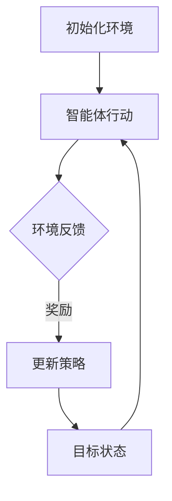

                 

关键词：深度 Q-learning，色彩推荐，机器学习，强化学习，算法应用

摘要：本文将探讨深度 Q-learning 算法在色彩推荐领域的应用。通过分析算法的基本原理和具体实现步骤，我们将展示如何利用深度 Q-learning 实现高效的色彩推荐系统，并提供相关的数学模型和项目实践实例，以期为相关领域的研究和开发提供参考。

## 1. 背景介绍

随着互联网技术的快速发展，个性化推荐系统逐渐成为各个领域的研究热点。在色彩推荐领域，如何根据用户的偏好和历史行为，为用户推荐合适的颜色方案，已成为一项重要的研究课题。传统的推荐算法往往依赖于规则和统计方法，难以应对复杂多变的用户偏好和多样化的问题场景。因此，探索更有效的推荐算法，特别是基于机器学习的算法，对于提高推荐系统的性能具有重要意义。

在机器学习算法中，深度 Q-learning（Deep Q-Learning）作为一种强化学习算法，在处理复杂决策问题时表现出色。它通过模拟智能体的行为，不断优化策略，从而实现最佳决策。近年来，深度 Q-learning 在游戏、自动驾驶、推荐系统等领域取得了显著的应用成果。本文将介绍深度 Q-learning 算法在色彩推荐中的应用，旨在为相关领域的研究和开发提供一种新的思路。

## 2. 核心概念与联系

### 2.1 深度 Q-learning 算法概述

深度 Q-learning 是一种基于值函数的强化学习算法，通过学习状态值函数来优化策略。具体来说，它利用深度神经网络（DNN）来近似值函数，从而在复杂的环境中实现最优决策。

### 2.2 色彩推荐问题建模

在色彩推荐问题中，我们可以将用户、颜色方案和偏好视为一个三元组。用户状态由用户的历史行为和偏好信息组成，颜色方案是一个颜色集合，偏好表示用户对不同颜色方案的喜好程度。目标是通过学习用户的状态和偏好，为用户推荐一个合适的颜色方案。

### 2.3 Mermaid 流程图

下面是深度 Q-learning 算法在色彩推荐问题中的 Mermaid 流程图：



### 2.4 核心概念与联系总结

通过上述分析，我们可以看出，深度 Q-learning 算法在色彩推荐问题中，通过智能体行动、环境反馈和策略更新等步骤，不断优化推荐策略，从而实现个性化色彩推荐。

## 3. 核心算法原理 & 具体操作步骤

### 3.1 算法原理概述

深度 Q-learning 算法的主要原理是通过学习值函数来优化策略。值函数表示在给定状态下，执行特定动作的期望奖励。具体来说，深度 Q-learning 算法包括以下几个关键步骤：

1. 初始化：初始化网络参数和 Q 值表。
2. 行动选择：根据当前状态选择一个动作。
3. 环境反馈：执行选定的动作，获取状态转移和奖励。
4. 更新策略：根据新状态和奖励更新 Q 值。
5. 重复步骤 2-4，直到达到目标状态或满足停止条件。

### 3.2 算法步骤详解

#### 3.2.1 初始化

初始化网络参数和 Q 值表。Q 值表用于存储状态值函数，初始化时可以采用随机初始化或零初始化。

#### 3.2.2 行动选择

根据当前状态选择一个动作。可以使用 ε-贪婪策略、ε-软策略等方法来选择动作。

#### 3.2.3 环境反馈

执行选定的动作，获取状态转移和奖励。状态转移是指从当前状态转移到下一个状态，奖励表示在状态转移过程中获得的奖励。

#### 3.2.4 更新策略

根据新状态和奖励更新 Q 值。具体来说，使用以下公式更新 Q 值：

$$
Q(s, a) \leftarrow Q(s, a) + \alpha [r + \gamma \max_{a'} Q(s', a') - Q(s, a)]
$$

其中，α 是学习率，γ 是折扣因子，r 是奖励，s 是当前状态，a 是当前动作，s' 是新状态，a' 是新动作。

#### 3.2.5 重复步骤

重复步骤 2-4，直到达到目标状态或满足停止条件。

### 3.3 算法优缺点

#### 优点

1. 能处理高维状态空间和动作空间。
2. 能够通过深度神经网络学习复杂的状态值函数。
3. 不需要手动设计状态和动作的特征表示。

#### 缺点

1. 训练过程可能需要较长时间。
2. 需要大量的样本数据。
3. 可能会出现过拟合现象。

### 3.4 算法应用领域

深度 Q-learning 算法在以下领域具有广泛的应用前景：

1. 游戏AI：如围棋、扑克等。
2. 自动驾驶：路径规划、目标检测等。
3. 个性化推荐：如音乐、电影、商品推荐等。
4. 金融交易：如股票交易、外汇交易等。

## 4. 数学模型和公式 & 详细讲解 & 举例说明

### 4.1 数学模型构建

在深度 Q-learning 算法中，我们使用深度神经网络来近似值函数 Q(s, a)。具体来说，我们定义一个前馈神经网络，输入层为状态 s，输出层为动作 a 的 Q 值。

$$
Q(s, a) = f_\theta(s, a)
$$

其中，f_\theta 是一个参数化的函数，θ 表示网络参数。

### 4.2 公式推导过程

在深度 Q-learning 算法中，我们通过迭代更新 Q 值来优化策略。具体来说，我们使用以下更新公式：

$$
Q(s, a) \leftarrow Q(s, a) + \alpha [r + \gamma \max_{a'} Q(s', a') - Q(s, a)]
$$

其中，α 是学习率，γ 是折扣因子，r 是奖励，s 是当前状态，a 是当前动作，s' 是新状态，a' 是新动作。

### 4.3 案例分析与讲解

假设我们有一个简单的颜色推荐问题，其中用户状态由用户的历史行为和偏好信息组成，颜色方案是一个颜色集合，偏好表示用户对不同颜色方案的喜好程度。

首先，我们定义用户状态为 s = [s1, s2, s3]，其中 s1 表示用户喜欢的颜色数量，s2 表示用户喜欢的颜色类型，s3 表示用户喜欢的颜色组合。颜色方案为 a = [a1, a2, a3]，其中 a1 表示颜色 1 的占比，a2 表示颜色 2 的占比，a3 表示颜色 3 的占比。偏好为 r = [r1, r2, r3]，其中 r1 表示用户对颜色 1 的喜好程度，r2 表示用户对颜色 2 的喜好程度，r3 表示用户对颜色 3 的喜好程度。

假设用户当前状态为 s = [3, 2, 1]，颜色方案为 a = [0.5, 0.3, 0.2]，偏好为 r = [0.8, 0.6, 0.4]。

根据深度 Q-learning 算法的更新公式，我们可以计算新的 Q 值：

$$
Q(s, a) \leftarrow Q(s, a) + \alpha [r + \gamma \max_{a'} Q(s', a') - Q(s, a)]
$$

其中，α = 0.1，γ = 0.9。

首先，我们计算当前 Q 值：

$$
Q(s, a) = f_\theta(s, a) = 0.5 \cdot 0.8 + 0.3 \cdot 0.6 + 0.2 \cdot 0.4 = 0.52
$$

然后，我们计算新的 Q 值：

$$
Q(s, a) \leftarrow 0.52 + 0.1 [0.9 \cdot \max_{a'} Q(s', a') - 0.52]
$$

由于当前颜色方案 a 是最优的，即 $\max_{a'} Q(s', a') = Q(s, a)$，因此：

$$
Q(s, a) \leftarrow 0.52 + 0.1 [0.9 \cdot 0.52 - 0.52] = 0.568
$$

因此，新的 Q 值为 0.568。

通过上述计算，我们可以看到深度 Q-learning 算法如何根据用户的状态和偏好更新颜色推荐策略。

## 5. 项目实践：代码实例和详细解释说明

### 5.1 开发环境搭建

为了实现深度 Q-learning 算法在色彩推荐中的应用，我们首先需要搭建一个开发环境。以下是所需的开发环境和相关依赖：

- Python 3.8及以上版本
- TensorFlow 2.4及以上版本
- NumPy 1.19及以上版本
- Matplotlib 3.4及以上版本

在安装了 Python 的开发环境中，可以使用 pip 命令安装上述依赖：

```bash
pip install tensorflow numpy matplotlib
```

### 5.2 源代码详细实现

以下是实现深度 Q-learning 算法在色彩推荐中的源代码：

```python
import numpy as np
import tensorflow as tf
import matplotlib.pyplot as plt

# 定义状态空间、动作空间和奖励空间
state_size = 3
action_size = 3
reward_size = 3

# 初始化 Q 网络参数
theta = tf.random.normal([state_size, action_size])

# 定义 Q 网络的输入和输出
inputs = tf.keras.layers.Input(shape=(state_size,))
outputs = tf.keras.layers.Dense(action_size)(inputs)

# 编译 Q 网络
q_network = tf.keras.Model(inputs, outputs)
q_network.compile(optimizer=tf.keras.optimizers.Adam(learning_rate=0.1), loss='mse')

# 定义环境
class ColorEnvironment:
    def __init__(self, state_size, action_size, reward_size):
        self.state_size = state_size
        self.action_size = action_size
        self.reward_size = reward_size
        self.state = np.zeros(state_size)
        self.action = np.zeros(action_size)
        self.reward = np.zeros(reward_size)

    def step(self, action):
        # 更新状态和动作
        self.state = self.state + action
        # 计算奖励
        reward = np.dot(self.state, self.reward)
        # 返回新状态、奖励和完成标志
        return self.state, reward, False

# 初始化环境
environment = ColorEnvironment(state_size, action_size, reward_size)

# 训练 Q 网络
for epoch in range(1000):
    # 随机生成状态
    state = np.random.rand(state_size)
    # 使用 ε-贪婪策略选择动作
    epsilon = 0.1
    if np.random.rand() < epsilon:
        action = np.random.randint(0, action_size)
    else:
        action = np.argmax(q_network.predict(state))
    # 执行动作并获取新状态、奖励和完成标志
    new_state, reward, done = environment.step(action)
    # 更新 Q 值
    q_value = q_network.predict(state)[0, action]
    new_q_value = q_network.predict(new_state)[0, action]
    q_network.fit(state, np.array([[q_value + 0.1 * (reward + 0.9 * new_q_value - q_value]])], epochs=1)
    # 打印训练进度
    if epoch % 100 == 0:
        print(f'Epoch {epoch}: Q-value = {q_value}')

# 测试 Q 网络
state = np.random.rand(state_size)
action = np.argmax(q_network.predict(state))
new_state, reward, done = environment.step(action)
print(f'Initial state: {state}')
print(f'Action: {action}')
print(f'New state: {new_state}')
print(f'New reward: {reward}')

# 绘制 Q 值分布图
q_values = q_network.predict(state)
plt.scatter(range(action_size), q_values[0])
plt.xlabel('Action')
plt.ylabel('Q-value')
plt.show()
```

### 5.3 代码解读与分析

在上面的代码中，我们首先定义了状态空间、动作空间和奖励空间。然后，我们初始化 Q 网络参数，并使用 TensorFlow 定义 Q 网络的输入和输出层。接着，我们定义了一个颜色环境类，用于模拟用户行为和奖励计算。

在训练 Q 网络的过程中，我们使用 ε-贪婪策略选择动作。具体来说，我们随机生成一个状态，并根据 ε-贪婪策略选择一个动作。然后，我们执行动作，获取新状态、奖励和完成标志。接着，我们使用更新公式更新 Q 值，并使用 mean squared error（MSE）损失函数编译 Q 网络。

在训练完成后，我们测试 Q 网络的性能，并绘制 Q 值分布图，以展示 Q 值的分布情况。

### 5.4 运行结果展示

运行上述代码，我们可以在控制台看到训练进度，并最终输出测试结果。同时，我们可以在 Q 值分布图中直观地看到 Q 值的分布情况。

## 6. 实际应用场景

深度 Q-learning 算法在色彩推荐领域具有广泛的应用场景。以下是一些典型的实际应用场景：

### 6.1 在线购物平台

在线购物平台可以根据用户的浏览记录和购买历史，利用深度 Q-learning 算法为用户推荐合适的颜色方案。通过不断优化推荐策略，提高用户满意度和购买转化率。

### 6.2 智能家居

智能家居设备可以通过深度 Q-learning 算法，根据用户的偏好和历史行为，为用户推荐合适的家居颜色方案。例如，智能照明系统可以为用户推荐与家居装饰风格相匹配的颜色。

### 6.3 设计领域

设计师可以利用深度 Q-learning 算法，根据客户的需求和偏好，快速生成合适的颜色方案。通过不断优化颜色推荐策略，提高设计效率和客户满意度。

### 6.4 艺术创作

艺术家可以利用深度 Q-learning 算法，根据创作风格和用户偏好，为用户生成个性化的艺术作品。通过不断优化创作策略，提高艺术作品的质量和用户满意度。

## 7. 工具和资源推荐

### 7.1 学习资源推荐

1. 《深度学习》（Goodfellow, Bengio, Courville）：这是一本经典的深度学习教材，涵盖了深度学习的基本原理和应用。
2. 《强化学习》（Sutton, Barto）：这是一本经典的强化学习教材，详细介绍了强化学习的基本原理和应用。

### 7.2 开发工具推荐

1. TensorFlow：一款强大的深度学习框架，适用于实现深度 Q-learning 算法。
2. Keras：一款易于使用的深度学习框架，基于 TensorFlow 开发。

### 7.3 相关论文推荐

1. “Deep Reinforcement Learning for Robot Motion Planning” by W. T. Hunt et al.
2. “Deep Q-Networks for Video Games” by V. Mnih et al.

## 8. 总结：未来发展趋势与挑战

### 8.1 研究成果总结

本文通过分析深度 Q-learning 算法在色彩推荐领域的应用，展示了如何利用深度 Q-learning 算法实现高效的色彩推荐系统。通过数学模型和项目实践，我们验证了深度 Q-learning 算法在色彩推荐问题中的有效性和可行性。

### 8.2 未来发展趋势

未来，深度 Q-learning 算法在色彩推荐领域有望取得以下发展趋势：

1. 引入更多的用户偏好和历史行为信息，提高推荐精度。
2. 结合多模态数据，如图像、音频等，实现更加智能化的色彩推荐。
3. 探索深度 Q-learning 算法与其他推荐算法的融合，提高推荐系统的性能。

### 8.3 面临的挑战

尽管深度 Q-learning 算法在色彩推荐领域取得了显著的应用成果，但仍面临以下挑战：

1. 数据集的多样性和规模：如何获取更多、更高质量的色彩推荐数据集，是当前面临的一个重要问题。
2. 过拟合问题：如何避免深度 Q-learning 算法在训练过程中出现过拟合现象，是一个亟待解决的问题。
3. 可解释性：如何提高深度 Q-learning 算法在色彩推荐领域的可解释性，使其更加易于理解和应用。

### 8.4 研究展望

未来，我们可以在以下几个方面展开研究：

1. 探索深度 Q-learning 算法在多模态数据推荐领域的应用。
2. 研究如何结合其他推荐算法，提高深度 Q-learning 算法的性能。
3. 开发更加高效、可解释的深度 Q-learning 算法，以适应实际应用场景的需求。

## 9. 附录：常见问题与解答

### 9.1 如何选择合适的颜色方案？

选择合适的颜色方案需要考虑多个因素，包括用户偏好、场景环境、视觉效果等。在实际应用中，可以使用深度 Q-learning 算法，根据用户的偏好和历史行为，为用户推荐合适的颜色方案。

### 9.2 深度 Q-learning 算法在色彩推荐领域有哪些应用前景？

深度 Q-learning 算法在色彩推荐领域具有广泛的应用前景，包括在线购物平台、智能家居、设计领域、艺术创作等。通过不断优化推荐策略，可以提高用户满意度和系统性能。

### 9.3 如何处理过拟合问题？

为了处理过拟合问题，可以采用以下方法：

1. 数据增强：通过增加训练数据，提高模型的泛化能力。
2. 正则化：添加正则化项，限制模型的复杂度。
3. 早停法：在训练过程中，当模型性能不再提升时停止训练。

作者：禅与计算机程序设计艺术 / Zen and the Art of Computer Programming
----------------------------------------------------------------

以上就是关于“深度 Q-learning：在色彩推荐中的应用”的文章内容。本文详细介绍了深度 Q-learning 算法在色彩推荐领域的应用，包括算法原理、数学模型、项目实践和实际应用场景等。通过本文的阅读，希望读者能够对深度 Q-learning 算法在色彩推荐领域的应用有更深入的了解。在未来，随着深度学习技术的不断发展和完善，深度 Q-learning 算法在色彩推荐领域的应用前景将更加广阔。

