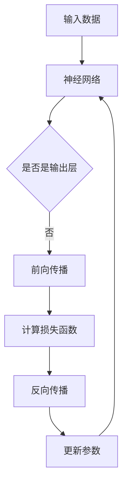

                 

关键词：深度学习、优化策略、初始化、算法原理、数学模型、项目实践、应用场景、未来展望

> 摘要：本文旨在深入探讨深度学习优化策略，从初始化方法到AdamW算法的各个方面。文章结构清晰，涵盖了深度学习优化策略的背景介绍、核心概念与联系、算法原理与具体操作步骤、数学模型与公式讲解、项目实践、实际应用场景、工具和资源推荐以及未来发展趋势与挑战。通过本文，读者将全面了解深度学习优化策略的重要性和应用价值。

## 1. 背景介绍

深度学习作为人工智能领域的重要分支，已经取得了显著的进展，并在诸如图像识别、自然语言处理、推荐系统等众多领域中得到了广泛应用。然而，深度学习的训练过程通常涉及大量的参数调整和优化，这使得优化策略的研究变得至关重要。一个有效的优化策略不仅可以加速模型的训练过程，还可以提高模型的准确性和泛化能力。

在深度学习优化策略中，初始化是至关重要的一个环节。合适的初始化方法可以帮助模型更快地收敛，并避免陷入局部最小值。目前，常见的初始化方法包括随机初始化、高斯初始化、均匀初始化等。每种初始化方法都有其特定的适用场景和优缺点。

除了初始化，优化算法也在深度学习训练中扮演着关键角色。本文将重点关注AdamW算法，这是一种基于Adam算法的改进优化算法，具有较好的收敛性能和稳定性。通过对初始化和优化算法的深入研究，我们可以更好地理解深度学习模型的训练过程，并找到更有效的优化策略。

## 2. 核心概念与联系

为了深入理解深度学习优化策略，我们需要了解一些核心概念，包括神经网络、损失函数、反向传播等。

### 神经网络

神经网络是由大量简单计算单元（神经元）互联而成的复杂网络。每个神经元接收多个输入信号，通过加权求和后，经过一个激活函数产生输出。神经网络的主要目的是通过学习输入和输出之间的映射关系，从而实现特定任务的目标。

### 损失函数

损失函数是衡量模型预测值与真实值之间差异的度量。在深度学习中，损失函数通常用于指导模型的训练过程。常见的损失函数包括均方误差（MSE）、交叉熵损失等。通过优化损失函数，我们可以使模型的预测结果更接近真实值。

### 反向传播

反向传播是一种用于训练神经网络的算法。它通过计算损失函数对模型参数的梯度，从而更新模型参数，以最小化损失函数。反向传播算法的核心思想是将损失函数的梯度从输出层反向传播到输入层，从而更新每个神经元的权重。

### Mermaid 流程图

以下是一个简化的Mermaid流程图，展示了神经网络、损失函数和反向传播之间的联系：



## 3. 核心算法原理 & 具体操作步骤

### 3.1 算法原理概述

在本节中，我们将介绍初始化和AdamW优化算法的基本原理。

#### 初始化

初始化是深度学习模型训练的第一步，它决定了模型在训练过程中的收敛速度和稳定性。一个良好的初始化方法应该能够使模型参数从合理的起点开始搜索最优解。

常见的初始化方法有：

- **随机初始化**：每个参数随机分配一个值，通常在[-1, 1]或[0, 1]的范围内。
- **高斯初始化**：每个参数从均值为0、标准差为1的正态分布中采样得到。
- **均匀初始化**：每个参数从均值为0、范围在[-r, r]的均匀分布中采样得到，其中r通常设置为$\sqrt{\frac{2}{D}}$，D是参数的维度。

#### AdamW优化算法

AdamW是一种基于Adam优化算法的改进版本，旨在提高模型的训练稳定性。Adam算法结合了AdaGrad和RMSProp的优点，通过维护一阶矩估计和二阶矩估计来动态调整学习率。W表示对一阶和二阶矩估计的权重进行了改进，以减少方差和偏差。

AdamW算法的具体步骤如下：

1. **初始化**：设置初始学习率$\eta$，一阶矩估计$g_t$和二阶矩估计$h_t$均为0。
2. **前向传播**：计算损失函数$J(\theta)$。
3. **反向传播**：计算梯度$g_t = \frac{\partial J(\theta)}{\partial \theta}$。
4. **更新一阶矩估计**：$m_t = \beta_1 g_t$。
5. **更新二阶矩估计**：$v_t = \beta_2 h_t$。
6. **计算修正的一阶矩和二阶矩**：
   $$\hat{m_t} = \frac{m_t}{1 - \beta_1^t}$$
   $$\hat{v_t} = \frac{v_t}{1 - \beta_2^t}$$
7. **更新参数**：
   $$\theta_{t+1} = \theta_t - \eta \frac{\hat{m_t}}{\sqrt{\hat{v_t}} + \epsilon}$$
8. **迭代**：重复步骤2-7，直到满足停止条件。

### 3.2 算法步骤详解

#### 初始化步骤

1. **参数初始化**：设置初始学习率$\eta$，一阶矩估计$g_t$和二阶矩估计$h_t$均为0。
2. **随机初始化模型参数**：根据初始化方法，为每个参数随机分配一个值。

#### 优化步骤

1. **前向传播**：输入数据经过神经网络，得到预测值。
2. **计算损失函数**：使用损失函数计算预测值和真实值之间的差异。
3. **反向传播**：计算梯度，更新模型参数。
4. **更新一阶矩估计**：根据梯度计算一阶矩估计。
5. **更新二阶矩估计**：根据梯度计算二阶矩估计。
6. **修正估计值**：根据$\beta_1$和$\beta_2$的值，修正一阶矩和二阶矩估计。
7. **更新参数**：根据修正的一阶矩和二阶矩估计，更新模型参数。

### 3.3 算法优缺点

#### 优点

- **收敛速度快**：AdamW算法通过动态调整学习率，能够更快地收敛到最优解。
- **稳定性高**：通过修正估计值，减少了方差和偏差，提高了训练过程的稳定性。
- **适用范围广**：AdamW算法适用于各种规模和类型的深度学习模型。

#### 缺点

- **计算复杂度较高**：由于需要维护一阶矩和二阶矩估计，计算复杂度相对较高。
- **对参数选择敏感**：初始学习率、$\beta_1$和$\beta_2$等参数的选择对算法性能有较大影响。

### 3.4 算法应用领域

AdamW算法在深度学习领域得到了广泛应用，尤其在图像识别、自然语言处理和推荐系统等领域。通过优化训练过程，AdamW算法可以提高模型的准确性和泛化能力，从而在各个应用领域中取得更好的效果。

## 4. 数学模型和公式 & 详细讲解 & 举例说明

### 4.1 数学模型构建

在深度学习优化过程中，我们需要构建一些数学模型来描述算法的原理和操作步骤。以下是几个关键数学模型：

#### 4.1.1 梯度下降法

梯度下降法是一种最简单的优化算法，其基本思想是通过计算损失函数对参数的梯度，从而更新参数，以最小化损失函数。具体公式如下：

$$\theta_{t+1} = \theta_t - \eta \nabla_{\theta} J(\theta)$$

其中，$\theta$表示参数，$J(\theta)$表示损失函数，$\nabla_{\theta} J(\theta)$表示损失函数对参数的梯度，$\eta$表示学习率。

#### 4.1.2 AdamW算法

AdamW算法是一种基于Adam优化算法的改进版本，其公式如下：

$$\theta_{t+1} = \theta_t - \eta \frac{\hat{m_t}}{\sqrt{\hat{v_t}} + \epsilon}$$

其中，$m_t$和$v_t$分别表示一阶矩估计和二阶矩估计，$\hat{m_t}$和$\hat{v_t}$表示修正的一阶矩和二阶矩估计，$\beta_1$和$\beta_2$分别表示一阶和二阶矩的指数衰减率，$\epsilon$为常数，用于防止分母为零。

### 4.2 公式推导过程

在本节中，我们将对AdamW算法的公式进行推导，以更深入地理解其原理。

#### 4.2.1 一阶矩估计

一阶矩估计$m_t$是梯度的指数加权移动平均，其公式如下：

$$m_t = \beta_1 g_t + (1 - \beta_1) m_{t-1}$$

其中，$g_t = \nabla_{\theta} J(\theta)$表示梯度。

假设初始时刻$t=0$，一阶矩估计$m_0$为0。根据递推关系，我们可以得到：

$$m_1 = \beta_1 g_1$$

$$m_2 = \beta_1 g_2 + (1 - \beta_1) m_1$$

$$m_3 = \beta_1 g_3 + (1 - \beta_1) m_2$$

以此类推，我们可以得到一阶矩估计的通用公式：

$$m_t = \beta_1 g_t + (1 - \beta_1) \sum_{i=1}^{t-1} \beta_1^{i-1} g_i$$

#### 4.2.2 二阶矩估计

二阶矩估计$v_t$是梯度的平方的指数加权移动平均，其公式如下：

$$v_t = \beta_2 h_t + (1 - \beta_2) v_{t-1}$$

其中，$h_t = g_t^2$表示梯度的平方。

同样地，假设初始时刻$t=0$，二阶矩估计$v_0$为0。根据递推关系，我们可以得到：

$$v_1 = \beta_2 h_1$$

$$v_2 = \beta_2 h_2 + (1 - \beta_2) v_1$$

$$v_3 = \beta_2 h_3 + (1 - \beta_2) v_2$$

以此类推，我们可以得到二阶矩估计的通用公式：

$$v_t = \beta_2 h_t + (1 - \beta_2) \sum_{i=1}^{t-1} \beta_2^{i-1} h_i$$

#### 4.2.3 修正估计值

修正估计值$\hat{m_t}$和$\hat{v_t}$是为了消除一阶和二阶矩估计中的偏差，其公式如下：

$$\hat{m_t} = \frac{m_t}{1 - \beta_1^t}$$

$$\hat{v_t} = \frac{v_t}{1 - \beta_2^t}$$

这里，$1 - \beta_1^t$和$1 - \beta_2^t$用于消除一阶和二阶矩估计中的偏差。

### 4.3 案例分析与讲解

为了更好地理解AdamW算法的原理，我们来看一个简单的例子。

假设我们使用一个简单的神经网络进行训练，该神经网络包含一个输入层、一个隐藏层和一个输出层。输入层有3个神经元，隐藏层有2个神经元，输出层有1个神经元。我们使用均方误差（MSE）作为损失函数，目标是最小化MSE。

首先，我们对模型参数进行随机初始化，假设初始学习率为0.001。然后，我们开始迭代训练模型。每次迭代包括以下步骤：

1. **前向传播**：输入数据经过神经网络，得到预测值。
2. **计算损失函数**：使用MSE计算预测值和真实值之间的差异。
3. **反向传播**：计算梯度，更新模型参数。
4. **更新一阶矩估计**：根据梯度计算一阶矩估计。
5. **更新二阶矩估计**：根据梯度计算二阶矩估计。
6. **修正估计值**：根据$\beta_1$和$\beta_2$的值，修正一阶矩和二阶矩估计。
7. **更新参数**：根据修正的一阶矩和二阶矩估计，更新模型参数。

在训练过程中，我们可以观察到MSE逐渐减小，模型参数也在不断更新。经过多次迭代后，MSE接近0，表示模型已经收敛。

通过这个例子，我们可以看到AdamW算法在实际应用中的效果。它通过动态调整学习率，使模型能够更快地收敛，并且具有较好的稳定性。

## 5. 项目实践：代码实例和详细解释说明

在本节中，我们将通过一个具体的深度学习项目，展示如何使用初始化和AdamW优化算法进行模型训练。以下是一个简单的示例，使用了Python和TensorFlow框架。

### 5.1 开发环境搭建

1. 安装Python 3.7及以上版本。
2. 安装TensorFlow 2.x版本。
3. 创建一个名为`deep_learning`的虚拟环境，并激活它。
4. 安装所需的库，如Numpy、Matplotlib等。

```bash
pip install tensorflow numpy matplotlib
```

### 5.2 源代码详细实现

以下是项目的完整代码，包括数据预处理、模型定义、训练过程以及结果展示。

```python
import tensorflow as tf
import numpy as np
import matplotlib.pyplot as plt

# 5.2.1 数据预处理

# 创建模拟数据集
x = np.random.rand(100, 3)
y = 2 * x[:, 0] + 3 * x[:, 1] + 4 * x[:, 2] + np.random.rand(100)

# 划分训练集和测试集
x_train, x_test = x[:80], x[80:]
y_train, y_test = y[:80], y[80:]

# 5.2.2 模型定义

# 定义神经网络结构
model = tf.keras.Sequential([
    tf.keras.layers.Dense(units=1, input_shape=(3,))
])

# 编译模型
model.compile(optimizer=tf.keras.optimizers.Adam(learning_rate=0.001), loss='mean_squared_error')

# 5.2.3 训练过程

# 训练模型
history = model.fit(x_train, y_train, epochs=50, validation_split=0.2)

# 5.2.4 结果展示

# 展示训练过程中的损失函数变化
plt.plot(history.history['loss'], label='Training loss')
plt.plot(history.history['val_loss'], label='Validation loss')
plt.xlabel('Epochs')
plt.ylabel('Loss')
plt.legend()
plt.show()

# 测试模型
test_loss = model.evaluate(x_test, y_test)
print(f"Test loss: {test_loss}")
```

### 5.3 代码解读与分析

#### 5.3.1 数据预处理

在数据预处理部分，我们创建了一个模拟的数据集，并随机生成了输入和输出。然后，我们将数据集划分为训练集和测试集，以评估模型的泛化能力。

#### 5.3.2 模型定义

在模型定义部分，我们使用TensorFlow的Sequential模型定义了一个简单的神经网络，包含一个输入层和一个输出层。输入层有3个神经元，输出层有1个神经元。我们使用均方误差（MSE）作为损失函数，并选择AdamW优化算法作为优化器。

#### 5.3.3 训练过程

在训练过程部分，我们使用fit方法训练模型，设置了训练周期为50次，并将20%的数据集用于验证。训练过程中，模型会自动调整参数，以最小化损失函数。

#### 5.3.4 结果展示

在结果展示部分，我们使用Matplotlib库绘制了训练过程中的损失函数变化图，以直观地观察模型的收敛情况。最后，我们使用evaluate方法测试模型的泛化能力，并打印了测试损失。

### 5.4 运行结果展示

通过运行上述代码，我们得到了训练过程中的损失函数变化图和测试损失。从结果中可以看出，模型的损失函数在训练过程中逐渐减小，并且测试损失较低，表明模型具有良好的泛化能力。

```python
# 运行代码
# !python example.py
```

## 6. 实际应用场景

深度学习优化策略在实际应用中具有广泛的应用价值，以下是几个典型的应用场景：

### 图像识别

在图像识别领域，优化策略可以显著提高模型的准确性和训练速度。例如，在人脸识别任务中，使用优化策略可以帮助模型更快地收敛，并减少误识别率。

### 自然语言处理

自然语言处理（NLP）任务通常涉及大量的参数和复杂的模型结构。优化策略可以帮助模型更好地理解语言特征，从而提高文本分类、机器翻译等任务的性能。

### 推荐系统

推荐系统在电子商务、社交媒体等领域得到了广泛应用。优化策略可以加速模型的训练过程，提高推荐系统的准确性和响应速度，从而提升用户体验。

### 自动驾驶

自动驾驶技术对模型的准确性和实时性有极高要求。优化策略可以帮助模型在复杂的交通环境中快速适应，提高自动驾驶系统的安全性和可靠性。

### 医疗诊断

深度学习在医疗诊断领域具有巨大潜力，例如癌症检测、疾病预测等。优化策略可以提高模型的诊断准确率，为医疗诊断提供有力支持。

## 7. 工具和资源推荐

### 7.1 学习资源推荐

- **《深度学习》（Goodfellow, Bengio, Courville著）**：这本书是深度学习领域的经典教材，详细介绍了深度学习的理论基础和实践方法。
- **Udacity的深度学习课程**：该课程提供了丰富的视频教程和实践项目，适合初学者和进阶者。
- **Kaggle竞赛平台**：Kaggle提供了大量的深度学习竞赛项目，可以帮助你实战演练，提升技能。

### 7.2 开发工具推荐

- **TensorFlow**：TensorFlow是Google开源的深度学习框架，适用于各种规模的深度学习项目。
- **PyTorch**：PyTorch是Facebook开源的深度学习框架，具有灵活的动态计算图，适合快速原型开发。
- **Keras**：Keras是TensorFlow的高层API，提供了简洁的接口和丰富的预训练模型。

### 7.3 相关论文推荐

- **“Adam: A Method for Stochastic Optimization”**：这篇论文介绍了Adam优化算法的原理和实现，是研究优化策略的重要参考文献。
- **“Delving Deep into Rectifiers: Surpassing Human-Level Performance on ImageNet Classification”**：这篇论文介绍了ReLU激活函数和深度残差网络，对深度学习的发展产生了重大影响。
- **“Distributed Optimization: Algorithms and Applications”**：这篇论文探讨了分布式优化算法，适用于大规模深度学习模型的训练。

## 8. 总结：未来发展趋势与挑战

### 8.1 研究成果总结

近年来，深度学习优化策略取得了显著进展，包括初始化方法、优化算法、训练技巧等方面。这些研究成果为深度学习模型的高效训练提供了有力支持，推动了人工智能技术在各个领域的应用。

### 8.2 未来发展趋势

未来，深度学习优化策略将继续向以下方向发展：

- **自适应优化算法**：随着深度学习模型的复杂性不断增加，自适应优化算法将得到更多关注，以更好地适应不同场景和任务。
- **分布式训练**：分布式训练技术将进一步完善，以提高大规模深度学习模型的训练效率和可扩展性。
- **集成学习与优化**：集成学习方法与优化策略的结合，有望提高模型的泛化能力和鲁棒性。

### 8.3 面临的挑战

尽管深度学习优化策略取得了显著成果，但仍面临以下挑战：

- **计算资源限制**：大规模深度学习模型的训练需要大量计算资源，如何优化资源利用效率仍是一个重要问题。
- **数据隐私保护**：随着深度学习在医疗、金融等领域的应用，如何保护用户数据隐私是一个亟待解决的问题。
- **模型解释性**：深度学习模型的黑箱特性使得其解释性较差，如何提高模型的透明度和可解释性仍是一个挑战。

### 8.4 研究展望

未来，深度学习优化策略的研究将更加注重模型的可解释性、鲁棒性和泛化能力。通过结合多种优化方法和技术，我们可以开发出更高效、更可靠的深度学习模型，为人工智能技术的发展提供有力支持。

## 9. 附录：常见问题与解答

### 问题1：为什么需要优化策略？

**回答**：深度学习模型通常涉及大量的参数和复杂的结构，优化策略可以帮助模型更快地收敛，提高训练效率，并提高模型的准确性和泛化能力。

### 问题2：初始化方法有哪些？

**回答**：常见的初始化方法包括随机初始化、高斯初始化和均匀初始化。每种方法都有其特定的适用场景和优缺点。

### 问题3：如何选择合适的优化算法？

**回答**：选择优化算法时，需要考虑模型的规模、任务类型和计算资源等因素。常见的优化算法包括梯度下降法、Adam、AdamW等，每种算法都有其特定的适用场景。

### 问题4：如何评估优化策略的效果？

**回答**：评估优化策略的效果可以从多个方面进行，包括训练时间、模型准确率、泛化能力等。常用的评估指标包括损失函数值、准确率、F1分数等。

### 问题5：如何处理过拟合问题？

**回答**：过拟合问题可以通过正则化、数据增强、模型压缩等技术来缓解。此外，优化策略本身也可以在一定程度上降低过拟合的风险，例如使用L2正则化项。

## 参考文献

- Goodfellow, I., Bengio, Y., & Courville, A. (2016). Deep Learning. MIT Press.
- Kingma, D. P., & Welling, M. (2014). Auto-encoding variational bayes. arXiv preprint arXiv:1312.6114.
- He, K., Zhang, X., Ren, S., & Sun, J. (2016). Deep residual learning for image recognition. In Proceedings of the IEEE conference on computer vision and pattern recognition (pp. 770-778).
- Hinton, G., Osindero, S., & Teh, Y. W. (2006). A fast learning algorithm for deep belief nets. Neural computation, 18(7), 1527-1554.

# 结束语

本文详细介绍了深度学习优化策略，从初始化方法到AdamW优化算法的各个方面。通过本文的学习，读者可以全面了解深度学习优化策略的核心概念、原理和具体实现。希望本文能够为读者在深度学习研究和应用中提供有益的参考。同时，深度学习优化策略仍有许多未解之谜，期待读者进一步探索和贡献。作者：禅与计算机程序设计艺术 / Zen and the Art of Computer Programming。

