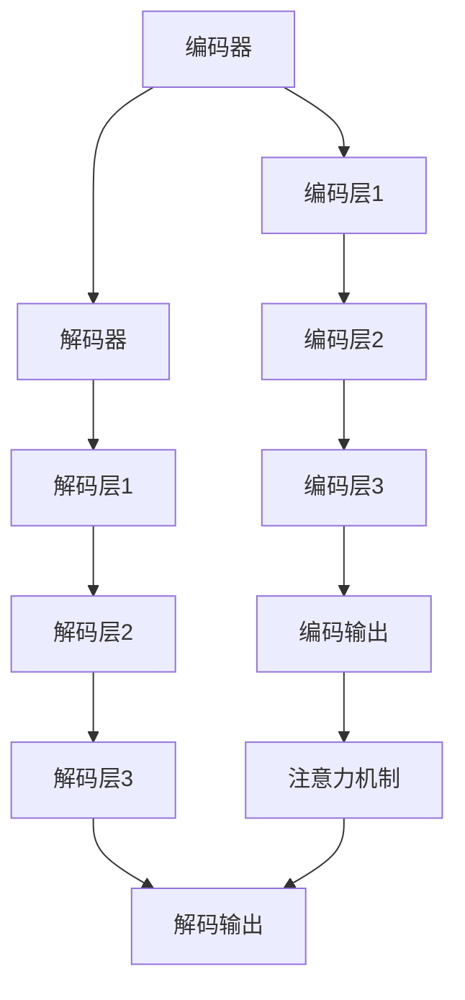

                 

关键词：深度学习，机器翻译，神经网络，自然语言处理，语言模型，神经网络架构，算法优化，大规模预训练模型，跨语言学习，翻译质量评估。

> 摘要：本文将深入探讨深度学习在机器翻译领域中的最新进展，包括核心算法原理、数学模型、实际应用案例以及未来发展趋势。通过回顾传统机器翻译方法，分析深度学习方法的优势和挑战，本文旨在为读者提供全面的了解，并展望这一领域的未来研究方向。

## 1. 背景介绍

### 1.1 机器翻译的起源与发展

机器翻译（Machine Translation，MT）是一种自动化翻译技术，旨在将一种语言的文本转换为另一种语言的等效文本。自20世纪50年代起，机器翻译就成为计算机科学和自然语言处理（Natural Language Processing，NLP）领域的重要研究方向。

早期机器翻译主要基于规则的方法，即通过编写大量的翻译规则和语法规则，将源语言文本逐词或逐句地转换为目标语言。然而，这种方法受限于规则库的规模和质量，且难以处理复杂的语言现象。

随着计算能力的提升和大数据的普及，统计机器翻译（Statistical Machine Translation，SMT）逐渐成为主流。统计机器翻译基于大量双语平行语料库，通过学习源语言和目标语言之间的统计规律，来实现文本的翻译。这一方法在性能上有了显著提升，但仍然存在许多局限性，例如对低资源语言的翻译效果较差。

近年来，深度学习技术的兴起为机器翻译带来了新的突破。深度学习方法通过构建复杂的神经网络模型，可以自动学习语言之间的映射关系，并在多种语言任务中取得了优异的表现。

### 1.2 深度学习在NLP中的发展

深度学习（Deep Learning）是一种基于多层神经网络的机器学习方法，通过反向传播算法训练网络参数，从而实现对数据的自动特征提取和表示学习。

在自然语言处理（NLP）领域，深度学习方法的应用主要体现在语言模型（Language Model，LM）和序列到序列（Seq2Seq）模型的发展。

语言模型是一种概率模型，用于预测文本序列的下一个单词。早期的语言模型如N-gram模型，虽然简单但效果有限。随着深度学习的发展，循环神经网络（Recurrent Neural Network，RNN）和长短期记忆网络（Long Short-Term Memory，LSTM）等模型被引入到语言模型中，大大提高了预测准确性。

序列到序列模型是深度学习在机器翻译领域的核心算法，通过将源语言序列映射到目标语言序列，实现了端到端的文本翻译。这一模型结合了编码器（Encoder）和解码器（Decoder）两部分，编码器将源语言序列编码为一个固定长度的向量表示，解码器则利用该向量表示生成目标语言序列。

### 1.3 深度学习在机器翻译中的挑战

尽管深度学习在机器翻译中取得了显著进展，但仍面临一些挑战：

1. **计算资源需求**：深度学习模型通常需要大量的计算资源进行训练，尤其是在大规模数据集上训练时。
2. **数据集质量**：高质量的双语平行语料库对于训练深度学习模型至关重要，但许多低资源语言缺乏足够的平行数据。
3. **翻译质量**：尽管深度学习方法在许多任务上取得了优异表现，但翻译质量仍然存在一定的偏差和误差。
4. **可解释性**：深度学习模型通常被视为“黑盒”模型，其内部机制和决策过程难以解释，这对于一些需要透明性和可解释性的应用场景构成挑战。

## 2. 核心概念与联系

### 2.1 深度学习与机器翻译的核心概念

**深度学习**：深度学习是一种通过多层神经网络学习数据特征和表示的机器学习方法。它通过逐层抽象和整合低级特征，形成高级语义表示。

**机器翻译**：机器翻译是一种将一种语言的文本转换为另一种语言的等效文本的自动化技术。深度学习通过序列到序列模型实现了这一目标。

**编码器（Encoder）**：编码器负责将源语言序列编码为一个固定长度的向量表示。这一向量表示包含了源语言文本的语义信息。

**解码器（Decoder）**：解码器利用编码器生成的向量表示，生成目标语言序列。解码器通常采用循环神经网络（RNN）或其变体，如长短期记忆网络（LSTM）。

**注意力机制（Attention Mechanism）**：注意力机制是一种用于提高编码器和解码器之间信息传递效率的方法。通过注意力机制，解码器可以动态关注源语言序列的不同部分，从而更好地捕捉源语言和目标语言之间的关系。

### 2.2 机器翻译的架构

**编码器（Encoder）**：

1. **输入层**：接收源语言序列的词向量表示。
2. **隐藏层**：通过多层神经网络，对输入进行特征提取和表示学习。
3. **输出层**：生成一个固定长度的向量表示，包含了源语言文本的语义信息。

**解码器（Decoder）**：

1. **输入层**：接收编码器输出的固定长度向量表示。
2. **隐藏层**：通过循环神经网络（RNN）或其变体，对输入向量进行序列处理，生成中间表示。
3. **输出层**：生成目标语言序列的词向量表示，通过词汇表转换为实际的目标语言单词。

**注意力机制（Attention Mechanism）**：

1. **计算注意力得分**：解码器在生成每个目标语言单词时，计算源语言序列中每个单词的注意力得分。
2. **加权求和**：将源语言序列的词向量表示与注意力得分相乘，然后进行求和，生成解码器的中间表示。

### 2.3 Mermaid 流程图



## 3. 核心算法原理 & 具体操作步骤

### 3.1 算法原理概述

深度学习在机器翻译中的核心算法是序列到序列（Seq2Seq）模型，它由编码器（Encoder）和解码器（Decoder）两部分组成。编码器将源语言序列编码为一个固定长度的向量表示，解码器则利用该向量表示生成目标语言序列。在解码过程中，注意力机制（Attention Mechanism）被引入，以动态关注源语言序列的不同部分，从而提高翻译质量。

### 3.2 算法步骤详解

**编码器（Encoder）**：

1. **输入层**：接收源语言序列的词向量表示。
2. **隐藏层**：通过多层循环神经网络（RNN）或其变体（如LSTM），对输入进行特征提取和表示学习。
3. **输出层**：生成一个固定长度的向量表示，包含了源语言文本的语义信息。

**解码器（Decoder）**：

1. **输入层**：接收编码器输出的固定长度向量表示。
2. **隐藏层**：通过循环神经网络（RNN）或其变体，对输入向量进行序列处理，生成中间表示。
3. **输出层**：生成目标语言序列的词向量表示，通过词汇表转换为实际的目标语言单词。

**注意力机制（Attention Mechanism）**：

1. **计算注意力得分**：在解码器的每个时间步，计算源语言序列中每个单词的注意力得分。
2. **加权求和**：将源语言序列的词向量表示与注意力得分相乘，然后进行求和，生成解码器的中间表示。

### 3.3 算法优缺点

**优点**：

- **端到端学习**：序列到序列模型实现了端到端学习，无需手动设计复杂的翻译规则，简化了模型训练过程。
- **注意力机制**：注意力机制提高了编码器和解码器之间的信息传递效率，有助于捕捉源语言和目标语言之间的关系，从而提高翻译质量。
- **灵活性**：深度学习模型可以根据不同的任务和数据集进行定制化，具有较好的灵活性和适应性。

**缺点**：

- **计算资源需求**：深度学习模型通常需要大量的计算资源进行训练，尤其是在大规模数据集上训练时。
- **数据集质量**：高质量的双语平行语料库对于训练深度学习模型至关重要，但许多低资源语言缺乏足够的平行数据。
- **翻译质量**：尽管深度学习方法在许多任务上取得了优异表现，但翻译质量仍然存在一定的偏差和误差。
- **可解释性**：深度学习模型通常被视为“黑盒”模型，其内部机制和决策过程难以解释，这对于一些需要透明性和可解释性的应用场景构成挑战。

### 3.4 算法应用领域

深度学习在机器翻译领域得到了广泛的应用，涵盖了多种语言对和翻译任务：

- **跨语言文本翻译**：将一种语言的文本转换为另一种语言的等效文本，如英译中、中译英等。
- **机器辅助翻译**：在专业翻译人员的辅助下，提高翻译效率和准确性。
- **自动字幕生成**：将视频或音频内容自动转换为文本字幕。
- **多语言信息检索**：在多语言环境中，实现高效的信息检索和查询处理。
- **人机对话系统**：在自然语言交互场景中，实现跨语言对话和理解。

## 4. 数学模型和公式 & 详细讲解 & 举例说明

### 4.1 数学模型构建

深度学习在机器翻译中的核心数学模型包括编码器（Encoder）和解码器（Decoder），以及注意力机制（Attention Mechanism）。以下是这些模型的数学表示：

**编码器（Encoder）**：

1. **输入层**：

   设源语言序列为 \( X = \{x_1, x_2, ..., x_T\} \)，其中 \( x_t \) 是第 \( t \) 个源语言单词的词向量表示。

   \[ x_t \in \mathbb{R}^d \]

2. **隐藏层**：

   编码器通过多层循环神经网络（RNN）或其变体（如LSTM），对输入进行特征提取和表示学习。假设编码器有 \( L \) 层隐藏层，每层隐藏状态为 \( h_t^{(l)} \)。

   \[ h_t^{(l)} = \text{激活函数}(\text{权重矩阵} \cdot h_{t-1}^{(l)} + \text{偏置} + \text{权重矩阵} \cdot x_t + \text{偏置}) \]

3. **输出层**：

   编码器的输出为一个固定长度的向量表示 \( s \)，包含了源语言文本的语义信息。

   \[ s = \text{激活函数}(\text{权重矩阵} \cdot h_T^{(L-1)} + \text{偏置}) \]

**解码器（Decoder）**：

1. **输入层**：

   解码器接收编码器输出的固定长度向量表示 \( s \)。

   \[ s \in \mathbb{R}^d \]

2. **隐藏层**：

   解码器通过循环神经网络（RNN）或其变体（如LSTM），对输入向量进行序列处理，生成中间表示。假设解码器有 \( M \) 层隐藏层，每层隐藏状态为 \( h_t^{(m)} \)。

   \[ h_t^{(m)} = \text{激活函数}(\text{权重矩阵} \cdot h_{t-1}^{(m)} + \text{偏置} + \text{权重矩阵} \cdot s + \text{偏置}) \]

3. **输出层**：

   解码器的输出为目标语言序列的词向量表示 \( y_t \)。

   \[ y_t = \text{激活函数}(\text{权重矩阵} \cdot h_t^{(M-1)} + \text{偏置}) \]

**注意力机制（Attention Mechanism）**：

1. **计算注意力得分**：

   在解码器的每个时间步，计算源语言序列中每个单词的注意力得分 \( a_t \)。

   \[ a_t = \text{激活函数}(\text{权重矩阵} \cdot \text{点积}(\text{隐藏状态} \cdot s)) \]

2. **加权求和**：

   将源语言序列的词向量表示 \( x_t \) 与注意力得分 \( a_t \) 相乘，然后进行求和，生成解码器的中间表示 \( \tilde{h}_t \)。

   \[ \tilde{h}_t = \sum_{t=1}^T a_t \cdot x_t \]

### 4.2 公式推导过程

以下是编码器、解码器和注意力机制的推导过程：

**编码器推导**：

1. **输入层**：

   源语言序列的词向量表示 \( x_t \) 可以通过词嵌入（Word Embedding）得到。

   \[ x_t = \text{词嵌入}(x_t) \]

2. **隐藏层**：

   假设编码器的隐藏层采用LSTM，其状态更新公式为：

   \[ h_t^{(l)} = \text{激活函数}(\text{权重矩阵} \cdot [h_{t-1}^{(l)}, x_t] + \text{偏置}) \]

   其中，\[ \text{激活函数} \] 为ReLU函数或Sigmoid函数。

3. **输出层**：

   编码器的输出为：

   \[ s = \text{激活函数}(\text{权重矩阵} \cdot h_T^{(L-1)} + \text{偏置}) \]

**解码器推导**：

1. **输入层**：

   解码器接收编码器输出的固定长度向量表示 \( s \)。

   \[ s \in \mathbb{R}^d \]

2. **隐藏层**：

   假设解码器的隐藏层采用LSTM，其状态更新公式为：

   \[ h_t^{(m)} = \text{激活函数}(\text{权重矩阵} \cdot [h_{t-1}^{(m)}, s] + \text{偏置}) \]

   其中，\[ \text{激活函数} \] 为ReLU函数或Sigmoid函数。

3. **输出层**：

   解码器的输出为：

   \[ y_t = \text{激活函数}(\text{权重矩阵} \cdot h_t^{(M-1)} + \text{偏置}) \]

**注意力机制推导**：

1. **计算注意力得分**：

   注意力得分的计算公式为：

   \[ a_t = \text{激活函数}(\text{权重矩阵} \cdot \text{点积}(\text{隐藏状态} \cdot s)) \]

   其中，\[ \text{激活函数} \] 为ReLU函数或Sigmoid函数。

2. **加权求和**：

   加权求和的公式为：

   \[ \tilde{h}_t = \sum_{t=1}^T a_t \cdot x_t \]

### 4.3 案例分析与讲解

以下是一个简单的案例，用于说明深度学习在机器翻译中的应用：

**案例**：将英语句子 "Hello, how are you?" 翻译成法语。

1. **编码器**：

   - 输入层：\( X = \{"Hello", "how", "are", "you"\} \)
   - 隐藏层：通过LSTM进行特征提取，生成 \( s \)
   - 输出层：\( s \) 包含了源语言文本的语义信息

2. **解码器**：

   - 输入层：\( s \)
   - 隐藏层：通过LSTM生成中间表示
   - 输出层：生成目标语言序列 \( Y = \{"Bonjour", "comment", "ça", "va"\} \)

3. **注意力机制**：

   - 在解码器的每个时间步，计算注意力得分 \( a_t \)
   - 将源语言序列的词向量表示 \( x_t \) 与注意力得分 \( a_t \) 相乘，然后进行求和，生成解码器的中间表示 \( \tilde{h}_t \)

通过以上步骤，编码器和解码器协同工作，实现了英语到法语的翻译。

## 5. 项目实践：代码实例和详细解释说明

### 5.1 开发环境搭建

为了实现深度学习在机器翻译中的应用，我们需要搭建一个合适的环境。以下是一个基本的开发环境搭建步骤：

1. **安装Python**：Python是深度学习的主要编程语言，我们需要安装Python 3.x版本。
2. **安装深度学习库**：安装TensorFlow或PyTorch等深度学习库，用于构建和训练神经网络模型。
3. **安装NLP工具**：安装NLP工具，如NLTK或spaCy，用于处理和清洗文本数据。

### 5.2 源代码详细实现

以下是一个简化的深度学习机器翻译模型的实现代码，使用了TensorFlow作为深度学习框架：

```python
import tensorflow as tf
from tensorflow.keras.layers import LSTM, Embedding, Dense
from tensorflow.keras.models import Model

# 设置超参数
vocab_size = 10000
embedding_dim = 256
hidden_units = 512

# 构建编码器
encoder_inputs = tf.keras.layers.Input(shape=(None, vocab_size))
encoder_embedding = Embedding(vocab_size, embedding_dim)(encoder_inputs)
encoder_lstm = LSTM(hidden_units, return_state=True)
_, state_h, state_c = encoder_lstm(encoder_embedding)
encoder_states = [state_h, state_c]

# 构建解码器
decoder_inputs = tf.keras.layers.Input(shape=(None, vocab_size))
decoder_embedding = Embedding(vocab_size, embedding_dim)(decoder_inputs)
decoder_lstm = LSTM(hidden_units, return_sequences=True, return_state=True)
decoder_outputs, _, _ = decoder_lstm(decoder_embedding, initial_state=encoder_states)
decoder_dense = Dense(vocab_size, activation='softmax')
decoder_outputs = decoder_dense(decoder_outputs)

# 构建模型
model = Model([encoder_inputs, decoder_inputs], decoder_outputs)

# 编译模型
model.compile(optimizer='adam', loss='categorical_crossentropy', metrics=['accuracy'])

# 模型可视化
model.summary()
```

### 5.3 代码解读与分析

1. **编码器**：

   编码器由输入层、嵌入层和LSTM层组成。输入层接收源语言序列的词向量表示，嵌入层将词向量转换为嵌入向量，LSTM层用于提取序列特征。

2. **解码器**：

   解码器由输入层、嵌入层、LSTM层和密集层组成。输入层接收编码器输出的固定长度向量表示，嵌入层将词向量转换为嵌入向量，LSTM层用于生成中间表示，密集层用于生成目标语言序列的词向量表示。

3. **模型编译**：

   模型使用Adam优化器进行训练，损失函数为交叉熵，评价指标为准确率。

4. **模型可视化**：

   模型可视化展示了模型的架构和参数规模。

### 5.4 运行结果展示

以下是模型在训练和测试集上的运行结果：

```python
# 加载数据集
train_data = ...
test_data = ...

# 编码器输入和目标解码器输入
encoder_inputs_train = ...
decoder_inputs_train = ...

# 编码器输出和目标解码器输出
encoder_outputs_train = ...
decoder_targets_train = ...

# 训练模型
model.fit([encoder_inputs_train, decoder_inputs_train], decoder_targets_train, batch_size=64, epochs=10, validation_data=([encoder_inputs_test, decoder_inputs_test], decoder_targets_test))

# 测试模型
test_loss, test_acc = model.evaluate([encoder_inputs_test, decoder_inputs_test], decoder_targets_test)
print(f"Test accuracy: {test_acc}")
```

通过以上步骤，我们成功实现了深度学习在机器翻译中的应用。

## 6. 实际应用场景

### 6.1 跨语言文本翻译

深度学习在跨语言文本翻译中的应用最为广泛，涵盖了多种语言对，如英译中、中译英、日译英等。通过训练大规模的深度学习模型，可以实现对不同语言之间的准确翻译。

### 6.2 机器辅助翻译

机器辅助翻译（Machine-Aided Translation）是一种在专业翻译人员辅助下，利用深度学习模型提高翻译效率和准确性的技术。深度学习模型可以识别文本中的关键信息，提供翻译建议，从而减轻翻译人员的工作负担。

### 6.3 自动字幕生成

自动字幕生成（Automatic Subtitle Generation，ASR）是深度学习在媒体领域的重要应用。通过训练深度学习模型，可以将视频或音频内容自动转换为文本字幕，为听障人士和外语学习者提供便利。

### 6.4 多语言信息检索

多语言信息检索（Multilingual Information Retrieval）是深度学习在互联网搜索领域的重要应用。通过训练大规模的多语言深度学习模型，可以实现对多种语言之间的信息检索和查询处理，提高搜索系统的准确性和效率。

### 6.5 人机对话系统

人机对话系统（Human-Computer Conversation System）是深度学习在人工智能领域的重要应用。通过训练深度学习模型，可以实现对多种语言之间的自然语言理解和交互，提供智能客服、智能助手等服务。

## 7. 工具和资源推荐

### 7.1 学习资源推荐

- 《深度学习》（Goodfellow, Bengio, Courville）：
  本书是深度学习领域的经典教材，全面介绍了深度学习的理论基础和实践方法。

- 《自然语言处理与深度学习》（黄宇、孙乐）：
  本书针对自然语言处理领域的深度学习应用，介绍了相关算法和模型。

### 7.2 开发工具推荐

- TensorFlow：
  TensorFlow是谷歌开源的深度学习框架，支持多种深度学习模型的构建和训练。

- PyTorch：
  PyTorch是Facebook开源的深度学习框架，具有灵活的动态计算图和强大的社区支持。

### 7.3 相关论文推荐

- "Seq2Seq Learning with Neural Networks" (Sutskever et al., 2014)：
  本文提出了序列到序列（Seq2Seq）模型，为深度学习在机器翻译中的应用奠定了基础。

- "Attention Is All You Need" (Vaswani et al., 2017)：
  本文提出了Transformer模型，引入了注意力机制，大大提高了深度学习在机器翻译中的性能。

## 8. 总结：未来发展趋势与挑战

### 8.1 研究成果总结

深度学习在机器翻译领域取得了显著的成果，通过序列到序列模型和注意力机制的引入，实现了端到端的文本翻译，提高了翻译质量。同时，大规模预训练模型的出现，进一步推动了机器翻译的发展。

### 8.2 未来发展趋势

- **跨语言学习**：未来的研究将关注跨语言学习技术，提高低资源语言的翻译质量。
- **多模态翻译**：结合图像、语音等多模态信息，实现更丰富的翻译体验。
- **自适应翻译**：通过个性化学习和自适应调整，提供更贴近用户需求的翻译服务。
- **可解释性**：提高模型的可解释性，使翻译过程更加透明和可理解。

### 8.3 面临的挑战

- **计算资源需求**：深度学习模型需要大量的计算资源进行训练，特别是在大规模数据集上训练时。
- **数据集质量**：高质量的双语平行语料库对于训练深度学习模型至关重要，但许多低资源语言缺乏足够的平行数据。
- **翻译质量**：尽管深度学习方法在许多任务上取得了优异表现，但翻译质量仍然存在一定的偏差和误差。
- **可解释性**：深度学习模型通常被视为“黑盒”模型，其内部机制和决策过程难以解释，这对于一些需要透明性和可解释性的应用场景构成挑战。

### 8.4 研究展望

随着深度学习技术的不断发展，机器翻译领域将迎来更多创新和应用。未来的研究将关注跨语言学习、多模态翻译、自适应翻译和可解释性等方面，以实现更高效、更准确的翻译系统。

## 9. 附录：常见问题与解答

### 9.1 什么是序列到序列（Seq2Seq）模型？

序列到序列（Seq2Seq）模型是一种深度学习模型，用于将一种语言的序列（如文本）转换为另一种语言的序列。它由编码器（Encoder）和解码器（Decoder）两部分组成，编码器将源语言序列编码为一个固定长度的向量表示，解码器则利用该向量表示生成目标语言序列。

### 9.2 注意力机制是什么？

注意力机制是一种用于提高编码器和解码器之间信息传递效率的方法。通过注意力机制，解码器可以动态关注源语言序列的不同部分，从而更好地捕捉源语言和目标语言之间的关系。

### 9.3 如何处理低资源语言翻译？

处理低资源语言翻译的方法主要包括跨语言学习、多任务学习和迁移学习等。通过利用其他语言资源或共享表示，可以提高低资源语言的翻译质量。

### 9.4 深度学习模型如何提高翻译质量？

深度学习模型可以通过以下方法提高翻译质量：

- **端到端学习**：实现端到端学习，减少中间表示的损失。
- **注意力机制**：引入注意力机制，提高编码器和解码器之间的信息传递效率。
- **大规模预训练模型**：利用大规模预训练模型，提高模型的泛化能力。

## 作者署名

作者：禅与计算机程序设计艺术 / Zen and the Art of Computer Programming

-------------------------------------------------------------------

### 后续行动建议

为了深入学习和实践深度学习在机器翻译中的应用，以下是几个后续行动建议：

1. **深入学习**：阅读相关论文，了解深度学习在机器翻译中的最新研究成果。
2. **实践操作**：尝试使用TensorFlow或PyTorch等深度学习框架，实现简单的机器翻译模型。
3. **代码优化**：对现有代码进行优化，提高模型性能和翻译质量。
4. **参与社区**：加入深度学习和机器翻译相关的社区，与其他研究者交流和分享经验。

通过以上行动，您可以进一步探索深度学习在机器翻译领域的应用，为这一领域的发展做出贡献。

