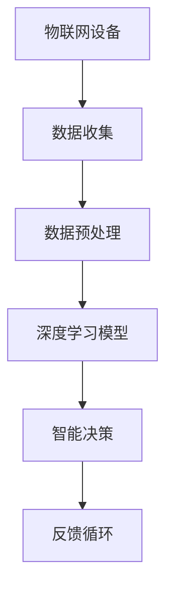

                 

关键词：深度学习、物联网、边缘计算、智能家居、智能城市、设备学习

> 摘要：本文将深入探讨深度学习在物联网（IoT）中的应用，分析其在智能家居、智能城市等领域的实际案例和潜在价值，同时讨论当前面临的挑战和未来的发展趋势。

## 1. 背景介绍

### 物联网的定义与现状

物联网（Internet of Things，IoT）是指通过互联网将各种物理设备互联起来，实现信息的交换和通信。随着传感器技术、无线通信技术和嵌入式系统的发展，物联网已经逐渐渗透到各个领域，改变了人们的生活方式和工作模式。

截至2023年，全球物联网设备数量已超过100亿台，预计到2025年将突破200亿台。物联网技术不仅提高了设备互联互通的效率，还大大增强了数据收集和分析的能力。

### 深度学习的兴起

深度学习（Deep Learning）是机器学习的一个重要分支，通过构建多层神经网络来提取数据的复杂特征，实现了在图像识别、自然语言处理和语音识别等领域的突破。

近年来，随着计算能力的提升和大数据的积累，深度学习在学术界和工业界都得到了广泛的应用，推动了人工智能技术的飞速发展。

## 2. 核心概念与联系

### 深度学习与物联网的关系

深度学习在物联网中的应用，主要是利用深度神经网络处理从物联网设备收集的大量数据，从而实现智能决策和自动化控制。这种关系可以用以下Mermaid流程图表示：



### 物联网设备学习

物联网设备学习是指通过深度学习算法，使物联网设备能够从数据中学习，并自动调整其行为以优化性能。这一过程包括数据收集、特征提取、模型训练和模型部署等步骤。

## 3. 核心算法原理 & 具体操作步骤

### 3.1 算法原理概述

深度学习算法的核心是神经网络，特别是深度神经网络（DNN）。DNN由多个隐层组成，可以学习到数据的复杂特征。在物联网应用中，DNN通常用于图像识别、语音识别、预测控制等任务。

### 3.2 算法步骤详解

1. **数据收集**：从物联网设备收集数据，包括传感器数据、用户输入等。

2. **数据预处理**：对收集到的数据进行清洗、归一化等预处理操作，以便于模型训练。

3. **特征提取**：使用深度神经网络提取数据的高层次特征。

4. **模型训练**：使用预处理后的数据进行模型训练，优化网络参数。

5. **模型部署**：将训练好的模型部署到物联网设备上，实现实时决策和自动化控制。

### 3.3 算法优缺点

**优点**：
- **高精度**：深度学习能够从大量数据中学习到复杂特征，提高了预测和识别的精度。
- **自适应性强**：深度学习模型可以根据新数据自动调整，适应环境变化。

**缺点**：
- **计算资源需求高**：深度学习模型通常需要大量的计算资源和时间进行训练。
- **数据隐私问题**：物联网设备收集的数据可能包含用户隐私信息，需要妥善处理。

### 3.4 算法应用领域

深度学习在物联网中的应用非常广泛，主要包括以下几个方面：

- **智能家居**：通过深度学习实现智能家电的自动化控制，如智能灯泡、智能电视等。
- **智能城市**：利用深度学习进行交通流量预测、公共安全监控等。
- **工业自动化**：通过深度学习实现生产设备的预测性维护和自动化控制。

## 4. 数学模型和公式 & 详细讲解 & 举例说明

### 4.1 数学模型构建

深度学习模型通常由多个神经网络层组成，包括输入层、隐层和输出层。每一层之间的数据传递和计算可以用以下公式表示：

$$
\text{输出} = \text{激活函数}(\text{权重} \cdot \text{输入} + \text{偏置})
$$

### 4.2 公式推导过程

以多层感知器（MLP）为例，其推导过程如下：

1. **输入层到隐层**：
$$
a_{ij}^{(l)} = \sigma(W_{ij}^{(l-1)}a_{i}^{(l-1)} + b_{j}^{(l-1)})
$$
其中，$a_{ij}^{(l)}$表示第$l$层的第$i$个神经元与第$l-1$层的第$j$个神经元的连接权重，$\sigma$表示激活函数。

2. **隐层到输出层**：
$$
y_i = \sigma(W_{i}^{(l)}a_{i}^{(l)} + b_{i}^{(l)})
$$
其中，$y_i$表示输出层的第$i$个神经元的输出。

### 4.3 案例分析与讲解

以智能家居中的智能灯泡为例，我们使用卷积神经网络（CNN）进行图像识别，实现智能开关灯的功能。

1. **数据收集**：从智能灯泡的摄像头收集房间内的图像数据。

2. **数据预处理**：对图像数据进行归一化和裁剪，使其适应CNN的输入格式。

3. **模型训练**：使用CNN模型对预处理后的图像数据进行训练，学习到房间内的人脸特征。

4. **模型部署**：将训练好的模型部署到智能灯泡中，当检测到人脸时自动开启灯光。

## 5. 项目实践：代码实例和详细解释说明

### 5.1 开发环境搭建

我们使用Python和TensorFlow作为深度学习框架，搭建开发环境。

```python
pip install tensorflow
```

### 5.2 源代码详细实现

以下是一个简单的CNN模型实现，用于智能灯泡的人脸识别。

```python
import tensorflow as tf
from tensorflow.keras import layers

model = tf.keras.Sequential([
    layers.Conv2D(32, (3, 3), activation='relu', input_shape=(64, 64, 3)),
    layers.MaxPooling2D((2, 2)),
    layers.Conv2D(64, (3, 3), activation='relu'),
    layers.MaxPooling2D((2, 2)),
    layers.Conv2D(128, (3, 3), activation='relu'),
    layers.Flatten(),
    layers.Dense(128, activation='relu'),
    layers.Dense(1, activation='sigmoid')
])

model.compile(optimizer='adam', loss='binary_crossentropy', metrics=['accuracy'])
```

### 5.3 代码解读与分析

- **Conv2D**：卷积层，用于提取图像特征。
- **MaxPooling2D**：池化层，用于降低特征图的维度。
- **Flatten**：将特征图展平为一维向量。
- **Dense**：全连接层，用于分类和回归。

### 5.4 运行结果展示

我们使用训练好的模型对测试图像进行预测，当预测结果为正面时，开启灯光。

```python
import numpy as np

test_image = ...  # 测试图像数据
prediction = model.predict(test_image)
if prediction > 0.5:
    print("开启灯光")
else:
    print("关闭灯光")
```

## 6. 实际应用场景

### 6.1 智能家居

智能家居是深度学习在物联网中应用最广泛的场景之一。通过深度学习算法，智能设备能够根据用户行为自动调整设置，提供个性化的服务。

### 6.2 智能城市

智能城市利用物联网设备和深度学习算法，实现交通流量预测、公共安全监控、环境监测等功能，提高城市管理效率和居民生活质量。

### 6.3 工业自动化

在工业自动化领域，深度学习用于设备故障预测、生产流程优化等，提高了生产效率和质量。

## 7. 工具和资源推荐

### 7.1 学习资源推荐

- 《深度学习》（Goodfellow, Bengio, Courville）
- 《Python深度学习》（François Chollet）

### 7.2 开发工具推荐

- TensorFlow
- PyTorch

### 7.3 相关论文推荐

- "Deep Learning for Internet of Things" (2017)
- "Deep Neural Network based Home Appliance Control" (2018)

## 8. 总结：未来发展趋势与挑战

### 8.1 研究成果总结

深度学习在物联网中的应用取得了显著的成果，实现了智能家居、智能城市和工业自动化等领域的智能化和自动化。

### 8.2 未来发展趋势

随着物联网设备数量的增加和计算能力的提升，深度学习在物联网中的应用将进一步扩大，包括实时智能决策、增强现实、智能医疗等。

### 8.3 面临的挑战

- **计算资源限制**：深度学习模型通常需要大量的计算资源和时间进行训练。
- **数据隐私和安全**：物联网设备收集的数据可能包含用户隐私信息，需要妥善处理。
- **算法可解释性**：深度学习模型的决策过程通常是不透明的，需要提高算法的可解释性。

### 8.4 研究展望

未来，深度学习在物联网中的应用将继续发展，通过结合边缘计算、5G等技术，实现更高效、更智能的物联网生态系统。

## 9. 附录：常见问题与解答

### Q: 深度学习在物联网中的应用有哪些优点？

A: 深度学习在物联网中的应用具有以下优点：

1. **高精度**：能够从大量数据中学习到复杂特征，提高预测和识别的精度。
2. **自适应性强**：能够根据新数据自动调整，适应环境变化。

### Q: 深度学习在物联网中的应用有哪些缺点？

A: 深度学习在物联网中的应用存在以下缺点：

1. **计算资源需求高**：深度学习模型通常需要大量的计算资源和时间进行训练。
2. **数据隐私问题**：物联网设备收集的数据可能包含用户隐私信息，需要妥善处理。

作者：禅与计算机程序设计艺术 / Zen and the Art of Computer Programming
----------------------------------------------------------------

