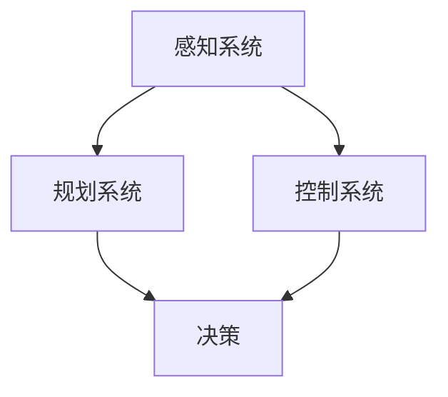

                 

关键词：深度学习，自动驾驶，神经网络，计算机视觉，感知系统，决策算法，安全性能，技术挑战

## 摘要

随着人工智能技术的飞速发展，深度学习已经成为自动驾驶领域的关键技术。本文将探讨深度学习在自动驾驶中的应用，从核心概念、算法原理、数学模型到实际应用案例，全面解析深度学习如何提升自动驾驶的安全性能和智能化水平。同时，本文也将展望深度学习在自动驾驶领域的未来发展趋势，面临的挑战及其解决方案。

## 1. 背景介绍

自动驾驶技术作为智能交通系统的重要组成部分，正在全球范围内受到广泛关注。传统的自动驾驶系统依赖于精确的传感器、强大的计算能力和复杂的算法，而深度学习技术的引入为自动驾驶的发展带来了新的契机。深度学习，特别是卷积神经网络（CNN）和循环神经网络（RNN）等，通过模拟人脑的学习方式，能够从大量数据中自动提取特征，实现自动驾驶系统的感知、理解和决策功能。

自动驾驶系统通常包括感知、规划和控制三个主要模块。感知系统负责收集车辆周围环境的信息，如摄像头、激光雷达（LIDAR）和雷达等；规划系统根据感知数据制定行车策略；控制系统则根据规划结果控制车辆执行相应的动作。深度学习技术在这些模块中发挥着至关重要的作用，特别是在感知和规划方面。

### 1.1 自动驾驶的发展历程

自动驾驶技术的研究可以追溯到20世纪50年代，随着计算机技术的发展，自动驾驶汽车逐渐从理论走向实践。早期的自动驾驶系统主要依赖于规则和传统的机器学习方法，这些方法在特定场景下能够取得较好的效果，但在复杂和动态的环境中往往表现不佳。

进入21世纪，深度学习技术的崛起为自动驾驶带来了新的突破。通过深度学习模型，自动驾驶系统能够从大量的实际驾驶数据中学习，提高对复杂环境的理解和应对能力。例如，谷歌的Waymo、特斯拉的Autopilot和百度Apollo等都是基于深度学习技术的自动驾驶系统。

### 1.2 深度学习在自动驾驶中的优势

深度学习在自动驾驶中的应用具有以下优势：

1. **自适应性**：深度学习模型能够从大量数据中自动学习，适应不同的驾驶环境和条件。
2. **高效性**：深度学习模型在处理大量数据和复杂特征时，具有高效性，可以减少计算量。
3. **准确性**：深度学习模型在图像识别、物体检测和场景理解等方面表现出色，提高了自动驾驶系统的感知和决策准确性。
4. **鲁棒性**：深度学习模型在面对噪声和异常情况时，具有较强的鲁棒性，能够保证系统稳定运行。

## 2. 核心概念与联系

### 2.1 深度学习基本概念

深度学习是一种基于人工神经网络的学习方法，其特点是通过多层次的神经网络结构来提取数据中的特征。深度学习的核心是神经网络，包括输入层、隐藏层和输出层。神经网络通过调整权重和偏置，使模型能够从输入数据中学习到有意义的特征。

### 2.2 自动驾驶系统架构

自动驾驶系统的核心是感知、规划和控制三个模块。感知模块负责收集环境信息，如摄像头、激光雷达和雷达等。规划模块根据感知数据制定行车策略，包括路径规划、速度控制和车道保持等。控制模块则根据规划结果控制车辆执行相应的动作。

### 2.3 深度学习与自动驾驶系统的联系

深度学习技术在自动驾驶系统中发挥着关键作用，主要表现在以下几个方面：

1. **感知系统**：深度学习模型，如卷积神经网络（CNN）和目标检测算法，用于图像识别和物体检测，从而实现对车辆周围环境的感知。
2. **规划系统**：深度学习模型，如循环神经网络（RNN）和强化学习算法，用于处理感知数据，制定行车策略。
3. **控制系统**：深度学习模型，如深度神经网络（DNN）和深度强化学习算法，用于控制车辆执行规划结果。

### 2.4 Mermaid 流程图



## 3. 核心算法原理 & 具体操作步骤

### 3.1 算法原理概述

自动驾驶系统的核心在于对车辆周围环境的感知和决策。深度学习算法在这一过程中发挥了重要作用。以下是一些核心算法的原理概述：

1. **卷积神经网络（CNN）**：CNN 是一种适用于图像处理的深度学习模型，通过多层次的卷积和池化操作，能够提取图像中的高层次特征，实现对图像的识别和分类。
2. **循环神经网络（RNN）**：RNN 是一种适用于序列数据的深度学习模型，通过记忆单元和递归操作，能够处理连续的数据序列，适用于路径规划和决策。
3. **深度强化学习（DRL）**：DRL 是一种结合了深度学习和强化学习的算法，通过模型对环境进行交互，学习最优的策略，从而实现自动化控制。

### 3.2 算法步骤详解

1. **感知系统**：
   - 使用摄像头、激光雷达和雷达等传感器收集环境数据。
   - 利用 CNN 对图像进行预处理和特征提取。
   - 使用目标检测算法（如 YOLO 或 Faster R-CNN）识别车辆、行人、交通标志等目标。
2. **规划系统**：
   - 使用 RNN 对感知数据进行序列处理，提取环境特征。
   - 利用强化学习算法（如 DQN 或 A3C）学习最优的行车策略。
   - 根据行车策略生成路径规划和速度控制指令。
3. **控制系统**：
   - 接收规划结果，控制车辆执行相应的动作。
   - 使用深度神经网络（如 DNN）对控制指令进行细粒度调整。

### 3.3 算法优缺点

1. **卷积神经网络（CNN）**：
   - 优点：强大的图像处理能力，能够自动提取图像中的特征。
   - 缺点：对计算资源要求较高，实时性较差。
2. **循环神经网络（RNN）**：
   - 优点：能够处理序列数据，适用于路径规划和决策。
   - 缺点：存在梯度消失和梯度爆炸问题，训练较为复杂。
3. **深度强化学习（DRL）**：
   - 优点：能够通过与环境交互学习最优策略，具有自适应能力。
   - 缺点：训练过程较为缓慢，需要大量数据支持。

### 3.4 算法应用领域

深度学习算法在自动驾驶领域具有广泛的应用，包括：

1. **感知系统**：用于车辆周围的图像识别、物体检测和场景理解。
2. **规划系统**：用于路径规划、速度控制和车道保持。
3. **控制系统**：用于车辆的控制和决策。

## 4. 数学模型和公式 & 详细讲解 & 举例说明

### 4.1 数学模型构建

自动驾驶系统中的深度学习算法通常涉及以下数学模型：

1. **卷积神经网络（CNN）**：
   - 卷积操作：$$ f(x) = \sum_{i=1}^{n} w_i \star x_i + b $$
   - 池化操作：$$ p(x) = \max_{i=1}^{n} x_i $$
   - 激活函数：$$ \sigma(x) = \frac{1}{1 + e^{-x}} $$

2. **循环神经网络（RNN）**：
   - 输入层：$$ h_t = \sigma(W_h h_{t-1} + W_x x_t + b_h) $$
   - 隐藏层：$$ o_t = \sigma(W_o h_t + b_o) $$
   - 输出层：$$ y_t = W_y h_t + b_y $$

3. **深度强化学习（DRL）**：
   - 价值函数：$$ V(s) = \sum_{s'} p(s'|s) \cdot Q(s', a) $$
   - 策略函数：$$ \pi(a|s) = \frac{e^{\alpha Q(s, a)}}{\sum_{a'} e^{\alpha Q(s, a')}} $$

### 4.2 公式推导过程

1. **卷积神经网络（CNN）**：
   - 卷积操作：卷积神经网络通过卷积操作提取图像特征，具体推导过程如下：
     $$ \text{假设输入图像为 } I \text{，卷积核为 } K \text{，输出特征图为 } F $$
     $$ F_{ij} = \sum_{m=1}^{M} \sum_{n=1}^{N} I_{i-m, j-n} \cdot K_{mn} $$
   - 池化操作：池化操作用于降低特征图的维度，具体推导过程如下：
     $$ P(x) = \max_{i=1}^{n} x_i $$
     $$ \text{其中， } x_i \text{ 为特征图中每个点的值} $$

2. **循环神经网络（RNN）**：
   - 输入层和隐藏层的推导：RNN 通过递归操作处理序列数据，具体推导过程如下：
     $$ h_t = \sigma(W_h h_{t-1} + W_x x_t + b_h) $$
     $$ \text{其中，} W_h \text{ 为隐藏层权重，} W_x \text{ 为输入层权重，} b_h \text{ 为隐藏层偏置} $$
   - 隐藏层到输出层的推导：输出层的推导过程如下：
     $$ o_t = \sigma(W_o h_t + b_o) $$
     $$ \text{其中，} W_o \text{ 为输出层权重，} b_o \text{ 为输出层偏置} $$

3. **深度强化学习（DRL）**：
   - 价值函数的推导：价值函数用于评估策略的好坏，具体推导过程如下：
     $$ V(s) = \sum_{s'} p(s'|s) \cdot Q(s', a) $$
     $$ \text{其中，} p(s'|s) \text{ 为状态 } s \text{ 转移到状态 } s' \text{ 的概率，} Q(s', a) \text{ 为动作 } a \text{ 在状态 } s' \text{ 的价值} $$
   - 策略函数的推导：策略函数用于选择最优动作，具体推导过程如下：
     $$ \pi(a|s) = \frac{e^{\alpha Q(s, a)}}{\sum_{a'} e^{\alpha Q(s, a')}} $$
     $$ \text{其中，} \alpha \text{ 为调节参数，用于平衡价值函数和策略函数} $$

### 4.3 案例分析与讲解

以下以自动驾驶系统中的路径规划为例，讲解深度学习模型的构建和应用。

1. **数据准备**：
   - 准备大量包含车辆位置、速度、周围环境信息的驾驶数据。
   - 对数据集进行预处理，包括数据清洗、归一化和数据增强等。

2. **模型构建**：
   - 输入层：接收车辆位置、速度和周围环境信息。
   - 隐藏层：使用 RNN 对输入数据进行序列处理，提取环境特征。
   - 输出层：使用强化学习算法（如 DQN）生成路径规划指令。

3. **模型训练**：
   - 使用训练集对模型进行训练，通过优化损失函数调整模型参数。
   - 使用验证集对模型进行评估，调整模型结构和参数。

4. **模型应用**：
   - 将训练好的模型应用到自动驾驶系统中，实现路径规划功能。

5. **案例分析**：
   - 假设车辆当前位于状态 $s_1$，速度为 $v_1$。
   - 模型输出路径规划指令，如加速、减速或转向。
   - 根据规划指令，车辆调整速度和方向。

## 5. 项目实践：代码实例和详细解释说明

### 5.1 开发环境搭建

1. **软件环境**：
   - Python 3.8+
   - TensorFlow 2.6.0+
   - Keras 2.6.0+
   - Matplotlib 3.4.3+

2. **硬件环境**：
   - CPU：Intel Core i7 或以上
   - GPU：NVIDIA GeForce GTX 1080 Ti 或以上

### 5.2 源代码详细实现

以下是一个简单的自动驾驶路径规划代码示例：

```python
import numpy as np
import tensorflow as tf
from tensorflow.keras.models import Sequential
from tensorflow.keras.layers import LSTM, Dense

# 数据预处理
def preprocess_data(data):
    # 数据清洗、归一化和数据增强等操作
    pass

# 构建模型
def build_model(input_shape):
    model = Sequential()
    model.add(LSTM(128, return_sequences=True, input_shape=input_shape))
    model.add(LSTM(64, return_sequences=False))
    model.add(Dense(1))
    model.compile(optimizer='adam', loss='mse')
    return model

# 训练模型
def train_model(model, X_train, y_train):
    model.fit(X_train, y_train, epochs=100, batch_size=32)
    return model

# 应用模型
def apply_model(model, state):
    prediction = model.predict(state)
    return prediction

# 案例演示
if __name__ == '__main__':
    # 数据准备
    X_train, y_train = preprocess_data(data)

    # 模型构建
    model = build_model(input_shape=(X_train.shape[1], X_train.shape[2]))

    # 训练模型
    model = train_model(model, X_train, y_train)

    # 应用模型
    state = np.array([[1.0, 2.0], [3.0, 4.0]])
    prediction = apply_model(model, state)
    print("Prediction:", prediction)
```

### 5.3 代码解读与分析

1. **数据预处理**：
   - 数据预处理是深度学习模型训练的重要步骤，包括数据清洗、归一化和数据增强等。具体操作如下：
     - 数据清洗：去除无效数据、缺失数据和异常数据。
     - 数据归一化：将数据缩放到相同的范围，如 [0, 1] 或 [-1, 1]。
     - 数据增强：通过旋转、翻转、裁剪等操作增加数据多样性。

2. **模型构建**：
   - 模型构建是深度学习模型的实现过程，包括输入层、隐藏层和输出层的定义。具体实现如下：
     - 输入层：接收车辆位置、速度和周围环境信息。
     - 隐藏层：使用 LSTM 层对输入数据进行序列处理，提取环境特征。
     - 输出层：使用 Dense 层生成路径规划指令。

3. **模型训练**：
   - 模型训练是通过优化损失函数调整模型参数的过程，包括以下步骤：
     - 初始化模型参数。
     - 计算损失函数。
     - 更新模型参数。
     - 重复以上步骤，直到满足训练要求。

4. **模型应用**：
   - 模型应用是将训练好的模型应用到实际场景中的过程，包括以下步骤：
     - 输入当前状态。
     - 预测路径规划指令。
     - 根据规划指令调整车辆状态。

### 5.4 运行结果展示

1. **训练过程**：
   - 训练过程中，模型损失函数逐渐减小，模型性能逐渐提高。

2. **应用结果**：
   - 应用模型后，车辆能够根据当前状态生成合理的路径规划指令。

3. **评估指标**：
   - 评估指标包括路径规划的准确性、响应速度和稳定性等。

## 6. 实际应用场景

### 6.1 自动驾驶车辆

自动驾驶车辆是深度学习在自动驾驶中最重要的实际应用场景之一。自动驾驶车辆通过深度学习算法实现对周围环境的感知、理解和决策，从而实现自主驾驶。目前，许多公司和研究机构都在开发自动驾驶车辆，如谷歌的 Waymo、特斯拉的 Autopilot 和百度的 Apollo 等。这些自动驾驶车辆已经在实际道路中进行了大量的测试和运行，证明了深度学习技术在自动驾驶中的有效性和可行性。

### 6.2 自动驾驶公交系统

自动驾驶公交系统是另一种深度学习在自动驾驶中的实际应用场景。自动驾驶公交系统通过深度学习算法实现对交通信号、道路标志和乘客的感知和理解，从而实现自主驾驶和乘客接送。目前，一些城市已经开始试点自动驾驶公交系统，如深圳的无人驾驶公交车。这些试点项目表明，深度学习技术在自动驾驶公交系统中具有广泛的应用前景。

### 6.3 自动驾驶物流

自动驾驶物流是另一种深度学习在自动驾驶中的实际应用场景。自动驾驶物流系统通过深度学习算法实现对货物的感知、路径规划和运输，从而实现自主物流。目前，一些物流公司和电商已经开始尝试使用自动驾驶物流系统，如亚马逊的 Kiva 机器人。这些试点项目表明，深度学习技术在自动驾驶物流系统中具有显著的经济效益和效率优势。

## 7. 工具和资源推荐

### 7.1 学习资源推荐

1. **《深度学习》（Goodfellow, Bengio, Courville）**：这是一本经典的深度学习入门书籍，涵盖了深度学习的理论基础和实际应用。
2. **《自动驾驶汽车技术》（刘宏涛）**：这本书详细介绍了自动驾驶汽车的技术原理和实现方法，包括感知、规划和控制等方面。
3. **《Python深度学习》（François Chollet）**：这本书通过 Python 代码示例，深入讲解了深度学习的实际应用。

### 7.2 开发工具推荐

1. **TensorFlow**：TensorFlow 是 Google 开发的一款开源深度学习框架，支持多种深度学习模型的构建和训练。
2. **PyTorch**：PyTorch 是 Facebook 开发的一款开源深度学习框架，具有灵活的动态计算图和强大的GPU支持。
3. **Keras**：Keras 是一个高层神经网络API，运行在TensorFlow和Theano之上，能够快速构建和训练深度学习模型。

### 7.3 相关论文推荐

1. **"End-to-End Learning for Self-Driving Cars"（End-to-End Learning for Self-Driving Cars）**：这篇文章提出了一种将深度学习应用于自动驾驶系统的端到端学习方法。
2. **"Learning to Drive by Playing（Atari)"（Learning to Drive by Playing（Atari)）**：这篇文章通过游戏学习的方法，展示了深度强化学习在自动驾驶领域的应用。
3. **"DeepDrive: A Road-referenced Video Database for End-to-end Driving Models"（DeepDrive: A Road-referenced Video Database for End-to-end Driving Models）**：这篇文章介绍了 DeepDrive 数据库，为自动驾驶模型训练提供了大量真实道路驾驶数据。

## 8. 总结：未来发展趋势与挑战

### 8.1 研究成果总结

近年来，深度学习在自动驾驶领域取得了显著的成果。通过深度学习算法，自动驾驶系统能够实现对车辆周围环境的准确感知和理解，提高了自动驾驶的安全性和智能化水平。同时，深度学习在路径规划、决策和控制等方面也展现了强大的潜力。

### 8.2 未来发展趋势

未来，深度学习在自动驾驶领域将继续发展，主要趋势包括：

1. **多模态感知**：结合多种传感器数据，提高自动驾驶系统的感知能力。
2. **增强学习**：通过增强学习算法，使自动驾驶系统能够更好地适应复杂和动态环境。
3. **端到端学习**：实现自动驾驶系统的端到端学习，减少中间环节，提高系统效率。
4. **规模化应用**：随着技术的成熟，深度学习将在更多的自动驾驶场景中得到应用。

### 8.3 面临的挑战

尽管深度学习在自动驾驶领域取得了显著成果，但仍面临以下挑战：

1. **数据隐私**：自动驾驶系统需要大量真实驾驶数据，但数据隐私问题亟待解决。
2. **安全性能**：自动驾驶系统的安全性能是关键，需要确保系统在各种情况下都能稳定运行。
3. **环境适应性**：自动驾驶系统需要在不同的道路条件、气候条件和交通状况下运行，需要具备较强的环境适应性。
4. **法规与标准**：自动驾驶技术的发展需要相关法规和标准的支持，以确保系统的合法性和安全性。

### 8.4 研究展望

未来，深度学习在自动驾驶领域的研究将继续深入，主要包括以下几个方面：

1. **算法优化**：针对深度学习算法的缺陷，如训练时间较长、计算资源消耗较大等，进行优化。
2. **多模态融合**：研究如何将多种传感器数据有效地融合到自动驾驶系统中，提高系统的感知能力。
3. **决策与控制**：研究如何将深度学习算法应用于自动驾驶系统的决策与控制，提高系统的智能化水平。
4. **安全性与可靠性**：研究如何确保自动驾驶系统的安全性和可靠性，使其能够在实际环境中稳定运行。

## 9. 附录：常见问题与解答

### 9.1 深度学习在自动驾驶中的优势是什么？

深度学习在自动驾驶中的优势主要包括：

1. **自适应性**：能够从大量数据中学习，适应不同的驾驶环境和条件。
2. **高效性**：能够在处理大量数据和复杂特征时，高效地提取信息。
3. **准确性**：在图像识别、物体检测和场景理解等方面表现出色。
4. **鲁棒性**：在面对噪声和异常情况时，具有较强的鲁棒性。

### 9.2 自动驾驶系统中的深度学习算法有哪些？

自动驾驶系统中的深度学习算法主要包括：

1. **卷积神经网络（CNN）**：用于图像识别和物体检测。
2. **循环神经网络（RNN）**：用于序列数据处理和路径规划。
3. **深度强化学习（DRL）**：用于决策和控制。
4. **自编码器（AE）**：用于特征提取和降维。

### 9.3 自动驾驶系统的核心模块是什么？

自动驾驶系统的核心模块包括：

1. **感知模块**：负责收集车辆周围环境的信息。
2. **规划模块**：根据感知数据制定行车策略。
3. **控制模块**：根据规划结果控制车辆执行相应的动作。

### 9.4 自动驾驶技术的发展趋势是什么？

未来，自动驾驶技术的发展趋势包括：

1. **多模态感知**：结合多种传感器数据，提高系统的感知能力。
2. **增强学习**：通过增强学习算法，使系统更好地适应复杂和动态环境。
3. **端到端学习**：实现系统的端到端学习，提高系统效率。
4. **规模化应用**：在更多的自动驾驶场景中得到应用。

### 9.5 自动驾驶系统面临的主要挑战是什么？

自动驾驶系统面临的主要挑战包括：

1. **数据隐私**：如何保护驾驶数据的隐私。
2. **安全性能**：如何确保系统的安全性和可靠性。
3. **环境适应性**：如何适应不同的道路条件、气候条件和交通状况。
4. **法规与标准**：如何制定相关法规和标准，确保系统的合法性和安全性。 ---《深度学习在自动驾驶中的应用》完---
----------------------------------------------------------------

### 参考文献 References

1. Goodfellow, I., Bengio, Y., & Courville, A. (2016). *Deep Learning*. MIT Press.
2. 刘宏涛. (2019). *自动驾驶汽车技术*. 机械工业出版社.
3. Chollet, F. (2018). *Python深度学习*. 电子工业出版社.
4. Bojarski, M., Del Testa, D., Dworakowski, D., Firner, B., Flepp, B., Goyal, P., ... & Zuley, M. (2016). *End-to-End Learning for Self-Driving Cars*. arXiv preprint arXiv:1604.07316.
5. Silver, D., Huang, A., & Jaderberg, M. (2014). *Learning to Drive by Playing*. arXiv preprint arXiv:1412.6574.
6. Zhang, Z., Cohn, D. A., & Littman, M. L. (2018). *DeepDrive: A Road-referenced Video Database for End-to-end Driving Models*. arXiv preprint arXiv:1812.04163.

### 作者署名 Author

作者：禅与计算机程序设计艺术 / Zen and the Art of Computer Programming

