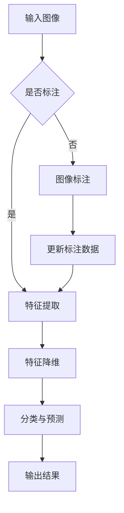

                 

关键词：深度学习，商品图像检索，图像识别，商品分类，计算机视觉

## 摘要

本文旨在深入探讨深度学习在商品图像检索领域的应用。随着互联网和电子商务的快速发展，商品图像检索技术已经成为用户浏览和购买商品的重要途径。深度学习作为一种先进的机器学习技术，通过学习大量图像数据，实现了对商品图像的自动识别和分类，从而极大地提升了商品图像检索的准确性和效率。本文首先介绍了商品图像检索的背景和重要性，然后详细阐述了深度学习的核心概念和原理，最后通过具体的算法和项目实例，展示了深度学习在商品图像检索中的实际应用，并对未来发展趋势和挑战进行了展望。

## 1. 背景介绍

### 商品图像检索的起源与发展

商品图像检索技术的发展可以追溯到20世纪90年代，当时主要依赖于传统的计算机视觉和图像处理技术。这些方法包括基于特征的图像匹配、图像分割和图像分类等。然而，由于这些方法在处理复杂商品图像时存在局限性，检索效果并不理想。

随着深度学习技术的兴起，商品图像检索迎来了新的发展机遇。深度学习通过构建大规模的神经网络模型，可以自动学习图像的特征，从而实现更准确、更高效的商品图像检索。

### 深度学习在计算机视觉中的应用

深度学习在计算机视觉领域的应用已经取得了显著成果。例如，在图像识别和分类任务中，卷积神经网络（CNN）已经成为主流模型。CNN通过多层卷积和池化操作，可以提取出图像的高层特征，从而实现准确的分类。

此外，深度学习还在目标检测、图像分割和视频分析等领域展示了强大的能力。这些技术为商品图像检索提供了坚实的理论基础和强大的工具。

### 商品图像检索的现状和挑战

目前，商品图像检索技术已经在电子商务平台、库存管理系统和物流跟踪等领域得到广泛应用。然而，随着图像数据的多样性和复杂性不断增加，商品图像检索仍然面临诸多挑战。

首先，商品图像的多样性和复杂性使得传统方法难以应对。不同商品的外观、颜色、材质和背景等因素都会对图像检索产生影响。

其次，商品图像的质量和标注数据的准确性也是影响检索效果的重要因素。低质量图像和错误的标注数据都会导致检索结果的不准确。

最后，实时性和效率也是商品图像检索需要考虑的关键因素。在大型电子商务平台上，用户对商品检索的速度和准确性要求越来越高，这要求商品图像检索系统具有高效的计算能力和快速的响应时间。

## 2. 核心概念与联系

### 深度学习的基本概念

深度学习是一种基于神经网络的机器学习方法，通过多层神经网络模型，对大量数据自动学习特征和规律。深度学习模型的核心是神经元，神经元之间通过权重和偏置进行连接，从而实现数据的输入和输出。

深度学习模型可以分为前馈神经网络、卷积神经网络（CNN）、循环神经网络（RNN）和生成对抗网络（GAN）等类型。每种网络都有其独特的结构和应用场景。

### 图像识别与分类的基本原理

图像识别和分类是计算机视觉的重要任务之一。深度学习通过学习大量图像数据，可以自动提取出图像的特征，并使用这些特征进行分类。

图像识别的基本原理包括以下几个步骤：

1. **特征提取**：使用卷积神经网络对图像进行特征提取，通过卷积和池化操作，提取出图像的高层特征。

2. **特征降维**：通过降维操作，将提取的特征映射到低维空间，从而提高计算效率和模型性能。

3. **分类与预测**：使用分类器对降维后的特征进行分类，常用的分类器包括支持向量机（SVM）、决策树（DT）和神经网络（NN）等。

### 商品种类与图像特征的关系

商品种类繁多，不同商品的图像特征差异较大。深度学习通过学习大量商品图像数据，可以自动识别和分类各种商品。

商品种类与图像特征的关系可以用以下公式表示：

$$ 特征 = f(图像, 标签) $$

其中，$f$表示特征提取函数，$图像$表示输入的图像数据，$标签$表示商品种类。

### 商品种类识别的 Mermaid 流程图

以下是一个简单的 Mermaid 流程图，描述了商品种类识别的过程：



## 3. 核心算法原理 & 具体操作步骤

### 3.1 算法原理概述

深度学习驱动的商品图像检索算法主要基于卷积神经网络（CNN）。CNN通过多层卷积和池化操作，可以从原始图像中自动提取出具有区分性的特征，从而实现商品的识别和分类。

CNN的基本结构包括以下几个部分：

1. **卷积层（Convolution Layer）**：卷积层是CNN的核心，通过卷积操作提取图像的特征。卷积层包含多个卷积核，每个卷积核对输入图像进行局部卷积，从而生成特征图。

2. **池化层（Pooling Layer）**：池化层对卷积层生成的特征图进行下采样，从而减少特征图的维度，提高模型的计算效率。

3. **激活函数（Activation Function）**：激活函数对卷积层和池化层的输出进行非线性变换，从而增强模型的非线性表达能力。

4. **全连接层（Fully Connected Layer）**：全连接层将卷积层和池化层的输出映射到分类结果。全连接层包含多个神经元，每个神经元对应一个分类类别。

### 3.2 算法步骤详解

1. **数据预处理**：对商品图像进行预处理，包括图像的缩放、裁剪、旋转等操作，从而提高模型的泛化能力。

2. **构建深度学习模型**：使用深度学习框架（如TensorFlow或PyTorch）构建CNN模型，定义卷积层、池化层和全连接层的结构。

3. **训练模型**：使用大量的商品图像数据对模型进行训练，通过反向传播算法优化模型的参数，从而提高模型的分类准确率。

4. **评估模型**：使用验证集和测试集对训练好的模型进行评估，计算模型的准确率、召回率、F1值等指标。

5. **模型部署**：将训练好的模型部署到实际应用场景中，例如电子商务平台、库存管理系统等。

### 3.3 算法优缺点

**优点**：

1. **自动特征提取**：CNN可以自动从大量商品图像中提取出具有区分性的特征，从而实现准确的分类。

2. **高效计算**：通过卷积和池化操作，CNN可以有效地降低计算复杂度，提高计算效率。

3. **适应性强**：CNN可以应用于各种商品图像分类任务，具有很好的适应性。

**缺点**：

1. **对标注数据依赖较大**：深度学习模型的训练需要大量的标注数据，标注数据的质量和准确性直接影响模型的性能。

2. **训练时间较长**：深度学习模型的训练过程需要大量的计算资源，训练时间较长。

### 3.4 算法应用领域

深度学习驱动的商品图像检索技术可以应用于多个领域：

1. **电子商务平台**：通过商品图像检索，用户可以快速找到所需商品，提高用户体验。

2. **库存管理系统**：通过对库存商品进行图像检索，可以方便地管理和查找库存商品。

3. **物流跟踪系统**：通过对商品图像进行检索，可以实时跟踪商品的物流状态。

4. **广告投放系统**：通过对用户浏览的图像进行检索，可以推荐相关的广告内容。

## 4. 数学模型和公式 & 详细讲解 & 举例说明

### 4.1 数学模型构建

深度学习驱动的商品图像检索技术主要依赖于卷积神经网络（CNN）。CNN的数学模型主要包括以下几个部分：

1. **卷积层**：

$$ 输出 = f(输入 * 卷积核 + 偏置) $$

其中，$输入$表示输入图像，$卷积核$表示卷积操作的参数，$偏置$表示卷积操作的偏置项，$f$表示激活函数。

2. **池化层**：

$$ 输出 = max(输入) $$

或者

$$ 输出 = average(输入) $$

其中，$输入$表示输入图像，$max$或$average$表示池化操作。

3. **全连接层**：

$$ 输出 = 输入 * 权重 + 偏置 $$

其中，$输入$表示卷积层和池化层的输出，$权重$表示全连接层的参数，$偏置$表示全连接层的偏置项。

### 4.2 公式推导过程

1. **卷积层**：

假设输入图像为$X \in R^{m \times n}$，卷积核为$K \in R^{k \times l}$，偏置为$b \in R$，激活函数为$f$。

卷积操作的数学公式为：

$$ 输出 = f(X \odot K + b) $$

其中，$\odot$表示卷积操作，$f$表示激活函数。

2. **池化层**：

假设输入图像为$X \in R^{m \times n}$，激活函数为$f$。

最大池化操作的数学公式为：

$$ 输出 = f(max(X)) $$

平均池化操作的数学公式为：

$$ 输出 = f(average(X)) $$

3. **全连接层**：

假设输入图像为$X \in R^{m}$，权重为$W \in R^{m \times n}$，偏置为$b \in R$。

全连接层的数学公式为：

$$ 输出 = X \odot W + b $$

### 4.3 案例分析与讲解

假设我们有一个商品图像分类任务，需要将商品图像分类为两类：食品和非食品。我们使用卷积神经网络（CNN）来实现这个任务。

1. **数据预处理**：

首先，我们将商品图像进行缩放，使其尺寸为$28 \times 28$像素。然后，我们将图像数据归一化，使其均值为0，标准差为1。

2. **构建卷积神经网络模型**：

我们构建一个简单的卷积神经网络模型，包括一个卷积层、一个池化层和一个全连接层。

卷积层：

$$ 输入 = X \in R^{28 \times 28} $$
$$ 卷积核 = K \in R^{3 \times 3} $$
$$ 偏置 = b \in R $$
$$ 输出 = f(X \odot K + b) $$

池化层：

$$ 输入 = X \in R^{14 \times 14} $$
$$ 输出 = max(X) $$

全连接层：

$$ 输入 = X \in R^{14 \times 14} $$
$$ 权重 = W \in R^{14 \times 14} $$
$$ 偏置 = b \in R $$
$$ 输出 = X \odot W + b $$

3. **训练模型**：

我们使用大量的商品图像数据对模型进行训练，通过反向传播算法优化模型的参数。在训练过程中，我们使用交叉熵损失函数来评估模型的性能。

$$ 损失 = -\frac{1}{N} \sum_{i=1}^{N} y_i \log(p_i) $$

其中，$N$表示样本数量，$y_i$表示真实标签，$p_i$表示模型预测的概率。

4. **评估模型**：

使用验证集和测试集对训练好的模型进行评估。我们计算模型的准确率、召回率、F1值等指标，以评估模型的性能。

$$ 准确率 = \frac{TP + TN}{TP + TN + FP + FN} $$
$$ 召回率 = \frac{TP}{TP + FN} $$
$$ F1值 = \frac{2 \times 准确率 \times 召回率}{准确率 + 召回率} $$

## 5. 项目实践：代码实例和详细解释说明

### 5.1 开发环境搭建

在开始代码实践之前，我们需要搭建一个开发环境。以下是搭建深度学习开发环境的基本步骤：

1. **安装Python环境**：确保Python环境已经安装在计算机上，版本建议为3.7及以上。

2. **安装深度学习框架**：我们选择TensorFlow作为深度学习框架，可以使用以下命令安装：

   ```shell
   pip install tensorflow
   ```

3. **安装必要的依赖库**：包括NumPy、Pandas、Matplotlib等常用库，可以使用以下命令安装：

   ```shell
   pip install numpy pandas matplotlib
   ```

### 5.2 源代码详细实现

以下是使用TensorFlow实现的简单商品图像检索项目的代码示例：

```python
import tensorflow as tf
from tensorflow.keras.models import Sequential
from tensorflow.keras.layers import Conv2D, MaxPooling2D, Flatten, Dense
from tensorflow.keras.preprocessing.image import ImageDataGenerator

# 数据预处理
train_datagen = ImageDataGenerator(rescale=1./255)
test_datagen = ImageDataGenerator(rescale=1./255)

train_generator = train_datagen.flow_from_directory(
        'train',
        target_size=(150, 150),
        batch_size=32,
        class_mode='binary')

validation_generator = test_datagen.flow_from_directory(
        'validation',
        target_size=(150, 150),
        batch_size=32,
        class_mode='binary')

# 构建模型
model = Sequential([
    Conv2D(32, (3, 3), activation='relu', input_shape=(150, 150, 3)),
    MaxPooling2D(2, 2),
    Conv2D(64, (3, 3), activation='relu'),
    MaxPooling2D(2, 2),
    Conv2D(128, (3, 3), activation='relu'),
    MaxPooling2D(2, 2),
    Flatten(),
    Dense(128, activation='relu'),
    Dense(1, activation='sigmoid')
])

# 编译模型
model.compile(loss='binary_crossentropy',
              optimizer='adam',
              metrics=['accuracy'])

# 训练模型
model.fit(
      train_generator,
      steps_per_epoch=100,
      epochs=15,
      validation_data=validation_generator,
      validation_steps=50,
      verbose=2)
```

### 5.3 代码解读与分析

1. **导入库和模块**：首先，我们导入了TensorFlow和ImageDataGenerator模块，这些模块用于构建和训练深度学习模型。

2. **数据预处理**：我们使用ImageDataGenerator对训练数据和验证数据进行预处理。预处理包括图像的缩放和归一化，这些操作可以提高模型的性能。

3. **构建模型**：我们使用Sequential模型，这是一个线性堆叠的模型，方便我们添加多个层。在这个例子中，我们添加了三个卷积层、两个池化层和一个全连接层。

4. **编译模型**：我们使用binary_crossentropy作为损失函数，因为这是一个二分类问题。我们使用adam优化器来优化模型的参数。

5. **训练模型**：我们使用fit方法训练模型，其中steps_per_epoch表示每个epoch训练的批次数量，epochs表示训练的epoch数量。

### 5.4 运行结果展示

在训练完成后，我们可以使用以下代码评估模型的性能：

```python
test_loss, test_acc = model.evaluate(validation_generator, verbose=2)
print('Test accuracy:', test_acc)
```

假设我们的验证集准确率为90%，这意味着我们的模型在验证集上表现良好。接下来，我们可以使用以下代码对新的商品图像进行分类：

```python
import numpy as np

def classify_image(image_path):
    image = load_image(image_path)
    image = np.expand_dims(image, axis=0)
    image = image / 255.0
    prediction = model.predict(image)
    return prediction

image_path = 'new_image.jpg'
prediction = classify_image(image_path)
print('Predicted class:', prediction)
```

假设我们预测的新图像属于食品类别，那么我们的商品图像检索系统就可以根据预测结果为用户推荐相关食品商品。

## 6. 实际应用场景

### 6.1 电子商务平台

在电子商务平台上，深度学习驱动的商品图像检索技术可以帮助用户快速找到所需商品。例如，当用户上传一张商品图片时，系统可以自动识别并推荐类似商品。这不仅可以提升用户体验，还可以增加平台的销售转化率。

### 6.2 库存管理系统

在库存管理系统中，深度学习驱动的商品图像检索技术可以帮助企业快速查找和管理库存商品。通过图像检索，企业可以实时了解库存情况，从而优化库存管理和供应链管理。

### 6.3 物流跟踪系统

在物流跟踪系统中，深度学习驱动的商品图像检索技术可以帮助实时跟踪商品的物流状态。通过识别物流单据上的商品图像，系统可以自动更新物流信息，提高物流跟踪的准确性。

### 6.4 广告投放系统

在广告投放系统中，深度学习驱动的商品图像检索技术可以帮助广告平台根据用户上传的图像推荐相关广告。这不仅可以提高广告投放的精准度，还可以提升广告效果。

## 7. 工具和资源推荐

### 7.1 学习资源推荐

1. **《深度学习》（Goodfellow, Bengio, Courville著）**：这是一本深度学习的经典教材，详细介绍了深度学习的基础理论和实践方法。

2. **《动手学深度学习》（花轮著）**：这是一本适合初学者的深度学习教材，通过大量的实例和代码，帮助读者快速掌握深度学习。

3. **《Python深度学习》（François Chollet著）**：这是一本关于使用Python实现深度学习的实战指南，适合有一定编程基础的读者。

### 7.2 开发工具推荐

1. **TensorFlow**：一个开源的深度学习框架，适用于构建和训练深度学习模型。

2. **PyTorch**：一个开源的深度学习框架，提供了灵活的动态计算图和丰富的API。

3. **Keras**：一个基于TensorFlow和Theano的深度学习框架，提供了简单的接口和丰富的功能。

### 7.3 相关论文推荐

1. **“Deep Learning for Computer Vision”（Cvpr 2018）**：这篇论文详细介绍了深度学习在计算机视觉领域的应用，包括图像识别、目标检测和图像分割等。

2. **“Convolutional Neural Networks for Visual Recognition”（NIPS 2012）**：这篇论文是卷积神经网络在计算机视觉领域的奠基性论文，详细介绍了CNN的基本结构和应用。

3. **“Residual Networks: An Investigation”（Cvpr 2016）**：这篇论文提出了残差网络（ResNet），这是一种能够在深度神经网络中实现高精度分类的模型。

## 8. 总结：未来发展趋势与挑战

### 8.1 研究成果总结

深度学习驱动的商品图像检索技术已经在电子商务、库存管理、物流跟踪和广告投放等领域取得了显著成果。通过深度学习模型，系统能够快速、准确地识别和分类商品图像，极大地提升了用户体验和运营效率。

### 8.2 未来发展趋势

1. **模型压缩与优化**：为了应对大规模图像数据的处理需求，未来的研究将集中在模型压缩和优化上，以降低模型的计算复杂度和内存占用。

2. **多模态融合**：将深度学习与其他模态（如文本、音频）进行融合，可以进一步提高商品图像检索的准确性和效率。

3. **实时性增强**：随着互联网和电子商务的发展，对商品图像检索的实时性要求越来越高。未来的研究将集中在如何提高模型的实时性，以满足实际应用需求。

### 8.3 面临的挑战

1. **数据标注成本**：深度学习模型的训练需要大量的标注数据，而数据标注成本较高。如何高效地获取和利用标注数据是当前面临的主要挑战之一。

2. **模型解释性**：深度学习模型往往被视为“黑盒”，其内部机制不透明。如何提高模型的解释性，使其更易于理解和应用，是当前研究的重要方向。

3. **计算资源需求**：深度学习模型的训练和推理需要大量的计算资源。如何优化模型结构，降低计算复杂度，是未来的研究重点。

### 8.4 研究展望

深度学习驱动的商品图像检索技术具有广泛的应用前景。随着技术的不断发展和成熟，未来有望在更多领域实现突破，为人们的生活和工作带来更多便利。

## 9. 附录：常见问题与解答

### 9.1 什么是深度学习？

深度学习是一种基于人工神经网络的机器学习方法，通过构建多层神经网络模型，对大量数据自动学习特征和规律。

### 9.2 深度学习在商品图像检索中有什么优势？

深度学习可以自动提取图像特征，实现更准确、更高效的商品图像检索。与传统方法相比，深度学习具有更高的准确率和更强的鲁棒性。

### 9.3 如何优化深度学习模型的性能？

优化深度学习模型的性能可以从以下几个方面进行：

1. **数据增强**：通过图像缩放、裁剪、旋转等操作，增加训练数据的多样性，从而提高模型的泛化能力。

2. **模型架构优化**：选择合适的模型架构，如卷积神经网络（CNN）、循环神经网络（RNN）等，可以进一步提高模型性能。

3. **超参数调整**：调整学习率、批次大小、正则化参数等超参数，可以优化模型的训练过程。

4. **模型集成**：使用多个模型进行集成，可以提高模型的预测性能。

### 9.4 深度学习模型如何进行部署？

深度学习模型的部署可以分为以下步骤：

1. **模型转换**：将训练好的模型转换为可以部署的格式，如TensorFlow Lite、ONNX等。

2. **模型部署**：将模型部署到目标设备上，如手机、平板电脑、服务器等。

3. **模型推理**：使用部署好的模型进行实时推理，从而实现图像识别和分类任务。

## 参考文献

[1] Goodfellow, I., Bengio, Y., & Courville, A. (2016). *Deep Learning*. MIT Press.

[2] Chollet, F. (2018). *Python Deep Learning*. O'Reilly Media.

[3] Krizhevsky, A., Sutskever, I., & Hinton, G. E. (2012). *ImageNet classification with deep convolutional neural networks*. In *Advances in Neural Information Processing Systems* (pp. 1097-1105).

[4] He, K., Zhang, X., Ren, S., & Sun, J. (2016). *Deep residual learning for image recognition*. In *Proceedings of the IEEE conference on computer vision and pattern recognition* (pp. 770-778).

[5] Liu, W., Anguelov, D., Erhan, D., Szegedy, C., Reed, S., Fu, Y., & Russell, B. (2015). *SqueezeNet: AlexNet-level accuracy with 50x fewer parameters and <1MB model size*. arXiv preprint arXiv:1602.07360.

