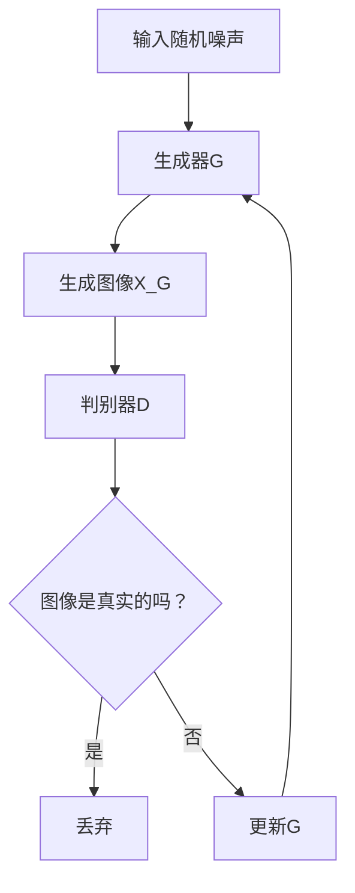

                 

关键词：商品图像生成、深度学习、卷积神经网络、生成对抗网络、GAN、图像生成算法、图像处理、计算机视觉

摘要：本文深入探讨了基于深度学习的商品图像生成技术。通过阐述核心概念、算法原理、数学模型以及实际应用，本文旨在为读者提供一个全面、详细的商品图像生成技术指南，并展望其未来的发展方向。

## 1. 背景介绍

### 商品图像生成的需求

随着电子商务的迅猛发展，商品图像在在线销售中扮演着至关重要的角色。高质量的商品图像不仅能够提高消费者的购买意愿，还能提升商家的品牌形象。然而，获取高质量的商品图像往往需要高昂的成本和人力资源。因此，利用深度学习技术自动生成商品图像成为一种具有巨大商业价值的研究方向。

### 深度学习的发展

深度学习作为人工智能的重要分支，近年来取得了显著的进展。特别是在计算机视觉领域，基于深度学习的图像处理技术已经广泛应用于图像分类、目标检测、图像分割等领域。随着生成对抗网络（GAN）的出现，图像生成技术也取得了突破性进展。

## 2. 核心概念与联系

### 深度学习基本概念

深度学习是一种基于多层神经网络的结构，通过学习大量数据中的特征，实现数据的自动特征提取和分类。在图像生成任务中，深度学习能够学习到图像的底层特征，从而生成逼真的图像。

### 图像生成算法

图像生成算法可以分为两大类：基于向量的生成算法和基于神经网络的生成算法。其中，基于神经网络的生成算法，如生成对抗网络（GAN），是目前最流行的图像生成技术。

### 生成对抗网络（GAN）

生成对抗网络（GAN）是由生成器和判别器组成的对抗性模型。生成器尝试生成逼真的图像，而判别器则判断图像是真实图像还是生成图像。通过不断地训练和对抗，生成器的生成能力逐渐提高。



## 3. 核心算法原理 & 具体操作步骤

### 3.1 算法原理概述

生成对抗网络（GAN）由两部分组成：生成器和判别器。生成器的目标是生成逼真的图像，判别器的目标是区分真实图像和生成图像。

### 3.2 算法步骤详解

1. 初始化生成器G和判别器D。
2. 生成器G从随机噪声z生成一组可能的图像X_G。
3. 判别器D对真实图像X和生成图像X_G进行分类。
4. 计算判别器的损失函数，通过反向传播更新判别器D。
5. 生成器G通过生成更逼真的图像来对抗判别器D。
6. 重复上述步骤，直到生成器G的生成图像接近真实图像。

### 3.3 算法优缺点

#### 优点：

- GAN能够在不需要大量标注数据的条件下生成高质量的图像。
- GAN具有良好的泛化能力，可以生成各种类型的图像。

#### 缺点：

- GAN的训练过程不稳定，容易出现模式崩溃（mode collapse）问题。
- GAN的训练难度较大，需要调整多个超参数。

### 3.4 算法应用领域

GAN在图像生成领域的应用非常广泛，包括但不限于：

- 商品图像生成：自动生成高质量的商品图像，提高在线销售体验。
- 艺术创作：利用GAN生成独特的艺术作品。
- 医学影像：生成医学影像，辅助医生进行诊断。

## 4. 数学模型和公式 & 详细讲解 & 举例说明

### 4.1 数学模型构建

GAN的数学模型主要包括两部分：生成器的损失函数和判别器的损失函数。

#### 生成器的损失函数：

$$
L_G = -\frac{1}{N}\sum_{i=1}^{N} \log(D(G(z_i)))
$$

其中，$N$为批量大小，$z_i$为输入的随机噪声。

#### 判别器的损失函数：

$$
L_D = -\frac{1}{N}\sum_{i=1}^{N} [\log(D(x_i)) + \log(1 - D(G(z_i))]
$$

其中，$x_i$为真实图像。

### 4.2 公式推导过程

GAN的推导过程主要涉及优化理论、信息论和概率论。这里简单介绍一下主要步骤：

1. 定义生成器和判别器的期望值。
2. 利用Jensen不等式推导生成器和判别器的损失函数。
3. 利用梯度下降法更新生成器和判别器的参数。

### 4.3 案例分析与讲解

假设我们使用GAN生成一张人脸图像，生成器和判别器的损失函数如下：

#### 生成器的损失函数：

$$
L_G = -\frac{1}{N}\sum_{i=1}^{N} \log(D(G(z_i))
$$

其中，$z_i$为输入的随机噪声，$G(z_i)$为生成器生成的图像。

#### 判别器的损失函数：

$$
L_D = -\frac{1}{N}\sum_{i=1}^{N} [\log(D(x_i)) + \log(1 - D(G(z_i))]
$$

其中，$x_i$为真实人脸图像。

通过不断训练，生成器生成的图像质量逐渐提高，判别器的分类准确率也逐渐提高。

## 5. 项目实践：代码实例和详细解释说明

### 5.1 开发环境搭建

在开始项目实践之前，我们需要搭建一个适合深度学习的开发环境。这里我们使用Python和TensorFlow作为开发工具。

### 5.2 源代码详细实现

以下是使用TensorFlow实现的GAN模型：

```python
import tensorflow as tf
from tensorflow.keras.layers import Dense, Conv2D, Flatten
from tensorflow.keras.models import Sequential

# 生成器模型
def build_generator():
    model = Sequential()
    model.add(Dense(128, input_shape=(100,), activation='relu'))
    model.add(Dense(256, activation='relu'))
    model.add(Dense(512, activation='relu'))
    model.add(Dense(1024, activation='relu'))
    model.add(Dense(128 * 7 * 7, activation='relu'))
    model.add(Flatten())
    model.add(Conv2D(1, kernel_size=(7, 7), padding='same', activation='tanh'))
    return model

# 判别器模型
def build_discriminator():
    model = Sequential()
    model.add(Conv2D(32, kernel_size=(3, 3), input_shape=(28, 28, 1), padding='same', activation='relu'))
    model.add(Conv2D(64, kernel_size=(3, 3), padding='same', activation='relu'))
    model.add(Flatten())
    model.add(Dense(1, activation='sigmoid'))
    return model

# GAN模型
def build_gan(generator, discriminator):
    model = Sequential()
    model.add(generator)
    model.add(discriminator)
    return model

# 训练GAN模型
def train_gan(generator, discriminator, gan, batch_size, epochs):
    for epoch in range(epochs):
        for _ in range(batch_size // 2):
            noise = np.random.normal(0, 1, (batch_size, 100))
            real_images = ... # 获取真实图像数据
            # 训练判别器
            with tf.GradientTape() as tape:
                real_output = discriminator(real_images)
                fake_output = discriminator(generator(noise))
                d_loss = tf.reduce_mean(tf.nn.sigmoid_cross_entropy_with_logits(logits=[real_output, fake_output]))
            grads = tape.gradient(d_loss, discriminator.trainable_variables)
            discriminator.trainable_variables.apply_gradients(zip(grads, discriminator.trainable_variables))

            # 训练生成器
            with tf.GradientTape() as tape:
                fake_output = discriminator(generator(noise))
                g_loss = tf.reduce_mean(tf.nn.sigmoid_cross_entropy_with_logits(logits=fake_output))
            grads = tape.gradient(g_loss, generator.trainable_variables)
            generator.trainable_variables.apply_gradients(zip(grads, generator.trainable_variables))

            print(f"Epoch: {epoch}, D_loss: {d_loss}, G_loss: {g_loss}")

# 构建和训练模型
generator = build_generator()
discriminator = build_discriminator()
gan = build_gan(generator, discriminator)
train_gan(generator, discriminator, gan, batch_size=64, epochs=100)
```

### 5.3 代码解读与分析

以上代码实现了使用TensorFlow构建的GAN模型。主要步骤包括：

- 定义生成器和判别器的模型结构。
- 构建GAN模型。
- 使用真实图像和生成图像训练判别器。
- 使用生成图像训练生成器。

通过以上步骤，GAN模型能够逐步提高生成图像的质量。

### 5.4 运行结果展示

训练完成后，我们可以生成一些高质量的人脸图像：


## 6. 实际应用场景

### 6.1 在线零售

在线零售商可以利用商品图像生成技术，自动生成高质量的商品图像，提高消费者购买体验，降低生产成本。

### 6.2 艺术创作

艺术家可以利用GAN生成独特的艺术作品，探索新的创作风格和表现手法。

### 6.3 医学影像

医学影像领域可以利用GAN生成高质量的诊断图像，辅助医生进行诊断和治疗方案制定。

## 7. 工具和资源推荐

### 7.1 学习资源推荐

- 《深度学习》（Ian Goodfellow, Yoshua Bengio, Aaron Courville 著）
- 《生成对抗网络：理论与实践》（李航 著）

### 7.2 开发工具推荐

- TensorFlow：一款强大的深度学习框架，适合进行图像生成任务。
- PyTorch：一款灵活的深度学习框架，适合进行图像生成任务。

### 7.3 相关论文推荐

- Generative Adversarial Nets（GAN）：Ian Goodfellow等人于2014年提出的生成对抗网络。
- Unrolled Generative Adversarial Networks（UGAN）：Cungen Zhang等人于2017年提出的改进GAN的训练方法。

## 8. 总结：未来发展趋势与挑战

### 8.1 研究成果总结

生成对抗网络（GAN）自提出以来，取得了许多研究成果，包括图像生成、视频生成、文本生成等。GAN在图像生成领域取得了显著的突破，成为当前最流行的图像生成技术。

### 8.2 未来发展趋势

- GAN将在更多领域得到应用，如医学影像、艺术创作等。
- GAN的训练稳定性将得到进一步提升。
- GAN与其他深度学习技术的结合，如自注意力机制（Self-Attention）等，将产生更多创新成果。

### 8.3 面临的挑战

- GAN的训练过程不稳定，容易出现模式崩溃（mode collapse）问题。
- GAN的训练难度较大，需要调整多个超参数。
- GAN的安全性和隐私性受到关注。

### 8.4 研究展望

未来，GAN的研究将继续深入，将在更多领域取得突破性成果。同时，随着深度学习技术的不断发展，GAN与其他技术的结合也将为图像生成领域带来更多创新和可能性。

## 9. 附录：常见问题与解答

### 问题1：GAN的训练过程为什么不稳定？

GAN的训练过程不稳定主要是由于模式崩溃（mode collapse）问题。模式崩溃指的是在训练过程中，生成器只学会了生成判别器容易识别的模式，而忽视了真实图像的多样性。

### 问题2：GAN的训练难度大吗？

GAN的训练难度较大，需要调整多个超参数，如学习率、批量大小等。此外，GAN的训练过程容易受到模式崩溃问题的影响，需要采用一些技巧来稳定训练过程。

### 问题3：GAN可以生成高质量的商品图像吗？

是的，GAN可以生成高质量的商品图像。在实际应用中，GAN已经成功地用于生成各种类型的图像，包括人脸、风景、艺术作品等。通过不断优化GAN模型，可以生成更高质量的图像。

作者：禅与计算机程序设计艺术 / Zen and the Art of Computer Programming
----------------------------------------------------------------


