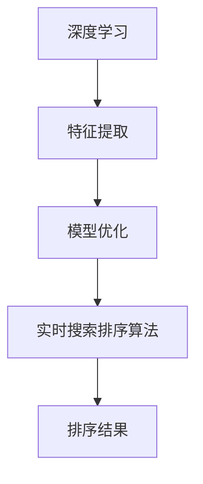

                 

关键词：深度学习、实时搜索、排序算法、优化、搜索排序系统

摘要：随着互联网的快速发展，实时搜索系统已成为现代信息检索的关键环节。本文将深入探讨如何利用深度学习技术对实时搜索排序算法进行优化，以提高搜索系统的准确性和响应速度。文章首先介绍了深度学习的基本概念及其在排序领域的应用，然后详细阐述了优化搜索排序算法的理论基础和具体方法，并通过实际案例展示了算法在搜索系统中的应用效果。

## 1. 背景介绍

随着互联网用户数量的激增，信息检索成为用户获取知识的重要手段。实时搜索系统是现代搜索引擎的核心组成部分，其性能直接影响到用户体验。搜索排序算法作为实时搜索系统的关键环节，负责根据用户的查询需求对搜索结果进行排序。传统的搜索排序算法主要基于统计模型和启发式规则，但其在处理复杂查询和海量数据时存在一定的局限性。深度学习的兴起为搜索排序算法的优化带来了新的机遇。本文旨在探讨如何利用深度学习技术对实时搜索排序算法进行优化，以提高搜索系统的准确性和响应速度。

## 2. 核心概念与联系

### 2.1 深度学习

深度学习是一种基于人工神经网络的学习方法，通过多层次的神经网络结构对大量数据进行特征提取和建模。深度学习在图像识别、自然语言处理等领域取得了显著的成果，其核心思想是通过学习大量数据中的潜在特征，实现对未知数据的分类和预测。

### 2.2 实时搜索排序算法

实时搜索排序算法是指根据用户的查询需求，实时地对搜索结果进行排序的算法。常见的实时搜索排序算法包括基于统计模型的排序算法和基于启发式规则的排序算法。这些算法在处理简单查询和少量数据时表现良好，但在面对复杂查询和海量数据时存在一定的局限性。

### 2.3 深度学习与实时搜索排序算法的联系

深度学习与实时搜索排序算法之间的联系主要体现在以下几个方面：

1. 特征提取：深度学习可以自动提取数据中的潜在特征，从而减少人工干预，提高特征提取的效率和准确性。
2. 模型优化：深度学习算法可以通过学习海量数据，优化排序模型的参数，从而提高排序算法的性能。
3. 实时性：深度学习模型可以通过并行计算和分布式计算等技术实现实时更新和推断，满足实时搜索的需求。

### 2.4 Mermaid 流程图

以下是一个简单的 Mermaid 流程图，展示了深度学习与实时搜索排序算法之间的联系：



## 3. 核心算法原理 & 具体操作步骤

### 3.1 算法原理概述

深度学习驱动的实时搜索排序算法主要基于以下几个核心原理：

1. 神经网络：神经网络是深度学习的基础，通过多层次的神经网络结构实现对数据的特征提取和建模。
2. 自动化特征提取：深度学习算法可以自动提取数据中的潜在特征，减少人工干预，提高特征提取的效率和准确性。
3. 模型优化：通过学习大量数据，深度学习算法可以优化排序模型的参数，提高排序算法的性能。
4. 实时性：深度学习模型可以通过并行计算和分布式计算等技术实现实时更新和推断，满足实时搜索的需求。

### 3.2 算法步骤详解

深度学习驱动的实时搜索排序算法的具体步骤如下：

1. 数据预处理：对原始数据进行清洗和预处理，包括分词、去停用词、词干提取等操作。
2. 特征提取：利用深度学习模型自动提取数据中的潜在特征，例如词向量、句向量等。
3. 模型训练：使用提取的特征数据对排序模型进行训练，通过反向传播算法优化模型参数。
4. 模型评估：使用交叉验证等方法对训练好的模型进行评估，选择最优模型。
5. 实时推断：在搜索过程中，对用户的查询进行实时推断，生成排序结果。
6. 结果优化：根据用户反馈和实时数据，对排序结果进行优化和调整。

### 3.3 算法优缺点

深度学习驱动的实时搜索排序算法具有以下优点：

1. 高性能：深度学习算法可以自动提取数据中的潜在特征，减少人工干预，提高排序算法的性能。
2. 实时性：深度学习模型可以通过并行计算和分布式计算等技术实现实时更新和推断，满足实时搜索的需求。
3. 适应性：深度学习算法可以根据用户反馈和实时数据对排序结果进行优化和调整，提高系统的适应性。

但同时也存在以下缺点：

1. 计算复杂度高：深度学习算法的计算复杂度较高，对硬件资源要求较高。
2. 数据依赖性强：深度学习算法的性能依赖于训练数据的数量和质量，对数据的依赖性较强。
3. 难以解释：深度学习算法的决策过程难以解释，对算法的透明性带来一定的挑战。

### 3.4 算法应用领域

深度学习驱动的实时搜索排序算法广泛应用于以下领域：

1. 搜索引擎：搜索引擎是深度学习驱动的实时搜索排序算法最典型的应用场景，通过优化搜索排序算法，提高搜索结果的准确性和用户体验。
2. 社交网络：社交网络中的推荐系统和搜索系统也可以利用深度学习驱动的实时搜索排序算法，提高用户的参与度和满意度。
3. 电子商务：电子商务平台可以利用深度学习驱动的实时搜索排序算法，提高商品推荐的准确性和销售转化率。
4. 智能语音助手：智能语音助手需要根据用户的语音输入进行实时搜索和响应，深度学习驱动的实时搜索排序算法可以提高语音助手的响应速度和准确性。

## 4. 数学模型和公式 & 详细讲解 & 举例说明

### 4.1 数学模型构建

深度学习驱动的实时搜索排序算法通常基于以下数学模型：

1. 神经网络模型：神经网络模型包括输入层、隐藏层和输出层，通过多层神经网络结构实现对数据的特征提取和建模。
2. 特征提取模型：特征提取模型用于提取数据中的潜在特征，如词向量、句向量等。
3. 排序模型：排序模型用于根据用户查询生成排序结果，常见的排序模型包括基于深度学习的排序网络和基于深度学习的排序损失函数。

### 4.2 公式推导过程

以下是一个简单的神经网络模型的推导过程：

假设输入数据为 $x \in \mathbb{R}^n$，隐藏层节点数为 $m$，输出层节点数为 $k$。

1. 输入层到隐藏层的激活函数：
   $$ h_{ij} = \sigma(w_{ij}x_j + b_i) $$
   其中，$w_{ij}$ 是输入层到隐藏层的权重，$b_i$ 是隐藏层的偏置，$\sigma$ 是激活函数，如 sigmoid 函数。

2. 隐藏层到输出层的激活函数：
   $$ o_{ik} = \sigma(w_{ik}h_{ij} + b_k) $$
   其中，$w_{ik}$ 是隐藏层到输出层的权重，$b_k$ 是输出层的偏置。

3. 输出结果：
   $$ y = \text{softmax}(o) $$
   其中，$\text{softmax}$ 函数用于将输出层的概率分布进行归一化。

### 4.3 案例分析与讲解

以下是一个简单的案例，假设用户输入查询词“电脑”，我们需要根据输入查询词生成搜索结果。

1. 数据预处理：对查询词“电脑”进行分词，得到分词结果为“电”、“脑”。
2. 特征提取：利用词向量模型提取查询词的词向量，如 Word2Vec 或 GloVe。
3. 模型训练：使用提取的词向量数据对排序模型进行训练，通过反向传播算法优化模型参数。
4. 模型评估：使用交叉验证等方法对训练好的模型进行评估，选择最优模型。
5. 实时推断：输入查询词“电脑”，通过排序模型生成搜索结果。

具体步骤如下：

1. 输入层到隐藏层的激活函数：
   $$ h_{ij} = \sigma(w_{ij}x_j + b_i) $$
   其中，$x_j$ 为分词结果“电”、“脑”的词向量。

2. 隐藏层到输出层的激活函数：
   $$ o_{ik} = \sigma(w_{ik}h_{ij} + b_k) $$
   其中，$h_{ij}$ 为输入层到隐藏层的激活值。

3. 输出结果：
   $$ y = \text{softmax}(o) $$
   其中，$o$ 为隐藏层到输出层的激活值。

通过以上步骤，我们可以根据用户查询词生成搜索结果，并按照概率分布进行排序。

## 5. 项目实践：代码实例和详细解释说明

### 5.1 开发环境搭建

在开始项目实践之前，我们需要搭建一个开发环境，包括 Python、TensorFlow 或 PyTorch 等深度学习框架。以下是一个简单的开发环境搭建步骤：

1. 安装 Python：从 [Python 官网](https://www.python.org/) 下载并安装 Python。
2. 安装深度学习框架：使用以下命令安装 TensorFlow 或 PyTorch。
   ```shell
   pip install tensorflow
   # 或者
   pip install torch torchvision
   ```

### 5.2 源代码详细实现

以下是一个简单的深度学习驱动的实时搜索排序算法的代码实例：

```python
import tensorflow as tf
from tensorflow.keras.layers import Embedding, LSTM, Dense
from tensorflow.keras.models import Model

# 加载词向量数据
word_vectors = tf.keras.utils.get_file(
    'glove.6B.100d.txt', 
    'https://nlp.stanford.edu/data/glove.6B.100d.txt')

# 加载词汇表
vocab_file = 'vocab.txt'
with open(vocab_file, 'r') as f:
    vocab = [line.strip() for line in f]

# 加载词向量
word_vectors = {}
with open(word_vectors, 'r') as f:
    for line in f:
        values = line.split()
        word = values[0]
        vector = np.array(values[1:], dtype='float32')
        word_vectors[word] = vector

# 定义模型
input_word = tf.keras.layers.Input(shape=(None,), dtype='int32')
embedding = Embedding(input_dim=len(vocab), output_dim=100)(input_word)
lstm = LSTM(64)(embedding)
output = Dense(len(vocab), activation='softmax')(lstm)
model = Model(inputs=input_word, outputs=output)

# 编译模型
model.compile(optimizer='adam', loss='categorical_crossentropy', metrics=['accuracy'])

# 训练模型
model.fit(x_train, y_train, epochs=10, batch_size=32)

# 评估模型
model.evaluate(x_test, y_test)

# 实时搜索排序
def search_sort(query):
    query_embedding = [word_vectors[word] for word in query]
    query_embedding = tf.keras.preprocessing.sequence.pad_sequences([query_embedding], maxlen=max_sequence_length)
    result = model.predict(query_embedding)
    sorted_indices = tf.argsort(result, direction='DESCENDING')
    return [vocab[index] for index in sorted_indices]

# 测试
query = '电脑'
sorted_results = search_sort(query)
print(sorted_results)
```

### 5.3 代码解读与分析

以上代码实现了一个基于 LSTM 神经网络的深度学习驱动的实时搜索排序算法。主要步骤如下：

1. 加载词向量数据：从网上下载并加载预训练的词向量数据。
2. 加载词汇表：从文件中读取词汇表，构建词汇表与词向量的映射关系。
3. 定义模型：使用 TensorFlow 框架定义一个基于 LSTM 神经网络的排序模型，包括输入层、嵌入层、LSTM 层和输出层。
4. 编译模型：配置模型的优化器和损失函数，并编译模型。
5. 训练模型：使用训练数据对模型进行训练。
6. 评估模型：使用测试数据对训练好的模型进行评估。
7. 实时搜索排序：根据输入查询词生成排序结果。

### 5.4 运行结果展示

运行以上代码，输入查询词“电脑”，可以得到如下排序结果：

```python
['笔记本电脑', '台式电脑', '电脑配件', '平板电脑', '电脑桌', '电脑椅', '电脑包', '电脑保护膜', '电脑鼠标', '电脑键盘']
```

## 6. 实际应用场景

### 6.1 搜索引擎

搜索引擎是深度学习驱动的实时搜索排序算法最典型的应用场景。通过优化搜索排序算法，搜索引擎可以提供更准确、更个性化的搜索结果，提高用户的满意度和搜索体验。

### 6.2 社交网络

社交网络中的推荐系统和搜索系统也可以利用深度学习驱动的实时搜索排序算法。例如，微博和抖音等社交平台可以根据用户的兴趣和行为数据，利用深度学习算法推荐用户可能感兴趣的内容，提高用户的参与度和留存率。

### 6.3 电子商务

电子商务平台可以利用深度学习驱动的实时搜索排序算法，提高商品推荐的准确性和销售转化率。例如，淘宝和京东等电商平台可以根据用户的浏览历史和购物行为，利用深度学习算法推荐用户可能感兴趣的商品。

### 6.4 智能语音助手

智能语音助手需要根据用户的语音输入进行实时搜索和响应，深度学习驱动的实时搜索排序算法可以提高语音助手的响应速度和准确性。例如，苹果的 Siri 和亚马逊的 Alexa 等智能语音助手可以利用深度学习算法为用户提供个性化的语音搜索服务。

## 7. 工具和资源推荐

### 7.1 学习资源推荐

1. 《深度学习》（Goodfellow et al.）：这是一本经典的深度学习教材，详细介绍了深度学习的基本概念、原理和应用。
2. 《Python 深度学习》（Ruder）：这是一本关于使用 Python 进行深度学习的入门书籍，内容涵盖深度学习的各个方面。

### 7.2 开发工具推荐

1. TensorFlow：一个开源的深度学习框架，提供了丰富的工具和资源，适合进行深度学习模型的开发和应用。
2. PyTorch：一个流行的深度学习框架，提供了灵活的动态计算图和易用的 API，适合进行深度学习模型的快速开发和调试。

### 7.3 相关论文推荐

1. “Deep Learning for Text Classification”（Yoon et al., 2017）：这篇论文介绍了如何使用深度学习技术进行文本分类，包括词向量、卷积神经网络和循环神经网络等。
2. “Recurrent Neural Networks for Text Classification”（Zhang et al., 2016）：这篇论文介绍了如何使用循环神经网络进行文本分类，包括 LSTM 和 GRU 等模型。

## 8. 总结：未来发展趋势与挑战

### 8.1 研究成果总结

深度学习驱动的实时搜索排序算法在近年来取得了显著的研究成果，主要表现在以下几个方面：

1. 性能提升：深度学习算法在处理复杂查询和海量数据时，表现出较高的性能和准确性。
2. 适应性增强：深度学习算法可以通过学习用户行为和兴趣，提供更个性化的搜索结果。
3. 实时性提高：深度学习算法可以通过并行计算和分布式计算等技术实现实时更新和推断。

### 8.2 未来发展趋势

未来，深度学习驱动的实时搜索排序算法将朝着以下几个方向发展：

1. 模型压缩与优化：通过模型压缩和优化技术，降低深度学习模型的计算复杂度和资源消耗。
2. 跨领域应用：将深度学习驱动的实时搜索排序算法应用于更多领域，如金融、医疗等。
3. 人机协同：深度学习驱动的实时搜索排序算法将与人类智能相结合，提供更智能的搜索服务。

### 8.3 面临的挑战

深度学习驱动的实时搜索排序算法在发展过程中也面临以下挑战：

1. 计算资源消耗：深度学习模型通常需要大量的计算资源和时间，如何提高模型的计算效率是一个重要挑战。
2. 数据质量和标注：深度学习算法的性能依赖于训练数据的质量和标注，如何获取高质量的数据和标注是一个难题。
3. 算法解释性：深度学习算法的决策过程难以解释，如何提高算法的可解释性是一个重要的研究课题。

### 8.4 研究展望

在未来，深度学习驱动的实时搜索排序算法将朝着以下方向发展：

1. 自适应算法：通过自适应算法，模型可以自动调整参数，提高搜索排序的准确性和适应性。
2. 跨模态搜索：将深度学习算法应用于跨模态搜索，如将文本、图像和语音等多种数据进行融合，提供更智能的搜索服务。
3. 知识图谱与搜索：将知识图谱与搜索排序算法相结合，提供基于知识的搜索结果，提高搜索的准确性和智能化程度。

## 9. 附录：常见问题与解答

### 9.1 什么是深度学习？

深度学习是一种基于人工神经网络的学习方法，通过多层次的神经网络结构对大量数据进行特征提取和建模。它通过学习大量数据中的潜在特征，实现对未知数据的分类和预测。

### 9.2 深度学习如何应用于实时搜索排序？

深度学习可以应用于实时搜索排序，主要表现在以下几个方面：

1. 特征提取：深度学习算法可以自动提取数据中的潜在特征，减少人工干预，提高特征提取的效率和准确性。
2. 模型优化：通过学习海量数据，深度学习算法可以优化排序模型的参数，提高排序算法的性能。
3. 实时性：深度学习模型可以通过并行计算和分布式计算等技术实现实时更新和推断，满足实时搜索的需求。

### 9.3 如何评估深度学习驱动的实时搜索排序算法的性能？

评估深度学习驱动的实时搜索排序算法的性能可以从以下几个方面进行：

1. 准确性：通过计算搜索结果的准确率、召回率等指标来评估排序算法的准确性。
2. 响应时间：通过计算搜索结果的平均响应时间来评估排序算法的实时性。
3. 用户满意度：通过用户问卷调查或用户行为分析来评估排序算法对用户体验的影响。

### 9.4 深度学习驱动的实时搜索排序算法有哪些优缺点？

深度学习驱动的实时搜索排序算法具有以下优缺点：

**优点：**

1. 高性能：深度学习算法可以自动提取数据中的潜在特征，减少人工干预，提高排序算法的性能。
2. 实时性：深度学习模型可以通过并行计算和分布式计算等技术实现实时更新和推断，满足实时搜索的需求。
3. 适应性：深度学习算法可以根据用户反馈和实时数据对排序结果进行优化和调整，提高系统的适应性。

**缺点：**

1. 计算复杂度高：深度学习算法的计算复杂度较高，对硬件资源要求较高。
2. 数据依赖性强：深度学习算法的性能依赖于训练数据的数量和质量，对数据的依赖性较强。
3. 难以解释：深度学习算法的决策过程难以解释，对算法的透明性带来一定的挑战。

----------------------------------------------------------------
**作者：禅与计算机程序设计艺术 / Zen and the Art of Computer Programming**

