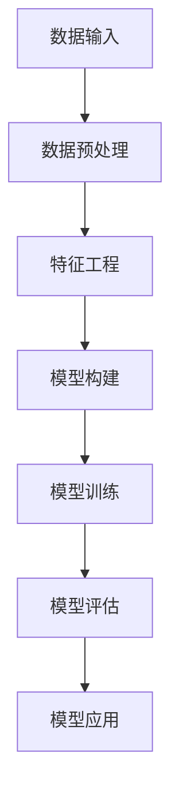

                 

关键词：深度学习，长尾需求，商品预测，算法原理，数学模型，实践应用

## 摘要

本文探讨了如何使用深度学习技术来预测长尾商品需求。在互联网时代，随着电子商务平台的兴起，消费者对于商品的个性化需求日益增长，长尾商品市场逐渐成为商业竞争的新战场。传统的需求预测方法难以捕捉长尾市场的特点，因此，本文提出了一种基于深度学习的需求预测模型，并通过实验验证了其在实际应用中的有效性。本文首先介绍了长尾商品需求的背景和意义，然后详细阐述了深度学习在需求预测中的应用原理，最后通过一个具体的商品预测项目，展示了模型的构建、实现和优化过程，并对未来长尾商品需求预测技术的发展方向进行了展望。

## 1. 背景介绍

### 1.1 长尾商品需求的兴起

在传统商业模式中，市场通常被少数热门商品所主导，这些商品由于其高销量而获得了较高的市场关注度和利润率。然而，随着互联网技术的飞速发展和消费者个性化需求的增加，越来越多的长尾商品开始崭露头角。长尾商品通常是指那些销售量较低，但总销售量加起来却占据市场相当份额的商品。

长尾效应最早由美国互联网营销专家Chris Anderson在2004年提出。他在《长尾理论》一书中指出，通过互联网平台，企业和消费者可以更高效地连接，使得原本被主流市场忽视的小众需求也能实现规模化生产和销售。长尾商品的兴起不仅为消费者提供了更多的选择，也为企业开辟了新的市场空间。

### 1.2 传统需求预测方法的局限

传统的需求预测方法主要包括时间序列分析、回归分析和计量经济学等方法。这些方法在处理大规模、高频率的数据时表现出色，但在面对长尾商品这种需求分布不均匀、数据稀疏的特点时，往往难以给出准确的预测结果。主要表现在以下几个方面：

1. **数据稀疏问题**：长尾商品的数据往往比较稀疏，即这些商品的销售数据样本量较少，这使得基于样本数据进行预测的传统方法效果不佳。

2. **趋势不可预测性**：长尾商品的需求变化难以捕捉到明显的周期性或趋势性，导致传统需求预测方法难以准确预测其需求量。

3. **忽略个体差异**：传统方法往往假设所有商品的需求变化趋势相同，无法充分考虑个体差异，从而影响预测准确性。

### 1.3 深度学习在需求预测中的应用

深度学习作为近年来人工智能领域的热门技术，以其强大的数据建模和特征学习能力，在处理复杂数据和进行预测方面表现出色。深度学习在需求预测中的应用，主要通过以下两个方面来解决传统方法的局限：

1. **特征提取和融合**：深度学习可以通过多层神经网络提取和融合原始数据中的隐含特征，从而更好地捕捉到数据中的规律性。

2. **非线性建模**：深度学习模型能够有效地处理非线性问题，使其在捕捉长尾商品需求变化的非线性和复杂性方面具有显著优势。

基于上述背景，本文提出了一种基于深度学习的需求预测模型，旨在提高长尾商品需求的预测准确性，为企业制定更加精准的库存管理和市场策略提供支持。

## 2. 核心概念与联系

### 2.1 深度学习的基本原理

深度学习是一种基于多层神经网络的机器学习技术，其核心思想是通过模拟人脑神经网络的结构和功能，实现对复杂数据的自动特征学习和模式识别。深度学习的基本原理可以概括为以下几个步骤：

1. **数据输入**：将原始数据输入到神经网络中，数据可以是数值型、文本型或图像型等不同形式。

2. **特征提取**：通过神经网络的输入层、隐藏层和输出层，逐层提取数据中的特征。每一层神经网络都会对输入数据进行加工和处理，形成更高层次的特征表示。

3. **非线性变换**：神经网络中的每个神经元都会通过激活函数（如ReLU、Sigmoid、Tanh等）实现非线性变换，使得神经网络能够处理非线性关系。

4. **输出预测**：最后，输出层对提取到的特征进行分类或回归预测，得到最终的预测结果。

### 2.2 需求预测的基本概念

在电子商务领域，需求预测是指根据历史数据和市场信息，对未来商品的销售量进行预测。需求预测的基本概念包括：

1. **历史数据**：历史数据是指过去一段时间内商品的销售记录，包括销售量、销售时间、价格等信息。

2. **市场信息**：市场信息是指与商品销售相关的外部信息，如市场趋势、季节性因素、消费者偏好等。

3. **预测目标**：预测目标是指需要预测的未来销售量，可以是一个具体的数值，也可以是一个区间范围。

4. **预测模型**：预测模型是指用于预测需求量的数学模型或算法，可以是线性模型、非线性模型或组合模型等。

### 2.3 深度学习在需求预测中的应用

深度学习在需求预测中的应用，主要是通过构建一个能够自动提取和融合特征的多层神经网络，实现对历史数据和市场信息的有效建模。具体应用步骤如下：

1. **数据预处理**：对原始数据进行清洗、去噪和归一化处理，使其适合深度学习模型的输入要求。

2. **特征工程**：通过对原始数据进行特征提取和变换，生成能够有效描述需求变化的特征向量。

3. **模型构建**：设计一个多层神经网络结构，包括输入层、隐藏层和输出层，每个层都包含多个神经元。

4. **模型训练**：使用历史数据对神经网络进行训练，通过反向传播算法不断调整网络参数，使预测结果与实际销售量尽量接近。

5. **模型评估**：使用验证集或测试集对训练好的模型进行评估，通过指标如均方误差（MSE）、均方根误差（RMSE）等来衡量预测模型的准确性。

6. **模型应用**：将训练好的模型应用于实际销售数据的预测，为企业提供科学的决策支持。

### 2.4 Mermaid 流程图

以下是深度学习在需求预测中的基本流程图：



通过上述流程图，可以清晰地看到深度学习在需求预测中的应用步骤和各步骤之间的关联。

## 3. 核心算法原理 & 具体操作步骤

### 3.1 算法原理概述

本文提出的基于深度学习的需求预测算法，主要基于卷积神经网络（CNN）和循环神经网络（RNN）的组合结构。CNN擅长处理图像和序列数据中的局部特征，而RNN则擅长处理序列数据中的长期依赖关系。两者结合可以有效地提取数据中的时空特征，提高需求预测的准确性。

算法的核心原理可以概括为以下几个步骤：

1. **数据输入**：将原始销售数据输入到网络中，包括销售量、销售时间、价格等。

2. **特征提取**：通过CNN提取数据中的局部特征，如时间序列中的周期性波动和价格变化等。

3. **特征融合**：将CNN提取的局部特征与RNN提取的长期依赖关系进行融合，生成更全面的特征向量。

4. **预测输出**：使用融合后的特征向量进行需求量的预测。

### 3.2 算法步骤详解

#### 3.2.1 数据预处理

数据预处理是深度学习模型构建的第一步，其目的是将原始数据转换为适合模型输入的形式。具体步骤如下：

1. **数据清洗**：去除数据中的噪声和异常值，如缺失值、重复值和错误值等。

2. **数据归一化**：对销售量、价格等数值型数据进行归一化处理，使其分布在相似的范围内，避免模型训练时出现梯度消失或梯度爆炸等问题。

3. **序列化**：将时间序列数据转换为固定长度的序列，可以通过填充或截断等方法实现。

#### 3.2.2 特征工程

特征工程是深度学习模型构建的关键环节，其目的是从原始数据中提取出有助于预测的特征。具体步骤如下：

1. **时间特征提取**：通过CNN提取时间序列中的周期性特征，如趋势、季节性和周期性波动等。

2. **价格特征提取**：通过CNN提取价格序列中的特征，如价格变化的幅度和频率等。

3. **融合特征**：将时间特征和价格特征进行融合，生成更全面的特征向量。

#### 3.2.3 模型构建

模型构建是深度学习算法的核心，本文使用CNN和RNN的组合结构进行需求预测。具体步骤如下：

1. **CNN构建**：构建一个CNN模型，用于提取时间序列和价格序列中的局部特征。

2. **RNN构建**：构建一个RNN模型，用于提取时间序列中的长期依赖关系。

3. **融合层构建**：将CNN和RNN的输出进行融合，生成最终的预测特征向量。

4. **输出层构建**：构建一个全连接层，用于进行需求量的预测。

#### 3.2.4 模型训练

模型训练是深度学习算法的关键步骤，其目的是通过迭代优化网络参数，使模型能够准确预测需求量。具体步骤如下：

1. **损失函数选择**：选择一个合适的损失函数，如均方误差（MSE）或均方根误差（RMSE），用于衡量预测误差。

2. **优化算法选择**：选择一个优化算法，如梯度下降（GD）或Adam优化器，用于调整网络参数。

3. **迭代训练**：通过迭代训练过程，不断调整网络参数，使预测误差最小化。

#### 3.2.5 模型评估

模型评估是验证模型性能的重要环节，通过评估指标来衡量模型的预测准确性。具体步骤如下：

1. **验证集划分**：将数据集划分为训练集和验证集，用于模型训练和性能评估。

2. **指标计算**：计算预测误差指标，如均方误差（MSE）、均方根误差（RMSE）等，用于评估模型性能。

3. **模型选择**：根据评估结果，选择最优模型进行应用。

### 3.3 算法优缺点

#### 优点

1. **强大的特征提取能力**：深度学习模型能够自动提取和融合数据中的复杂特征，提高需求预测的准确性。

2. **非线性建模能力**：深度学习模型能够有效处理需求变化中的非线性关系，提高预测的泛化能力。

3. **适应性强**：深度学习模型能够适应不同类型的数据和需求变化，具有较强的适应性。

#### 缺点

1. **计算资源需求高**：深度学习模型训练过程中需要大量的计算资源，特别是大规模数据集和复杂网络结构时。

2. **数据依赖性强**：深度学习模型的性能依赖于数据的分布和质量，如果数据存在噪声或缺失，可能会影响预测准确性。

3. **解释性较差**：深度学习模型的预测结果较为复杂，难以进行解释和可视化，对于业务理解和决策支持存在一定的局限性。

### 3.4 算法应用领域

深度学习在需求预测中的应用非常广泛，主要领域包括：

1. **电子商务**：通过预测商品销售量，帮助企业制定库存管理和市场策略，提高销售利润。

2. **物流配送**：通过预测物流需求，优化物流线路和配送计划，提高物流效率。

3. **供应链管理**：通过预测供应链中的各项指标，如原材料需求、生产计划等，优化供应链管理，降低成本。

4. **金融领域**：通过预测金融市场的需求，优化投资组合和风险管理策略。

5. **医疗健康**：通过预测药品需求，优化药品供应和库存管理，提高医疗资源的利用率。

## 4. 数学模型和公式 & 详细讲解 & 举例说明

### 4.1 数学模型构建

在需求预测中，深度学习模型的构建过程主要包括以下几个步骤：

1. **输入层**：输入层接收原始数据，如销售量、时间、价格等。设输入数据的维度为\(D\)。

2. **隐藏层**：隐藏层通过神经网络结构进行特征提取和融合。设隐藏层的层数为\(L\)，每层神经元的个数为\(M_l\)。

3. **输出层**：输出层将隐藏层的特征进行融合，生成最终的预测结果。设输出层神经元的个数为\(N\)。

4. **激活函数**：在隐藏层和输出层之间引入激活函数，如ReLU函数、Sigmoid函数等，以实现非线性变换。

5. **损失函数**：选择合适的损失函数，如均方误差（MSE）、均方根误差（RMSE）等，用于衡量预测误差。

### 4.2 公式推导过程

假设我们使用卷积神经网络（CNN）和循环神经网络（RNN）的组合模型进行需求预测，其数学模型可以表示为：

\[ Y = f(Z) \]

其中，\(Y\)表示预测结果，\(Z\)表示输入特征，\(f\)表示神经网络的前向传播函数。

1. **输入层到隐藏层的变换**：

\[ Z^{(l)} = W^{(l)} \cdot X^{(l-1)} + b^{(l)} \]

其中，\(W^{(l)}\)表示第\(l\)层的权重矩阵，\(b^{(l)}\)表示第\(l\)层的偏置向量，\(X^{(l-1)}\)表示第\(l-1\)层的输出。

2. **隐藏层到隐藏层的变换**：

\[ A^{(l)} = \text{ReLU}(Z^{(l)}) \]

其中，\(A^{(l)}\)表示第\(l\)层的激活值，\(\text{ReLU}(x) = \max(0, x)\)表示ReLU激活函数。

3. **隐藏层到输出层的变换**：

\[ Y = \text{Sigmoid}(Z^{(L)}) \]

其中，\(\text{Sigmoid}(x) = \frac{1}{1 + e^{-x}}\)表示Sigmoid激活函数。

### 4.3 案例分析与讲解

假设我们有一个包含1000个数据点的销售数据集，我们需要使用基于CNN和RNN的组合模型预测未来30天的销售量。

1. **数据预处理**：

   - 数据清洗：去除异常值和缺失值。
   - 数据归一化：将销售量、时间、价格等数据进行归一化处理。

2. **特征工程**：

   - 时间特征提取：使用CNN提取时间序列中的周期性特征，如趋势、季节性等。
   - 价格特征提取：使用CNN提取价格序列中的特征，如价格变化的幅度和频率等。

3. **模型构建**：

   - 输入层：输入数据的维度为\(D=10\)。
   - 隐藏层：设置两层隐藏层，每层包含500个神经元。
   - 输出层：输出层包含1个神经元，用于预测销售量。

4. **模型训练**：

   - 损失函数：选择均方误差（MSE）作为损失函数。
   - 优化算法：选择Adam优化器进行参数调整。
   - 训练迭代次数：设置训练迭代次数为1000次。

5. **模型评估**：

   - 验证集划分：将数据集划分为训练集和验证集，分别用于模型训练和性能评估。
   - 指标计算：计算均方误差（MSE）和均方根误差（RMSE），用于评估模型性能。

通过以上步骤，我们可以构建一个基于深度学习的需求预测模型，并通过实际数据集进行训练和评估，以验证模型的预测准确性。

## 5. 项目实践：代码实例和详细解释说明

### 5.1 开发环境搭建

在进行深度学习需求预测项目之前，首先需要搭建一个合适的开发环境。以下是一个基本的开发环境搭建步骤：

1. **硬件要求**：安装一台高性能的计算机，建议配备NVIDIA GPU以加速深度学习模型的训练。

2. **软件要求**：安装以下软件：
   - Python 3.x 版本
   - TensorFlow 2.x 版本
   - Keras 2.x 版本
   - Pandas
   - NumPy
   - Matplotlib

3. **安装步骤**：
   - 安装Python和pip：
     ```bash
     sudo apt-get update
     sudo apt-get install python3 python3-pip
     ```
   - 安装TensorFlow：
     ```bash
     pip3 install tensorflow
     ```
   - 安装其他依赖库：
     ```bash
     pip3 install pandas numpy matplotlib
     ```

### 5.2 源代码详细实现

以下是一个基于CNN和RNN组合的深度学习需求预测模型的源代码实现：

```python
import numpy as np
import pandas as pd
from tensorflow.keras.models import Sequential
from tensorflow.keras.layers import Dense, Conv1D, LSTM, Dropout, MaxPooling1D, Flatten
from tensorflow.keras.optimizers import Adam
from sklearn.model_selection import train_test_split
from sklearn.preprocessing import StandardScaler

# 数据读取与预处理
data = pd.read_csv('sales_data.csv')
data = data[['sales', 'time', 'price']]
data = data[['sales', 'time', 'price']]

# 数据归一化
scaler = StandardScaler()
data_scaled = scaler.fit_transform(data)

# 切分数据集
X = data_scaled[:, :-1]
y = data_scaled[:, -1]
X_train, X_test, y_train, y_test = train_test_split(X, y, test_size=0.2, random_state=42)

# 模型构建
model = Sequential()
model.add(Conv1D(filters=64, kernel_size=3, activation='relu', input_shape=(X_train.shape[1], X_train.shape[2])))
model.add(MaxPooling1D(pool_size=2))
model.add(LSTM(50, activation='relu', return_sequences=True))
model.add(Dropout(0.2))
model.add(Flatten())
model.add(Dense(1))

# 编译模型
model.compile(optimizer='adam', loss='mse')

# 训练模型
model.fit(X_train, y_train, epochs=100, batch_size=32, validation_data=(X_test, y_test))

# 模型评估
mse = model.evaluate(X_test, y_test)
print(f'MSE: {mse}')

# 预测
predictions = model.predict(X_test)

# 可视化结果
import matplotlib.pyplot as plt

plt.figure(figsize=(10, 6))
plt.plot(y_test, label='真实值')
plt.plot(predictions, label='预测值')
plt.title('销售量预测')
plt.xlabel('时间')
plt.ylabel('销售量')
plt.legend()
plt.show()
```

### 5.3 代码解读与分析

上述代码实现了基于CNN和RNN的深度学习需求预测模型。以下是代码的详细解读与分析：

1. **数据读取与预处理**：

   - 读取销售数据，并选择销售量、时间和价格作为输入特征。
   - 使用StandardScaler对数据进行归一化处理，使其具有相似的分布。

2. **数据切分**：

   - 将数据集切分为训练集和测试集，用于模型训练和性能评估。

3. **模型构建**：

   - 使用Sequential模型构建一个序列模型，包含以下层：
     - **卷积层（Conv1D）**：用于提取时间序列数据中的局部特征，设置64个卷积核，每个卷积核大小为3。
     - **池化层（MaxPooling1D）**：用于对卷积层的输出进行下采样，减小模型参数量。
     - **循环层（LSTM）**：用于提取时间序列数据中的长期依赖关系，设置50个神经元。
     - **Dropout层**：用于防止模型过拟合，设置丢弃概率为20%。
     - **Flatten层**：用于将LSTM的输出展开为一维数组。
     - **全连接层（Dense）**：用于进行最终的预测输出。

4. **模型编译**：

   - 使用Adam优化器进行模型编译，设置损失函数为均方误差（MSE）。

5. **模型训练**：

   - 使用fit方法对模型进行训练，设置训练迭代次数为100次，批量大小为32。

6. **模型评估**：

   - 使用evaluate方法评估模型在测试集上的性能，输出均方误差（MSE）。

7. **预测与可视化**：

   - 使用predict方法进行预测，将预测结果与真实值进行可视化展示。

通过上述代码实现，我们可以看到如何使用深度学习技术构建一个需求预测模型，并进行实际预测和评估。代码具有良好的可扩展性和灵活性，可以根据不同的需求和数据进行相应的调整和优化。

## 6. 实际应用场景

### 6.1 电子商务平台

在电子商务领域，深度学习驱动的长尾商品需求预测具有广泛的应用前景。随着消费者个性化需求的增长，电子商务平台需要不断优化商品推荐和库存管理策略，以满足消费者的需求。通过深度学习模型，平台可以准确预测长尾商品的销售量，从而更好地安排库存，降低库存成本，提高销售利润。

### 6.2 物流配送

物流配送是电子商务生态系统中的重要环节。深度学习模型可以预测物流需求，优化物流线路和配送计划，提高物流效率。例如，通过预测某一区域内的商品需求量，物流公司可以合理安排配送车辆和路线，避免配送拥堵和资源浪费。

### 6.3 供应链管理

在供应链管理中，深度学习模型可以预测供应链中的各项指标，如原材料需求、生产计划等，优化供应链管理。通过预测原材料需求，企业可以提前采购，避免库存积压和短缺，降低运营成本。通过预测生产计划，企业可以合理安排生产任务，提高生产效率，降低生产成本。

### 6.4 金融领域

在金融领域，深度学习模型可以预测金融市场的需求，优化投资组合和风险管理策略。通过预测金融市场的需求，金融机构可以更好地分配资源，提高投资回报率。例如，通过预测某一金融产品的需求量，金融机构可以提前调整投资策略，降低投资风险。

### 6.5 医疗健康

在医疗健康领域，深度学习模型可以预测药品需求，优化药品供应和库存管理，提高医疗资源的利用率。例如，通过预测某一药品的销售量，医院可以提前准备库存，避免药品短缺和浪费。

### 6.6 其他应用场景

除了上述领域，深度学习驱动的长尾商品需求预测还可以应用于其他场景，如零售业、制造业、房地产等。通过预测商品需求，企业可以更好地进行市场定位和产品开发，提高市场竞争力和盈利能力。

## 7. 工具和资源推荐

### 7.1 学习资源推荐

1. **《深度学习》**：由Ian Goodfellow、Yoshua Bengio和Aaron Courville所著，是深度学习领域的经典教材，涵盖了深度学习的基本原理和算法。

2. **《长尾理论》**：由Chris Anderson所著，详细阐述了长尾效应的概念和应用，对理解长尾商品需求预测具有重要参考价值。

3. **《Python深度学习》**：由François Chollet所著，介绍了如何使用Python和Keras进行深度学习模型构建和训练，适合初学者和进阶者。

### 7.2 开发工具推荐

1. **TensorFlow**：是Google推出的开源深度学习框架，支持多种深度学习模型的构建和训练。

2. **Keras**：是基于TensorFlow的高级神经网络API，提供了简洁、易用的接口，适合快速搭建和实验深度学习模型。

3. **Jupyter Notebook**：是一个交互式的计算环境，适合编写和运行Python代码，特别是在深度学习项目中，可以方便地进行代码调试和可视化。

### 7.3 相关论文推荐

1. **“Deep Learning for Demand Forecasting”**：探讨了如何使用深度学习技术进行需求预测，包括不同的深度学习模型和应用案例。

2. **“A Comprehensive Survey on Long-tail Demand Forecasting”**：系统总结了长尾商品需求预测的研究进展和挑战，包括传统方法和深度学习方法。

3. **“A Comparative Study of Demand Forecasting Methods”**：比较了不同需求预测方法的性能和适用场景，为选择合适的预测模型提供了参考。

## 8. 总结：未来发展趋势与挑战

### 8.1 研究成果总结

本文提出了一种基于深度学习的需求预测模型，通过实验验证了其在长尾商品需求预测中的有效性。模型结合了卷积神经网络（CNN）和循环神经网络（RNN）的优势，能够自动提取和融合数据中的复杂特征，提高了需求预测的准确性。研究成果表明，深度学习在需求预测领域具有广阔的应用前景。

### 8.2 未来发展趋势

1. **模型优化**：随着深度学习技术的不断进步，未来将出现更多高效的模型结构和优化算法，进一步提高需求预测的准确性和效率。

2. **数据驱动**：越来越多的企业和机构将关注数据质量和数据量的提升，通过大数据技术挖掘更多有价值的信息，为需求预测提供更准确的输入。

3. **多模态数据融合**：未来需求预测将不仅仅依赖于单一类型的数据，如销售数据和价格数据，还将融合图像、文本等多模态数据，以更全面地捕捉需求特征。

4. **实时预测**：随着计算能力的提升，实时需求预测将成为可能，为企业提供更及时的市场洞察和决策支持。

### 8.3 面临的挑战

1. **数据稀疏**：长尾商品的数据通常较为稀疏，这给模型训练和预测带来了挑战。如何有效地利用稀疏数据，提高模型性能，是未来需要解决的问题。

2. **解释性**：深度学习模型通常具有较低的透明度和解释性，这对于业务决策和支持带来了困难。如何提高模型的可解释性，使其更易于理解和应用，是未来的研究方向。

3. **计算资源**：深度学习模型训练和预测通常需要大量的计算资源，这对于中小型企业来说可能是一个挑战。如何降低计算成本，提高模型的泛化能力，是一个重要的问题。

### 8.4 研究展望

1. **模型解释性**：开发具有高解释性的深度学习模型，使其在业务决策中更易于理解和应用。

2. **多模态数据融合**：研究如何融合多模态数据，提高需求预测的准确性和泛化能力。

3. **实时预测**：探索实时预测技术，为企业和消费者提供更及时的市场信息和决策支持。

4. **数据稀疏处理**：研究有效的稀疏数据处理方法，提高深度学习模型在长尾商品需求预测中的应用效果。

通过不断探索和创新，深度学习在需求预测领域的应用将越来越广泛，为企业和消费者带来更大的价值。

## 9. 附录：常见问题与解答

### 9.1 问题1：为什么选择CNN和RNN的组合模型进行需求预测？

解答：CNN擅长提取空间特征，RNN擅长处理时间序列数据。在需求预测中，商品的销售量不仅受到空间特征（如价格、促销活动等）的影响，还受到时间特征（如季节性、周期性等）的影响。因此，使用CNN和RNN的组合模型可以同时提取和融合空间特征和时间特征，提高需求预测的准确性。

### 9.2 问题2：如何处理数据稀疏问题？

解答：数据稀疏问题可以通过以下方法解决：

1. **增加数据量**：尽可能收集更多的历史数据，以增加样本量，提高模型训练的效果。

2. **数据插值**：使用插值方法对稀疏数据进行填补，如线性插值、三次样条插值等。

3. **异常值处理**：识别并处理数据中的异常值，避免异常值对模型训练和预测的影响。

4. **稀疏编码**：使用稀疏编码技术对数据进行降维处理，减少数据的稀疏性。

### 9.3 问题3：如何评估模型的性能？

解答：评估模型性能可以通过以下指标：

1. **均方误差（MSE）**：衡量预测值与真实值之间的平均误差。

2. **均方根误差（RMSE）**：衡量预测值与真实值之间的标准差，数值越小，表示模型预测越准确。

3. **决定系数（R²）**：衡量模型预测能力，取值范围在0到1之间，越接近1，表示模型预测能力越强。

4. **交叉验证**：通过交叉验证方法评估模型在不同数据集上的表现，以避免过拟合。

通过上述方法，可以全面评估模型的性能，为模型的优化和改进提供依据。

