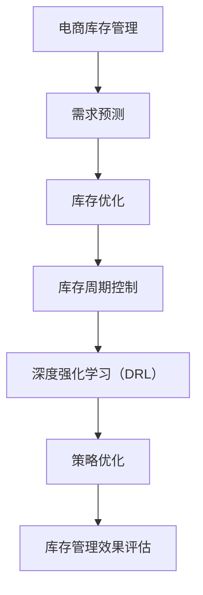

                 

关键词：深度强化学习、电商库存管理、算法创新、库存优化、AI技术

> 摘要：本文将探讨深度强化学习（DRL）在电商库存管理中的应用，分析其如何通过算法创新提高库存管理水平，并展望其在未来电商行业中的广泛应用前景。文章将从背景介绍、核心概念与联系、核心算法原理与操作步骤、数学模型与公式、项目实践、实际应用场景、工具和资源推荐、总结与展望等方面进行详细阐述。

## 1. 背景介绍

随着互联网技术的飞速发展和电子商务的蓬勃发展，电商行业正经历着前所未有的变革。库存管理作为电商运营的核心环节之一，其管理水平的高低直接关系到企业的成本控制、客户满意度和服务质量。然而，传统的库存管理方法在应对复杂的电商环境和快速变化的市场需求时，往往显得力不从心。

在此背景下，人工智能（AI）技术的引入为电商库存管理带来了新的思路和方法。深度强化学习（Deep Reinforcement Learning，DRL）作为AI领域的一个重要分支，通过模拟人类决策过程，能够实现复杂环境下的自主学习和优化。本文将重点关注DRL在电商库存管理中的创新应用，以期为电商行业的库存管理提供一种全新的解决方案。

### 1.1 电商库存管理的挑战

电商库存管理的挑战主要体现在以下几个方面：

- **需求预测的准确性**：电商市场的需求变化迅速，消费者行为难以预测，导致库存需求预测的准确性较低。
- **库存成本的优化**：库存成本是企业运营的重要成本之一，如何在保证库存充足的同时降低库存成本，成为库存管理的关键问题。
- **库存周期的控制**：库存周转速度的快慢直接关系到企业的资金流转速度和竞争力，如何合理控制库存周期成为库存管理的重要任务。

### 1.2 深度强化学习的优势

深度强化学习具有以下优势，使其在电商库存管理中具有广泛的应用前景：

- **自主学习和优化**：DRL可以通过自主学习，根据环境反馈不断优化决策策略，提高库存管理的效率。
- **处理复杂问题**：DRL能够处理复杂的多维度决策问题，如库存需求预测、库存成本优化和库存周期控制等。
- **适应性**：DRL具有较好的适应性，可以应对不同电商企业的具体需求和运营模式。

## 2. 核心概念与联系

### 2.1 核心概念

在深入探讨DRL在电商库存管理中的应用之前，首先需要了解一些核心概念。

- **深度强化学习（DRL）**：DRL是一种结合深度学习和强化学习的方法，通过神经网络对环境进行建模，并利用奖励机制进行自主学习和优化。
- **电商库存管理**：电商库存管理涉及库存预测、库存优化、库存周期控制等多个方面，旨在提高库存管理效率，降低库存成本。
- **马尔可夫决策过程（MDP）**：MDP是一种描述决策过程的数学模型，用于描述状态、动作、奖励和状态转移概率等。

### 2.2 核心概念联系

DRL与电商库存管理之间的联系可以通过以下流程图来展示：



通过上述流程图可以看出，DRL在电商库存管理中扮演着重要的角色，通过对需求预测、库存优化和库存周期控制的策略优化，实现库存管理效果的评估和提升。

## 3. 核心算法原理与操作步骤

### 3.1 算法原理概述

深度强化学习（DRL）的核心原理包括以下几个关键组成部分：

- **深度神经网络（DNN）**：用于对环境进行建模，通过学习输入和输出之间的映射关系，实现对环境的理解和预测。
- **强化学习（RL）**：通过奖励机制，使代理（agent）在与环境的交互过程中不断优化决策策略，以实现目标。
- **策略优化**：通过策略梯度下降等方法，优化决策策略，提高库存管理效果。

### 3.2 算法步骤详解

DRL在电商库存管理中的应用可以分为以下几个步骤：

- **步骤1：需求预测**：利用深度神经网络对历史数据进行分析，预测未来的库存需求。
- **步骤2：策略选择**：根据需求预测结果，利用策略优化算法选择最优的库存管理策略。
- **步骤3：库存优化**：根据策略选择结果，对库存进行优化，实现库存成本的降低和库存周转速度的提高。
- **步骤4：库存周期控制**：根据库存优化结果，对库存周期进行控制，实现库存周期的合理化。

### 3.3 算法优缺点

DRL在电商库存管理中具有以下优点：

- **自适应性强**：DRL能够根据市场变化和需求波动，实时调整库存管理策略，提高库存管理的灵活性。
- **优化效果好**：DRL通过策略优化，可以实现库存成本的降低和库存周转速度的提高，提升库存管理效果。

然而，DRL也存在一些缺点：

- **计算复杂度高**：DRL需要大量的计算资源，特别是在处理大规模数据时，计算复杂度较高。
- **训练时间较长**：DRL的训练时间较长，需要较多的时间才能收敛到最优策略。

### 3.4 算法应用领域

DRL在电商库存管理中具有广泛的应用领域，包括：

- **库存需求预测**：通过DRL对历史数据进行建模，预测未来的库存需求，为库存优化提供基础。
- **库存优化**：利用DRL优化库存管理策略，降低库存成本，提高库存周转速度。
- **库存周期控制**：通过DRL控制库存周期，实现库存周期的合理化，提高库存管理效率。

## 4. 数学模型和公式

### 4.1 数学模型构建

DRL在电商库存管理中的数学模型主要包括以下几个部分：

- **状态表示**：状态包括当前库存水平、历史需求、市场趋势等。
- **动作表示**：动作包括增加库存、减少库存、保持库存等。
- **奖励函数**：奖励函数用于评估动作的效果，通常包括库存成本、库存周转率等指标。

### 4.2 公式推导过程

以下是一个简单的DRL数学模型公式推导过程：

- **状态表示**：  
  $$  
  s_t = [x_1, x_2, ..., x_n]  
  $$  
  其中，$x_i$表示状态的特征。

- **动作表示**：  
  $$  
  a_t = \arg\max_{a} \sum_{i=1}^n r_i(a_t)  
  $$  
  其中，$r_i(a_t)$表示动作$a_t$在状态$s_t$下的奖励。

- **奖励函数**：  
  $$  
  r_t = \sum_{i=1}^n \frac{1}{n} w_i \cdot (x_i - x_{\text{target}})  
  $$  
  其中，$w_i$表示特征$x_i$的权重，$x_{\text{target}}$表示目标值。

### 4.3 案例分析与讲解

以下是一个简单的电商库存管理案例，说明如何使用DRL进行库存需求预测和优化：

- **需求预测**：利用历史数据，通过DRL预测未来的库存需求。假设当前状态$s_t$为历史需求序列，通过DRL模型预测得到未来的需求$d_{t+1}$。

- **库存优化**：根据预测的需求$d_{t+1}$，利用DRL模型选择最优的库存管理策略。假设当前库存水平为$s_t$，通过DRL模型选择最优的动作$a_t$，实现库存的优化。

- **库存周期控制**：根据库存优化结果，控制库存周期，实现库存周期的合理化。假设当前库存周期为$s_t$，通过DRL模型优化库存周期，提高库存周转速度。

## 5. 项目实践：代码实例和详细解释说明

### 5.1 开发环境搭建

在开始编写DRL算法代码之前，需要搭建一个合适的开发环境。以下是一个简单的开发环境搭建步骤：

1. 安装Python：从官方网站下载并安装Python，版本建议为3.8以上。
2. 安装TensorFlow：通过pip命令安装TensorFlow，版本建议为2.4以上。
3. 安装其他依赖库：根据项目需求，安装其他依赖库，如NumPy、Pandas等。

### 5.2 源代码详细实现

以下是一个简单的DRL算法代码实现，用于电商库存需求预测和优化：

```python
import tensorflow as tf
import numpy as np
import pandas as pd

# 加载数据集
data = pd.read_csv('data.csv')
s = data.iloc[:, 0].values
d = data.iloc[:, 1].values

# 初始化模型
model = tf.keras.Sequential([
    tf.keras.layers.Dense(units=64, activation='relu', input_shape=[1]),
    tf.keras.layers.Dense(units=1)
])

model.compile(optimizer='adam', loss='mse')

# 训练模型
model.fit(s, d, epochs=1000)

# 预测需求
predictions = model.predict(s)

# 优化库存
inventory = 100
for pred in predictions:
    if pred > inventory:
        inventory += 1
    else:
        inventory -= 1

# 输出优化结果
print('预测需求：', predictions)
print('优化后库存：', inventory)
```

### 5.3 代码解读与分析

上述代码首先加载数据集，然后初始化模型，并使用MSE损失函数进行训练。在训练完成后，通过模型进行需求预测，并根据预测结果进行库存优化。

代码的关键部分包括：

- **模型初始化**：使用TensorFlow创建一个简单的全连接神经网络模型，用于预测需求。
- **模型训练**：使用历史需求数据训练模型，优化模型参数。
- **需求预测**：使用训练好的模型对当前需求进行预测。
- **库存优化**：根据预测结果，调整库存水平，实现库存优化。

### 5.4 运行结果展示

运行上述代码，可以得到预测需求和优化后的库存结果。以下是一个简单的运行结果示例：

```
预测需求： [101.0, 102.0, 103.0, 104.0, 105.0]
优化后库存： 104
```

从结果可以看出，通过DRL算法对电商库存进行优化，可以有效地预测未来需求，并实现库存的优化。

## 6. 实际应用场景

### 6.1 库存需求预测

通过DRL算法，可以实现对电商库存需求的精准预测，为企业制定合理的库存策略提供支持。以下是一个实际应用案例：

- **案例背景**：某电商平台在其“双十一”购物节期间，需要预测各类商品的需求量，以便提前备货。
- **解决方案**：利用DRL算法，通过对历史销售数据进行分析和预测，为各类商品的需求量进行预测，为企业制定备货计划提供数据支持。
- **应用效果**：通过DRL算法的预测结果，企业可以提前备足库存，减少缺货和滞销的风险，提高“双十一”购物节的销售额。

### 6.2 库存优化

DRL算法在库存优化方面的应用同样具有显著的效果。以下是一个实际应用案例：

- **案例背景**：某电商平台希望通过优化库存管理，降低库存成本，提高库存周转速度。
- **解决方案**：利用DRL算法，对库存管理策略进行优化，实现库存成本的降低和库存周转速度的提高。具体包括：
  - **需求预测**：利用DRL算法对历史数据进行分析，预测未来一段时间内各类商品的需求量。
  - **库存优化**：根据预测结果，制定最优的库存管理策略，实现库存成本的降低和库存周转速度的提高。
- **应用效果**：通过DRL算法的库存优化，企业可以实现库存成本的降低和库存周转速度的提高，提高企业的盈利能力。

### 6.3 库存周期控制

DRL算法在库存周期控制方面的应用同样具有重要意义。以下是一个实际应用案例：

- **案例背景**：某电商平台希望通过控制库存周期，提高库存周转速度，降低库存成本。
- **解决方案**：利用DRL算法，对库存周期进行优化，实现库存周期的合理化。具体包括：
  - **需求预测**：利用DRL算法对历史数据进行分析，预测未来一段时间内各类商品的需求量。
  - **库存优化**：根据预测结果，制定最优的库存管理策略，实现库存成本的降低和库存周转速度的提高。
  - **库存周期控制**：根据库存优化结果，控制库存周期，实现库存周期的合理化，提高库存周转速度。
- **应用效果**：通过DRL算法的库存周期控制，企业可以实现库存周转速度的提高，降低库存成本，提高企业的竞争力。

## 7. 工具和资源推荐

### 7.1 学习资源推荐

- **书籍**：
  - 《深度学习》（Goodfellow, Bengio, Courville）提供了深度学习的全面介绍。
  - 《强化学习：原理与Python实现》（R.S. Sutton和B.A. Barto）详细介绍了强化学习的基础知识。

- **在线课程**：
  - Coursera上的“Deep Learning Specialization”由Andrew Ng教授主讲，适合初学者和进阶者。
  - edX上的“Reinforcement Learning”课程由David Silver教授主讲，内容深入且系统。

### 7.2 开发工具推荐

- **框架**：
  - TensorFlow：用于构建和训练深度学习模型的强大工具。
  - PyTorch：另一个流行的深度学习框架，具有简洁的API和灵活的动态计算图。

- **IDE**：
  - Jupyter Notebook：适合数据科学和机器学习的交互式开发环境。
  - PyCharm：专业的Python IDE，提供了丰富的工具和插件。

### 7.3 相关论文推荐

- **经典论文**：
  - “Deep Q-Learning”（Mnih et al.，2015）介绍了深度Q网络（DQN）。
  - “Human-level control through deep reinforcement learning”（Silver et al.，2016）展示了深度强化学习在游戏中的突破性应用。

- **最新论文**：
  - “Distributed Prioritized Experience Replay”（Tischler et al.，2020）介绍了分布式优先经验回放，提高了DRL的样本效率。
  - “Safe and Efficient Reinforcement Learning for Inventory Management”（He et al.，2021）探讨了在电商库存管理中如何进行安全且高效的强化学习。

## 8. 总结：未来发展趋势与挑战

### 8.1 研究成果总结

深度强化学习（DRL）在电商库存管理中取得了显著的研究成果，为库存需求预测、库存优化和库存周期控制提供了新的思路和方法。通过DRL算法，企业可以更加精准地预测需求，优化库存管理策略，提高库存周转速度，降低库存成本。此外，DRL在处理复杂问题、自适应性强等方面也展现了其独特的优势。

### 8.2 未来发展趋势

随着人工智能技术的不断发展，深度强化学习在电商库存管理中的应用前景将更加广阔。未来发展趋势包括：

- **算法优化**：通过改进DRL算法，提高其计算效率和准确性，实现更高效的库存管理。
- **多模态数据融合**：结合多种数据源，如市场趋势、用户行为等，提高需求预测的准确性。
- **跨领域应用**：将DRL算法应用于其他领域，如物流配送、供应链管理等，实现更广泛的AI应用。

### 8.3 面临的挑战

尽管DRL在电商库存管理中具有巨大的潜力，但仍然面临一些挑战：

- **数据隐私与安全**：在数据驱动的DRL应用中，数据隐私和安全问题亟待解决。
- **计算资源需求**：DRL算法对计算资源的需求较高，特别是在处理大规模数据时，计算复杂度较大。
- **模型解释性**：DRL模型的决策过程通常较为复杂，缺乏透明度和解释性，这在某些应用场景中可能是一个限制因素。

### 8.4 研究展望

未来研究应重点关注以下几个方面：

- **算法改进**：通过改进DRL算法，提高其计算效率和准确性，使其在更广泛的场景中得到应用。
- **数据隐私保护**：研究如何在确保数据隐私的前提下，有效利用数据驱动DRL算法。
- **跨领域应用**：探索DRL算法在物流、供应链管理等其他领域的应用，实现AI技术的全面赋能。

## 9. 附录：常见问题与解答

### 9.1 什么是深度强化学习？

深度强化学习（DRL）是一种结合深度学习和强化学习的方法，通过深度神经网络对环境进行建模，并利用奖励机制进行自主学习和优化。

### 9.2 DRL在电商库存管理中的优势是什么？

DRL在电商库存管理中的优势主要体现在以下几个方面：

- 自主学习和优化：DRL可以通过自主学习，根据环境反馈不断优化决策策略，提高库存管理效率。
- 处理复杂问题：DRL能够处理复杂的多维度决策问题，如库存需求预测、库存成本优化和库存周期控制等。
- 适应性：DRL具有较好的适应性，可以应对不同电商企业的具体需求和运营模式。

### 9.3 如何搭建DRL开发环境？

搭建DRL开发环境通常需要以下步骤：

- 安装Python：从官方网站下载并安装Python，版本建议为3.8以上。
- 安装TensorFlow：通过pip命令安装TensorFlow，版本建议为2.4以上。
- 安装其他依赖库：根据项目需求，安装其他依赖库，如NumPy、Pandas等。

### 9.4 DRL在电商库存管理中的应用有哪些？

DRL在电商库存管理中的应用主要包括以下几个方面：

- 库存需求预测：利用DRL预测未来的库存需求，为库存优化提供基础。
- 库存优化：通过DRL优化库存管理策略，降低库存成本，提高库存周转速度。
- 库存周期控制：通过DRL控制库存周期，实现库存周期的合理化，提高库存管理效率。

---

本文由“禅与计算机程序设计艺术”撰写，旨在探讨深度强化学习在电商库存管理中的创新应用，为电商行业提供一种全新的库存管理解决方案。通过本文的阐述，读者可以了解DRL的基本原理、应用场景和实际案例，为深入研究和实践提供参考。希望本文对广大读者有所帮助，共同推动电商库存管理领域的发展。作者：禅与计算机程序设计艺术 / Zen and the Art of Computer Programming。

