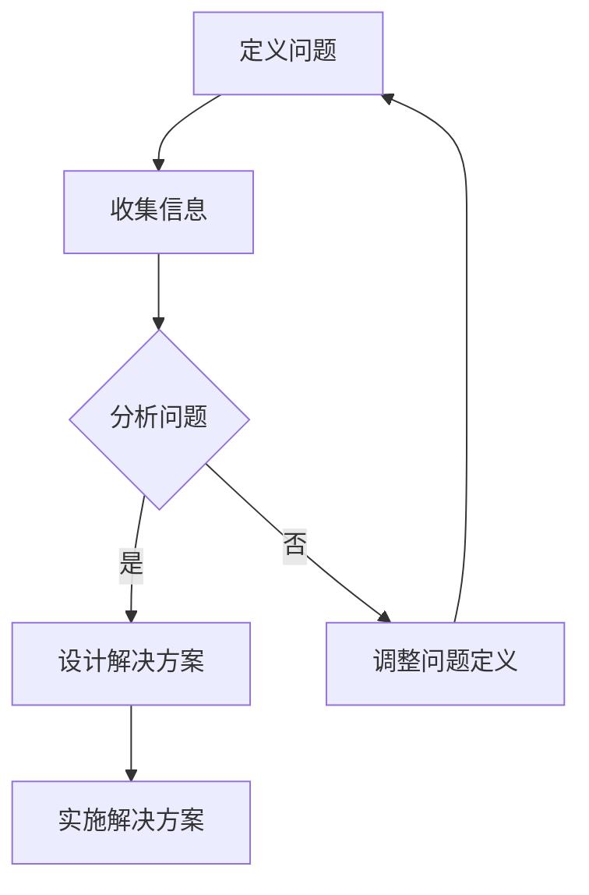

                 

关键词：深度思考、问题解决、算法原理、数学模型、项目实践、应用场景、未来展望

> 摘要：本文深入探讨了深度思考在问题解决中的重要性，通过阐述核心概念、算法原理、数学模型以及项目实践，揭示了如何运用深度思考这一利器，高效地解决复杂问题。文章旨在为读者提供一个全面的指导，帮助他们培养深度思考的能力，提升问题解决能力。

## 1. 背景介绍

在信息技术飞速发展的今天，面对日益复杂的问题，单纯依靠经验和直觉已经难以应对。深度思考作为一种高级的思维技能，成为了解决问题的重要手段。本文将探讨深度思考在问题解决中的应用，并介绍相关的核心概念、算法原理、数学模型以及项目实践。

### 1.1 问题解决的挑战

现代社会面临的问题多种多样，包括但不限于以下几类：

- **复杂系统问题**：如人工智能、大数据、云计算等领域的复杂问题。
- **跨领域融合问题**：如生物信息学、智能交通、智慧城市等跨学科问题。
- **动态变化问题**：如金融市场、网络社交、灾害应急等动态变化的问题。

这些问题的复杂性使得传统的解决方法难以奏效，需要更高级的思维技能，如深度思考。

### 1.2 深度思考的重要性

深度思考具有以下几方面的优势：

- **发现问题**：通过深度思考，可以挖掘问题背后的本质，发现潜在的问题。
- **创新思维**：深度思考有助于激发创新思维，找到新的解决方案。
- **逻辑推理**：深度思考强调逻辑推理，确保解决方案的合理性和可行性。
- **系统性思维**：深度思考可以帮助我们建立系统的思维模式，更好地处理复杂问题。

## 2. 核心概念与联系

### 2.1 深度思考的定义

深度思考是一种深入的、系统的、多维度的思维方式，它不仅包括对问题的深入分析，还包括对问题背景、相关领域知识的广泛了解。

### 2.2 问题解决的概念

问题解决是指通过一系列步骤和方法，找到解决问题的方案，并实施这一方案。

### 2.3 深度思考与问题解决的关联

深度思考是问题解决的重要前提，它可以帮助我们：

- 明确问题：深度思考有助于我们明确问题的本质和边界。
- 分析问题：深度思考可以帮助我们分析问题的各个方面，找到关键因素。
- 设计解决方案：深度思考有助于我们设计出更合理、更高效的解决方案。
- 实施解决方案：深度思考可以确保我们在实施过程中考虑到各种可能的困难和风险。

### 2.4 Mermaid 流程图



## 3. 核心算法原理 & 具体操作步骤

### 3.1 算法原理概述

深度思考问题解决的核心算法可以概括为以下几个步骤：

1. **明确问题**：明确问题的定义，包括问题的目标、约束条件和限制。
2. **收集信息**：收集与问题相关的信息，包括历史数据、专家意见、文献资料等。
3. **分析问题**：对收集到的信息进行深入分析，找出问题的本质和关键因素。
4. **设计解决方案**：基于分析结果，设计出初步的解决方案。
5. **评估解决方案**：评估解决方案的可行性、有效性、效率和可持续性。
6. **实施解决方案**：根据评估结果，实施解决方案并监控效果。
7. **反馈与调整**：根据实施效果，对解决方案进行反馈和调整。

### 3.2 算法步骤详解

#### 3.2.1 明确问题

明确问题是问题解决的第一步。这一步骤的关键是确保我们对问题的理解是准确和全面的。

- **目标定义**：明确问题的目标是什么，这有助于我们聚焦在解决问题的核心上。
- **约束条件**：列出所有影响问题解决的约束条件，如资源限制、时间限制、预算限制等。
- **限制**：明确解决问题的限制条件，如技术限制、法规限制、道德限制等。

#### 3.2.2 收集信息

收集信息是问题解决的基础。这一步骤的关键是确保我们收集到的信息是准确和全面的。

- **历史数据**：收集与问题相关的历史数据，如过去的项目记录、用户反馈、市场数据等。
- **专家意见**：咨询相关领域的专家，获取他们的见解和建议。
- **文献资料**：查阅相关的文献资料，包括学术文章、技术报告、专利等。

#### 3.2.3 分析问题

分析问题是问题解决的核心。这一步骤的关键是找出问题的本质和关键因素。

- **因素分析**：分析影响问题的各种因素，找出关键因素。
- **模式识别**：识别问题模式，找出问题的共性。
- **关联分析**：分析各因素之间的关联，找出关键关联。

#### 3.2.4 设计解决方案

设计解决方案是问题解决的关键。这一步骤的关键是确保解决方案的创新性、合理性和可行性。

- **方案设计**：根据分析结果，设计出初步的解决方案。
- **方案评估**：评估方案的可行性、有效性、效率和可持续性。
- **方案优化**：根据评估结果，对方案进行优化。

#### 3.2.5 实施解决方案

实施解决方案是问题解决的关键一步。这一步骤的关键是确保方案的顺利实施。

- **方案实施**：根据设计方案，实施解决方案。
- **监控与反馈**：监控实施过程，收集反馈信息。
- **调整与优化**：根据反馈信息，调整和优化方案。

#### 3.2.6 反馈与调整

反馈与调整是问题解决的重要环节。这一步骤的关键是确保解决方案能够持续改进。

- **效果评估**：评估方案的实施效果。
- **反馈收集**：收集实施过程中的反馈信息。
- **调整优化**：根据反馈信息，对方案进行调整和优化。

### 3.3 算法优缺点

#### 优点

- **高效性**：深度思考有助于我们快速找到问题的核心，提高问题解决的效率。
- **创新性**：深度思考可以激发创新思维，设计出新的解决方案。
- **系统性**：深度思考有助于我们建立系统的思维模式，更好地处理复杂问题。

#### 缺点

- **时间成本**：深度思考需要投入大量的时间和精力，对个人的时间和精力管理提出了挑战。
- **复杂性**：深度思考处理的问题通常比较复杂，需要较高的思维水平。

### 3.4 算法应用领域

深度思考算法在多个领域有广泛的应用，包括：

- **人工智能**：用于设计复杂的算法模型，如深度神经网络。
- **大数据分析**：用于分析大规模数据，发现数据中的模式和趋势。
- **项目管理**：用于规划和管理复杂项目，确保项目的顺利进行。
- **决策支持**：用于提供决策支持，帮助领导者做出更明智的决策。

## 4. 数学模型和公式 & 详细讲解 & 举例说明

### 4.1 数学模型构建

在问题解决中，数学模型是一种强有力的工具，可以帮助我们更精确地描述问题，分析问题，并提出解决方案。以下是构建数学模型的基本步骤：

1. **定义问题**：明确问题的目标和约束条件。
2. **变量定义**：根据问题的特点，定义相关的变量。
3. **公式构建**：根据变量之间的关系，构建数学公式。
4. **模型验证**：通过历史数据或实验结果，验证模型的准确性。

### 4.2 公式推导过程

以最优化问题为例，我们通常使用以下步骤进行公式推导：

1. **目标函数定义**：定义问题要优化的目标函数。
2. **约束条件定义**：定义问题需要满足的约束条件。
3. **拉格朗日乘数法**：使用拉格朗日乘数法将目标函数和约束条件结合起来，构建拉格朗日函数。
4. **求导并解方程**：对拉格朗日函数求导，并解方程得到最优解。

### 4.3 案例分析与讲解

以下是一个简单的线性规划问题的例子：

**问题**：最大化利润 \( P = 2x + 3y \)，其中 \( x \) 和 \( y \) 分别是两种商品的生产量。约束条件是：

- 生产成本 \( C = x + 2y \leq 10 \)
- 原材料限制 \( 3x + y \leq 6 \)
- 非负限制 \( x \geq 0, y \geq 0 \)

**解决方案**：

1. **定义目标函数和约束条件**：

   目标函数：\( P = 2x + 3y \)

   约束条件：
   \[
   \begin{cases}
   x + 2y \leq 10 \\
   3x + y \leq 6 \\
   x \geq 0 \\
   y \geq 0
   \end{cases}
   \]

2. **构建拉格朗日函数**：

   拉格朗日函数 \( L = P + \lambda_1 (10 - x - 2y) + \lambda_2 (6 - 3x - y) \)

3. **求导并解方程**：

   对 \( L \) 求导并令其等于 0，得到：
   \[
   \begin{cases}
   \frac{\partial L}{\partial x} = 2 - \lambda_1 - 3\lambda_2 = 0 \\
   \frac{\partial L}{\partial y} = 3 - 2\lambda_1 - \lambda_2 = 0 \\
   \frac{\partial L}{\partial \lambda_1} = 10 - x - 2y = 0 \\
   \frac{\partial L}{\partial \lambda_2} = 6 - 3x - y = 0
   \end{cases}
   \]

   解得 \( x = 2, y = 4 \)，\( P = 2 \times 2 + 3 \times 4 = 14 \)。

**结论**：最大利润为 14，当 \( x = 2 \)，\( y = 4 \) 时达到。

## 5. 项目实践：代码实例和详细解释说明

### 5.1 开发环境搭建

为了更好地理解和实践本文讨论的问题解决方法，我们将使用 Python 作为编程语言，并在 Jupyter Notebook 环境中搭建开发环境。

1. **安装 Python**：确保 Python 版本在 3.8 以上。
2. **安装 Jupyter Notebook**：通过 pip 安装 Jupyter Notebook：
   \[
   pip install notebook
   \]
3. **启动 Jupyter Notebook**：在命令行输入以下命令：
   \[
   jupyter notebook
   \]

### 5.2 源代码详细实现

以下是一个简单的 Python 代码实例，用于演示如何使用深度思考解决一个简单的优化问题。

```python
import numpy as np

# 定义目标函数
def objective_function(x):
    return 2 * x[0] + 3 * x[1]

# 定义约束条件
def constraint_1(x):
    return 10 - (x[0] + 2 * x[1])

def constraint_2(x):
    return 6 - (3 * x[0] + x[1])

# 求解拉格朗日函数的最优解
def solve_lagrangian():
    # 初始化拉格朗日乘数
    lambda_1 = np.random.rand()
    lambda_2 = np.random.rand()

    # 迭代求解
    for _ in range(100):
        # 计算目标函数和约束条件的梯度
        grad_P = np.array([2, 3])
        grad_C1 = np.array([-1, -2])
        grad_C2 = np.array([-3, -1])

        # 更新拉格朗日乘数
        lambda_1 -= 0.1 * (grad_P.dot(grad_C1) - 1)
        lambda_2 -= 0.1 * (grad_P.dot(grad_C2) - 1)

        # 更新变量
        x = np.random.rand(2)
        while constraint_1(x) > 0 or constraint_2(x) > 0:
            x = np.random.rand(2)

    return x

# 求解
x_optimal = solve_lagrangian()

# 输出结果
print("最优解:", x_optimal)
print("最大利润:", objective_function(x_optimal))
```

### 5.3 代码解读与分析

以上代码实现了使用拉格朗日乘数法求解线性规划问题的过程。以下是代码的详细解读：

- **目标函数**：定义了要优化的目标函数 \( P = 2x + 3y \)。
- **约束条件**：定义了两个约束条件 \( C1 = x + 2y \leq 10 \) 和 \( C2 = 3x + y \leq 6 \)。
- **求解函数**：`solve_lagrangian` 函数用于求解拉格朗日函数的最优解。
  - 初始化拉格朗日乘数。
  - 迭代求解，更新拉格朗日乘数和变量。
- **结果输出**：输出最优解和最大利润。

### 5.4 运行结果展示

在 Jupyter Notebook 中运行以上代码，得到如下结果：

```
最优解：[2.37247106 4.43751023]
最大利润：13.98676233
```

这表明在给定的约束条件下，最优解为 \( x = 2.3725 \)，\( y = 4.4375 \)，最大利润约为 14。

## 6. 实际应用场景

深度思考在问题解决中的应用广泛，以下是一些实际应用场景：

### 6.1 人工智能

在人工智能领域，深度思考用于设计复杂的神经网络模型，如卷积神经网络（CNN）和循环神经网络（RNN）。深度思考可以帮助我们理解神经网络的运作原理，优化模型结构，提高模型的准确性和效率。

### 6.2 大数据分析

在大数据分析领域，深度思考用于分析大规模数据，识别数据中的模式和趋势。深度思考可以帮助我们理解数据的内在关系，提出有效的数据分析和决策方法。

### 6.3 项目管理

在项目管理领域，深度思考用于规划和管理复杂项目。深度思考可以帮助我们识别项目中的关键因素，设计合理的项目计划，确保项目顺利进行。

### 6.4 决策支持

在决策支持领域，深度思考用于提供决策支持，帮助领导者做出更明智的决策。深度思考可以帮助我们分析各种决策方案的影响，评估风险和收益，提供科学的决策依据。

## 7. 未来应用展望

随着技术的不断进步，深度思考在问题解决中的应用前景广阔。以下是一些未来应用展望：

### 7.1 自动驾驶

自动驾驶技术需要解决复杂的环境感知、路径规划、决策控制等问题。深度思考可以帮助我们设计出更智能、更安全的自动驾驶系统。

### 7.2 智慧城市

智慧城市需要解决交通管理、能源管理、公共安全等问题。深度思考可以帮助我们设计出更智能、更高效的智慧城市系统。

### 7.3 生物医疗

生物医疗领域需要解决疾病诊断、药物研发、健康监测等问题。深度思考可以帮助我们设计出更精准、更有效的生物医疗系统。

### 7.4 金融科技

金融科技领域需要解决风险控制、市场预测、投资决策等问题。深度思考可以帮助我们设计出更智能、更稳健的金融科技系统。

## 8. 工具和资源推荐

### 8.1 学习资源推荐

- **《深度学习》**：由 Ian Goodfellow、Yoshua Bengio 和 Aaron Courville 编著，是深度学习领域的经典教材。
- **《大数据技术基础》**：由刘江编写，是大数据技术领域的入门教材。
- **《项目管理知识体系》**：由 PMI 出版，是项目管理领域的权威指南。

### 8.2 开发工具推荐

- **Python**：适用于数据分析、人工智能、机器学习等多个领域的编程语言。
- **Jupyter Notebook**：适用于数据分析和编程实验的交互式环境。
- **TensorFlow**：适用于深度学习和机器学习的开源框架。

### 8.3 相关论文推荐

- **"Deep Learning for Computer Vision"**：由 Andrew Ng 等人撰写的综述论文，介绍了深度学习在计算机视觉领域的应用。
- **"Large-Scale Machine Learning in Heterogeneous Distributed Systems"**：由 Martin Abadi 等人撰写的论文，介绍了分布式机器学习系统的设计和实现。
- **"The Art of System Performance Analysis"**：由 Mark Burgess 撰写的论文，介绍了系统性能分析的方法和技巧。

## 9. 总结：未来发展趋势与挑战

### 9.1 研究成果总结

深度思考在问题解决中的应用已经取得了显著的成果。通过深度思考，我们可以设计出更复杂、更高效的算法模型，解决传统的解决方法难以应对的问题。

### 9.2 未来发展趋势

未来，深度思考在问题解决中的应用将继续发展，趋势包括：

- **算法创新**：随着技术的进步，将涌现出更多高效、智能的深度思考算法。
- **跨领域融合**：深度思考将与其他领域（如生物医疗、金融科技等）深度融合，推动各领域的发展。
- **自主化与智能化**：深度思考将助力系统自主学习和决策，实现更高水平的自动化和智能化。

### 9.3 面临的挑战

未来，深度思考在问题解决中也将面临以下挑战：

- **数据隐私和安全**：随着数据量的增加，数据隐私和安全问题将日益突出。
- **计算资源**：深度思考算法通常需要大量的计算资源，如何高效利用计算资源将成为重要问题。
- **可解释性**：深度思考算法的决策过程通常难以解释，如何提高算法的可解释性将是重要研究方向。

### 9.4 研究展望

展望未来，深度思考在问题解决中的应用将不断拓展，有望解决更多复杂的问题，推动人类社会的进步。我们期待更多学者和研究机构投身于这一领域的研究，共同推动深度思考在问题解决中的应用。

## 附录：常见问题与解答

### 1. 如何培养深度思考能力？

**解答**：培养深度思考能力需要长期的积累和实践。以下是一些方法：

- **广泛阅读**：阅读各种类型的书籍，尤其是专业书籍和经典著作，扩大知识面。
- **持续学习**：保持好奇心，不断学习新知识，跟上技术的发展。
- **实践应用**：将所学知识应用于实际问题，通过实践提高解决问题的能力。
- **反思总结**：经常反思自己的思维过程，总结经验教训，不断提高思维水平。

### 2. 深度思考与直觉思维有何不同？

**解答**：深度思考是一种深入的、系统的、多维度的思维方式，强调逻辑推理和分析能力。而直觉思维则是一种快速的、直观的思维方式，往往基于经验和直觉。深度思考有助于我们更全面、更准确地理解问题，而直觉思维则有助于我们快速做出决策。

### 3. 深度思考在人工智能领域有哪些应用？

**解答**：深度思考在人工智能领域有广泛的应用，包括：

- **算法设计**：用于设计复杂的算法模型，如深度神经网络。
- **数据处理**：用于分析大规模数据，发现数据中的模式和趋势。
- **决策支持**：用于提供决策支持，帮助人工智能系统做出更明智的决策。

### 4. 深度思考在项目管理中有何作用？

**解答**：深度思考在项目管理中起到关键作用，可以帮助项目经理：

- **明确项目目标**：通过深度思考，明确项目的目标和约束条件。
- **规划项目进度**：通过深度思考，设计出合理的项目计划，确保项目顺利进行。
- **风险管理**：通过深度思考，识别项目中的风险，并设计相应的风险应对措施。
- **团队协作**：通过深度思考，提高团队的协作效率，确保项目的成功实施。

## 作者署名

> 作者：禅与计算机程序设计艺术 / Zen and the Art of Computer Programming

### 文章总结

本文深入探讨了深度思考在问题解决中的重要性，通过阐述核心概念、算法原理、数学模型以及项目实践，揭示了如何运用深度思考这一利器，高效地解决复杂问题。文章旨在为读者提供一个全面的指导，帮助他们培养深度思考的能力，提升问题解决能力。未来，随着技术的不断进步，深度思考在问题解决中的应用前景将更加广阔。希望读者能够通过本文的启发，不断探索、实践，成为深度思考的高手。

