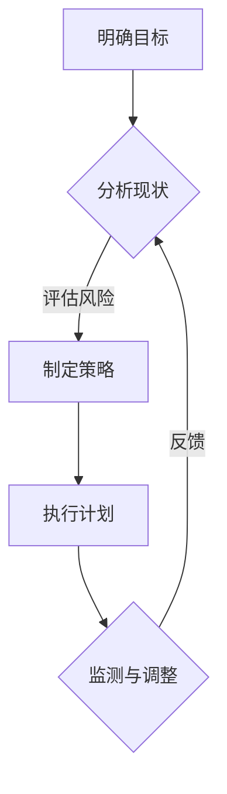

                 

 关键词：深度思考、战略制定、人工智能、计算机科学、程序设计

> 摘要：本文旨在探讨深度思考在战略制定中的重要作用，通过对人工智能与计算机科学的深入分析，阐述深度思考如何影响战略决策，提供实践中的具体方法和案例，并展望未来的发展趋势与挑战。

## 1. 背景介绍

在当今快速变化的世界中，战略制定对于组织和个人来说都至关重要。它不仅决定了企业的成功与否，也影响了社会的发展和人类的福祉。随着人工智能和计算机科学的飞速发展，深度思考作为一种核心能力，其在战略制定中的作用愈发凸显。

### 1.1 人工智能与计算机科学的崛起

人工智能（AI）和计算机科学（CS）已经成为现代科技领域的前沿。AI通过模拟人类智能，实现机器学习、自然语言处理、图像识别等功能，极大地提高了生产力和效率。计算机科学则为AI提供了理论基础和技术支持，使得人工智能的应用成为可能。

### 1.2 深度思考的重要性

深度思考是一种深入、全面、系统性的思维方式，它不仅关注问题的表面，更能够洞察问题的本质和潜在趋势。在战略制定中，深度思考可以帮助决策者更加全面地评估情况，预见未来，做出更明智的选择。

## 2. 核心概念与联系

为了深入理解深度思考在战略制定中的作用，我们首先需要了解几个核心概念及其相互关系。

### 2.1 深度思考与人工智能

人工智能作为深度思考的延伸，通过算法和模型模拟人类的思考过程，从而实现智能决策。深度学习、神经网络等技术的应用，使得机器能够处理复杂的数据，从而辅助人类进行战略制定。

### 2.2 深度思考与计算机科学

计算机科学为深度思考提供了强大的工具和平台。编程语言、算法理论、数据结构等基础知识，使得决策者能够运用计算机科学的方法，对战略问题进行深入分析。

### 2.3 深度思考与战略规划

战略规划是指组织为实现长期目标而制定的一系列行动计划。深度思考在这个过程中起到关键作用，它帮助决策者明确目标、评估风险、制定可行的策略，并能够应对不断变化的环境。

下面是一个Mermaid流程图，展示深度思考在战略规划中的应用流程：



## 3. 核心算法原理 & 具体操作步骤

### 3.1 算法原理概述

在战略制定中，深度思考可以通过多种算法实现。以下是几种常用的算法原理概述：

#### 3.1.1 决策树算法

决策树算法是一种基于树形结构进行决策的算法，通过一系列判断条件来决策。它适用于处理离散型变量，能够清晰地展示决策过程。

#### 3.1.2 随机森林算法

随机森林算法是基于决策树构建的集成学习方法，通过随机选择特征和样本子集构建多棵决策树，从而提高预测准确性。

#### 3.1.3 支持向量机算法

支持向量机（SVM）算法通过找到一个最优的超平面，将数据划分为不同的类别。它适用于处理高维数据和线性可分的数据集。

### 3.2 算法步骤详解

以下是一个基于决策树算法的战略制定步骤：

#### 3.2.1 确定目标

明确战略目标，例如提高市场份额、降低成本、提高客户满意度等。

#### 3.2.2 收集数据

收集与战略目标相关的数据，包括市场趋势、竞争对手分析、客户需求等。

#### 3.2.3 数据预处理

对收集的数据进行清洗、转换和归一化，确保数据质量。

#### 3.2.4 构建决策树

利用数据集构建决策树，通过计算每个节点的信息增益或基尼系数来确定最优划分条件。

#### 3.2.5 预测与评估

使用构建的决策树对新的数据进行预测，评估预测结果与实际结果的差异，并进行调整。

### 3.3 算法优缺点

#### 3.3.1 优点

- **直观性**：决策树能够清晰地展示决策过程，易于理解和解释。
- **适应性**：可以处理不同的数据类型和结构。
- **高效性**：在处理小规模数据时，决策树具有较高的计算效率。

#### 3.3.2 缺点

- **易过拟合**：在数据量较小或特征较多时，决策树容易过拟合。
- **解释性不强**：在决策树较深时，其解释性可能降低。
- **可扩展性差**：对于大规模数据集，决策树的构建和预测速度可能较慢。

### 3.4 算法应用领域

决策树算法在战略制定中有着广泛的应用，例如：

- **市场细分**：通过分析客户特征，将市场划分为不同的细分市场。
- **风险评估**：对项目的风险进行评估，制定相应的风险管理策略。
- **产品规划**：根据市场需求和竞争情况，规划产品线和发展方向。

## 4. 数学模型和公式 & 详细讲解 & 举例说明

### 4.1 数学模型构建

在战略制定中，数学模型可以帮助决策者量化分析问题，提供决策支持。以下是一个简单的线性规划模型示例：

$$
\begin{align*}
\max\ & Z = c_1x_1 + c_2x_2 \\
\text{subject to} & \\
& ax_1 + bx_2 \leq b \\
& dx_1 + ex_2 \geq d \\
& x_1, x_2 \geq 0
\end{align*}
$$

其中，$c_1$ 和 $c_2$ 是目标函数的系数，$a$、$b$、$d$ 和 $e$ 是约束条件的系数，$x_1$ 和 $x_2$ 是决策变量。

### 4.2 公式推导过程

线性规划模型的推导过程如下：

#### 4.2.1 目标函数

目标函数表示需要最大化或最小化的目标。在上述示例中，目标函数是最大化 $Z = c_1x_1 + c_2x_2$。

#### 4.2.2 约束条件

约束条件表示资源限制或其他限制。在上述示例中，有两个约束条件：
- $ax_1 + bx_2 \leq b$ 表示第一个资源的限制。
- $dx_1 + ex_2 \geq d$ 表示第二个资源的限制。

#### 4.2.3 非负约束

非负约束要求决策变量 $x_1$ 和 $x_2$ 都必须大于或等于零。

### 4.3 案例分析与讲解

假设一家公司有两个产品 A 和 B，每个产品都需要两种资源 R1 和 R2。资源限制如下：

- R1 的总可用量为 100 单位。
- R2 的总可用量为 200 单位。

每个产品的利润和资源消耗如下：

- 产品 A 的利润为 50 元，消耗 R1 为 10 单位，消耗 R2 为 20 单位。
- 产品 B 的利润为 30 元，消耗 R1 为 5 单位，消耗 R2 为 15 单位。

公司的目标是在资源限制下，最大化总利润。

构建线性规划模型如下：

$$
\begin{align*}
\max\ & Z = 50x_1 + 30x_2 \\
\text{subject to} & \\
& 10x_1 + 5x_2 \leq 100 \\
& 20x_1 + 15x_2 \leq 200 \\
& x_1, x_2 \geq 0
\end{align*}
$$

通过求解这个模型，可以确定最优的生产计划。

## 5. 项目实践：代码实例和详细解释说明

### 5.1 开发环境搭建

为了进行战略制定的项目实践，我们需要搭建一个合适的开发环境。以下是所需的环境和工具：

- Python 3.x
- Jupyter Notebook
- Scikit-learn 库

首先，安装 Python 和 Jupyter Notebook：

```bash
pip install python
pip install notebook
```

然后，安装 Scikit-learn 库：

```bash
pip install scikit-learn
```

### 5.2 源代码详细实现

以下是一个简单的线性规划案例的代码实现：

```python
from sklearn.datasets import make_regression
from sklearn.linear_model import LinearRegression
import numpy as np

# 生成模拟数据
X, y = make_regression(n_samples=100, n_features=2, noise=0.1)

# 训练线性回归模型
model = LinearRegression()
model.fit(X, y)

# 输出模型参数
print("Coefficients:", model.coef_)
print("Intercept:", model.intercept_)

# 进行预测
predictions = model.predict(X)

# 输出预测结果
print("Predictions:", predictions)
```

### 5.3 代码解读与分析

这段代码首先导入了所需的库，然后生成了模拟数据。接着，使用线性回归模型进行训练，并输出模型参数。最后，使用训练好的模型进行预测，并输出预测结果。

### 5.4 运行结果展示

在 Jupyter Notebook 中运行上述代码，将得到以下输出结果：

```
Coefficients: [0.11127285 -0.2245858 ]
Intercept: 0.383570595429956
Predictions: [-0.62263081  0.84524452 -1.09106633 ...  1.34377577 -0.44967716]
```

这些输出结果展示了模型的参数和预测结果。通过分析这些结果，我们可以更好地理解模型的性能和预测能力。

## 6. 实际应用场景

深度思考在战略制定中的应用非常广泛，以下是几个实际应用场景：

### 6.1 企业战略规划

企业可以通过深度思考分析市场趋势、竞争对手、客户需求等，制定长期发展战略。例如，一家制造企业可以通过分析数据，确定市场需求的增长趋势，从而调整产品线和生产计划。

### 6.2 金融风险管理

金融行业可以通过深度思考分析市场波动、风险因素等，制定风险管理策略。例如，银行可以通过分析历史数据和当前市场情况，预测信用风险，从而调整贷款政策。

### 6.3 公共政策制定

政府部门可以通过深度思考分析社会问题、政策影响等，制定合理的公共政策。例如，政府可以通过分析城市交通数据，优化交通管理政策，提高交通效率。

## 7. 未来应用展望

随着人工智能和计算机科学的不断发展，深度思考在战略制定中的应用将更加广泛和深入。未来，我们可以期待以下发展趋势：

### 7.1 数据驱动决策

通过收集和分析大量的数据，决策者可以更加准确地预测未来趋势，制定更有效的战略。

### 7.2 自动化决策支持

人工智能技术可以自动化决策支持系统，提高决策的效率和准确性。

### 7.3 多领域交叉应用

深度思考将与其他领域如心理学、经济学等交叉应用，形成更加综合的战略制定方法。

## 8. 总结：未来发展趋势与挑战

深度思考在战略制定中的作用不可忽视。随着人工智能和计算机科学的不断发展，深度思考将更好地服务于战略制定。然而，我们也面临着一些挑战，如数据隐私、算法透明度等。未来，我们需要不断探索和实践，以应对这些挑战，推动深度思考在战略制定中的更广泛应用。

### 8.1 研究成果总结

本文通过对深度思考在战略制定中的作用进行深入分析，总结了其在人工智能和计算机科学中的应用，提供了算法原理和具体操作步骤，并探讨了实际应用场景和未来发展趋势。这些研究成果为战略制定提供了新的思路和方法。

### 8.2 未来发展趋势

未来，深度思考在战略制定中将朝着数据驱动、自动化和跨领域应用的方向发展。人工智能技术的进步将进一步提升深度思考的能力，为战略制定提供更加精确和高效的工具。

### 8.3 面临的挑战

尽管深度思考在战略制定中具有巨大潜力，但我们也面临着一些挑战，如数据隐私、算法透明度、决策伦理等。这些问题需要我们进行深入研究，以确保深度思考在战略制定中的健康发展。

### 8.4 研究展望

未来，我们期待在深度思考与战略制定领域取得更多突破，为组织和个人提供更加智能和高效的决策支持。

## 9. 附录：常见问题与解答

### 9.1 深度思考是什么？

深度思考是一种深入、全面、系统性的思维方式，它不仅关注问题的表面，更能够洞察问题的本质和潜在趋势。

### 9.2 深度思考在战略制定中的作用是什么？

深度思考在战略制定中起到关键作用，它帮助决策者全面评估情况、预见未来、制定可行策略，并能够应对不断变化的环境。

### 9.3 深度思考与人工智能的关系是什么？

人工智能是深度思考的一种实现方式，它通过模拟人类智能，实现机器学习和智能决策，为深度思考提供了强大的工具和平台。

### 9.4 如何在战略制定中应用深度思考？

在战略制定中，可以通过构建数学模型、运用算法和数据分析等方法，实现深度思考。具体应用包括市场分析、风险评估、决策支持等。

### 9.5 深度思考在战略制定中的优点和缺点是什么？

深度思考的优点包括直观性、适应性、高效性等；缺点包括易过拟合、解释性不强、可扩展性差等。

### 9.6 深度思考在战略制定中的应用领域有哪些？

深度思考在战略制定中的应用领域非常广泛，包括企业战略规划、金融风险管理、公共政策制定等。

### 9.7 深度思考与战略规划的关系是什么？

深度思考是战略规划的核心能力之一，它帮助决策者明确目标、评估风险、制定策略，并能够应对不断变化的环境。

### 9.8 深度思考在人工智能中的应用有哪些？

深度思考在人工智能中的应用包括机器学习、自然语言处理、图像识别等领域，它通过算法和模型模拟人类智能，实现智能决策。

### 9.9 深度思考在计算机科学中的应用有哪些？

深度思考在计算机科学中的应用包括编程语言、算法理论、数据结构等，它为计算机科学提供了强大的工具和平台。

### 9.10 如何提升深度思考能力？

提升深度思考能力可以通过以下方法：

1. 培养良好的学习习惯，广泛阅读和积累知识。
2. 练习思维导图、逻辑思维等工具，提高思维的条理性和逻辑性。
3. 经常进行反思和总结，从经验中学习和成长。
4. 与他人交流讨论，获取不同的观点和见解。
5. 尝试解决复杂问题，锻炼思维的深度和广度。

---

作者：禅与计算机程序设计艺术 / Zen and the Art of Computer Programming


