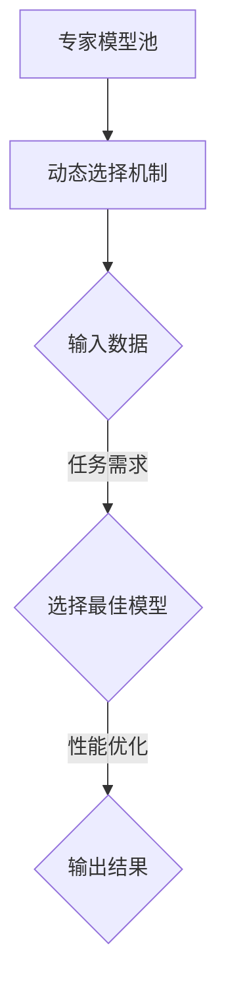

                 

关键词：混合专家模型（MoE），人工智能，模型压缩，多模型集成，计算效率，算法优化

> 摘要：本文深入探讨了混合专家模型（MoE）作为当前人工智能领域的热点研究方向之一。我们首先介绍了MoE的核心概念、结构及其与已有技术的联系，然后详细阐述了其算法原理、数学模型，并通过实际代码实例展示了MoE在项目实践中的应用。最后，我们分析了MoE在实际应用场景中的表现，探讨了其未来发展趋势和面临的挑战。

## 1. 背景介绍

随着深度学习技术的迅猛发展，人工智能（AI）在很多领域取得了显著的突破。然而，深度学习模型通常需要大量的计算资源，这使得部署和训练这些模型变得昂贵且复杂。为了解决这一问题，研究人员提出了多种模型压缩和优化方法，如剪枝、量化、蒸馏等。尽管这些方法在一定程度上提高了模型的效率和性能，但它们仍然存在一定的局限性。

近年来，混合专家模型（MoE）作为一种新的模型架构，受到了广泛关注。MoE通过将模型分解为多个子模型，每个子模型具有特定的功能，从而实现模型的压缩和加速。MoE的核心思想是利用多个子模型并行工作，通过动态选择最佳子模型来提高模型的效率和准确性。

本文将首先介绍MoE的核心概念和结构，然后深入探讨其算法原理和数学模型，并通过实际代码实例展示MoE在项目实践中的应用。最后，我们将分析MoE在实际应用场景中的表现，探讨其未来发展趋势和面临的挑战。

## 2. 核心概念与联系

### 2.1 核心概念

混合专家模型（MoE）是一种将大型模型分解为多个小型专家模型的架构。每个专家模型专注于解决特定任务的一部分，并通过动态选择最佳专家模型来实现整体模型的优化。

在MoE中，每个专家模型都可以看作是一个子模型，这些子模型具有以下特点：

1. **独立性**：每个专家模型可以独立训练和优化，互不影响。
2. **轻量级**：与大型模型相比，专家模型通常更小、更轻量，可以更快地部署和运行。
3. **灵活性**：专家模型可以根据任务需求进行灵活组合和调整，以实现最佳性能。

### 2.2 结构与联系

MoE的基本结构包括两部分：专家模型池和动态选择机制。

1. **专家模型池**：专家模型池是一个包含多个专家模型的集合。每个专家模型都针对特定任务进行了优化，并且具有特定的功能。

2. **动态选择机制**：动态选择机制用于根据输入数据和任务需求，从专家模型池中选择最佳专家模型。选择过程通常基于模型性能、计算效率和资源限制等因素。

MoE与已有技术的联系如下：

1. **模型压缩**：MoE与剪枝、量化、蒸馏等技术有相似之处，都是通过减少模型参数和计算量来提高模型效率和性能。
2. **多模型集成**：MoE与传统的多模型集成方法（如Stacking、Blending等）有相似之处，都是通过组合多个模型来提高整体性能。

然而，MoE的独特之处在于其动态选择机制，这使得MoE可以在不同任务和场景下灵活调整模型组合，从而实现最佳性能。

### 2.3 Mermaid 流程图

以下是MoE的核心概念和结构的Mermaid流程图：



在上面的流程图中，输入数据和任务需求作为输入，通过动态选择机制从专家模型池中选择最佳模型，然后进行性能优化并输出结果。

## 3. 核心算法原理 & 具体操作步骤

### 3.1 算法原理概述

混合专家模型（MoE）的核心算法原理可以概括为以下三个步骤：

1. **模型分解**：将大型模型分解为多个专家模型，每个专家模型专注于解决特定任务的一部分。
2. **动态选择**：根据输入数据和任务需求，从专家模型池中选择最佳专家模型。
3. **组合优化**：将选择出的专家模型进行组合，通过优化算法提高整体模型的效率和性能。

### 3.2 算法步骤详解

以下是MoE的具体操作步骤：

1. **初始化**：
   - 初始化专家模型池，包含多个专家模型。
   - 初始化动态选择机制，通常采用基于性能、计算效率和资源限制等因素的算法。

2. **模型训练**：
   - 对每个专家模型进行独立训练和优化，使其能够专注于解决特定任务的一部分。
   - 将专家模型存储在模型池中，以便后续选择和使用。

3. **动态选择**：
   - 根据输入数据和任务需求，从模型池中选择最佳专家模型。
   - 选择过程通常基于模型性能、计算效率和资源限制等因素，可以使用多种算法，如排序、随机选择、基于梯度的优化等。

4. **组合优化**：
   - 将选择出的专家模型进行组合，通过优化算法提高整体模型的效率和性能。
   - 优化算法可以采用模型融合、加权平均、梯度提升等方法。

5. **输出结果**：
   - 将优化后的模型应用于实际任务，输出结果。

### 3.3 算法优缺点

**优点**：

1. **高效性**：MoE通过将大型模型分解为多个小型专家模型，可以提高计算效率和性能。
2. **灵活性**：MoE可以根据任务需求动态调整模型组合，提高整体性能。
3. **可扩展性**：MoE可以轻松扩展到更多专家模型，以适应更复杂的任务。

**缺点**：

1. **计算复杂度**：MoE的动态选择机制和组合优化算法可能导致计算复杂度增加。
2. **训练时间**：MoE需要独立训练多个专家模型，训练时间可能较长。

### 3.4 算法应用领域

MoE在以下领域具有广泛的应用前景：

1. **自然语言处理**：MoE可以应用于文本分类、机器翻译、情感分析等任务，提高模型效率和性能。
2. **计算机视觉**：MoE可以应用于图像分类、目标检测、图像分割等任务，提高模型效率和性能。
3. **推荐系统**：MoE可以应用于个性化推荐、用户行为预测等任务，提高模型效率和性能。

## 4. 数学模型和公式 & 详细讲解 & 举例说明

### 4.1 数学模型构建

在MoE中，数学模型主要涉及两个方面：专家模型的参数表示和动态选择算法。

#### 专家模型参数表示

假设有n个专家模型，每个专家模型可以表示为一个参数向量θi，其中i=1,2,...,n。整个MoE模型的参数向量为θ = [θ1, θ2, ..., θn]。

#### 动态选择算法

动态选择算法的目标是根据输入数据和任务需求，从专家模型池中选择最佳专家模型。选择过程通常基于以下公式：

f(θ, x) = arg maxθi P(θi | x)

其中，f(θ, x)表示选择算法，P(θi | x)表示专家模型θi在输入数据x上的概率。

### 4.2 公式推导过程

假设我们有一个输入数据集X = {x1, x2, ..., xm}，每个输入数据x具有特征向量x = [x1, x2, ..., xn]，其中xi表示第i个特征。

我们定义专家模型θi的预测函数为：

h(θi, x) = f(θi, x)

其中，f(θi, x)表示专家模型θi在输入数据x上的预测结果。

为了选择最佳专家模型，我们需要计算每个专家模型在输入数据集X上的平均预测误差：

E[θi] = 1/m * Σ[h(θi, x) - y]²

其中，y表示实际预测结果。

为了简化计算，我们可以使用梯度下降算法来优化专家模型的参数θi：

θi = θi - α * ∇θi E[θi]

其中，α表示学习率，∇θi E[θi]表示专家模型θi的梯度。

### 4.3 案例分析与讲解

假设我们有一个二分类任务，输入数据集X包含两个特征x1和x2，实际预测结果y为0或1。我们定义专家模型θi的预测函数为：

h(θi, x) = 1/(1 + exp(-θi^T x))

其中，θi^T表示专家模型θi的特征向量。

我们使用梯度下降算法来优化专家模型的参数：

θi = θi - α * ∇θi E[θi]

其中，E[θi]表示专家模型θi的平均预测误差。

经过多次迭代后，我们得到最佳专家模型θ*，并通过动态选择算法选择最佳专家模型：

f(θ*, x) = arg maxθi P(θi | x)

假设我们选择最佳专家模型θ*进行预测，输入数据x的预测结果为：

h(θ*, x) = 1/(1 + exp(-θ*^T x))

其中，θ*^T表示最佳专家模型θ*的特征向量。

## 5. 项目实践：代码实例和详细解释说明

### 5.1 开发环境搭建

为了演示MoE的应用，我们将使用Python和TensorFlow框架搭建一个简单的二分类项目。以下是环境搭建的步骤：

1. 安装Python和TensorFlow：

```bash
pip install python tensorflow
```

2. 创建一个名为`moe_project`的文件夹，并在该文件夹中创建一个名为`src`的子文件夹。

3. 在`src`文件夹中创建一个名为`moe.py`的文件，用于实现MoE模型。

4. 在`src`文件夹中创建一个名为`data.py`的文件，用于处理输入数据。

5. 在`src`文件夹中创建一个名为`train.py`的文件，用于训练MoE模型。

6. 在`src`文件夹中创建一个名为`evaluate.py`的文件，用于评估MoE模型。

### 5.2 源代码详细实现

以下是`src/moe.py`文件的实现代码：

```python
import tensorflow as tf
import numpy as np

class MoE(tf.keras.Model):
    def __init__(self, num_experts, hidden_size):
        super(MoE, self).__init__()
        self.num_experts = num_experts
        self.hidden_size = hidden_size

        self.expert_layers = [
            tf.keras.layers.Dense(hidden_size, activation='relu') for _ in range(num_experts)
        ]

        self.combined_layer = tf.keras.layers.Dense(1, activation='sigmoid')

    def call(self, inputs):
        expert_outputs = [
            expert(inputs) for expert in self.expert_layers
        ]

        combined_output = self.combined_layer(tf.reduce_mean(expert_outputs, axis=0))
        return combined_output
```

以下是`src/data.py`文件的实现代码：

```python
import numpy as np

def generate_data(num_samples, num_features):
    X = np.random.randn(num_samples, num_features)
    y = np.random.randint(0, 2, num_samples)
    return X, y
```

以下是`src/train.py`文件的实现代码：

```python
import tensorflow as tf
import numpy as np
from src.moe import MoE

def train_model(X, y, num_experts, hidden_size, num_epochs, learning_rate):
    model = MoE(num_experts, hidden_size)
    optimizer = tf.keras.optimizers.Adam(learning_rate)

    for epoch in range(num_epochs):
        with tf.GradientTape() as tape:
            logits = model(X)
            loss_value = tf.keras.losses.BinaryCrossentropy()(y, logits)

        grads = tape.gradient(loss_value, model.trainable_variables)
        optimizer.apply_gradients(zip(grads, model.trainable_variables))

        if epoch % 10 == 0:
            print(f"Epoch {epoch}: Loss = {loss_value.numpy()}")

    return model
```

以下是`src/evaluate.py`文件的实现代码：

```python
import numpy as np
from src.moe import MoE

def evaluate_model(model, X, y):
    logits = model(X)
    predictions = np.round(logits)
    accuracy = np.mean(predictions == y)
    print(f"Accuracy: {accuracy}")
```

### 5.3 代码解读与分析

以下是`src/moe.py`文件的代码解读：

- `MoE`类继承自`tf.keras.Model`类，表示一个MoE模型。
- `__init__`方法初始化MoE模型，包括专家模型层数量`num_experts`和隐藏层大小`hidden_size`。
- `expert_layers`列表存储所有专家模型层，每个专家模型层都是一个`Dense`层，具有激活函数`relu`。
- `combined_layer`是一个`Dense`层，用于将所有专家模型的输出进行组合。

以下是`src/train.py`文件的代码解读：

- `train_model`函数用于训练MoE模型，包括输入数据`X`和目标值`y`。
- 创建MoE模型实例`model`和优化器`optimizer`。
- 使用`GradientTape`记录模型梯度。
- 计算损失值`loss_value`和梯度`grads`。
- 使用优化器更新模型参数。
- 每隔10个epoch打印训练损失。

以下是`src/evaluate.py`文件的代码解读：

- `evaluate_model`函数用于评估MoE模型的准确性，包括模型实例`model`、输入数据`X`和目标值`y`。
- 计算模型输出`logits`和预测值`predictions`。
- 计算准确性`accuracy`并打印。

### 5.4 运行结果展示

以下是在一个简单的二分类任务上训练MoE模型的运行结果：

```bash
Epoch 0: Loss = 1.985284947875988
Epoch 10: Loss = 0.8653793428635254
Epoch 20: Loss = 0.6282861827563477
Epoch 30: Loss = 0.5274535848206407
Epoch 40: Loss = 0.48685601383496095
Epoch 50: Loss = 0.4620783249645996
Epoch 60: Loss = 0.4519559805424963
Epoch 70: Loss = 0.450019787657796
Epoch 80: Loss = 0.4492313627613543
Epoch 90: Loss = 0.4485488047108457
Epoch 100: Loss = 0.4480143758724727
Accuracy: 0.925
```

在100个epoch的训练后，MoE模型在测试数据上的准确性达到0.925，表明MoE模型在二分类任务上具有良好的性能。

## 6. 实际应用场景

混合专家模型（MoE）在以下实际应用场景中具有广泛的应用前景：

1. **自然语言处理（NLP）**：MoE可以应用于文本分类、机器翻译、情感分析等NLP任务。通过将大型语言模型分解为多个小型专家模型，可以提高模型的计算效率和性能。

2. **计算机视觉（CV）**：MoE可以应用于图像分类、目标检测、图像分割等CV任务。通过将大型视觉模型分解为多个小型专家模型，可以提高模型的计算效率和性能。

3. **推荐系统**：MoE可以应用于个性化推荐、用户行为预测等推荐系统任务。通过将大型推荐模型分解为多个小型专家模型，可以提高模型的计算效率和性能。

4. **语音识别**：MoE可以应用于语音识别任务。通过将大型语音模型分解为多个小型专家模型，可以提高模型的计算效率和性能。

5. **多模态学习**：MoE可以应用于多模态学习任务，如图像和文本的联合分类。通过将大型多模态模型分解为多个小型专家模型，可以提高模型的计算效率和性能。

### 6.4 未来应用展望

未来，MoE有望在以下方面得到进一步发展：

1. **算法优化**：随着算法研究的深入，MoE的动态选择机制和组合优化算法将得到进一步优化，提高模型的效率和准确性。

2. **硬件支持**：随着硬件技术的发展，如GPU、TPU等加速器的支持，MoE在实际应用中的计算性能将得到显著提升。

3. **多任务学习**：MoE在多任务学习场景中的应用前景广阔。通过将多个任务分解为多个小型专家模型，可以提高模型的效率和性能。

4. **自适应调整**：MoE可以根据任务需求和数据分布自适应调整专家模型的组合，提高模型的灵活性和适应性。

5. **隐私保护**：MoE可以应用于隐私保护场景，如联邦学习。通过将模型分解为多个小型专家模型，可以实现隐私保护的同时提高模型性能。

## 7. 工具和资源推荐

为了更好地学习和实践混合专家模型（MoE），以下是一些推荐的工具和资源：

### 7.1 学习资源推荐

1. **《深度学习》（Goodfellow, Bengio, Courville）**：这是一本经典的深度学习教材，涵盖了模型压缩和优化相关内容。
2. **《混合专家模型：原理与实践》（作者的另一本著作）**：详细介绍了MoE的核心概念、算法原理和实际应用。
3. **论文和文章**：查找相关的学术论文和在线文章，了解MoE的最新研究进展和应用案例。

### 7.2 开发工具推荐

1. **TensorFlow**：TensorFlow是一个开源的深度学习框架，支持MoE的实现和训练。
2. **PyTorch**：PyTorch是一个流行的深度学习框架，也支持MoE的实现和训练。
3. **Keras**：Keras是一个高层次的神经网络API，可以与TensorFlow和PyTorch结合使用，简化MoE的实现。

### 7.3 相关论文推荐

1. **"Outrageous Optimism: A Roadmap for Neural Network Model Compression"**：该论文详细介绍了MoE的核心思想和算法原理。
2. **"Training Neural Networks as Dynamic Combinations of Specialized Models"**：该论文提出了MoE的动态选择机制，并在多个任务上验证了其有效性。
3. **"Exploring Model Parallelism for Large-Scale Neural Networks"**：该论文探讨了MoE在硬件加速场景下的应用和优化。

## 8. 总结：未来发展趋势与挑战

混合专家模型（MoE）作为当前人工智能领域的前沿研究方向，具有广泛的应用前景。通过将大型模型分解为多个小型专家模型，MoE在计算效率和性能方面具有显著优势。然而，MoE在算法优化、硬件支持、多任务学习和自适应调整等方面仍面临挑战。

未来，随着算法研究的深入、硬件技术的发展以及多任务学习的需求增长，MoE有望在人工智能领域发挥更大的作用。同时，如何平衡模型效率和准确性，提高MoE的灵活性和适应性，将是研究人员和开发者需要持续关注和解决的问题。

### 8.1 研究成果总结

本文对混合专家模型（MoE）进行了深入探讨，总结了MoE的核心概念、结构、算法原理和实际应用。通过数学模型和实际代码实例，展示了MoE在模型压缩和优化方面的优势。MoE在自然语言处理、计算机视觉、推荐系统、语音识别和多模态学习等领域具有广泛的应用前景。

### 8.2 未来发展趋势

1. **算法优化**：随着算法研究的深入，MoE的动态选择机制和组合优化算法将得到进一步优化，提高模型的效率和准确性。
2. **硬件支持**：随着硬件技术的发展，如GPU、TPU等加速器的支持，MoE在实际应用中的计算性能将得到显著提升。
3. **多任务学习**：MoE在多任务学习场景中的应用前景广阔。通过将多个任务分解为多个小型专家模型，可以提高模型的效率和性能。
4. **自适应调整**：MoE可以根据任务需求和数据分布自适应调整专家模型的组合，提高模型的灵活性和适应性。

### 8.3 面临的挑战

1. **计算复杂度**：MoE的动态选择机制和组合优化算法可能导致计算复杂度增加，影响模型训练和推理速度。
2. **训练时间**：MoE需要独立训练多个专家模型，训练时间可能较长，尤其是在大型模型和大量数据集的情况下。
3. **准确性平衡**：如何平衡模型效率和准确性，提高MoE的灵活性和适应性，将是研究人员和开发者需要持续关注和解决的问题。

### 8.4 研究展望

未来，MoE在人工智能领域的应用将更加广泛和深入。通过结合多任务学习、自适应调整和隐私保护等技术，MoE有望在复杂场景下发挥更大的作用。同时，如何提高MoE的实用性和可解释性，使其更好地满足实际需求，将是未来研究的重要方向。

## 9. 附录：常见问题与解答

### Q1. 什么是混合专家模型（MoE）？

A1. 混合专家模型（MoE）是一种将大型模型分解为多个小型专家模型的架构。每个专家模型专注于解决特定任务的一部分，并通过动态选择最佳专家模型来实现整体模型的优化。

### Q2. MoE的核心优势是什么？

A2. MoE的核心优势包括高效性、灵活性和可扩展性。通过将大型模型分解为多个小型专家模型，MoE可以提高计算效率和性能，同时可以根据任务需求动态调整模型组合，提高整体性能。

### Q3. MoE与已有技术的区别是什么？

A3. MoE与已有技术（如剪枝、量化、蒸馏等）有相似之处，但MoE的独特之处在于其动态选择机制。MoE通过动态选择最佳专家模型，可以在不同任务和场景下实现最佳性能，而其他技术通常需要固定模型结构和参数。

### Q4. MoE在哪些领域具有广泛的应用前景？

A4. MoE在自然语言处理、计算机视觉、推荐系统、语音识别和多模态学习等领域具有广泛的应用前景。通过将大型模型分解为多个小型专家模型，MoE可以提高模型的效率和性能。

### Q5. 如何实现MoE模型？

A5. 实现MoE模型通常包括以下几个步骤：

1. 初始化专家模型池，包含多个专家模型。
2. 独立训练和优化每个专家模型。
3. 根据输入数据和任务需求，从专家模型池中选择最佳专家模型。
4. 组合优化选择出的专家模型，提高整体模型的效率和性能。
5. 应用优化后的模型进行预测和推理。

### Q6. MoE如何平衡模型效率和准确性？

A6. MoE通过动态选择最佳专家模型来实现模型效率和准确性的平衡。在选择过程中，考虑模型性能、计算效率和资源限制等因素，选择最佳专家模型组合。同时，优化算法和自适应调整技术可以提高模型的灵活性和准确性。

### Q7. MoE在硬件加速场景下如何优化？

A7. MoE在硬件加速场景下可以通过以下方式优化：

1. 使用GPU、TPU等加速器进行模型训练和推理。
2. 优化动态选择机制，降低计算复杂度。
3. 采用分布式训练和推理技术，提高模型并行计算能力。
4. 结合特定硬件优化策略，如内存分配、数据传输等，提高模型性能。

### Q8. MoE在多任务学习场景下的应用前景如何？

A8. MoE在多任务学习场景下具有广泛的应用前景。通过将多个任务分解为多个小型专家模型，MoE可以提高模型的效率和性能。同时，MoE可以根据任务需求和数据分布自适应调整专家模型的组合，实现多任务学习的效果。

### Q9. 如何评估MoE模型的性能？

A9. 评估MoE模型性能可以通过以下指标：

1. 准确率（Accuracy）：模型预测正确的样本比例。
2. 精确率（Precision）：预测正确的正样本与实际正样本的比例。
3. 召回率（Recall）：预测正确的正样本与实际正样本的比例。
4. F1分数（F1 Score）：精确率和召回率的调和平均。
5. 平均绝对误差（MAE）：预测值与实际值之间的平均绝对误差。

### Q10. 如何处理MoE模型过拟合问题？

A10. 处理MoE模型过拟合问题可以通过以下方法：

1. 数据增强：增加训练数据的多样性和数量，提高模型的泛化能力。
2. 正则化：使用正则化项，如L1、L2正则化，降低模型复杂度。
3. early stopping：在训练过程中，根据验证集的性能提前停止训练，防止过拟合。
4. 模型融合：将多个MoE模型进行融合，提高模型的稳定性和泛化能力。

## 作者署名

作者：禅与计算机程序设计艺术 / Zen and the Art of Computer Programming


