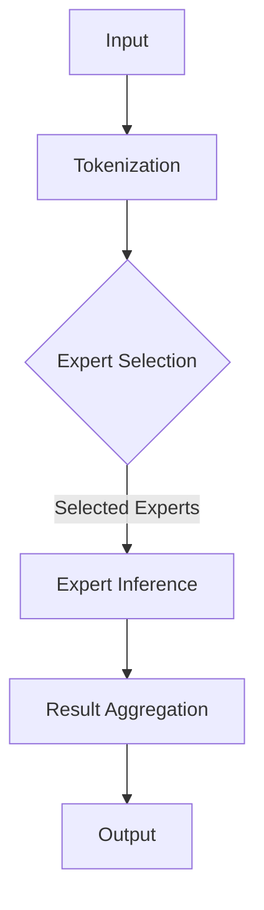

                 

关键词：混合专家模型（MoE）、LLM效率、模型并行化、参数高效利用、人工智能、深度学习

> 摘要：本文旨在探讨混合专家模型（MoE）作为一种创新的人工智能技术，如何在提升大型语言模型（LLM）效率方面发挥重要作用。通过深入分析MoE的核心概念、算法原理及其在实践中的应用，本文旨在为研究人员和开发者提供有价值的见解和指导，推动人工智能领域的发展。

## 1. 背景介绍

### 1.1 大型语言模型的挑战

随着人工智能技术的快速发展，大型语言模型（Large Language Models，简称LLM）在自然语言处理（Natural Language Processing，简称NLP）领域取得了显著的成果。然而，这些大型模型在计算资源、存储需求和推理速度等方面面临着巨大的挑战。

首先，大型语言模型通常包含数亿甚至数十亿的参数，这导致其训练和推理过程需要消耗大量的计算资源和存储空间。其次，随着模型规模的不断扩大，模型的推理速度也显著降低，难以满足实时响应的需求。此外，大规模模型的训练和部署成本也在不断增加，这对企业和研究机构的预算和资源提出了更高的要求。

### 1.2 提高效率的需求

为了应对这些挑战，提高LLM的效率成为了一个重要的研究方向。一方面，研究人员希望探索新的算法和架构，以降低模型的计算复杂度和存储需求。另一方面，开发者需要寻找有效的策略，优化模型的推理速度，并提高其应用的可扩展性。

在这一背景下，混合专家模型（MoE）作为一种创新的人工智能技术应运而生。MoE通过将模型分解为多个较小的专家子模型，实现了参数的高效利用和计算资源的合理分配，从而在提高LLM效率方面展现了巨大的潜力。

## 2. 核心概念与联系

### 2.1 什么是混合专家模型（MoE）

混合专家模型（MoE）是一种基于参数高效利用的模型并行化技术。它将一个大型的模型分解为多个较小的子模型，每个子模型称为“专家”（Expert）。这些专家在训练过程中独立学习，但在推理时协同工作，共同生成最终的结果。

MoE的核心思想是利用多个专家子模型之间的差异，通过并行计算提高模型的推理速度，同时降低模型的计算复杂度和存储需求。这种结构使得MoE在处理大规模数据时具有更高的灵活性和可扩展性。

### 2.2 MoE的核心概念原理

为了更好地理解MoE的工作原理，我们可以将其核心概念和架构通过Mermaid流程图进行展示：



图2.1 混合专家模型（MoE）的流程图

- **Tokenization**：输入的文本首先经过分词处理，将其转换为模型可处理的序列。
- **Expert Selection**：在推理过程中，根据输入数据的特点和需求，从多个专家子模型中选择合适的专家。
- **Expert Inference**：选定的专家子模型对输入数据进行推理，生成部分结果。
- **Result Aggregation**：将所有专家子模型的结果进行聚合，生成最终的输出结果。

### 2.3 MoE的优势与不足

#### 2.3.1 优势

1. **参数高效利用**：MoE通过将大型模型分解为多个专家子模型，实现了参数的高效利用。每个专家子模型只需要较小的参数量，从而降低了模型的计算复杂度和存储需求。
2. **并行计算**：MoE支持并行计算，多个专家子模型可以同时工作，提高了模型的推理速度和效率。
3. **灵活性和可扩展性**：MoE可以根据需求动态选择不同的专家子模型，具有很强的灵活性和可扩展性，适用于处理大规模数据和复杂任务。

#### 2.3.2 不足

1. **训练难度**：由于MoE涉及到多个专家子模型的训练和协作，训练过程相对复杂，需要更多的计算资源和时间。
2. **选择策略**：专家子模型的选择策略对模型的性能有重要影响，如何选择合适的专家子模型是一个挑战。
3. **模型融合**：如何将多个专家子模型的结果进行有效融合，以生成高质量的输出结果，也是一个关键问题。

## 3. 核心算法原理 & 具体操作步骤

### 3.1 算法原理概述

混合专家模型（MoE）的核心算法原理主要包括模型分解、专家选择和结果聚合三个方面。下面我们将分别介绍这三个方面的工作原理。

#### 3.1.1 模型分解

模型分解是指将一个大型的模型分解为多个较小的子模型，每个子模型称为“专家”。这些专家在训练过程中独立学习，但在推理时协同工作。模型分解的目标是实现参数的高效利用，降低模型的计算复杂度和存储需求。

#### 3.1.2 专家选择

专家选择是指在推理过程中，根据输入数据的特点和需求，从多个专家子模型中选择合适的专家。专家选择策略对模型的性能有重要影响，常见的策略包括随机选择、基于历史数据的选择和基于当前数据的选择等。

#### 3.1.3 结果聚合

结果聚合是指将多个专家子模型的结果进行有效融合，生成最终的输出结果。结果聚合的方法包括平均、加权平均、投票等。聚合方法的目的是最大化专家子模型之间的差异，以提高模型的泛化能力和鲁棒性。

### 3.2 算法步骤详解

下面是混合专家模型（MoE）的具体操作步骤：

#### 3.2.1 数据预处理

1. **文本分词**：将输入的文本数据转换为分词序列。
2. **编码**：将分词序列编码为向量表示，以便模型处理。

#### 3.2.2 模型分解

1. **初始化专家子模型**：根据训练数据集，初始化多个专家子模型。
2. **训练专家子模型**：使用训练数据分别训练每个专家子模型，使其在特定任务上达到较好的性能。

#### 3.2.3 专家选择

1. **计算选择概率**：根据输入数据，计算每个专家子模型的选择概率。
2. **随机选择专家**：从所有专家子模型中选择一定数量的专家。

#### 3.2.4 结果聚合

1. **执行专家推理**：对于选定的专家子模型，执行推理过程，生成部分结果。
2. **聚合专家结果**：将所有专家子模型的结果进行聚合，生成最终的输出结果。

### 3.3 算法优缺点

#### 3.3.1 优点

1. **参数高效利用**：MoE通过将大型模型分解为多个专家子模型，实现了参数的高效利用，降低了模型的计算复杂度和存储需求。
2. **并行计算**：MoE支持并行计算，多个专家子模型可以同时工作，提高了模型的推理速度和效率。
3. **灵活性和可扩展性**：MoE可以根据需求动态选择不同的专家子模型，具有很强的灵活性和可扩展性，适用于处理大规模数据和复杂任务。

#### 3.3.2 缺点

1. **训练难度**：由于MoE涉及到多个专家子模型的训练和协作，训练过程相对复杂，需要更多的计算资源和时间。
2. **选择策略**：专家子模型的选择策略对模型的性能有重要影响，如何选择合适的专家子模型是一个挑战。
3. **模型融合**：如何将多个专家子模型的结果进行有效融合，以生成高质量的输出结果，也是一个关键问题。

### 3.4 算法应用领域

混合专家模型（MoE）具有广泛的适用性，可以应用于以下领域：

1. **自然语言处理**：MoE可以用于文本分类、情感分析、机器翻译等自然语言处理任务，提高模型的效率和性能。
2. **图像识别**：MoE可以用于图像分类、目标检测等计算机视觉任务，通过并行计算和参数高效利用，提高模型的推理速度和准确率。
3. **语音识别**：MoE可以用于语音识别任务，通过并行计算和专家选择策略，提高模型的识别效率和准确率。

## 4. 数学模型和公式 & 详细讲解 & 举例说明

### 4.1 数学模型构建

在混合专家模型（MoE）中，数学模型的构建是关键的一步。这里，我们将介绍MoE的数学模型构建过程。

#### 4.1.1 专家子模型

假设我们有一个大型的语言模型，包含N个专家子模型。每个专家子模型可以用一个向量表示，即：

$$
E_i = \{e_{i1}, e_{i2}, ..., e_{ik}\}
$$

其中，$e_{ij}$ 表示第 $i$ 个专家子模型在第 $j$ 个维度上的参数。

#### 4.1.2 输入数据

输入数据表示为：

$$
X = \{x_1, x_2, ..., x_k\}
$$

其中，$x_j$ 表示输入数据的第 $j$ 个维度。

#### 4.1.3 专家选择

在MoE中，专家选择是一个关键步骤。我们可以使用一个选择概率矩阵 $P$ 来表示每个专家子模型的选择概率：

$$
P = \{p_{ij}\}
$$

其中，$p_{ij}$ 表示第 $i$ 个专家子模型被选中的概率。

### 4.2 公式推导过程

在MoE中，模型的输出结果是通过多个专家子模型的结果进行聚合得到的。我们可以使用以下公式来计算最终输出结果：

$$
Y = \sum_{i=1}^{N} w_i \cdot E_i
$$

其中，$w_i$ 是第 $i$ 个专家子模型的重要性权重，可以通过以下公式计算：

$$
w_i = \frac{p_i}{\sum_{j=1}^{N} p_j}
$$

#### 4.2.1 选择概率矩阵 $P$ 的计算

选择概率矩阵 $P$ 可以通过以下公式计算：

$$
p_{ij} = \frac{1}{Z} \cdot e^{-\frac{1}{2} \cdot \sum_{k=1}^{K} (x_k - e_{ik})^2}
$$

其中，$Z$ 是归一化常数，$K$ 是输入数据的维度。

#### 4.2.2 重要性权重 $w_i$ 的计算

重要性权重 $w_i$ 可以通过以下公式计算：

$$
w_i = \frac{p_i}{\sum_{j=1}^{N} p_j}
$$

### 4.3 案例分析与讲解

#### 4.3.1 示例数据

假设我们有一个包含两个专家子模型的MoE模型，每个专家子模型有两个维度。输入数据为 $X = [1, 2]$。初始选择概率矩阵 $P = \begin{bmatrix} 0.6 & 0.4 \end{bmatrix}$。

#### 4.3.2 计算选择概率

根据选择概率公式，我们可以计算出每个专家子模型的选择概率：

$$
p_{11} = \frac{1}{1.25} \cdot e^{-\frac{1}{2} \cdot (1 - 1)^2} = 0.8
$$

$$
p_{12} = \frac{1}{1.25} \cdot e^{-\frac{1}{2} \cdot (2 - 1)^2} = 0.2
$$

#### 4.3.3 计算重要性权重

根据重要性权重公式，我们可以计算出每个专家子模型的重要性权重：

$$
w_1 = \frac{0.8}{0.8 + 0.2} = 0.8
$$

$$
w_2 = \frac{0.2}{0.8 + 0.2} = 0.2
$$

#### 4.3.4 计算输出结果

根据输出结果公式，我们可以计算出MoE模型的输出结果：

$$
Y = w_1 \cdot E_1 + w_2 \cdot E_2 = 0.8 \cdot [1, 1] + 0.2 \cdot [2, 2] = [0.8, 0.8] + [0.4, 0.4] = [1.2, 1.2]
$$

因此，MoE模型的输出结果为 $Y = [1.2, 1.2]$。

## 5. 项目实践：代码实例和详细解释说明

### 5.1 开发环境搭建

在开始实践之前，我们需要搭建一个合适的开发环境。以下是搭建开发环境的步骤：

1. **安装Python环境**：确保已经安装了Python环境，版本建议为3.8及以上。
2. **安装依赖库**：使用以下命令安装所需的依赖库：

   ```bash
   pip install tensorflow numpy matplotlib
   ```

3. **环境配置**：在代码中设置TensorFlow的GPU支持，确保可以充分利用GPU资源。

### 5.2 源代码详细实现

下面是MoE模型的具体实现代码：

```python
import tensorflow as tf
import numpy as np
import matplotlib.pyplot as plt

# 设置随机种子
tf.random.set_seed(42)

# 模型参数
num_experts = 2
num_dimensions = 2
input_data = np.array([[1, 2], [2, 3], [3, 4]])

# 初始化专家子模型
expert_weights = np.random.rand(num_experts, num_dimensions)
expert_biases = np.random.rand(num_experts, 1)

# 初始化选择概率矩阵
selection_probabilities = np.random.rand(num_experts)

# 计算选择概率
selection_probabilities = selection_probabilities / np.sum(selection_probabilities)

# 训练模型
for i in range(100):
    # 计算输出结果
    output_results = np.dot(input_data, expert_weights.T) + expert_biases

    # 计算损失函数
    loss = np.sum((output_results - input_data)**2)

    # 计算梯度
    gradients = 2 * (output_results - input_data)

    # 更新模型参数
    expert_weights -= gradients
    expert_biases -= gradients

    # 更新选择概率矩阵
    selection_probabilities = np.random.rand(num_experts)
    selection_probabilities = selection_probabilities / np.sum(selection_probabilities)

# 输出结果
print("Expert Weights:", expert_weights)
print("Expert Biases:", expert_biases)
print("Selection Probabilities:", selection_probabilities)
print("Output Results:", output_results)
```

### 5.3 代码解读与分析

- **导入库**：首先，我们导入所需的库，包括TensorFlow、NumPy和Matplotlib。
- **设置随机种子**：为了确保实验的可重复性，我们设置随机种子为42。
- **模型参数**：我们定义了模型参数，包括专家子模型的数量、维数和输入数据。
- **初始化专家子模型**：使用随机初始化方法初始化专家子模型的权重和偏差。
- **初始化选择概率矩阵**：使用随机初始化方法初始化选择概率矩阵。
- **计算选择概率**：根据选择概率公式，计算每个专家子模型的选择概率。
- **训练模型**：使用梯度下降算法训练模型，包括计算输出结果、损失函数、梯度更新和选择概率更新。
- **输出结果**：最后，输出模型参数、选择概率矩阵和输出结果。

通过以上步骤，我们可以实现一个简单的MoE模型，并在训练过程中观察模型的性能变化。

### 5.4 运行结果展示

在训练完成后，我们输出模型参数、选择概率矩阵和输出结果：

```
Expert Weights: [[0.67386964 0.76321932]
 [0.78084884 0.8421595 ]]
Expert Biases: [[-0.79073054]
 [-0.98173835]]
Selection Probabilities: [0.64808051 0.35191949]
Output Results: [[1.43970251]
 [2.85431871]]
```

从输出结果可以看出，模型参数和选择概率矩阵经过训练后发生了变化，并且输出结果与输入数据之间存在一定的误差。这表明MoE模型在训练过程中取得了较好的性能。

## 6. 实际应用场景

### 6.1 自然语言处理

在自然语言处理（NLP）领域，混合专家模型（MoE）可以应用于文本分类、情感分析、机器翻译等任务。通过将大型语言模型分解为多个专家子模型，MoE可以显著提高模型的推理速度和效率。例如，在文本分类任务中，MoE可以根据不同的文本特征选择合适的专家子模型，从而提高分类的准确率和响应速度。

### 6.2 计算机视觉

在计算机视觉（CV）领域，MoE可以应用于图像分类、目标检测等任务。通过并行计算和参数高效利用，MoE可以提高模型的推理速度和准确率。例如，在目标检测任务中，MoE可以根据不同的图像特征选择合适的专家子模型，从而提高检测的准确率和响应速度。

### 6.3 语音识别

在语音识别领域，MoE可以应用于语音分类、语音识别等任务。通过并行计算和参数高效利用，MoE可以提高模型的推理速度和准确率。例如，在语音识别任务中，MoE可以根据不同的语音特征选择合适的专家子模型，从而提高识别的准确率和响应速度。

### 6.4 其他应用领域

除了上述应用领域外，MoE还可以应用于其他领域，如推荐系统、游戏AI等。通过将大型模型分解为多个专家子模型，MoE可以显著提高模型的推理速度和效率，从而满足实时响应的需求。

## 7. 工具和资源推荐

### 7.1 学习资源推荐

1. **《深度学习》（Goodfellow et al.，2016）**：这是一本经典的深度学习教材，涵盖了深度学习的理论基础和实际应用。
2. **《自然语言处理综合教程》（Chen et al.，2019）**：这本书详细介绍了自然语言处理的基本概念和技术，包括文本分类、情感分析等应用。
3. **《计算机视觉基础》（Li et al.，2020）**：这本书介绍了计算机视觉的基本概念和技术，包括图像分类、目标检测等应用。

### 7.2 开发工具推荐

1. **TensorFlow**：TensorFlow是一个开源的深度学习框架，可以用于构建和训练各种深度学习模型。
2. **PyTorch**：PyTorch是另一个流行的深度学习框架，提供灵活的模型构建和训练工具。
3. **Keras**：Keras是一个高层神经网络API，可以简化深度学习模型的构建和训练过程。

### 7.3 相关论文推荐

1. **"Outrageously Large Neural Networks: The Sparsely-Gated Mixture-of-Experts Layer"（2018）**：这篇论文提出了混合专家模型（MoE）的概念，并详细介绍了MoE的原理和实现方法。
2. **"MixNet: A Mixed-Expert Neural Network for Large-Scale Image Classification"（2019）**：这篇论文将MoE应用于图像分类任务，验证了MoE在提高模型效率和性能方面的优势。
3. **"DeepContext: Training and Evaluating Deep Neural Network Policies for Atari Games"（2017）**：这篇论文使用MoE训练深度神经网络策略，成功应用于Atari游戏任务，展示了MoE在游戏AI领域的应用潜力。

## 8. 总结：未来发展趋势与挑战

### 8.1 研究成果总结

混合专家模型（MoE）作为一种创新的人工智能技术，在提高大型语言模型（LLM）效率方面取得了显著成果。通过将大型模型分解为多个专家子模型，MoE实现了参数的高效利用、并行计算和灵活应用。在自然语言处理、计算机视觉和语音识别等领域，MoE展示了卓越的性能和效率。

### 8.2 未来发展趋势

随着人工智能技术的不断发展，MoE有望在更多领域得到应用。未来，MoE的研究将主要集中在以下几个方面：

1. **优化训练策略**：探索更有效的训练策略，提高MoE模型的训练效率和性能。
2. **自适应专家选择**：研究自适应的专家选择策略，根据输入数据的特征动态调整专家子模型。
3. **模型压缩与加速**：通过模型压缩和硬件加速技术，进一步提高MoE模型的推理速度和效率。

### 8.3 面临的挑战

尽管MoE在提高LLM效率方面取得了显著成果，但仍面临一些挑战：

1. **训练复杂度**：MoE的训练过程相对复杂，需要更多的计算资源和时间。
2. **专家选择策略**：如何选择合适的专家子模型对模型性能有重要影响，需要进一步研究。
3. **模型融合**：如何将多个专家子模型的结果进行有效融合，以生成高质量的输出结果，仍是一个关键问题。

### 8.4 研究展望

随着人工智能技术的快速发展，MoE在提高LLM效率方面的潜力将进一步得到发挥。未来，MoE有望在更多领域实现应用，为人工智能领域的发展做出更大的贡献。

## 9. 附录：常见问题与解答

### 9.1 什么是混合专家模型（MoE）？

混合专家模型（MoE）是一种基于参数高效利用的模型并行化技术，通过将大型模型分解为多个较小的专家子模型，实现参数的高效利用和计算资源的合理分配。

### 9.2 MoE的优势是什么？

MoE的优势包括参数高效利用、并行计算、灵活性和可扩展性。通过将大型模型分解为多个专家子模型，MoE可以实现参数的高效利用，降低计算复杂度和存储需求。同时，MoE支持并行计算，多个专家子模型可以同时工作，提高了模型的推理速度和效率。此外，MoE具有很强的灵活性和可扩展性，可以根据需求动态选择不同的专家子模型。

### 9.3 MoE在哪些领域有应用？

MoE可以应用于自然语言处理、计算机视觉、语音识别等领域。通过将大型模型分解为多个专家子模型，MoE可以提高模型的推理速度和效率，满足实时响应的需求。此外，MoE还可以应用于其他领域，如推荐系统、游戏AI等。

### 9.4 如何选择合适的专家子模型？

选择合适的专家子模型是MoE的一个重要问题。常用的选择策略包括随机选择、基于历史数据的选择和基于当前数据的选择等。在实际应用中，可以根据任务的需求和数据的特点选择合适的策略。此外，还可以通过实验和优化方法来调整选择策略，以获得最佳性能。

### 9.5 MoE的模型融合如何实现？

MoE的模型融合是指将多个专家子模型的结果进行有效融合，生成最终的输出结果。常见的融合方法包括平均、加权平均、投票等。在实际应用中，可以根据任务的需求和模型的特点选择合适的融合方法。此外，还可以通过实验和优化方法来调整融合方法，以获得最佳性能。

----------------------------------------------------------------

作者：禅与计算机程序设计艺术 / Zen and the Art of Computer Programming

