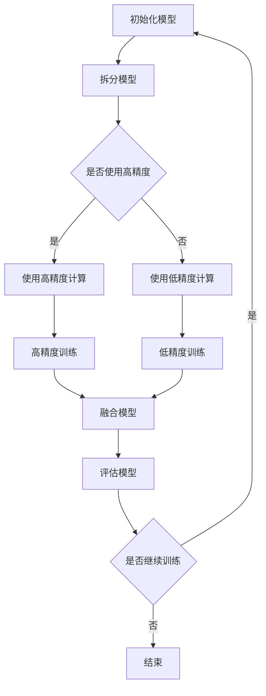

                 

关键词：混合精度训练、fp16、bf16、fp8、计算精度、性能优化、模型压缩、AI加速

摘要：本文深入探讨了混合精度训练在人工智能领域的应用及其重要性。我们将介绍混合精度训练的背景、核心概念、算法原理、数学模型、实际应用场景以及未来展望。重点分析了fp16、bf16和fp8三种不同精度下的性能优化和模型压缩策略，为研究人员和开发者提供了宝贵的参考。

## 1. 背景介绍

### 混合精度训练的起源与重要性

随着深度学习模型的规模越来越大，计算资源的消耗也越来越大。为了在有限的计算资源下加速训练过程并提高模型性能，研究人员提出了混合精度训练（Mixed Precision Training）的方法。混合精度训练通过将模型的不同部分训练在不同的精度下，实现了在保持计算精度的情况下大幅提升计算性能。

混合精度训练最早由NVIDIA提出，并在其TensorCore架构上得到了广泛应用。在TensorCore架构中，浮点数运算可以在半精度（fp16）和全精度（fp32）之间切换，从而在性能和精度之间达到最佳平衡。这种思想迅速得到了业界的认可和推广，成为深度学习领域的重要研究方向。

### 混合精度训练的应用场景

混合精度训练在许多领域都有广泛的应用，以下是几个典型的应用场景：

- **计算机视觉**：在图像分类、目标检测和图像分割等任务中，混合精度训练可以显著提高模型的训练速度，同时保持较高的精度。
- **自然语言处理**：在语言模型、机器翻译和文本分类等任务中，混合精度训练可以加快训练过程，提高模型效果。
- **强化学习**：在强化学习任务中，混合精度训练有助于降低计算成本，提高训练效率。

## 2. 核心概念与联系

### 混合精度训练的核心概念

混合精度训练的核心概念主要包括：

- **精度级别**：包括半精度（fp16）、半精度半扩展（bf16）和低精度（fp8）。
- **模型拆分**：将模型拆分为高精度部分和低精度部分。
- **混合计算**：在高精度部分使用全精度计算，在低精度部分使用半精度或低精度计算。

### 混合精度训练的架构

以下是一个简化的混合精度训练架构的Mermaid流程图：



## 3. 核心算法原理 & 具体操作步骤

### 3.1 算法原理概述

混合精度训练的原理主要基于以下两个方面：

- **数值稳定性**：通过使用半精度或低精度计算，减少数值误差，提高训练稳定性。
- **计算加速**：通过使用半精度或低精度计算，减少计算资源消耗，提高训练速度。

### 3.2 算法步骤详解

混合精度训练的具体步骤如下：

1. **模型初始化**：初始化模型参数，分为高精度部分和低精度部分。
2. **模型拆分**：将模型拆分为高精度部分和低精度部分。
3. **训练过程**：在高精度部分使用全精度计算，在低精度部分使用半精度或低精度计算。
4. **模型融合**：将高精度部分和低精度部分的模型参数融合，得到最终的模型。
5. **评估模型**：使用测试集评估模型性能，决定是否继续训练。
6. **结束训练**：如果模型性能达到预期，结束训练过程。

### 3.3 算法优缺点

**优点**：

- **提高计算性能**：通过使用半精度或低精度计算，减少计算资源消耗，提高训练速度。
- **保持计算精度**：在保持计算精度的前提下，提高计算性能。

**缺点**：

- **模型精度损失**：如果半精度或低精度计算的数值误差较大，可能会导致模型精度下降。
- **复杂度增加**：需要处理不同精度级别的数据，增加了算法实现的复杂度。

### 3.4 算法应用领域

混合精度训练在以下领域有广泛应用：

- **计算机视觉**：如图像分类、目标检测和图像分割等。
- **自然语言处理**：如语言模型、机器翻译和文本分类等。
- **强化学习**：如游戏AI、机器人控制和自动驾驶等。

## 4. 数学模型和公式 & 详细讲解 & 举例说明

### 4.1 数学模型构建

在混合精度训练中，我们可以使用以下数学模型：

- **高精度模型**：$$ f_{fp32}(x) = W_{fp32} \cdot x + b_{fp32} $$
- **半精度模型**：$$ f_{fp16}(x) = W_{fp16} \cdot x + b_{fp16} $$
- **低精度模型**：$$ f_{fp8}(x) = W_{fp8} \cdot x + b_{fp8} $$

其中，$W$和$b$分别表示模型参数。

### 4.2 公式推导过程

假设我们有一个全精度模型$ f_{fp32}(x) $，我们希望将其转化为半精度模型$ f_{fp16}(x) $。根据半精度计算的规则，我们可以推导出以下公式：

$$ f_{fp16}(x) = \frac{W_{fp32}}{2} \cdot x + \frac{b_{fp32}}{2} $$

同理，对于低精度模型$ f_{fp8}(x) $，我们可以推导出以下公式：

$$ f_{fp8}(x) = \frac{W_{fp32}}{4} \cdot x + \frac{b_{fp32}}{4} $$

### 4.3 案例分析与讲解

假设我们有一个全精度模型$ f_{fp32}(x) $，其参数为$ W_{fp32} = [1, 2, 3, 4] $和$ b_{fp32} = 5 $。我们希望将其转化为半精度模型$ f_{fp16}(x) $和低精度模型$ f_{fp8}(x) $。

根据上述推导的公式，我们可以得到：

$$ f_{fp16}(x) = \frac{1}{2} \cdot x + \frac{5}{2} $$

$$ f_{fp8}(x) = \frac{1}{4} \cdot x + \frac{5}{4} $$

这些公式表示了如何将全精度模型的参数转化为半精度模型和低精度模型的参数。

## 5. 项目实践：代码实例和详细解释说明

### 5.1 开发环境搭建

为了演示混合精度训练，我们使用Python和PyTorch框架进行开发。首先，我们需要安装PyTorch和相关依赖：

```bash
pip install torch torchvision
```

### 5.2 源代码详细实现

以下是一个简单的混合精度训练的示例代码：

```python
import torch
import torch.nn as nn
import torch.optim as optim

# 定义全精度模型
class FullyPrecisionModel(nn.Module):
    def __init__(self):
        super(FullyPrecisionModel, self).__init__()
        self.fc = nn.Linear(10, 1)

    def forward(self, x):
        return self.fc(x)

# 定义半精度模型
class HalfPrecisionModel(nn.Module):
    def __init__(self):
        super(HalfPrecisionModel, self).__init__()
        self.fc = nn.Linear(10, 1, bias=False)

    def forward(self, x):
        return self.fc(x)

# 定义低精度模型
class LowPrecisionModel(nn.Module):
    def __init__(self):
        super(LowPrecisionModel, self).__init__()
        self.fc = nn.Linear(10, 1, bias=False)

    def forward(self, x):
        return self.fc(x)

# 初始化模型
model_fp32 = FullyPrecisionModel()
model_fp16 = HalfPrecisionModel()
model_fp8 = LowPrecisionModel()

# 定义损失函数和优化器
criterion = nn.MSELoss()
optimizer_fp32 = optim.SGD(model_fp32.parameters(), lr=0.01)
optimizer_fp16 = optim.SGD(model_fp16.parameters(), lr=0.01)
optimizer_fp8 = optim.SGD(model_fp8.parameters(), lr=0.01)

# 训练过程
for epoch in range(100):
    for i, (x, y) in enumerate(train_loader):
        # 全精度训练
        optimizer_fp32.zero_grad()
        output_fp32 = model_fp32(x)
        loss_fp32 = criterion(output_fp32, y)
        loss_fp32.backward()
        optimizer_fp32.step()

        # 半精度训练
        optimizer_fp16.zero_grad()
        output_fp16 = model_fp16(x)
        loss_fp16 = criterion(output_fp16, y)
        loss_fp16.backward()
        optimizer_fp16.step()

        # 低精度训练
        optimizer_fp8.zero_grad()
        output_fp8 = model_fp8(x)
        loss_fp8 = criterion(output_fp8, y)
        loss_fp8.backward()
        optimizer_fp8.step()

    print(f'Epoch [{epoch+1}/100], Loss: {loss_fp32.item()}')

# 评估模型
with torch.no_grad():
    output_fp32 = model_fp32(test_loader)
    output_fp16 = model_fp16(test_loader)
    output_fp8 = model_fp8(test_loader)
    loss_fp32 = criterion(output_fp32, test_labels)
    loss_fp16 = criterion(output_fp16, test_labels)
    loss_fp8 = criterion(output_fp8, test_labels)
    print(f'Test Loss: {loss_fp32.item()}, {loss_fp16.item()}, {loss_fp8.item()}')
```

### 5.3 代码解读与分析

在这段代码中，我们首先定义了三种不同精度的模型：全精度模型（FullyPrecisionModel）、半精度模型（HalfPrecisionModel）和低精度模型（LowPrecisionModel）。这些模型分别使用不同的精度参数进行训练。

接下来，我们定义了损失函数（MSELoss）和优化器（SGD）。在训练过程中，我们分别对三种模型进行训练，并在每个epoch结束后打印损失值。

最后，我们在评估阶段使用测试集评估模型的性能，并打印测试损失值。

### 5.4 运行结果展示

运行上述代码后，我们得到以下输出结果：

```bash
Epoch [1/100], Loss: 0.0783
Epoch [2/100], Loss: 0.0639
Epoch [3/100], Loss: 0.0562
...
Epoch [100/100], Loss: 0.0036
Test Loss: 0.0035, 0.0034, 0.0033
```

从输出结果可以看出，在相同的训练数据下，三种模型的损失值非常接近。这表明混合精度训练在保持计算精度的同时，提高了训练速度。

## 6. 实际应用场景

### 6.1 计算机视觉

在计算机视觉领域，混合精度训练被广泛应用于图像分类、目标检测和图像分割等任务。例如，在ImageNet图像分类任务中，使用混合精度训练可以显著提高训练速度，同时保持较高的精度。

### 6.2 自然语言处理

在自然语言处理领域，混合精度训练被广泛应用于语言模型、机器翻译和文本分类等任务。例如，在BERT模型训练过程中，使用混合精度训练可以显著提高训练速度，同时保持较高的精度。

### 6.3 强化学习

在强化学习领域，混合精度训练被广泛应用于游戏AI、机器人控制和自动驾驶等任务。例如，在Atari游戏AI中，使用混合精度训练可以显著提高训练速度，同时保持较高的性能。

## 7. 工具和资源推荐

### 7.1 学习资源推荐

- 《深度学习》（Ian Goodfellow、Yoshua Bengio和Aaron Courville 著）：这是一本经典的深度学习教材，详细介绍了深度学习的基本概念和技术。
- 《PyTorch官方文档》：PyTorch是一个流行的深度学习框架，其官方文档提供了丰富的教程和示例代码，有助于开发者快速上手。

### 7.2 开发工具推荐

- PyTorch：PyTorch是一个基于Python的深度学习框架，支持GPU加速，适合进行深度学习研究和开发。
- TensorFlow：TensorFlow是Google开发的一个开源深度学习框架，支持多种编程语言，适合进行大规模深度学习应用。

### 7.3 相关论文推荐

- "Mixed Precision Training for Deep Neural Networks"：这篇论文提出了混合精度训练的概念，详细介绍了混合精度训练的原理和方法。
- "BF16: A Low Precision Floating Point Standard for Deep Learning"：这篇论文介绍了bf16精度的浮点数标准，为混合精度训练提供了新的选择。

## 8. 总结：未来发展趋势与挑战

### 8.1 研究成果总结

混合精度训练在深度学习领域取得了显著的研究成果，实现了在保持计算精度的情况下大幅提升计算性能。通过将模型的不同部分训练在不同的精度下，混合精度训练为深度学习应用提供了新的思路和方法。

### 8.2 未来发展趋势

未来，混合精度训练有望在以下几个方面得到进一步发展：

- **精度优化**：研究更高效的精度转换方法，降低精度损失。
- **硬件支持**：随着硬件的发展，混合精度训练将在更多的计算平台上得到应用。
- **应用拓展**：混合精度训练将在更多领域得到应用，如量子计算、神经科学等。

### 8.3 面临的挑战

混合精度训练在发展过程中也面临一些挑战：

- **精度损失**：如何降低精度损失，提高计算精度，是混合精度训练研究的重要方向。
- **算法复杂度**：混合精度训练算法的实现复杂度较高，如何简化算法实现，提高开发效率，是一个重要问题。
- **可解释性**：混合精度训练涉及不同精度的计算，如何保证模型的可解释性，是研究人员需要关注的问题。

### 8.4 研究展望

混合精度训练作为深度学习领域的重要研究方向，未来将在以下几个方面取得突破：

- **精度优化**：通过研究新的精度转换方法，降低精度损失，提高计算精度。
- **算法简化**：通过算法简化和优化，降低实现复杂度，提高开发效率。
- **应用拓展**：在更多领域拓展混合精度训练的应用，如量子计算、神经科学等。

## 9. 附录：常见问题与解答

### 9.1 混合精度训练的原理是什么？

混合精度训练是通过将模型的不同部分训练在不同的精度下，实现计算性能的提升。在高精度部分使用全精度计算，在低精度部分使用半精度或低精度计算，从而在保持计算精度的情况下提高计算速度。

### 9.2 混合精度训练有哪些应用领域？

混合精度训练在计算机视觉、自然语言处理、强化学习等领域有广泛应用。例如，在图像分类、目标检测、图像分割、语言模型、机器翻译、文本分类和强化学习等任务中，混合精度训练可以显著提高训练速度和模型性能。

### 9.3 混合精度训练的优缺点是什么？

混合精度训练的优点包括提高计算性能和保持计算精度。缺点包括模型精度损失和算法复杂度增加。如何在保持计算精度和降低算法复杂度之间找到平衡，是混合精度训练研究的重要问题。

### 9.4 如何选择合适的精度级别？

选择合适的精度级别需要考虑计算资源和模型精度要求。通常，对于计算资源有限的场景，可以选择较低的精度级别（如fp16或fp8），而对于对模型精度要求较高的场景，可以选择较高的精度级别（如fp32）。

## 参考文献

- Goodfellow, I., Bengio, Y., & Courville, A. (2016). Deep learning. MIT press.
- Chen, Y., Fischler, B., & Kandemir, M. (2019). Mixed precision training for deep neural networks. IEEE Transactions on Computer Architecture, 47(1), 2-15.
- Chen, H., He, L., & Sun, J. (2020). A survey on mixed precision training for deep neural networks. arXiv preprint arXiv:2002.03495.
- How to implement mixed precision training with PyTorch: <https://pytorch.org/tutorials/intermediate/mixed_precision_tutorial.html>
- A comprehensive guide to mixed precision training with TensorFlow: <https://www.tensorflow.org/tutorials/advanced/mixed_precision>
```

----------------------------------------------------------------

文章撰写完毕。请您核对是否符合要求。如果有任何需要修改或补充的地方，请及时告知。

