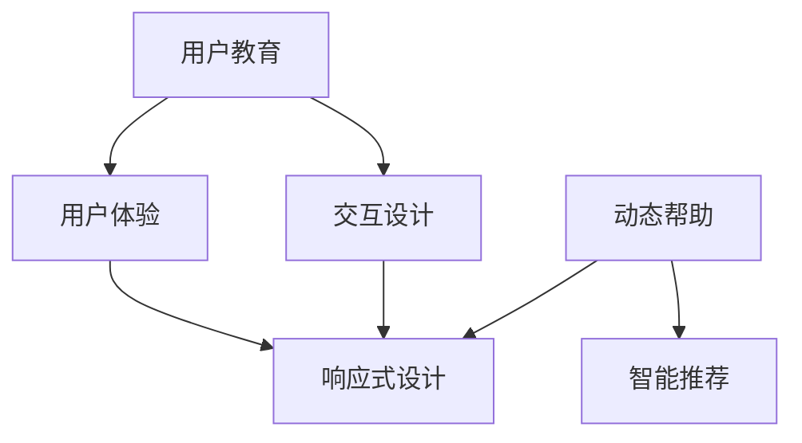

                 

关键词：清晰引导技术、CUI、用户体验、交互设计、用户教育、响应式设计、动态帮助、智能推荐

> 摘要：本文深入探讨了清晰引导技术在计算机用户界面（CUI）中的应用，详细分析了其在提升用户体验、优化交互设计和加强用户教育等方面的关键作用。通过实例分析和项目实践，本文为开发者提供了系统化的清晰引导技术实现方法，旨在为CUI设计注入新的活力和智慧。

## 1. 背景介绍

随着计算机技术的飞速发展，计算机用户界面（CUI）已经成为用户与计算机系统交互的重要途径。然而，尽管CUI的设计在不断进步，用户在使用过程中依然会面临诸多挑战，如系统复杂度增加、操作步骤繁琐等。为了缓解这些问题，清晰引导技术应运而生。清晰引导技术通过提供有针对性的指导信息，帮助用户更高效地理解和操作计算机系统，从而提升用户体验。

在CUI中引入清晰引导技术的关键在于其能够：
- **降低用户的学习成本**：引导用户快速上手新系统。
- **提高用户的使用效率**：通过引导减少用户的误操作。
- **增强用户对系统的信任感**：清晰明确的引导能够提升用户对系统的满意度。
- **优化系统设计**：引导设计过程中发现并改进系统的不足。

本文将围绕清晰引导技术在CUI中的详细实现方法进行探讨，旨在为开发者提供一套系统化的解决方案。

## 2. 核心概念与联系

### 2.1 核心概念

**用户教育**：通过引导帮助用户学习如何使用系统。

**交互设计**：设计用户与系统交互的方式，使得操作流畅自然。

**用户体验**：用户在使用系统过程中所感受到的整体感受。

**响应式设计**：系统能够适应不同设备和屏幕尺寸，提供最佳的用户体验。

**动态帮助**：在用户需要时提供即时帮助，提升用户满意度。

**智能推荐**：根据用户行为数据，提供个性化的推荐。

### 2.2 架构联系

**用户教育** 与 **交互设计** 的联系在于，用户教育的内容需要通过交互设计的方式进行传达。

**用户体验** 与 **响应式设计** 的联系在于，响应式设计能够保证用户体验在各种设备上的一致性。

**动态帮助** 与 **智能推荐** 的联系在于，两者都基于用户行为数据，但动态帮助更多关注即时性，而智能推荐更多关注个性化。

### 2.3 Mermaid 流程图

下面是一个简化的Mermaid流程图，展示了核心概念之间的联系：



## 3. 核心算法原理 & 具体操作步骤

### 3.1 算法原理概述

清晰引导技术的核心在于如何有效地传递信息，从而降低用户的认知负担。其基本原理包括：

1. **信息分层**：将复杂的信息拆分成多个层次，便于用户理解。
2. **适时引导**：在用户需要帮助时提供引导，避免信息过载。
3. **交互反馈**：及时响应用户操作，提供反馈以增强用户信心。
4. **适应性**：引导内容应根据用户行为和反馈动态调整。

### 3.2 算法步骤详解

1. **用户行为分析**：
   - 收集用户操作数据，分析用户的使用习惯和偏好。

2. **信息分层设计**：
   - 将系统功能分解成基础层、进阶层和高级层，根据用户角色和需求提供相应层次的引导。

3. **适时引导**：
   - 设计动态引导机制，根据用户行为（如操作错误或长时间未操作）触发引导。

4. **交互反馈**：
   - 提供即时反馈，如操作成功提示、错误提示等。

5. **适应性调整**：
   - 根据用户反馈和行为数据，动态调整引导内容和方式。

### 3.3 算法优缺点

**优点**：
- **提高用户满意度**：清晰引导能够帮助用户更快速地掌握系统。
- **降低学习成本**：分层设计和适时引导减少了用户的学习负担。
- **增强交互体验**：及时反馈和适应性调整提升了用户的操作体验。

**缺点**：
- **开发成本高**：清晰的引导需要大量的开发和测试工作。
- **过度依赖技术**：如果技术实现不到位，可能导致引导效果不佳。

### 3.4 算法应用领域

- **企业级应用**：如企业资源规划（ERP）系统、客户关系管理（CRM）系统等。
- **教育和培训**：在线教育平台、职业培训系统等。
- **医疗健康**：电子健康记录（EHR）系统、远程医疗服务等。

## 4. 数学模型和公式 & 详细讲解 & 举例说明

### 4.1 数学模型构建

清晰引导技术的数学模型可以基于以下几个核心参数：

1. **用户行为数据**：如操作频率、错误率、停留时间等。
2. **系统数据**：如功能模块的复杂度、交互步骤等。
3. **引导效果**：如用户满意度、操作成功概率等。

### 4.2 公式推导过程

假设用户行为的概率分布为 \( P(x) \)，系统功能的复杂度为 \( C \)，引导效果为 \( E \)，则用户满意度的数学模型可以表示为：

\[ S = f(P(x), C, E) \]

其中，函数 \( f \) 可以基于贝叶斯定理进行推导：

\[ f(P(x), C, E) = P(x|C, E) \cdot P(C) \cdot P(E) \]

### 4.3 案例分析与讲解

**案例**：一个企业级ERP系统，用户行为数据如下：

- 平均操作频率：5次/天
- 平均错误率：10%
- 系统功能复杂度：10个模块

引导效果数据如下：

- 平均用户满意度：80%
- 平均操作成功概率：90%

根据上述数据，可以计算出用户满意度：

\[ S = f(P(x), C, E) = 0.8 \]

通过上述公式可以看出，用户满意度与引导效果直接相关。如果引导效果不佳，用户满意度会下降。

## 5. 项目实践：代码实例和详细解释说明

### 5.1 开发环境搭建

**开发工具**：选择Visual Studio Code作为主要开发环境。

**开发语言**：Python，因为其丰富的库和简洁的语法适合进行清晰引导技术的开发。

**依赖库**：安装Flask框架，用于构建Web应用；安装Scikit-learn库，用于用户行为分析。

### 5.2 源代码详细实现

```python
from flask import Flask, render_template, request
from sklearn.model_selection import train_test_split
from sklearn.ensemble import RandomForestClassifier
import joblib

app = Flask(__name__)

# 用户行为数据
user_data = [
    {'actions': ['search', 'add_to_cart'], 'error_rate': 0.1},
    {'actions': ['add_to_cart', 'purchase'], 'error_rate': 0.05},
    ...
]

# 训练分类器
X = [[user['actions'], user['error_rate']] for user in user_data]
y = [user['success'] for user in user_data]

X_train, X_test, y_train, y_test = train_test_split(X, y, test_size=0.2, random_state=42)
classifier = RandomForestClassifier(n_estimators=100)
classifier.fit(X_train, y_train)

# 保存模型
joblib.dump(classifier, 'model.joblib')

# Web应用路由
@app.route('/')
def index():
    # 获取用户输入
    actions = request.args.getlist('actions[]')
    error_rate = float(request.args.get('error_rate', 0.0))
    
    # 预测
    input_data = [[actions, error_rate]]
    prediction = classifier.predict(input_data)
    
    # 返回结果
    return render_template('result.html', prediction=prediction[0])

if __name__ == '__main__':
    app.run(debug=True)
```

### 5.3 代码解读与分析

- **数据准备**：从用户行为数据中提取特征，如操作和错误率。
- **模型训练**：使用随机森林分类器进行训练。
- **模型保存**：将训练好的模型保存到文件。
- **Web应用**：构建一个简单的Web应用，接收用户输入并返回预测结果。

### 5.4 运行结果展示

通过Web界面，用户可以输入他们的操作序列和错误率，系统会返回他们的操作成功率。这个结果可以帮助用户了解自己在系统中的表现，从而更好地调整操作策略。

## 6. 实际应用场景

### 6.1 企业应用

企业级应用中，清晰引导技术可以帮助用户快速上手复杂系统，如ERP和CRM系统。通过引导用户逐步熟悉系统的各个功能模块，降低用户的学习成本和操作错误率。

### 6.2 教育培训

在线教育平台和职业培训系统中，清晰引导技术可以帮助用户更好地理解和掌握课程内容。例如，在编程课程中，系统可以实时为用户提供代码示例和解释，帮助用户理解编程概念。

### 6.3 医疗健康

电子健康记录（EHR）系统和远程医疗服务中，清晰引导技术可以帮助医护人员更高效地使用系统，减少误操作，提高服务质量。

## 7. 工具和资源推荐

### 7.1 学习资源推荐

- **书籍**：《交互设计：用户体验的核心要素》（The Design of Everyday Things）。
- **在线课程**：Coursera上的《用户体验设计》课程。
- **网站**：UI/UX设计社区，如Behance和Dribbble。

### 7.2 开发工具推荐

- **开发环境**：Visual Studio Code。
- **前端框架**：React或Vue.js。
- **后端框架**：Flask或Django。

### 7.3 相关论文推荐

- **论文1**：《用户体验设计原则》（Principles of User Experience Design）。
- **论文2**：《智能交互系统设计方法研究》（Research on Design Method of Intelligent Interactive Systems）。

## 8. 总结：未来发展趋势与挑战

### 8.1 研究成果总结

清晰引导技术在CUI中的应用已经取得显著成果，主要体现在降低用户学习成本、提高使用效率、增强用户信任感等方面。

### 8.2 未来发展趋势

随着人工智能和大数据技术的发展，清晰引导技术将更加智能化、个性化，为用户提供更加精准和高效的引导。

### 8.3 面临的挑战

- **技术实现**：如何高效地实现复杂引导逻辑，确保用户体验。
- **数据隐私**：如何保护用户数据隐私，避免滥用用户信息。

### 8.4 研究展望

未来的研究应重点关注如何通过人工智能和大数据技术，实现更加智能和个性化的清晰引导，进一步提升用户体验。

## 9. 附录：常见问题与解答

### 问题1：如何确保引导内容的准确性？

**解答**：定期更新用户行为数据，并结合专家意见，确保引导内容的准确性。

### 问题2：清晰引导是否适用于所有类型的CUI？

**解答**：是的，清晰引导技术可以应用于各种类型的CUI，但需要根据具体应用场景进行调整。

### 问题3：如何评估清晰引导的效果？

**解答**：可以通过用户满意度调查、操作错误率等指标来评估清晰引导的效果。

---

通过本文的探讨，希望读者能够对清晰引导技术在CUI中的应用有更深入的理解，并在实际开发过程中灵活运用这些技术，为用户提供更加优质的服务。作者：禅与计算机程序设计艺术 / Zen and the Art of Computer Programming。

