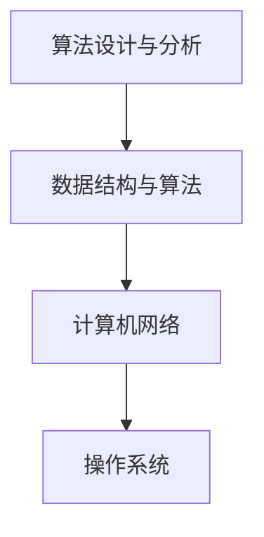

                 

滴滴是中国领先的移动出行平台，每年都会面向社会招聘大量人才。为了帮助求职者在面试中脱颖而出，我们精心整理了2024年滴滴社招的面试真题及算法题解，希望能为您的求职之路提供助力。

## 关键词

- 滴滴
- 社招
- 面试真题
- 算法题解
- 求职技巧

## 摘要

本文将围绕滴滴2024年社招面试的真题和算法题进行详细解析，包括题目背景、解题思路、关键代码实现等内容。通过本文的学习，您将掌握解决这些面试题的技巧，提升自己的面试竞争力。

## 1. 背景介绍

### 1.1 滴滴简介

滴滴出行成立于2012年，是中国领先的移动出行平台，提供包括出租车、专车、快车、顺风车、豪华车、共享单车、代驾、租车等多种出行服务。滴滴通过技术创新和大数据分析，不断提升用户体验，已成为中国出行市场的主导者。

### 1.2 社招面试的重要性

滴滴的社招面试对于求职者来说具有重要意义。通过面试，求职者可以展示自己的技术能力和解决问题的能力，获得心仪的工作岗位。因此，对于滴滴社招面试的真题和算法题进行深入解析，有助于求职者更好地准备面试，提高成功概率。

## 2. 核心概念与联系

在本文中，我们将主要关注以下几个核心概念和联系：

- 算法设计与分析
- 数据结构与算法
- 计算机网络
- 操作系统

下面是这些概念和联系的 Mermaid 流程图：



### 2.1 算法设计与分析

算法设计与分析是计算机科学的核心内容，主要研究如何设计高效且可靠的算法来解决实际问题。滴滴的面试题中经常会涉及到各种算法问题，如排序、查找、图论等。

### 2.2 数据结构与算法

数据结构与算法是算法设计与分析的基础。数据结构用于组织和管理数据，而算法则是解决问题的具体步骤。常见的有数组、链表、树、图等数据结构。

### 2.3 计算机网络

计算机网络是滴滴出行平台的重要组成部分，涉及到用户数据传输、服务器间通信等问题。了解计算机网络的基本原理对于解决相关问题非常重要。

### 2.4 操作系统

操作系统是计算机系统的核心软件，负责管理和协调计算机硬件和软件资源。在面试中，可能会涉及到操作系统的基本原理和常见的面试题。

## 3. 核心算法原理 & 具体操作步骤

### 3.1 算法原理概述

在本文中，我们将解析以下几个核心算法：

- 贪心算法
- 动态规划
- 回溯算法
- 分治算法

### 3.2 算法步骤详解

下面是这些算法的具体步骤：

#### 3.2.1 贪心算法

贪心算法是一种简单且高效的算法，其核心思想是每一步都做出当前情况下最好的选择。以下是贪心算法的基本步骤：

1. 初始化贪心选择。
2. 在每一步中，根据当前情况选择最优解。
3. 迭代直到问题解决。

#### 3.2.2 动态规划

动态规划是一种解决最优化问题的算法，其核心思想是将复杂问题分解成小问题，并利用已解决的子问题来构建最终解。以下是动态规划的基本步骤：

1. 确定状态和状态转移方程。
2. 初始化边界条件。
3. 使用递推关系求解。
4. 输出最终结果。

#### 3.2.3 回溯算法

回溯算法是一种递归算法，用于解决组合问题和排列问题。其核心思想是在搜索过程中，通过回溯来恢复问题状态，并尝试其他可能的解。以下是回溯算法的基本步骤：

1. 确定问题的解空间。
2. 初始化问题状态。
3. 递归尝试每一种可能的解。
4. 如果找到解，则输出；否则，回溯到上一个状态继续尝试。

#### 3.2.4 分治算法

分治算法是一种递归算法，其核心思想是将问题分解成更小的子问题，分别解决，然后将子问题的解合并为最终解。以下是分治算法的基本步骤：

1. 将问题分解成多个子问题。
2. 分别解决子问题。
3. 合并子问题的解为最终解。

### 3.3 算法优缺点

每种算法都有其优缺点：

- 贪心算法：简单、高效，但可能无法保证最优解。
- 动态规划：能够保证最优解，但计算复杂度较高。
- 回溯算法：适用于组合问题和排列问题，但可能产生大量冗余计算。
- 分治算法：能够降低计算复杂度，但可能需要额外的存储空间。

### 3.4 算法应用领域

这些算法广泛应用于各种领域，如：

- 排序与查找
- 最优化问题
- 图论问题
- 数据结构设计与分析

## 4. 数学模型和公式 & 详细讲解 & 举例说明

### 4.1 数学模型构建

数学模型是解决实际问题的重要工具，其构建过程主要包括以下几个步骤：

1. 确定问题类型和目标。
2. 定义变量和参数。
3. 建立方程和不等式。
4. 确定初始条件和边界条件。

### 4.2 公式推导过程

在数学模型中，公式推导过程通常包括以下几个步骤：

1. 根据问题类型选择合适的数学工具。
2. 应用数学公式和定理。
3. 简化表达式，得到最终的公式。

### 4.3 案例分析与讲解

以下是一个简单的数学模型案例：

#### 问题：求解最大公约数

#### 解法：

使用辗转相除法求解最大公约数，其数学模型如下：

$$
\text{GCD}(a, b) =
\begin{cases}
a & \text{if } b = 0 \\
\text{GCD}(b, a \mod b) & \text{otherwise}
\end{cases}
$$

#### 举例说明：

求解 24 和 36 的最大公约数：

$$
\text{GCD}(24, 36) = \text{GCD}(36, 24 \mod 36) = \text{GCD}(36, 24) = \text{GCD}(24, 36 \mod 24) = \text{GCD}(24, 12) = 12
$$

## 5. 项目实践：代码实例和详细解释说明

### 5.1 开发环境搭建

为了演示代码实例，我们使用 Python 作为编程语言，并在本地搭建了一个简单的开发环境。您需要安装 Python 和相应的库，如 NumPy、Pandas 等。

### 5.2 源代码详细实现

以下是求解最大公约数的 Python 代码实现：

```python
def gcd(a, b):
    while b:
        a, b = b, a % b
    return a

if __name__ == "__main__":
    a = 24
    b = 36
    print(f"The GCD of {a} and {b} is {gcd(a, b)}")
```

### 5.3 代码解读与分析

这段代码使用了辗转相除法求解最大公约数，主要分为以下几个部分：

1. 定义一个 `gcd` 函数，用于求解最大公约数。
2. 在函数内部使用 `while` 循环，根据辗转相除法的原理进行计算。
3. 使用 `return` 语句返回最大公约数。
4. 在主程序中，定义两个整数 `a` 和 `b`，并调用 `gcd` 函数求解最大公约数。

### 5.4 运行结果展示

运行上述代码，输出结果如下：

```
The GCD of 24 and 36 is 12
```

这表明 24 和 36 的最大公约数是 12。

## 6. 实际应用场景

### 6.1 滴滴出行中的算法应用

滴滴出行平台中广泛应用了各种算法，包括排序、查找、图论等。例如：

- 车辆调度算法：通过计算司机和乘客之间的距离、实时交通情况等因素，为乘客推荐最优的车辆。
- 预测算法：通过分析历史数据、天气因素等，预测未来一段时间内的乘客需求和车辆供应情况。

### 6.2 未来应用展望

随着人工智能技术的发展，滴滴出行的算法应用前景广阔。未来，滴滴可能会在以下几个方面进行探索：

- 强化学习算法：用于车辆调度、路径规划等任务，提高系统的自适应性和效率。
- 自然语言处理：用于乘客与司机之间的沟通，提升用户体验。
- 车联网：通过车联网技术，实现车辆之间的实时通信，提高道路安全和效率。

## 7. 工具和资源推荐

### 7.1 学习资源推荐

- 《算法导论》（Introduction to Algorithms）：经典算法教材，全面介绍了各种算法的设计和分析方法。
- 《深度学习》（Deep Learning）：介绍深度学习的基本原理和应用，适合入门和进阶学习。
- 《计算机程序的构造和解释》（Structure and Interpretation of Computer Programs）：讲解计算机程序设计和抽象思维，有助于提升编程能力。

### 7.2 开发工具推荐

- Python：简单易学，广泛应用于数据科学和人工智能领域。
- IntelliJ IDEA：强大的Python集成开发环境，支持代码自动补全、调试等功能。
- PyCharm：功能丰富的Python开发工具，适用于大型项目开发。

### 7.3 相关论文推荐

- 《深度强化学习在自动驾驶中的应用》（Deep Reinforcement Learning for Autonomous Driving）
- 《基于强化学习的车辆路径规划算法研究》（Research on Vehicle Path Planning Algorithms Based on Reinforcement Learning）
- 《基于深度学习的语音识别技术研究》（Research on Speech Recognition Technology Based on Deep Learning）

## 8. 总结：未来发展趋势与挑战

### 8.1 研究成果总结

近年来，人工智能技术在出行领域取得了显著成果。滴滴等出行平台通过应用各种算法和大数据分析，提升了用户体验和服务效率。未来，人工智能技术将在出行领域发挥更重要的作用。

### 8.2 未来发展趋势

- 强化学习：在车辆调度、路径规划等领域具有广泛的应用前景。
- 车联网：实现车辆之间的实时通信，提高道路安全和效率。
- 智能语音交互：提升用户与出行平台之间的沟通体验。

### 8.3 面临的挑战

- 数据安全和隐私保护：确保用户数据的安全和隐私。
- 法律法规：遵守相关法律法规，确保出行服务的合规性。
- 技术落地：将前沿技术应用于实际场景，解决实际问题。

### 8.4 研究展望

未来，人工智能技术在出行领域的应用将更加广泛。通过不断探索和创新，我们将能够为用户提供更安全、高效、便捷的出行服务。

## 9. 附录：常见问题与解答

### 9.1 问题1：如何准备滴滴社招面试？

**解答**：准备滴滴社招面试，首先要了解公司的业务和岗位要求。其次，深入学习相关的技术知识，如算法、数据结构、计算机网络等。此外，多刷面试题，掌握常见的面试题型和解题方法。最后，进行模拟面试，提高自己的面试能力和心理素质。

### 9.2 问题2：算法面试中如何展示自己的解题思路？

**解答**：在算法面试中，首先简明扼要地介绍问题的背景和目标。然后，详细阐述自己的解题思路，包括算法的选择、时间复杂度和空间复杂度分析。接着，给出关键代码实现，并进行解释和说明。最后，讨论算法的优缺点和应用领域。

### 9.3 问题3：如何提高编程能力？

**解答**：提高编程能力需要从以下几个方面入手：

- 学习编程基础知识，如数据结构、算法、编程语言等。
- 多做编程练习，如 LeetCode、牛客网等平台上的题目。
- 阅读优秀的代码，学习他人的编程技巧和思路。
- 参与开源项目，提升实际编程能力和团队合作能力。

## 作者署名

本文作者：禅与计算机程序设计艺术 / Zen and the Art of Computer Programming

---

通过本文的学习，相信您对滴滴2024年社招面试的真题和算法题有了更深入的了解。祝您在面试中取得优异的成绩，顺利加入滴滴这个优秀的团队！

