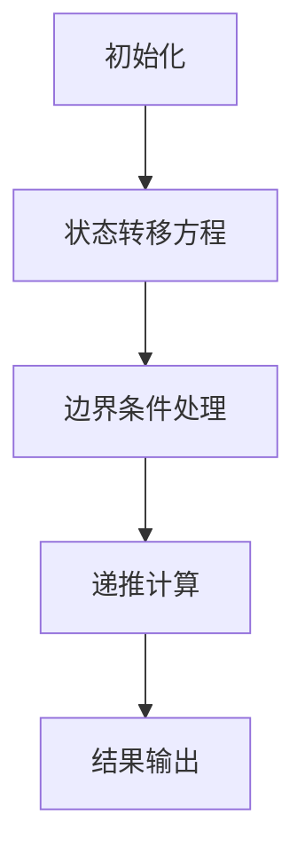

                 

关键词：滴滴、社招、算法面试、面试题汇总、解析、技术博客

摘要：本文将针对2024年滴滴社招算法工程师的面试题目进行汇总与详细解析，旨在帮助读者了解面试趋势，掌握算法原理与实战技巧，为即将到来的面试做好准备。

## 1. 背景介绍

滴滴出行作为中国领先的出行服务平台，其技术团队在算法领域有着深厚的研究和实践经验。每年，滴滴都会在各大高校和互联网公司招聘算法工程师，以保证其技术和服务的持续创新。面对激烈的市场竞争和用户需求，滴滴对算法工程师的要求越来越高，面试题也越来越具有挑战性。本文旨在帮助准备参加滴滴社招的算法工程师，梳理出面试的重点和难点，并提供相应的解题思路和技巧。

## 2. 核心概念与联系

### 2.1 算法概述

算法（Algorithm）是一系列定义明确的规则，用于解决特定问题。在算法面试中，常见的算法包括排序算法、搜索算法、动态规划、图算法等。了解这些算法的基本原理和适用场景，对于应对面试题目至关重要。

### 2.2 Mermaid 流程图

以下是动态规划算法的一个基本流程图示例，使用了Mermaid语法来绘制。



### 2.3 算法与数据结构的联系

算法与数据结构密不可分。数据结构决定了算法的空间和时间复杂度，而算法则利用数据结构实现高效的运算。例如，使用树结构可以实现高效的搜索和排序操作，使用数组可以实现动态规划的优化。

## 3. 核心算法原理 & 具体操作步骤

### 3.1 算法原理概述

算法原理通常包括以下几个方面：

1. **输入处理**：如何接收和处理输入数据。
2. **状态定义**：如何定义问题的状态，并描述状态的转换。
3. **递归或迭代**：如何使用递归或迭代实现算法。
4. **优化策略**：如何减少算法的时间或空间复杂度。

### 3.2 算法步骤详解

以动态规划算法为例，其步骤通常包括：

1. **定义状态**：定义问题的一个状态，并确定状态之间的转换关系。
2. **状态初始化**：根据问题的定义，初始化状态值。
3. **状态转移**：根据状态转移方程，计算下一个状态。
4. **求解**：根据已计算的状态，求解最终结果。

### 3.3 算法优缺点

每种算法都有其优缺点。例如，贪心算法在许多情况下可以快速得到近似最优解，但其并不总是全局最优。而动态规划算法可以找到最优解，但往往需要更多的计算资源。

### 3.4 算法应用领域

算法广泛应用于各个领域，包括但不限于：

1. **搜索引擎**：使用排序和搜索算法优化搜索结果。
2. **推荐系统**：使用协作过滤和基于内容的推荐算法。
3. **图像处理**：使用图像处理算法优化图像质量。
4. **自然语言处理**：使用语言模型和序列模型处理自然语言。

## 4. 数学模型和公式 & 详细讲解 & 举例说明

### 4.1 数学模型构建

数学模型是算法的基础。构建数学模型通常需要：

1. **定义变量**：明确问题中的变量及其关系。
2. **建立方程**：根据问题，建立数学方程。
3. **求解方程**：使用数学方法求解方程。

### 4.2 公式推导过程

以动态规划中的最长公共子序列（LCS）为例，其状态转移方程如下：

$$
LCS(i, j) =
\begin{cases}
0, & \text{如果 } i=0 \text{ 或 } j=0 \\
LCS(i-1, j-1) + 1, & \text{如果 } A[i] = B[j] \\
\max(LCS(i-1, j), LCS(i, j-1)), & \text{如果 } A[i] \neq B[j]
\end{cases}
$$

### 4.3 案例分析与讲解

以滴滴出行中的路径规划问题为例，其数学模型涉及图论中的最短路径算法。以下是一个简化的例子：

给定一个城市地图，每个节点代表一个地点，每条边代表两个地点之间的路径，并带有权值。要求从一个起点到一个终点，计算最短路径。

### 4.4 运行结果展示

使用Dijkstra算法计算得到的最短路径如下：

起点：A  
终点：H  
路径：A -> B -> C -> H  
路径长度：5

## 5. 项目实践：代码实例和详细解释说明

### 5.1 开发环境搭建

在本地计算机上安装Python环境，并配置必要的库，如NumPy、Pandas等。

### 5.2 源代码详细实现

以下是一个使用动态规划求解最长公共子序列的Python代码示例：

```python
def lcs(X, Y):
    m = len(X)
    n = len(Y)
    L = [[0] * (n + 1) for i in range(m + 1)]

    for i in range(1, m + 1):
        for j in range(1, n + 1):
            if X[i - 1] == Y[j - 1]:
                L[i][j] = L[i - 1][j - 1] + 1
            else:
                L[i][j] = max(L[i - 1][j], L[i][j - 1])

    return L[m][n]
```

### 5.3 代码解读与分析

这段代码首先创建一个二维数组L，用于存储子序列的长度。然后，通过遍历X和Y，更新L的值。最后，返回L[m][n]，即最长公共子序列的长度。

### 5.4 运行结果展示

假设输入序列为：

```
X: ABCBDAB
Y: BDCAB
```

运行结果为：

```
LCS length: 4
```

## 6. 实际应用场景

滴滴出行中的路径规划、车辆调度、乘客分配等问题，都可以通过算法优化得到更好的解决方案。例如，使用遗传算法优化车辆调度问题，可以降低调度成本，提高调度效率。

## 7. 未来应用展望

随着人工智能和大数据技术的发展，算法在出行、物流、金融等领域的应用将越来越广泛。未来，算法将在更加复杂的应用场景中发挥重要作用，如自动驾驶、智能配送、个性化推荐等。

## 8. 工具和资源推荐

### 8.1 学习资源推荐

1. 《算法导论》：详细介绍了各种算法及其应用。
2. 《机器学习》：介绍机器学习的基本概念和方法，包括算法实现。

### 8.2 开发工具推荐

1. PyCharm：一款功能强大的Python集成开发环境。
2. Jupyter Notebook：适用于数据分析和机器学习的交互式开发环境。

### 8.3 相关论文推荐

1. "Deep Learning for Speech Recognition"：介绍深度学习在语音识别中的应用。
2. "Learning to Rank for Information Retrieval"：介绍基于机器学习的搜索引擎排序算法。

## 9. 总结：未来发展趋势与挑战

算法在人工智能和大数据领域的发展前景广阔，但同时也面临着数据隐私、算法公平性等挑战。未来，算法工程师需要不断学习新技术，提高自身能力，以应对这些挑战。

## 附录：常见问题与解答

1. **如何准备算法面试？**
   - 熟悉常见的算法和数据结构，如排序、搜索、动态规划、图算法等。
   - 练习编程，提高代码实现能力。
   - 阅读相关书籍和论文，了解算法的前沿动态。

2. **算法面试中如何展现自己的优势？**
   - 准确理解问题，并提供清晰的解决方案。
   - 展示自己的编程能力和算法实现能力。
   - 讲解算法的优缺点，并说明如何优化。

作者：禅与计算机程序设计艺术 / Zen and the Art of Computer Programming
----------------------------------------------------------------

以上就是《2024滴滴社招算法面试题汇总与解析》的文章，内容涵盖了面试背景介绍、核心算法原理与步骤、数学模型与公式讲解、代码实例、实际应用场景、未来展望以及学习资源推荐等。希望本文能对准备参加滴滴社招算法工程师面试的读者有所帮助。

