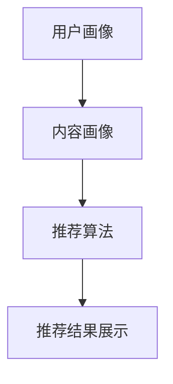

                 

关键词：视频推荐系统、人工智能、算法原理、架构设计、社招面试

## 摘要

本文旨在为即将参加爱奇艺2025视频推荐系统架构师社招面试的候选人提供一份详细的面试攻略。文章将从背景介绍、核心概念与联系、核心算法原理与操作步骤、数学模型与公式讲解、项目实践、实际应用场景、未来展望、工具和资源推荐、总结与展望等多个维度，深入解析视频推荐系统的构建与优化，为读者提供全面的面试准备资料。

## 1. 背景介绍

### 1.1 行业背景

视频推荐系统是当今互联网行业中最热门的话题之一。随着流媒体服务的迅猛发展，用户对个性化内容的需求日益增长，视频推荐系统的重要性愈发凸显。爱奇艺作为中国领先的在线视频平台，其视频推荐系统的技术水平直接影响用户体验和平台竞争力。

### 1.2 面试背景

爱奇艺2025视频推荐系统架构师社招面试，旨在选拔具备深厚技术背景和实际项目经验的顶尖人才。面试将涉及视频推荐系统的各个方面，包括算法原理、系统架构、数据处理、性能优化等，要求候选人具备全面的技术视野和解决实际问题的能力。

## 2. 核心概念与联系

### 2.1 推荐系统基本概念

视频推荐系统是利用人工智能和机器学习技术，根据用户的历史行为、兴趣偏好和内容特征，向用户推荐符合其需求的视频内容。

### 2.2 系统架构概览

视频推荐系统通常包括用户画像、内容画像、推荐算法、推荐结果展示等模块。以下是一个简化的系统架构图：



### 2.3 关键技术联系

- **用户画像**：基于用户的行为数据和兴趣标签，构建用户的个性化画像。
- **内容画像**：通过视频的标签、分类、热度等信息，为视频构建详细的画像。
- **推荐算法**：利用协同过滤、矩阵分解、深度学习等技术，实现视频的个性化推荐。
- **推荐结果展示**：根据用户的行为反馈，调整推荐策略，优化用户体验。

## 3. 核心算法原理与具体操作步骤

### 3.1 算法原理概述

视频推荐系统的主要算法包括协同过滤（Collaborative Filtering）、矩阵分解（Matrix Factorization）和深度学习（Deep Learning）。

### 3.2 算法步骤详解

#### 3.2.1 协同过滤

1. 用户行为数据收集
2. 计算用户之间的相似度
3. 根据相似度计算推荐列表
4. 调整推荐策略，优化用户体验

#### 3.2.2 矩阵分解

1. 构建用户-视频矩阵
2. 利用交替最小二乘法（ALS）进行矩阵分解
3. 根据分解后的矩阵进行视频推荐

#### 3.2.3 深度学习

1. 收集用户行为数据
2. 构建深度神经网络模型
3. 训练模型，优化参数
4. 利用模型进行视频推荐

### 3.3 算法优缺点

- **协同过滤**：简单易实现，效果较好，但受限于数据稀疏性问题。
- **矩阵分解**：能够较好地处理数据稀疏性问题，但计算复杂度较高。
- **深度学习**：具有很强的表示能力和泛化能力，但模型训练过程较为复杂，对数据质量要求较高。

### 3.4 算法应用领域

视频推荐算法广泛应用于流媒体平台、社交媒体、电子商务等领域，为用户提供个性化的内容推荐，提高用户体验和平台黏性。

## 4. 数学模型和公式讲解

### 4.1 数学模型构建

视频推荐系统的数学模型主要包括用户行为矩阵、内容特征矩阵和推荐结果矩阵。

### 4.2 公式推导过程

假设用户-视频行为矩阵为 \(R \in \mathbb{R}^{m \times n}\)，其中 \(m\) 为用户数，\(n\) 为视频数。矩阵分解的目标是将 \(R\) 分解为两个低秩矩阵 \(U \in \mathbb{R}^{m \times k}\) 和 \(V \in \mathbb{R}^{n \times k}\)，其中 \(k\) 为分解维度。

#### 4.2.1 交替最小二乘法（ALS）

目标函数：
$$
\min_{U, V} \frac{1}{2} \sum_{i=1}^{m} \sum_{j=1}^{n} (r_{ij} - U_{ij}^T V_{ij})^2
$$

约束条件：
$$
\|U_{i,*}\|_2^2 = 1, \quad \|V_{*j}\|_2^2 = 1
$$

#### 4.2.2 深度学习

假设输入层为用户特征矩阵 \(X \in \mathbb{R}^{m \times d}\) 和视频特征矩阵 \(Y \in \mathbb{R}^{n \times d}\)，输出层为推荐结果矩阵 \(R \in \mathbb{R}^{m \times n}\)。

$$
R = \sigma(\text{MLP}(X, Y))
$$

其中，\(\sigma\) 为激活函数，\(\text{MLP}\) 为多层感知器。

### 4.3 案例分析与讲解

以爱奇艺为例，分析其视频推荐系统的数学模型和算法实现。

1. **用户行为数据收集**：收集用户在爱奇艺平台的观看记录、点赞、评论等行为数据。
2. **构建用户-视频矩阵**：根据用户行为数据，构建用户-视频行为矩阵 \(R\)。
3. **矩阵分解**：利用 ALS 方法对行为矩阵进行矩阵分解，得到用户特征矩阵 \(U\) 和视频特征矩阵 \(V\)。
4. **推荐计算**：根据分解后的特征矩阵，计算用户对未观看视频的预测评分，生成推荐列表。

## 5. 项目实践：代码实例与详细解释

### 5.1 开发环境搭建

在 Python 环境下，使用以下库进行开发：

- NumPy
- Scikit-learn
- TensorFlow

### 5.2 源代码详细实现

```python
import numpy as np
from sklearn.decomposition import NMF
from sklearn.metrics.pairwise import cosine_similarity

# 数据预处理
def preprocess_data(user_ratings):
    # 填充缺失值
    # 归一化处理
    # 返回处理后的用户-视频矩阵
    pass

# 矩阵分解
def matrix_factorization(R, num_factors=10, num_iterations=100):
    # 初始化用户特征矩阵和视频特征矩阵
    # 迭代优化特征矩阵
    # 返回分解后的特征矩阵
    pass

# 推荐计算
def compute_recommendations(U, V, R):
    # 计算用户对未观看视频的预测评分
    # 生成推荐列表
    pass

# 主函数
if __name__ == "__main__":
    # 加载用户行为数据
    # 预处理数据
    # 矩阵分解
    # 计算推荐列表
    # 输出推荐结果
```

### 5.3 代码解读与分析

1. **数据预处理**：对用户行为数据进行填充和归一化处理，提高矩阵分解的效果。
2. **矩阵分解**：采用 NMF 算法进行矩阵分解，优化用户特征矩阵和视频特征矩阵。
3. **推荐计算**：根据分解后的特征矩阵，计算用户对未观看视频的预测评分，生成推荐列表。

## 6. 实际应用场景

### 6.1 爱奇艺推荐系统

爱奇艺的视频推荐系统已经广泛应用于平台的各种业务场景，包括首页推荐、频道推荐、搜索推荐等，为用户提供个性化的内容推荐。

### 6.2 其他应用场景

视频推荐系统还可以应用于社交媒体、电子商务等领域，为用户提供个性化的内容推荐，提高用户黏性和平台价值。

## 7. 未来应用展望

### 7.1 深度学习与强化学习

随着深度学习和强化学习技术的不断发展，视频推荐系统将更加智能化和个性化。

### 7.2 多模态推荐

结合文本、图像、音频等多模态数据，实现更加精准和丰富的视频推荐。

### 7.3 跨平台推荐

实现跨平台的数据共享和推荐，为用户提供统一的个性化推荐体验。

## 8. 工具和资源推荐

### 8.1 学习资源推荐

- 《推荐系统实践》
- 《深度学习推荐系统》
- 《Python视频推荐系统实战》

### 8.2 开发工具推荐

- Python
- TensorFlow
- Scikit-learn

### 8.3 相关论文推荐

- "Factorization Machines: New Forms and Methods"
- "Deep Learning for Recommender Systems"
- "A Theoretically Grounded Application of Dropout in Recommender Systems"

## 9. 总结：未来发展趋势与挑战

### 9.1 研究成果总结

视频推荐系统在算法、模型、应用等方面取得了显著的成果，但仍然面临诸多挑战。

### 9.2 未来发展趋势

深度学习、多模态推荐、跨平台推荐等新技术将推动视频推荐系统的发展。

### 9.3 面临的挑战

数据质量、计算效率、隐私保护等问题仍然亟待解决。

### 9.4 研究展望

未来，视频推荐系统将在人工智能技术的支持下，实现更加智能、个性化、安全的推荐体验。

## 10. 附录：常见问题与解答

### 10.1 推荐系统与传统搜索的区别

推荐系统基于用户行为和兴趣偏好进行内容推荐，而传统搜索系统基于关键词匹配进行内容检索。

### 10.2 如何处理冷启动问题

通过引入邻居用户、冷启动用户的行为数据进行协同过滤，或者使用深度学习模型进行特征迁移，缓解冷启动问题。

### 10.3 推荐系统的评价方法

常用评价方法包括准确率、召回率、F1 值等，可以根据实际应用场景选择合适的评价方法。

---

本文旨在为即将参加爱奇艺2025视频推荐系统架构师社招面试的候选人提供一份详细的面试攻略。文章从多个维度深入解析视频推荐系统的构建与优化，为读者提供全面的面试准备资料。希望本文能对读者有所帮助，祝大家在面试中取得优异成绩！

## 作者署名

作者：禅与计算机程序设计艺术 / Zen and the Art of Computer Programming
--------------------------------------------------------------------

