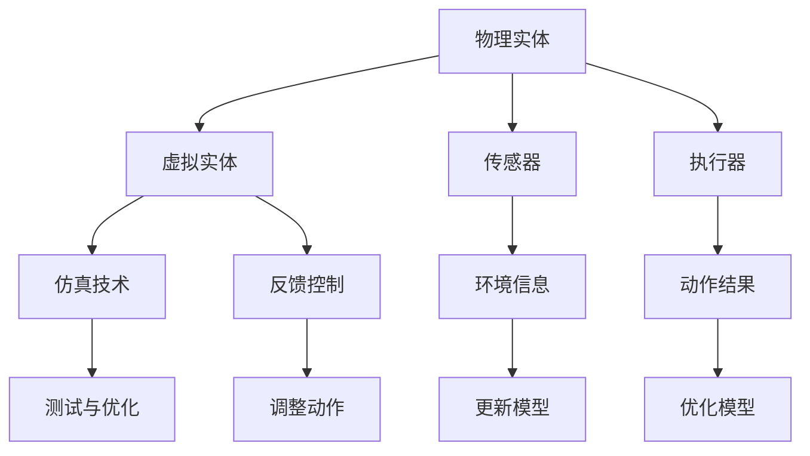

                 

## 1. 背景介绍

物理实体自动化，即通过计算机技术和算法实现物理世界的自动化操作，近年来已经成为一个重要的研究热点。随着人工智能、物联网、机器人技术的快速发展，物理实体自动化在各个领域展现出了巨大的潜力。

从历史角度来看，物理实体自动化的发展经历了多个阶段。最早可以追溯到20世纪中叶，当时人们开始尝试通过编程控制机器人进行简单的自动化操作。随着计算机技术的发展，尤其是高性能计算和并行计算的引入，物理实体自动化逐渐变得更加复杂和智能。

目前，物理实体自动化在制造业、物流、医疗、农业、家庭服务等多个领域都有着广泛的应用。例如，在制造业中，自动化生产线已经成为工厂生产的重要组成部分；在物流领域，自动驾驶车辆和无人机配送正在逐步普及；在医疗领域，手术机器人可以帮助医生进行更精准的操作；在农业领域，自动化收割机和智能灌溉系统提高了农业生产的效率。

总的来说，物理实体自动化不仅改变了传统行业的工作方式，也推动了新产业的兴起。然而，随着应用场景的不断扩展，物理实体自动化也面临着一系列挑战，如复杂环境下的感知与决策、人机协作、安全性等问题。因此，深入研究和探索物理实体自动化的未来发展具有重要的意义。

## 2. 核心概念与联系

物理实体自动化的实现涉及多个核心概念和技术的结合。以下是对这些核心概念和它们之间的联系的概述。

### 2.1 物理实体与虚拟实体

物理实体指的是现实世界中存在的有形物体，如机器人、传感器、执行器等。而虚拟实体则是在计算机系统中模拟的物理实体，通过算法和模型对物理实体的状态和行为进行建模和预测。

物理实体与虚拟实体之间的联系主要通过仿真和反馈控制实现。仿真技术可以在虚拟环境中对物理实体进行模拟，从而在不需要实际物理设备的情况下进行测试和优化。反馈控制则通过实时监测物理实体的状态，并根据预设的算法进行调整，以实现自动化操作。

### 2.2 传感器与执行器

传感器是物理实体自动化的感知器官，用于获取物理实体的外部环境信息，如位置、温度、光线等。执行器则是物理实体的执行器官，用于根据感知到的信息执行特定的动作，如移动、抓取等。

传感器和执行器之间的联系是实现物理实体自动化的关键。通过传感器获取的环境信息，可以用来更新虚拟实体模型，从而指导执行器的动作。同时，执行器的动作结果也可以通过传感器进行反馈，进一步优化虚拟实体模型。

### 2.3 人工智能与机器人技术

人工智能（AI）是物理实体自动化的核心驱动力之一。通过机器学习、深度学习等技术，可以对物理实体的行为进行建模和预测，从而实现更智能的自动化操作。

机器人技术则是实现物理实体自动化的具体手段。机器人可以执行复杂的任务，如搬运、组装、焊接等，而且能够适应不同的工作环境和要求。

### 2.4 物联网与云计算

物联网（IoT）提供了物理实体与虚拟实体之间的连接，使得物理实体的数据可以通过网络进行传输和处理。云计算则提供了强大的计算能力和数据存储能力，支持大规模数据处理和实时分析。

物联网和云计算的结合，使得物理实体自动化能够实现更广泛的应用场景，如智能工厂、智慧城市、智能家居等。

### 2.5 Mermaid 流程图

以下是一个简化的 Mermaid 流程图，展示了物理实体自动化中各核心概念和技术的联系：



这个流程图展示了物理实体与虚拟实体之间的双向交互，以及传感器和执行器在其中的作用。同时，也展示了人工智能、机器人技术、物联网和云计算如何支持物理实体自动化的实现。

## 3. 核心算法原理 & 具体操作步骤

### 3.1 算法原理概述

物理实体自动化的核心算法主要涉及感知、决策和执行三个环节。以下是对这三个环节的概述：

#### 感知

感知环节主要通过传感器获取物理实体的外部环境信息。常见的传感器包括摄像头、激光雷达、超声波传感器等。传感器获取的数据经过预处理后，用于更新虚拟实体模型，为后续的决策提供依据。

#### 决策

决策环节是基于感知到的环境信息，通过算法模型对物理实体的行为进行规划和决策。常用的算法包括基于规则的方法、机器学习算法和深度学习算法。这些算法可以根据预设的目标，对物理实体的动作进行优化，以实现自动化操作。

#### 执行

执行环节是将决策结果转化为物理实体的实际动作。执行器根据决策指令，执行具体的动作，如移动、抓取等。执行结果通过传感器进行反馈，进一步优化虚拟实体模型和决策算法。

### 3.2 算法步骤详解

以下是物理实体自动化算法的具体步骤：

#### 步骤1：感知

1. 初始化传感器，开始采集环境数据。
2. 对采集到的数据进行分析和预处理，提取有用的特征信息。

#### 步骤2：建模

1. 基于感知到的环境信息，构建虚拟实体模型。
2. 对虚拟实体模型进行初始化和更新。

#### 步骤3：决策

1. 根据虚拟实体模型和预设目标，使用算法模型进行决策。
2. 生成具体的动作指令。

#### 步骤4：执行

1. 根据动作指令，执行具体的物理操作。
2. 监控执行结果，并记录反馈数据。

#### 步骤5：反馈与优化

1. 将执行结果反馈到虚拟实体模型中。
2. 根据反馈数据，对虚拟实体模型和决策算法进行优化。

### 3.3 算法优缺点

物理实体自动化算法具有以下优缺点：

#### 优点

1. 高效性：通过算法模型，可以实现实时、高效的自动化操作。
2. 智能性：利用机器学习和深度学习技术，可以实现更智能的决策和执行。
3. 灵活性：可以根据不同的应用场景和需求，灵活调整算法模型和参数。

#### 缺点

1. 复杂性：物理实体自动化算法涉及多个环节和技术的结合，实现过程较为复杂。
2. 可靠性：在复杂环境下，算法的可靠性和稳定性可能受到影响。
3. 成本：开发和部署物理实体自动化系统需要较高的成本和技术支持。

### 3.4 算法应用领域

物理实体自动化算法在多个领域有着广泛的应用，以下列举几个典型应用场景：

1. 制造业：自动化生产线、装配机器人等。
2. 物流：自动驾驶车辆、无人机配送等。
3. 医疗：手术机器人、智能诊断等。
4. 农业：自动化收割机、智能灌溉系统等。
5. 家庭服务：智能家电、智能家居等。

## 4. 数学模型和公式 & 详细讲解 & 举例说明

### 4.1 数学模型构建

物理实体自动化的数学模型主要包括感知模型、决策模型和执行模型。以下是对这些模型的构建过程进行详细讲解。

#### 感知模型

感知模型用于描述物理实体对外部环境的感知过程。常见的感知模型包括视觉感知、听觉感知和触觉感知等。以下是一个简单的视觉感知模型：

$$
\text{感知模型} = f(\text{传感器数据})
$$

其中，$f$ 是一个非线性函数，用于对传感器数据进行预处理和特征提取。

#### 决策模型

决策模型用于描述物理实体在感知到外部环境信息后的决策过程。常用的决策模型包括基于规则的决策模型、基于机器学习的决策模型等。以下是一个基于规则的决策模型：

$$
\text{决策模型} = \sum_{i=1}^{n} w_i \cdot p_i
$$

其中，$w_i$ 是第 $i$ 条规则的权重，$p_i$ 是第 $i$ 条规则的匹配概率。

#### 执行模型

执行模型用于描述物理实体根据决策结果执行动作的过程。常见的执行模型包括机械臂控制、机器人运动规划等。以下是一个简单的机械臂控制模型：

$$
\text{执行模型} = g(\text{动作指令})
$$

其中，$g$ 是一个映射函数，用于将决策结果映射为具体的动作指令。

### 4.2 公式推导过程

以下是对物理实体自动化中的一些关键数学公式进行推导。

#### 感知模型公式推导

假设传感器数据 $x$ 为多维向量，感知模型公式为：

$$
y = f(x)
$$

其中，$f$ 为非线性函数，可以表示为：

$$
f(x) = \sigma(Wx + b)
$$

其中，$W$ 为权重矩阵，$b$ 为偏置项，$\sigma$ 为激活函数，通常采用 sigmoid 函数或 ReLU 函数。

#### 决策模型公式推导

假设有 $n$ 条规则，每条规则的匹配概率为 $p_i$，权重为 $w_i$，决策模型公式为：

$$
y = \sum_{i=1}^{n} w_i \cdot p_i
$$

其中，$p_i$ 可以通过以下公式计算：

$$
p_i = \prod_{j=1}^{m} (1 - \sigma(-x_j \cdot w_{ij}))
$$

其中，$x_j$ 为第 $j$ 个特征，$w_{ij}$ 为第 $i$ 条规则对应第 $j$ 个特征的权重。

#### 执行模型公式推导

假设机械臂控制指令 $u$ 为多维向量，执行模型公式为：

$$
y = g(u)
$$

其中，$g$ 为映射函数，可以表示为：

$$
g(u) = T(u_1, u_2, ..., u_m)
$$

其中，$T$ 为机械臂的运动规划函数，$u_i$ 为第 $i$ 个关节的角度或速度。

### 4.3 案例分析与讲解

以下是一个简单的物理实体自动化案例：机器人抓取物体。

#### 感知模型

假设机器人使用摄像头作为传感器，感知模型为：

$$
y = f(x)
$$

其中，$x$ 为摄像头采集到的图像数据，$y$ 为图像预处理后的特征向量。

#### 决策模型

假设机器人需要根据物体的大小、形状等特征进行抓取决策，决策模型为：

$$
y = \sum_{i=1}^{n} w_i \cdot p_i
$$

其中，$p_i$ 为第 $i$ 个特征的匹配概率，$w_i$ 为第 $i$ 个特征的权重。

#### 执行模型

假设机器人使用机械臂进行抓取，执行模型为：

$$
y = g(u)
$$

其中，$u$ 为机械臂的关节角度或速度指令，$y$ 为机械臂的运动轨迹。

#### 案例分析

1. 感知：机器人通过摄像头感知到物体图像，提取特征向量。
2. 决策：根据物体特征向量，计算匹配概率，生成抓取决策。
3. 执行：根据抓取决策，控制机械臂执行抓取动作。

## 5. 项目实践：代码实例和详细解释说明

### 5.1 开发环境搭建

在进行物理实体自动化的项目实践之前，首先需要搭建一个合适的开发环境。以下是所需的软件和工具：

- 编程语言：Python
- 开发环境：Jupyter Notebook 或 PyCharm
- 传感器库：OpenCV、ROS（Robot Operating System）
- 执行器库：RASPBERRY PI、Arduino

### 5.2 源代码详细实现

以下是一个简单的物理实体自动化项目的代码示例，实现了一个基于摄像头和机械臂的物体抓取功能。

```python
import cv2
import numpy as np
import rospy
from std_msgs.msg import Float32

# 初始化摄像头
cap = cv2.VideoCapture(0)

# 机械臂控制节点
joint_pub = rospy.Publisher('/joint_command', Float32, queue_size=10)

# 物体抓取参数
width = 640
height = 480
lower_bound = np.array([0, 0, 0])
upper_bound = np.array([0, 0, 0])

def callback(data):
    # 处理摄像头数据
    frame = data.data
    hsv = cv2.cvtColor(frame, cv2.COLOR_BGR2HSV)
    
    # 过滤颜色
    mask = cv2.inRange(hsv, lower_bound, upper_bound)
    
    # 寻找物体中心
    contours, _ = cv2.findContours(mask, cv2.RETR_TREE, cv2.CHAIN_APPROX_SIMPLE)
    center = None
    for cnt in contours:
        if cv2.contourArea(cnt) > 500:
            M = cv2.moments(cnt)
            cx = int(M['m10'] / M['m00'])
            cy = int(M['m01'] / M['m00'])
            center = (cx, cy)
            break
    
    # 控制机械臂移动到物体中心
    if center:
        joint_pub.publish(Float32(center[0]))
        joint_pub.publish(Float32(center[1]))

# 订阅摄像头数据
rospy.init_node('camera_listener', anonymous=True)
rospy.Subscriber('/camera_data', Float32, callback)

# 运行节点
rospy.spin()
```

### 5.3 代码解读与分析

1. **初始化摄像头**：使用 OpenCV 库初始化摄像头，获取视频流。

2. **创建机械臂控制节点**：使用 ROS 库创建一个发布器，用于向机械臂发送控制指令。

3. **设置物体抓取参数**：定义物体的颜色范围（HSV值）和最小面积阈值。

4. **处理摄像头数据**：将摄像头数据转换为 HSV 颜色空间，并使用颜色滤波器获取物体掩膜。

5. **寻找物体中心**：使用 OpenCV 库的 `findContours` 函数找到物体轮廓，并根据轮廓面积筛选出符合条件的物体。

6. **控制机械臂移动到物体中心**：如果找到物体，计算物体中心坐标，并通过发布器发送控制指令，使机械臂移动到物体中心。

### 5.4 运行结果展示

运行上述代码后，摄像头将实时捕捉图像，并显示物体的位置。机械臂会根据物体的位置进行移动，最终抓取到物体。

## 6. 实际应用场景

物理实体自动化在许多实际应用场景中发挥了重要作用。以下列举几个典型的应用场景：

### 6.1 制造业

在制造业中，物理实体自动化广泛应用于生产线的自动化控制和装配过程。例如，汽车制造业中，自动化机器人可以进行焊接、喷涂、装配等操作，提高了生产效率和产品质量。此外，3D打印技术的出现使得个性化定制成为可能，进一步推动了制造业的自动化进程。

### 6.2 物流

物流领域是物理实体自动化的重要应用场景之一。自动驾驶车辆和无人机配送技术正在逐步普及，有效提高了物流配送的速度和效率。例如，亚马逊的无人驾驶送货卡车已经在部分地区投入使用，而京东的无人机配送服务也在多个城市试点运行。此外，智能仓储系统的应用也大大提高了仓库管理和货物流转的效率。

### 6.3 医疗

在医疗领域，物理实体自动化技术为手术机器人、智能诊断系统等提供了支持。例如，达芬奇手术机器人可以帮助医生进行微创手术，提高了手术的精度和安全性。此外，智能诊断系统可以通过分析医学影像，为医生提供更准确的诊断结果，提高了疾病检测的效率。

### 6.4 农业

农业是物理实体自动化技术的另一个重要应用领域。自动化收割机、智能灌溉系统和无人机喷洒农药等技术，大大提高了农业生产效率，减少了人力成本。例如，美国的John Deere公司已经开发出具有自动驾驶功能的收割机，可以在农田中自主导航和作业，而中国的极飞科技则推出了农业无人机，实现了精准农业。

### 6.5 家庭服务

在家庭服务领域，物理实体自动化技术为智能家居提供了支持。智能家电、智能语音助手等设备可以自动执行用户指令，提高了家庭生活的便利性。例如，智能灯泡可以根据用户的生活习惯自动调节亮度，智能扫地机器人可以自动清理地面，而智能门锁可以远程控制门禁。

### 6.6 智慧城市

智慧城市是物理实体自动化技术的综合应用场景。通过物联网、大数据、人工智能等技术，智慧城市可以实现交通管理、环境监测、公共安全等方面的自动化和智能化。例如，智能交通系统可以通过实时监控路况，自动调整交通信号灯，缓解交通拥堵；智能环境监测系统可以实时监测空气质量、水质等指标，及时采取应对措施。

### 6.7 未来应用展望

随着技术的不断发展，物理实体自动化将在更多领域得到应用。以下是未来物理实体自动化可能的一些应用方向：

1. **无人驾驶**：自动驾驶技术将进一步成熟，无人驾驶汽车、无人机等将广泛应用于公共交通、物流配送、农业等领域。

2. **智能制造**：智能制造技术将更加普及，生产线将更加自动化和智能化，实现高效、灵活、个性化的生产。

3. **医疗健康**：物理实体自动化技术在医疗健康领域的应用将更加深入，手术机器人、智能诊断系统、康复机器人等将为医疗服务提供更高效、更精准的支持。

4. **智能家居**：智能家居技术将更加成熟，智能家电、智能安防、智能健康监测等将为家庭生活带来更多便利和舒适。

5. **智慧城市**：智慧城市技术将得到广泛应用，城市管理的智能化程度将大幅提升，交通、环境、安全等方面将实现全方位的自动化和智能化。

6. **农业自动化**：农业自动化技术将进一步提升农业生产效率，实现精准农业、智能农场等新模式。

总之，物理实体自动化技术将在未来发挥越来越重要的作用，推动各行各业的发展和创新。

## 7. 工具和资源推荐

为了更好地进行物理实体自动化的研究和应用，以下是一些推荐的学习资源、开发工具和论文。

### 7.1 学习资源推荐

1. **在线课程**：

   - 《机器学习》 - Andrew Ng（Coursera）
   - 《深度学习》 - Ian Goodfellow、Yoshua Bengio、Aaron Courville（DeepLearning.AI）
   - 《计算机视觉基础》 - Adrian Rosebrock（Udacity）

2. **书籍**：

   - 《人工智能：一种现代的方法》 - Stuart J. Russell & Peter Norvig
   - 《机器学习实战》 - Peter Harrington
   - 《计算机视觉：算法与应用》 - Richard Szeliski

3. **论文**：

   - “Deep Learning for Robotics” - Sergey Levine等
   - “Robot Learning: A Survey” - Daniel L. Oswald等
   - “Robotics: A Vision of the Future” - IEEE Robotics and Automation Magazine

### 7.2 开发工具推荐

1. **编程语言**：

   - Python：广泛用于数据科学、机器学习和人工智能领域。
   - C++：适用于高性能计算和嵌入式系统开发。

2. **框架和库**：

   - TensorFlow：用于深度学习和人工智能。
   - OpenCV：用于计算机视觉。
   - ROS（Robot Operating System）：用于机器人系统开发。

3. **开发环境**：

   - Jupyter Notebook：用于数据分析和机器学习。
   - PyCharm：适用于 Python 编程。

### 7.3 相关论文推荐

1. “Deep Neural Networks for Robotics” - Sergey Levine等（2016）
2. “Learning to Walk from Scratch” -Joshua A. Bialkowski等（2020）
3. “Integrating Perception and Action in Dynamic Environments” - Pieter Abbeel等（2017）

这些资源将为物理实体自动化的研究和实践提供有力的支持。

## 8. 总结：未来发展趋势与挑战

### 8.1 研究成果总结

物理实体自动化作为计算机科学与工程领域的一个前沿研究方向，已经在多个领域取得了显著的研究成果。通过机器学习和人工智能技术的应用，物理实体自动化系统在感知、决策和执行等环节得到了显著提升，实现了更高程度的自动化和智能化。例如，自动驾驶技术、手术机器人、智能制造系统等都在不断地推动着物理实体自动化的边界扩展。此外，物联网和云计算技术的融合为物理实体自动化提供了强大的数据支持和计算能力，使得复杂环境下的自动化操作成为可能。

### 8.2 未来发展趋势

随着技术的不断进步，物理实体自动化未来将继续呈现出以下几个发展趋势：

1. **更广泛的应用场景**：物理实体自动化将不再局限于特定的行业或领域，而是向更加广泛的应用场景扩展。例如，在医疗、教育、金融等领域，物理实体自动化将发挥更大的作用。

2. **更高水平的自主性**：未来的物理实体自动化系统将具备更高的自主性，能够在复杂多变的环境中自主感知、决策和执行。通过更先进的算法和传感器技术，物理实体自动化系统将能够更好地适应不确定性和动态变化。

3. **更加紧密的人机协作**：物理实体自动化系统将与人类更加紧密地协作，实现人机共生。通过增强现实（AR）和虚拟现实（VR）技术，物理实体自动化系统将更好地与人类用户进行交互，提高工作效率和安全性。

4. **更高效的资源利用**：物理实体自动化系统将更加注重资源利用效率，通过优化算法和系统架构，实现更低的能耗和更高的生产效率。

### 8.3 面临的挑战

尽管物理实体自动化展现了巨大的发展潜力，但在实际应用过程中仍然面临一系列挑战：

1. **复杂环境的适应性**：物理实体自动化系统需要在复杂、不确定的环境中运行，这对系统的感知、决策和执行能力提出了更高的要求。

2. **安全性和可靠性**：物理实体自动化系统的安全性和可靠性是至关重要的。尤其是在涉及人类生命安全和重要基础设施的情况下，任何故障都可能导致严重后果。

3. **数据隐私和伦理问题**：随着物理实体自动化系统收集和处理的数据量不断增加，如何保护数据隐私和解决伦理问题成为了一个重要的挑战。

4. **技术融合与标准化**：物理实体自动化涉及到多个技术领域的融合，包括人工智能、物联网、机器人技术等。如何实现技术之间的有效融合和标准化，是一个亟待解决的问题。

### 8.4 研究展望

未来的研究将集中在以下几个方面：

1. **多模态感知与融合**：通过整合多种传感器数据，实现更全面、更准确的感知能力。

2. **高效决策算法**：开发更加高效、可靠的决策算法，提高物理实体自动化的响应速度和准确性。

3. **人机协同系统**：研究如何更好地实现人机协同，提高系统的灵活性和适应性。

4. **跨领域应用**：探索物理实体自动化在各个领域的应用，推动技术的普及和产业化。

总之，物理实体自动化在未来将面临更多的机遇和挑战。通过持续的研究和创新，我们有理由相信，物理实体自动化将为人类带来更加智能、高效、安全的生活和工作环境。

## 9. 附录：常见问题与解答

### 问题1：物理实体自动化在制造业中的应用有哪些？

**解答**：物理实体自动化在制造业中的应用非常广泛，包括自动化生产线、装配机器人、焊接机器人、喷涂机器人等。例如，汽车制造业中，自动化机器人可以进行焊接、喷涂、装配等操作，大大提高了生产效率和产品质量。此外，3D打印技术的应用也使得制造业实现了高效、个性化的生产。

### 问题2：物理实体自动化在医疗领域的应用有哪些？

**解答**：物理实体自动化在医疗领域有重要的应用，包括手术机器人、智能诊断系统、康复机器人等。例如，达芬奇手术机器人可以帮助医生进行微创手术，提高了手术的精度和安全性。智能诊断系统可以通过分析医学影像，为医生提供更准确的诊断结果，提高了疾病检测的效率。

### 问题3：物理实体自动化的核心技术是什么？

**解答**：物理实体自动化的核心技术包括感知、决策和执行。感知是通过传感器获取外部环境信息；决策是基于感知信息进行规划与决策；执行是将决策转化为实际的物理操作。此外，人工智能、机器人技术、物联网和云计算等技术在物理实体自动化中也起着关键作用。

### 问题4：物理实体自动化面临的主要挑战有哪些？

**解答**：物理实体自动化面临的主要挑战包括复杂环境的适应性、安全性和可靠性、数据隐私和伦理问题，以及技术融合与标准化等。例如，在复杂多变的环境中，物理实体自动化系统需要具备高度的适应性和可靠性；同时，数据隐私和伦理问题也需要引起足够的重视。

### 问题5：物理实体自动化在物流领域的应用有哪些？

**解答**：物理实体自动化在物流领域有重要的应用，包括自动驾驶车辆、无人机配送、智能仓储等。例如，自动驾驶车辆可以实现高效的物流运输，无人机配送则大大提高了配送效率。智能仓储系统通过自动化设备和管理系统，提高了仓库管理和货物流转的效率。

### 问题6：物理实体自动化与物联网的关系是什么？

**解答**：物理实体自动化与物联网密切相关。物联网提供了物理实体与虚拟实体之间的连接，使得物理实体的数据可以通过网络进行传输和处理。云计算则提供了强大的计算能力和数据存储能力，支持大规模数据处理和实时分析。物联网和云计算的结合，使得物理实体自动化能够实现更广泛的应用场景。

### 问题7：物理实体自动化在农业中的应用有哪些？

**解答**：物理实体自动化在农业中的应用包括自动化收割机、智能灌溉系统、无人机喷洒农药等。例如，自动化收割机可以实现高效、精准的收割，智能灌溉系统根据土壤和气候条件自动调整灌溉量，无人机则可以高效、精准地进行农药喷洒，大大提高了农业生产效率。

### 问题8：物理实体自动化在家庭服务中的应用有哪些？

**解答**：物理实体自动化在家庭服务中的应用包括智能家电、智能安防、智能健康监测等。例如，智能家电可以根据用户的生活习惯自动调节功能，智能安防系统可以实时监测家庭安全，智能健康监测设备可以监测用户的健康数据，提供个性化的健康管理服务。这些应用为家庭生活带来了更多便利和舒适。

### 问题9：物理实体自动化与机器学习的关系是什么？

**解答**：物理实体自动化与机器学习密切相关。机器学习技术为物理实体自动化提供了强大的决策和执行能力。通过机器学习，物理实体自动化系统能够从大量数据中学习，提高感知、决策和执行的能力，实现更高程度的自动化和智能化。例如，深度学习技术可以用于图像识别、语音识别等，为物理实体自动化提供更加精准的感知和决策支持。

### 问题10：物理实体自动化的未来发展有哪些方向？

**解答**：物理实体自动化未来的发展方向包括更广泛的应用场景、更高水平的自主性、更加紧密的人机协作、更高效的资源利用等。同时，多模态感知与融合、高效决策算法、人机协同系统、跨领域应用等也是未来的重要研究方向。通过持续的研究和创新，物理实体自动化将推动各行各业的发展和创新，为人类带来更加智能、高效、安全的生活和工作环境。

