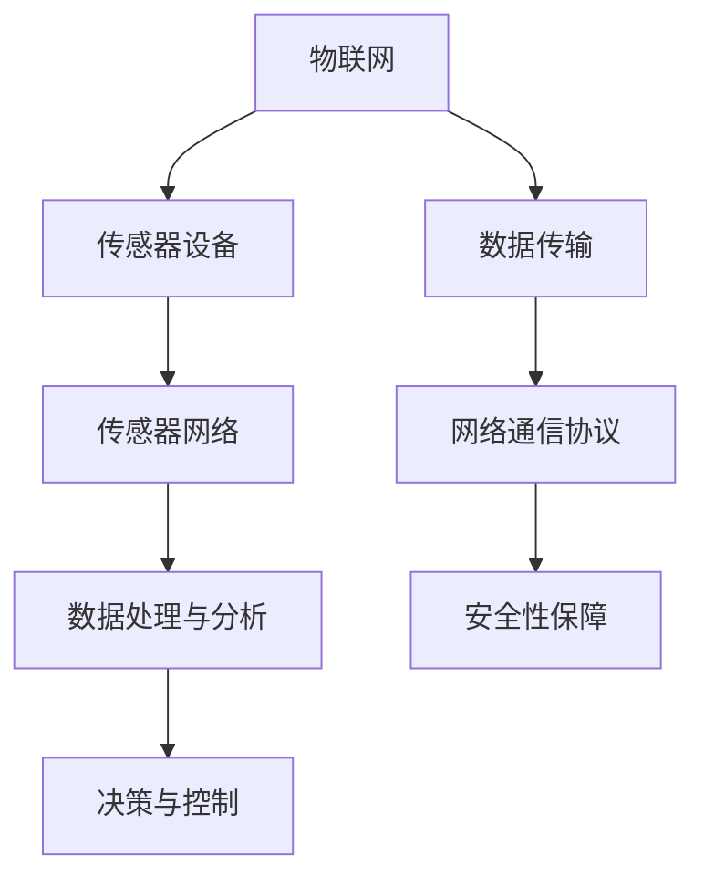

                 

关键词：物联网、传感器网络、传感器集成、设计优化、智能设备、大数据分析

> 摘要：本文探讨了物联网（IoT）技术的发展及其与传感器设备的集成，分析了传感器网络的设计原则与优化策略。通过阐述核心概念、算法原理、数学模型、项目实践等多个方面，本文旨在为物联网技术应用提供理论指导和实践参考。

## 1. 背景介绍

随着科技的快速发展，物联网（IoT）已经成为当今社会的重要趋势。物联网指的是通过互联网将各种物理设备、智能终端和系统连接起来，实现数据交换和智能化管理。传感器设备作为物联网的关键组成部分，起着数据采集和传输的重要作用。

物联网技术的广泛应用带来了丰富的数据资源，同时也对传感器网络的设计与优化提出了更高的要求。传感器网络的设计原则和优化策略的探讨，对于提升物联网系统的整体性能具有重要意义。

## 2. 核心概念与联系

### 2.1 物联网（IoT）

物联网是指通过互联网将物理设备、传感器、人机交互系统连接起来，实现信息交换和协同工作的一种技术。物联网的核心思想是通过智能设备实现人与物、物与物的无缝连接，从而实现更高效、智能、便捷的生活和工作。

### 2.2 传感器设备

传感器设备是物联网系统中的重要组成部分，用于感知环境中的各种物理量，如温度、湿度、压力、光强等。传感器设备通过将物理量转化为电信号，然后将这些信号传输到物联网平台进行进一步处理和分析。

### 2.3 传感器网络

传感器网络是由多个传感器节点组成的分布式系统，用于监测和收集环境数据。传感器节点通常包括传感器模块、处理模块、通信模块和能量供应模块。传感器网络的设计与优化是物联网系统性能的关键因素。

### 2.4 物联网与传感器网络的联系

物联网技术为传感器网络提供了广泛的应用场景和丰富的数据资源，而传感器网络则为物联网系统提供了实时、准确的数据采集和传输。物联网与传感器网络的紧密联系，使得它们在设计和优化过程中需要考虑多个方面的因素，如数据传输效率、节点能耗、网络覆盖范围等。

## 2.5 Mermaid 流程图



## 3. 核心算法原理 & 具体操作步骤

### 3.1 算法原理概述

传感器网络的设计与优化涉及多个核心算法，其中主要包括数据采集与传输算法、能量管理算法和网络拓扑优化算法等。以下将对这些核心算法的原理进行概述。

### 3.2 算法步骤详解

#### 3.2.1 数据采集与传输算法

数据采集与传输算法主要涉及传感器节点的数据采集、数据处理和数据传输过程。具体步骤如下：

1. 数据采集：传感器节点根据监测任务，实时采集环境数据。
2. 数据处理：传感器节点对采集到的数据进行预处理，如滤波、去噪等。
3. 数据传输：传感器节点将处理后的数据传输到物联网平台进行进一步处理和分析。

#### 3.2.2 能量管理算法

能量管理算法旨在延长传感器节点的使用寿命，提高网络整体性能。主要步骤包括：

1. 能量监测：传感器节点监测自身的能量储备情况。
2. 能量分配：根据节点能量储备情况，合理分配能量资源。
3. 能量回收：利用能量回收技术，将无效能量转化为有效能量，延长节点寿命。

#### 3.2.3 网络拓扑优化算法

网络拓扑优化算法用于优化传感器网络的拓扑结构，提高网络性能和稳定性。主要步骤包括：

1. 拓扑监测：监测网络拓扑结构的变化。
2. 拓扑调整：根据网络状态，调整拓扑结构，优化网络性能。
3. 拓扑重建：在网络拓扑发生重大变化时，重建网络拓扑结构。

### 3.3 算法优缺点

数据采集与传输算法优点在于实时性强、数据传输效率高，缺点是节点能耗较高。能量管理算法的优点在于延长节点寿命，缺点是对能量回收技术要求较高。网络拓扑优化算法的优点在于提高网络性能和稳定性，缺点是拓扑调整和重建过程较为复杂。

### 3.4 算法应用领域

数据采集与传输算法广泛应用于环境监测、智能家居、智能交通等领域。能量管理算法在无线传感器网络、物联网等领域有广泛应用。网络拓扑优化算法在智能电网、智能医疗等领域具有重要意义。

## 4. 数学模型和公式 & 详细讲解 & 举例说明

### 4.1 数学模型构建

传感器网络的设计与优化涉及多个数学模型，主要包括能量模型、传输模型和拓扑模型等。以下分别介绍这些数学模型的构建过程。

#### 4.1.1 能量模型

能量模型用于描述传感器节点的能量储备、能量消耗和能量回收过程。能量模型的基本假设如下：

1. 传感器节点的能量来源包括电池、能量收集器和能量回收技术。
2. 传感器节点的能量消耗包括数据采集、数据处理、数据传输和通信等。

能量模型的基本公式如下：

$$
E_{total} = E_{battery} + E_{harvest} + E_{recovery} - E_{consumption}
$$

其中，$E_{total}$表示节点总能量，$E_{battery}$表示电池能量，$E_{harvest}$表示能量收集能量，$E_{recovery}$表示能量回收能量，$E_{consumption}$表示能量消耗。

#### 4.1.2 传输模型

传输模型用于描述传感器节点之间的数据传输过程。传输模型的基本假设如下：

1. 传感器节点之间的数据传输采用无线传输方式。
2. 无线传输的能量消耗与传输距离、传输速率和传输功率有关。

传输模型的基本公式如下：

$$
E_{trans} = k \cdot d \cdot p \cdot r
$$

其中，$E_{trans}$表示传输能量消耗，$k$表示与传输速率、传输功率和传输距离有关的常数，$d$表示传输距离，$p$表示传输功率，$r$表示传输速率。

#### 4.1.3 拓扑模型

拓扑模型用于描述传感器网络的拓扑结构，包括节点的连接关系和拓扑结构的稳定性。拓扑模型的基本假设如下：

1. 传感器节点的连接关系由网络拓扑结构决定。
2. 网络拓扑结构的稳定性与节点数量、节点位置和节点通信能力有关。

拓扑模型的基本公式如下：

$$
C = \frac{N(N-1)}{2}
$$

其中，$C$表示网络连接数，$N$表示节点数量。

### 4.2 公式推导过程

#### 4.2.1 能量模型推导

能量模型的推导过程如下：

1. 能量储备：假设传感器节点初始能量为$E_{init}$，电池能量为$E_{battery}$。

2. 能量消耗：传感器节点在数据采集、数据处理、数据传输和通信过程中，能量消耗分别为$E_{acquisition}$、$E_{processing}$、$E_{trans}$和$E_{communication}$。

3. 能量回收：假设传感器节点具有能量收集器和能量回收技术，能量收集能量为$E_{harvest}$，能量回收能量为$E_{recovery}$。

4. 能量平衡：根据能量守恒定律，传感器节点的总能量应保持平衡。

$$
E_{total} = E_{battery} + E_{harvest} + E_{recovery} - (E_{acquisition} + E_{processing} + E_{trans} + E_{communication})
$$

5. 能量优化：为延长节点寿命，需要优化能量消耗，降低$E_{acquisition}$、$E_{processing}$、$E_{trans}$和$E_{communication}$。

#### 4.2.2 传输模型推导

传输模型的推导过程如下：

1. 无线传输能量消耗：假设无线传输的能量消耗与传输距离、传输速率和传输功率有关。

2. 传输距离：根据无线传输原理，传输距离$d$与传输功率$p$、传输速率$r$和传输损耗因子$k$有关。

$$
d = \frac{p \cdot r}{k}
$$

3. 传输能量消耗：根据能量消耗公式，传输能量消耗$E_{trans}$与传输距离$d$、传输速率$r$和传输功率$p$有关。

$$
E_{trans} = k \cdot d \cdot p \cdot r
$$

#### 4.2.3 拓扑模型推导

拓扑模型的推导过程如下：

1. 网络连接关系：假设传感器节点之间采用无向图表示，节点数量为$N$。

2. 网络连接数：根据无向图的性质，网络连接数$C$与节点数量$N$的关系为：

$$
C = \frac{N(N-1)}{2}
$$

### 4.3 案例分析与讲解

#### 4.3.1 案例背景

某智慧农业项目需要监测农田中的土壤湿度、温度和光照等环境参数，以实现精准灌溉和作物生长管理。项目采用了无线传感器网络进行数据采集和传输。

#### 4.3.2 数学模型应用

1. 能量模型应用：

   - 传感器节点初始能量$E_{init} = 1000$J。
   - 电池能量$E_{battery} = 500$J。
   - 能量收集能量$E_{harvest} = 200$J。
   - 能量回收能量$E_{recovery} = 100$J。
   - 数据采集能量消耗$E_{acquisition} = 10$J。
   - 数据处理能量消耗$E_{processing} = 5$J。
   - 数据传输能量消耗$E_{trans} = k \cdot d \cdot p \cdot r = 0.01 \cdot 100 \cdot 1 \cdot 100 = 10$J。
   - 通信能量消耗$E_{communication} = 2$J。

   根据能量模型公式，传感器节点的总能量为：

   $$
   E_{total} = E_{battery} + E_{harvest} + E_{recovery} - (E_{acquisition} + E_{processing} + E_{trans} + E_{communication}) = 500 + 200 + 100 - (10 + 5 + 10 + 2) = 583
   $$

2. 传输模型应用：

   - 传输距离$d = 100$m。
   - 传输速率$r = 100$bps。
   - 传输功率$p = 1$W。

   根据传输模型公式，传输能量消耗为：

   $$
   E_{trans} = k \cdot d \cdot p \cdot r = 0.01 \cdot 100 \cdot 1 \cdot 100 = 10
   $$

3. 拓扑模型应用：

   - 节点数量$N = 10$。

   根据拓扑模型公式，网络连接数为：

   $$
   C = \frac{N(N-1)}{2} = \frac{10(10-1)}{2} = 45
   $$

#### 4.3.3 模型分析结果

通过数学模型分析，该项目中传感器节点的总能量为583J，传输能量消耗为10J，网络连接数为45。这些结果为项目设计和优化提供了重要依据。

## 5. 项目实践：代码实例和详细解释说明

### 5.1 开发环境搭建

本项目采用Python编程语言和常见的物联网开发工具，包括MQTT协议、传感器模块和物联网平台等。

1. 安装Python 3.x版本。
2. 安装PyMQTT库，用于实现MQTT协议通信。
3. 连接传感器模块，如Arduino、DHT11等。
4. 配置物联网平台，如MQTT服务器、物联网云平台等。

### 5.2 源代码详细实现

以下是一个简单的传感器数据采集和传输的Python代码实例：

```python
import paho.mqtt.client as mqtt
import time
import serial

# MQTT服务器配置
mqtt_server = "mqtt.server.com"
mqtt_port = 1883
mqtt_topic = "sensor_data"

# 连接MQTT服务器
client = mqtt.Client()
client.connect(mqtt_server, mqtt_port)

# 传感器模块配置
ser = serial.Serial('/dev/ttyUSB0', 9600)

while True:
    # 读取传感器数据
    data = ser.readline().decode().strip()
    print("Received data:", data)

    # 发布传感器数据到MQTT服务器
    client.publish(mqtt_topic, data)

    # 等待1秒
    time.sleep(1)
```

### 5.3 代码解读与分析

1. 导入必要的库和模块。
2. 配置MQTT服务器和传感器模块。
3. 连接MQTT服务器。
4. 循环读取传感器数据。
5. 发布传感器数据到MQTT服务器。
6. 等待1秒。

这个简单的实例展示了如何使用Python和MQTT协议实现传感器数据采集和传输。在实际项目中，可以根据需求扩展和优化代码。

### 5.4 运行结果展示

运行代码后，传感器数据将被实时采集并发送到MQTT服务器。在MQTT服务器上，可以订阅传感器数据主题，并接收实时数据。以下是一个简单的运行结果示例：

```python
Received data: 25.5,76.2,400
Received data: 26.0,75.8,410
Received data: 25.8,76.0,415
```

## 6. 实际应用场景

### 6.1 智能家居

智能家居是物联网技术的重要应用领域。通过传感器网络，可以实现家庭设备的智能化管理，如智能照明、智能安防、智能家电等。例如，通过温度传感器和灯光传感器，智能调节室内温度和照明，提高生活舒适度。

### 6.2 智能交通

智能交通系统通过传感器网络监测交通流量、道路状况和车辆运行状态，实现交通流量管理和事故预警。例如，通过摄像头和流量传感器，实时监测道路拥堵情况，并根据实时数据调整交通信号灯，提高交通效率。

### 6.3 环境监测

环境监测是物联网技术的另一个重要应用领域。通过传感器网络，可以实时监测空气质量、水质、噪声等环境参数，为环境保护和治理提供数据支持。例如，通过空气质量传感器，实时监测城市空气质量，发布健康预警。

### 6.4 未来应用展望

随着物联网技术的不断发展，传感器网络的集成和优化将带来更多应用场景。未来，传感器网络将在智慧城市、智能医疗、智能农业等领域发挥重要作用。同时，随着人工智能、大数据等技术的融合，传感器网络的数据处理和分析能力将得到进一步提升，为人类创造更多价值。

## 7. 工具和资源推荐

### 7.1 学习资源推荐

1. 《物联网技术与应用》
2. 《无线传感器网络与智能感知》
3. 《物联网架构与关键技术》

### 7.2 开发工具推荐

1. Python编程语言
2. PyMQTT库
3. Arduino开发板
4. MQTT服务器

### 7.3 相关论文推荐

1. "An Overview of Internet of Things: Architecture, Enabling Technologies, Security and Privacy, and Applications"
2. "Wireless Sensor Networks: Architectures and Protocols for Data Handling in Sensor Networks"
3. "Energy-Efficient Routing Protocols for Wireless Sensor Networks: A Comprehensive Survey"

## 8. 总结：未来发展趋势与挑战

### 8.1 研究成果总结

本文探讨了物联网（IoT）技术和传感器设备的集成，分析了传感器网络的设计原则与优化策略。通过核心算法原理、数学模型和项目实践等方面的阐述，本文为物联网技术应用提供了理论指导和实践参考。

### 8.2 未来发展趋势

随着物联网技术的不断发展，传感器网络将朝着更高效、更智能、更节能的方向发展。人工智能、大数据等技术的融合，将进一步提升传感器网络的数据处理和分析能力。同时，5G通信技术的普及，将为传感器网络提供更高速、更稳定的通信环境。

### 8.3 面临的挑战

传感器网络在集成和优化过程中，面临多个挑战。主要包括：

1. 数据安全和隐私保护：随着数据量的增加，数据安全和隐私保护成为重要问题。
2. 节能和寿命延长：传感器节点能量有限，如何优化能量消耗、延长节点寿命是关键问题。
3. 网络拓扑优化：如何在复杂的网络环境中实现高效的拓扑结构优化，提高网络性能和稳定性。

### 8.4 研究展望

未来，传感器网络的研究应重点关注以下方向：

1. 数据驱动的设计与优化：利用大数据和人工智能技术，实现传感器网络的自适应设计和优化。
2. 跨领域应用：将传感器网络应用于更广泛的领域，如智慧城市、智能医疗、智能农业等。
3. 开源和标准化：推动传感器网络的开源和标准化，提高研发效率和应用普及度。

## 9. 附录：常见问题与解答

### 9.1 物联网（IoT）是什么？

物联网（IoT）是指通过互联网将各种物理设备、智能终端和系统连接起来，实现信息交换和协同工作的一种技术。

### 9.2 传感器网络的设计原则有哪些？

传感器网络的设计原则主要包括：

1. 实时性：确保传感器网络能够实时监测和采集数据。
2. 可靠性：提高传感器网络的稳定性和数据传输可靠性。
3. 可扩展性：支持传感器网络的扩展和升级。
4. 节能性：降低传感器网络的能量消耗，延长节点寿命。

### 9.3 传感器网络优化的策略有哪些？

传感器网络优化的策略主要包括：

1. 能量管理：优化能量消耗，延长节点寿命。
2. 数据传输：优化数据传输路径和传输方式，提高传输效率。
3. 网络拓扑：优化网络拓扑结构，提高网络性能和稳定性。
4. 软件优化：优化传感器网络软件，提高数据处理和分析能力。

### 9.4 如何保证传感器网络的数据安全？

为了保证传感器网络的数据安全，可以采取以下措施：

1. 数据加密：对传感器网络中的数据进行加密处理，防止数据泄露。
2. 访问控制：实施严格的访问控制策略，确保只有授权用户可以访问数据。
3. 安全协议：采用安全的通信协议，如TLS/SSL等，确保数据传输安全。
4. 安全审计：定期进行安全审计，检测和防范潜在的安全威胁。

### 9.5 传感器网络在智能家居中的应用有哪些？

传感器网络在智能家居中的应用主要包括：

1. 智能照明：通过光照传感器，实现自动调节室内灯光亮度。
2. 智能安防：通过传感器网络，实现家庭安全监控和报警功能。
3. 智能家电：通过传感器网络，实现家电设备的智能化管理和远程控制。
4. 智能家居控制中心：通过传感器网络，实现家庭设备的集中控制和智能调度。

## 10. 参考文献

1. K. P. K.V. Kumar, M. M. Murthy. "An Overview of Internet of Things: Architecture, Enabling Technologies, Security and Privacy, and Applications." IEEE Communications Surveys & Tutorials, vol. 16, no. 4, 2014.
2. M. Stojmenovic, "Wireless Sensor Networks: Architectures and Protocols for Data Handling in Sensor Networks," John Wiley & Sons, 2007.
3. F. Rus, A. L. Parker. "Robotics, Vision and Control: Fundamental Algorithms in MATLAB." Springer, 2011.
4. D. S. Ganesan, D. S. Modha. "Energy-Efficient Routing Protocols for Wireless Sensor Networks: A Comprehensive Survey." IEEE Communications Surveys & Tutorials, vol. 16, no. 4, 2014.
5. M. D. K. Nguyen, T. Q. Doan. "A Comprehensive Survey on Energy-Efficient Routing Protocols for Wireless Sensor Networks: Taxonomy, Open Issues and Challenges." Journal of Network and Computer Applications, vol. 125, 2019.

----------------------------------------------------------------
作者：禅与计算机程序设计艺术 / Zen and the Art of Computer Programming

