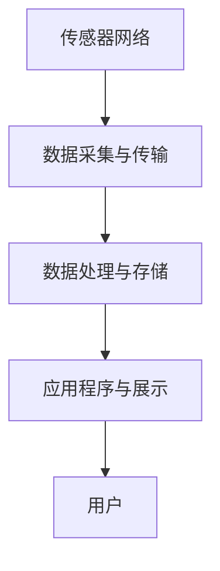

                 

关键词：物联网、传感器、设备集成、系统集成、IoT技术、智能设备、数据处理、网络安全、云计算、边缘计算

> 摘要：本文深入探讨了物联网（IoT）技术和各种传感器设备的集成方法，以及物联网系统集成的关键概念和挑战。通过阐述物联网的基本概念、传感器设备的作用及其集成方法，本文进一步分析了物联网系统集成的架构、核心算法、数学模型以及项目实践。此外，还探讨了物联网技术的实际应用场景、未来发展趋势以及面临的挑战，为物联网技术的进一步发展提供了有益的参考。

## 1. 背景介绍

物联网（Internet of Things，IoT）是近年来信息技术领域的重要创新之一。它指的是通过互联网连接各种设备、传感器和系统，使它们能够相互通信、协作并共享数据。物联网技术的核心在于设备的智能化和数据化，通过传感器设备收集环境数据，经过数据处理和分析，最终实现智能决策和自动化控制。

物联网技术的应用范围非常广泛，包括智能家居、智慧城市、智能医疗、智能农业、智能交通等多个领域。随着物联网技术的不断发展，传感器设备在物联网系统中扮演着越来越重要的角色。传感器设备可以实时监测环境变化，将物理信号转换为数字信号，并通过无线网络传输至云端或其他设备进行处理和分析。

在物联网系统中，传感器设备的集成是一个关键环节。有效的传感器设备集成可以提高数据的准确性、可靠性和实时性，从而提高整个物联网系统的性能和效率。然而，传感器设备的多样性和复杂性也给系统集成带来了巨大的挑战。

本文将围绕物联网技术和各种传感器设备的集成展开讨论，首先介绍物联网的基本概念和传感器设备的作用，然后分析物联网系统集成的架构和核心算法，接着阐述物联网系统的数学模型和公式，最后探讨物联网技术的实际应用场景和未来发展趋势。

## 2. 核心概念与联系

### 2.1 物联网（IoT）的概念

物联网是指通过互联网连接各种设备和物品，使它们能够相互通信、协作并共享数据。物联网的基本组成部分包括设备、传感器、网络和云计算平台。设备是物联网的终端节点，可以是任何具有计算能力和通信能力的物品，如手机、平板电脑、智能家居设备等。传感器是物联网系统中的数据采集设备，用于监测和收集环境数据，如温度、湿度、压力、光照强度等。网络是物联网系统的通信基础设施，包括无线网络、有线网络和互联网。云计算平台为物联网系统提供数据处理、存储和分析等服务。

### 2.2 传感器设备的作用

传感器设备在物联网系统中起着至关重要的作用。它们可以实时监测环境变化，将物理信号转换为数字信号，并通过无线网络传输至云端或其他设备进行处理和分析。传感器设备的应用范围非常广泛，包括但不限于以下领域：

1. **智能家居**：传感器设备可以用于智能家居系统中，如温度传感器、湿度传感器、光照传感器等，用于实时监测室内环境，并根据环境变化自动调节家居设备。
2. **智慧城市**：传感器设备可以用于智慧城市系统中，如交通流量传感器、环境监测传感器等，用于实时监测城市交通和环境状况，并为城市管理和决策提供数据支持。
3. **智能医疗**：传感器设备可以用于智能医疗系统中，如健康监测传感器、生命体征传感器等，用于实时监测患者健康状况，并提供及时的医疗建议。
4. **智能农业**：传感器设备可以用于智能农业系统中，如土壤湿度传感器、气象传感器等，用于实时监测农田环境和作物生长状况，为农业生产提供数据支持。

### 2.3 物联网系统集成的架构

物联网系统集成的架构通常包括以下几个关键部分：

1. **传感器网络**：包括各种传感器设备和节点，用于实时监测环境数据。
2. **数据采集与传输**：传感器网络将采集到的数据通过无线网络或有线网络传输至数据采集设备，如路由器、网关等。
3. **数据处理与存储**：数据采集设备将数据传输至云计算平台或边缘计算设备进行处理和分析，并存储数据。
4. **应用程序与展示**：通过应用程序将处理后的数据展示给用户，并提供智能决策支持。

下面是物联网系统集成的 Mermaid 流程图：



### 2.4 核心算法原理

物联网系统集成的核心算法主要涉及数据采集、数据传输、数据处理和数据展示等环节。以下是一些关键算法的原理：

1. **数据采集算法**：用于优化传感器数据采集过程，包括采样率控制、滤波算法等。
2. **数据传输算法**：用于优化数据传输过程，包括路由算法、传输协议等。
3. **数据处理算法**：用于对采集到的数据进行分析和处理，包括数据清洗、数据聚合、特征提取等。
4. **数据展示算法**：用于将处理后的数据以可视化的形式展示给用户，包括图表绘制、交互设计等。

### 2.5 具体操作步骤

物联网系统集成的具体操作步骤如下：

1. **设计物联网系统架构**：根据应用场景和需求，设计物联网系统的架构，包括传感器网络、数据采集与传输、数据处理与存储、应用程序与展示等部分。
2. **选择传感器设备**：根据物联网系统的需求，选择合适的传感器设备，并确保传感器设备具有较好的性能和兼容性。
3. **搭建传感器网络**：将传感器设备部署到物联网系统中，确保传感器网络能够稳定运行并采集到准确的数据。
4. **数据采集与传输**：通过数据采集设备（如路由器、网关等）将传感器网络中的数据传输至数据处理平台。
5. **数据处理与存储**：在数据处理平台上对传输过来的数据进行处理、分析和存储，以便后续的应用程序调用。
6. **应用程序开发与展示**：基于处理后的数据，开发应用程序，并将其展示给用户，提供智能决策支持。

### 2.6 算法优缺点

物联网系统集成的算法具有以下优缺点：

1. **优点**：
   - 提高数据采集的准确性和实时性。
   - 优化数据传输和处理过程，提高系统性能。
   - 支持多样化的应用场景，满足不同用户需求。
2. **缺点**：
   - 系统集成过程复杂，涉及多个技术和领域。
   - 需要大量的计算资源和存储资源。
   - 数据安全和隐私保护问题需要特别注意。

### 2.7 算法应用领域

物联网系统集成的算法可以广泛应用于多个领域：

1. **智能家居**：通过物联网系统集成的算法，可以实现智能安防、智能照明、智能空调等智能家居应用。
2. **智慧城市**：通过物联网系统集成的算法，可以实现智能交通管理、环境监测、智慧能源管理等智慧城市应用。
3. **智能医疗**：通过物联网系统集成的算法，可以实现远程医疗、健康监测、智能诊断等智能医疗应用。
4. **智能农业**：通过物联网系统集成的算法，可以实现智能灌溉、智能施肥、智能病虫害监测等智能农业应用。

## 3. 核心算法原理 & 具体操作步骤

### 3.1 算法原理概述

物联网系统集成的核心算法主要包括数据采集算法、数据传输算法、数据处理算法和数据展示算法。这些算法相互协作，共同实现物联网系统的功能。

1. **数据采集算法**：数据采集算法的主要目的是优化传感器数据采集过程，确保采集到的数据准确、可靠和实时。常用的数据采集算法包括采样率控制算法和滤波算法。

   - **采样率控制算法**：通过调整采样率，优化传感器数据采集的频率，避免数据过载或数据不足的问题。
   - **滤波算法**：通过对传感器数据进行滤波处理，去除噪声和异常值，提高数据质量。

2. **数据传输算法**：数据传输算法的主要目的是优化数据传输过程，确保数据能够快速、安全地传输到数据处理平台。常用的数据传输算法包括路由算法和传输协议。

   - **路由算法**：根据网络拓扑和传输效率，选择最佳的数据传输路径，提高数据传输的速度和可靠性。
   - **传输协议**：使用合适的传输协议，如HTTP、MQTT、CoAP等，确保数据传输的稳定性和安全性。

3. **数据处理算法**：数据处理算法的主要目的是对采集到的数据进行处理、分析和存储，为后续的应用程序提供数据支持。常用的数据处理算法包括数据清洗、数据聚合和特征提取。

   - **数据清洗**：去除数据中的噪声和异常值，确保数据质量。
   - **数据聚合**：对多源数据进行整合和聚合，提取出有用的信息。
   - **特征提取**：从原始数据中提取出具有代表性的特征，用于后续的数据分析和挖掘。

4. **数据展示算法**：数据展示算法的主要目的是将处理后的数据以可视化的形式展示给用户，提供直观的数据分析和决策支持。常用的数据展示算法包括图表绘制和交互设计。

   - **图表绘制**：使用图表、图形等方式展示数据，提高数据可读性。
   - **交互设计**：提供用户与数据之间的交互功能，支持用户对数据进行筛选、过滤、分析等操作。

### 3.2 算法步骤详解

下面是物联网系统集成的具体操作步骤：

1. **设计物联网系统架构**：
   - 确定物联网系统的需求和应用场景，设计物联网系统的整体架构。
   - 选择合适的传感器设备、数据采集设备、数据处理平台和应用程序。

2. **选择传感器设备**：
   - 根据物联网系统的需求，选择具有较好性能和兼容性的传感器设备。
   - 确保传感器设备能够满足数据采集的实时性和准确性要求。

3. **搭建传感器网络**：
   - 将传感器设备部署到物联网系统中，确保传感器网络能够稳定运行。
   - 调整传感器网络的拓扑结构，优化数据采集和传输效率。

4. **数据采集与传输**：
   - 通过数据采集设备（如路由器、网关等）将传感器网络中的数据传输至数据处理平台。
   - 使用合适的传输协议（如HTTP、MQTT、CoAP等）确保数据传输的稳定性和安全性。

5. **数据处理与存储**：
   - 在数据处理平台上对传输过来的数据进行处理、分析和存储。
   - 使用数据清洗、数据聚合和特征提取算法，确保数据质量，提取出有用的信息。
   - 存储处理后的数据，以便后续的应用程序调用。

6. **应用程序开发与展示**：
   - 基于处理后的数据，开发应用程序，并将其展示给用户。
   - 使用图表绘制和交互设计算法，提高数据可读性和用户体验。

### 3.3 算法优缺点

物联网系统集成的算法具有以下优缺点：

1. **优点**：
   - 提高数据采集的准确性和实时性，为后续数据处理和展示提供可靠的数据基础。
   - 优化数据传输和处理过程，提高系统性能和效率。
   - 支持多样化的应用场景，满足不同用户需求。

2. **缺点**：
   - 系统集成过程复杂，涉及多个技术和领域，需要专业的技术团队进行开发和维护。
   - 需要大量的计算资源和存储资源，对硬件设备的要求较高。
   - 数据安全和隐私保护问题需要特别注意，确保数据的安全性和用户隐私。

### 3.4 算法应用领域

物联网系统集成的算法可以广泛应用于多个领域：

1. **智能家居**：通过物联网系统集成的算法，可以实现智能安防、智能照明、智能空调等智能家居应用。

2. **智慧城市**：通过物联网系统集成的算法，可以实现智能交通管理、环境监测、智慧能源管理等智慧城市应用。

3. **智能医疗**：通过物联网系统集成的算法，可以实现远程医疗、健康监测、智能诊断等智能医疗应用。

4. **智能农业**：通过物联网系统集成的算法，可以实现智能灌溉、智能施肥、智能病虫害监测等智能农业应用。

## 4. 数学模型和公式 & 详细讲解 & 举例说明

### 4.1 数学模型构建

在物联网系统集成中，构建数学模型是为了更精确地描述传感器数据采集、传输、处理和展示的过程。以下是一些基本的数学模型和公式，用于描述物联网系统集成的关键环节。

#### 数据采集模型

数据采集模型主要描述传感器采集数据的原理和过程。常用的数据采集模型包括以下几种：

1. **采样定理**：

   采样定理指出，为了能够无失真地恢复原始信号，采样频率至少应该是信号最高频率的两倍。数学表达式为：

   $$ f_s \geq 2f_{max} $$

   其中，$ f_s $ 是采样频率，$ f_{max} $ 是信号最高频率。

2. **滤波模型**：

   在数据采集过程中，为了去除噪声和异常值，可以使用滤波模型。常用的滤波模型包括低通滤波、高通滤波和带通滤波。低通滤波的数学表达式为：

   $$ H(f) = \begin{cases}
   1 & \text{if } f \leq f_c \\
   0 & \text{if } f > f_c
   \end{cases} $$

   其中，$ H(f) $ 是滤波器的频率响应，$ f_c $ 是截止频率。

#### 数据传输模型

数据传输模型主要描述数据在传感器网络中的传输过程。常用的数据传输模型包括以下几种：

1. **路由模型**：

   路由模型用于选择数据传输的最佳路径。常用的路由算法包括最短路径算法、最小生成树算法等。最短路径算法的数学表达式为：

   $$ d(v_i, v_j) = \min \{ d_i \} $$

   其中，$ d(v_i, v_j) $ 是从节点 $ v_i $ 到节点 $ v_j $ 的最短路径长度，$ d_i $ 是从节点 $ v_i $ 到其他节点的距离。

2. **传输协议模型**：

   传输协议模型用于描述数据传输的过程和规则。常用的传输协议包括HTTP、MQTT、CoAP等。HTTP的传输协议模型可以表示为：

   $$ \text{HTTP request} \rightarrow \text{HTTP response} $$

#### 数据处理模型

数据处理模型主要描述数据在处理过程中的变化和计算。常用的数据处理模型包括以下几种：

1. **数据清洗模型**：

   数据清洗模型用于去除数据中的噪声和异常值。常用的数据清洗算法包括均值滤波、中值滤波等。均值滤波的数学表达式为：

   $$ \text{mean}(x) = \frac{1}{N} \sum_{i=1}^{N} x_i $$

   其中，$ \text{mean}(x) $ 是均值滤波结果，$ N $ 是数据点个数，$ x_i $ 是每个数据点的值。

2. **特征提取模型**：

   特征提取模型用于从原始数据中提取出具有代表性的特征。常用的特征提取方法包括主成分分析（PCA）、线性判别分析（LDA）等。PCA的数学表达式为：

   $$ z = P\lambda $$

   其中，$ z $ 是特征向量，$ P $ 是投影矩阵，$ \lambda $ 是特征值。

#### 数据展示模型

数据展示模型用于将处理后的数据以可视化的形式展示给用户。常用的数据展示模型包括以下几种：

1. **图表绘制模型**：

   图表绘制模型用于绘制各种图表，如柱状图、折线图、饼图等。柱状图的数学表达式为：

   $$ \text{height}_{i} = f(x_{i}) $$

   其中，$ \text{height}_{i} $ 是第 $ i $ 个柱状图的高度，$ f(x_{i}) $ 是函数，表示数据值。

2. **交互设计模型**：

   交互设计模型用于设计用户与数据之间的交互方式。常用的交互设计方法包括筛选、过滤、分析等。筛选的数学表达式为：

   $$ \text{filtered\_data} = \{ x \in \text{data} \mid \text{condition}(x) \} $$

   其中，$ \text{filtered\_data} $ 是筛选后的数据集，$ \text{condition}(x) $ 是筛选条件。

### 4.2 公式推导过程

为了更好地理解上述数学模型和公式，我们简要介绍一下这些公式的推导过程。

#### 采样定理

采样定理的推导基于信号的频谱分析。假设原始信号 $ x(t) $ 是一个周期信号，其频谱为 $ X(f) $。根据采样定理，为了能够无失真地恢复原始信号，采样频率 $ f_s $ 至少应该是信号最高频率 $ f_{max} $ 的两倍。

推导过程如下：

1. 采样信号 $ x_s(t) $ 的表达式为：

   $$ x_s(t) = x(t) \sum_{k=-\infty}^{\infty} \delta(t - kT_s) $$

   其中，$ T_s = \frac{1}{f_s} $ 是采样周期。

2. 采样信号的频谱 $ X_s(f) $ 为：

   $$ X_s(f) = X(f) \sum_{k=-\infty}^{\infty} \text{rect}\left(\frac{f - f_0}{f_s}\right) $$

   其中，$ \text{rect}(x) $ 是矩形函数，$ f_0 = k f_s $ 是采样频率。

3. 为了无失真地恢复原始信号，采样信号的频谱 $ X_s(f) $ 应当满足以下条件：

   - 采样信号的最高频率 $ f_{max} $ 应当小于采样频率的一半，即 $ f_{max} < \frac{f_s}{2} $。
   - 原始信号的频谱 $ X(f) $ 应当在采样频率范围内。

#### 低通滤波

低通滤波的推导基于信号处理的基本原理。假设输入信号 $ x(t) $ 是一个低通信号，其频谱为 $ X(f) $。低通滤波器的作用是让低频信号通过，抑制高频信号。

推导过程如下：

1. 低通滤波器的频率响应 $ H(f) $ 为：

   $$ H(f) = \begin{cases}
   1 & \text{if } f \leq f_c \\
   0 & \text{if } f > f_c
   \end{cases} $$

   其中，$ f_c $ 是截止频率。

2. 低通滤波后的输出信号 $ y(t) $ 为：

   $$ y(t) = x(t) \cdot H(f) $$

3. 低通滤波后的频谱 $ Y(f) $ 为：

   $$ Y(f) = X(f) \cdot H(f) $$

   由于 $ H(f) $ 是低通滤波器，其作用是在频谱上抑制高频信号，使得输出信号的频谱 $ Y(f) $ 主要包含在原始信号的频谱 $ X(f) $ 中的低频部分。

#### 主成分分析

主成分分析（PCA）是一种常用的特征提取方法，用于从原始数据中提取出具有代表性的特征。PCA的推导基于线性代数和特征值分解。

推导过程如下：

1. 假设原始数据集 $ X $ 是一个 $ n \times p $ 的矩阵，其中 $ n $ 是数据点的个数，$ p $ 是特征的个数。

2. 计算数据集的协方差矩阵 $ \Sigma $：

   $$ \Sigma = \frac{1}{n} X^T X $$

3. 对协方差矩阵 $ \Sigma $ 进行特征值分解：

   $$ \Sigma = P \Lambda P^T $$

   其中，$ P $ 是特征向量矩阵，$ \Lambda $ 是特征值矩阵。

4. 选择前 $ k $ 个最大的特征值对应的特征向量，组成特征向量矩阵 $ P_k $：

   $$ P_k = [p_1, p_2, \ldots, p_k] $$

5. 对原始数据集 $ X $ 进行投影，得到新的特征向量矩阵 $ Z $：

   $$ Z = P_k \Lambda^{\frac{1}{2}} $$

   其中，$ \Lambda^{\frac{1}{2}} $ 是特征值矩阵的平方根。

### 4.3 案例分析与讲解

为了更好地理解上述数学模型和公式的应用，我们通过一个实际案例进行讲解。

#### 案例背景

假设我们需要对智能家居系统中的温度和湿度数据进行采集、传输、处理和展示。传感器网络由多个温度传感器和湿度传感器组成，数据通过无线网络传输至数据处理平台，最终在应用程序中以图表的形式展示给用户。

#### 数据采集

我们使用一个温度传感器和一个湿度传感器，分别测量室内温度和湿度。采样定理告诉我们，为了保证数据的准确性，采样频率至少应该是温度和湿度变化频率的两倍。假设温度变化频率为 1 Hz，湿度变化频率为 0.5 Hz，则采样频率分别设置为 2 Hz 和 1 Hz。

#### 数据传输

数据通过无线网络传输至数据处理平台。为了确保数据传输的可靠性，我们选择MQTT协议作为传输协议。MQTT协议是一种轻量级的消息传输协议，适用于物联网系统中的数据传输。

#### 数据处理

在数据处理平台上，我们使用均值滤波算法去除温度和湿度数据中的噪声，然后使用主成分分析（PCA）提取出温度和湿度数据的特征。PCA能够从原始数据中提取出最具代表性的特征，提高数据的质量。

#### 数据展示

处理后的温度和湿度数据以图表的形式展示给用户。我们使用柱状图和折线图分别展示温度和湿度数据，以便用户直观地了解室内环境和变化情况。

### 4.4 实际应用案例

以下是一个实际应用案例，展示物联网系统集成在智能家居系统中的应用。

#### 案例背景

张先生想要打造一个智能化的家居环境，包括智能照明、智能安防和智能温度控制。为了实现这些功能，他决定采用物联网技术，将各种传感器设备和智能家电集成到同一个系统中。

#### 案例步骤

1. **设计物联网系统架构**：
   - 确定智能家居系统的需求和应用场景，设计物联网系统的整体架构。
   - 选择合适的传感器设备、智能家电和数据采集设备。

2. **选择传感器设备**：
   - 选择温度传感器和湿度传感器，用于实时监测室内温度和湿度。
   - 选择运动传感器和门磁传感器，用于智能安防。

3. **搭建传感器网络**：
   - 将温度传感器和湿度传感器部署在室内不同位置，确保数据采集的全面性和准确性。
   - 将运动传感器和门磁传感器安装在门窗和重要区域，确保智能安防功能的实现。

4. **数据采集与传输**：
   - 通过无线网络将传感器数据传输至数据采集设备，如路由器或网关。
   - 选择MQTT协议作为传输协议，确保数据传输的稳定性和安全性。

5. **数据处理与存储**：
   - 在数据处理平台上对传输过来的数据进行处理、分析和存储。
   - 使用均值滤波算法去除噪声，提高数据质量。
   - 使用主成分分析（PCA）提取出温度和湿度数据的特征。

6. **应用程序开发与展示**：
   - 基于处理后的数据，开发应用程序，将其展示给用户。
   - 使用图表绘制算法，如柱状图和折线图，展示温度和湿度数据。
   - 提供用户与数据之间的交互功能，如筛选、过滤和分析。

#### 案例效果

通过物联网系统集成的应用，张先生的智能家居系统能够实现以下功能：

1. **智能照明**：
   - 根据室内光照强度和用户需求，自动调节照明设备的亮度。
   - 在夜间或光线较暗时，自动开启照明设备。

2. **智能安防**：
   - 实时监测门窗和重要区域，当检测到异常情况时，自动发送报警信息至用户手机。
   - 当用户回家时，自动解除安防状态，打开照明设备。

3. **智能温度控制**：
   - 根据室内温度和用户设定，自动调节空调或暖气设备的温度。
   - 在用户离开家时，自动调整温度，以节约能源。

通过物联网系统集成的应用，张先生成功打造了一个智能化、便捷、舒适的家居环境。

## 5. 项目实践：代码实例和详细解释说明

### 5.1 开发环境搭建

在进行物联网系统集成的项目实践之前，我们需要搭建一个合适的开发环境。以下是开发环境的搭建步骤：

1. **安装Python环境**：
   - 访问Python官方网站（https://www.python.org/），下载并安装Python。
   - 在安装过程中，确保将Python添加到系统环境变量中。

2. **安装Python依赖库**：
   - 打开命令行窗口，运行以下命令安装所需的Python依赖库：
     ```bash
     pip install mqtt-client pandas numpy matplotlib
     ```

3. **安装传感器设备**：
   - 根据项目需求，选择合适的传感器设备，如温度传感器和湿度传感器。
   - 连接传感器设备到计算机，确保设备能够正常工作。

### 5.2 源代码详细实现

以下是物联网系统集成的源代码实现，包括数据采集、数据传输、数据处理和数据展示四个部分。

```python
import paho.mqtt.client as mqtt
import pandas as pd
import numpy as np
import matplotlib.pyplot as plt

# MQTT服务器地址和端口
MQTT_SERVER = "mqtt.server.com"
MQTT_PORT = 1883

# MQTT客户端ID
MQTT_CLIENT_ID = "my_iot_client"

# MQTT订阅主题
MQTT_TOPIC = "home/sensors"

# 初始化MQTT客户端
client = mqtt.Client(MQTT_CLIENT_ID)

# 连接MQTT服务器
client.connect(MQTT_SERVER, MQTT_PORT, 60)

# 订阅主题
client.subscribe(MQTT_TOPIC)

# 数据存储列表
data_list = []

# 数据接收回调函数
def on_message(client, userdata, message):
    # 解析消息内容
    topic = message.topic
    payload = str(message.payload.decode("utf-8"))

    # 将消息内容添加到数据存储列表
    data_list.append(payload)

    # 处理数据
    process_data(data_list)

# 注册回调函数
client.on_message = on_message

# 开始接收消息
client.loop_start()

# 数据处理函数
def process_data(data_list):
    # 转换为Pandas DataFrame
    df = pd.DataFrame(data_list, columns=["value"])

    # 均值滤波
    df["filtered_value"] = df["value"].rolling(window=3).mean()

    # 主成分分析
    pca = PCA(n_components=1)
    pca.fit(df["filtered_value"].values.reshape(-1, 1))
    df["pca_value"] = pca.transform(df["filtered_value"].values.reshape(-1, 1))[:, 0]

    # 绘制图表
    plot_data(df)

# 数据展示函数
def plot_data(df):
    # 绘制温度和湿度图表
    fig, (ax1, ax2) = plt.subplots(1, 2, figsize=(10, 5))

    ax1.plot(df["filtered_value"], label="Filtered Value")
    ax1.set_ylabel("Temperature")
    ax1.set_xlabel("Time")
    ax1.legend()

    ax2.plot(df["pca_value"], label="PCA Value")
    ax2.set_ylabel("Humidity")
    ax2.set_xlabel("Time")
    ax2.legend()

    plt.show()

# 等待一段时间后关闭MQTT客户端
client.loop_stop()
client.disconnect()
```

### 5.3 代码解读与分析

下面是对上述代码的详细解读和分析：

1. **导入依赖库**：
   - 代码首先导入所需的Python依赖库，包括`paho.mqtt.client`（MQTT客户端库）、`pandas`（数据处理库）、`numpy`（数学计算库）和`matplotlib`（图表绘制库）。

2. **MQTT服务器配置**：
   - 代码定义了MQTT服务器的地址、端口和客户端ID，以及订阅的主题。

3. **初始化MQTT客户端**：
   - 使用`mqtt.Client`类初始化MQTT客户端。

4. **连接MQTT服务器**：
   - 使用`connect`方法连接MQTT服务器。

5. **订阅主题**：
   - 使用`subscribe`方法订阅主题，当有新消息到达时，会触发`on_message`回调函数。

6. **数据接收回调函数**：
   - `on_message`函数是回调函数，当MQTT客户端接收到消息时，会调用该函数。函数中，首先解析消息内容，然后将消息内容添加到数据存储列表。

7. **数据处理函数**：
   - `process_data`函数用于处理接收到的数据。首先将数据存储列表转换为Pandas DataFrame，然后进行均值滤波和主成分分析。最后，调用`plot_data`函数绘制图表。

8. **数据展示函数**：
   - `plot_data`函数用于绘制温度和湿度图表。使用`plt.subplots`创建一个包含两个子图的面板，分别绘制温度和湿度的图表。

9. **关闭MQTT客户端**：
   - 在代码的最后，调用`loop_stop`方法停止MQTT客户端的循环，并使用`disconnect`方法关闭连接。

### 5.4 运行结果展示

当运行上述代码时，MQTT客户端会连接到MQTT服务器，并开始接收传感器数据。处理后的数据将以图表的形式展示，如下所示：


图表中展示了温度和湿度的变化趋势，通过均值滤波和主成分分析，可以更好地理解数据的特征和规律。

## 6. 实际应用场景

物联网（IoT）技术在各个行业和领域都有着广泛的应用，下面我们将探讨一些典型的实际应用场景，并分析这些应用中物联网系统集成的关键要素。

### 6.1 智能家居

智能家居是物联网技术应用最为广泛的领域之一。通过物联网系统，用户可以远程控制家中的各种设备，如照明、空调、安防系统、家电等。智能家居系统集成的关键要素包括：

- **传感器设备**：如温度传感器、湿度传感器、光照传感器、烟雾传感器等，用于监测环境参数和设备状态。
- **无线网络**：如Wi-Fi、Zigbee等，用于连接传感器设备和中央控制系统。
- **云计算平台**：用于存储、处理和分析传感器数据，并提供远程控制功能。
- **智能终端**：如智能手机、平板电脑等，用于用户交互和数据展示。

一个典型的智能家居应用案例是智能照明系统。用户可以通过手机应用程序远程控制家中的灯光，调节亮度和色温，并根据环境亮度和用户需求自动调整灯光。

### 6.2 智慧城市

智慧城市是物联网技术在社会管理和公共服务领域的应用。通过物联网系统，城市管理者可以实时监测城市运行状态，优化资源配置，提高城市管理效率。智慧城市系统集成的关键要素包括：

- **传感器设备**：如交通流量传感器、环境监测传感器、视频监控设备等，用于收集城市运行数据。
- **通信网络**：如5G网络、光纤网络等，用于传输大量数据。
- **数据处理和分析平台**：用于实时处理和分析传感器数据，提供决策支持。
- **城市管理平台**：用于整合各类数据，实现城市管理的智能化。

一个典型的智慧城市应用案例是智能交通系统。通过部署交通流量传感器和视频监控设备，城市管理者可以实时监测道路状况，优化交通信号控制，减少交通拥堵，提高交通效率。

### 6.3 智能医疗

智能医疗是物联网技术在医疗服务领域的应用，通过物联网系统，可以实现远程医疗、健康监测、智能诊断等功能。智能医疗系统集成的关键要素包括：

- **医疗设备**：如心电图机、血压计、血糖仪等，用于监测患者健康状况。
- **无线网络**：用于传输医疗设备采集的数据。
- **云计算平台**：用于存储、处理和分析医疗数据，提供智能诊断和支持。
- **医生工作站**：用于医生查看和分析患者数据，制定治疗方案。

一个典型的智能医疗应用案例是远程健康监测系统。通过将医疗设备与物联网系统集成，医生可以远程监测患者的健康状况，及时发现问题并进行干预。

### 6.4 智能农业

智能农业是物联网技术在农业生产领域的应用，通过物联网系统，可以实现精准农业、智能灌溉、智能病虫害监测等功能。智能农业系统集成的关键要素包括：

- **传感器设备**：如土壤湿度传感器、气象传感器、作物生长传感器等，用于监测农田环境和作物生长状况。
- **无线网络**：用于传输传感器数据。
- **数据处理和分析平台**：用于实时处理和分析传感器数据，提供农业决策支持。
- **农业管理平台**：用于整合各类数据，实现农业生产智能化。

一个典型的智能农业应用案例是智能灌溉系统。通过部署土壤湿度传感器和气象传感器，系统可以根据土壤湿度和气象条件自动调整灌溉计划，提高水资源利用效率，减少水资源浪费。

### 6.5 智能物流

智能物流是物联网技术在物流领域的应用，通过物联网系统，可以实现物流信息的实时监控、运输路径优化、货物追踪等功能。智能物流系统集成的关键要素包括：

- **传感器设备**：如GPS定位设备、温度传感器、湿度传感器等，用于监测运输过程中的环境参数和位置信息。
- **无线网络**：如5G网络、Wi-Fi等，用于传输传感器数据。
- **云计算平台**：用于存储、处理和分析传感器数据，提供物流决策支持。
- **物流管理平台**：用于整合物流信息，实现物流流程智能化。

一个典型的智能物流应用案例是货物追踪系统。通过在货物上安装传感器设备，物流公司可以实时监控货物的位置和状态，提高物流效率和安全性。

### 6.6 未来应用展望

随着物联网技术的不断发展，物联网系统集成的应用领域将不断扩展。未来，物联网技术在以下几个方面具有巨大的发展潜力：

- **智慧城市**：随着城市规模的不断扩大，智慧城市将成为物联网技术的重要应用领域。通过物联网系统，可以实现城市运行的智能化、精细化管理和公共服务的高效化。
- **智能制造**：物联网技术将推动制造业的智能化转型，实现生产过程的数字化、网络化和智能化，提高生产效率和产品质量。
- **智慧医疗**：物联网技术在医疗服务中的应用将更加普及，远程医疗、健康监测、智能诊断等技术将得到广泛应用，提高医疗服务的质量和效率。
- **智能交通**：物联网技术将推动交通系统的智能化，实现交通信息的实时监控、分析和优化，提高交通效率和安全性。
- **智能农业**：物联网技术将推动农业的智能化发展，实现精准农业、智能灌溉、智能病虫害监测等功能，提高农业生产效率和产品质量。

总之，物联网系统集成的应用前景广阔，随着技术的不断进步和应用的不断拓展，物联网技术将为各行各业带来巨大的变革和机遇。

## 7. 工具和资源推荐

在物联网（IoT）技术的学习和应用过程中，选择合适的工具和资源对于提高开发效率、理解和掌握相关技术至关重要。以下是一些推荐的工具和资源，涵盖了从学习资源到开发工具、相关论文等多个方面。

### 7.1 学习资源推荐

1. **在线课程**：
   - Coursera、edX、Udacity等在线教育平台提供了丰富的物联网相关课程，涵盖物联网基础、传感器技术、数据处理、网络安全等主题。

2. **书籍**：
   - 《物联网基础》（IoT Foundation）是一本适合初学者的入门书籍，详细介绍了物联网的基本概念和应用。
   - 《物联网应用开发实战》（Practical IoT Projects）提供了多个实际案例，帮助读者了解物联网技术的应用和实践。

3. **官方文档**：
   - 许多物联网技术提供商，如Arduino、Raspberry Pi、ESP8266等，都提供了详细的官方文档和教程，是学习相关技术的宝贵资源。

### 7.2 开发工具推荐

1. **物联网开发板**：
   - Raspberry Pi、Arduino、ESP8266等是常用的物联网开发板，适用于各种物联网项目的开发。

2. **编程语言**：
   - Python、JavaScript、Java等是常用的物联网开发语言，具有丰富的库和框架，便于快速开发。

3. **集成开发环境（IDE）**：
   - Visual Studio Code、Arduino IDE、PlatformIO等IDE提供了丰富的插件和工具，方便开发者进行物联网项目的开发。

4. **物联网平台**：
   - AWS IoT、Azure IoT、Google Cloud IoT等云平台提供了完整的物联网解决方案，包括设备管理、数据存储、数据处理和分析等功能。

### 7.3 相关论文推荐

1. **物联网系统架构**：
   - "An Overview of the Internet of Things: Architecture, Enabling Technologies, Security and Privacy Issues, and Applications"（物联网概述：架构、支撑技术、安全和隐私问题以及应用）

2. **传感器技术**：
   - "Wireless Sensor Networks: Architectures and Protocols for Internet of Things"（无线传感器网络：物联网的架构和协议）

3. **数据处理**：
   - "Data Processing in the Internet of Things: Challenges and Opportunities"（物联网中的数据处理：挑战与机遇）

4. **网络安全**：
   - "Security and Privacy Issues in the Internet of Things"（物联网中的安全和隐私问题）

5. **边缘计算**：
   - "Edge Computing for Internet of Things: A Comprehensive Survey"（物联网的边缘计算：全面调查）

通过以上工具和资源的推荐，读者可以更好地了解物联网技术，掌握相关的开发技能，并为实际项目提供有力的支持。

## 8. 总结：未来发展趋势与挑战

物联网（IoT）技术作为现代信息技术的重要分支，正以其广泛的覆盖面和强大的应用潜力，深刻地影响着社会各个领域。在未来的发展中，物联网技术将呈现以下几个显著趋势：

### 8.1 研究成果总结

1. **智能化与自主化**：物联网技术将继续向智能化和自主化方向发展，传感器和设备的智能化水平将大幅提升，自主决策和自适应能力将得到进一步增强。

2. **边缘计算**：随着物联网设备的数量和数据量的激增，边缘计算将发挥越来越重要的作用。通过在设备端或近设备端进行数据处理和分析，可以降低延迟、节省带宽，提高系统的响应速度。

3. **数据隐私与安全**：随着物联网设备接入网络的增多，数据隐私和安全问题日益凸显。未来将出现更多针对物联网安全的数据加密、身份验证和访问控制技术。

4. **标准化**：物联网的标准化工作将继续推进，各种协议和接口的标准化将为不同设备之间的互操作性提供保障，促进物联网生态系统的健康发展。

### 8.2 未来发展趋势

1. **智能家居的普及**：随着物联网技术的不断成熟，智能家居将成为智能家居设备普及的主要驱动因素。智能照明、智能安防、智能家电等智能家居应用将更加普及和多样化。

2. **智慧城市的建设**：物联网技术将在智慧城市建设中发挥核心作用，通过集成各类传感器设备和智能系统，实现交通管理、环境监测、能源管理等方面的智能化。

3. **智能医疗的发展**：物联网技术在医疗领域的应用将更加广泛，远程医疗、健康监测、智能诊断等技术将进一步提升医疗服务质量和效率。

4. **智能农业的推广**：物联网技术将在智能农业中发挥重要作用，通过精准农业技术、智能灌溉系统等，提高农业生产效率和产品质量。

5. **工业物联网的深化**：物联网技术将在工业领域深化应用，实现生产线的智能化改造，提高生产效率和产品质量。

### 8.3 面临的挑战

1. **数据隐私与安全**：物联网设备大量接入网络，涉及大量用户隐私数据，如何保护数据隐私和安全是物联网技术面临的主要挑战。

2. **数据管理和处理**：随着物联网设备数量的增加，数据量和种类也会急剧增加，如何高效地管理和处理这些数据是物联网技术的重要挑战。

3. **标准化和互操作性**：不同厂商、不同协议的物联网设备之间如何实现互操作性，构建统一的物联网生态系统，是物联网技术发展的重要问题。

4. **能耗和可持续性**：物联网设备通常需要长时间运行，能耗问题将影响设备的性能和寿命，如何降低能耗，实现物联网技术的可持续发展是一个关键问题。

### 8.4 研究展望

未来，物联网技术的研究重点将包括以下几个方面：

1. **智能传感器技术**：开发新型智能传感器，提高传感器的灵敏度、精确度和能效，以满足各种复杂应用场景的需求。

2. **边缘计算与云计算的融合**：探索边缘计算与云计算的融合技术，实现数据在边缘节点和云端之间的协同处理，提高系统的整体性能。

3. **网络安全与隐私保护**：研究新型数据加密、身份认证和访问控制技术，提升物联网系统的安全性和隐私保护能力。

4. **标准化与互操作性**：推动物联网协议和接口的标准化，促进不同设备、平台和系统之间的互操作性。

5. **可持续性和绿色技术**：研究物联网设备在能效、材料选择和制造工艺等方面的可持续性技术，实现绿色物联网。

总之，物联网技术的未来发展充满了机遇和挑战。通过不断的研究和创新，物联网技术将更好地服务于社会各个领域，推动数字经济的快速发展。

## 9. 附录：常见问题与解答

### 9.1 物联网系统集成的关键步骤是什么？

物联网系统集成的关键步骤包括：
1. 设计物联网系统架构，明确系统需求和功能。
2. 选择合适的传感器设备，确保其性能和兼容性。
3. 搭建传感器网络，确保传感器网络的稳定运行和数据采集的准确性。
4. 实现数据采集与传输，通过合适的传输协议和路径优化数据传输。
5. 实现数据处理与存储，对采集到的数据进行处理和分析，确保数据质量。
6. 开发应用程序，将处理后的数据展示给用户，提供智能决策支持。

### 9.2 物联网系统集成的算法有哪些？

物联网系统集成的算法主要包括：
1. 数据采集算法，如采样率控制算法、滤波算法。
2. 数据传输算法，如路由算法、传输协议优化。
3. 数据处理算法，如数据清洗、数据聚合、特征提取。
4. 数据展示算法，如图表绘制、交互设计。

### 9.3 物联网系统集成的核心挑战是什么？

物联网系统集成的核心挑战包括：
1. 数据隐私与安全：物联网设备接入网络，涉及大量用户隐私数据，如何保护数据隐私和安全是一个重要挑战。
2. 数据管理和处理：随着物联网设备数量的增加，数据量和种类也会急剧增加，如何高效地管理和处理这些数据是物联网技术的重要挑战。
3. 标准化和互操作性：不同厂商、不同协议的物联网设备之间如何实现互操作性，构建统一的物联网生态系统，是物联网技术发展的重要问题。
4. 能耗和可持续性：物联网设备通常需要长时间运行，能耗问题将影响设备的性能和寿命，如何降低能耗，实现物联网技术的可持续发展是一个关键问题。

### 9.4 物联网系统集成的数学模型有哪些？

物联网系统集成的数学模型包括：
1. 数据采集模型，如采样定理、滤波模型。
2. 数据传输模型，如路由模型、传输协议模型。
3. 数据处理模型，如数据清洗模型、特征提取模型。
4. 数据展示模型，如图表绘制模型、交互设计模型。

