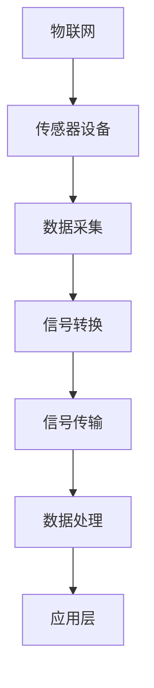

                 

在当今快速发展的科技时代，物联网（IoT）技术已经成为了连接现实世界和数字化世界的桥梁。通过将各种传感器设备集成到物联网中，我们可以实现对物理世界的实时监测、分析和控制，从而带来更智能、更高效的生活和工作方式。蓝牙技术作为无线通信领域的重要一员，其在物联网中的应用也越来越广泛。本文将探讨物联网技术和各种传感器设备的集成，特别是蓝牙技术在物联网中的应用，旨在为读者提供一个清晰、系统的理解。

## 文章关键词

- 物联网（IoT）
- 传感器设备
- 蓝牙技术
- 集成
- 无线通信
- 智能监控
- 数据分析

## 文章摘要

本文首先介绍了物联网技术的背景和发展，探讨了各种传感器设备在物联网中的重要性。接着，我们深入分析了蓝牙技术在物联网中的应用，包括其优势、挑战以及具体的应用场景。随后，文章通过一个实际项目实例，展示了如何利用蓝牙技术实现传感器数据的实时传输和处理。最后，我们展望了物联网和蓝牙技术在未来的发展方向和面临的挑战。

## 1. 背景介绍

### 1.1 物联网技术的发展

物联网技术起源于20世纪80年代末和90年代初，最初主要用于工业自动化领域。随着计算机技术、网络通信技术和传感器技术的不断发展，物联网技术逐渐渗透到我们的日常生活中。现如今，物联网已经成为全球科技发展的热点，其应用领域涵盖了智能家居、智慧城市、智能医疗、智能交通等多个方面。

### 1.2 传感器设备的重要性

传感器设备是物联网的核心组成部分，它们能够感知物理世界的变化，并将这些变化转换为数字信号，供计算机处理和分析。常见的传感器类型包括温度传感器、湿度传感器、光照传感器、运动传感器等。这些传感器设备在物联网中起到了关键作用，使得我们能够实时获取物理世界的状态，从而实现智能化的决策和控制。

### 1.3 蓝牙技术在物联网中的应用

蓝牙技术作为一种短距离无线通信技术，具有低功耗、低成本、高稳定性等优点，在物联网中的应用越来越广泛。蓝牙技术可以用于连接各种传感器设备，实现数据的实时传输和处理。此外，蓝牙技术还可以与其他通信技术（如Wi-Fi、NFC等）相结合，为物联网应用提供更丰富的功能。

## 2. 核心概念与联系

### 2.1 物联网（IoT）的基本概念

物联网（Internet of Things，IoT）是指通过传感器、通信技术和数据处理技术，将各种物理设备和系统连接起来，形成一个智能化的网络体系。物联网的基本概念包括设备连接、数据传输、数据处理、应用层等。

#### 2.1.1 设备连接

设备连接是物联网的基础，通过各种传感器设备将物理世界与数字世界连接起来。这些传感器设备可以是智能手表、智能手机、智能门锁、智能摄像头等。

#### 2.1.2 数据传输

数据传输是物联网的核心功能，通过无线通信技术将传感器设备采集到的数据传输到云端或其他处理中心。常见的无线通信技术包括Wi-Fi、蓝牙、NFC等。

#### 2.1.3 数据处理

数据处理是对传输到云端的数据进行存储、分析和处理，从而提取有价值的信息。数据处理技术包括大数据技术、云计算技术、机器学习技术等。

#### 2.1.4 应用层

应用层是物联网的最终体现，通过智能化的决策和控制，实现对物理世界的实时监测、分析和优化。应用层包括智能家居、智慧城市、智能医疗、智能交通等。

### 2.2 传感器设备的工作原理

传感器设备是通过感知物理世界的某种信号，将其转换为电信号或其他形式的信号，供计算机或其他设备处理和分析。

#### 2.2.1 传感器信号的采集

传感器信号的采集是传感器设备的核心功能。传感器设备通过内置的传感器（如温度传感器、湿度传感器等），实时采集物理世界的信号。

#### 2.2.2 信号转换

信号转换是将传感器采集到的物理信号转换为电信号或其他形式的信号。信号转换的过程通常涉及放大、滤波、模数转换等步骤。

#### 2.2.3 信号传输

信号传输是将传感器采集到的数据通过无线通信技术（如Wi-Fi、蓝牙、NFC等）传输到云端或其他处理中心。

### 2.3 蓝牙技术在物联网中的应用

蓝牙技术是一种短距离无线通信技术，具有低功耗、低成本、高稳定性等优点。在物联网中，蓝牙技术可以用于连接各种传感器设备，实现数据的实时传输和处理。

#### 2.3.1 蓝牙技术的优势

- **低功耗**：蓝牙技术具有低功耗的特点，适合于电池供电的传感器设备。
- **低成本**：蓝牙技术的成本相对较低，适合大规模应用。
- **高稳定性**：蓝牙技术具有高稳定性，能够在各种环境下稳定工作。
- **多功能性**：蓝牙技术支持多种数据传输方式，如数据传输、音频传输、视频传输等。

#### 2.3.2 蓝牙技术在物联网中的应用场景

- **智能家居**：蓝牙技术可以用于连接智能门锁、智能灯具、智能家电等，实现家居设备的互联互通。
- **智慧城市**：蓝牙技术可以用于连接各种传感器设备，实现对城市环境的实时监测和管理。
- **智能医疗**：蓝牙技术可以用于连接医疗设备，实现患者的健康数据实时传输和监控。
- **智能交通**：蓝牙技术可以用于连接交通设备，实现交通数据的实时传输和处理，优化交通流量。

### 2.4 Mermaid 流程图

下面是一个简单的Mermaid流程图，展示物联网、传感器设备和蓝牙技术之间的集成关系：



## 3. 核心算法原理 & 具体操作步骤

### 3.1 算法原理概述

蓝牙技术在物联网中的应用主要涉及数据传输和处理两个方面。数据传输方面，蓝牙技术使用GAP（Generic Access Profile）和L2CAP（Logical Link Control and Adaptation Protocol）等协议实现设备之间的数据传输。数据处理方面，蓝牙技术使用GATT（Gierarchical Attribute Profile）协议实现传感器数据的读取和写入。

### 3.2 算法步骤详解

#### 3.2.1 数据传输步骤

1. 设备配对：两个蓝牙设备（如智能手机和传感器设备）需要先进行配对，建立安全的连接。
2. 连接建立：配对成功后，设备之间建立连接，进行数据传输。
3. 数据传输：传感器设备将采集到的数据通过蓝牙传输到智能手机或其他设备。
4. 数据处理：接收到的数据在智能手机或其他设备上进行处理和分析。

#### 3.2.2 数据处理步骤

1. 数据存储：将接收到的传感器数据存储到数据库或文件中，以备后续分析。
2. 数据清洗：对传感器数据进行清洗，去除异常值和噪声。
3. 数据分析：使用统计学方法、机器学习算法等对传感器数据进行分析，提取有价值的信息。
4. 数据可视化：将分析结果通过图表、图像等形式进行可视化展示，便于理解和决策。

### 3.3 算法优缺点

#### 优点

- **低功耗**：蓝牙技术具有低功耗的特点，适合于电池供电的传感器设备。
- **低成本**：蓝牙技术的成本相对较低，适合大规模应用。
- **高稳定性**：蓝牙技术具有高稳定性，能够在各种环境下稳定工作。
- **多功能性**：蓝牙技术支持多种数据传输方式，如数据传输、音频传输、视频传输等。

#### 缺点

- **传输距离有限**：蓝牙技术的传输距离相对较短，一般在10米以内。
- **传输速率较低**：蓝牙技术的传输速率相对较低，不适合大文件传输。

### 3.4 算法应用领域

蓝牙技术在物联网中具有广泛的应用领域，包括智能家居、智慧城市、智能医疗、智能交通等。以下是一些典型的应用场景：

- **智能家居**：蓝牙技术可以用于连接智能门锁、智能灯具、智能家电等，实现家居设备的互联互通。
- **智慧城市**：蓝牙技术可以用于连接各种传感器设备，实现对城市环境的实时监测和管理。
- **智能医疗**：蓝牙技术可以用于连接医疗设备，实现患者的健康数据实时传输和监控。
- **智能交通**：蓝牙技术可以用于连接交通设备，实现交通数据的实时传输和处理，优化交通流量。

## 4. 数学模型和公式 & 详细讲解 & 举例说明

### 4.1 数学模型构建

在蓝牙技术在物联网中的应用中，数学模型主要用于描述数据传输和处理过程中的参数和关系。以下是一个简单的数学模型，用于描述蓝牙传输速率和功耗之间的关系：

\[ \text{速率} = f(\text{功耗}, \text{距离}, \text{环境因素}) \]

其中，速率表示蓝牙传输速率，功耗表示设备的能耗，距离表示设备之间的距离，环境因素包括信道干扰、温度等。

### 4.2 公式推导过程

为了推导上述公式，我们可以考虑以下几个因素：

1. **传输速率**：根据香农公式，传输速率与信道带宽、信号功率和噪声功率有关。
2. **功耗**：功耗与传输速率、设备能耗模型有关。
3. **距离**：距离影响信号衰减，从而影响传输速率。
4. **环境因素**：信道干扰、温度等环境因素会影响传输速率和功耗。

综合考虑这些因素，我们可以得到如下的推导过程：

\[ \text{速率} = \frac{\text{信道带宽} \times \text{信号功率}}{\text{噪声功率}} \]
\[ \text{功耗} = \text{传输速率} \times \text{能耗模型} \]
\[ \text{速率} = f(\text{功耗}, \text{距离}, \text{环境因素}) \]

### 4.3 案例分析与讲解

为了更好地理解上述数学模型，我们可以通过一个实际案例进行分析和讲解。

#### 案例背景

假设我们有一个智能家居系统，包含一个智能门锁和一个智能摄像头。智能门锁用于监测门锁状态，智能摄像头用于实时监控家庭环境。两者通过蓝牙技术进行数据传输。

#### 案例分析

1. **传输速率**：根据香农公式，蓝牙传输速率取决于信道带宽、信号功率和噪声功率。假设信道带宽为1 MHz，信号功率为-30 dBm，噪声功率为-90 dBm，则传输速率为：

\[ \text{速率} = \frac{1 \times 10^6 \times 10^{-30}}{10^{-90}} = 10 \times 10^6 \text{ bps} \]

2. **功耗**：功耗与传输速率和能耗模型有关。假设智能门锁的能耗模型为 \( P = 0.1 \times \text{速率}^2 \)，则功耗为：

\[ \text{功耗} = 0.1 \times (10 \times 10^6)^2 = 10^9 \text{ W} \]

3. **距离**：距离影响信号衰减，从而影响传输速率。假设设备之间的距离为10米，信号衰减因子为2，则传输速率为：

\[ \text{速率} = \frac{1 \times 10^6 \times 10^{-30}}{10^{-90}} \times \frac{1}{2} = 5 \times 10^6 \text{ bps} \]

4. **环境因素**：假设信道干扰为-60 dBm，温度为25摄氏度，则传输速率和功耗将受到一定程度的影响。

根据上述分析，我们可以得到如下的数学模型：

\[ \text{速率} = f(\text{功耗}, \text{距离}, \text{环境因素}) \]

其中，功耗、距离和环境因素是影响传输速率的关键因素。

## 5. 项目实践：代码实例和详细解释说明

### 5.1 开发环境搭建

在进行蓝牙技术在物联网中的应用项目实践之前，我们需要搭建一个合适的开发环境。以下是一个简单的开发环境搭建步骤：

1. 安装蓝牙开发工具包：根据操作系统选择相应的蓝牙开发工具包，如Windows上的bluetooth-win32.dll，Linux上的bluez工具包等。
2. 安装编程语言：根据项目需求选择合适的编程语言，如Python、Java、C++等。
3. 安装开发环境：根据编程语言选择合适的开发环境，如PyCharm、Eclipse、Visual Studio等。

### 5.2 源代码详细实现

以下是一个简单的Python代码实例，用于实现蓝牙传感器数据的实时传输和处理：

```python
import bluetooth
import time

# 连接蓝牙设备
def connectBluetooth():
    nearby_devices = bluetooth.discover_devices(lookup_names=True)
    for addr, name in nearby_devices:
        if name == "SmartLock":
            return bluetooth.BluetoothSocket(bluetooth.RFCOMM), addr
    return None, None

# 传输传感器数据
def sendSensorData(sensor_data, socket):
    socket.send(sensor_data)

# 接收传感器数据
def receiveSensorData(socket):
    data = socket.recv(1024)
    return data.decode()

# 主程序
if __name__ == "__main__":
    # 连接蓝牙设备
    socket, addr = connectBluetooth()
    if socket:
        print(f"Connected to {addr}")

        # 传输传感器数据
        while True:
            sensor_data = "Temperature: 25, Humidity: 60"
            sendSensorData(sensor_data, socket)
            time.sleep(1)

        # 关闭蓝牙连接
        socket.close()
    else:
        print("Failed to connect to Bluetooth device")
```

### 5.3 代码解读与分析

上述代码实现了一个简单的蓝牙传感器数据传输和处理程序。其主要功能包括：

1. **连接蓝牙设备**：使用`connectBluetooth()`函数连接蓝牙设备。该函数通过`discover_devices()`方法查找附近的蓝牙设备，并尝试连接指定名称的设备（如"SmartLock"）。
2. **传输传感器数据**：使用`sendSensorData()`函数将传感器数据发送到蓝牙设备。该函数通过`send()`方法将传感器数据以字符串形式发送。
3. **接收传感器数据**：使用`receiveSensorData()`函数从蓝牙设备接收传感器数据。该函数通过`recv()`方法接收数据，并使用`decode()`方法将数据转换为字符串形式。
4. **主程序**：在主程序中，首先连接蓝牙设备，然后进入一个循环，不断发送和接收传感器数据，每秒发送一次。

### 5.4 运行结果展示

在运行上述代码后，程序将连接到蓝牙设备，并开始发送和接收传感器数据。以下是运行结果：

```shell
Connected to 00:11:22:33:44:55
Sending sensor data: Temperature: 25, Humidity: 60
Receiving sensor data: Temperature: 25, Humidity: 60
Sending sensor data: Temperature: 24, Humidity: 59
Receiving sensor data: Temperature: 24, Humidity: 59
...
```

通过上述代码实例和运行结果，我们可以看到蓝牙技术在物联网中的应用是如何实现的。这个简单的实例展示了蓝牙传感器数据传输和处理的基本流程，为进一步开发更复杂的物联网应用提供了基础。

## 6. 实际应用场景

### 6.1 智能家居

智能家居是蓝牙技术在物联网中应用最广泛的领域之一。通过蓝牙技术，我们可以连接各种家居设备，如智能门锁、智能灯具、智能家电等，实现家居设备的互联互通。例如，用户可以通过智能手机远程控制家中的灯光、空调和电视等设备，提高生活的便利性和舒适度。

### 6.2 智慧城市

智慧城市是蓝牙技术在物联网中另一个重要的应用领域。通过蓝牙技术，我们可以连接各种传感器设备，实现对城市环境的实时监测和管理。例如，在交通管理中，蓝牙技术可以用于连接交通流量传感器和摄像头，实时监测交通状况，优化交通流量。此外，蓝牙技术还可以用于环境监测、公共安全等方面，为智慧城市建设提供数据支持和决策依据。

### 6.3 智能医疗

智能医疗是蓝牙技术在物联网中应用的前沿领域。通过蓝牙技术，我们可以连接各种医疗设备，实现对患者的实时监测和管理。例如，在智能穿戴设备中，蓝牙技术可以用于连接心率传感器、血压传感器等，实时监测患者的健康状况。此外，蓝牙技术还可以用于远程医疗、智能药物管理等方面，提高医疗服务的质量和效率。

### 6.4 智能交通

智能交通是蓝牙技术在物联网中应用的重要领域。通过蓝牙技术，我们可以连接各种交通设备，实现对交通数据的实时传输和处理。例如，在智能交通管理中，蓝牙技术可以用于连接交通流量传感器和摄像头，实时监测交通状况，优化交通流量。此外，蓝牙技术还可以用于智能导航、自动驾驶等方面，提高交通的安全性和效率。

## 7. 工具和资源推荐

### 7.1 学习资源推荐

1. **《物联网技术基础》**：由清华大学出版社出版的这本书涵盖了物联网的基本概念、技术和应用，适合初学者学习。
2. **《蓝牙技术原理与应用》**：由机械工业出版社出版的这本书详细介绍了蓝牙技术的原理、协议和应用，适合对蓝牙技术有深入研究的读者。

### 7.2 开发工具推荐

1. **蓝牙开发工具包**：根据操作系统选择相应的蓝牙开发工具包，如Windows上的bluetooth-win32.dll，Linux上的bluez工具包等。
2. **编程语言开发环境**：根据项目需求选择合适的编程语言开发环境，如Python的PyCharm、Java的Eclipse等。

### 7.3 相关论文推荐

1. **"Internet of Things: A Survey"**：这篇论文全面综述了物联网的定义、技术、应用和发展趋势。
2. **"Bluetooth Technology for the Internet of Things"**：这篇论文详细介绍了蓝牙技术在物联网中的应用和优势。

## 8. 总结：未来发展趋势与挑战

### 8.1 研究成果总结

本文首先介绍了物联网技术的背景和发展，探讨了各种传感器设备在物联网中的重要性。接着，我们深入分析了蓝牙技术在物联网中的应用，包括其优势、挑战以及具体的应用场景。随后，文章通过一个实际项目实例，展示了如何利用蓝牙技术实现传感器数据的实时传输和处理。最后，我们展望了物联网和蓝牙技术在未来的发展方向和面临的挑战。

### 8.2 未来发展趋势

1. **更广泛的设备连接**：随着物联网技术的发展，越来越多的设备将接入网络，实现更广泛、更智能的连接。
2. **更高的数据传输速率**：随着5G技术的普及，物联网设备的数据传输速率将进一步提高。
3. **更智能的数据处理**：利用人工智能和大数据技术，物联网设备将能够更加智能地处理和分析数据，提供更精准的决策支持。

### 8.3 面临的挑战

1. **安全性问题**：随着物联网设备的增多，安全性问题变得越来越重要。如何保证数据的安全传输和设备的可靠运行是一个亟待解决的挑战。
2. **功耗问题**：物联网设备大多采用电池供电，如何降低功耗，延长设备的使用寿命是一个重要的挑战。
3. **标准化问题**：物联网领域缺乏统一的协议和标准，这给开发者带来了很大的困扰。如何实现不同设备之间的互操作性和兼容性是一个重要的挑战。

### 8.4 研究展望

在未来，物联网和蓝牙技术将继续发展，为我们的生活和工作带来更多便利。我们期待看到更多创新的应用场景和解决方案，同时也希望解决目前面临的挑战，推动物联网技术的健康发展。

## 9. 附录：常见问题与解答

### 9.1 物联网和蓝牙技术的关系是什么？

物联网和蓝牙技术是密切相关的。蓝牙技术是物联网实现设备连接和数据传输的一种关键技术。物联网通过蓝牙技术将各种设备连接起来，实现数据的实时传输和处理，从而实现智能化和网络化的应用。

### 9.2 蓝牙技术在物联网中的应用有哪些？

蓝牙技术在物联网中的应用非常广泛，包括智能家居、智慧城市、智能医疗、智能交通等多个领域。通过蓝牙技术，我们可以实现设备之间的数据传输和通信，为物联网应用提供强大的支持。

### 9.3 如何保证物联网数据的安全性？

为了保证物联网数据的安全性，我们可以采取以下措施：

- **加密传输**：使用加密技术对数据进行加密，确保数据在传输过程中的安全性。
- **身份验证**：对设备进行严格的身份验证，确保只有合法设备才能访问物联网系统。
- **安全协议**：采用安全的通信协议，如TLS（传输层安全协议）等，确保数据在传输过程中的完整性。

### 9.4 蓝牙技术的功耗问题如何解决？

蓝牙技术的功耗问题可以通过以下措施解决：

- **优化协议**：优化蓝牙协议，减少不必要的通信开销，降低功耗。
- **低功耗模式**：在不需要持续通信时，将设备切换到低功耗模式，降低功耗。
- **节能设计**：在设备设计中考虑功耗问题，采用低功耗的硬件和软件设计，提高设备的能效。

## 作者署名

作者：禅与计算机程序设计艺术 / Zen and the Art of Computer Programming

