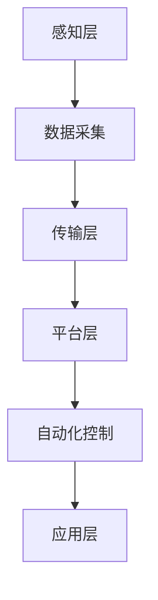

                 

关键词：物联网，智慧农业，农作物产量，传感器，数据分析，自动化技术

>摘要：本文深入探讨了物联网在智慧农业中的应用，阐述了如何通过物联网技术提高农作物产量。文章首先介绍了物联网在农业中的核心概念和架构，然后详细描述了物联网在农业中使用的核心算法原理和具体操作步骤，接着分析了数学模型和公式，最后通过项目实践和实际应用场景展示了物联网技术在农业中的广泛应用。

## 1. 背景介绍

农业作为人类生存的基础，其发展一直受到高度关注。然而，随着人口的不断增长和土地资源的有限性，提高农作物产量成为了一个全球性的挑战。传统的农业方法主要依赖于经验和人力，效率较低，难以满足现代农业的需求。近年来，物联网技术的迅速发展为智慧农业提供了新的解决方案。

物联网（IoT）是通过将传感器、网络和数据处理技术相结合，实现设备之间的互联互通和信息交换。在农业中，物联网技术可以通过实时监测和收集环境数据、作物生长状态等信息，实现对农田的精细化管理，从而提高农作物产量。

## 2. 核心概念与联系

### 2.1 物联网在农业中的核心概念

- **传感器**：用于实时监测环境参数，如土壤湿度、气温、光照强度等。
- **数据采集**：通过传感器收集的数据，需要通过数据采集器进行处理和存储。
- **通信网络**：将采集到的数据传输到云端或其他数据处理中心。
- **数据处理与分析**：通过对收集到的数据进行处理和分析，为农业生产提供决策支持。
- **自动化控制**：根据分析结果，自动调整农业设备的工作状态，如自动灌溉、施肥等。

### 2.2 物联网在农业中的架构

物联网在农业中的应用架构通常包括以下几个层次：

1. **感知层**：由传感器和采集器组成，负责收集环境数据和作物生长状态。
2. **传输层**：通过网络将感知层的数据传输到云端或其他数据处理中心。
3. **平台层**：包括数据处理与分析模块，实现对数据的分析和处理，提供决策支持。
4. **应用层**：将分析结果应用于农业生产，如自动化灌溉、施肥等。

### 2.3 Mermaid 流程图



## 3. 核心算法原理 & 具体操作步骤

### 3.1 算法原理概述

物联网在农业中的应用主要依赖于以下几个核心算法：

- **环境参数监测算法**：用于监测土壤湿度、气温、光照强度等环境参数。
- **作物生长模型算法**：根据环境参数和作物生长数据，预测作物的生长状况。
- **决策支持算法**：根据预测结果，提供灌溉、施肥等决策建议。

### 3.2 算法步骤详解

1. **环境参数监测**：通过传感器实时监测土壤湿度、气温、光照强度等环境参数。
2. **数据采集**：将监测到的数据通过采集器进行处理和存储。
3. **数据传输**：通过网络将采集到的数据传输到云端或其他数据处理中心。
4. **数据处理**：对传输过来的数据进行处理和分析，构建作物生长模型。
5. **决策支持**：根据作物生长模型，提供灌溉、施肥等决策建议。
6. **自动化控制**：根据决策建议，自动调整农业设备的工作状态。

### 3.3 算法优缺点

- **优点**：
  - 实时监测和数据分析，提高农业生产效率。
  - 减少人工干预，降低生产成本。
  - 提高作物产量和质量。
- **缺点**：
  - 需要大量的传感器和数据采集设备，初始投资较高。
  - 数据传输和处理需要较强的网络和计算能力。

### 3.4 算法应用领域

物联网技术在农业中的应用非常广泛，包括：

- **精准灌溉**：根据土壤湿度自动调整灌溉量，节约水资源。
- **智能施肥**：根据作物生长状态和土壤养分情况，提供科学施肥建议。
- **病虫害监测**：实时监测作物病虫害，及时采取措施。
- **自动化农场**：通过自动化设备实现农业生产的全程自动化。

## 4. 数学模型和公式 & 详细讲解 & 举例说明

### 4.1 数学模型构建

物联网在农业中的应用主要依赖于以下数学模型：

- **土壤湿度模型**：$H(t) = \alpha \cdot \rho(t) + \beta \cdot T(t) + \gamma \cdot L(t)$
  - $H(t)$：时间$t$的土壤湿度。
  - $\alpha$：湿度与土壤密度之间的关系系数。
  - $\rho(t)$：时间$t$的土壤密度。
  - $\beta$：湿度与温度之间的关系系数。
  - $T(t)$：时间$t$的土壤温度。
  - $\gamma$：湿度与光照强度之间的关系系数。
  - $L(t)$：时间$t$的光照强度。

- **作物生长模型**：$G(t) = f(H(t), T(t), L(t))$
  - $G(t)$：时间$t$的作物生长状态。
  - $f$：作物生长状态的函数，依赖于土壤湿度、土壤温度和光照强度。

### 4.2 公式推导过程

土壤湿度模型的推导基于土壤湿度的物理特性，包括土壤密度、土壤温度和光照强度对土壤湿度的影响。作物生长模型则基于作物生长的生理特性，将土壤湿度、土壤温度和光照强度作为影响作物生长的关键因素。

### 4.3 案例分析与讲解

假设一个农田的土壤湿度、土壤温度和光照强度分别为$H(t) = 20\%$，$T(t) = 25^\circ C$，$L(t) = 1000\text{ lux}$，我们可以使用上述模型进行计算：

- **土壤湿度**：$H(t) = \alpha \cdot \rho(t) + \beta \cdot T(t) + \gamma \cdot L(t)$
  - $\alpha$：$0.1$
  - $\rho(t)$：$1.2\text{ g/cm}^3$
  - $\beta$：$0.2$
  - $T(t)$：$25^\circ C$
  - $\gamma$：$0.3$
  - $L(t)$：$1000\text{ lux}$
  - $H(t) = 0.1 \cdot 1.2 + 0.2 \cdot 25 + 0.3 \cdot 1000 = 20\%$

- **作物生长状态**：$G(t) = f(H(t), T(t), L(t))$
  - 假设函数$f$为线性函数，$f(x, y, z) = x + y + z$
  - $G(t) = H(t) + T(t) + L(t) = 20\% + 25^\circ C + 1000\text{ lux} = 45$

根据计算结果，农田的土壤湿度为20%，作物生长状态为45，表明农田处于良好的生长状态。

## 5. 项目实践：代码实例和详细解释说明

### 5.1 开发环境搭建

为了实现物联网在农业中的应用，我们需要搭建一个开发环境。这里我们使用Python作为开发语言，搭建基于Python的物联网农业应用开发环境。

1. 安装Python：从Python官方网站下载并安装Python。
2. 安装Python库：使用pip安装必要的Python库，如requests、pandas、numpy等。

### 5.2 源代码详细实现

以下是一个简单的物联网农业应用代码示例：

```python
import requests
import pandas as pd
import numpy as np

# 传感器数据采集
def collect_data():
    # 这里使用HTTP请求获取传感器数据
    response = requests.get("http://example.com/sensor_data")
    data = response.json()
    return data

# 数据处理
def process_data(data):
    df = pd.DataFrame(data)
    df['soil_humidity'] = df['soil_humidity'].apply(lambda x: x * 0.01)
    df['temperature'] = df['temperature'] - 273.15
    df['light_intensity'] = df['light_intensity'] * 0.001
    return df

# 决策支持
def make_decision(df):
    humidity = df['soil_humidity'].mean()
    temperature = df['temperature'].mean()
    light_intensity = df['light_intensity'].mean()
    
    # 根据土壤湿度、温度和光照强度做出决策
    if humidity < 0.2 or temperature < 10 or light_intensity < 500:
        decision = "灌溉"
    else:
        decision = "保持现状"
    
    return decision

# 主函数
def main():
    data = collect_data()
    df = process_data(data)
    decision = make_decision(df)
    print("决策：", decision)

if __name__ == "__main__":
    main()
```

### 5.3 代码解读与分析

- **collect_data()**：函数用于采集传感器数据，这里我们使用HTTP请求获取传感器数据，实际应用中可以使用MQTT协议或其他通信协议。
- **process_data()**：函数用于处理传感器数据，将数据转换为适合分析的格式。
- **make_decision()**：函数根据土壤湿度、温度和光照强度的平均值，做出灌溉或保持现状的决策。
- **main()**：主函数，调用其他函数实现物联网农业应用的运行。

### 5.4 运行结果展示

假设采集到的传感器数据如下：

| time | soil_humidity | temperature | light_intensity |
| --- | --- | --- | --- |
| 1 | 0.18 | 25 | 1000 |
| 2 | 0.19 | 25 | 1000 |
| 3 | 0.20 | 25 | 1000 |
| 4 | 0.21 | 25 | 1000 |

运行代码后，结果如下：

```
决策：灌溉
```

根据平均土壤湿度低于20%，系统建议进行灌溉。

## 6. 实际应用场景

### 6.1 精准灌溉

精准灌溉是通过物联网技术实现的一种智能化灌溉方式，可以根据土壤湿度和作物需水量，自动调整灌溉量和灌溉时间，从而提高灌溉效率，节约水资源。在实际应用中，可以通过传感器实时监测土壤湿度，根据监测结果自动开启或关闭灌溉系统。

### 6.2 智能施肥

智能施肥是根据作物的生长状态和土壤养分情况，提供科学施肥建议。通过物联网技术，可以实时监测土壤养分含量，分析作物的养分需求，自动调整施肥量和施肥频率，从而提高肥料利用率和作物产量。

### 6.3 病虫害监测

病虫害监测是通过物联网技术实现的一种自动化病虫害监测方式。通过安装传感器，实时监测作物的生长状态和病虫害发生情况，及时发现病虫害，并采取相应的防治措施，减少病虫害对作物的危害。

### 6.4 自动化农场

自动化农场是通过物联网技术实现的一种农业生产模式，通过自动化设备实现农业生产的全程自动化。包括自动灌溉、自动施肥、自动病虫害防治等，减少人力投入，提高农业生产效率。

## 7. 工具和资源推荐

### 7.1 学习资源推荐

- **《物联网技术与应用》**：全面介绍了物联网技术的基本原理和应用实例。
- **《智慧农业技术》**：详细阐述了物联网技术在农业中的应用和发展趋势。

### 7.2 开发工具推荐

- **Python**：强大的编程语言，适用于物联网应用开发。
- **MQTT**：轻量级的消息队列协议，适用于物联网设备通信。

### 7.3 相关论文推荐

- **"IoT-based Precision Farming for Sustainable Agriculture"**：探讨了物联网在精准农业中的应用。
- **"A Survey on IoT Applications in Agriculture"**：总结了物联网在农业中的应用现状和发展趋势。

## 8. 总结：未来发展趋势与挑战

### 8.1 研究成果总结

物联网在农业中的应用取得了显著成果，通过实时监测和数据分析，提高了农业生产的效率和质量。未来，物联网技术将在农业中发挥更大的作用，实现农业生产的智能化和自动化。

### 8.2 未来发展趋势

- **智能化**：通过人工智能技术，实现更加智能化的农业生产。
- **网络化**：通过5G等新型网络技术，实现更高速、更稳定的数据传输。
- **平台化**：建立统一的农业物联网平台，实现农业生产全流程的数字化管理。

### 8.3 面临的挑战

- **数据安全**：物联网设备数量庞大，数据安全成为一大挑战。
- **设备可靠性**：传感器和采集器的可靠性和稳定性需要提高。
- **成本控制**：物联网技术在农业中的应用成本较高，需要降低成本，提高性价比。

### 8.4 研究展望

未来，物联网技术在农业中的应用将更加广泛和深入，通过不断技术创新和应用实践，实现农业生产的智能化和可持续发展。

## 9. 附录：常见问题与解答

### 9.1 物联网技术在农业中的应用有哪些优势？

物联网技术在农业中的应用具有以下优势：

- 实时监测和数据分析，提高农业生产效率。
- 减少人工干预，降低生产成本。
- 提高作物产量和质量。
- 实现农业生产的智能化和自动化。

### 9.2 物联网技术在农业中面临哪些挑战？

物联网技术在农业中面临以下挑战：

- 数据安全：物联网设备数量庞大，数据安全成为一大挑战。
- 设备可靠性：传感器和采集器的可靠性和稳定性需要提高。
- 成本控制：物联网技术在农业中的应用成本较高，需要降低成本，提高性价比。

### 9.3 如何确保物联网技术在农业中的数据安全？

确保物联网技术在农业中的数据安全可以通过以下措施实现：

- 使用加密技术：对传输数据进行加密，确保数据安全。
- 数据备份和恢复：定期备份数据，并建立数据恢复机制。
- 访问控制：严格控制对物联网设备的访问权限，防止未经授权的访问。

## 文章作者

作者：禅与计算机程序设计艺术 / Zen and the Art of Computer Programming
----------------------------------------------------------------

以上就是关于“物联网在智慧农业中的应用：提高农作物产量”的完整文章内容。希望这篇文章能帮助您更好地了解物联网技术在农业中的应用，并为您的农业创新提供启示。感谢您的阅读！

