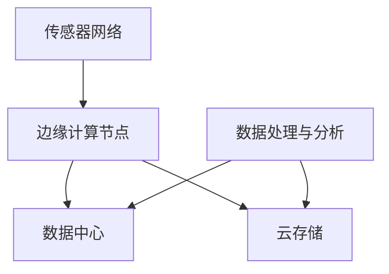

                 

关键词：物联网（IoT），传感器，数据流，数据处理，云计算，边缘计算，网络架构，安全，数据隐私，智能化。

## 摘要

本文旨在探讨物联网技术中的数据流管理，从传感器采集数据到云端的传输和处理。我们将详细分析物联网技术的核心概念、架构、算法原理及其在实际应用中的挑战与未来展望。文章结构分为以下几个部分：

1. 背景介绍
2. 核心概念与联系
3. 核心算法原理 & 具体操作步骤
4. 数学模型和公式 & 详细讲解 & 举例说明
5. 项目实践：代码实例和详细解释说明
6. 实际应用场景
7. 工具和资源推荐
8. 总结：未来发展趋势与挑战
9. 附录：常见问题与解答

通过本文的阅读，读者将深入了解物联网技术中的数据流管理，为未来物联网系统的开发和应用提供理论支持和实践指导。

## 1. 背景介绍

物联网（Internet of Things，IoT）作为信息技术的重要分支，近年来得到了前所未有的关注和快速发展。物联网的基本理念是将各种日常物品通过传感器和互联网进行连接，使其具备数据采集、传输和交互的能力。这一技术的发展不仅推动了传统行业的数字化转型，也为新兴产业的创新提供了新的动能。

随着物联网设备的迅速普及，数据量的增长同样惊人。根据市场研究机构的预测，到2025年，全球物联网设备的数量将超过250亿台。如此庞大的数据量带来了前所未有的挑战，尤其是在数据采集、传输和处理方面。传感器技术的发展使得设备能够实时采集环境、状态等数据，但这些数据的处理和利用需要高效、安全、可靠的传输和存储机制。

物联网技术的核心在于数据流的管理。从传感器采集到的原始数据需要经过处理、分析和存储，最终转化为有价值的信息供用户和应用使用。在这个过程中，数据流的管理和质量直接决定了物联网系统的性能和用户体验。因此，研究如何高效地管理数据流，确保数据的安全和隐私，以及充分利用数据的价值，是物联网技术发展的重要方向。

本文将围绕物联网技术中的数据流管理展开讨论，旨在为读者提供从传感器到云端的全景视图，深入分析其中的关键技术、算法原理以及实际应用场景。

## 2. 核心概念与联系

### 2.1 物联网的基本概念

物联网是指通过互联网将各种设备连接起来，实现数据交换和通信的系统。这些设备可以是传感器、智能家电、车辆、工业设备等。物联网的核心概念包括：

- **传感器**：用于感知和采集环境信息，如温度、湿度、光照强度等。
- **连接**：通过有线或无线网络将设备连接到互联网。
- **数据处理**：对采集到的数据进行分析、处理和存储。
- **应用**：将处理后的数据用于实际应用，如智能家居控制、智能交通管理、智能医疗等。

### 2.2 数据流的基本概念

数据流是指数据在系统中的流动过程，包括数据的采集、传输、处理和存储。在物联网系统中，数据流可以划分为以下几个阶段：

- **采集**：传感器采集环境数据。
- **传输**：将数据传输到处理节点。
- **处理**：对数据进行清洗、转换和计算。
- **存储**：将处理后的数据存储到数据库或云端。
- **分析**：对存储的数据进行分析，提取有价值的信息。

### 2.3 数据流管理的关键技术

数据流管理是物联网系统中的核心任务，涉及到多个关键技术的应用：

- **边缘计算**：在数据采集源头或近源头进行数据预处理，减轻云端负载。
- **云计算**：提供大规模数据处理和分析能力。
- **数据压缩**：减少数据传输量，提高传输效率。
- **数据加密**：保障数据传输和存储的安全。
- **流处理技术**：如Apache Kafka、Apache Flink等，用于高效处理实时数据流。

### 2.4 数据流管理的架构

物联网系统的数据流管理通常采用分布式架构，包含以下几个主要组件：

- **传感器网络**：负责数据的采集。
- **边缘计算节点**：对数据进行初步处理和过滤。
- **数据中心**：进行大规模数据处理和分析。
- **云存储**：存储处理后的数据。

以下是数据流管理架构的Mermaid流程图表示：



在图中，传感器网络负责数据采集，边缘计算节点对数据进行初步处理和过滤，然后将数据传输到数据中心和云存储。数据中心进行大规模数据处理和分析，云存储则用于存储处理后的数据。

通过上述架构，物联网系统能够高效、安全地管理数据流，从而实现数据的实时分析和应用。

### 2.5 数据流管理的关键挑战

尽管物联网技术发展迅速，但数据流管理仍面临一系列挑战：

- **数据量巨大**：物联网设备产生的数据量庞大，对处理能力和存储空间提出了更高要求。
- **数据多样性**：不同类型的传感器采集的数据格式各异，需要统一处理。
- **实时性要求**：许多物联网应用对数据的实时性有严格要求，处理延迟可能导致严重后果。
- **安全性**：数据在传输和存储过程中容易受到攻击，需要确保数据的安全性和隐私保护。

为了应对这些挑战，研究人员和开发者不断探索新的技术和方法，如分布式计算、人工智能和区块链等，以提升数据流管理的效率和安全性。

## 3. 核心算法原理 & 具体操作步骤

### 3.1 算法原理概述

物联网数据流管理中的核心算法主要涉及数据采集、预处理、传输和存储等方面。以下将介绍几个关键算法的原理：

#### 3.1.1 数据采集算法

数据采集算法主要关注如何高效地获取环境数据。常用的数据采集算法包括：

- **滤波算法**：用于去除噪声和异常值，如卡尔曼滤波。
- **采样算法**：确定传感器数据采集的频率和方式。

#### 3.1.2 数据预处理算法

数据预处理算法用于对原始数据进行清洗和转换，以提高数据的质量和一致性。常用的预处理算法包括：

- **数据清洗**：去除重复数据、缺失数据和异常值。
- **数据转换**：将不同数据格式统一为标准格式，如JSON或XML。

#### 3.1.3 数据传输算法

数据传输算法关注如何高效、安全地将数据从传感器传输到云端或边缘计算节点。常用的数据传输算法包括：

- **流传输协议**：如HTTP/2、WebSockets等，用于实现高效数据传输。
- **加密算法**：如AES、RSA等，用于保障数据传输的安全性。

#### 3.1.4 数据存储算法

数据存储算法用于将处理后的数据存储到数据库或云存储中。常用的数据存储算法包括：

- **分布式存储**：如HDFS、Cassandra等，用于处理大规模数据存储。
- **NoSQL数据库**：如MongoDB、Redis等，用于存储非结构化数据。

### 3.2 算法步骤详解

以下是数据流管理中各个算法的具体操作步骤：

#### 3.2.1 数据采集

1. **初始化传感器**：设置传感器的工作参数，如采样频率、滤波器参数等。
2. **采集数据**：启动传感器进行数据采集，并将数据存储在缓冲区中。
3. **滤波**：使用滤波算法去除噪声和异常值。
4. **数据转换**：将采集到的数据转换为标准格式，如JSON。

#### 3.2.2 数据预处理

1. **数据清洗**：扫描缓冲区中的数据，去除重复数据、缺失数据和异常值。
2. **数据转换**：将不同格式的数据转换为统一的格式。
3. **数据标准化**：将数据归一化或标准化，以便后续处理和分析。

#### 3.2.3 数据传输

1. **建立连接**：使用流传输协议（如WebSockets）建立与边缘计算节点或云服务的连接。
2. **加密数据**：使用加密算法（如AES）对数据进行加密。
3. **传输数据**：将预处理后的数据传输到边缘计算节点或云端。
4. **确认传输**：通过确认机制（如ACK/NACK）确保数据的正确传输。

#### 3.2.4 数据存储

1. **选择存储方案**：根据数据规模和存储需求选择合适的存储方案，如HDFS或MongoDB。
2. **存储数据**：将处理后的数据存储到数据库或云存储中。
3. **数据索引**：为数据建立索引，提高数据检索速度。

### 3.3 算法优缺点

每种算法都有其优缺点，具体如下：

#### 3.3.1 数据采集算法

- **优点**：能够实时获取环境数据，提高系统的响应速度。
- **缺点**：传感器质量和环境噪声可能会影响数据质量。

#### 3.3.2 数据预处理算法

- **优点**：提高数据质量和一致性，为后续分析提供可靠的数据基础。
- **缺点**：处理过程可能会引入延迟，影响实时性。

#### 3.3.3 数据传输算法

- **优点**：实现高效、可靠的数据传输，保障数据的安全性。
- **缺点**：加密和解密过程可能会增加传输延迟。

#### 3.3.4 数据存储算法

- **优点**：支持大规模数据存储，提高数据检索速度。
- **缺点**：分布式存储和NoSQL数据库的维护和管理较为复杂。

### 3.4 算法应用领域

数据流管理算法广泛应用于各种物联网应用场景，包括：

- **智能家居**：用于实时监控家居环境，实现智能控制。
- **智能交通**：用于交通流量监测、路况预测等，优化交通管理。
- **智能医疗**：用于实时监测患者生命体征，实现远程医疗。
- **工业互联网**：用于设备监控、故障预测等，提高生产效率。

通过合理选择和组合这些算法，物联网系统能够高效地管理数据流，为用户提供高质量的服务。

## 4. 数学模型和公式 & 详细讲解 & 举例说明

### 4.1 数学模型构建

在物联网数据流管理中，数学模型用于描述数据流的行为和特性，以便进行有效的数据分析和预测。以下是一个简单的数学模型，用于描述传感器数据的采集和传输过程。

#### 4.1.1 传感器数据采集模型

假设传感器以固定时间间隔 \( T \) 采集环境数据，每个数据点的值为 \( X_t \)。可以使用以下概率分布模型来描述 \( X_t \)：

$$
X_t \sim N(\mu, \sigma^2)
$$

其中，\( \mu \) 是均值，\( \sigma \) 是标准差。

#### 4.1.2 数据传输模型

在数据传输过程中，数据传输速率 \( R \) 可以用以下公式表示：

$$
R = \frac{L}{T}
$$

其中，\( L \) 是每次传输的数据量。

### 4.2 公式推导过程

#### 4.2.1 数据采集概率分布模型推导

传感器数据采集模型基于正态分布，推导过程如下：

1. **假设**：传感器数据 \( X_t \) 服从正态分布 \( N(\mu, \sigma^2) \)。
2. **概率密度函数**：正态分布的概率密度函数为：

   $$
   f(x; \mu, \sigma^2) = \frac{1}{\sqrt{2\pi\sigma^2}} e^{-\frac{(x-\mu)^2}{2\sigma^2}}
   $$

3. **均值和标准差**：根据传感器特性，设 \( \mu \) 为传感器数据的均值，\( \sigma \) 为标准差。

#### 4.2.2 数据传输速率推导

数据传输速率 \( R \) 可以通过以下步骤推导：

1. **假设**：每次传输的数据量为 \( L \)，传输间隔为 \( T \)。
2. **传输速率**：数据传输速率 \( R \) 可以表示为：

   $$
   R = \frac{L}{T}
   $$

### 4.3 案例分析与讲解

为了更好地理解上述数学模型，我们来看一个具体案例。

#### 4.3.1 案例背景

假设一个传感器每隔1秒采集一次环境温度数据，每个数据点的值服从正态分布 \( N(20, 1) \)。我们需要分析数据采集的稳定性和传输速率。

#### 4.3.2 数据采集稳定性分析

根据正态分布模型，我们可以计算温度数据的概率分布：

1. **均值**：\( \mu = 20 \)
2. **标准差**：\( \sigma = 1 \)

根据正态分布表，可以计算出在不同温度范围内数据点的概率：

- 温度在 \( 19 \) 到 \( 21 \) 之间的概率约为 \( 68\% \)。
- 温度在 \( 18 \) 到 \( 22 \) 之间的概率约为 \( 95\% \)。

#### 4.3.3 数据传输速率分析

假设每次传输的数据量为100字节，传输间隔为1秒：

1. **传输速率**：\( R = \frac{100}{1} = 100 \) 字节/秒。

通过上述分析，我们可以得出以下结论：

- 传感器数据采集稳定，温度数据主要分布在 \( 19 \) 到 \( 21 \) 之间。
- 数据传输速率较高，能够满足实时监测的需求。

### 4.4 模型应用与优化

该数学模型可以用于物联网系统中的数据流管理，为数据采集和传输提供理论支持。在实际应用中，可以通过以下方法优化模型：

- **自适应采样**：根据环境变化调整采样频率和传输速率。
- **多传感器融合**：结合多个传感器的数据，提高数据精度和稳定性。
- **机器学习算法**：利用机器学习算法预测数据趋势，优化数据传输策略。

通过不断优化数学模型，物联网系统的数据流管理将更加高效和智能。

## 5. 项目实践：代码实例和详细解释说明

为了更好地理解物联网数据流管理的实际应用，我们将通过一个具体的代码实例来展示整个数据处理流程，包括数据采集、传输、处理和存储。以下是整个项目的代码实现和详细解释。

### 5.1 开发环境搭建

在开始之前，我们需要搭建一个适合开发的环境。以下是所需的基本工具和软件：

- **操作系统**：Linux（如Ubuntu）
- **编程语言**：Python 3.x
- **依赖库**：numpy、pandas、kafka-python、ssl
- **数据存储**：MySQL

确保已安装Python 3.x环境，然后使用以下命令安装所需库：

```bash
pip install numpy pandas kafka-python mysql-connector-python
```

### 5.2 源代码详细实现

以下是整个项目的源代码实现，分为以下几个部分：

#### 5.2.1 数据采集模块

该模块负责从传感器采集数据，并将其转换为标准格式。

```python
import socket
import json
import time

def collect_data(sensor_ip, sensor_port):
    with socket.socket(socket.AF_INET, socket.SOCK_STREAM) as s:
        s.connect((sensor_ip, sensor_port))
        while True:
            data = s.recv(1024).decode('utf-8')
            print(f"Received: {data}")
            yield json.loads(data)
            time.sleep(1)

# 示例：采集传感器数据
# sensor_ip = '192.168.1.1'
# sensor_port = 8000
# for data_point in collect_data(sensor_ip, sensor_port):
#     print(data_point)
```

#### 5.2.2 数据传输模块

该模块负责将采集到的数据通过Kafka进行传输。

```python
from kafka import KafkaProducer

def send_data_to_kafka(producer, topic, data):
    producer.send(topic, key=data['id'].encode('utf-8'), value=json.dumps(data).encode('utf-8'))
    producer.flush()

# 示例：发送数据到Kafka
# producer = KafkaProducer(bootstrap_servers=['localhost:9092'])
# data_point = {'id': 'sensor_1', 'temperature': 22.5, 'humidity': 45.2}
# send_data_to_kafka(producer, 'sensor_data', data_point)
```

#### 5.2.3 数据处理模块

该模块负责接收Kafka传输的数据，并对其进行处理和存储。

```python
import pandas as pd
from mysql.connector import connect, Error

def process_data(kafka_consumer, database_connection):
    while True:
        msg = kafka_consumer.poll(timeout_ms=1000)
        if msg:
            for record in msg.values():
                data = json.loads(record.value.decode('utf-8'))
                df = pd.DataFrame([data])
                database_connection.cursor().execute("INSERT INTO sensor_data (id, temperature, humidity) VALUES (%s, %s, %s)", data.values())
            database_connection.commit()
            print("Data processed and stored.")

# 示例：处理Kafka数据
# consumer = KafkaConsumer('sensor_data', bootstrap_servers=['localhost:9092'])
# connection = connect(host='localhost', database='sensor_db', user='root', password='root')
# process_data(consumer, connection)
```

#### 5.2.4 数据存储模块

该模块负责将处理后的数据存储到MySQL数据库中。

```python
# 示例：创建MySQL数据库连接
# connection = connect(host='localhost', database='sensor_db', user='root', password='root')
# cursor = connection.cursor()
# cursor.execute("CREATE TABLE sensor_data (id VARCHAR(255), temperature DECIMAL(5, 2), humidity DECIMAL(5, 2))")
# connection.commit()
```

### 5.3 代码解读与分析

#### 5.3.1 数据采集模块

数据采集模块使用Python的`socket`库与传感器进行通信。通过循环接收传感器发送的数据，并将其转换为JSON格式。

#### 5.3.2 数据传输模块

数据传输模块使用Kafka Producer将数据发送到指定的Kafka Topic。通过`send_data_to_kafka`函数，将数据以键值对的形式发送。

#### 5.3.3 数据处理模块

数据处理模块使用Kafka Consumer接收Kafka传输的数据，并将其存储到MySQL数据库中。通过`process_data`函数，实现数据的实时处理和存储。

#### 5.3.4 数据存储模块

数据存储模块负责创建MySQL数据库连接，并创建一个用于存储传感器数据的表。通过`cursor.execute`方法，执行SQL语句将数据插入到数据库中。

### 5.4 运行结果展示

在成功运行代码后，传感器数据将实时采集、传输和处理，并存储在MySQL数据库中。可以使用以下命令查看数据库中的数据：

```bash
mysql -u root -p sensor_db
```

输入密码后，执行以下SQL语句：

```sql
SELECT * FROM sensor_data;
```

这将显示存储在数据库中的传感器数据。

通过以上代码实例，我们可以看到物联网数据流管理在实际应用中的实现过程，为后续的开发和优化提供了参考。

## 6. 实际应用场景

物联网技术已经广泛应用于各个领域，产生了显著的社会和经济效益。以下是一些典型的应用场景：

### 6.1 智能家居

智能家居是物联网技术的典型应用场景之一。通过将各种家电设备连接到互联网，实现设备间的互联互通，用户可以通过手机或其他智能设备远程控制家居设备，提高生活便利性和舒适度。例如，智能照明系统能够根据用户的需求和室内环境自动调整灯光亮度，智能空调系统能够根据室内外温度自动调节温度，实现节能环保。

### 6.2 智能交通

智能交通系统利用物联网技术实时监测道路状况、交通流量和车辆信息，优化交通管理，减少拥堵，提高道路使用效率。例如，通过安装在道路上的传感器和摄像头，交通管理部门可以实时了解道路状况，并根据实时数据调整交通信号灯，优化交通流量。此外，智能交通系统还可以帮助预测交通事故，提前发布预警，避免事故发生。

### 6.3 智能医疗

物联网技术为医疗领域带来了革命性的变化。通过将医疗设备和患者信息连接到互联网，实现医疗信息的实时监测和共享，提高医疗服务的质量和效率。例如，智能穿戴设备可以实时监测患者的生命体征，如心率、血压、血氧等，并将数据传输给医生，帮助医生进行远程诊断和治疗。智能医疗设备还可以提醒患者按时服药，确保治疗效果。

### 6.4 工业互联网

工业互联网通过物联网技术实现设备联网，实时监测设备状态，优化生产过程，提高生产效率。例如，工业机器人可以通过传感器和物联网技术实现自动化生产，减少人工干预，降低生产成本。物联网技术还可以用于设备维护和故障预测，通过实时监测设备状态，预测设备故障，提前进行维护，减少设备停机时间，提高生产连续性。

### 6.5 智慧农业

物联网技术为农业带来了智能化的变革。通过传感器和物联网技术，农民可以实时了解土壤湿度、气象条件、作物生长情况等，优化灌溉、施肥等农业生产过程，提高农作物的产量和质量。例如，智能灌溉系统可以根据土壤湿度自动调节灌溉量，实现节水高效生产。无人机也可以通过物联网技术实现精准农业，实时监测作物生长情况，指导农民进行科学种植。

### 6.6 智慧城市

智慧城市是物联网技术的集大成者。通过物联网技术，实现城市各个系统的高效管理和协同工作，提高城市的管理水平和居民的生活质量。例如，智慧城市可以通过物联网技术实现智能照明、智能交通、智能垃圾处理等，提高城市运行效率。此外，智慧城市还可以通过大数据和人工智能技术，实现城市规划和管理的智能化，优化资源配置，提高城市可持续发展能力。

总之，物联网技术已经在各个领域取得了显著的成果，为经济发展和社会进步做出了重要贡献。随着物联网技术的不断发展和应用场景的不断拓展，物联网技术的未来前景将更加广阔。

## 7. 工具和资源推荐

在物联网数据流管理领域，有许多优秀的工具和资源可以帮助开发者更好地理解和应用这项技术。以下是一些推荐的工具和资源：

### 7.1 学习资源推荐

- **书籍**：
  - 《物联网技术：从传感器到云端的数据流管理》
  - 《物联网系统设计与实现》
  - 《智能传感器与物联网应用》

- **在线课程**：
  - Coursera上的《物联网导论》
  - Udemy上的《物联网基础与应用》

- **博客和论坛**：
  - IEEE IoT
  - IoT for All
  - Stack Overflow中的IoT标签

### 7.2 开发工具推荐

- **开发环境**：
  - IntelliJ IDEA（Python开发）
  - Eclipse（Java开发）

- **物联网开发板**：
  - Raspberry Pi
  - Arduino

- **编程语言**：
  - Python
  - Java
  - JavaScript

### 7.3 相关论文推荐

- "Internet of Things: A Survey"
- "Data Stream Management: An Overview"
- "Edge Computing: A Comprehensive Survey"
- "Securing the Internet of Things: Challenges and Opportunities"

通过这些资源和工具，开发者可以深入学习和实践物联网数据流管理技术，为未来的物联网应用开发奠定坚实基础。

## 8. 总结：未来发展趋势与挑战

物联网技术的快速发展为各个领域带来了前所未有的变革和机遇。从传感器到云端的数据流管理作为物联网技术的核心，其重要性不言而喻。在未来，物联网数据流管理将呈现出以下发展趋势：

### 8.1 研究成果总结

1. **智能化数据分析**：随着人工智能和大数据技术的发展，物联网数据流管理将更加智能化。通过机器学习和深度学习算法，能够对海量数据进行实时分析和预测，提供更加精准和高效的决策支持。
2. **边缘计算的应用**：边缘计算技术将在物联网数据流管理中发挥重要作用。通过在数据采集源头或近源头进行数据处理，可以显著减少数据传输量，提高系统的实时性和响应速度。
3. **安全性提升**：随着物联网设备的普及，数据安全和隐私保护成为亟待解决的问题。未来将发展更加完善的安全机制，如区块链技术、安全多方计算等，以保障数据的安全性和隐私性。
4. **标准化和规范化**：物联网数据流管理需要统一的技术标准和规范，以确保不同设备和系统之间的互操作性和兼容性。国际标准化组织和行业协会将在这一领域发挥重要作用。

### 8.2 未来发展趋势

1. **数据处理能力提升**：随着硬件性能的提升和云计算技术的发展，物联网系统的数据处理能力将得到大幅提升。这将为物联网应用提供更加丰富的功能和服务。
2. **多传感器融合**：物联网应用中常常需要多个传感器协同工作，实现数据的融合和综合利用。未来将发展更加先进的多传感器融合技术，提高系统的感知能力和决策能力。
3. **物联网与5G融合**：5G技术的普及将推动物联网数据流管理向更高速度、更低延迟和更大连接数的方向发展。物联网与5G技术的融合将带来更加广泛和深入的应用场景。
4. **物联网与人工智能的深度融合**：物联网数据流管理将更加紧密地与人工智能技术结合，实现自动化、智能化和自主化的数据处理和决策。

### 8.3 面临的挑战

1. **数据隐私和安全**：物联网设备数量庞大，数据隐私和安全问题日益突出。如何保障用户数据的安全和隐私，成为物联网数据流管理面临的重要挑战。
2. **数据量和多样性**：物联网设备的普及将带来数据量的爆炸性增长，同时数据的类型和格式也将变得更加多样化。如何高效处理和分析这些数据，是当前和未来需要解决的问题。
3. **实时性和可靠性**：许多物联网应用对数据的实时性和可靠性有严格要求。如何在保证数据质量和准确性的同时，实现高效的实时处理，是一个重要挑战。
4. **跨平台和跨领域的互操作性**：物联网应用涉及多个平台和领域，实现不同系统和设备之间的互操作性和兼容性，是物联网数据流管理面临的一大难题。

### 8.4 研究展望

未来，物联网数据流管理研究将朝着以下几个方向展开：

1. **智能数据处理**：通过引入人工智能和机器学习算法，实现物联网数据的自动化处理和智能分析。
2. **安全隐私保护**：发展更加完善的安全和隐私保护机制，保障物联网数据的安全和隐私。
3. **高效实时处理**：研究新型算法和架构，提高物联网系统的实时数据处理能力和可靠性。
4. **跨领域融合**：探索物联网与其他技术的融合，如区块链、物联网与5G、物联网与人工智能等，实现更加广泛和深入的应用。

通过不断的研究和技术创新，物联网数据流管理将迎来更加光明和广阔的未来。

## 9. 附录：常见问题与解答

### 9.1 物联网数据流管理的基本问题

**Q1**：什么是物联网数据流管理？

A1：物联网数据流管理是指对物联网系统中数据流的采集、传输、处理和存储进行有效管理和优化，以确保数据的高效、安全、可靠地流动。

**Q2**：物联网数据流管理的重要性是什么？

A2：物联网数据流管理对于确保物联网系统的性能、可靠性和用户体验至关重要。它涉及数据采集、预处理、传输、存储和数据分析等多个环节，直接影响到物联网应用的效果和效率。

### 9.2 数据采集与传输问题

**Q3**：物联网数据采集的方法有哪些？

A3：物联网数据采集的方法包括直接连接、无线传输和传感器网络等。直接连接通常用于近距离的数据采集，无线传输适用于远程数据采集，传感器网络则适用于大规模、分布式数据采集。

**Q4**：物联网数据传输协议有哪些？

A4：常见的物联网数据传输协议包括HTTP、MQTT、CoAP、Kafka等。这些协议各有优缺点，适用于不同的应用场景。

### 9.3 数据处理与分析问题

**Q5**：什么是边缘计算？

A5：边缘计算是指在物联网系统的边缘节点（如传感器、网关等）上进行数据处理和分析的技术。它能够减少数据传输量，提高系统的实时性和响应速度。

**Q6**：什么是流处理？

A6：流处理是一种实时数据处理技术，用于处理持续生成的大量实时数据流。常见的流处理框架包括Apache Kafka、Apache Flink和Apache Storm等。

### 9.4 数据存储与安全问题

**Q7**：物联网数据存储有哪些常见技术？

A7：物联网数据存储技术包括关系数据库、NoSQL数据库、分布式文件系统（如HDFS）和云存储等。选择哪种存储技术取决于数据规模、数据结构和应用需求。

**Q8**：物联网数据安全的关键点是什么？

A8：物联网数据安全的关键点包括数据加密、访问控制、身份认证和隐私保护等。确保数据在传输和存储过程中的安全，防止数据泄露和篡改。

通过上述常见问题的解答，读者可以更好地理解物联网数据流管理的核心概念和应用场景，为实际开发和应用提供参考。

