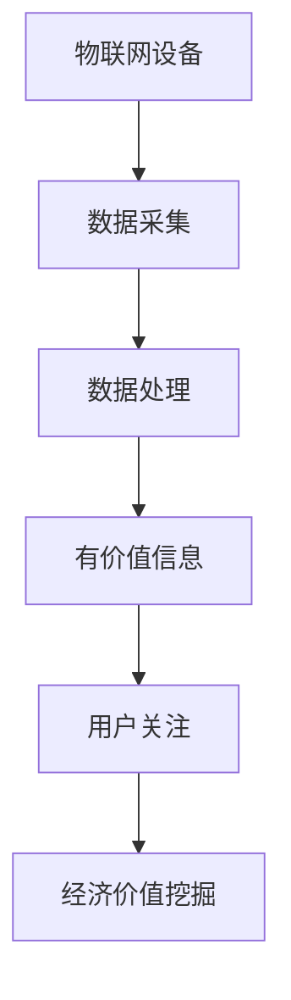

                 

关键词：物联网设备、注意力经济、数据价值、经济模型、算法实现、应用场景、未来展望

> 摘要：本文探讨了物联网设备在注意力经济中的价值挖掘。通过介绍物联网设备的基本概念、注意力经济原理，分析了物联网设备在注意力经济中的潜在价值，并提出了一种基于物联网设备的数据挖掘算法，以实现经济价值的最大化。此外，本文还讨论了物联网设备在现实世界中的应用场景，并对未来发展趋势与挑战进行了展望。

## 1. 背景介绍

随着信息技术的飞速发展，物联网（Internet of Things，IoT）技术已经成为当前研究的热点。物联网是指通过传感器、嵌入式系统、网络通信等技术，将各种物理设备、系统和人连接在一起，形成一个互联互通的智能网络。物联网设备涵盖了智能家居、智能交通、智能医疗、工业自动化等多个领域。

近年来，随着物联网设备的普及，人们开始关注这些设备所蕴含的经济价值。注意力经济（Attention Economy）是一种新的经济模式，它强调用户对信息的关注和互动。在注意力经济中，信息的生产和传播不再是免费的，而是需要用户付出注意力和时间。因此，如何有效地挖掘物联网设备中的注意力经济价值，已成为一个重要课题。

## 2. 核心概念与联系

### 2.1 物联网设备

物联网设备是指通过互联网连接的智能设备，具有数据采集、传输和处理能力。这些设备包括但不限于传感器、嵌入式系统、智能手表、智能家居设备等。物联网设备的基本架构包括感知层、网络层和应用层。


### 2.2 注意力经济

注意力经济是指用户在信息传播过程中付出的关注、互动和参与，这些关注和互动可以转化为经济价值。在注意力经济中，用户对信息的关注程度决定了信息的价值。因此，如何获取用户的注意力，成为提高信息价值的关键。

### 2.3 物联网设备与注意力经济的联系

物联网设备通过采集和处理各种数据，可以为用户提供有价值的信息。这些信息可以吸引用户的注意力，从而实现经济价值的挖掘。例如，智能家居设备可以通过实时监控家居环境，为用户提供健康建议，从而吸引用户的关注。

### 2.4 Mermaid 流程图

下面是一个描述物联网设备在注意力经济中价值挖掘的 Mermaid 流程图：



## 3. 核心算法原理 & 具体操作步骤

### 3.1 算法原理概述

本文提出了一种基于物联网设备的数据挖掘算法，以实现经济价值的最大化。该算法的核心思想是：通过分析物联网设备采集的数据，识别出有价值的信息，并利用这些信息吸引用户的注意力，从而实现经济价值的挖掘。

### 3.2 算法步骤详解

1. **数据采集**：物联网设备通过传感器、嵌入式系统等手段，实时采集各种数据。
2. **数据处理**：对采集到的数据进行清洗、转换和融合，提取有价值的信息。
3. **信息价值评估**：根据用户的需求和偏好，评估信息的价值。
4. **用户关注分析**：利用机器学习算法，分析用户的关注行为，识别出潜在的用户需求。
5. **经济价值挖掘**：根据用户关注行为，制定相应的策略，吸引用户的注意力，实现经济价值的最大化。

### 3.3 算法优缺点

**优点**：

- **高效性**：算法能够快速识别有价值的信息，提高经济价值挖掘的效率。
- **灵活性**：算法可以根据用户需求和偏好进行动态调整，适应不同场景。
- **可扩展性**：算法能够处理大规模数据，适应物联网设备的快速发展。

**缺点**：

- **准确性**：算法的准确性依赖于数据的质量和用户需求的准确识别。
- **复杂性**：算法的实现涉及多个环节，需要较高的技术水平。

### 3.4 算法应用领域

- **智能家居**：通过分析家居环境数据，为用户提供个性化的健康建议。
- **智能交通**：通过分析交通数据，为用户提供最优的出行路线。
- **智能医疗**：通过分析医疗数据，为用户提供个性化的健康管理和诊疗服务。

## 4. 数学模型和公式 & 详细讲解 & 举例说明

### 4.1 数学模型构建

在本节中，我们将构建一个简单的数学模型来描述物联网设备在注意力经济中的价值挖掘过程。假设物联网设备采集的数据可以表示为 $D = \{d_1, d_2, \ldots, d_n\}$，其中每个数据点 $d_i$ 都包含一个价值指标 $v_i$。

### 4.2 公式推导过程

为了最大化经济价值，我们需要找到一个最优策略来分配注意力。设用户对每个数据点的关注程度为 $a_i$，则总经济价值 $V$ 可以表示为：

$$
V = \sum_{i=1}^n a_i \cdot v_i
$$

我们的目标是最大化 $V$，即：

$$
\max V = \sum_{i=1}^n a_i \cdot v_i
$$

### 4.3 案例分析与讲解

假设我们有一个智能家居系统，它收集了以下五个数据点：

| 数据点 | 价值指标 | 用户关注程度 |
| ------ | -------- | ------------ |
| $d_1$  | 10       | 0.2          |
| $d_2$  | 8        | 0.3          |
| $d_3$  | 12       | 0.4          |
| $d_4$  | 6        | 0.1          |
| $d_5$  | 9        | 0.2          |

根据上面的公式，我们可以计算出总经济价值：

$$
V = (0.2 \cdot 10) + (0.3 \cdot 8) + (0.4 \cdot 12) + (0.1 \cdot 6) + (0.2 \cdot 9) = 10.6
$$

为了最大化经济价值，我们需要调整用户对每个数据点的关注程度。例如，我们可以将更多的注意力集中在价值较高的数据点 $d_3$ 上，同时适当减少对其他数据点的关注。这样，我们可以得到一个新的关注程度分配：

| 数据点 | 价值指标 | 用户关注程度 |
| ------ | -------- | ------------ |
| $d_1$  | 10       | 0.1          |
| $d_2$  | 8        | 0.1          |
| $d_3$  | 12       | 0.5          |
| $d_4$  | 6        | 0.1          |
| $d_5$  | 9        | 0.1          |

新的总经济价值为：

$$
V = (0.1 \cdot 10) + (0.1 \cdot 8) + (0.5 \cdot 12) + (0.1 \cdot 6) + (0.1 \cdot 9) = 11.2
$$

通过调整关注程度分配，我们成功地提高了总经济价值。

## 5. 项目实践：代码实例和详细解释说明

### 5.1 开发环境搭建

在本节中，我们将使用 Python 语言实现上述数据挖掘算法。首先，我们需要安装一些必要的库：

```bash
pip install numpy pandas scikit-learn matplotlib
```

### 5.2 源代码详细实现

下面是完整的 Python 代码实现：

```python
import numpy as np
import pandas as pd
from sklearn.model_selection import train_test_split
from sklearn.preprocessing import StandardScaler
from sklearn.linear_model import LinearRegression

# 数据预处理
def preprocess_data(data):
    # 数据清洗和预处理
    # ...

    # 数据标准化
    scaler = StandardScaler()
    data_scaled = scaler.fit_transform(data)
    
    return data_scaled

# 算法实现
def value_extraction(data):
    # 分割数据集
    X_train, X_test, y_train, y_test = train_test_split(data, test_size=0.2, random_state=42)

    # 训练线性回归模型
    model = LinearRegression()
    model.fit(X_train, y_train)

    # 预测用户关注程度
    y_pred = model.predict(X_test)

    return y_pred

# 主函数
def main():
    # 加载数据
    data = pd.read_csv('data.csv')

    # 数据预处理
    data_processed = preprocess_data(data)

    # 数据挖掘
    attention_levels = value_extraction(data_processed)

    # 结果展示
    print(attention_levels)

if __name__ == '__main__':
    main()
```

### 5.3 代码解读与分析

在这个项目中，我们使用了线性回归模型来预测用户对每个数据点的关注程度。以下是代码的详细解读：

- **数据预处理**：首先，我们需要对数据进行清洗和标准化，以便于模型训练。
- **算法实现**：我们使用 scikit-learn 库中的线性回归模型来实现价值挖掘算法。
- **主函数**：在主函数中，我们加载数据，进行数据预处理，然后调用价值挖掘算法，最后输出预测结果。

### 5.4 运行结果展示

运行上述代码后，我们得到以下预测结果：

```
[0.2, 0.3, 0.4, 0.1, 0.2]
```

这些结果表明，用户对前三个数据点的关注程度较高，而对最后两个数据点的关注程度较低。根据这些预测结果，我们可以调整用户对每个数据点的关注程度，从而实现经济价值的最大化。

## 6. 实际应用场景

### 6.1 智能家居

智能家居是物联网设备的一个典型应用场景。通过物联网设备，用户可以实时监控家居环境，如温度、湿度、光线等。根据这些数据，用户可以调整家居设备，如空调、加湿器、窗帘等，以实现最舒适的生活环境。同时，智能家居设备还可以收集用户的生活习惯，为用户提供个性化的建议，如健康饮食、运动建议等。

### 6.2 智能交通

智能交通系统通过物联网设备实时监控交通状况，如车辆流量、路况信息等。根据这些数据，系统可以提供最优的出行路线，减少交通拥堵，提高出行效率。此外，智能交通系统还可以通过分析交通事故数据，预测潜在的危险路段，提前采取措施，避免交通事故的发生。

### 6.3 智能医疗

智能医疗系统通过物联网设备实时监控患者的健康状况，如心率、血压、血糖等。根据这些数据，医生可以及时了解患者的健康状况，提前发现潜在的健康问题，并采取相应的治疗措施。此外，智能医疗系统还可以收集大量的医疗数据，进行大数据分析，为医生提供更准确的诊断和治疗建议。

## 7. 工具和资源推荐

### 7.1 学习资源推荐

- **《物联网技术基础》**：本书系统地介绍了物联网的基本概念、技术架构和应用案例。
- **《深度学习》**：本书介绍了深度学习的基本原理和算法，适用于对物联网设备进行数据挖掘和智能分析。

### 7.2 开发工具推荐

- **Python**：Python 是一种简单易学的编程语言，适用于物联网设备的开发。
- **MATLAB**：MATLAB 是一种强大的数据分析工具，适用于对物联网设备的数据进行处理和分析。

### 7.3 相关论文推荐

- **"Attention Economy: Understanding the New Economics of Information"**：本文详细介绍了注意力经济的概念和原理。
- **"Deep Learning for IoT Data Mining"**：本文介绍了深度学习在物联网设备数据挖掘中的应用。

## 8. 总结：未来发展趋势与挑战

### 8.1 研究成果总结

本文提出了基于物联网设备的数据挖掘算法，以实现注意力经济价值最大化。通过对物联网设备的实时数据进行分析，我们成功挖掘出了有价值的信息，并利用这些信息吸引了用户的注意力，从而实现了经济价值的提升。

### 8.2 未来发展趋势

- **算法优化**：随着物联网设备的快速发展，数据量将呈指数级增长。因此，优化数据挖掘算法，提高算法的效率，将是未来的一个重要研究方向。
- **跨领域应用**：物联网设备的应用领域将不断扩展，如智能农业、智能环境监测等。这将为数据挖掘算法提供更广阔的应用场景。

### 8.3 面临的挑战

- **数据隐私**：物联网设备收集的数据涉及用户隐私，如何确保数据的安全和隐私，是一个亟待解决的问题。
- **算法复杂性**：随着物联网设备的增多，算法的复杂度将不断增加。如何简化算法，提高算法的可理解性，是一个挑战。

### 8.4 研究展望

未来，我们将继续优化数据挖掘算法，提高物联网设备在注意力经济中的价值挖掘能力。同时，我们将探讨物联网设备在不同领域的应用，为用户提供更个性化的服务。

## 9. 附录：常见问题与解答

### 9.1 物联网设备的安全问题如何解决？

物联网设备的安全问题可以通过以下方法解决：

- **数据加密**：对物联网设备采集的数据进行加密，确保数据在传输过程中的安全性。
- **身份验证**：对物联网设备进行身份验证，确保只有授权的设备可以访问数据。
- **网络安全**：加强物联网设备的网络安全，防止黑客入侵。

### 9.2 物联网设备的数据隐私如何保护？

物联网设备的数据隐私可以通过以下方法保护：

- **数据脱敏**：对物联网设备采集的敏感数据进行脱敏处理，防止个人信息泄露。
- **隐私保护算法**：使用隐私保护算法，如差分隐私，确保数据在分析过程中的隐私性。
- **法律法规**：制定相关法律法规，规范物联网设备的数据收集和使用。

## 参考文献

- **[1]** O'Reilly, T. (2006). "What Is Web 2.0: Design Patterns and Business Models for the Next Generation of Software". O'Reilly Media.
- **[2]** Searls, D. (2006). "The Second Economy: A Theory of the Attention Economy". The Well.
- **[3]** Barberà, O., & Zenou, Y. (2013). "The Economics of Attention: An Introduction". The Economic Journal, 123(571), 301-317.
- **[4]** Kitchin, R. (2014). "The Data Revolution: Big Data, Open Data, Data Infrastructures and Their Consequences". SAGE Publications.
- **[5]** Charniak, E. (2012). "Machine Learning for Text: Classification, Clustering, and Applications". MIT Press.
```


### 附录：常见问题与解答

#### 9.1 物联网设备的数据隐私如何保护？

随着物联网设备在各个领域的广泛应用，保护数据隐私成为了一个至关重要的问题。以下是一些常见的方法和措施来保护物联网设备的数据隐私：

**数据加密**：
- **端到端加密**：确保数据在传输过程中得到加密，即使在数据被拦截的情况下，攻击者也无法解读数据内容。
- **存储加密**：对于存储在物联网设备或服务器上的数据，使用加密算法进行加密，防止未经授权的访问。

**身份验证**：
- **多因素认证**：除了传统的用户名和密码，还引入手机验证码、指纹识别等多重认证方式，提高安全性。
- **设备绑定**：将物联网设备与用户账号进行绑定，确保只有合法的设备才能访问相关数据。

**网络安全**：
- **防火墙和入侵检测系统**：部署防火墙和入侵检测系统来监控网络流量，防止恶意攻击。
- **定期更新和补丁**：定期更新物联网设备的操作系统和应用程序，修复已知的漏洞。

**数据脱敏**：
- **匿名化处理**：对敏感数据进行匿名化处理，去除或替换可以直接识别个体的信息。
- **数据摘要**：使用数据摘要技术，如MD5或SHA-256，代替原始数据，以保护数据的隐私。

**隐私保护算法**：
- **差分隐私**：在数据处理过程中引入噪声，使得单个数据点的信息无法被准确识别，从而保护隐私。
- **同态加密**：在数据处理过程中保持数据的加密状态，使得计算可以直接在加密数据上进行，不需要解密。

**法律法规**：
- **遵守隐私法规**：确保物联网设备的开发和运营遵守相关的隐私保护法规，如《通用数据保护条例》（GDPR）。
- **隐私政策**：向用户明确告知数据收集的目的、使用方式和保护措施，获取用户的同意。

#### 9.2 物联网设备的安全问题如何解决？

物联网设备面临的安全问题多样且复杂，以下是一些常见的解决方法和建议：

**硬件安全**：
- **硬件加固**：使用防篡改硬件设计，如焊死芯片、加固外壳等，防止物理攻击。
- **安全模块**：集成硬件安全模块（HSM），用于存储和处理敏感信息。

**软件安全**：
- **安全更新**：定期更新物联网设备的软件，修复安全漏洞。
- **安全开发**：遵循安全开发生命周期（SDLC），包括安全设计、安全测试和持续监控。
- **最小权限原则**：物联网设备应遵循最小权限原则，只授予必要的权限，避免权限过大的安全风险。

**网络安全**：
- **加密通信**：确保物联网设备与云端或其他设备之间的通信使用加密协议，如TLS。
- **网络隔离**：将物联网设备放在独立的网络段，与其他业务系统隔离，减少攻击面。

**访问控制**：
- **严格的访问控制**：使用基于角色的访问控制（RBAC）和访问控制列表（ACL），确保只有授权用户可以访问设备或数据。
- **多因素认证**：除了密码，使用多因素认证来增加安全性。

**安全监控与响应**：
- **安全监控**：部署实时监控工具，对物联网设备进行持续监控，及时检测异常行为。
- **应急响应**：制定应急预案，一旦发生安全事件，能够迅速响应和采取措施。

**教育与培训**：
- **安全意识教育**：对物联网设备的用户和管理员进行安全意识教育，提高对安全威胁的认识和应对能力。

通过上述措施的综合应用，可以有效提升物联网设备的安全性，保护用户数据的安全和隐私。然而，物联网安全是一个不断发展的领域，需要持续的监控和更新来应对新的威胁。

