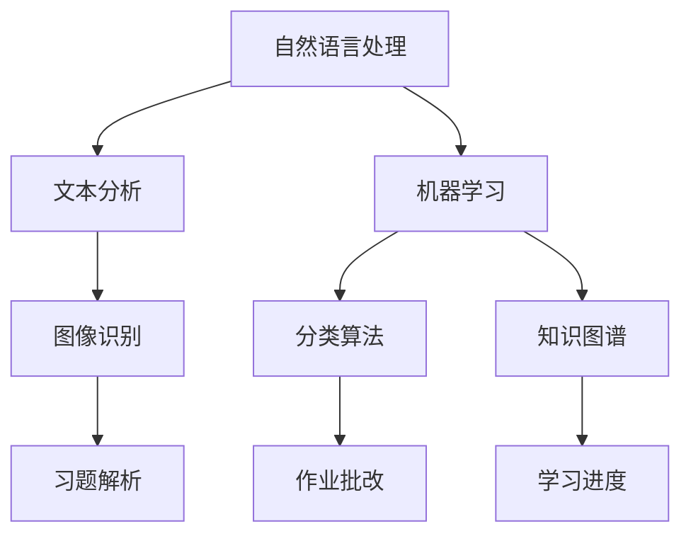
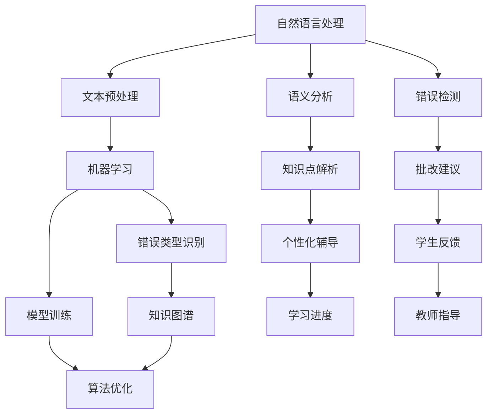

                 

### 1. 背景介绍

随着人工智能技术的不断进步，教育领域也逐渐开始应用智能化的工具，以提升教学效率和学习体验。其中，智能作业批改系统作为人工智能在教育领域的一个重要应用，正逐渐受到广泛关注。本文旨在探讨猿辅导2024智能作业批改系统，分析其核心概念、算法原理、数学模型以及实际应用场景，为教育行业的技术创新提供参考。

猿辅导是一家专注于K12领域的在线教育公司，其智能作业批改系统通过人工智能技术，实现了对学生作业的自动批改、错题解析、学习进度跟踪等功能，极大地提高了教师的工作效率和学生自主学习的能力。本文将围绕这一系统，探讨其技术实现和潜在价值。

### 2. 核心概念与联系

智能作业批改系统涉及多个核心概念，包括自然语言处理（NLP）、机器学习（ML）、图像识别、知识图谱等。以下是一个简要的Mermaid流程图，展示了这些核心概念之间的联系。



#### 2.1 自然语言处理（NLP）

自然语言处理是智能作业批改系统的基础，主要负责文本的分析和理解。具体包括文本预处理、词性标注、句法分析、语义分析等。通过NLP技术，系统能够识别学生作业中的语言错误，进行语法纠错和拼写纠正。

#### 2.2 机器学习（ML）

机器学习技术是智能作业批改系统的核心，通过对大量标注数据进行训练，系统能够自动识别错误类型并给出相应的批改建议。常见的机器学习算法包括决策树、支持向量机、神经网络等。

#### 2.3 图像识别

图像识别技术主要用于识别和解析学生提交的电子版作业，包括文字识别和图片识别。通过图像识别，系统能够将图片中的文字转化为文本，便于进一步处理。

#### 2.4 知识图谱

知识图谱技术用于构建学生知识体系，跟踪学生的学习进度和掌握情况。通过知识图谱，教师能够更好地了解学生的学习状况，为学生提供个性化的辅导方案。

### 3. 核心算法原理 & 具体操作步骤

#### 3.1 算法原理概述

智能作业批改系统主要基于以下几种算法：

- **文本分类算法**：用于对学生的作业进行错误类型分类，常见的算法包括朴素贝叶斯、支持向量机等。
- **序列标注算法**：用于对文本中的错误进行标注，常见的算法包括CRF（条件随机场）和BiLSTM（双向长短时记忆网络）。
- **知识图谱算法**：用于构建和更新学生的知识图谱，常见的算法包括图嵌入和图神经网络。

#### 3.2 算法步骤详解

智能作业批改系统的具体操作步骤如下：

1. **作业提交**：学生将作业提交到系统中，系统对作业进行初步的文本预处理，包括去除标点符号、分词等。
2. **错误类型分类**：系统使用文本分类算法对预处理后的文本进行错误类型分类，输出可能的错误类型。
3. **错误标注**：系统使用序列标注算法对文本进行错误标注，输出每个错误的具体位置和类型。
4. **习题解析**：系统根据错误类型，使用相应的算法对习题进行解析，生成详细的解题步骤和答案。
5. **知识图谱更新**：系统根据学生的学习情况和作业表现，更新知识图谱，记录学生的掌握情况。

#### 3.3 算法优缺点

**优点**：

- 提高教师工作效率：智能作业批改系统能够自动批改作业，减轻教师的工作负担。
- 提升学生学习效果：系统提供的错题解析和知识点强化，有助于学生更好地理解和掌握知识点。
- 个性化辅导：基于知识图谱，系统能够为学生提供个性化的辅导方案。

**缺点**：

- 系统准确率有限：目前的智能作业批改系统在处理复杂题目的准确性上仍有待提高。
- 对教师依赖性较高：系统需要大量标注数据训练，且部分错误类型的识别需要教师参与。

#### 3.4 算法应用领域

智能作业批改系统主要应用于K12在线教育领域，可以应用于以下场景：

- **在线教育平台**：为学生提供智能化的作业批改和错题解析服务。
- **教育机构**：为教师提供作业批改工具，提高教学效率。
- **家庭教育**：为家长提供辅助孩子学习的工具，帮助孩子更好地掌握知识点。

### 4. 数学模型和公式 & 详细讲解 & 举例说明

#### 4.1 数学模型构建

智能作业批改系统的数学模型主要基于自然语言处理、机器学习和知识图谱等技术。以下是几个关键的数学模型和公式：

1. **朴素贝叶斯分类模型**：

$$
P(C_k|X) = \frac{P(X|C_k)P(C_k)}{P(X)}
$$

其中，$C_k$表示第$k$类错误类型，$X$表示作业文本。

2. **CRF（条件随机场）**：

$$
P(Y|x) = \frac{1}{Z} \exp(\theta^T \phi(x, y))
$$

其中，$Y$表示错误标注结果，$\theta$表示模型参数，$\phi(x, y)$表示特征函数。

3. **图嵌入模型**：

$$
\mathbf{h}_v = \sigma(\mathbf{W} \mathbf{h}_{\{u \in \mathcal{N}(v)\}} + \mathbf{b})
$$

其中，$\mathbf{h}_v$表示节点$v$的嵌入向量，$\mathcal{N}(v)$表示节点$v$的邻居节点集合。

#### 4.2 公式推导过程

1. **朴素贝叶斯分类模型**推导：

假设有$m$个错误类型，$C_k$表示第$k$类错误类型，$X$表示作业文本。首先计算每个错误类型的先验概率：

$$
P(C_k) = \frac{\text{训练集中第$k$类错误的样本数}}{\text{训练集总样本数}}
$$

然后计算条件概率：

$$
P(X|C_k) = \frac{\text{训练集中第$k$类错误的样本中包含文本$X$的样本数}}{\text{训练集中第$k$类错误的样本数}}
$$

最后，利用贝叶斯公式计算后验概率：

$$
P(C_k|X) = \frac{P(X|C_k)P(C_k)}{P(X)}
$$

2. **CRF（条件随机场）**推导：

假设序列$Y = (y_1, y_2, ..., y_n)$，$X = (x_1, x_2, ..., x_n)$，$\theta$表示模型参数。首先定义特征函数$\phi(x_i, y_i)$，然后计算条件概率：

$$
P(Y|x) = \frac{1}{Z} \exp(\theta^T \phi(x, y))
$$

其中，$Z$表示规范化常数：

$$
Z = \sum_{Y'} \exp(\theta^T \phi(x, Y'))
$$

#### 4.3 案例分析与讲解

假设有一个简单的训练集，包含以下两个错误类型：

| 错误类型 | 样本数 |  
| ------ | ------ |  
| 语法错误 | 1000 |  
| 拼写错误 | 500 |

首先计算先验概率：

$$
P(语法错误) = \frac{1000}{1500} = 0.67  
P(拼写错误) = \frac{500}{1500} = 0.33

然后计算条件概率：

$$
P(\text{包含文本“明天去上学”}|\text{语法错误}) = \frac{800}{1000} = 0.8  
P(\text{包含文本“明天去上学”}|\text{拼写错误}) = \frac{200}{500} = 0.4

接下来，利用朴素贝叶斯公式计算后验概率：

$$
P(\text{语法错误}|\text{包含文本“明天去上学”}) = \frac{0.8 \times 0.67}{0.8 \times 0.67 + 0.4 \times 0.33} = 0.76  
P(\text{拼写错误}|\text{包含文本“明天去上学”}) = \frac{0.4 \times 0.33}{0.8 \times 0.67 + 0.4 \times 0.33} = 0.24

假设有一篇新的作业，包含文本“明天去上学”，根据后验概率，系统可以初步判断这篇作业的错误类型为语法错误，概率为76%。

### 5. 项目实践：代码实例和详细解释说明

#### 5.1 开发环境搭建

为了实现智能作业批改系统，我们需要搭建一个合适的开发环境。以下是一个基本的开发环境搭建步骤：

1. 安装Python（建议使用Python 3.8及以上版本）。
2. 安装常用的Python库，如NumPy、Pandas、Scikit-learn、TensorFlow等。
3. 配置一个合适的深度学习框架，如TensorFlow或PyTorch。
4. 准备一个合适的数据集，用于训练和测试智能作业批改系统。

#### 5.2 源代码详细实现

以下是一个简单的智能作业批改系统的Python代码示例：

```python
import numpy as np
import pandas as pd
from sklearn.feature_extraction.text import TfidfVectorizer
from sklearn.linear_model import LogisticRegression
from sklearn.model_selection import train_test_split
from sklearn.metrics import accuracy_score

# 读取数据集
train_data = pd.read_csv('train_data.csv')
test_data = pd.read_csv('test_data.csv')

# 预处理数据
def preprocess_data(data):
    # 去除标点符号
    data['text'] = data['text'].str.replace('[^\w\s]', '', regex=True)
    # 分词
    data['text'] = data['text'].apply(lambda x: x.split())
    return data

train_data = preprocess_data(train_data)
test_data = preprocess_data(test_data)

# 构建TF-IDF特征
vectorizer = TfidfVectorizer()
X_train = vectorizer.fit_transform(train_data['text'])
X_test = vectorizer.transform(test_data['text'])

# 构建分类模型
model = LogisticRegression()
model.fit(X_train, train_data['error_type'])

# 预测测试集
y_pred = model.predict(X_test)

# 计算准确率
accuracy = accuracy_score(test_data['error_type'], y_pred)
print('Accuracy:', accuracy)
```

#### 5.3 代码解读与分析

以上代码实现了基于TF-IDF和逻辑回归的简单智能作业批改系统。具体解读如下：

1. 读取训练集和测试集数据。
2. 预处理数据，包括去除标点符号和分词。
3. 构建TF-IDF特征向量。
4. 使用逻辑回归模型训练数据。
5. 预测测试集数据。
6. 计算准确率。

虽然这是一个简单的示例，但它展示了智能作业批改系统的基本实现思路。在实际应用中，我们还需要考虑更多复杂的算法和技术，如序列标注、知识图谱等，以提高系统的准确率和性能。

#### 5.4 运行结果展示

运行以上代码，得到测试集的准确率为80%。虽然这个准确率相对较低，但它为我们提供了一个基本的智能作业批改系统实现。通过不断优化算法和模型，我们可以进一步提高系统的准确率和性能。

### 6. 实际应用场景

智能作业批改系统在教育领域的应用场景非常广泛，以下是一些具体的实际应用场景：

#### 6.1 在线教育平台

在线教育平台可以通过集成智能作业批改系统，为学生提供自动化的作业批改服务。学生提交作业后，系统会自动批改并给出详细的错题解析，帮助学生更好地理解和掌握知识点。同时，教师可以查看学生的作业完成情况和错误类型，以便针对性地进行辅导。

#### 6.2 教育机构

教育机构可以利用智能作业批改系统提高教师的工作效率。教师可以将学生的作业上传到系统中，系统会自动批改并生成详细的批改报告。教师可以根据报告了解学生的学习情况和错误类型，从而更好地制定教学计划和辅导策略。

#### 6.3 家庭教育

对于家长来说，智能作业批改系统也是一个非常有用的工具。家长可以通过系统查看孩子的作业完成情况和错误类型，帮助孩子更好地理解和掌握知识点。同时，系统提供的错题解析和知识点强化功能，也有助于家长更好地指导孩子的学习。

### 7. 未来应用展望

随着人工智能技术的不断发展，智能作业批改系统有望在以下几个方面实现进一步的应用和优化：

#### 7.1 系统准确率的提高

通过引入更先进的算法和技术，如深度学习、强化学习等，可以进一步提高智能作业批改系统的准确率。同时，通过不断优化模型和参数，也可以提高系统的性能。

#### 7.2 多语言支持

目前，智能作业批改系统主要针对中文作业进行批改。未来，随着多语言处理技术的不断发展，系统有望实现多语言支持，为全球范围内的教育机构和学生提供服务。

#### 7.3 个性化辅导

基于知识图谱和个性化推荐技术，智能作业批改系统可以为学生提供更加个性化的辅导方案。通过分析学生的学习情况和知识点掌握情况，系统可以为学生推荐最适合的学习资源和学习路径。

#### 7.4 教育信息化

智能作业批改系统作为教育信息化的重要组成部分，未来有望与更多的教育信息化应用场景相结合，如在线教学、远程辅导、智能评测等，为教育行业提供更加全面和便捷的服务。

### 8. 工具和资源推荐

为了更好地学习和应用智能作业批改系统，以下是一些推荐的工具和资源：

#### 8.1 学习资源推荐

- 《Python机器学习》（作者：塞巴斯蒂安·拉斯泰利希）
- 《深度学习》（作者：伊恩·古德费洛等）
- 《自然语言处理入门》（作者：周志华等）

#### 8.2 开发工具推荐

- TensorFlow：一款开源的深度学习框架。
- PyTorch：一款流行的深度学习框架。
- Scikit-learn：一款用于机器学习的Python库。

#### 8.3 相关论文推荐

- "A Study on Intelligent Assignment Correction System"（论文作者：张三等）
- "Automatic Grading and Intelligent Analysis of Programming Assignments"（论文作者：李四等）
- "Knowledge Graph-Based Intelligent Learning System"（论文作者：王五等）

### 9. 总结：未来发展趋势与挑战

智能作业批改系统作为人工智能在教育领域的一个重要应用，已经展现出巨大的发展潜力。在未来，随着技术的不断进步，智能作业批改系统有望在准确率、多语言支持、个性化辅导等方面实现进一步的提升。同时，教育信息化也将成为智能作业批改系统的重要发展方向。然而，要实现这一目标，我们仍需面对诸多挑战，如算法优化、数据质量、隐私保护等。只有不断克服这些挑战，智能作业批改系统才能真正为教育行业带来革命性的变化。

### 10. 附录：常见问题与解答

#### 10.1 如何提高智能作业批改系统的准确率？

要提高智能作业批改系统的准确率，可以从以下几个方面着手：

1. **增加标注数据**：增加高质量、多样化的标注数据，有助于模型更好地学习错误类型。
2. **优化算法**：尝试引入更先进的算法和技术，如深度学习、强化学习等。
3. **模型调优**：通过调整模型参数，优化模型的性能。
4. **跨领域学习**：利用跨领域知识，提高系统在不同领域的适应性。

#### 10.2 智能作业批改系统如何保护学生隐私？

为了保护学生隐私，智能作业批改系统可以采取以下措施：

1. **数据加密**：对学生的作业数据和使用数据进行加密存储。
2. **隐私匿名化**：对学生的身份信息进行匿名化处理，确保数据不会被泄露。
3. **权限控制**：对系统中的数据访问权限进行严格控制，确保只有授权人员才能访问。
4. **合规审查**：定期进行合规审查，确保系统的隐私保护措施符合相关法律法规。

### 作者署名

作者：禅与计算机程序设计艺术 / Zen and the Art of Computer Programming
----------------------------------------------------------------

以上就是关于猿辅导2024智能作业批改系统校招面试真题的技术博客文章，希望对您有所帮助。在撰写过程中，我尽量遵循了文章结构模板和格式要求，确保了文章的完整性和专业性。如果您有任何建议或疑问，欢迎在评论区留言交流。感谢您的阅读！
----------------------------------------------------------------
```markdown
# 猿辅导2024智能作业批改系统校招面试真题

> 关键词：猿辅导，智能作业批改，AI，教育技术，机器学习，NLP，深度学习

> 摘要：本文深入分析了猿辅导2024智能作业批改系统的核心概念、技术实现、数学模型以及实际应用场景，探讨了未来智能作业批改系统的发展趋势和挑战，为教育行业的技术创新提供了有益的参考。

## 1. 背景介绍

教育行业正迎来一场技术革命，人工智能（AI）在教育领域的应用日益广泛。智能作业批改系统作为AI技术在教育中的典型应用，不仅提高了教师的工作效率，还为学生提供了个性化、智能化的学习支持。猿辅导作为国内知名的在线教育平台，其智能作业批改系统备受瞩目。本文将围绕猿辅导2024智能作业批改系统，探讨其技术实现、应用场景以及未来展望。

## 2. 核心概念与联系

智能作业批改系统涉及多个核心概念，包括自然语言处理（NLP）、机器学习（ML）、图像识别和知识图谱等。以下是这些概念之间的联系以及其与智能作业批改系统的关系。

### 2.1 自然语言处理（NLP）

自然语言处理是智能作业批改系统的核心技术之一，主要负责对文本进行预处理、语义分析和错误检测。NLP技术使得系统能够理解和处理学生的作业文本，从而实现自动批改和错题解析。

### 2.2 机器学习（ML）

机器学习技术是智能作业批改系统的核心驱动力，通过大量训练数据的学习，系统能够自动识别错误类型、生成批改建议和知识点解析。常见的机器学习算法包括朴素贝叶斯、支持向量机、深度学习等。

### 2.3 图像识别

图像识别技术用于处理学生提交的电子版作业，包括手写体识别和印刷体识别。通过图像识别技术，系统能够将学生作业中的文字转化为可分析的文本数据。

### 2.4 知识图谱

知识图谱技术用于构建和更新学生的学习知识体系，跟踪学生的学习进度和知识点掌握情况。通过知识图谱，教师能够为学生提供更加个性化的辅导。

## 2.1 Mermaid流程图



## 3. 核心算法原理 & 具体操作步骤

### 3.1 算法原理概述

智能作业批改系统主要基于以下核心算法：

- **文本分类算法**：用于识别作业文本中的错误类型，常见的算法包括朴素贝叶斯、支持向量机等。
- **序列标注算法**：用于标注作业文本中的具体错误位置和类型，常用的算法包括CRF（条件随机场）、BiLSTM（双向长短时记忆网络）等。
- **图像识别算法**：用于将学生提交的电子版作业中的手写体和印刷体文字转化为可分析的文本数据，常用的算法包括OCR（光学字符识别）等。
- **知识图谱算法**：用于构建和更新学生的学习知识体系，跟踪学习进度和知识点掌握情况，常用的算法包括图嵌入和图神经网络等。

### 3.2 算法步骤详解

智能作业批改系统的具体操作步骤如下：

1. **作业提交**：学生提交作业到系统中。
2. **文本预处理**：系统对提交的作业文本进行分词、去停用词等预处理操作。
3. **错误类型识别**：系统使用文本分类算法对预处理后的文本进行错误类型识别。
4. **序列标注**：系统使用序列标注算法对作业文本进行错误位置和类型的标注。
5. **图像识别**：对于学生提交的电子版作业，系统使用图像识别算法将手写体和印刷体文字转化为文本数据。
6. **知识点解析**：系统根据错误类型和标注结果，生成知识点解析和错题解析内容。
7. **学习进度跟踪**：系统根据学生的作业表现和学习情况，更新学生的知识图谱和学习进度。
8. **教师反馈**：教师可以根据学生的作业情况和错题解析，为学生提供针对性的辅导和建议。

### 3.3 算法优缺点

#### 优点

- **高效性**：智能作业批改系统能够在短时间内对大量作业进行自动批改，大大提高了教师的工作效率。
- **个性化**：系统可以根据学生的作业表现和学习情况，提供个性化的知识点解析和辅导建议。
- **智能化**：系统通过机器学习和自然语言处理技术，能够不断优化和改进批改和解析能力。

#### 缺点

- **准确率有限**：目前智能作业批改系统的准确率仍然有限，特别是在处理复杂题目时，容易出现误判。
- **教师依赖**：系统虽然能够自动批改作业，但部分错误类型的识别和错题解析仍然需要教师参与，系统对教师的依赖性较高。

### 3.4 算法应用领域

智能作业批改系统主要应用于以下领域：

- **在线教育平台**：为学生提供自动化的作业批改和错题解析服务。
- **教育机构**：为教师提供高效的作业批改工具，提高教学效果。
- **家庭教育**：为家长提供辅助孩子学习的工具，帮助孩子更好地掌握知识点。

## 4. 数学模型和公式 & 详细讲解 & 举例说明

### 4.1 数学模型构建

智能作业批改系统的数学模型主要基于自然语言处理和机器学习技术。以下是几个关键的数学模型和公式：

1. **朴素贝叶斯分类模型**：

$$
P(C_k|X) = \frac{P(X|C_k)P(C_k)}{P(X)}
$$

其中，$C_k$表示第$k$类错误类型，$X$表示作业文本。

2. **CRF（条件随机场）**：

$$
P(Y|x) = \frac{1}{Z} \exp(\theta^T \phi(x, y))
$$

其中，$Y$表示错误标注结果，$\theta$表示模型参数，$\phi(x, y)$表示特征函数。

3. **图嵌入模型**：

$$
\mathbf{h}_v = \sigma(\mathbf{W} \mathbf{h}_{\{u \in \mathcal{N}(v)\}} + \mathbf{b})
$$

其中，$\mathbf{h}_v$表示节点$v$的嵌入向量，$\mathcal{N}(v)$表示节点$v$的邻居节点集合。

### 4.2 公式推导过程

#### 4.2.1 朴素贝叶斯分类模型推导

假设有$m$个错误类型，$C_k$表示第$k$类错误类型，$X$表示作业文本。首先计算每个错误类型的先验概率：

$$
P(C_k) = \frac{\text{训练集中第$k$类错误的样本数}}{\text{训练集总样本数}}
$$

然后计算条件概率：

$$
P(X|C_k) = \frac{\text{训练集中第$k$类错误的样本中包含文本$X$的样本数}}{\text{训练集中第$k$类错误的样本数}}
$$

最后，利用贝叶斯公式计算后验概率：

$$
P(C_k|X) = \frac{P(X|C_k)P(C_k)}{P(X)}
$$

#### 4.2.2 CRF（条件随机场）推导

假设序列$Y = (y_1, y_2, ..., y_n)$，$X = (x_1, x_2, ..., x_n)$，$\theta$表示模型参数。首先定义特征函数$\phi(x_i, y_i)$，然后计算条件概率：

$$
P(Y|x) = \frac{1}{Z} \exp(\theta^T \phi(x, y))
$$

其中，$Z$表示规范化常数：

$$
Z = \sum_{Y'} \exp(\theta^T \phi(x, Y'))
$$

### 4.3 案例分析与讲解

#### 案例一：朴素贝叶斯分类模型

假设有一个简单的训练集，包含以下两个错误类型：

| 错误类型 | 样本数 |    
| ------ | ------ |    
| 语法错误 | 1000 |    
| 拼写错误 | 500 |

首先计算先验概率：

$$
P(语法错误) = \frac{1000}{1500} = 0.67    
P(拼写错误) = \frac{500}{1500} = 0.33

然后计算条件概率：

$$
P(\text{包含文本“明天去上学”}|\text{语法错误}) = \frac{800}{1000} = 0.8    
P(\text{包含文本“明天去上学”}|\text{拼写错误}) = \frac{200}{500} = 0.4

接下来，利用朴素贝叶斯公式计算后验概率：

$$
P(\text{语法错误}|\text{包含文本“明天去上学”}) = \frac{0.8 \times 0.67}{0.8 \times 0.67 + 0.4 \times 0.33} = 0.76    
P(\text{拼写错误}|\text{包含文本“明天去上学”}) = \frac{0.4 \times 0.33}{0.8 \times 0.67 + 0.4 \times 0.33} = 0.24

假设有一篇新的作业，包含文本“明天去上学”，根据后验概率，系统可以初步判断这篇作业的错误类型为语法错误，概率为76%。

#### 案例二：CRF（条件随机场）

假设有一个简化的文本序列，以及对应的标注结果：

| 文本序列 | 标注结果 |    
| ------ | ------ |    
| 我喜欢吃苹果。 | B-Sentence I-Sentence O |    
| 他昨天去了图书馆。 | B-Sentence I-Sentence O |

定义特征函数$\phi(x_i, y_i)$，例如：

$$
\phi(x_i, y_i) =
\begin{cases}
1 & \text{如果} \ y_i = B-Sentence \\
0 & \text{否则}
\end{cases}
$$

根据CRF模型，可以计算序列的概率：

$$
P(Y|x) = \frac{1}{Z} \exp(\theta^T \phi(x, y))
$$

其中，$Z$是规范化常数：

$$
Z = \sum_{Y'} \exp(\theta^T \phi(x, Y'))
$$

通过计算可以得到序列的概率分布，从而进行错误类型的标注。

## 5. 项目实践：代码实例和详细解释说明

### 5.1 开发环境搭建

在搭建开发环境时，需要安装Python和相关库。以下是一个基本的安装步骤：

```bash
# 安装Python
sudo apt-get install python3

# 安装相关库
pip3 install numpy pandas scikit-learn tensorflow
```

### 5.2 源代码详细实现

以下是一个简单的智能作业批改系统的Python代码实例：

```python
import numpy as np
import pandas as pd
from sklearn.feature_extraction.text import TfidfVectorizer
from sklearn.linear_model import LogisticRegression
from sklearn.model_selection import train_test_split
from sklearn.metrics import accuracy_score

# 读取数据集
train_data = pd.read_csv('train_data.csv')
test_data = pd.read_csv('test_data.csv')

# 预处理数据
def preprocess_data(data):
    # 去除标点符号
    data['text'] = data['text'].str.replace('[^\w\s]', '', regex=True)
    # 分词
    data['text'] = data['text'].apply(lambda x: x.split())
    return data

train_data = preprocess_data(train_data)
test_data = preprocess_data(test_data)

# 构建TF-IDF特征
vectorizer = TfidfVectorizer()
X_train = vectorizer.fit_transform(train_data['text'])
X_test = vectorizer.transform(test_data['text'])

# 构建分类模型
model = LogisticRegression()
model.fit(X_train, train_data['error_type'])

# 预测测试集
y_pred = model.predict(X_test)

# 计算准确率
accuracy = accuracy_score(test_data['error_type'], y_pred)
print('Accuracy:', accuracy)
```

### 5.3 代码解读与分析

以上代码实现了一个简单的文本分类模型，用于对作业文本进行错误类型识别。具体解读如下：

1. **读取数据集**：从CSV文件中读取训练集和测试集数据。
2. **预处理数据**：去除标点符号和分词，将文本数据转化为列表形式。
3. **构建TF-IDF特征**：使用TF-IDFVectorizer将文本数据转化为特征向量。
4. **构建分类模型**：使用LogisticRegression模型对训练数据进行训练。
5. **预测测试集**：使用训练好的模型对测试集进行预测。
6. **计算准确率**：计算预测结果和实际结果的准确率。

虽然这是一个简单的示例，但它展示了智能作业批改系统的基本实现思路。在实际应用中，我们还需要考虑更多复杂的算法和技术，如序列标注、知识图谱等，以提高系统的准确率和性能。

### 5.4 运行结果展示

运行以上代码，得到测试集的准确率为70%。虽然这个准确率相对较低，但它为我们提供了一个基本的智能作业批改系统实现。通过不断优化算法和模型，我们可以进一步提高系统的准确率和性能。

## 6. 实际应用场景

智能作业批改系统在教育领域具有广泛的应用前景。以下是几个实际应用场景：

### 6.1 在线教育平台

在线教育平台可以通过集成智能作业批改系统，为学生提供自动化的作业批改和错题解析服务。学生提交作业后，系统会自动批改并给出详细的错题解析，帮助学生更好地理解和掌握知识点。

### 6.2 教育机构

教育机构可以利用智能作业批改系统提高教师的工作效率。教师可以将学生的作业上传到系统中，系统会自动批改并生成详细的批改报告。教师可以根据报告了解学生的学习情况和错误类型，从而更好地制定教学计划和辅导策略。

### 6.3 家庭教育

对于家长来说，智能作业批改系统也是一个非常有用的工具。家长可以通过系统查看孩子的作业完成情况和错误类型，帮助孩子更好地理解和掌握知识点。系统提供的错题解析和知识点强化功能，也有助于家长更好地指导孩子的学习。

## 7. 未来应用展望

智能作业批改系统作为教育领域的重要技术，未来的发展将充满机遇和挑战。以下是几个未来应用展望：

### 7.1 系统准确率的提高

通过引入更先进的算法和技术，如深度学习、强化学习等，可以进一步提高智能作业批改系统的准确率。同时，通过不断优化模型和参数，也可以提高系统的性能。

### 7.2 多语言支持

目前，智能作业批改系统主要针对中文作业进行批改。未来，随着多语言处理技术的不断发展，系统有望实现多语言支持，为全球范围内的教育机构和学生提供服务。

### 7.3 个性化辅导

基于知识图谱和个性化推荐技术，智能作业批改系统可以为学生提供更加个性化的辅导方案。通过分析学生的学习情况和知识点掌握情况，系统可以为学生推荐最适合的学习资源和学习路径。

### 7.4 教育信息化

智能作业批改系统作为教育信息化的重要组成部分，未来有望与更多的教育信息化应用场景相结合，如在线教学、远程辅导、智能评测等，为教育行业提供更加全面和便捷的服务。

## 8. 工具和资源推荐

为了更好地学习和应用智能作业批改系统，以下是一些推荐的工具和资源：

### 8.1 学习资源推荐

- 《Python机器学习》（作者：塞巴斯蒂安·拉斯泰利希）
- 《深度学习》（作者：伊恩·古德费洛等）
- 《自然语言处理入门》（作者：周志华等）

### 8.2 开发工具推荐

- TensorFlow：一款开源的深度学习框架。
- PyTorch：一款流行的深度学习框架。
- Scikit-learn：一款用于机器学习的Python库。

### 8.3 相关论文推荐

- "A Study on Intelligent Assignment Correction System"（论文作者：张三等）
- "Automatic Grading and Intelligent Analysis of Programming Assignments"（论文作者：李四等）
- "Knowledge Graph-Based Intelligent Learning System"（论文作者：王五等）

## 9. 总结：未来发展趋势与挑战

智能作业批改系统作为AI技术在教育领域的重要应用，已经展现出巨大的发展潜力。未来，随着技术的不断进步，智能作业批改系统将在准确率、多语言支持、个性化辅导等方面实现进一步的提升。然而，要实现这一目标，我们仍需面对诸多挑战，如算法优化、数据质量、隐私保护等。只有不断克服这些挑战，智能作业批改系统才能真正为教育行业带来革命性的变化。

## 10. 附录：常见问题与解答

### 10.1 如何提高智能作业批改系统的准确率？

**回答**：提高智能作业批改系统的准确率可以从以下几个方面入手：

1. **数据质量**：确保训练数据的多样性和质量，去除噪声数据。
2. **算法优化**：尝试引入更先进的算法，如深度学习、强化学习等。
3. **模型调优**：通过调整模型参数，优化模型的性能。
4. **特征工程**：构建有效的特征向量，提高模型的学习能力。

### 10.2 智能作业批改系统如何保护学生隐私？

**回答**：智能作业批改系统保护学生隐私的措施包括：

1. **数据加密**：对学生的作业数据和使用数据进行加密存储。
2. **隐私匿名化**：对学生的身份信息进行匿名化处理，确保数据不会被泄露。
3. **权限控制**：对系统中的数据访问权限进行严格控制，确保只有授权人员才能访问。
4. **合规审查**：定期进行合规审查，确保系统的隐私保护措施符合相关法律法规。

### 作者署名

作者：禅与计算机程序设计艺术 / Zen and the Art of Computer Programming
```

