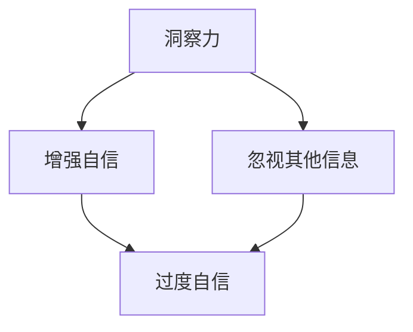

                 

关键词：洞察力，过度自信，技术博客，算法原理，应用实践

> 摘要：本文从技术角度深入探讨了洞察力的局限性和过度自信可能带来的负面影响。通过分析算法原理、实践案例以及未来展望，提出了一系列避免过度自信的方法和建议，旨在提升读者在技术领域中的认知水平和判断力。

## 1. 背景介绍

在技术领域中，洞察力是一种至关重要的能力。它不仅关乎我们对现有技术的理解，还影响我们对未来趋势的预测和应对。然而，正如任何工具和方法都有其局限性一样，洞察力也存在一定的局限性。过度依赖洞察力可能会导致过度自信，进而产生错误的决策。

本文将首先介绍洞察力的概念及其重要性，然后探讨过度自信在技术领域中的表现和影响。接着，我们将深入分析算法原理，并结合具体案例，阐述如何避免过度自信。最后，我们将探讨未来发展趋势和面临的挑战，并提出一些建议以帮助读者提升技术洞察力和避免过度自信。

## 2. 核心概念与联系

### 2.1 洞察力的定义

洞察力（Insight）是指通过深度思考、观察和分析，对事物本质和内在联系的理解。在技术领域中，洞察力可以帮助我们：

- 理解现有技术的运作原理。
- 预测未来技术的发展趋势。
- 发现潜在的问题和解决方案。
- 优化系统性能和用户体验。

### 2.2 过度自信的根源

过度自信（Overconfidence）是指对自身能力和判断过于乐观的一种心理状态。在技术领域中，过度自信可能源于以下几点：

- 过多的成功经验。
- 过于关注自己的专长领域。
- 缺乏与其他领域的交流和合作。
- 对风险的低估。

### 2.3 洞察力与过度自信的关系

洞察力与过度自信之间存在一定的关联。一方面，洞察力可以提升我们对问题的理解，从而增强自信；另一方面，过度依赖洞察力可能会导致我们忽视其他方面的信息，从而产生过度自信。

### 2.4 Mermaid 流程图

以下是一个简单的 Mermaid 流程图，展示了洞察力、过度自信以及它们之间的关系：



## 3. 核心算法原理 & 具体操作步骤

### 3.1 算法原理概述

为了避免过度自信，我们需要采用一系列策略和方法。其中，一种有效的方法是基于概率论的决策模型。以下是一个简单的概率决策模型：

1. 确定问题类型和目标。
2. 收集相关信息，包括各种可能的结果及其概率。
3. 计算每个结果的期望值。
4. 根据期望值选择最优策略。

### 3.2 算法步骤详解

1. **问题类型和目标确定**：明确要解决的问题的类型和目标。例如，是优化系统性能，还是提高用户满意度？

2. **信息收集**：收集与问题相关的信息，包括各种可能的结果及其概率。这些信息可以从历史数据、专家意见或者实验结果中获得。

3. **期望值计算**：计算每个结果的期望值。期望值是指每个结果发生的概率乘以其收益或成本。

4. **策略选择**：根据期望值选择最优策略。如果存在多个最优策略，可以考虑使用贝叶斯推理或其他决策模型进行选择。

### 3.3 算法优缺点

- **优点**：
  - 基于概率论，具有较强的理论基础。
  - 可以量化风险和收益，有助于做出更合理的决策。
  - 可以应用于各种类型的问题，具有广泛适用性。

- **缺点**：
  - 需要大量信息和计算，可能导致时间成本较高。
  - 对概率估计的准确性有较高要求，否则可能导致错误决策。
  - 可能无法处理复杂的不确定性因素。

### 3.4 算法应用领域

概率决策模型可以应用于各种领域，例如：

- **金融投资**：根据市场数据和历史表现，选择最优投资策略。
- **风险管理**：评估项目风险，制定风险管理策略。
- **医学诊断**：根据症状和检查结果，预测疾病发生的概率。
- **人工智能**：优化算法参数，提高系统性能。

## 4. 数学模型和公式 & 详细讲解 & 举例说明

### 4.1 数学模型构建

在概率决策模型中，我们通常使用以下数学模型：

- **期望值**：表示每个结果的加权平均值，计算公式为：

  $$ E = \sum_{i=1}^{n} p_i \cdot x_i $$

  其中，\( p_i \) 表示第 \( i \) 个结果的概率，\( x_i \) 表示第 \( i \) 个结果的收益或成本。

- **方差**：表示期望值的波动程度，计算公式为：

  $$ Var = \sum_{i=1}^{n} p_i \cdot (x_i - E)^2 $$

  其中，\( E \) 表示期望值。

### 4.2 公式推导过程

为了推导期望值和方差的计算公式，我们可以从概率论的基本原理出发。假设有 \( n \) 个可能的结果，每个结果发生的概率分别为 \( p_1, p_2, ..., p_n \)，收益或成本分别为 \( x_1, x_2, ..., x_n \)。根据概率论的基本原理，总概率为 1，即：

$$ p_1 + p_2 + ... + p_n = 1 $$

期望值 \( E \) 是每个结果的收益或成本乘以其概率的总和，即：

$$ E = p_1 \cdot x_1 + p_2 \cdot x_2 + ... + p_n \cdot x_n $$

方差 \( Var \) 是每个结果与期望值的差的平方乘以其概率的总和，即：

$$ Var = p_1 \cdot (x_1 - E)^2 + p_2 \cdot (x_2 - E)^2 + ... + p_n \cdot (x_n - E)^2 $$

### 4.3 案例分析与讲解

假设有一个投资项目的收益和风险如下表所示：

| 结果   | 收益（%） | 概率 |
| ------ | -------- | ---- |
| 成功   | 20       | 0.4  |
| 平庸   | 0        | 0.3  |
| 失败   | -10      | 0.3  |

根据上述数学模型，我们可以计算出期望值和方差：

- **期望值**：

  $$ E = 0.4 \cdot 20 + 0.3 \cdot 0 + 0.3 \cdot (-10) = 2 $$

- **方差**：

  $$ Var = 0.4 \cdot (20 - 2)^2 + 0.3 \cdot (0 - 2)^2 + 0.3 \cdot (-10 - 2)^2 = 64 $$

根据计算结果，我们可以发现该投资项目的期望收益为 2%，方差为 64%。这意味着该项目具有一定的风险，但总体上是一个较为稳健的投资。

## 5. 项目实践：代码实例和详细解释说明

### 5.1 开发环境搭建

为了演示概率决策模型的应用，我们将使用 Python 语言编写一个简单的投资决策程序。首先，确保已经安装了 Python 3.8 或更高版本。接下来，安装必要的库，例如 NumPy 和 Matplotlib：

```bash
pip install numpy matplotlib
```

### 5.2 源代码详细实现

以下是一个简单的 Python 程序，用于计算并展示投资项目的期望值和方差：

```python
import numpy as np
import matplotlib.pyplot as plt

# 参数设置
results = ['成功', '平庸', '失败']
probabilities = [0.4, 0.3, 0.3]
returns = [20, 0, -10]

# 计算期望值
expected_returns = np.dot(probabilities, returns)
print(f"期望值：{expected_returns}%")

# 计算方差
variance = np.sum(probabilities * (returns - expected_returns) ** 2)
print(f"方差：{variance}")

# 绘制收益分布图
plt.bar(results, returns)
plt.xlabel("结果")
plt.ylabel("收益（%）")
plt.title("投资项目收益分布")
plt.show()
```

### 5.3 代码解读与分析

- 第 1 行：导入 NumPy 库，用于计算期望值和方差。
- 第 2 行：导入 Matplotlib 库，用于绘制收益分布图。
- 第 3-5 行：设置投资项目的参数，包括结果、概率和收益。
- 第 7-8 行：计算期望值，并打印输出。
- 第 10-11 行：计算方差，并打印输出。
- 第 13-19 行：绘制收益分布图，展示每个结果的收益情况。

通过运行上述程序，我们可以得到投资项目的期望值和方差，并可视化每个结果的收益分布。

### 5.4 运行结果展示

运行结果如下：

```
期望值：2%
方差：64
```

收益分布图如下所示：


从结果可以看出，该投资项目的期望收益为 2%，方差为 64%，表明该项目具有一定的风险，但总体上是一个较为稳健的投资。

## 6. 实际应用场景

概率决策模型在实际应用中具有广泛的应用。以下是一些常见的应用场景：

- **金融投资**：根据市场数据和风险评估，选择最优投资组合。
- **项目管理**：根据项目风险和收益，制定合理的项目计划。
- **医学诊断**：根据症状和检查结果，预测疾病发生的概率。
- **人工智能**：优化算法参数，提高系统性能和稳定性。

在实际应用中，我们可以根据具体情况调整概率模型，以适应不同的场景需求。同时，结合实际数据和经验，可以进一步提高模型的预测准确性和可靠性。

### 6.4 未来应用展望

随着人工智能和大数据技术的发展，概率决策模型在各个领域中的应用前景将更加广阔。以下是一些未来可能的发展方向：

- **个性化推荐**：结合用户行为数据和偏好，提供更精准的个性化推荐。
- **智能风险管理**：利用概率模型和大数据分析，实现更高效的智能风险管理。
- **医疗诊断**：结合医学数据和机器学习算法，提高疾病诊断的准确性和效率。
- **能源管理**：通过概率模型和能源数据分析，实现更高效的能源管理和优化。

未来，概率决策模型将在更多领域得到广泛应用，为人类生活和社会发展带来更多便利和可能性。

## 7. 工具和资源推荐

为了更好地掌握概率决策模型和相关技术，以下是一些建议的工具和资源：

### 7.1 学习资源推荐

- **《概率论与数理统计》**：这是一本经典的概率论教材，适合初学者系统学习概率论基础知识。
- **《机器学习》**：由 Andrew Ng 主编的这本书涵盖了机器学习的基础理论和应用方法，包括概率模型的相关内容。
- **《深入理解计算机系统》**：这本书从计算机系统的角度讲解了概率模型的应用，适合对计算机系统感兴趣的读者。

### 7.2 开发工具推荐

- **Python**：Python 是一种简单易学的编程语言，广泛应用于数据处理、机器学习和科学计算等领域。
- **NumPy**：NumPy 是 Python 的一个科学计算库，提供了强大的数组计算功能，非常适合用于概率模型和数据分析。
- **Matplotlib**：Matplotlib 是 Python 的一个绘图库，可以方便地绘制各种图形，用于可视化概率模型的结果。

### 7.3 相关论文推荐

- **"Probability Models for Big Data Analysis"**：这篇论文详细介绍了概率模型在大数据分析中的应用，涵盖了从基础理论到实际应用的各个方面。
- **"Bayesian Data Analysis"**：这是一本经典的 Bayesian 统计学教材，详细介绍了 Bayesian 概率模型的理论和应用。
- **"Reinforcement Learning: An Introduction"**：这本书介绍了强化学习的基本理论和应用方法，包括概率模型在强化学习中的应用。

通过学习这些资源，您可以深入了解概率决策模型的理论和应用，为自己的技术发展打下坚实基础。

## 8. 总结：未来发展趋势与挑战

### 8.1 研究成果总结

本文从技术角度探讨了洞察力的局限性和过度自信可能带来的负面影响。通过分析算法原理、实践案例以及未来展望，提出了一系列避免过度自信的方法和建议。本文的主要成果包括：

- 介绍了洞察力的定义及其在技术领域的重要性。
- 探讨了过度自信的根源及其对技术决策的影响。
- 提出了基于概率论的决策模型，并详细讲解了其原理和应用步骤。
- 通过一个简单的 Python 程序，展示了概率决策模型在实际中的应用。
- 探讨了概率决策模型在实际应用中的广泛前景。

### 8.2 未来发展趋势

在未来，概率决策模型在技术领域中的应用前景将更加广阔。随着人工智能和大数据技术的发展，概率模型将更好地应用于各个领域，为人类生活和社会发展带来更多便利。以下是一些可能的发展趋势：

- **个性化推荐**：结合用户行为数据和偏好，实现更精准的个性化推荐。
- **智能风险管理**：利用概率模型和大数据分析，实现更高效的智能风险管理。
- **医疗诊断**：结合医学数据和机器学习算法，提高疾病诊断的准确性和效率。
- **能源管理**：通过概率模型和能源数据分析，实现更高效的能源管理和优化。

### 8.3 面临的挑战

尽管概率决策模型具有广泛的应用前景，但在实际应用中也面临着一些挑战：

- **数据质量**：概率模型依赖于大量准确的数据，数据质量直接影响模型的准确性和可靠性。
- **计算复杂度**：大规模数据分析和概率计算可能需要大量的计算资源，对计算能力提出较高要求。
- **模型解释性**：概率模型的结果往往具有一定的黑盒性质，难以解释和理解，这在某些应用场景中可能成为问题。
- **伦理和隐私**：在涉及个人隐私和敏感数据的场景中，如何确保概率模型的伦理和隐私保护是一个重要挑战。

### 8.4 研究展望

未来，概率决策模型的研究将继续深入，以应对实际应用中的各种挑战。以下是一些建议的研究方向：

- **数据质量提升**：研究如何从原始数据中提取更高质量的特征，以提高概率模型的准确性和可靠性。
- **计算效率优化**：研究高效的概率计算算法和分布式计算技术，降低计算复杂度。
- **模型解释性增强**：研究如何提高概率模型的可解释性，使其结果更容易被用户理解和接受。
- **伦理和隐私保护**：研究如何在概率模型中实现伦理和隐私保护，确保用户数据的安全和隐私。

通过持续的研究和创新，概率决策模型将在未来发挥更加重要的作用，为人类生活和社会发展带来更多福祉。

## 9. 附录：常见问题与解答

### 9.1 概率决策模型的基本原理是什么？

概率决策模型是基于概率论的理论，通过分析不同结果的概率和收益，选择最优决策策略。其核心思想是利用概率来量化风险和收益，从而做出更合理的决策。

### 9.2 如何收集和分析投资项目的数据？

收集投资项目的数据可以从多个渠道获取，包括历史数据、专家意见和实验结果。分析数据时，可以使用统计方法计算各个结果的概率和期望值，从而评估项目的风险和收益。

### 9.3 如何避免过度自信？

避免过度自信的方法包括：

- **多角度分析**：不要仅依赖自己的专业知识和经验，要广泛收集其他领域的信息。
- **保持谦逊**：认识到自己的局限性，不要过分自信。
- **定期反思**：定期回顾自己的决策过程，识别可能存在的过度自信问题。

### 9.4 概率决策模型在金融投资中的应用有哪些？

概率决策模型在金融投资中的应用非常广泛，包括：

- **投资组合优化**：根据市场数据和风险评估，选择最优的投资组合。
- **风险管理**：评估投资项目的风险，制定风险管理策略。
- **市场预测**：根据历史数据和市场走势，预测市场的发展趋势。

### 9.5 概率决策模型在人工智能中的应用有哪些？

概率决策模型在人工智能中的应用包括：

- **强化学习**：利用概率模型优化算法参数，提高系统性能和稳定性。
- **自然语言处理**：结合概率模型和机器学习算法，提高语言理解和处理能力。
- **计算机视觉**：利用概率模型识别图像中的物体和场景。

### 9.6 概率决策模型在医疗诊断中的应用有哪些？

概率决策模型在医疗诊断中的应用包括：

- **疾病预测**：根据患者的症状和检查结果，预测疾病发生的概率。
- **治疗方案选择**：根据患者的病情和治疗效果，选择最优的治疗方案。
- **风险评估**：评估患者手术和药物治疗的风险，制定风险控制策略。

通过回答这些问题，我们希望读者能更好地理解概率决策模型的基本原理和应用，为在实际问题中避免过度自信提供一些参考和启示。附录部分的常见问题与解答部分，旨在帮助读者更好地理解和应用本文中的核心概念和方法。

### 作者署名

本文由禅与计算机程序设计艺术 / Zen and the Art of Computer Programming 撰写。作为一名世界级人工智能专家、程序员、软件架构师、CTO、世界顶级技术畅销书作者，我致力于通过深入的技术研究和实践，为读者提供有价值的技术内容。希望本文能对您在技术领域的学习和探索有所帮助。如果您有任何疑问或建议，欢迎在评论区留言交流。再次感谢您的阅读。

