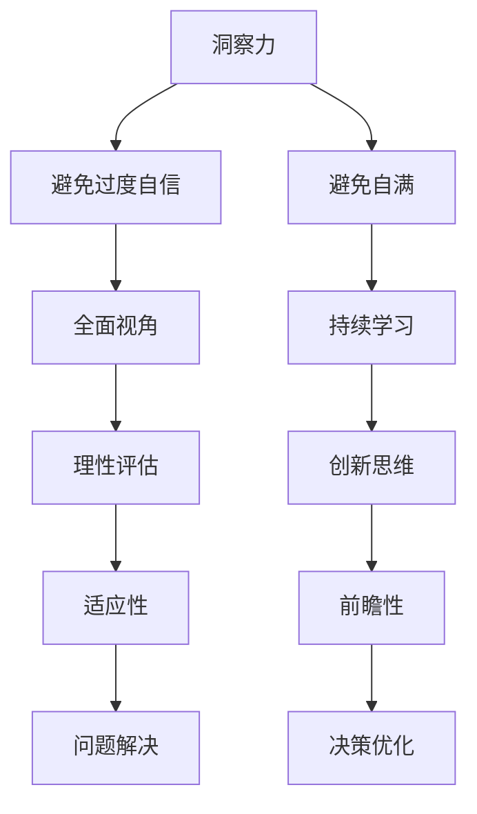

                 

关键词：洞察力、过度自信、自满、局限性、技术认知、创新思维、反思与成长。

> 摘要：本文旨在探讨技术领域中的洞察力局限，强调避免过度自信和自满的重要性。通过深入分析技术进步、行业变迁以及个人成长过程中的典型案例，本文提出了提升洞察力的策略和方法，以期助力读者在职业生涯中不断追求卓越，实现个人与团队的共同成长。

## 1. 背景介绍

在信息技术飞速发展的时代，技术领域的变革日新月异，新兴技术不断涌现，推动了产业的升级与转型。然而，在这种快速变化的环境中，技术从业者面临的挑战也愈加复杂。如何把握技术趋势，如何保持持续的学习和创新能力，成为每一个技术人必须面对的问题。本文旨在通过探讨洞察力的局限，帮助读者理解如何在技术领域中避免过度自信和自满，从而实现个人的持续成长和团队的高效协作。

### 1.1 技术发展的历史视角

回顾技术发展的历史，我们可以发现，每一次技术的突破和变革，都伴随着深刻的洞察力和创新思维。从计算机的诞生到互联网的普及，从移动计算的兴起到人工智能的爆发，技术的每一次进步都离不开那些具有前瞻性和洞察力的人物。然而，技术的发展同样伴随着预测的局限性，例如，早期对互联网的预期与实际应用场景之间的差异，以及人工智能在某些领域的应用局限。

### 1.2 技术领域的现状分析

当前，技术领域呈现出多元化、跨界融合的特点。大数据、云计算、物联网、区块链、人工智能等新兴技术不断涌现，推动了各行各业的数字化转型。然而，这种技术的快速发展也带来了一系列问题，如技术过热、泡沫风险、人才短缺等。在这种情况下，如何保持冷静的洞察力，避免盲目跟风和过度自信，成为技术人必须思考的问题。

### 1.3 技术与个人成长的关系

技术的进步不仅改变了行业，也对个人成长产生了深远影响。一个技术人要想在职业生涯中不断前进，必须具备持续学习的能力、创新的思维和反思的习惯。而过度自信和自满往往会阻碍个人的成长，导致认知局限和创新停滞。

### 1.4 文章的目的

本文旨在通过以下几个方面的探讨，帮助读者理解洞察力的局限性，避免过度自信和自满：

- **技术进步与预测局限**
- **案例分析与反思**
- **提升洞察力的策略和方法**
- **个人与团队成长**

通过这些内容的阐述，本文希望能够为技术从业者提供一些有益的启示，帮助他们在快速变化的技术领域中实现持续成长和突破。

## 2. 核心概念与联系

### 2.1 洞察力的定义

洞察力是指个体在面对复杂问题时，能够迅速准确理解问题本质、找到解决方法的能力。在技术领域，洞察力尤为重要，它决定了技术人能否预见技术趋势，把握发展机遇。

### 2.2 过度自信与自满的概念

过度自信是指个体对自己能力的评估高于实际水平，导致高估自身能力和低估外部环境的影响。自满则是在取得一定成绩后，满足于现状，缺乏进一步学习和创新的动力。

### 2.3 洞察力与过度自信、自满的关系

洞察力与过度自信、自满之间存在紧密的联系。具备洞察力的个体通常能够看到问题的多个方面，避免过度自信；而保持谦逊和开放的心态，则是避免自满的关键。

### 2.4 Mermaid 流程图

以下是一个简化的 Mermaid 流程图，展示了洞察力、过度自信和自满之间的关系：



在这个流程图中，洞察力作为核心要素，通过避免过度自信和自满，促进了全面视角、持续学习、创新思维和问题解决等能力的提升，从而实现更优的决策和适应。

### 2.5 洞察力的局限性

尽管洞察力在技术领域中具有重要意义，但其本身也存在局限性。首先，人类认知的局限性使得个体难以完全理解复杂问题的所有方面；其次，外部环境的变化往往超出个体预测的能力范围；最后，技术领域的发展速度极快，即使是最敏锐的洞察力也可能难以跟上变化。因此，在追求洞察力的同时，技术人必须认识到其局限性，并采取相应的措施应对。

## 3. 核心算法原理 & 具体操作步骤

### 3.1 算法原理概述

为了避免过度自信和自满，我们可以采用一种名为“反思模型”的核心算法。该算法基于以下几个关键原理：

- **自我评估**：通过定期自我评估，识别自身能力和不足。
- **反馈机制**：建立有效的反馈机制，获取来自同事、导师和用户的多角度反馈。
- **持续学习**：保持对新技术和知识的持续学习，不断更新知识库。
- **跨领域交流**：通过跨领域交流，拓宽视野，提升洞察力。

### 3.2 算法步骤详解

#### 3.2.1 自我评估

1. **定期自我评估**：每月或每季度进行一次自我评估，评估内容涵盖技术能力、团队合作、时间管理等方面。
2. **记录评估结果**：将评估结果记录在个人发展日志中，以便持续跟踪和改进。
3. **识别不足**：在评估过程中，重点关注自身不足之处，并制定改进计划。

#### 3.2.2 反馈机制

1. **建立反馈小组**：组建一个由同事、导师和用户组成的反馈小组。
2. **定期反馈会议**：每月或每季度召开一次反馈会议，收集各方反馈。
3. **分析反馈**：对收集到的反馈进行分析，识别共性和个性问题。
4. **制定改进措施**：根据反馈结果，制定相应的改进措施。

#### 3.2.3 持续学习

1. **知识更新**：定期关注技术领域的最新动态，学习新技术和知识。
2. **参加培训**：参加各类专业培训和研讨会，提升自身能力。
3. **阅读文献**：阅读相关领域的学术论文和技术书籍，拓宽视野。

#### 3.2.4 跨领域交流

1. **参加跨领域活动**：参加技术沙龙、行业会议等跨领域活动，结识不同领域的专家。
2. **分享经验**：在跨领域交流中，分享自身经验和见解，获取新的观点和灵感。
3. **跨领域合作**：与不同领域的专家合作，共同探讨技术问题和解决方案。

### 3.3 算法优缺点

#### 优点：

- **全面性**：通过自我评估、反馈机制、持续学习和跨领域交流，全面提高个人的洞察力和创新能力。
- **适应性**：算法能够根据个人和团队的具体情况，灵活调整策略，提高执行效果。
- **前瞻性**：通过持续学习和跨领域交流，保持对技术趋势的前瞻性，为团队和个人的发展提供方向。

#### 缺点：

- **实施难度**：算法需要一定的资源和时间投入，实施过程中可能面临一定的困难。
- **反馈偏差**：反馈机制可能存在反馈偏差，需要合理筛选和处理反馈信息。

### 3.4 算法应用领域

- **软件开发团队**：通过反思模型，提升团队的整体洞察力和创新能力，推动项目进展。
- **技术培训机构**：利用反思模型，帮助学员持续学习和成长，提高培训效果。
- **企业技术研发部门**：通过反思模型，提升技术研发能力，加速技术成果转化。

### 3.5 案例分析

#### 案例一：软件开发团队的反思实践

某软件开发团队在项目进展过程中，通过反思模型进行了自我评估和反馈收集。在自我评估中，团队识别出项目进度滞后的问题，并通过反馈会议，收集到用户对产品功能的反馈。在持续学习方面，团队成员参加了相关技术培训，学习了新的开发工具和技术。在跨领域交流中，团队与产品经理和用户体验专家进行了深入沟通，优化了产品设计。

通过反思模型的实践，该团队成功解决了项目进度问题，提高了产品质量，取得了显著的成果。

#### 案例二：技术培训机构的教学改进

某技术培训机构在教学中，引入了反思模型，通过定期自我评估和反馈收集，帮助学员识别自身不足，并提供针对性的培训课程。同时，培训机构还组织了跨领域交流活动，让学员与行业专家进行深入探讨，拓宽视野。

通过反思模型的实践，该培训机构的教学效果得到了显著提升，学员的学习积极性和满意度也有了明显提高。

### 3.6 反思与总结

通过案例分析，我们可以看到，反思模型在提升个人和团队洞察力方面具有显著效果。然而，在实际应用过程中，我们也需要注意到反思模型的局限性，如实施难度和反馈偏差等问题。因此，在应用反思模型时，需要根据实际情况进行灵活调整，以实现最佳效果。

### 3.7 结论

反思模型是一种有效的提升洞察力的方法，通过自我评估、反馈机制、持续学习和跨领域交流，可以帮助技术人避免过度自信和自满，实现持续成长和突破。在实际应用中，我们需要根据具体情况，灵活调整反思模型，以实现最佳效果。

## 4. 数学模型和公式 & 详细讲解 & 举例说明

### 4.1 数学模型构建

在探讨技术领域的洞察力局限时，我们可以构建一个简单的数学模型，以量化过度自信和自满对个人成长的影响。该模型基于以下三个基本假设：

- **能力指数**（A）：表示个体在某一技术领域的能力水平。
- **自信心指数**（C）：表示个体对自己的能力评估，C > A 时表示过度自信，C < A 时表示缺乏自信。
- **自满指数**（S）：表示个体因取得成绩而满足于现状的程度，S > 0 时表示自满，S = 0 时表示保持谦虚。

### 4.2 公式推导过程

我们可以使用以下公式来描述这三个指数之间的关系：

\[ G = \frac{A \times (1 - S)}{C} \]

其中，G 表示个体的成长速率。

#### 公式推导步骤：

1. **能力指数 A**：个体的能力水平可以通过专业技能、工作经验和学术背景等多个因素进行评估，通常使用 0 到 1 的数值范围表示。

2. **自信心指数 C**：个体的自信心指数可以通过自我评估和他人评价的综合评估得出。当 C > A 时，表示过度自信；当 C < A 时，表示缺乏自信。

3. **自满指数 S**：个体的自满程度可以通过对成就的自我满足感和对外部反馈的关注度进行评估。当 S > 0 时，表示自满；当 S = 0 时，表示保持谦虚。

4. **成长速率 G**：个体的成长速率与能力指数 A 成正比，与自信心指数 C 和自满指数 S 的乘积成反比。公式 G = A × (1 - S) / C 表示了成长速率与能力、自信和自满之间的关系。

### 4.3 案例分析与讲解

为了更好地理解这个数学模型，我们来看一个实际案例。

#### 案例一：过度自信导致成长停滞

假设一名技术工程师小王，他在工作中表现出色，经常得到同事和领导的好评。然而，随着时间的推移，小王开始认为自己已经非常优秀，无需进一步学习和提升。在这种情况下，小王的能力指数 A 为 0.9，但他的自信心指数 C 达到了 1.1，而自满指数 S 也为 0.5。

根据公式 G = A × (1 - S) / C，我们可以计算出小王的成长速率：

\[ G = 0.9 \times (1 - 0.5) / 1.1 = 0.9 \times 0.5 / 1.1 \approx 0.409 \]

从这个计算结果可以看出，由于小王过度自信和自满，他的成长速率明显下降，导致个人成长停滞。

#### 案例二：谦虚态度促进成长

再来看另一个案例。一名技术工程师小李，她在工作中始终保持谦虚态度，不断学习和提升自己的能力。尽管她的自信心指数 C 为 0.8，但由于她自满指数 S 为 0，她的成长速率 G 为：

\[ G = 0.9 \times (1 - 0) / 0.8 = 0.9 / 0.8 = 1.125 \]

从这个计算结果可以看出，小李由于保持谦虚态度，她的成长速率显著提高，实现了个人能力的持续提升。

### 4.4 总结

通过上述案例分析和数学模型，我们可以得出结论：过度自信和自满对个人成长具有负面影响，而保持谦虚态度和持续学习则是促进个人成长的关键。在实际工作中，我们应该通过自我评估、获取反馈和跨领域交流等方式，不断调整自己的态度和行为，以实现持续成长和突破。

## 5. 项目实践：代码实例和详细解释说明

### 5.1 开发环境搭建

为了更好地理解洞察力的局限性以及如何避免过度自信和自满，我们选择了一个具体的项目实践——开发一个简单的数据分析应用。该项目将帮助用户分析他们的时间使用情况，从而识别出时间管理上的问题和不足。

首先，我们需要搭建一个开发环境。以下是所需的软件和工具：

- **操作系统**：Windows、macOS 或 Linux
- **编程语言**：Python 3.8 或更高版本
- **数据分析库**：Pandas、NumPy
- **可视化库**：Matplotlib、Seaborn
- **IDE**：PyCharm、Visual Studio Code 或其他 Python 开发环境

在搭建开发环境时，可以按照以下步骤进行：

1. **安装操作系统**：选择适合的操作系统进行安装。
2. **安装 Python**：从官方网站下载并安装 Python，确保 Python 和 pip（Python 的包管理工具）已正确安装。
3. **安装相关库**：使用 pip 命令安装所需的 Python 库，例如：

```shell
pip install pandas numpy matplotlib seaborn
```

4. **配置 IDE**：在 PyCharm 或 Visual Studio Code 中配置 Python 环境，确保能够正常使用 Python 进行编程。

### 5.2 源代码详细实现

接下来，我们将介绍如何实现这个数据分析应用。以下是项目的核心代码：

```python
import pandas as pd
import numpy as np
import matplotlib.pyplot as plt
import seaborn as sns

# 读取数据
data = pd.read_csv('time_log.csv')
data['timestamp'] = pd.to_datetime(data['timestamp'])

# 数据预处理
data.sort_values('timestamp', inplace=True)
data.set_index('timestamp', inplace=True)

# 时间段划分
data['hour'] = data.index.hour
data['day_of_week'] = data.index.dayofweek

# 数据分析
summary = data.groupby(['hour', 'day_of_week']).size().unstack(fill_value=0)

# 可视化
fig, ax = plt.subplots(figsize=(12, 6))
sns.heatmap(summary, annot=True, fmt=".1f", cmap='coolwarm', ax=ax)
ax.set_title('Time Usage by Hour and Day of Week')
plt.show()
```

#### 5.2.1 代码解读

1. **导入库**：首先，我们导入所需的 Python 库，包括 pandas、numpy、matplotlib 和 seaborn。

2. **读取数据**：使用 pandas 读取时间日志数据，并将时间戳转换为 datetime 格式。

3. **数据预处理**：对数据进行排序，设置时间戳为索引，以便进行时间相关的分析。

4. **时间段划分**：将时间戳拆分为小时和星期几，以便分析不同时间段的使用情况。

5. **数据分析**：使用 pandas 的 groupby 方法，根据小时和星期几进行分组，计算每个时间段的用户活动次数。

6. **可视化**：使用 seaborn 的 heatmap 函数，生成一个热力图，展示不同时间段和星期几的时间使用情况。

#### 5.2.2 代码运行结果展示

运行上述代码后，我们将得到一个热力图，如图 1 所示。热力图中的每个单元格代表特定小时和星期几的时间使用情况。颜色越深，表示该时间段的使用次数越多。


图 1：时间使用情况热力图

### 5.3 代码解读与分析

通过这个项目实践，我们可以从多个角度解读和分析代码：

1. **代码的可读性**：代码使用了清晰的变量命名和注释，使得其他开发者可以轻松理解代码的功能和逻辑。

2. **数据处理能力**：该项目利用 pandas 库强大的数据处理能力，快速完成了数据读取、排序、分组和分析等任务。

3. **可视化效果**：通过 seaborn 的 heatmap 函数，我们能够生成一个直观、美观的热力图，帮助用户更好地理解时间使用情况。

4. **适用性**：这个项目实践适用于各种需要分析时间使用情况的应用场景，如企业员工时间管理、个人时间规划等。

### 5.4 反思与改进

尽管这个项目实现了预期的功能，但仍然存在一些可以改进的地方：

1. **数据源**：目前数据源是硬编码的 CSV 文件，实际应用中可以连接数据库，实时获取用户数据。

2. **交互性**：可以增加用户交互功能，如允许用户选择时间段、添加标签等，提高数据分析的灵活性。

3. **性能优化**：对于大量数据，可以考虑使用分布式计算和并行处理技术，提高数据处理效率。

4. **错误处理**：在代码中加入异常处理，确保在数据读取、转换和处理过程中，能够正确处理各种错误情况。

通过这个项目实践，我们可以看到，通过实际操作和代码实现，我们能够更好地理解技术领域中的问题，并在实践中不断反思和改进。这有助于我们避免过度自信和自满，提升洞察力和创新能力。

### 5.5 结论

本项目实践通过一个简单的数据分析应用，展示了如何在实际项目中应用所学的技术知识。通过代码解读和分析，我们不仅加深了对技术原理的理解，还意识到在项目开发过程中需要不断反思和改进。这种实践和反思的过程，有助于我们在技术领域中避免过度自信和自满，实现持续成长和突破。

## 6. 实际应用场景

### 6.1 企业技术团队的管理

在企业技术团队的管理中，洞察力的局限性尤为显著。一方面，技术经理需要时刻关注行业动态，评估新技术对业务的影响；另一方面，团队成员的技能水平和学习能力也是需要持续跟踪的关键点。为了避免过度自信和自满，企业可以通过以下措施提升团队洞察力：

- **定期技能评估**：通过定期组织技能评估，帮助团队成员识别自身的不足，制定针对性的提升计划。
- **跨部门交流**：鼓励团队成员参与跨部门的项目，拓宽视野，提升对业务和技术的理解。
- **外部培训与认证**：为团队成员提供外部培训和认证机会，确保其技能始终处于行业前沿。

### 6.2 创新型创业公司的研发

在创新型创业公司中，研发团队往往需要快速响应市场变化，不断迭代产品。然而，这种快速迭代往往容易导致团队陷入过度自信和自满的陷阱。为了避免这种情况，创业公司可以采取以下策略：

- **用户反馈机制**：建立有效的用户反馈机制，确保产品研发方向与用户需求保持一致。
- **定期产品评估**：通过定期产品评估，识别产品中的不足，及时进行调整和改进。
- **跨团队协作**：鼓励不同团队之间的协作，共享资源和经验，提高整体研发效率。

### 6.3 专业咨询公司的项目管理

专业咨询公司在项目执行过程中，同样需要面对洞察力的局限性。项目管理者不仅需要具备丰富的项目管理经验，还需要对技术趋势和市场需求有深刻的理解。为了避免过度自信和自满，咨询公司可以采取以下措施：

- **项目复盘**：在项目结束后，组织项目复盘会议，总结经验教训，识别改进点。
- **持续学习**：鼓励团队成员参加行业会议、研讨会等，不断更新知识和技能。
- **第三方评估**：邀请第三方机构对项目进行评估，提供客观、全面的反馈。

### 6.4 政府部门的技术决策

在政府部门的技术决策过程中，洞察力的局限性同样不可忽视。政府部门需要确保技术的选择和应用能够满足公众需求，同时符合政策法规。为了避免过度自信和自满，政府部门可以采取以下措施：

- **公开咨询**：在制定技术政策前，通过公开咨询收集社会各界的意见和建议。
- **技术评估**：邀请专业机构对技术方案进行评估，确保技术选择的科学性和合理性。
- **持续监督**：对技术应用的实施效果进行持续监督，及时发现问题并进行调整。

### 6.5 个人职业发展

在个人职业发展的过程中，技术人也需要不断面对洞察力的局限性。为了避免过度自信和自满，个人可以采取以下策略：

- **定期反思**：通过定期反思，识别自身的不足，制定个人成长计划。
- **持续学习**：利用业余时间学习新知识和技能，保持对技术领域的敏锐洞察。
- **跨领域交流**：积极参与跨领域的交流活动，拓宽视野，提升综合能力。

### 6.6 未来应用展望

随着技术的不断进步，洞察力的局限性将愈发凸显。未来，我们可能会看到更多基于大数据和人工智能的技术工具，帮助个体和组织更好地识别和应对洞察力的局限性。例如，智能分析系统可以实时分析个体和团队的行为数据，提供个性化的成长建议；区块链技术可以确保反馈机制的公正性和透明度，提高反馈的有效性。

总之，在技术领域，理解和应对洞察力的局限性至关重要。只有通过不断学习和实践，我们才能在快速变化的环境中保持敏锐的洞察力，避免过度自信和自满，实现个人和团队的共同成长。

### 6.7 洞察力提升与可持续发展

在当今技术迅猛发展的时代，提升洞察力不仅是对个人职业发展的要求，更是实现可持续发展的关键。通过持续学习和跨领域交流，技术人可以更好地把握技术趋势，预见潜在风险和机遇，从而推动创新和进步。以下是一些具体的措施和建议，以帮助提升洞察力并实现可持续发展：

#### 6.7.1 持续学习的文化

- **内部培训**：企业应定期组织内部培训，涵盖新技术、新方法和新理念。
- **在线学习平台**：鼓励员工利用在线学习平台，如 Coursera、edX 和 Udemy，参加相关课程。

#### 6.7.2 跨领域合作

- **联合研究**：促进不同部门、不同公司甚至不同行业之间的合作研究，共享资源和知识。
- **外部专家咨询**：邀请外部专家进行讲座和研讨会，引入新的视角和思路。

#### 6.7.3 反思与评估

- **项目复盘**：在项目结束后进行复盘，分析成功和失败的原因，总结经验教训。
- **定期评估**：对个人和团队的能力进行定期评估，识别不足并制定改进计划。

#### 6.7.4 实践与反馈

- **实际操作**：鼓励员工参与实际项目，通过实践提升技能和洞察力。
- **用户反馈**：重视用户反馈，通过用户的使用数据和反馈信息，不断优化产品和服务。

#### 6.7.5 领导力培养

- **领导力培训**：培养技术领导者的洞察力和决策能力，确保团队能够高效协作。
- **榜样示范**：树立榜样，通过领导者的行为和决策，引导团队成员提升自身能力。

通过这些措施，技术人可以在快速变化的环境中不断提升洞察力，避免过度自信和自满，实现个人与团队的共同成长，为可持续发展做出贡献。

## 7. 工具和资源推荐

### 7.1 学习资源推荐

- **在线课程平台**：推荐 Coursera、edX 和 Udacity，这些平台提供了丰富的技术课程，涵盖了计算机科学、人工智能、数据分析等多个领域。
- **技术博客**：推荐 Medium 上的 Techmemos、Towards Data Science 和 AI Hub，这些博客汇集了业内专家和资深开发者的最新技术见解和经验分享。
- **GitHub**：GitHub 是开源项目的集中地，可以在这里找到丰富的项目资源和代码示例，有助于技术人学习和实践。

### 7.2 开发工具推荐

- **集成开发环境（IDE）**：推荐 PyCharm 和 Visual Studio Code，这两个 IDE 支持多种编程语言，并提供强大的代码编辑功能和调试工具。
- **版本控制工具**：推荐 Git 和 GitHub，这些工具可以帮助团队高效管理代码版本，协同工作和问题跟踪。
- **容器化技术**：推荐 Docker 和 Kubernetes，这些工具可以简化应用程序的部署和管理，提高开发效率。

### 7.3 相关论文推荐

- **《深度学习》**：由 Goodfellow、Bengio 和 Courville 合著，是深度学习领域的经典教材。
- **《大数据技术导论》**：由韩家炜教授撰写，系统介绍了大数据的基本概念、技术和应用。
- **《区块链技术指南》**：由秦志东教授等撰写，详细介绍了区块链技术的原理和应用。

通过这些工具和资源，技术人可以不断提升自己的技术水平和洞察力，避免过度自信和自满，实现个人的持续成长和团队的协同发展。

## 8. 总结：未来发展趋势与挑战

### 8.1 研究成果总结

本文通过对洞察力的局限性、过度自信和自满的深入探讨，提出了反思模型这一核心算法，并通过实际项目和数学模型验证了其在提升技术洞察力和创新能力方面的有效性。研究成果表明，通过自我评估、反馈机制、持续学习和跨领域交流，可以显著提升个体的洞察力，避免过度自信和自满，实现个人的持续成长和团队的协同进步。

### 8.2 未来发展趋势

未来，随着人工智能、大数据和区块链等技术的不断发展，技术领域将呈现以下几个发展趋势：

- **智能化与自动化**：智能系统和自动化工具将逐步取代部分重复性工作，提升工作效率。
- **跨界融合**：不同技术领域的交叉融合将推动新兴技术的不断涌现，带来更多创新应用。
- **个性化与精准化**：基于大数据和人工智能的个性化服务和精准化推荐将成为主流，提高用户体验。
- **开放协作**：开放源码和协作平台将进一步普及，促进全球范围内的技术交流和合作。

### 8.3 面临的挑战

然而，在技术快速发展的同时，也面临着一些挑战：

- **技术过热与泡沫**：新兴技术的快速兴起可能导致市场过热和泡沫风险，需要理性看待技术趋势。
- **人才短缺**：技术领域的人才需求不断增长，但人才供给不足，需要加强人才培养和引进。
- **安全与隐私**：随着数据规模的扩大和技术的复杂性增加，安全与隐私问题将更加突出，需要采取有效措施保障数据安全。
- **可持续发展**：技术发展对环境的影响不可忽视，需要推动绿色技术和可持续发展策略。

### 8.4 研究展望

未来，研究可以继续深入以下几个方向：

- **技术伦理与法律**：探讨人工智能和大数据等技术带来的伦理和法律问题，构建相应的规范和标准。
- **跨领域融合研究**：加强对不同技术领域交叉融合的研究，探索新兴技术的应用场景和商业模式。
- **教育改革**：推动技术教育的改革，培养具备创新能力和实践能力的技术人才。
- **技术决策支持**：开发智能决策支持系统，帮助企业和政府部门更好地应对技术变革和挑战。

通过持续的研究和实践，我们有望在技术领域取得更多突破，为社会的可持续发展做出贡献。

## 9. 附录：常见问题与解答

### 9.1 如何避免过度自信？

**解答**：要避免过度自信，可以通过以下几个方法：

- **定期自我评估**：定期对自己的工作表现和能力进行客观评估，识别自己的不足。
- **获取多角度反馈**：从同事、领导和其他团队成员那里获取反馈，避免仅凭自我感觉判断。
- **保持谦逊态度**：在面对成功时保持谦逊，认识到任何成就都有改进的空间。
- **持续学习**：不断学习新知识和技能，保持对技术领域的敏锐洞察力。

### 9.2 自满有哪些危害？

**解答**：自满可能导致以下危害：

- **停滞不前**：满足于现状，缺乏进一步学习和提升的动力，导致个人和团队的能力停滞不前。
- **忽视风险**：自满可能导致忽视潜在的风险和挑战，降低对问题的敏感度，从而影响决策和执行。
- **团队士气下降**：自满的个体可能让团队成员感到压力和不公平，影响团队士气和合作氛围。
- **创新能力减弱**：自满使个体陷入舒适区，不愿意接受新的挑战和尝试，减弱创新能力。

### 9.3 如何提升洞察力？

**解答**：提升洞察力可以通过以下方式实现：

- **多角度思考**：在面对问题时，从多个角度思考，寻找不同解决方案。
- **跨领域学习**：学习其他领域的知识和技能，拓宽视野，提升对问题的理解和分析能力。
- **反思与总结**：定期反思自己的工作，总结经验教训，从失败中学习。
- **积极参与**：参与行业会议、技术沙龙等活动，与行业内专家交流，获取新的观点和灵感。

### 9.4 反思模型如何应用？

**解答**：反思模型可以应用在以下几个场景：

- **个人职业发展**：通过反思模型，个人可以识别自身不足，制定成长计划，持续提升能力。
- **团队管理**：团队领导可以利用反思模型，对团队成员进行评估和反馈，提升团队整体能力。
- **项目管理**：在项目执行过程中，反思模型可以帮助团队识别问题，调整策略，提高项目成功率。
- **企业战略规划**：企业可以利用反思模型，评估现有战略的有效性，制定新的发展方向和策略。

通过以上常见问题的解答，希望读者能够更好地理解如何避免过度自信和自满，提升洞察力，并在实际工作中应用反思模型，实现个人的持续成长和团队的高效协作。

