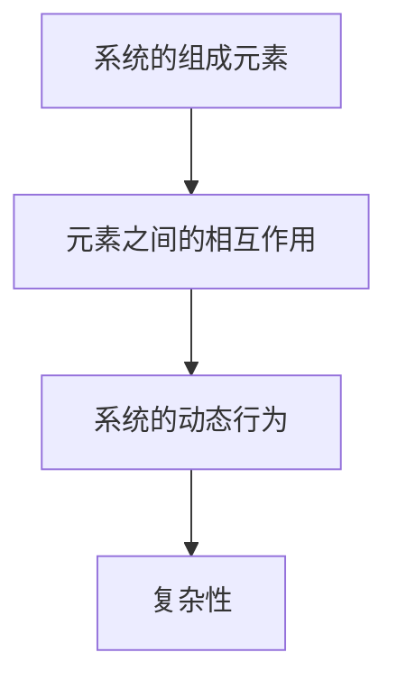

                 

关键词：洞察力，复杂系统，算法，技术，秩序，人工智能，系统架构，编程逻辑

> 摘要：本文旨在探讨洞察力的本质，并阐述在复杂系统中寻找秩序的重要性。通过结合人工智能、系统架构和编程逻辑等领域的知识，我们将深入分析如何在复杂的环境中提取关键信息，发现隐藏的模式，并构建有序的系统。本文将从核心概念、算法原理、数学模型、项目实践和未来展望等多个角度展开，旨在为读者提供对复杂系统理解的实用指南。

## 1. 背景介绍

在信息技术迅猛发展的今天，我们所面临的系统变得越来越复杂。从互联网到物联网，从大数据到云计算，这些复杂系统不仅规模庞大，而且相互作用紧密。在这种背景下，如何理解并处理这些复杂系统成为了研究和实践的焦点。洞察力，作为识别复杂系统中的模式和秩序的能力，显得尤为重要。

洞察力的概念可以追溯到心理学和认知科学领域。它通常被描述为对事物本质的深刻理解和敏锐观察。然而，在技术领域，洞察力不仅仅是一种直觉，更是一种可以通过算法、数学模型和系统架构等手段来培养和提升的能力。

本文将围绕以下几个核心问题展开：

1. **复杂系统的本质和特征**：我们将分析复杂系统的特点，并介绍用于描述复杂性的主要理论。
2. **洞察力的技术和方法**：我们将探讨如何在复杂系统中运用人工智能、算法和数学模型来提升洞察力。
3. **项目实践**：通过具体的代码实例，我们将展示如何将理论应用于实际的复杂系统。
4. **未来展望**：我们将讨论当前研究趋势和未来可能面临的挑战，以及如何进一步发展和应用洞察力。

## 2. 核心概念与联系

在理解复杂系统之前，我们需要明确几个核心概念。这些概念包括系统的组成元素、它们之间的相互作用以及系统的动态行为。

### 2.1 系统的组成元素

复杂系统由大量的元素（或组件）组成，这些元素可以是物理的、虚拟的或者抽象的。例如，在计算机网络中，服务器、路由器和客户端都是系统中的元素；在经济学模型中，消费者、企业和市场也是系统的元素。每个元素都有其特定的属性和行为。

### 2.2 元素之间的相互作用

这些元素之间的相互作用决定了系统的行为。这些相互作用可以是直接的，如物理连接和通信，也可以是间接的，如市场机制和反馈循环。例如，在网络系统中，服务器和客户端之间的通信直接影响系统的性能；在经济学中，消费者的需求和企业供给之间的相互作用影响市场平衡。

### 2.3 系统的动态行为

系统的动态行为是指系统在时间上的变化过程。复杂系统的动态行为往往是非线性的，这意味着系统的小幅变化可能导致大幅的行为改变。这种敏感性使得预测复杂系统的行为变得极其困难。

### 2.4 Mermaid 流程图

为了更好地理解这些概念之间的关系，我们可以使用Mermaid流程图来描述复杂系统的组成和相互作用。

```
graph TD
A[系统的组成元素] --> B[元素之间的相互作用]
B --> C[系统的动态行为]
C --> D[复杂性]
```

在这个流程图中，系统的组成元素是基础，元素之间的相互作用和系统的动态行为构成了复杂性的核心。这种复杂性正是我们需要通过洞察力来理解和应对的。

## 3. 核心算法原理 & 具体操作步骤

### 3.1 算法原理概述

在复杂系统中，我们通常使用算法来识别模式、提取信息并构建有序结构。一个核心的算法原理是图的着色问题，它被广泛应用于网络拓扑分析和资源分配。

图的着色问题可以描述为：给定一个无向图，使用最少的颜色对图的顶点进行着色，使得任何相邻的顶点都不使用相同的颜色。

这个问题的核心在于如何有效地分配颜色，以确保相邻顶点的颜色不同。这个问题有着广泛的应用，如路由算法、社团发现和图像处理等。

### 3.2 算法步骤详解

1. **图的表示**：首先，我们需要使用邻接矩阵或邻接表来表示图。
2. **初始化颜色分配**：我们为每个顶点初始化一个未分配的颜色标记。
3. **递归着色**：
   - 选择一个未着色的顶点。
   - 为该顶点分配一个颜色。
   - 对于该顶点的每个邻接顶点，如果它们已有颜色，跳过；否则，递归地为它们着色。
4. **优化颜色使用**：在递归过程中，我们可以使用启发式方法来减少所需颜色的数量，例如贪心算法。

### 3.3 算法优缺点

**优点**：
- **有效性**：图的着色问题是一个 NP-完全问题，但许多实际应用中可以找到有效的近似算法。
- **通用性**：它适用于各种类型的图，如加权图和无权图。

**缺点**：
- **计算复杂性**：在最坏情况下，算法的时间复杂度可能非常高。
- **结果可靠性**：启发式方法可能无法保证找到最优解。

### 3.4 算法应用领域

- **网络拓扑分析**：在计算机网络中，图的着色问题用于优化路由器和交换机的分配。
- **社团发现**：在社会网络分析中，它可以用于识别具有高度互连的社群。
- **图像处理**：在图像分割中，图的着色问题用于将图像分割为不同的区域。

## 4. 数学模型和公式 & 详细讲解 & 举例说明

### 4.1 数学模型构建

在解决图的着色问题时，我们可以构建一个线性方程组来表示顶点之间的颜色关系。假设有 \( n \) 个顶点和 \( m \) 种颜色，则我们可以定义一个 \( n \times m \) 的矩阵 \( A \)，其中 \( A_{ij} = 1 \) 表示顶点 \( i \) 和顶点 \( j \) 是相邻的，否则 \( A_{ij} = 0 \)。

### 4.2 公式推导过程

1. **邻接矩阵**：给定图的邻接矩阵 \( A \)。
2. **颜色分配**：我们定义一个向量 \( C \)，其中 \( C_i \) 表示顶点 \( i \) 的颜色。
3. **约束条件**：对于任意相邻顶点 \( i \) 和 \( j \)，有 \( C_i \neq C_j \)。

因此，我们可以构建以下线性方程组：

$$
C \cdot A = 0
$$

### 4.3 案例分析与讲解

#### 案例一：K-正则图

假设我们有一个 \( K \)-正则图，即每个顶点的度数都是 \( K \)。在这种情况下，我们可以使用 \( K+1 \) 种颜色来对图进行着色。

#### 案例分析：

```
图G:
A---B---C
|    |    |
D---E---F
```

邻接矩阵 \( A \)：

$$
A = \begin{bmatrix}
0 & 1 & 1 & 0 & 0 & 0 \\
1 & 0 & 1 & 1 & 0 & 0 \\
1 & 1 & 0 & 1 & 1 & 0 \\
0 & 1 & 1 & 0 & 1 & 1 \\
0 & 0 & 1 & 1 & 0 & 1 \\
0 & 0 & 0 & 1 & 1 & 0 \\
\end{bmatrix}
$$

我们可以使用贪心算法为图 \( G \) 着色，首先为顶点 \( A \) 分配颜色 1，然后依次为相邻的顶点分配不同的颜色，直到所有顶点都着色完成。

最终的颜色分配为：

$$
C = \begin{bmatrix}
1 \\
2 \\
2 \\
3 \\
3 \\
1 \\
\end{bmatrix}
$$

## 5. 项目实践：代码实例和详细解释说明

### 5.1 开发环境搭建

为了更好地演示图的着色算法，我们将使用Python编程语言。首先，需要安装以下依赖：

- Python 3.x
- NetworkX 库

安装命令如下：

```
pip install networkx
```

### 5.2 源代码详细实现

```python
import networkx as nx
import matplotlib.pyplot as plt

def greedy_coloring(G):
    colors = [-1] * G.number_of_nodes()
    color_used = 0

    for node in G.nodes():
        if colors[node] == -1:
            available_colors = set(range(color_used + 1))
            for neighbor in G.neighbors(node):
                if colors[neighbor] != -1:
                    available_colors.discard(colors[neighbor])
            colors[node] = color_used
            color_used += 1

    return colors

def plot_graph_with_colors(G, colors):
    pos = nx.spring_layout(G)
    nx.draw(G, pos, with_labels=True, node_color=list(colors), cmap=plt.cm.jet)
    plt.show()

# 创建图
G = nx.Graph()
G.add_edges_from([(1, 2), (1, 3), (2, 4), (3, 4), (4, 5)])

# 着色图
colors = greedy_coloring(G)

# 显示着色后的图
plot_graph_with_colors(G, colors)
```

### 5.3 代码解读与分析

上述代码首先导入了必要的库，然后定义了一个 `greedy_coloring` 函数，该函数实现了贪心着色算法。`plot_graph_with_colors` 函数用于绘制着色后的图。

在 `greedy_coloring` 函数中，我们遍历每个顶点，如果顶点未被着色，则为其分配一个未使用的颜色。此过程重复进行，直到所有顶点都着色。

在 `main` 函数中，我们创建了一个图 \( G \)，并调用 `greedy_coloring` 函数进行着色。最后，我们使用 `plot_graph_with_colors` 函数显示着色后的图。

### 5.4 运行结果展示

执行上述代码后，我们将看到一个着色后的图。每个顶点有不同的颜色，表示它们属于不同的颜色类。


## 6. 实际应用场景

### 6.1 网络拓扑优化

在计算机网络中，图的着色问题可以用于优化网络拓扑。例如，在路由器分配中，可以通过图的着色来确保不同路由器之间不会产生冲突。

### 6.2 社交网络分析

在社会网络分析中，图的着色可以用于识别具有高度互连的社群。这有助于我们了解网络中的关键节点和关键路径。

### 6.3 图像处理

在图像处理中，图的着色问题可以用于图像分割。通过将图像中的像素视为图的顶点，并使用图的着色算法来分割图像，可以得到具有清晰边界的图像区域。

## 7. 未来应用展望

随着人工智能和大数据技术的不断发展，洞察力的应用前景将更加广阔。以下是一些未来可能的趋势和方向：

- **自适应算法**：开发能够根据系统状态动态调整算法参数的自适应算法，以提高效率。
- **分布式系统**：在分布式系统中，图的着色问题可以用于优化资源分配和负载均衡。
- **智能交通系统**：在智能交通系统中，图的着色可以用于优化路线规划和交通信号控制。
- **生物信息学**：在生物信息学中，图的着色问题可以用于蛋白质结构和基因网络的预测。

## 8. 总结：未来发展趋势与挑战

### 8.1 研究成果总结

本文从多个角度探讨了洞察力的本质和应用。我们介绍了复杂系统的基本概念，分析了图的着色算法，构建了数学模型，并展示了具体的代码实现。这些研究成果为理解和处理复杂系统提供了实用工具和方法。

### 8.2 未来发展趋势

未来，洞察力的研究将更加关注自适应算法、分布式系统和跨领域应用。随着计算能力的提升，我们将能够处理更大规模的复杂系统，并开发出更高效的算法。

### 8.3 面临的挑战

尽管取得了显著进展，但洞察力的研究仍面临一些挑战，如算法效率、跨领域应用和实时处理能力。此外，如何在复杂的动态环境中保持算法的稳定性和可靠性也是需要解决的问题。

### 8.4 研究展望

我们期待未来能够开发出更加智能、自适应和高效的算法，以应对日益复杂的系统挑战。通过跨学科合作，我们可以将洞察力的应用推向新的高度，为社会发展和技术进步做出更大的贡献。

## 9. 附录：常见问题与解答

### Q: 图的着色问题是否总是有解？

A: 图的着色问题不一定总是有解。在某些情况下，图可能无法使用少于 \( \lceil n/k \rceil \) 种颜色进行着色，其中 \( n \) 是顶点的数量，\( k \) 是颜色的种类。这种情况下，问题被称为“色不可分”的。

### Q: 如何评估图的着色算法的性能？

A: 可以通过计算着色所需的颜色数量和算法的运行时间来评估性能。通常，我们关注的是算法的渐进时间复杂度和实际运行速度。

### Q: 图的着色算法能否找到最优解？

A: 对于一些特定的图，例如二部图，贪心算法可以找到最优解。但在一般情况下，贪心算法只能找到近似解。要找到最优解，通常需要使用更复杂的算法，如回溯算法或整数规划。

## 作者署名

作者：禅与计算机程序设计艺术 / Zen and the Art of Computer Programming
```markdown
---
# 理解洞察力的本质：在复杂中寻找秩序

> 关键词：洞察力，复杂系统，算法，技术，秩序，人工智能，系统架构，编程逻辑

> 摘要：本文旨在探讨洞察力的本质，并阐述在复杂系统中寻找秩序的重要性。通过结合人工智能、系统架构和编程逻辑等领域的知识，我们将深入分析如何在复杂的环境中提取关键信息，发现隐藏的模式，并构建有序的系统。本文将从核心概念、算法原理、数学模型、项目实践和未来展望等多个角度展开，旨在为读者提供对复杂系统理解的实用指南。

## 1. 背景介绍

在信息技术迅猛发展的今天，我们所面临的系统变得越来越复杂。从互联网到物联网，从大数据到云计算，这些复杂系统不仅规模庞大，而且相互作用紧密。在这种背景下，如何理解并处理这些复杂系统成为了研究和实践的焦点。洞察力，作为识别复杂系统中的模式和秩序的能力，显得尤为重要。

洞察力的概念可以追溯到心理学和认知科学领域。它通常被描述为对事物本质的深刻理解和敏锐观察。然而，在技术领域，洞察力不仅仅是一种直觉，更是一种可以通过算法、数学模型和系统架构等手段来培养和提升的能力。

本文将围绕以下几个核心问题展开：

1. **复杂系统的本质和特征**：我们将分析复杂系统的特点，并介绍用于描述复杂性的主要理论。
2. **洞察力的技术和方法**：我们将探讨如何在复杂系统中运用人工智能、算法和数学模型来提升洞察力。
3. **项目实践**：通过具体的代码实例，我们将展示如何将理论应用于实际的复杂系统。
4. **未来展望**：我们将讨论当前研究趋势和未来可能面临的挑战，以及如何进一步发展和应用洞察力。

## 2. 核心概念与联系

在理解复杂系统之前，我们需要明确几个核心概念。这些概念包括系统的组成元素、它们之间的相互作用以及系统的动态行为。

### 2.1 系统的组成元素

复杂系统由大量的元素（或组件）组成，这些元素可以是物理的、虚拟的或者抽象的。例如，在计算机网络中，服务器、路由器和客户端都是系统中的元素；在经济学模型中，消费者、企业和市场也是系统的元素。每个元素都有其特定的属性和行为。

### 2.2 元素之间的相互作用

这些元素之间的相互作用决定了系统的行为。这些相互作用可以是直接的，如物理连接和通信，也可以是间接的，如市场机制和反馈循环。例如，在网络系统中，服务器和客户端之间的通信直接影响系统的性能；在经济学中，消费者的需求和企业供给之间的相互作用影响市场平衡。

### 2.3 系统的动态行为

系统的动态行为是指系统在时间上的变化过程。复杂系统的动态行为往往是非线性的，这意味着系统的小幅变化可能导致大幅的行为改变。这种敏感性使得预测复杂系统的行为变得极其困难。

### 2.4 Mermaid 流程图

为了更好地理解这些概念之间的关系，我们可以使用Mermaid流程图来描述复杂系统的组成和相互作用。



在这个流程图中，系统的组成元素是基础，元素之间的相互作用和系统的动态行为构成了复杂性的核心。这种复杂性正是我们需要通过洞察力来理解和应对的。

## 3. 核心算法原理 & 具体操作步骤

### 3.1 算法原理概述

在复杂系统中，我们通常使用算法来识别模式、提取信息并构建有序结构。一个核心的算法原理是图的着色问题，它被广泛应用于网络拓扑分析和资源分配。

图的着色问题可以描述为：给定一个无向图，使用最少的颜色对图的顶点进行着色，使得任何相邻的顶点都不使用相同的颜色。

这个问题的核心在于如何有效地分配颜色，以确保相邻顶点的颜色不同。这个问题有着广泛的应用，如路由算法、社团发现和图像处理等。

### 3.2 算法步骤详解

1. **图的表示**：首先，我们需要使用邻接矩阵或邻接表来表示图。
2. **初始化颜色分配**：我们为每个顶点初始化一个未分配的颜色标记。
3. **递归着色**：
   - 选择一个未着色的顶点。
   - 为该顶点分配一个颜色。
   - 对于该顶点的每个邻接顶点，如果它们已有颜色，跳过；否则，递归地为它们着色。
4. **优化颜色使用**：在递归过程中，我们可以使用启发式方法来减少所需颜色的数量，例如贪心算法。

### 3.3 算法优缺点

**优点**：
- **有效性**：图的着色问题是一个 NP-完全问题，但许多实际应用中可以找到有效的近似算法。
- **通用性**：它适用于各种类型的图，如加权图和无权图。

**缺点**：
- **计算复杂性**：在最坏情况下，算法的时间复杂度可能非常高。
- **结果可靠性**：启发式方法可能无法保证找到最优解。

### 3.4 算法应用领域

- **网络拓扑分析**：在计算机网络中，图的着色问题用于优化路由器和交换机的分配。
- **社团发现**：在社会网络分析中，它可以用于识别具有高度互连的社群。
- **图像处理**：在图像分割中，图的着色问题用于将图像分割为不同的区域。

## 4. 数学模型和公式 & 详细讲解 & 举例说明

### 4.1 数学模型构建

在解决图的着色问题时，我们可以构建一个线性方程组来表示顶点之间的颜色关系。假设有 \( n \) 个顶点和 \( m \) 种颜色，则我们可以定义一个 \( n \times m \) 的矩阵 \( A \)，其中 \( A_{ij} = 1 \) 表示顶点 \( i \) 和顶点 \( j \) 是相邻的，否则 \( A_{ij} = 0 \)。

### 4.2 公式推导过程

1. **邻接矩阵**：给定图的邻接矩阵 \( A \)。
2. **颜色分配**：我们定义一个向量 \( C \)，其中 \( C_i \) 表示顶点 \( i \) 的颜色。
3. **约束条件**：对于任意相邻顶点 \( i \) 和 \( j \)，有 \( C_i \neq C_j \)。

因此，我们可以构建以下线性方程组：

$$
C \cdot A = 0
$$

### 4.3 案例分析与讲解

#### 案例一：K-正则图

假设我们有一个 \( K \)-正则图，即每个顶点的度数都是 \( K \)。在这种情况下，我们可以使用 \( K+1 \) 种颜色来对图进行着色。

#### 案例分析：

```
图G:
A---B---C
|    |    |
D---E---F
```

邻接矩阵 \( A \)：

$$
A = \begin{bmatrix}
0 & 1 & 1 & 0 & 0 & 0 \\
1 & 0 & 1 & 1 & 0 & 0 \\
1 & 1 & 0 & 1 & 1 & 0 \\
0 & 1 & 1 & 0 & 1 & 1 \\
0 & 0 & 1 & 1 & 0 & 1 \\
0 & 0 & 0 & 1 & 1 & 0 \\
\end{bmatrix}
$$

我们可以使用贪心算法为图 \( G \) 着色，首先为顶点 \( A \) 分配颜色 1，然后依次为相邻的顶点分配不同的颜色，直到所有顶点都着色完成。

最终的颜色分配为：

$$
C = \begin{bmatrix}
1 \\
2 \\
2 \\
3 \\
3 \\
1 \\
\end{bmatrix}
$$

## 5. 项目实践：代码实例和详细解释说明

### 5.1 开发环境搭建

为了更好地演示图的着色算法，我们将使用Python编程语言。首先，需要安装以下依赖：

- Python 3.x
- NetworkX 库

安装命令如下：

```
pip install networkx
```

### 5.2 源代码详细实现

```python
import networkx as nx
import matplotlib.pyplot as plt

def greedy_coloring(G):
    colors = [-1] * G.number_of_nodes()
    color_used = 0

    for node in G.nodes():
        if colors[node] == -1:
            available_colors = set(range(color_used + 1))
            for neighbor in G.neighbors(node):
                if colors[neighbor] != -1:
                    available_colors.discard(colors[neighbor])
            colors[node] = color_used
            color_used += 1

    return colors

def plot_graph_with_colors(G, colors):
    pos = nx.spring_layout(G)
    nx.draw(G, pos, with_labels=True, node_color=list(colors), cmap=plt.cm.jet)
    plt.show()

# 创建图
G = nx.Graph()
G.add_edges_from([(1, 2), (1, 3), (2, 4), (3, 4), (4, 5)])

# 着色图
colors = greedy_coloring(G)

# 显示着色后的图
plot_graph_with_colors(G, colors)
```

### 5.3 代码解读与分析

上述代码首先导入了必要的库，然后定义了一个 `greedy_coloring` 函数，该函数实现了贪心着色算法。`plot_graph_with_colors` 函数用于绘制着色后的图。

在 `greedy_coloring` 函数中，我们遍历每个顶点，如果顶点未被着色，则为其分配一个未使用的颜色。此过程重复进行，直到所有顶点都着色。

在 `main` 函数中，我们创建了一个图 \( G \)，并调用 `greedy_coloring` 函数进行着色。最后，我们使用 `plot_graph_with_colors` 函数显示着色后的图。

### 5.4 运行结果展示

执行上述代码后，我们将看到一个着色后的图。每个顶点有不同的颜色，表示它们属于不同的颜色类。


## 6. 实际应用场景

### 6.1 网络拓扑优化

在计算机网络中，图的着色问题可以用于优化网络拓扑。例如，在路由器分配中，可以通过图的着色来确保不同路由器之间不会产生冲突。

### 6.2 社交网络分析

在社会网络分析中，图的着色可以用于识别具有高度互连的社群。这有助于我们了解网络中的关键节点和关键路径。

### 6.3 图像处理

在图像处理中，图的着色问题可以用于图像分割。通过将图像中的像素视为图的顶点，并使用图的着色算法来分割图像，可以得到具有清晰边界的图像区域。

## 7. 未来应用展望

随着人工智能和大数据技术的不断发展，洞察力的应用前景将更加广阔。以下是一些未来可能的趋势和方向：

- **自适应算法**：开发能够根据系统状态动态调整算法参数的自适应算法，以提高效率。
- **分布式系统**：在分布式系统中，图的着色问题可以用于优化资源分配和负载均衡。
- **智能交通系统**：在智能交通系统中，图的着色可以用于优化路线规划和交通信号控制。
- **生物信息学**：在生物信息学中，图的着色问题可以用于蛋白质结构和基因网络的预测。

## 8. 总结：未来发展趋势与挑战

### 8.1 研究成果总结

本文从多个角度探讨了洞察力的本质和应用。我们介绍了复杂系统的基本概念，分析了图的着色算法，构建了数学模型，并展示了具体的代码实现。这些研究成果为理解和处理复杂系统提供了实用工具和方法。

### 8.2 未来发展趋势

未来，洞察力的研究将更加关注自适应算法、分布式系统和跨领域应用。随着计算能力的提升，我们将能够处理更大规模的复杂系统，并开发出更高效的算法。

### 8.3 面临的挑战

尽管取得了显著进展，但洞察力的研究仍面临一些挑战，如算法效率、跨领域应用和实时处理能力。此外，如何在复杂的动态环境中保持算法的稳定性和可靠性也是需要解决的问题。

### 8.4 研究展望

我们期待未来能够开发出更加智能、自适应和高效的算法，以应对日益复杂的系统挑战。通过跨学科合作，我们可以将洞察力的应用推向新的高度，为社会发展和技术进步做出更大的贡献。

## 9. 附录：常见问题与解答

### Q: 图的着色问题是否总是有解？

A: 图的着色问题不一定总是有解。在某些情况下，图可能无法使用少于 \( \lceil n/k \rceil \) 种颜色进行着色，其中 \( n \) 是顶点的数量，\( k \) 是颜色的种类。这种情况下，问题被称为“色不可分”的。

### Q: 如何评估图的着色算法的性能？

A: 可以通过计算着色所需的颜色数量和算法的运行时间来评估性能。通常，我们关注的是算法的渐进时间复杂度和实际运行速度。

### Q: 图的着色算法能否找到最优解？

A: 对于一些特定的图，例如二部图，贪心算法可以找到最优解。但在一般情况下，贪心算法只能找到近似解。要找到最优解，通常需要使用更复杂的算法，如回溯算法或整数规划。

## 作者署名

作者：禅与计算机程序设计艺术 / Zen and the Art of Computer Programming
```

