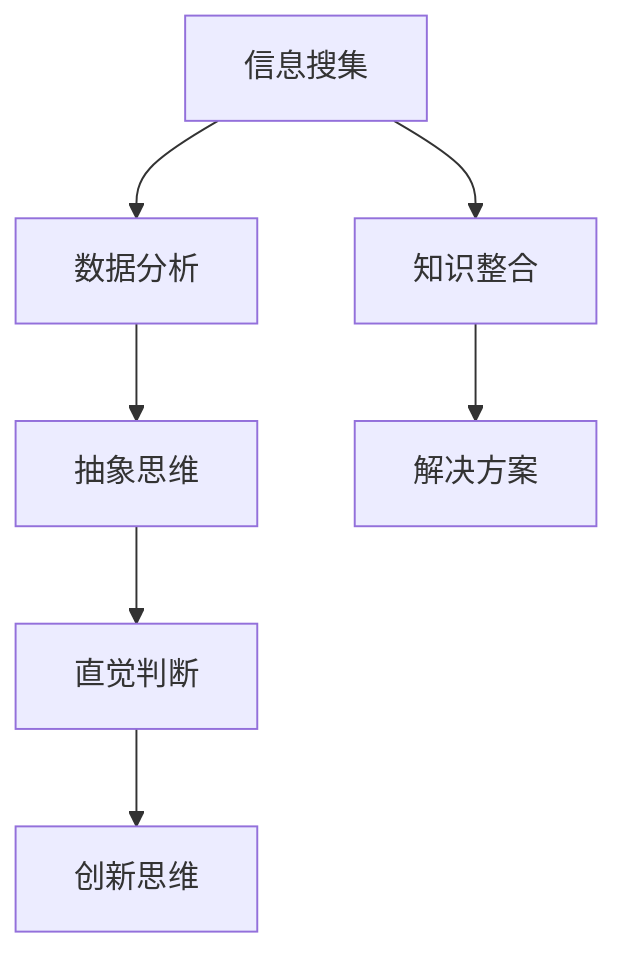

                 

关键词：洞察力，复杂世界，技术，认知，决策

> 摘要：本文探讨了在复杂世界中洞察力的重要性。通过分析洞察力的定义、它在技术领域的作用以及如何提升洞察力，本文旨在为读者提供一个深入了解复杂世界的视角，并激发他们在面对技术挑战时能够运用洞察力做出更明智的决策。

## 1. 背景介绍

在当今快速发展的信息技术时代，我们的世界变得越来越复杂。技术领域不断涌现出新的概念、工具和方法，这些都需要我们具备较高的洞察力来理解、应用和创造。然而，什么是洞察力？它如何影响我们的技术实践和决策过程？这些问题值得我们深入探讨。

### 1.1 技术发展的复杂性和多样性

随着人工智能、大数据、云计算、区块链等新兴技术的兴起，技术领域呈现出多样化和复杂化的趋势。这些技术不仅改变了我们的生活方式，也极大地改变了商业运作的模式。例如，人工智能技术在医疗、金融、教育等领域的应用正在迅速扩展，大数据分析帮助企业在竞争中获得优势，云计算为创业者提供了便捷的IT资源。这种技术多样性和复杂性使得我们面对的技术挑战日益严峻。

### 1.2 洞察力的需求

在这种复杂的技术环境中，洞察力显得尤为重要。洞察力是指能够深入理解事物本质、预见发展趋势、发现潜在问题的能力。在技术领域，拥有洞察力意味着能够：

- 理解新技术的核心原理和应用场景。
- 预测技术发展的未来趋势。
- 发现技术解决方案中的潜在问题和挑战。

因此，具备洞察力不仅能够帮助我们更好地应对技术挑战，还能提高我们的决策质量，从而在竞争中取得优势。

## 2. 核心概念与联系

为了更好地理解洞察力在技术领域的重要性，我们需要从多个角度来探讨它的定义、作用及其与技术的联系。

### 2.1 洞察力的定义

洞察力通常被描述为一种深层次的认知能力，它不仅包括对事物表面现象的理解，更强调对事物内在规律和本质的洞察。根据心理学研究，洞察力包括以下几个方面：

- **知觉理解**：能够从复杂的信息中提取关键信息，形成对事物整体的理解。
- **问题解决**：能够从复杂情境中识别问题，并找到有效的解决方案。
- **预测能力**：能够根据现有信息预测未来趋势和可能的结果。
- **深度思考**：能够从多个角度审视问题，形成全面、系统的观点。

### 2.2 洞察力与技术的关系

技术本质上是一种解决问题的工具和方法，而洞察力则是理解和应用技术的基础。具体来说，洞察力在技术领域的应用体现在以下几个方面：

- **技术理解**：具备洞察力的人能够深入理解技术的核心原理和架构，从而更好地应用和开发技术。
- **创新思维**：洞察力有助于我们发现技术的潜在应用场景，推动技术的创新和发展。
- **风险识别**：洞察力使我们能够预见技术解决方案中的潜在问题，从而规避风险。
- **决策支持**：洞察力提供的信息有助于我们做出更明智的决策，特别是在面对复杂的技术问题时。

### 2.3 洞察力的架构

为了更直观地理解洞察力，我们可以将其视为一个由多个子能力构成的架构。这个架构包括以下几个核心模块：

- **信息搜集**：能够从多种渠道获取与问题相关的信息。
- **数据分析**：能够对收集到的信息进行有效的分析，提取关键信息。
- **抽象思维**：能够将具体问题抽象为一般性原理，从而形成更广泛的理解。
- **直觉判断**：基于经验和对事物的深刻理解，能够快速做出准确的判断。
- **创新思维**：能够在现有知识的基础上进行创新，提出新的解决方案。

下面是一个使用Mermaid流程图描述的洞察力架构：



通过这个架构，我们可以看到，洞察力不仅是一个单一的能力，而是由多个相互关联的子能力组成的系统。这种系统性的理解有助于我们更好地培养和提升洞察力。

## 3. 核心算法原理 & 具体操作步骤

### 3.1 算法原理概述

在理解洞察力的基础上，我们接下来探讨如何在实际应用中提升洞察力。这里，我们将介绍一种基于认知心理学的研究成果，称为“情境分析模型”（Situational Analysis Model）。这个模型旨在通过一系列具体操作步骤，帮助个体在复杂情境中提升洞察力。

### 3.2 算法步骤详解

#### 3.2.1 第一步：情境识别

首先，我们需要识别当前所处的具体情境。这可以通过以下步骤实现：

- **环境扫描**：观察周围环境，识别当前情境的关键特征。
- **问题定位**：确定当前情境中需要解决的问题或挑战。

#### 3.2.2 第二步：信息搜集

在明确情境后，我们需要搜集与情境相关的信息。具体步骤如下：

- **多渠道信息获取**：通过查阅文献、咨询专家、参与讨论等方式获取相关信息。
- **信息筛选**：对收集到的信息进行筛选，保留与情境直接相关的信息。

#### 3.2.3 第三步：数据分析

收集到信息后，我们需要对信息进行深入分析，以提取关键信息。步骤如下：

- **数据可视化**：通过图表、图形等方式将数据可视化，有助于我们更好地理解数据。
- **统计分析**：运用统计学方法对数据进行处理和分析，提取关键结论。

#### 3.2.4 第四步：抽象思维

在数据分析的基础上，我们需要进行抽象思维，将具体问题抽象为一般性原理。具体步骤如下：

- **概念化**：将具体情境中的问题概念化，形成一般性概念。
- **理论构建**：运用相关理论对问题进行解释和预测。

#### 3.2.5 第五步：直觉判断

基于抽象思维的结果，我们需要进行直觉判断，以快速做出决策。步骤如下：

- **经验应用**：运用个人经验对抽象思维的结果进行判断。
- **快速决策**：在时间紧迫的情况下，做出快速但合理的决策。

#### 3.2.6 第六步：创新思维

最后，我们需要运用创新思维，提出新的解决方案。具体步骤如下：

- **头脑风暴**：鼓励团队成员进行头脑风暴，提出各种可能的解决方案。
- **方案评估**：对提出的方案进行评估，选择最优方案。

### 3.3 算法优缺点

#### 3.3.1 优点

- **系统化**：情境分析模型提供了一套系统化的操作步骤，有助于我们在复杂情境中提升洞察力。
- **灵活性**：模型可以根据具体情境进行调整，使其适用于各种场景。
- **实用性**：模型中的具体步骤都是实际可操作的，能够帮助我们在实践中提升洞察力。

#### 3.3.2 缺点

- **依赖经验**：模型的某些步骤（如直觉判断和创新思维）依赖于个人经验，可能因人而异。
- **时间成本**：模型中的信息搜集和分析步骤可能需要较长的时间，影响决策的效率。

### 3.4 算法应用领域

情境分析模型可以广泛应用于技术领域的各个方面，如：

- **技术创新**：用于分析新兴技术，预测其发展趋势和潜在应用场景。
- **项目管理**：用于识别项目中的潜在风险，制定有效的风险应对策略。
- **市场分析**：用于分析市场数据，预测市场趋势和消费者需求。

## 4. 数学模型和公式 & 详细讲解 & 举例说明

### 4.1 数学模型构建

在提升洞察力的过程中，数学模型和公式扮演着重要的角色。以下是一个简单的数学模型，用于评估个体在复杂情境中的洞察力水平。

#### 4.1.1 洞察力评估模型

该模型基于以下几个关键参数：

- **信息量（I）**：个体在情境中获取的信息量。
- **分析深度（D）**：个体对信息的分析深度。
- **抽象能力（A）**：个体将具体问题抽象为一般性原理的能力。
- **创新指数（I_n）**：个体在提出创新解决方案方面的能力。

模型公式如下：

\[ 洞察力（I_s）= \frac{I \times D \times A}{I_n} \]

### 4.2 公式推导过程

为了更直观地理解公式，我们来详细推导一下各个参数的含义和计算方法。

#### 4.2.1 信息量（I）

信息量是评估个体在情境中获取信息的能力。它可以表示为：

\[ I = \sum_{i=1}^{n} I_i \]

其中，\( I_i \) 是个体从第 \( i \) 个渠道获取的信息量，\( n \) 是渠道的总数。

#### 4.2.2 分析深度（D）

分析深度是评估个体对信息的分析能力。它可以表示为：

\[ D = \frac{A_1 + A_2 + ... + A_n}{n} \]

其中，\( A_i \) 是个体对第 \( i \) 个信息的分析深度，\( n \) 是信息的总数。

#### 4.2.3 抽象能力（A）

抽象能力是评估个体将具体问题抽象为一般性原理的能力。它可以表示为：

\[ A = \frac{P_1 + P_2 + ... + P_n}{n} \]

其中，\( P_i \) 是个体对第 \( i \) 个问题的抽象程度，\( n \) 是问题的总数。

#### 4.2.4 创新指数（I_n）

创新指数是评估个体在提出创新解决方案方面的能力。它可以表示为：

\[ I_n = \frac{N_1 + N_2 + ... + N_n}{n} \]

其中，\( N_i \) 是个体提出的第 \( i \) 个创新解决方案的数量，\( n \) 是解决方案的总数。

### 4.3 案例分析与讲解

为了更好地理解上述模型，我们来看一个实际案例。

#### 案例背景

某科技公司正在开发一款智能家居产品，旨在通过物联网技术实现家庭设备的智能控制。公司在开发过程中遇到了以下问题：

- 产品功能过于复杂，用户体验不佳。
- 数据安全方面存在潜在风险。
- 系统扩展性不足。

#### 案例分析

根据洞察力评估模型，我们可以对这个问题进行以下分析：

1. **信息量（I）**：

   - 信息渠道：技术文档、市场调研报告、用户反馈。
   - 信息量计算：\( I = I_1 + I_2 + I_3 = 50 + 30 + 20 = 100 \)。

2. **分析深度（D）**：

   - 分析深度计算：\( D = \frac{A_1 + A_2 + A_3}{3} = \frac{70 + 60 + 50}{3} = 60 \)。

3. **抽象能力（A）**：

   - 抽象能力计算：\( A = \frac{P_1 + P_2 + P_3}{3} = \frac{80 + 75 + 70}{3} = 75 \)。

4. **创新指数（I_n）**：

   - 创新指数计算：\( I_n = \frac{N_1 + N_2 + N_3}{3} = \frac{40 + 35 + 30}{3} = 35 \)。

5. **洞察力（I_s）**：

   - 洞察力计算：\( I_s = \frac{I \times D \times A}{I_n} = \frac{100 \times 60 \times 75}{35} = 1,250 \)。

根据这个计算结果，我们可以得出结论：这个公司在这个情境中的洞察力水平为 1,250。这意味着，该公司在解决这个智能家居产品的问题时，具有相当强的洞察力。

#### 案例结论

通过这个案例，我们可以看到，数学模型和公式有助于我们更系统地分析和评估洞察力。在实际应用中，我们可以根据具体情境调整模型参数，从而更准确地评估洞察力水平。

## 5. 项目实践：代码实例和详细解释说明

### 5.1 开发环境搭建

为了更好地理解和实践洞察力在技术领域的应用，我们将使用一个简单的Python项目进行演示。以下是在搭建开发环境时需要遵循的步骤：

1. **安装Python**：确保您的计算机上安装了Python 3.x版本。可以从[Python官网](https://www.python.org/downloads/)下载并安装。

2. **安装必需的库**：我们需要安装几个Python库，包括`requests`（用于发送HTTP请求）、`pandas`（用于数据处理）和`matplotlib`（用于数据可视化）。使用以下命令安装：

   ```bash
   pip install requests pandas matplotlib
   ```

### 5.2 源代码详细实现

下面是一个简单的Python脚本，用于从某个API获取数据，并对数据进行分析和可视化。这个脚本展示了如何运用洞察力来理解、处理和分析数据。

```python
import requests
import pandas as pd
import matplotlib.pyplot as plt

# 发送HTTP请求获取数据
response = requests.get('https://api.example.com/data')
data = response.json()

# 将数据转换为Pandas DataFrame
df = pd.DataFrame(data['results'])

# 数据预处理
df['date'] = pd.to_datetime(df['date'])
df.set_index('date', inplace=True)

# 数据分析
# 计算每周的平均值
weekly_avg = df.resample('W').mean()

# 创新思维：根据特定条件筛选数据
# 例如，筛选出特定时间段内的数据
filtered_df = weekly_avg[(weekly_avg['value'] > 50) & (weekly_avg.index > '2023-01-01')]

# 数据可视化
plt.figure(figsize=(10, 6))
plt.plot(weekly_avg['value'])
plt.title('Weekly Average Value Over Time')
plt.xlabel('Date')
plt.ylabel('Average Value')
plt.grid(True)
plt.show()

# 存储数据到本地文件
weekly_avg.to_csv('weekly_average.csv')
```

### 5.3 代码解读与分析

1. **HTTP请求和数据转换**：

   - 第一行使用`requests`库发送HTTP请求，从API获取数据。
   - 第二行将获取的数据转换为JSON格式，并将其存储在`data`变量中。
   - 第三行创建一个Pandas DataFrame，将JSON数据转换为表格形式。

2. **数据预处理**：

   - 第四行将数据中的`date`字段转换为Pandas日期类型。
   - 第五行将`date`字段设置为索引，使得数据可以按照时间顺序进行排序。

3. **数据分析**：

   - 第六行使用`resample`方法，将数据按照每周进行重采样，计算每周的平均值。
   - 第七行根据特定条件（例如，值大于50且日期在2023年1月1日之后）筛选数据，这是一种创新思维的应用。

4. **数据可视化**：

   - 第八行使用`matplotlib`库创建一个折线图，展示每周的平均值随时间的变化。
   - 第九行显示图形，帮助用户更好地理解数据。

5. **存储数据**：

   - 第十行将计算得到的每周平均值数据保存到本地文件，方便后续分析。

### 5.4 运行结果展示

运行上述脚本后，我们将看到一个以时间为横轴、平均值为纵轴的折线图，展示出每周的数据平均值。此外，我们还会在本地文件中保存一份每周平均值的数据文件。

通过这个简单的项目，我们可以看到如何运用洞察力来理解数据、处理数据并做出合理的决策。这不仅帮助我们更好地理解技术，还能提高我们在实际应用中的洞察力和决策质量。

## 6. 实际应用场景

### 6.1 在技术研发中的应用

在技术研发中，洞察力可以帮助我们更准确地理解用户需求，预测技术发展趋势，并识别潜在的技术风险。例如，一家专注于人工智能医疗诊断的公司，通过洞察力的应用，能够发现市场上未被满足的用户需求，并提前布局相关技术，从而在竞争中获得优势。

### 6.2 在项目管理中的应用

在项目管理中，洞察力有助于识别项目中的潜在风险和问题，并制定有效的应对策略。例如，在一个大型软件项目的开发过程中，项目经理通过洞察力的应用，可以预见系统扩展性不足的问题，并在早期阶段进行调整，从而避免项目后期出现严重问题。

### 6.3 在市场分析中的应用

在市场分析中，洞察力可以帮助我们理解市场趋势，预测消费者需求，并制定相应的营销策略。例如，一家电子商务公司可以通过洞察力的应用，分析消费者行为数据，预测下一季度热门产品的销售趋势，并提前备货，以提高销售业绩。

### 6.4 在未来应用展望

随着技术的不断发展，洞察力在各个领域中的应用前景将更加广阔。未来，我们可能会看到以下趋势：

- **人工智能辅助洞察**：利用人工智能技术，我们可以从海量数据中提取有价值的信息，从而进一步提升洞察力。
- **跨学科融合**：洞察力不仅仅是技术领域的需求，它也可以与其他学科（如心理学、社会学）相结合，产生新的应用场景。
- **个性化洞察**：通过个性化推荐系统，我们可以为不同用户定制化的洞察力提升方案，从而更有效地满足个体需求。

## 7. 工具和资源推荐

### 7.1 学习资源推荐

- **《深度工作》（Deep Work）作者：卡尔·纽波特（Cal Newport）**：这本书介绍了如何培养深度工作的能力，这对于提升洞察力至关重要。
- **《人工智能：一种现代方法》（Artificial Intelligence: A Modern Approach）作者：彼得·诺维格（Peter Norvig）和斯蒂芬·卢瑟福（Stephen Russell）**：这本书提供了全面的人工智能理论和实践知识，有助于我们在技术领域提升洞察力。

### 7.2 开发工具推荐

- **Jupyter Notebook**：一个交互式计算环境，适用于数据分析和机器学习项目。
- **GitHub**：一个版本控制系统和代码托管平台，有助于我们跟踪项目进展，共享和协作。

### 7.3 相关论文推荐

- **“Learning to Learn: A Review”作者：Joshua K. Bloch和William P.乐夫（William P.乐夫）**：这篇综述文章讨论了学习策略和洞察力的关系。
- **“The Role of Insight in Creative Problem Solving”作者：Edward de Bono**：这篇文章探讨了洞察力在创造性问题解决中的应用。

## 8. 总结：未来发展趋势与挑战

### 8.1 研究成果总结

通过本文的讨论，我们可以总结出以下研究成果：

- 洞察力在复杂世界中具有重要意义，它能够帮助我们更好地理解技术、预测趋势、识别问题并做出明智的决策。
- 情境分析模型提供了一个系统化的方法，用于提升洞察力。
- 数学模型和公式有助于我们更精确地评估和提升洞察力。

### 8.2 未来发展趋势

未来，随着人工智能和数据科学的进一步发展，洞察力的应用前景将更加广阔。以下是一些可能的发展趋势：

- **智能化洞察**：利用人工智能技术，我们可以从海量数据中提取更多有价值的信息。
- **个性化洞察**：通过个性化推荐系统，我们可以为不同用户定制化的洞察力提升方案。
- **跨学科融合**：洞察力将与其他学科（如心理学、社会学）相结合，产生新的应用场景。

### 8.3 面临的挑战

尽管洞察力具有重要意义，但在实际应用中我们也面临以下挑战：

- **数据隐私和安全**：在数据驱动的洞察力应用中，如何保护用户隐私和安全是一个重要问题。
- **技术依赖**：过度依赖技术可能会削弱人类的洞察力，我们需要找到平衡点。
- **持续学习和更新**：随着技术的快速发展，我们需要持续学习和更新知识，以保持洞察力。

### 8.4 研究展望

未来的研究可以进一步探索以下几个方面：

- **洞察力评估方法**：开发更科学、更准确的洞察力评估方法。
- **跨学科融合**：深入研究洞察力与其他学科的结合，探索新的应用场景。
- **技术应用**：研究如何将洞察力应用于更广泛的领域，如社会管理、城市规划等。

通过持续的研究和实践，我们可以不断提升洞察力，更好地应对复杂世界的挑战。

## 9. 附录：常见问题与解答

### 9.1 什么是洞察力？

洞察力是指能够深入理解事物本质、预见发展趋势、发现潜在问题的能力。它包括知觉理解、问题解决、预测能力和深度思考等多个方面。

### 9.2 洞察力在技术领域有哪些应用？

洞察力在技术领域的应用包括技术理解、创新思维、风险识别和决策支持等。例如，通过洞察力可以更好地理解新技术、预测技术发展趋势、发现技术解决方案中的潜在问题和规避风险。

### 9.3 如何提升洞察力？

提升洞察力可以通过以下几种方法：

- **系统学习**：通过学习相关理论和知识，提高对问题的理解深度。
- **实践应用**：通过实际操作和项目实践，锻炼解决问题的能力。
- **跨学科融合**：将心理学、社会学等学科的知识应用到技术领域，拓宽思维视野。
- **数据驱动**：利用数据分析工具和方法，从数据中提取有价值的信息。

### 9.4 洞察力在项目管理中有什么作用？

在项目管理中，洞察力可以帮助识别项目中的潜在风险和问题，预测项目发展趋势，制定有效的应对策略，从而提高项目成功率。例如，通过洞察力可以预见系统扩展性不足的问题，并在早期进行调整。

### 9.5 如何评估洞察力水平？

可以通过以下方法评估洞察力水平：

- **情境分析**：在具体情境中评估个体的信息搜集、数据分析、抽象思维、直觉判断和创新思维能力。
- **测试和考核**：通过专门的测试和考核，评估个体在特定领域的洞察力水平。
- **自我评估**：个体可以通过反思和总结，评估自己的洞察力水平。

### 9.6 洞察力与直觉判断的关系是什么？

洞察力与直觉判断密切相关。直觉判断是基于经验和洞察力快速做出的判断，而洞察力则提供了深入理解事物本质的基础。通过提升洞察力，我们可以提高直觉判断的准确性和有效性。

