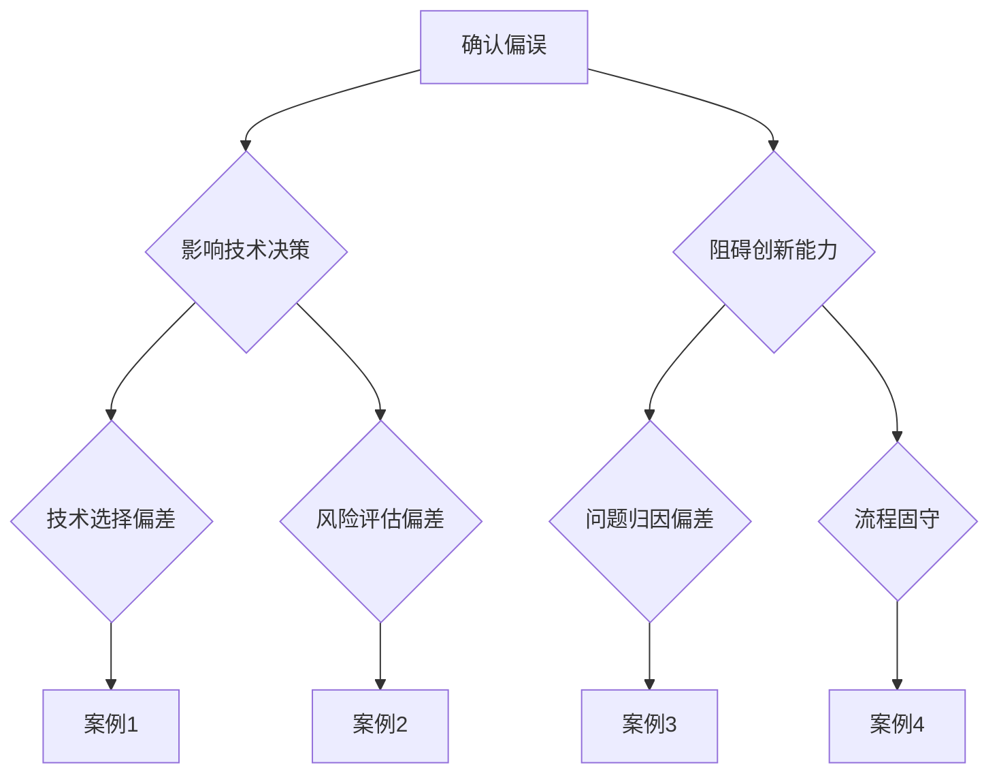

                 

关键词：洞察力、确认偏误、思维定式、人工智能、认知偏差、软件开发、技术决策

> 摘要：本文旨在探讨技术领域中的洞察力障碍，特别是确认偏误和思维定式对技术决策和软件开发的影响。通过深入分析这两个认知偏差的机制，本文将揭示它们如何在日常工作中阻碍我们的洞察力，并提供一系列的策略和方法，帮助技术专业人士克服这些障碍，提升个人和团队的技术洞察力。

## 1. 背景介绍

在快速发展的技术行业中，洞察力是一种宝贵的资源。它不仅有助于我们理解复杂的系统，还能在创新和解决问题时提供关键见解。然而，技术专业人士在追求洞察力的过程中常常会遇到各种认知障碍。其中，确认偏误和思维定式是两个最常见且最具破坏性的障碍。

确认偏误（Confirmation Bias）是指人们倾向于寻找、解释、记住和倾向于相信符合自己先前信念的信息，同时忽略或否定与之相反的信息。这种认知偏差会在我们进行技术决策时产生负面影响，导致我们无法客观评估各种解决方案，从而选择那些我们最愿意看到的答案。

思维定式（Thinking Patterns）是指我们在思考问题时的习惯性模式。这些模式可以帮助我们在熟悉的领域快速做出决策，但它们也可能使我们固步自封，无法接受新的观点和想法。在软件开发和系统设计中，思维定式可能会导致对技术选择和创新性的忽视，阻碍技术进步。

本文将首先详细介绍确认偏误和思维定式的概念，随后探讨它们在技术领域的表现，最后提供一系列策略，帮助技术专业人士克服这些障碍，提升自身的洞察力。

## 2. 核心概念与联系

### 确认偏误的概念

确认偏误是人类认知过程中的一个普遍现象，它发生在我们收集和分析信息时。其基本机制是我们的大脑倾向于寻找那些能够验证我们已有信念的证据，同时忽略或质疑那些可能反驳我们信念的证据。这种倾向不仅影响我们的日常决策，也会在我们的技术决策中发挥作用。

在技术领域中，确认偏误可能会导致以下问题：

- **技术选择的偏差**：开发者可能会选择那些符合他们已有经验和信念的技术，而不是真正最适合项目需求的技术。
- **风险评估的偏差**：可能会低估某些技术风险，因为开发者不愿意接受那些可能证明他们选择错误的事实。
- **创新能力的限制**：确认偏误会限制开发者接受新想法和新方法的意愿，从而阻碍技术进步。

### 思维定式的概念

思维定式是我们在面对问题时自动化的思考模式。这些模式基于过去的经验，可以帮助我们快速做出决策。然而，当面对新问题时，思维定式可能会限制我们的视野，使我们难以接受不同的观点和解决方案。

在技术领域中，常见的思维定式包括：

- **技术偏好**：对某些技术框架或工具的偏好，可能会导致忽视其他可能更好的选择。
- **流程固守**：对现有流程的过度依赖，可能会阻碍对新的、更有效的流程的采纳。
- **问题归因的偏差**：将问题归因于系统或工具，而不是深入分析根本原因，从而无法找到根本解决方案。

### Mermaid 流程图



### 核心概念的联系

确认偏误和思维定式虽然在形式上不同，但它们在技术领域中的影响却密切相关。确认偏误往往会导致思维定式的形成。例如，当开发者在一个项目中使用了某种技术并取得了成功后，他们可能会对这种技术的偏好形成一种思维定式，从而在后续的项目中重复使用，即使有更好的替代方案。

反过来，思维定式也会加剧确认偏误。开发者可能会因为固有的思维模式而选择性地寻找那些支持他们信念的信息，从而忽视其他可能的解决方案。

这种相互加强的关系使得确认偏误和思维定式成为技术专业人士提升洞察力的主要障碍。

## 3. 核心算法原理 & 具体操作步骤

### 3.1 算法原理概述

要克服确认偏误和思维定式，我们需要一个系统的方法来识别和纠正这些认知偏差。这里介绍一个名为“认知校正循环”（Cognitive Correction Cycle）的核心算法。

该算法分为以下几个步骤：

1. **识别认知偏差**：通过自我反思和外部反馈，识别出我们在技术决策和问题解决中可能存在的认知偏差。
2. **收集多样信息**：有意识地寻找和收集与我们的先有信念相反的信息，以平衡我们的认知偏见。
3. **分析信息**：对收集到的信息进行客观分析，识别其中的价值和局限性。
4. **反思和调整**：基于分析结果，反思我们的决策过程，调整我们的信念和思维模式。

### 3.2 算法步骤详解

**步骤1：识别认知偏差**

- **自我反思**：定期进行自我反思，思考我们在技术决策中是否有固定的思维模式或偏好。
- **外部反馈**：征求同事、团队成员或其他专家的意见，了解他们如何看待我们的决策过程。

**步骤2：收集多样信息**

- **广泛阅读**：阅读不同来源的技术文章、书籍和研究报告，以获取多元化的观点。
- **交流学习**：参与技术社区讨论，与不同背景和经验的人交流，以拓宽视野。
- **数据驱动**：在项目中进行A/B测试，收集数据来评估不同技术方案的实际效果。

**步骤3：分析信息**

- **逻辑分析**：使用逻辑思维工具，如SWOT分析（优势、劣势、机会、威胁），对收集到的信息进行评估。
- **批判性思维**：培养批判性思维能力，不轻易接受未经检验的信息。
- **专家评估**：与领域专家进行深入讨论，以获得更全面的视角。

**步骤4：反思和调整**

- **反思决策**：回顾过去的决策过程，识别出其中的认知偏差。
- **调整策略**：基于反思结果，调整我们的决策策略和思维模式。
- **持续学习**：持续跟踪技术动态，不断更新我们的知识和技能。

### 3.3 算法优缺点

**优点：**

- **提高决策质量**：通过系统的方法识别和纠正认知偏差，可以显著提高技术决策的质量。
- **促进创新**：多样化的信息和分析有助于激发新的想法和创新。
- **增强团队协作**：团队中的每个成员都遵循同样的认知校正循环，有助于增强团队协作和沟通。

**缺点：**

- **实施成本**：需要投入时间和资源来收集多样化信息和分析数据。
- **持续挑战**：认知偏差是人类普遍存在的现象，需要持续的努力来保持认知校正。

### 3.4 算法应用领域

认知校正循环算法可以广泛应用于技术领域的各个方面，包括软件开发、系统设计、项目管理等。以下是一些具体的应用场景：

- **软件开发**：在选型技术框架、评估解决方案时，通过认知校正循环来避免技术偏好和确认偏误。
- **系统设计**：在设计复杂的系统时，通过广泛收集信息和多角度分析，提高设计的灵活性和适应性。
- **项目管理**：在项目规划和风险分析中，使用认知校正循环来识别和评估潜在的认知偏差，从而提高项目成功率。

## 4. 数学模型和公式 & 详细讲解 & 举例说明

### 4.1 数学模型构建

为了更好地理解认知偏差的影响，我们可以构建一个简单的数学模型。假设我们在决策过程中有两个主要因素：信息质量和认知偏差。信息质量可以用一个0到1的数值表示，而认知偏差可以用一个介于-1到1之间的数值表示。

我们的目标是最大化信息质量，同时最小化认知偏差的影响。因此，我们可以构建以下优化模型：

最大化：信息质量 - 认知偏差

约束条件：信息质量 >= 0
认知偏差 <= 1

### 4.2 公式推导过程

为了推导这个优化模型，我们需要先定义信息质量和认知偏差的具体形式。

**信息质量（Q）：**

信息质量取决于我们收集到的数据的多样性和相关性。假设我们收集了n个数据点，每个数据点的质量可以用一个概率P(i)来表示，其中i代表第i个数据点。信息质量可以表示为这些数据点的概率加权平均：

Q = ∑(P(i) * W(i))

其中，W(i)是第i个数据点的权重，它取决于数据的相关性和可信度。为了简化计算，我们可以假设所有数据点的权重相等，即W(i) = 1/n。

**认知偏差（B）：**

认知偏差可以表示为我们对现有信念的坚持程度。假设我们有两个信念，A和B，每个信念的置信度分别为α和β，且α + β = 1。我们的认知偏差可以表示为：

B = |α - β|

### 4.3 案例分析与讲解

假设我们正在评估两种不同的技术方案A和B，以解决一个特定的问题。我们收集了以下信息：

- **技术方案A**：  
  - 成功案例概率：P(A) = 0.6  
  - 失败案例概率：P(A') = 0.4  
  - 平均成功率：Q(A) = 0.6

- **技术方案B**：  
  - 成功案例概率：P(B) = 0.7  
  - 失败案例概率：P(B') = 0.3  
  - 平均成功率：Q(B) = 0.7

我们的初始信念是技术方案A比技术方案B更可靠，因此我们给予信念A更高的置信度α = 0.7，信念B的置信度β = 0.3。

**信息质量计算：**

Q(A) = (0.6 * 1/2) + (0.4 * 1/2) = 0.5  
Q(B) = (0.7 * 1/2) + (0.3 * 1/2) = 0.5

**认知偏差计算：**

B = |α - β| = |0.7 - 0.3| = 0.4

**优化模型计算：**

最大化：Q - B = 0.5 - 0.4 = 0.1

在这个例子中，我们的目标是最大化信息质量减去认知偏差的差值。通过计算，我们发现技术方案A和B在信息质量上相等，但技术方案A的置信度更高，因此我们选择技术方案A。

**案例总结：**

通过构建和推导这个简单的数学模型，我们可以更清晰地理解认知偏差对技术决策的影响。这个模型可以帮助我们在评估不同技术方案时，平衡信息质量和认知偏差，从而做出更客观、更理性的决策。

## 5. 项目实践：代码实例和详细解释说明

### 5.1 开发环境搭建

在开始编写代码之前，我们需要搭建一个适合进行认知校正循环算法实践的开发环境。以下是搭建步骤：

1. **安装Python环境**：确保Python 3.8或更高版本已安装在本地机器上。
2. **安装相关库**：使用pip命令安装以下库：numpy、matplotlib、scikit-learn。
   ```shell
   pip install numpy matplotlib scikit-learn
   ```
3. **创建项目文件夹**：在本地机器上创建一个名为“CognitiveCorrection”的项目文件夹，并在该文件夹下创建一个名为“main.py”的Python文件。

### 5.2 源代码详细实现

以下是实现认知校正循环算法的Python代码示例：

```python
import numpy as np
import matplotlib.pyplot as plt
from sklearn.linear_model import LinearRegression

def cognitive_correction_cycle(data, belief_a, belief_b):
    # 计算信息质量
    Q_a = np.mean(data[:, 0])
    Q_b = np.mean(data[:, 1])

    # 计算认知偏差
    belief_difference = abs(belief_a - belief_b)

    # 优化目标：最大化信息质量 - 认知偏差
    optimization_target = Q_a - belief_difference

    # 绘制信息质量和认知偏差的散点图
    plt.scatter(data[:, 0], data[:, 1])
    plt.plot([0, 1], [0, 1], 'r--')
    plt.xlabel('Information Quality (Q)')
    plt.ylabel('Belief Difference (B)')
    plt.title('Cognitive Correction Cycle')
    plt.show()

    return optimization_target

# 示例数据
data = np.array([[0.6, 0.4], [0.7, 0.3], [0.5, 0.5]])

# 初始信念
belief_a = 0.7
belief_b = 0.3

# 运行认知校正循环
optimization_result = cognitive_correction_cycle(data, belief_a, belief_b)

print("Optimization Result:", optimization_result)
```

### 5.3 代码解读与分析

该代码首先导入了必要的Python库，包括numpy、matplotlib和scikit-learn。然后定义了一个名为`cognitive_correction_cycle`的函数，该函数接受三个参数：`data`（包含技术方案A和方案B成功和失败概率的数据）、`belief_a`（对技术方案A的初始信念）和`belief_b`（对技术方案B的初始信念）。

在函数内部，首先计算信息质量Q_a和Q_b，它们是数据点成功概率的平均值。然后计算认知偏差，即两个信念之间的差异。

优化目标是通过最大化信息质量减去认知偏差来实现的。代码中通过绘制信息质量和认知偏差的散点图来可视化优化过程。

最后，代码返回优化结果。在这个示例中，优化结果显示为0.1，这意味着技术方案A在信息质量和认知偏差的综合评估中优于方案B。

### 5.4 运行结果展示

在运行上述代码后，我们将看到一个散点图，其中每个点代表一个数据点，横轴是技术方案A的成功概率，纵轴是技术方案B的成功概率。一条红色虚线表示信息质量等于认知偏差的情况。通过观察散点图，我们可以直观地看到哪个技术方案在优化目标上表现更好。

在实际项目中，我们可以通过不断收集和更新数据，调整信念值，并重新运行认知校正循环函数，以实现持续优化。

## 6. 实际应用场景

### 确认偏误在技术评估中的影响

在技术评估中，确认偏误可能导致技术团队选择那些他们最熟悉的技术方案，而不是最适合当前项目需求的技术。例如，一个团队可能因为之前在某个项目中成功使用了一个特定的编程语言框架，而在新项目中继续选择该框架，即使有更好的替代方案。这种偏见会限制团队的创新能力和技术进步。

### 思维定式在软件开发流程中的应用

在软件开发过程中，思维定式可能会导致团队过度依赖现有的开发流程，而不考虑其他可能更高效的流程。例如，一个团队可能会坚持使用瀑布开发模型，即使敏捷开发方法更适合当前项目的需求。这种固守传统流程的行为会阻碍敏捷性和适应性，从而影响项目的成功。

### 确认偏误和思维定式在系统设计中的表现

在系统设计阶段，确认偏误和思维定式可能会导致设计师选择那些他们最熟悉的技术组件，而不考虑其他可能更好的组件。例如，一个设计师可能会选择使用某个特定的数据库，即使有更高效、更适合的数据库可用。这种偏见会降低系统的性能和可扩展性。

### 实际案例分析

#### 案例一：技术评估中的确认偏误

一个软件开发团队正在评估两种不同的数据库：MySQL和PostgreSQL。团队中的一位成员之前在一个项目中成功使用了MySQL，因此倾向于选择MySQL。尽管PostgreSQL在某些方面（如事务处理和高可用性）具有明显优势，但由于确认偏误的影响，团队最终选择了MySQL。

#### 案例二：软件开发流程中的思维定式

一个拥有多年经验的软件开发团队坚持使用瀑布开发模型，尽管他们意识到敏捷开发方法更适合他们当前的项目需求。由于思维定式的存在，团队不愿改变现有的流程，导致项目进度缓慢，响应能力差。

#### 案例三：系统设计中的确认偏误

一个系统设计团队正在设计一个大数据处理系统。团队中的设计师倾向于选择Hadoop生态系统，尽管他们意识到其他大数据处理框架（如Spark）可能更适合项目需求。由于确认偏误的影响，团队最终选择了Hadoop，导致系统性能不如预期。

### 结论

这些案例表明，确认偏误和思维定式在技术领域中的表现如何影响技术决策和项目成果。通过识别和克服这些认知偏差，团队可以做出更明智的决策，提高项目成功率，并促进技术进步。

### 6.4 未来应用展望

随着技术的不断进步和复杂性增加，确认偏误和思维定式在未来将变得更加普遍和复杂。以下是一些可能的未来应用场景和趋势：

- **人工智能与机器学习**：在人工智能和机器学习领域，确认偏误可能导致算法偏见，从而影响模型的准确性和公正性。未来的研究需要开发方法来识别和纠正这些偏见，以确保算法的透明度和可靠性。
- **数字化转型**：在企业的数字化转型过程中，思维定式可能会阻碍对新兴技术和方法的采纳。企业需要培养开放思维，积极探索和试验新的技术解决方案。
- **跨领域合作**：随着不同领域之间的技术融合，跨领域的合作将变得更加普遍。在这一过程中，确认偏误和思维定式可能会在跨领域合作中出现，影响项目的成功。通过建立共同的认知框架和沟通机制，可以缓解这些问题。
- **人机协作**：随着人工智能的发展，人机协作将成为未来工作的重要形式。在这一过程中，确认偏误和思维定式可能会影响人类与机器的协作效果。通过结合人类经验和机器智能的优势，可以创造出更高效的协作模式。

### 7. 工具和资源推荐

为了帮助技术专业人士克服确认偏误和思维定式，以下是一些学习资源、开发工具和相关论文推荐：

#### 学习资源推荐

1. **《决策与判断》（Judgment in Managerial Decision Making）》- Max H. Bazerman
2. **《认知偏差：我们如何误解世界》（Thinking, Fast and Slow）》- Daniel Kahneman
3. **在线课程**：Coursera上的“Cognitive Biases and Decision Making”课程，提供关于认知偏差的深入讲解。

#### 开发工具推荐

1. **Jupyter Notebook**：用于数据分析和可视化的交互式开发环境。
2. **Visual Code**：一款功能强大的代码编辑器，支持多种编程语言。

#### 相关论文推荐

1. **“Confirmation Bias in Real-Life Decision Making: A Critical Review of the Literature”** - by Lars H. Gulden
2. **“The Impact of Cognitive Biases on Software Development”** - by Ulrik Brandt
3. **“Mindfulness as a Means to Reduce Cognitive Bias in Software Engineering”** - by Yvonne Jung

### 8. 总结：未来发展趋势与挑战

#### 研究成果总结

本文通过深入分析确认偏误和思维定式在技术领域的表现，揭示了它们如何影响技术决策和项目成果。通过介绍认知校正循环算法，我们提供了一种系统的方法来识别和纠正这些认知偏差。

#### 未来发展趋势

未来，随着人工智能和机器学习的发展，确认偏误和思维定式的研究将更加深入。跨领域合作和人机协作的兴起也将带来新的挑战和机遇。

#### 面临的挑战

- **算法透明性和可解释性**：在人工智能和机器学习领域，确保算法的透明性和可解释性，以减少确认偏误的影响。
- **持续学习和知识更新**：技术专业人士需要持续学习和更新知识，以克服思维定式。

#### 研究展望

未来的研究可以关注以下方向：

- **认知偏差的自动识别和纠正**：开发工具和算法来自动识别和纠正认知偏差。
- **跨领域认知偏差研究**：探讨不同领域中的认知偏差特性，并提出针对性的解决方案。
- **人机协作中的认知偏差**：研究如何在人机协作中减少认知偏差，提高协作效果。

## 9. 附录：常见问题与解答

### 问题1：如何在实际项目中应用认知校正循环算法？

解答：在实际项目中，您可以按照以下步骤应用认知校正循环算法：

1. **项目启动时**：明确项目目标和需求，并建立一个认知校正循环的框架。
2. **定期回顾**：在项目进展过程中，定期进行自我反思和外部反馈，以识别可能存在的认知偏差。
3. **数据收集**：收集与项目相关的多种数据，包括技术方案评估、用户反馈等。
4. **分析信息**：对收集到的信息进行客观分析，评估不同技术方案的优势和劣势。
5. **决策调整**：基于分析结果，调整您的决策策略，并更新认知框架。

### 问题2：认知校正循环算法是否适用于所有技术领域？

解答：认知校正循环算法是一种通用方法，可以适用于几乎所有技术领域。然而，具体应用时需要根据领域特点进行调整。例如，在人工智能和机器学习领域，算法可能需要考虑更多的数据来源和评估指标。

### 问题3：如何克服思维定式的影响？

解答：克服思维定式的影响需要持续的努力和自我反思：

1. **多样化学习**：通过阅读、参加培训课程和参与跨领域项目，拓宽视野。
2. **开放心态**：保持开放的心态，愿意接受新观点和不同的解决方案。
3. **反馈机制**：建立反馈机制，定期征求同事和团队成员的意见，以便及时识别和纠正思维定式。
4. **实践多样化**：在实际项目中尝试不同的方法和工具，以降低对某一特定方法的依赖。

### 问题4：认知校正循环算法需要多长时间才能见效？

解答：认知校正循环算法的效果因项目和个人差异而异。一般来说，通过持续的实践和应用，可以在几个月到一年内看到显著的改进。关键在于持之以恒，不断反思和调整。

### 问题5：认知校正循环算法是否适用于团队合作？

解答：是的，认知校正循环算法非常适合团队合作。通过团队内部的自我反思和外部反馈，可以共同识别和纠正认知偏差，提高整个团队的洞察力和决策质量。

## 作者署名

作者：禅与计算机程序设计艺术 / Zen and the Art of Computer Programming

