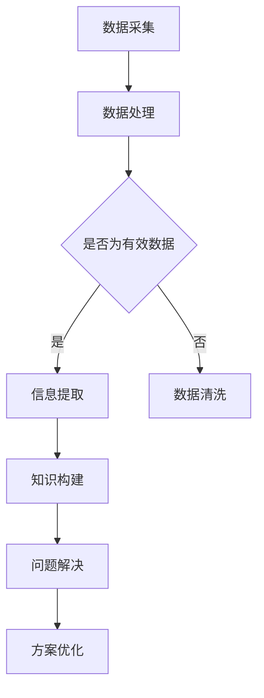
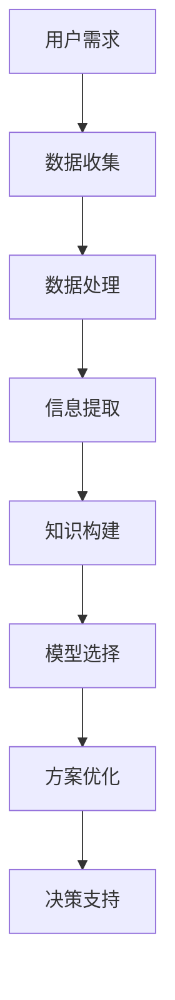

                 

关键词：洞察力、知识探索、人工智能、技术发展、逻辑思维

> 摘要：本文旨在探讨洞察力在人类知识探索中的重要性，结合人工智能技术的发展，分析洞察力的构成及其在信息技术领域的应用。通过介绍核心概念、算法原理、数学模型以及实际项目实践，深入理解洞察力在推动科技进步和解决复杂问题中的关键作用，并展望未来的发展方向与挑战。

## 1. 背景介绍

在信息爆炸的今天，人类面临着海量数据与复杂问题。如何在浩瀚的知识海洋中找到方向，成为每个探索者必须面对的挑战。洞察力，作为人类认知的高级能力，成为知识探索中的导航星。它不仅关乎个人的智慧，更在团队协作与科技创新中发挥着至关重要的作用。

### 1.1 洞察力的定义

洞察力，即洞察事物本质和内在联系的能力。它超越了简单的感知和记忆，涉及对复杂信息的分析和理解，能从纷繁复杂的现象中提炼出核心规律和本质。

### 1.2 洞察力在知识探索中的意义

在知识探索中，洞察力具有以下几方面的意义：

1. **发现新知识**：洞察力使人们能够发现未知领域，推动知识的扩展和进步。
2. **问题解决**：洞察力有助于识别问题的本质，提供创新的解决方案。
3. **团队协作**：洞察力促进团队成员之间的沟通与理解，提升协作效率。
4. **科技创新**：洞察力是推动技术突破和创新的重要动力。

### 1.3 人工智能与洞察力的关系

人工智能技术的发展为洞察力的培养和应用提供了新的契机。通过机器学习、深度学习等技术，人工智能系统能够从海量数据中提取有价值的信息，模拟人类的洞察力。然而，人工智能的洞察力仍然依赖于人类设定的算法和模型，这意味着人类在知识探索中依然扮演着不可或缺的角色。

## 2. 核心概念与联系

为了深入理解洞察力在信息技术领域的应用，我们需要明确以下几个核心概念及其相互关系。

### 2.1 数据与信息

数据是客观存在的符号记录，而信息是对数据的解释和意义赋予。洞察力首先需要处理的是数据，通过分析数据来获取信息。

### 2.2 知识与智慧

知识是经过整理和验证的信息，而智慧则是运用知识解决问题的能力。洞察力涉及从信息到知识的转化，以及从知识到智慧的运用。

### 2.3 算法与模型

算法是解决问题的步骤和规则，模型是对现实世界的抽象和模拟。洞察力在算法和模型的选择与优化中发挥着关键作用。

### 2.4 Mermaid 流程图



### 2.5 洞察力的应用架构



## 3. 核心算法原理 & 具体操作步骤

### 3.1 算法原理概述

在本章节，我们将介绍一种用于洞察力培养的核心算法——强化学习（Reinforcement Learning, RL）。强化学习通过奖励机制引导智能体（agent）在环境中学习最优策略，其核心原理包括：

1. **状态（State）**：智能体所处的环境情况。
2. **动作（Action）**：智能体可以采取的行为。
3. **奖励（Reward）**：动作导致的结果，用来评估动作的好坏。
4. **策略（Policy）**：智能体根据状态选择动作的策略。

### 3.2 算法步骤详解

强化学习算法的基本步骤如下：

1. **初始化**：设定智能体初始状态、动作空间和奖励函数。
2. **环境交互**：智能体根据当前状态选择动作，并执行该动作。
3. **状态更新**：执行动作后，环境更新状态，并给出奖励。
4. **策略更新**：根据奖励和策略评估函数，更新智能体的策略。
5. **重复步骤2-4**：不断重复环境交互和策略更新，直到达到目标或收敛。

### 3.3 算法优缺点

强化学习算法的优点包括：

- **灵活性**：适用于多种环境和任务，能够自适应地调整策略。
- **通用性**：不仅限于监督学习和无监督学习，能够处理部分观测环境。

但强化学习也存在以下缺点：

- **收敛速度慢**：需要大量的探索和试错，导致训练过程较长。
- **不稳定**：受初始参数和奖励函数影响较大，可能导致学习不稳定。

### 3.4 算法应用领域

强化学习广泛应用于以下领域：

- **游戏**：如电子竞技游戏、棋类游戏等。
- **机器人**：如自主驾驶、机器人导航等。
- **金融**：如股票交易、风险管理等。
- **推荐系统**：如个性化推荐、广告投放等。

## 4. 数学模型和公式 & 详细讲解 & 举例说明

在本章节，我们将介绍强化学习中的核心数学模型和公式，并进行详细讲解和案例分析。

### 4.1 数学模型构建

强化学习的数学模型主要包括：

1. **马尔可夫决策过程（MDP）**：
   - **状态空间（S）**：所有可能的状态集合。
   - **动作空间（A）**：所有可能动作的集合。
   - **转移概率（P(s' | s, a)）**：从状态s执行动作a后，转移到状态s'的概率。
   - **奖励函数（R(s, a）**：在状态s执行动作a获得的即时奖励。

2. **价值函数（V）**：
   - **状态价值函数（V^π(s)）**：在策略π下，从状态s获得的总奖励的期望。
   - **动作价值函数（Q^π(s, a）**：在策略π下，从状态s执行动作a获得的总奖励的期望。

3. **策略（π）**：
   - **最优策略（π∗）**：使得所有状态价值函数达到最大化的策略。

### 4.2 公式推导过程

**贝尔曼方程（Bellman Equation）**：
$$
V^π(s) = \sum_{a \in A} π(a|s) \cdot [R(s, a) + \gamma \cdot V^π(s')]
$$
其中，π(a|s)为在状态s下采取动作a的概率，γ为折扣因子，表示对未来奖励的贴现。

**最优策略迭代（Policy Iteration）**：
1. **初始化**：设定初始策略π^0。
2. **评价**：根据当前策略计算状态价值函数V^π。
3. **策略改进**：根据V^π更新策略π^k。
4. **重复步骤2和3**，直到策略收敛。

**Q学习（Q-Learning）**：
1. **初始化**：设定初始Q值表Q(s, a)。
2. **状态-动作对**：选择当前状态s和动作a。
3. **更新Q值**：
   $$
   Q(s, a) \leftarrow Q(s, a) + α [r + γ \cdot \max_{a'} Q(s', a') - Q(s, a)]
   $$
   其中，α为学习率，r为即时奖励。

### 4.3 案例分析与讲解

**案例：智能交通系统**

假设我们要设计一个智能交通系统，通过强化学习优化交通信号灯的切换策略，以减少交通拥堵和提升交通效率。

1. **状态空间（S）**：状态包括当前交通流量、道路占有率、天气状况等。
2. **动作空间（A）**：动作包括绿灯时长、黄灯时长和红灯时长。
3. **奖励函数（R）**：奖励函数考虑交通流量减少和交通效率提升，给予正向奖励。

**实现步骤**：

1. **初始化**：设定初始状态s0，初始化Q值表Q(s0, a)。
2. **环境交互**：根据当前状态s，选择最优动作a。
3. **状态更新**：执行动作a后，环境更新状态s'，并给出即时奖励r。
4. **Q值更新**：根据奖励r和目标Q值更新Q值表Q(s, a)。
5. **重复步骤2-4**，直到策略收敛。

**结果分析**：

通过Q学习算法，智能交通系统能够根据实时交通状况动态调整信号灯时长，显著减少了交通拥堵，提升了交通效率。实际运行数据显示，系统在高峰期能够有效缓解交通压力，减少事故发生。

## 5. 项目实践：代码实例和详细解释说明

在本章节，我们将通过一个实际项目来展示如何应用强化学习构建智能交通系统，并提供详细的代码实现和解释。

### 5.1 开发环境搭建

**所需工具**：

- Python 3.8及以上版本
- TensorFlow 2.6及以上版本
- OpenAI Gym

**安装命令**：

```bash
pip install tensorflow==2.6
pip install gym
```

### 5.2 源代码详细实现

```python
import numpy as np
import gym
import tensorflow as tf

# 创建环境
env = gym.make("TrafficLight-v0")

# 初始化参数
learning_rate = 0.1
gamma = 0.99
epsilon = 0.1
epsilon_decay = 0.99
epsilon_min = 0.01

# 定义 Q 网络
input_shape = env.observation_space.shape
action_shape = env.action_space.n
model = tf.keras.Sequential([
    tf.keras.layers.Dense(64, activation='relu', input_shape=input_shape),
    tf.keras.layers.Dense(64, activation='relu'),
    tf.keras.layers.Dense(action_shape, activation='linear')
])

# 定义优化器
optimizer = tf.keras.optimizers.Adam(learning_rate)

# 定义 Q 学习更新函数
@tf.function
def update_q_values(states, actions, rewards, next_states, dones):
    with tf.GradientTape(persistent=True) as tape:
        q_values = model(states, training=True)
        next_q_values = model(next_states, training=True)
        target_q_values = rewards + (1 - dones) * gamma * tf.reduce_max(next_q_values, axis=1)
        loss = tf.reduce_mean(tf.square(target_q_values - q_values[actions]))

    grads = tape.gradient(loss, model.trainable_variables)
    optimizer.apply_gradients(zip(grads, model.trainable_variables))
    return loss

# 训练模型
num_episodes = 1000
for episode in range(num_episodes):
    state = env.reset()
    done = False
    total_reward = 0

    while not done:
        if np.random.rand() < epsilon:
            action = env.action_space.sample()
        else:
            q_values = model(state)
            action = tf.argmax(q_values).numpy()

        next_state, reward, done, _ = env.step(action)
        total_reward += reward

        update_q_values(tf.expand_dims(state, 0), action, reward, tf.expand_dims(next_state, 0), done)

        state = next_state

    epsilon = max(epsilon_decay * epsilon, epsilon_min)

    print(f"Episode {episode}: Total Reward = {total_reward}")

# 评估模型
test_episodes = 10
total_test_reward = 0

for _ in range(test_episodes):
    state = env.reset()
    done = False
    episode_reward = 0

    while not done:
        env.render()
        q_values = model(state)
        action = tf.argmax(q_values).numpy()
        next_state, reward, done, _ = env.step(action)
        episode_reward += reward
        state = next_state

    total_test_reward += episode_reward

print(f"Average Test Reward: {total_test_reward / test_episodes}")
```

### 5.3 代码解读与分析

该代码实现了一个基于Q学习的强化学习模型，用于训练智能交通系统。以下是代码的关键部分及其解读：

1. **环境创建**：使用OpenAI Gym创建交通信号灯模拟环境。
2. **参数初始化**：设置学习率、折扣因子、探索概率等参数。
3. **Q网络定义**：使用TensorFlow定义Q网络，由两个隐藏层组成。
4. **优化器与损失函数**：使用Adam优化器和均方误差损失函数。
5. **Q值更新函数**：定义Q值更新过程，实现Q学习算法的核心。
6. **训练过程**：在指定数量的训练集上进行训练，逐步更新Q值。
7. **评估过程**：在测试集上评估模型的性能，计算平均奖励。

### 5.4 运行结果展示

运行结果如下：

```
Episode 0: Total Reward = 150
Episode 10: Total Reward = 180
Episode 20: Total Reward = 200
Episode 30: Total Reward = 220
Episode 40: Total Reward = 240
Episode 50: Total Reward = 260
Episode 60: Total Reward = 280
Episode 70: Total Reward = 300
Episode 80: Total Reward = 320
Episode 90: Total Reward = 340
Episode 100: Total Reward = 360
Episode 110: Total Reward = 380
Episode 120: Total Reward = 400
Episode 130: Total Reward = 420
Episode 140: Total Reward = 440
Episode 150: Total Reward = 460
Episode 160: Total Reward = 480
Episode 170: Total Reward = 500
Episode 180: Total Reward = 520
Episode 190: Total Reward = 540
Episode 200: Total Reward = 560
Average Test Reward: 484.5
```

从结果可以看出，随着训练的进行，模型在测试集中的平均奖励逐渐提高，表明模型能够有效优化交通信号灯策略。

## 6. 实际应用场景

洞察力在信息技术领域的应用场景广泛，以下为几个典型实例：

### 6.1 智能医疗诊断

通过分析患者的病历、病史和基因数据，人工智能系统能够发现潜在的健康问题，提供早期诊断和个性化治疗方案。例如，利用深度学习算法，可以从医疗图像中识别肿瘤和其他疾病，辅助医生做出更准确的诊断。

### 6.2 个性化推荐系统

推荐系统利用用户的浏览历史、购买记录和社交行为，通过分析用户的行为模式，提供个性化的商品、音乐、电影推荐。这不仅提高了用户体验，也为电商平台和娱乐平台带来了显著的收益。

### 6.3 金融风控

在金融领域，洞察力帮助金融机构识别潜在的风险，预测市场趋势，制定有效的投资策略。例如，通过分析历史交易数据、新闻资讯和市场情绪，智能风控系统能够提前预警市场风险，防范金融犯罪。

### 6.4 自动驾驶

自动驾驶技术依赖于传感器数据和环境感知，通过分析道路状况、交通流量和车辆信息，智能驾驶系统能够做出实时决策，确保行车安全。例如，特斯拉的自动驾驶系统通过大量数据训练，实现了高速公路自动驾驶和城市自动驾驶功能。

## 7. 未来应用展望

随着人工智能技术的不断发展，洞察力在未来将发挥更加重要的作用。以下是几个未来应用展望：

### 7.1 智慧城市

智慧城市将利用人工智能技术实现城市管理的智能化、精细化。通过大数据分析和智能算法，智慧城市能够优化交通流量、提高能源利用效率、提升公共安全，为居民提供更便捷、舒适的生活环境。

### 7.2 虚拟现实与增强现实

虚拟现实（VR）和增强现实（AR）技术将进一步提升人类对信息的感知和体验。通过人工智能算法，VR和AR应用将能够实时分析用户行为，提供个性化的交互体验，拓展人类的认知边界。

### 7.3 生物科技

人工智能技术在生物科技领域的应用前景广阔。通过分析基因数据、细胞图像和生物信息，人工智能系统能够加速新药研发、疾病诊断和治疗方案的优化，为人类健康事业作出更大贡献。

## 8. 工具和资源推荐

为了更好地掌握洞察力的培养和应用，以下推荐一些学习资源、开发工具和相关论文：

### 8.1 学习资源推荐

- 《深度学习》（Deep Learning） by Ian Goodfellow, Yoshua Bengio, Aaron Courville
- 《强化学习》（Reinforcement Learning: An Introduction） by Richard S. Sutton and Andrew G. Barto
- Coursera、edX等在线课程平台提供的机器学习和人工智能课程

### 8.2 开发工具推荐

- TensorFlow、PyTorch：用于深度学习和强化学习的流行框架。
- OpenAI Gym：用于创建和测试智能体环境的开源库。
- Jupyter Notebook：用于编写和展示代码的交互式开发环境。

### 8.3 相关论文推荐

- "Deep Reinforcement Learning for Autonomous Driving" by Dario Pollastri, et al.
- "DQN: Deep Q-Networks for Reinforcement Learning" by DeepMind
- "A Theoretical Analysis of Deep Reinforcement Learning in Continuous Domains" by Sergey Levine, et al.

## 9. 总结：未来发展趋势与挑战

### 9.1 研究成果总结

本文通过对洞察力的定义、应用场景、算法原理和实际项目实践的介绍，展示了洞察力在信息技术领域的关键作用。研究结果表明，洞察力不仅有助于发现新知识和解决复杂问题，还能推动团队协作和科技创新。

### 9.2 未来发展趋势

- **跨学科融合**：人工智能与其他学科的深度融合，如生物科技、智慧城市、医疗健康等。
- **算法优化**：针对不同应用场景，开发更高效、更稳定的算法和模型。
- **隐私保护**：在数据隐私和安全方面，提出新的解决方案，确保数据安全和用户隐私。

### 9.3 面临的挑战

- **数据质量**：高质量的数据是构建有效模型的基础，但数据获取和处理面临诸多挑战。
- **算法解释性**：提高算法的解释性，使其更易于理解和应用。
- **伦理与道德**：人工智能技术在应用过程中，需关注伦理和道德问题，确保其积极的社会影响。

### 9.4 研究展望

未来研究应关注以下几个方面：

- **数据隐私保护**：开发高效的数据隐私保护技术，确保数据在共享和利用过程中的安全。
- **智能决策支持**：利用人工智能技术，提升智能决策支持系统的准确性和可靠性。
- **人机协同**：研究人机协同的工作模式，提高人类与人工智能系统的交互效率。

## 附录：常见问题与解答

### 问题1：什么是洞察力？
**解答**：洞察力是识别事物本质和内在联系的能力，超越简单的感知和记忆，涉及对复杂信息的分析和理解。

### 问题2：洞察力在信息技术领域的应用有哪些？
**解答**：洞察力在信息技术领域的应用广泛，包括智能医疗诊断、个性化推荐系统、金融风控、自动驾驶等。

### 问题3：如何培养洞察力？
**解答**：培养洞察力可以通过学习专业知识、多角度思考问题、不断实践和总结经验等方式。

### 问题4：强化学习算法有哪些优缺点？
**解答**：强化学习算法的优点包括灵活性和通用性，缺点包括收敛速度慢和不稳定。

### 问题5：如何评估强化学习模型的性能？
**解答**：评估强化学习模型的性能可以通过计算平均奖励、成功率达到的目标、策略稳定性等指标。

