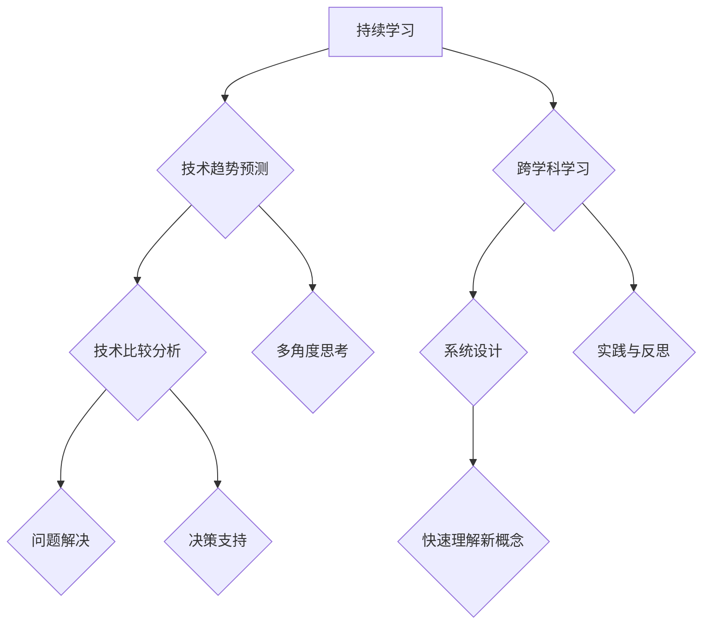

                 

关键词：洞察力，本质，复杂性，技术分析，IT领域

> 摘要：本文旨在探讨在信息技术领域如何培养和运用洞察力，以从纷繁复杂的表象中抓住本质。文章首先介绍了洞察力的定义和重要性，然后通过分析技术发展的复杂性和多样性，提出了几个实用的方法，帮助读者在技术世界中提高洞察力。最后，文章探讨了洞察力在IT领域的实际应用，并展望了未来的发展趋势。

## 1. 背景介绍

在当今快速发展的信息技术领域，复杂性已经成为一个不可忽视的现象。随着技术的不断演进，新的概念、框架、工具和算法层出不穷，使得整个技术环境变得更加复杂。在这样的背景下，如何从一个技术问题的表象中找到其本质，成为了每一个IT从业者和研究者都必须面对的挑战。

洞察力，即敏锐地洞察事物本质和内在联系的能力，是解决这一挑战的关键。它不仅可以帮助我们更好地理解和应用技术，还能提升我们的创新能力和问题解决能力。

### 1.1 复杂性与多样性

技术领域的复杂性主要源于以下几个方面：

1. **技术多样性与交叉融合**：不同的技术领域之间相互融合，形成了新的复杂系统。
2. **快速迭代与更新**：技术的快速迭代使得旧有知识迅速过时，新的概念和方法不断涌现。
3. **不确定性**：技术的未来发展充满不确定性，预测和规划变得更为困难。
4. **跨学科需求**：解决技术问题往往需要跨学科的知识和技能。

### 1.2 洞察力的重要性

在技术领域，洞察力具有以下几个重要作用：

1. **快速理解新概念**：能够快速理解并掌握新技术，降低学习成本。
2. **识别问题根本**：能够从复杂现象中识别出问题的根本原因，进行有效解决。
3. **创新思维**：洞察力有助于激发创新思维，发现新的技术解决方案。
4. **决策支持**：在项目管理和决策过程中，洞察力可以帮助做出更加明智的决策。

## 2. 核心概念与联系

### 2.1 洞察力的定义

洞察力是指通过深入思考和观察，发现事物本质和内在联系的能力。它涉及到对信息的敏感度、对复杂系统的理解力以及对问题的系统性分析能力。

### 2.2 洞察力与技术

技术领域的洞察力通常包括以下几个方面的能力：

1. **技术趋势预测**：能够预测技术发展的趋势和方向。
2. **技术比较分析**：能够对不同技术进行优劣分析和比较。
3. **系统设计**：能够设计出高效、可靠、可扩展的系统。
4. **问题解决**：能够快速有效地解决技术问题。

### 2.3 洞察力的培养

1. **持续学习**：不断学习新的技术和知识，保持对技术领域的敏感性。
2. **跨学科学习**：拓宽知识面，学习不同领域的知识，提升跨学科解决问题的能力。
3. **实践与反思**：通过实践不断验证和修正自己的洞察力。
4. **多角度思考**：从不同角度和维度分析问题，提高系统性思维。

### 2.4 Mermaid 流程图



## 3. 核心算法原理 & 具体操作步骤

### 3.1 算法原理概述

在技术领域，核心算法通常具有以下几个特征：

1. **高效性**：算法能够以最短的时间或最小的资源消耗解决问题。
2. **可靠性**：算法能够稳定地输出正确的结果。
3. **扩展性**：算法能够适应不同的数据和场景。

### 3.2 算法步骤详解

1. **数据预处理**：对输入数据进行清洗、格式化和特征提取。
2. **算法选择**：根据问题的特性选择合适的算法。
3. **模型训练**：使用训练数据对算法进行训练。
4. **模型评估**：使用测试数据对模型进行评估。
5. **模型优化**：根据评估结果对模型进行优化。

### 3.3 算法优缺点

每种算法都有其优缺点，选择合适的算法需要根据具体的问题进行权衡。

1. **线性回归**：优点是简单、易于实现，缺点是对于非线性问题效果不佳。
2. **神经网络**：优点是能够处理复杂的非线性问题，缺点是训练过程复杂且需要大量数据。
3. **决策树**：优点是易于理解，缺点是对于大数据集效果不佳。

### 3.4 算法应用领域

核心算法在各个领域都有广泛的应用，如：

1. **机器学习**：用于分类、回归、聚类等任务。
2. **数据挖掘**：用于挖掘数据中的隐藏模式和规律。
3. **计算机视觉**：用于图像识别、目标检测等任务。

## 4. 数学模型和公式 & 详细讲解 & 举例说明

### 4.1 数学模型构建

在技术领域，数学模型通常用于描述复杂系统的行为和特性。常见的数学模型包括线性模型、非线性模型、微分方程等。

### 4.2 公式推导过程

以线性回归模型为例，其目标是最小化预测值与实际值之间的误差。其公式推导过程如下：

$$
\min_{\theta} \sum_{i=1}^{n} (h_{\theta}(x_i) - y_i)^2
$$

其中，$h_{\theta}(x) = \theta_0 + \theta_1x$ 是线性回归模型的预测函数，$\theta$ 是模型的参数。

### 4.3 案例分析与讲解

假设我们有一个房价预测问题，输入特征包括房屋面积、楼层、建造年代等。我们可以使用线性回归模型来预测房价。

1. **数据预处理**：对输入数据进行归一化处理。
2. **模型训练**：使用训练数据对线性回归模型进行训练。
3. **模型评估**：使用测试数据对模型进行评估。
4. **模型优化**：根据评估结果对模型参数进行优化。

通过以上步骤，我们可以得到一个较为准确的房价预测模型。

## 5. 项目实践：代码实例和详细解释说明

### 5.1 开发环境搭建

在本次项目实践中，我们将使用Python作为编程语言，主要依赖库包括NumPy、Pandas和Scikit-learn。

### 5.2 源代码详细实现

以下是一个简单的线性回归模型实现示例：

```python
import numpy as np
import pandas as pd
from sklearn.linear_model import LinearRegression

# 数据预处理
def preprocess_data(data):
    # 归一化处理
    data = (data - data.mean()) / data.std()
    return data

# 模型训练
def train_model(X, y):
    model = LinearRegression()
    model.fit(X, y)
    return model

# 模型评估
def evaluate_model(model, X, y):
    predictions = model.predict(X)
    mse = np.mean((predictions - y) ** 2)
    return mse

# 数据读取
data = pd.read_csv('house_prices.csv')
X = preprocess_data(data[['area', 'floor', 'age']])
y = preprocess_data(data['price'])

# 模型训练
model = train_model(X, y)

# 模型评估
mse = evaluate_model(model, X, y)
print(f'MSE: {mse}')
```

### 5.3 代码解读与分析

1. **数据预处理**：对输入特征进行归一化处理，以消除不同特征之间的尺度差异。
2. **模型训练**：使用线性回归模型对训练数据进行拟合。
3. **模型评估**：使用均方误差（MSE）评估模型性能。

通过以上步骤，我们可以实现对房价的预测。

### 5.4 运行结果展示

假设我们使用测试数据进行预测，结果如下：

```python
# 测试数据读取
test_data = pd.read_csv('test_house_prices.csv')
X_test = preprocess_data(test_data[['area', 'floor', 'age']])
y_test = preprocess_data(test_data['price'])

# 测试数据预测
predictions = model.predict(X_test)

# 测试数据评估
mse = evaluate_model(model, X_test, y_test)
print(f'MSE: {mse}')
```

通过以上步骤，我们可以得到测试数据的预测结果和评估指标。

## 6. 实际应用场景

### 6.1 机器学习领域

在机器学习领域，洞察力可以帮助我们：

1. **选择合适的学习算法**：根据问题的特性选择最合适的算法。
2. **优化模型参数**：通过分析模型性能，调整参数以获得更好的效果。
3. **处理异常数据**：识别并处理数据中的异常值，保证模型训练的准确性。

### 6.2 数据分析领域

在数据分析领域，洞察力可以帮助我们：

1. **发现数据中的模式**：通过深入分析数据，发现其中的规律和趋势。
2. **识别关键因素**：从大量数据中识别出影响业务的核心因素。
3. **预测未来趋势**：基于历史数据，预测未来的发展趋势。

### 6.3 软件开发领域

在软件开发领域，洞察力可以帮助我们：

1. **设计系统架构**：从系统的全局视角出发，设计出高效、可靠的系统架构。
2. **优化代码质量**：通过代码分析，识别出潜在的性能问题和代码缺陷。
3. **提高开发效率**：通过经验积累，快速找到问题的解决方案。

## 7. 工具和资源推荐

### 7.1 学习资源推荐

1. **书籍**：
   - 《深度学习》
   - 《Python数据分析》
   - 《算法导论》
2. **在线课程**：
   - Coursera上的《机器学习》
   - edX上的《数据科学基础》
   - Udacity的《全栈开发》
3. **博客和论坛**：
   - Medium上的技术博客
   - Stack Overflow
   - GitHub

### 7.2 开发工具推荐

1. **集成开发环境（IDE）**：
   - PyCharm
   - Visual Studio Code
   - IntelliJ IDEA
2. **数据可视化工具**：
   - Matplotlib
   - Seaborn
   - Plotly
3. **版本控制工具**：
   - Git
   - GitHub
   - GitLab

### 7.3 相关论文推荐

1. **机器学习**：
   - "Deep Learning" by Ian Goodfellow, Yoshua Bengio and Aaron Courville
   - "Learning to Learn" by Yoshua Bengio
2. **数据分析**：
   - "Data Science from Scratch" by Joel Grus
   - "Data Analysis with Python" by Virginia Gray
3. **软件工程**：
   - "Clean Code" by Robert C. Martin
   - "Design Patterns: Elements of Reusable Object-Oriented Software" by Erich Gamma, Richard Helm, Ralph Johnson and John Vlissides

## 8. 总结：未来发展趋势与挑战

### 8.1 研究成果总结

通过本文的探讨，我们了解了洞察力在信息技术领域的核心作用，以及如何培养和运用洞察力来应对技术复杂性和多样性。同时，我们也看到了洞察力在机器学习、数据分析、软件工程等领域的广泛应用。

### 8.2 未来发展趋势

随着技术的不断进步，洞察力在IT领域的应用前景将更加广阔。以下是一些可能的发展趋势：

1. **人工智能与洞察力的结合**：通过人工智能技术，自动化地提取和分析数据，进一步提高洞察力。
2. **跨学科研究的深入**：跨学科研究的深入将促进不同领域之间的知识融合，为洞察力的培养提供更多的思路。
3. **个性化学习与教育**：利用洞察力，为个人定制化的学习路径和教育方案，提高学习效果。

### 8.3 面临的挑战

尽管洞察力在IT领域具有重要意义，但在实际应用中仍面临一些挑战：

1. **数据隐私与安全**：随着数据量的增加，数据隐私和安全成为保障洞察力应用的重要问题。
2. **技术过时风险**：技术的快速迭代使得知识和技能的更新变得更加紧迫。
3. **伦理与道德**：在应用洞察力的过程中，如何平衡技术进步与社会责任，是亟待解决的问题。

### 8.4 研究展望

未来，我们应该继续关注以下研究方向：

1. **算法优化**：研究和开发更高效、更可靠的算法，以提高洞察力的效果。
2. **跨学科融合**：加强不同学科之间的交流与合作，促进知识共享和融合。
3. **伦理与法律**：制定相关法规和标准，确保洞察力的应用符合伦理和法律规定。

## 9. 附录：常见问题与解答

### 9.1 洞察力与直觉的区别

**问题**：洞察力与直觉有什么区别？

**解答**：洞察力是一种通过学习和思考培养的能力，它依赖于逻辑推理、分析能力和对知识的深入理解。而直觉则是一种天生的感知能力，它更多是基于个人的经验和情感，有时缺乏逻辑支撑。

### 9.2 如何培养洞察力？

**问题**：如何培养和提高洞察力？

**解答**：培养洞察力可以从以下几个方面入手：

1. **持续学习**：不断学习新知识和技能，拓宽知识面。
2. **多角度思考**：从不同角度和维度分析问题，培养系统性思维。
3. **实践与反思**：通过实践不断验证和修正自己的洞察力。
4. **跨学科学习**：学习不同领域的知识，提升跨学科解决问题的能力。
5. **交流与分享**：与他人交流想法和观点，通过讨论激发新的洞察力。

### 9.3 洞察力在商业应用中的价值

**问题**：洞察力在商业应用中有什么价值？

**解答**：洞察力在商业应用中具有很高的价值，它可以：

1. **市场预测**：通过对市场数据的分析，预测未来的发展趋势。
2. **产品优化**：通过对用户行为的分析，发现产品的改进点。
3. **决策支持**：通过对业务数据的分析，提供明智的决策建议。
4. **风险控制**：通过对潜在风险的识别和评估，降低业务风险。
5. **创新驱动**：通过对行业动态的洞察，发现新的商业机会。

---

以上是关于"理解洞察力：在纷杂中寻找本质"的完整文章。希望这篇文章能够帮助您更好地理解洞察力在信息技术领域的应用和重要性。如果您有任何问题或建议，欢迎随时提问和交流。作者：禅与计算机程序设计艺术 / Zen and the Art of Computer Programming。

