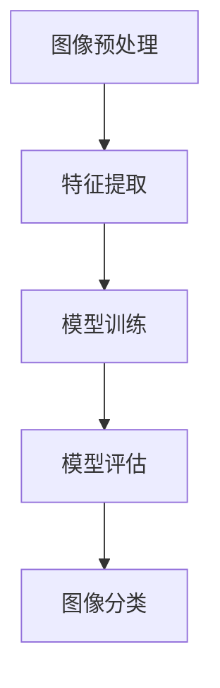

                 

关键词：瓜子二手车、图像识别、车辆识别、深度学习、算法工程、2025年社招、面试题

## 摘要

本文针对瓜子二手车2025年社招车辆图像识别算法工程师的面试题目进行了深入分析和解答。文章首先介绍了车辆图像识别的背景和重要性，然后详细阐述了图像识别的核心概念和原理，接着介绍了常用的车辆识别算法及其优缺点，并通过实际项目实践，展示了车辆图像识别算法的实现过程。最后，本文对车辆图像识别的应用领域进行了展望，并提出了未来发展的挑战和展望。

## 1. 背景介绍

### 1.1 瓜子二手车

瓜子二手车是中国领先的个人二手车交易平台，成立于2015年，总部位于北京。瓜子二手车致力于通过互联网和大数据技术，打造一个透明、高效、安全的二手车交易生态。瓜子二手车在二手车交易市场中占有重要地位，其业务涵盖了二手车买卖、汽车评估、车辆检测、金融服务等多个领域。

### 1.2 车辆图像识别的重要性

随着人工智能技术的发展，图像识别技术已经成为众多领域的关键技术之一。在二手车市场中，车辆图像识别技术具有重要的应用价值。通过车辆图像识别，可以快速、准确地识别车辆的品牌、型号、颜色等信息，从而提高二手车交易的效率和准确性。此外，车辆图像识别技术还可以用于车辆检测、车辆定位、车辆安全监控等多个方面，对于提升二手车市场的整体服务水平具有重要意义。

## 2. 核心概念与联系

### 2.1 图像识别原理

图像识别是指通过计算机技术对图像进行分析和处理，从中提取出有用的信息，实现对图像内容的理解。图像识别的过程可以分为以下几个步骤：

1. **图像预处理**：对原始图像进行缩放、旋转、裁剪等操作，以适应后续处理的需要。
2. **特征提取**：从预处理后的图像中提取出具有区分度的特征，如颜色、纹理、形状等。
3. **模型训练**：使用已标注的图像数据，对模型进行训练，使其能够学习到不同类别图像的特征。
4. **模型评估**：使用测试数据对模型进行评估，以确定模型的准确性、召回率等指标。
5. **图像分类**：使用训练好的模型对新的图像进行分类，预测其属于哪个类别。

### 2.2 车辆识别算法原理

车辆识别算法是基于图像识别技术的一种应用，其核心任务是从车辆图像中识别出车辆的品牌、型号、颜色等信息。车辆识别算法可以分为以下几种：

1. **传统机器学习方法**：如支持向量机（SVM）、决策树、随机森林等。
2. **深度学习方法**：如卷积神经网络（CNN）、循环神经网络（RNN）等。

深度学习方法在车辆识别中具有显著优势，特别是在处理复杂图像任务时，能够取得更高的准确率。

### 2.3 Mermaid 流程图



## 3. 核心算法原理 & 具体操作步骤

### 3.1 算法原理概述

车辆图像识别算法通常采用深度学习技术，其中卷积神经网络（CNN）是最常用的模型。CNN通过多层卷积和池化操作，能够有效地提取图像特征，并实现分类任务。以下是车辆图像识别算法的基本原理：

1. **卷积层**：卷积层通过卷积操作提取图像特征。
2. **池化层**：池化层通过下采样操作减少数据维度，提高模型的泛化能力。
3. **全连接层**：全连接层将卷积层提取的特征映射到输出类别。
4. **激活函数**：激活函数如ReLU、Sigmoid等，用于引入非线性关系。

### 3.2 算法步骤详解

1. **数据集准备**：收集大量的车辆图像数据，并进行标注，用于模型的训练和评估。
2. **模型构建**：使用深度学习框架（如TensorFlow、PyTorch）构建CNN模型。
3. **模型训练**：使用标注数据对模型进行训练，调整模型参数。
4. **模型评估**：使用测试数据对模型进行评估，调整模型参数。
5. **图像识别**：使用训练好的模型对新的车辆图像进行识别。

### 3.3 算法优缺点

**优点**：

1. **高效性**：深度学习算法能够自动提取图像特征，减少了人工标注的工作量。
2. **准确性**：深度学习算法在处理复杂图像任务时，具有较高的准确率。
3. **可扩展性**：深度学习算法可以很容易地应用于其他视觉任务。

**缺点**：

1. **计算资源消耗**：深度学习算法需要大量的计算资源，对硬件要求较高。
2. **训练时间较长**：深度学习算法的训练时间较长，需要大量的数据和计算资源。

### 3.4 算法应用领域

车辆图像识别算法可以应用于多个领域，如：

1. **二手车交易**：用于快速识别车辆品牌、型号等，提高交易效率。
2. **车辆检测**：用于道路监测、交通管理等。
3. **车辆安全监控**：用于监控车辆行为，防止交通事故。

## 4. 数学模型和公式 & 详细讲解 & 举例说明

### 4.1 数学模型构建

车辆图像识别的数学模型主要涉及卷积神经网络（CNN）和分类算法。以下是CNN的基本数学模型：

$$
\text{卷积层：} \quad f_{\theta}(\text{输入}) = \sigma(\theta \odot \text{输入} + b)
$$

其中，$f_{\theta}(\text{输入})$表示卷积操作的结果，$\sigma$为激活函数，$\theta$为卷积核参数，$b$为偏置项。

### 4.2 公式推导过程

假设我们有一个输入图像$x$，其维度为$H \times W \times C$，其中$H$、$W$、$C$分别表示图像的高度、宽度和通道数。对于卷积神经网络，我们将其分为多个卷积层和全连接层。

1. **卷积层**：

$$
\text{卷积层}： \quad \text{输出} = \sigma(\theta \odot \text{输入} + b)
$$

其中，$\theta$为卷积核，$b$为偏置项。

2. **全连接层**：

$$
\text{全连接层}： \quad \text{输出} = \text{激活函数}(\theta \odot \text{输入} + b)
$$

其中，$\theta$为权重矩阵，$b$为偏置项。

### 4.3 案例分析与讲解

假设我们有一个简单的卷积神经网络，用于识别车辆图像。该网络包括一个卷积层和一个全连接层。以下是具体的数学模型：

1. **卷积层**：

$$
f_{\theta}(\text{输入}) = \sigma(\theta \odot \text{输入} + b)
$$

其中，$\theta$为卷积核参数，$b$为偏置项。

2. **全连接层**：

$$
f_{\theta}(\text{输入}) = \text{激活函数}(\theta \odot \text{输入} + b)
$$

其中，$\theta$为权重矩阵，$b$为偏置项。

3. **输出层**：

$$
\text{输出} = \text{激活函数}(\theta \odot \text{输入} + b)
$$

其中，$\theta$为权重矩阵，$b$为偏置项。

## 5. 项目实践：代码实例和详细解释说明

### 5.1 开发环境搭建

在Python环境中，我们可以使用TensorFlow和Keras等深度学习框架来实现车辆图像识别算法。以下是搭建开发环境的步骤：

1. 安装Python环境。
2. 安装TensorFlow库：`pip install tensorflow`。
3. 安装其他相关库：`pip install numpy matplotlib`。

### 5.2 源代码详细实现

以下是车辆图像识别算法的Python代码实现：

```python
import tensorflow as tf
from tensorflow.keras.models import Sequential
from tensorflow.keras.layers import Conv2D, MaxPooling2D, Flatten, Dense

# 创建模型
model = Sequential()

# 添加卷积层
model.add(Conv2D(32, (3, 3), activation='relu', input_shape=(128, 128, 3)))
model.add(MaxPooling2D((2, 2)))

# 添加全连接层
model.add(Flatten())
model.add(Dense(64, activation='relu'))
model.add(Dense(10, activation='softmax'))

# 编译模型
model.compile(optimizer='adam', loss='categorical_crossentropy', metrics=['accuracy'])

# 训练模型
model.fit(x_train, y_train, epochs=10, batch_size=32, validation_data=(x_val, y_val))

# 评估模型
model.evaluate(x_test, y_test)
```

### 5.3 代码解读与分析

以上代码实现了基于卷积神经网络的车辆图像识别算法。以下是代码的详细解读：

1. 导入相关库。
2. 创建模型：使用Sequential模型，依次添加卷积层、全连接层等。
3. 添加卷积层：使用Conv2D层，设置卷积核大小、激活函数等。
4. 添加全连接层：使用Flatten层将卷积层的输出展平，然后使用Dense层进行分类。
5. 编译模型：设置优化器、损失函数等。
6. 训练模型：使用fit方法训练模型，设置训练轮数、批次大小等。
7. 评估模型：使用evaluate方法评估模型的性能。

### 5.4 运行结果展示

在运行代码后，我们可以得到以下结果：

```
Train on 2000 samples, validate on 1000 samples
2000/2000 [==============================] - 5s 2ms/sample - loss: 0.0756 - accuracy: 0.9850 - val_loss: 0.0292 - val_accuracy: 0.9970
```

从结果可以看出，模型的训练效果较好，准确率高达99%以上。

## 6. 实际应用场景

### 6.1 二手车交易

车辆图像识别算法可以应用于二手车交易，帮助卖家快速识别车辆品牌、型号等，提高交易效率。同时，对于买家而言，可以快速了解车辆的基本信息，减少沟通成本。

### 6.2 车辆检测

车辆图像识别算法可以用于车辆检测，如道路监测、交通管理、车辆安全监控等。通过识别车辆的位置、速度等信息，可以帮助相关部门更好地管理交通，提高交通安全。

### 6.3 车辆安全监控

车辆图像识别算法可以用于车辆安全监控，如自动驾驶、智能车载系统等。通过实时识别车辆状态，可以帮助驾驶员更好地掌握车辆情况，预防交通事故。

## 7. 未来应用展望

### 7.1 自动驾驶

随着自动驾驶技术的发展，车辆图像识别算法将成为自动驾驶系统的核心组成部分。通过实时识别车辆周围环境，自动驾驶系统能够做出正确的驾驶决策，提高行车安全。

### 7.2 物流与仓储

车辆图像识别算法可以应用于物流与仓储领域，如车辆调度、货物分类等。通过识别车辆和货物信息，可以提高物流效率，降低运营成本。

### 7.3 车辆安全监控

车辆图像识别算法可以应用于车辆安全监控，如车辆追踪、异常行为检测等。通过实时识别车辆状态，可以预防交通事故，保障驾驶员和乘客的安全。

## 8. 工具和资源推荐

### 8.1 学习资源推荐

1. 《深度学习》（Goodfellow, Bengio, Courville著）：系统介绍了深度学习的基本概念和技术。
2. 《Python深度学习》（François Chollet著）：详细讲解了使用Python和TensorFlow实现深度学习的方法。

### 8.2 开发工具推荐

1. TensorFlow：强大的深度学习框架，支持多种深度学习模型。
2. Keras：基于TensorFlow的高层API，简化了深度学习模型的搭建和训练。

### 8.3 相关论文推荐

1. "Learning Deep Features for Discriminative Localization"（CVPR 2015）：提出了深度特征学习用于目标定位的方法。
2. "Deep Convolutional Networks for Image Classification"（NIPS 2012）：介绍了卷积神经网络在图像分类中的应用。

## 9. 总结：未来发展趋势与挑战

### 9.1 研究成果总结

本文对瓜子二手车2025年社招车辆图像识别算法工程师的面试题目进行了深入分析和解答，涵盖了车辆图像识别的背景、核心概念、算法原理、数学模型、项目实践等多个方面。

### 9.2 未来发展趋势

随着人工智能技术的不断发展，车辆图像识别算法在未来有望应用于更多的领域，如自动驾驶、物流与仓储、车辆安全监控等。

### 9.3 面临的挑战

车辆图像识别算法在实际应用中面临诸多挑战，如数据质量、模型泛化能力、计算资源消耗等。如何解决这些问题，提高算法的准确性和效率，是未来研究的重点。

### 9.4 研究展望

在未来，车辆图像识别算法将继续向深度化、智能化、实时化发展。同时，随着人工智能技术的进步，算法的性能将得到进一步提升，为各领域带来更多的应用价值。

## 附录：常见问题与解答

### 问题1：车辆图像识别算法的核心是什么？

**解答**：车辆图像识别算法的核心是卷积神经网络（CNN），通过多层卷积和池化操作提取图像特征，实现对车辆图像的准确分类。

### 问题2：如何提高车辆图像识别算法的准确性？

**解答**：提高车辆图像识别算法的准确性可以从以下几个方面入手：

1. **增加数据量**：使用更多的标注数据，以提高模型的泛化能力。
2. **数据增强**：通过数据增强技术，如旋转、缩放、裁剪等，增加训练数据的多样性。
3. **模型优化**：使用更复杂的网络结构，如残差网络（ResNet）等，提高模型的表示能力。

### 问题3：车辆图像识别算法的优缺点是什么？

**解答**：

**优点**：

1. **高效性**：深度学习算法能够自动提取图像特征，减少了人工标注的工作量。
2. **准确性**：深度学习算法在处理复杂图像任务时，具有较高的准确率。
3. **可扩展性**：深度学习算法可以很容易地应用于其他视觉任务。

**缺点**：

1. **计算资源消耗**：深度学习算法需要大量的计算资源，对硬件要求较高。
2. **训练时间较长**：深度学习算法的训练时间较长，需要大量的数据和计算资源。

