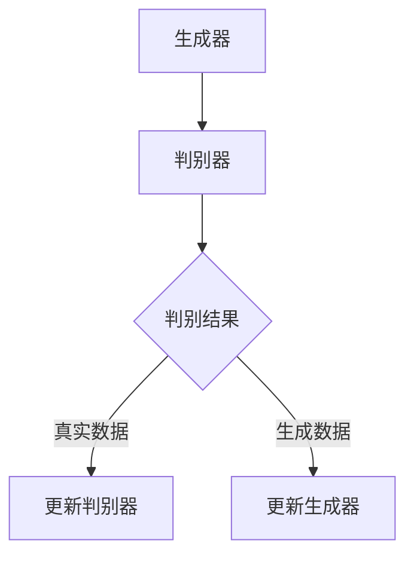

                 

### 背景介绍

生成对抗网络（Generative Adversarial Networks，GAN）是由伊恩·古德费洛（Ian Goodfellow）于2014年提出的一种深度学习模型。GAN的基本思想是通过两个相互对抗的神经网络——生成器和判别器——的博弈来生成与真实数据几乎无异的样本。生成器旨在生成逼真的数据，而判别器则试图区分生成器和真实数据。这种对抗训练机制使得生成器和判别器在相互竞争中不断进步，最终生成器可以生成高质量的数据样本。

GAN的研究和应用非常广泛，尤其在计算机视觉、自然语言处理、音频生成等领域取得了显著成果。其优点包括能够生成高质量的数据样本、不需要真实数据标签、具有强大的泛化能力等。然而，GAN也存在一定的局限性，如训练不稳定、模式崩溃等。本文将深入探讨GAN的原理，并通过代码实例对其进行详细讲解，帮助读者理解并掌握GAN的核心技术。

### 核心概念与联系

#### 1. 生成器（Generator）

生成器是GAN模型中的一个关键组成部分，其目标是生成与真实数据相似的高质量样本。在训练过程中，生成器通过学习从随机噪声中生成数据，使其尽可能接近真实数据的分布。生成器的结构通常由多个全连接层、卷积层或循环层组成，输出层通常是一个生成数据的层。

#### 2. 判别器（Discriminator）

判别器是GAN模型的另一个关键组成部分，其目标是区分真实数据和生成数据。判别器的结构通常与生成器相似，但在训练过程中，判别器的目标是最大化其区分能力，从而识别生成器生成的假数据。判别器的输出通常是一个概率值，表示输入数据是真实数据还是生成数据。

#### 3. 博弈过程

在GAN的训练过程中，生成器和判别器之间进行一个对抗博弈。生成器的目标是最大化判别器对其生成数据的判别为假（生成器胜利），而判别器的目标是最大化其区分真实数据和生成数据的能力。这种对抗过程使得生成器和判别器在训练过程中不断进步，最终生成器可以生成高质量的数据样本。

### Mermaid 流程图



#### 4. GAN 的优缺点

**优点：**
- 不需要真实数据标签。
- 具有强大的泛化能力。
- 能够生成高质量的数据样本。

**缺点：**
- 训练过程不稳定，容易出现模式崩溃。
- 对训练数据量和质量要求较高。

### 核心算法原理 & 具体操作步骤

#### 3.1 算法原理概述

GAN的核心思想是通过生成器和判别器的对抗博弈来训练模型。生成器从随机噪声中生成数据，判别器尝试区分真实数据和生成数据。生成器和判别器在相互对抗的过程中不断优化，最终生成器可以生成高质量的数据样本。

#### 3.2 算法步骤详解

1. **初始化生成器和判别器**：
   - 生成器：从随机噪声中生成数据。
   - 判别器：区分真实数据和生成数据。

2. **生成器生成数据**：
   - 生成器从随机噪声中生成一组数据。
   - 将生成器生成的数据输入到判别器中进行判别。

3. **判别器判别数据**：
   - 判别器对输入数据进行判别，输出一个概率值，表示输入数据是真实数据还是生成数据。

4. **计算损失函数**：
   - 对生成器和判别器分别计算损失函数。
   - 对于生成器，损失函数是判别器对生成数据的判别为假的概率。
   - 对于判别器，损失函数是判别器对真实数据和生成数据的判别误差。

5. **更新模型参数**：
   - 根据损失函数，更新生成器和判别器的模型参数。
   - 使用梯度下降等优化算法进行参数更新。

6. **迭代训练**：
   - 重复上述步骤，直到生成器可以生成高质量的数据样本。

#### 3.3 算法优缺点

**优点：**
- 不需要真实数据标签。
- 具有强大的泛化能力。
- 能够生成高质量的数据样本。

**缺点：**
- 训练过程不稳定，容易出现模式崩溃。
- 对训练数据量和质量要求较高。

#### 3.4 算法应用领域

GAN在多个领域取得了显著成果，主要包括：
- 计算机视觉：生成虚拟人物、图像增强、图像去噪等。
- 自然语言处理：生成文本、翻译、对话系统等。
- 音频生成：生成音乐、语音合成、音频增强等。

### 数学模型和公式 & 详细讲解 & 举例说明

GAN的训练过程涉及到一系列数学模型和公式，下面将详细介绍这些数学模型和公式，并通过具体例子进行说明。

#### 4.1 数学模型构建

GAN的核心数学模型包括生成器和判别器的损失函数。生成器的损失函数旨在最大化判别器对生成数据的判别为假的概率，判别器的损失函数旨在最大化其区分真实数据和生成数据的能力。

生成器的损失函数（$$L_G$$）：
$$L_G = -\log(D(G(z)))$$
其中，$D(x)$是判别器对输入数据的判别概率，$G(z)$是生成器对噪声向量$z$的映射。

判别器的损失函数（$$L_D$$）：
$$L_D = -[\log(D(x)) + \log(1 - D(G(z)))]$$
其中，$x$是真实数据，$G(z)$是生成器生成的数据。

#### 4.2 公式推导过程

生成器的损失函数（$$L_G$$）：
$$L_G = -\log(D(G(z)))$$
这个损失函数表示生成器生成的数据在判别器中判别为假的概率的对数。

判别器的损失函数（$$L_D$$）：
$$L_D = -[\log(D(x)) + \log(1 - D(G(z)))]$$
这个损失函数表示判别器对真实数据和生成数据的判别误差。

#### 4.3 案例分析与讲解

下面我们通过一个具体的例子来讲解GAN的数学模型和公式。

假设我们有一个生成器和判别器，生成器从随机噪声中生成一组数据，判别器尝试区分真实数据和生成数据。我们可以计算生成器和判别器的损失函数，并根据这些损失函数更新模型参数。

假设生成器生成的数据为$$G(z)$$，判别器对生成数据的判别概率为$$D(G(z))$$，对真实数据的判别概率为$$D(x)$$。

1. **计算生成器的损失函数**：
   $$L_G = -\log(D(G(z)))$$
   假设$$D(G(z)) = 0.9$$，则生成器的损失函数为：
   $$L_G = -\log(0.9) \approx 0.15$$

2. **计算判别器的损失函数**：
   $$L_D = -[\log(D(x)) + \log(1 - D(G(z)))]$$
   假设$$D(x) = 0.8$$，$$D(G(z)) = 0.9$$，则判别器的损失函数为：
   $$L_D = -[\log(0.8) + \log(1 - 0.9)] \approx 0.32$$

3. **更新模型参数**：
   根据生成器和判别器的损失函数，我们可以使用梯度下降等优化算法更新模型参数。

通过这个例子，我们可以看到GAN的数学模型和公式是如何应用于实际问题的。生成器和判别器的损失函数为我们提供了衡量模型性能的指标，通过不断更新模型参数，我们可以使生成器生成更高质量的数据样本。

### 项目实践：代码实例和详细解释说明

在本节中，我们将通过一个具体的Python代码实例来讲解GAN的实现过程，并对代码进行详细解释和分析。

#### 5.1 开发环境搭建

在开始编写代码之前，我们需要搭建一个合适的开发环境。以下是搭建开发环境所需的基本步骤：

1. 安装Python环境：确保Python已安装在您的系统中，版本建议为3.6及以上。

2. 安装TensorFlow：TensorFlow是谷歌开发的开源机器学习框架，用于实现GAN。在命令行中执行以下命令安装TensorFlow：

   ```shell
   pip install tensorflow
   ```

3. 安装其他依赖：根据具体需求，可能还需要安装其他库，如NumPy、Matplotlib等。您可以在命令行中逐个安装：

   ```shell
   pip install numpy matplotlib
   ```

#### 5.2 源代码详细实现

下面是一个简单的GAN代码示例，用于生成手写数字图像。我们将使用MNIST数据集，该数据集包含了0到9的手写数字图像。

```python
import tensorflow as tf
from tensorflow.keras.layers import Dense, Conv2D, Flatten
from tensorflow.keras.models import Sequential
import numpy as np

# 加载MNIST数据集
(x_train, _), (x_test, _) = tf.keras.datasets.mnist.load_data()
x_train = x_train.astype('float32') / 255.0
x_test = x_test.astype('float32') / 255.0

# 定义生成器模型
generator = Sequential([
    Dense(128, input_dim=100, activation='relu'),
    Dense(128, activation='relu'),
    Dense(784, activation='sigmoid'),
    Flatten()
])

# 定义判别器模型
discriminator = Sequential([
    Flatten(input_shape=(28, 28)),
    Dense(128, activation='relu'),
    Dense(128, activation='relu'),
    Dense(1, activation='sigmoid')
])

# 定义GAN模型
gan = Sequential([
    generator,
    discriminator
])

# 编译模型
discriminator.compile(optimizer='adam', loss='binary_crossentropy')
gan.compile(optimizer='adam', loss='binary_crossentropy')

# 训练GAN模型
for epoch in range(100):
    for x, _ in x_train:
        noise = np.random.normal(0, 1, (x.shape))
        generated_images = generator.predict(noise)
        real_images = x

        # 训练判别器
        d_loss_real = discriminator.train_on_batch(real_images, np.ones((x.shape[0], 1)))
        d_loss_fake = discriminator.train_on_batch(generated_images, np.zeros((x.shape[0], 1)))

        # 训练生成器
        g_loss = gan.train_on_batch(noise, np.ones((x.shape[0], 1)))

        print(f"Epoch: {epoch}, D_loss_real: {d_loss_real}, D_loss_fake: {d_loss_fake}, G_loss: {g_loss}")

# 保存模型
generator.save('generator.h5')
discriminator.save('discriminator.h5')

# 生成测试数据
noise = np.random.normal(0, 1, (x_test.shape))
generated_images = generator.predict(noise)

# 显示生成图像
import matplotlib.pyplot as plt

plt.figure(figsize=(10, 10))
for i in range(100):
    plt.subplot(10, 10, i+1)
    plt.imshow(generated_images[i], cmap='gray')
    plt.axis('off')
plt.show()
```

#### 5.3 代码解读与分析

下面我们对代码进行详细解读和分析。

1. **数据预处理**：
   - 加载MNIST数据集，并对图像进行归一化处理。

2. **定义生成器模型**：
   - 生成器模型由一个全连接层和多个卷积层组成，输入为随机噪声，输出为手写数字图像。

3. **定义判别器模型**：
   - 判别器模型由一个全连接层和多个卷积层组成，输入为图像，输出为二分类标签。

4. **定义GAN模型**：
   - GAN模型将生成器和判别器串联起来，用于整体训练。

5. **编译模型**：
   - 编译判别器模型和GAN模型，指定优化器和损失函数。

6. **训练GAN模型**：
   - 使用循环遍历训练数据，对生成器和判别器分别进行训练。

7. **保存模型**：
   - 将训练好的生成器和判别器模型保存到文件中。

8. **生成测试数据**：
   - 使用生成器模型生成手写数字图像。

9. **显示生成图像**：
   - 使用Matplotlib库显示生成的手写数字图像。

通过这个代码实例，我们可以看到GAN的实现过程是如何进行的。生成器和判别器在相互对抗的过程中不断优化，最终生成器可以生成高质量的手写数字图像。

### 实际应用场景

生成对抗网络（GAN）在多个实际应用场景中表现出强大的能力，下面列举一些常见的应用领域：

#### 1. 计算机视觉

GAN在计算机视觉领域取得了显著的成果。以下是一些应用实例：

- **图像生成**：GAN可以生成逼真的图像，如图像合成、风格迁移、图像修复等。例如，使用GAN可以将一张普通的照片转化为梵高的风格画作。

- **图像增强**：GAN可以用于图像增强，如提高图像的分辨率、去噪、去除模糊等。这种技术在医疗影像、卫星图像等应用中具有重要价值。

- **数据增强**：GAN可以生成大量虚拟数据，用于训练深度学习模型。这有助于缓解数据不足的问题，提高模型的泛化能力。

- **图像分类**：GAN可以用于图像分类任务，通过生成具有不同标签的图像，帮助模型更好地理解图像的多样性。

#### 2. 自然语言处理

GAN在自然语言处理领域也展现出了巨大的潜力，以下是一些应用实例：

- **文本生成**：GAN可以生成高质量的文本，如文章、故事、对话等。这有助于自动生成内容、提高写作效率。

- **语音合成**：GAN可以用于语音合成，将文本转化为自然的语音。这种技术在语音助手、自动语音系统等领域具有重要应用。

- **语音转换**：GAN可以用于语音转换，将一种语音转换为另一种语音。这有助于解决语音识别中的口音、方言问题。

#### 3. 音频生成

GAN在音频生成领域取得了显著成果，以下是一些应用实例：

- **音乐生成**：GAN可以生成高质量的音乐，包括旋律、和弦、节奏等。这有助于自动创作音乐、提高音乐创作效率。

- **音频修复**：GAN可以用于音频修复，如去除噪声、修复受损的音频信号等。这种技术在音频编辑、录音修复等领域具有重要应用。

- **语音合成**：GAN可以用于语音合成，将文本转化为自然的语音。这有助于语音助手、自动语音系统等领域的应用。

#### 4. 其他应用

GAN在其他领域也表现出强大的能力，以下是一些应用实例：

- **医学影像**：GAN可以用于医学影像分析，如图像分割、病灶检测等。这有助于提高诊断准确性、降低诊断成本。

- **虚拟现实**：GAN可以用于虚拟现实，生成逼真的三维场景，提高用户体验。

- **游戏开发**：GAN可以用于游戏开发，生成具有丰富细节的虚拟场景和角色，提高游戏的可玩性。

### 未来应用展望

随着GAN技术的不断发展和成熟，未来其在各个领域的应用前景将更加广阔。以下是一些可能的应用方向：

#### 1. 自适应学习

GAN可以用于自适应学习，根据用户的反馈和需求动态调整生成模型，提高个性化服务水平。例如，在电子商务领域，GAN可以根据用户的购买历史和偏好生成个性化的商品推荐。

#### 2. 安全与隐私

GAN可以用于安全与隐私保护，通过生成虚拟数据干扰攻击者，提高系统的安全性。此外，GAN还可以用于隐私保护，将敏感数据转换为无法识别的形式，保护用户的隐私。

#### 3. 跨领域融合

GAN可以与其他领域的技术相结合，如增强现实（AR）、虚拟现实（VR）、区块链等，产生新的应用场景。例如，在AR/VR领域，GAN可以用于生成逼真的虚拟场景，提高用户体验。

#### 4. 智能制造

GAN可以用于智能制造，通过生成虚拟产品数据，优化生产流程、降低生产成本。此外，GAN还可以用于产品检测和质量控制，提高生产效率。

#### 5. 人类行为研究

GAN可以用于人类行为研究，通过生成虚拟行为数据，模拟和分析人类行为。这有助于深入了解人类行为模式，为社会科学研究提供新的工具。

总之，GAN作为一种新兴的深度学习技术，具有广泛的应用前景。随着技术的不断进步和应用的拓展，GAN将在未来为各个领域带来新的机遇和挑战。

### 工具和资源推荐

为了更好地学习和应用生成对抗网络（GAN）技术，以下是一些建议的学习资源、开发工具和相关论文：

#### 1. 学习资源推荐

- **在线教程**：[TensorFlow官方教程](https://www.tensorflow.org/tutorials)提供了丰富的GAN教程，适合初学者。
- **书籍推荐**：《深度学习》（Ian Goodfellow著），详细介绍了GAN的原理和应用。
- **GitHub项目**：在GitHub上搜索“GAN”可以找到许多优秀的开源项目，如[DCGAN](https://github.com/carpedm20/DCGAN-tensorflow)。

#### 2. 开发工具推荐

- **编程语言**：Python是实现GAN的主要编程语言，使用TensorFlow或PyTorch框架可以方便地构建和训练GAN模型。
- **深度学习框架**：TensorFlow和PyTorch是当前最流行的深度学习框架，支持丰富的GAN模型实现。
- **可视化工具**：Matplotlib和Seaborn是常用的数据可视化库，可以帮助我们展示GAN生成的图像和结果。

#### 3. 相关论文推荐

- **原始论文**：《生成对抗网络：训练生成器和判别器的对抗性网络》（Goodfellow et al., 2014）。
- **技术论文**：《DCGAN：深度卷积生成对抗网络》（Radford et al., 2015）。
- **应用论文**：《信息最大化GAN：学习表征的直接方法》（Tolstikhin et al., 2017）。
- **综述论文**：《生成对抗网络：从理论到实践》（Salimans et al., 2016）。

通过这些资源，您可以深入了解GAN的原理和应用，掌握GAN的实现技巧，并在实际项目中应用GAN技术。

### 总结：未来发展趋势与挑战

生成对抗网络（GAN）作为一种创新的深度学习模型，自提出以来在计算机视觉、自然语言处理、音频生成等领域取得了显著成果。未来，GAN技术有望在多个领域得到更广泛的应用，并在人工智能领域发挥重要作用。

#### 1. 研究成果总结

近年来，GAN技术在以下方面取得了重要进展：

- **模型结构**：研究者提出了许多新的GAN模型结构，如深度卷积生成对抗网络（DCGAN）、循环生成对抗网络（CycleGAN）等，这些结构在不同应用场景中表现出良好的性能。
- **训练技巧**：为了解决GAN训练过程中的不稳定性和模式崩溃问题，研究者提出了多种训练技巧，如梯度惩罚、谱归一化、Wasserstein距离等。
- **应用拓展**：GAN技术在多个领域得到了成功应用，如图像生成、文本生成、音频生成等，为这些领域带来了新的机遇。

#### 2. 未来发展趋势

未来，GAN技术有望在以下几个方面取得进一步发展：

- **跨领域融合**：GAN技术与其他领域的技术相结合，如增强现实（AR）、虚拟现实（VR）、区块链等，将产生新的应用场景。
- **自适应学习**：GAN可以用于自适应学习，根据用户需求和反馈动态调整模型，提高个性化服务水平。
- **安全与隐私**：GAN可以用于安全与隐私保护，通过生成虚拟数据干扰攻击者，提高系统的安全性。
- **多模态生成**：GAN可以用于多模态数据生成，如图像、文本、音频等多模态数据的同步生成。

#### 3. 面临的挑战

尽管GAN技术在许多领域取得了成功，但仍然面临一些挑战：

- **训练稳定性**：GAN训练过程中存在不稳定性和模式崩溃问题，需要进一步研究有效的训练技巧和方法。
- **计算资源**：GAN模型通常需要大量的计算资源进行训练，如何优化训练过程、降低计算成本是亟待解决的问题。
- **泛化能力**：GAN生成的数据可能存在过度拟合现象，如何提高GAN模型的泛化能力是未来研究的重点。

#### 4. 研究展望

展望未来，GAN技术将在以下方面取得新的突破：

- **高效训练方法**：研究者将致力于开发更高效的GAN训练方法，如分布式训练、并行训练等，以降低训练成本。
- **新型模型结构**：研究者将探索新的GAN模型结构，以应对不同应用场景的需求，提高模型性能。
- **跨领域应用**：GAN技术将在更多领域得到应用，如生物医学、金融、游戏等，为这些领域带来新的发展机遇。

总之，GAN技术作为一种新兴的深度学习模型，具有广泛的应用前景。随着研究的不断深入和技术的不断进步，GAN将在未来为人工智能领域带来更多创新和突破。

### 附录：常见问题与解答

在学习和应用生成对抗网络（GAN）的过程中，读者可能会遇到一些常见问题。以下是一些常见问题及其解答：

#### 1. 什么是生成对抗网络（GAN）？

生成对抗网络（GAN）是一种深度学习模型，由生成器和判别器两个神经网络组成。生成器旨在生成与真实数据相似的数据，而判别器则试图区分真实数据和生成数据。生成器和判别器通过对抗训练相互优化，最终生成器可以生成高质量的数据样本。

#### 2. GAN的训练过程是怎样的？

GAN的训练过程包括以下步骤：

- 初始化生成器和判别器模型。
- 生成器从随机噪声中生成数据。
- 判别器对真实数据和生成数据进行判别。
- 计算生成器和判别器的损失函数。
- 根据损失函数更新生成器和判别器的模型参数。
- 重复上述步骤，直到生成器可以生成高质量的数据样本。

#### 3. GAN为什么能够生成高质量的数据样本？

GAN能够生成高质量的数据样本，主要是因为生成器和判别器在对抗训练过程中不断优化。生成器试图生成逼真的数据，而判别器试图区分真实数据和生成数据。这种对抗博弈使得生成器和判别器在训练过程中不断进步，最终生成器可以生成高质量的数据样本。

#### 4. GAN有哪些应用场景？

GAN在多个领域取得了显著成果，主要应用场景包括：

- 计算机视觉：图像生成、图像增强、数据增强等。
- 自然语言处理：文本生成、语音合成、对话系统等。
- 音频生成：音乐生成、语音合成、音频修复等。
- 其他应用：医学影像、虚拟现实、游戏开发等。

#### 5. GAN训练过程中为什么会出现模式崩溃？

模式崩溃是GAN训练过程中常见的问题，主要原因是判别器过于强大，导致生成器生成的数据无法欺骗判别器。为了解决模式崩溃问题，研究者提出了多种训练技巧，如梯度惩罚、谱归一化、Wasserstein距离等。

#### 6. 如何解决GAN训练过程中的不稳定问题？

为了解决GAN训练过程中的不稳定问题，研究者提出了以下几种方法：

- 使用梯度惩罚，限制生成器和判别器的梯度。
- 使用谱归一化，稳定模型参数。
- 使用Wasserstein距离，提高GAN模型的稳定性。

#### 7. GAN模型需要多大的计算资源？

GAN模型的计算资源需求较大，主要取决于模型结构和训练数据量。对于简单的GAN模型，可以在普通计算机上进行训练。但对于复杂的GAN模型，可能需要使用高性能计算平台，如GPU集群，以加快训练速度。

#### 8. GAN与深度卷积生成对抗网络（DCGAN）有什么区别？

DCGAN是一种特殊的GAN模型，采用了深度卷积神经网络结构。与传统的GAN模型相比，DCGAN在生成图像质量方面有显著提升。DCGAN的主要区别在于：

- 使用卷积层和反卷积层进行数据生成和判别。
- 引入了批归一化、ReLU激活函数等技巧，提高模型性能。

#### 9. 如何评估GAN生成的数据质量？

评估GAN生成的数据质量可以从以下几个方面进行：

- 观察生成图像的细节是否逼真。
- 计算生成图像与真实图像的相似度，如使用SSIM（结构相似性指数）。
- 使用对抗性攻击方法，如FGSM（快速梯度符号方法），检验生成图像的鲁棒性。

通过以上常见问题与解答，希望能够帮助读者更好地理解和应用GAN技术。在实际操作过程中，如遇到其他问题，可以参考相关论文和在线教程进行学习。

