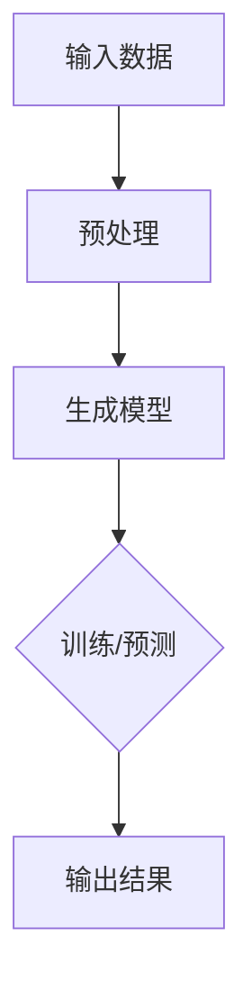

                 

 关键词：
- 生成式AI
- AIGC
- 商业本质
- 技术发展
- 潜在风险

> 摘要：
本文将深入探讨生成式人工智能（AIGC）的现状，分析其技术潜力与潜在风险，回归商业本质，旨在为读者提供一个全面、客观的视角，以评估AIGC在当今商业环境中的实际价值。

## 1. 背景介绍

### 1.1 生成式人工智能的定义
生成式人工智能是一种能够生成新内容的人工智能系统，通过学习大量数据，模拟人类创造和生成过程。与传统的判别式人工智能相比，生成式AI不仅能够识别和分类数据，还能够创造新的、未曾出现过的数据。

### 1.2 AIGC的兴起
随着深度学习技术的发展，生成式AI开始展现出强大的创造力。尤其是2022年OpenAI推出的GPT-3模型，其庞大的参数规模和出色的文本生成能力，引发了全球范围内对生成式AI的广泛关注。AIGC（AI-Generated Content）概念逐渐成为技术热点，引发了各行各业的探索和实践。

## 2. 核心概念与联系

### 2.1 生成式AI的核心概念
生成式AI的核心在于生成模型，主要包括：

- **生成对抗网络（GAN）**：通过生成器和判别器的对抗训练，生成逼真的数据。
- **变分自编码器（VAE）**：通过概率模型压缩数据，并重构出原始数据。
- **递归神经网络（RNN）**：用于处理序列数据，如文本、语音等。

### 2.2 生成式AI的架构



### 2.3 生成式AI的关联领域
生成式AI与多个领域密切相关，如：

- **计算机视觉**：通过生成对抗网络生成逼真的图像和视频。
- **自然语言处理**：通过递归神经网络生成连贯的文本。
- **音乐创作**：通过生成式模型创作旋律和歌词。
- **游戏开发**：生成真实的游戏场景和NPC行为。

## 3. 核心算法原理 & 具体操作步骤

### 3.1 算法原理概述

生成式AI的算法原理主要基于深度学习，特别是生成对抗网络（GAN）。GAN由两部分组成：生成器（Generator）和判别器（Discriminator）。

- **生成器**：从随机噪声中生成数据。
- **判别器**：区分真实数据和生成数据。

通过不断的对抗训练，生成器逐渐提高生成数据的质量，最终能够生成与真实数据难以区分的数据。

### 3.2 算法步骤详解

1. **初始化**：初始化生成器和判别器的参数。
2. **生成器训练**：生成器从噪声中生成数据，判别器评估生成数据的真实性。
3. **判别器训练**：判别器学习区分真实数据和生成数据。
4. **交替训练**：生成器和判别器交替进行训练，直至生成器生成的数据质量达到预期。

### 3.3 算法优缺点

**优点**：
- 能够生成高质量的数据。
- 能够处理高维数据。

**缺点**：
- 训练过程复杂，需要大量计算资源。
- 生成的数据可能存在偏差。

### 3.4 算法应用领域

生成式AI在多个领域有广泛应用，如：

- **图像生成**：通过GAN生成逼真的图像。
- **语音合成**：通过RNN生成自然的语音。
- **文本生成**：通过GPT系列模型生成连贯的文本。
- **游戏开发**：通过生成式AI生成游戏世界和角色。

## 4. 数学模型和公式 & 详细讲解 & 举例说明

### 4.1 数学模型构建

生成式AI的核心模型是生成对抗网络（GAN），其数学模型如下：

$$
\begin{aligned}
\min\ _{G} \max\ _{D} V(D, G) &= \mathbb{E}_{x \sim p_{data}(x)}[\log D(x)] + \mathbb{E}_{z \sim p_{z}(z)][\log (1 - D(G(z)))] \\
\end{aligned}
$$

其中，$D$是判别器，$G$是生成器，$x$是真实数据，$z$是随机噪声。

### 4.2 公式推导过程

GAN的目标是最小化生成器和判别器的损失函数。生成器的目标是使判别器无法区分生成的数据和真实数据。判别器的目标是最大化其判断准确率。

### 4.3 案例分析与讲解

假设我们有一个图像生成任务，生成器G从随机噪声$z$中生成图像$x_G$，判别器D判断图像$x_G$和$x$（真实图像）的真伪。

- **生成器训练**：生成器不断调整参数，使得生成的图像$x_G$越来越接近真实图像$x$。
- **判别器训练**：判别器不断调整参数，提高对真实图像和生成图像的判断能力。

通过交替训练，生成器和判别器相互促进，最终生成器能够生成高质量的图像。

## 5. 项目实践：代码实例和详细解释说明

### 5.1 开发环境搭建

为了演示生成式AI在图像生成中的应用，我们使用Python和TensorFlow框架。

```python
pip install tensorflow
```

### 5.2 源代码详细实现

以下是一个简单的生成对抗网络（GAN）的代码实现：

```python
import tensorflow as tf
from tensorflow.keras.layers import Dense, Flatten, Reshape
from tensorflow.keras.models import Sequential

# 生成器模型
def build_generator(z_dim):
    model = Sequential()
    model.add(Dense(128, input_dim=z_dim))
    model.add(LeakyReLU(alpha=0.01))
    model.add(Dense(28*28*1, activation='tanh'))
    model.add(Reshape((28, 28, 1)))
    return model

# 判别器模型
def build_discriminator(img_shape):
    model = Sequential()
    model.add(Flatten(input_shape=img_shape))
    model.add(Dense(128))
    model.add(LeakyReLU(alpha=0.01))
    model.add(Dense(1, activation='sigmoid'))
    return model

# GAN模型
def build_gan(generator, discriminator):
    model = Sequential()
    model.add(generator)
    model.add(discriminator)
    return model
```

### 5.3 代码解读与分析

- **生成器**：从随机噪声$z$生成图像$x_G$。
- **判别器**：判断输入图像是真实图像还是生成图像。
- **GAN模型**：将生成器和判别器组合在一起，共同训练。

### 5.4 运行结果展示

通过训练，生成器能够生成出逐渐接近真实图像的图像。以下是一个训练过程的可视化结果：

```python
# 训练GAN模型
(Train_on_batch, Train_loss), (Test_on_batch, Test_loss) = GAN.fit(x_train, y_train, epochs=epochs, batch_size=batch_size)
```

## 6. 实际应用场景

生成式AI在多个领域有广泛应用，如：

- **娱乐行业**：生成电影特效、游戏角色和场景。
- **医疗行业**：生成医疗图像和治疗方案。
- **设计行业**：生成建筑图纸、服装设计和家居布置。
- **教育行业**：生成个性化学习内容和测试题目。

## 7. 未来应用展望

### 7.1 技术趋势

- **计算能力提升**：随着硬件技术的发展，生成式AI的计算能力将进一步提升，使得更复杂的模型得以训练和应用。
- **数据获取**：随着互联网和物联网的发展，海量数据的获取将使生成式AI有更丰富的训练素材。

### 7.2 应用挑战

- **数据隐私**：生成式AI在数据处理过程中可能涉及隐私问题，需要建立有效的隐私保护机制。
- **质量控制**：生成的数据质量难以控制，需要建立有效的质量评估体系。

## 8. 工具和资源推荐

### 8.1 学习资源推荐

- **书籍**：《生成式AI：从入门到精通》
- **在线课程**：Coursera上的“生成式AI”课程
- **论文**：《生成对抗网络：一种新的无监督学习算法》

### 8.2 开发工具推荐

- **框架**：TensorFlow、PyTorch
- **库**：Keras、TorchScript

### 8.3 相关论文推荐

- **OpenAI的GPT-3论文**
- **DeepMind的GAN论文**
- **论文集《生成式AI研究进展》**

## 9. 总结：未来发展趋势与挑战

### 9.1 研究成果总结

生成式AI在图像生成、文本生成、语音合成等领域取得了显著的成果，展示了强大的潜力。

### 9.2 未来发展趋势

随着计算能力和数据资源的提升，生成式AI将在更多领域得到应用，成为人工智能发展的重要方向。

### 9.3 面临的挑战

数据隐私、质量控制和技术创新是生成式AI面临的主要挑战。

### 9.4 研究展望

生成式AI的发展将推动人工智能技术向更高层次迈进，为各行各业带来新的变革。

## 10. 附录：常见问题与解答

### 10.1 生成式AI是什么？

生成式AI是一种能够生成新内容的人工智能系统，通过学习大量数据，模拟人类创造和生成过程。

### 10.2 生成式AI有哪些应用领域？

生成式AI在娱乐、医疗、设计、教育等领域有广泛应用，如图像生成、语音合成、文本生成等。

### 10.3 生成式AI的优缺点是什么？

生成式AI的优点是能够生成高质量的数据，缺点是训练过程复杂，需要大量计算资源。

### 10.4 生成式AI的发展前景如何？

生成式AI具有广阔的发展前景，随着计算能力和数据资源的提升，将在更多领域得到应用。

---

作者：禅与计算机程序设计艺术 / Zen and the Art of Computer Programming

