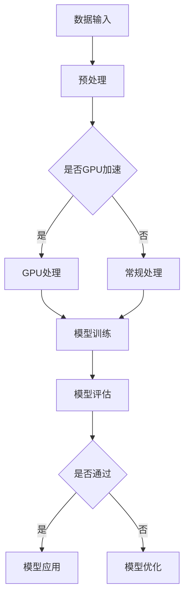

                 

关键词：生成式AI、AIGC、GPU、数据驱动、模型效果、泡沫与金矿

摘要：本文探讨了生成式AI（AIGC）在当前技术领域的地位与前景。通过对AIGC的核心概念、原理以及实际应用的深入分析，文章指出，尽管GPU计算能力的提升使得模型训练速度加快，但数据的质量和数量依然是训练出优质模型的关键。文章以实际案例为基础，提出了从数据的角度来提升AIGC效果的策略，并对未来AIGC的发展趋势与挑战进行了展望。

## 1. 背景介绍

近年来，生成式AI（AIGC，Generative AI）以其强大的创造能力和多样化的应用场景，迅速成为人工智能领域的研究热点。AIGC的核心在于通过学习大量数据生成新的内容，从图像、文本到音频、视频等多种形式，满足了用户在内容生成、个性化推荐、虚拟现实等方面的需求。

然而，AIGC的发展并非一帆风顺。尽管GPU（图形处理器）的广泛应用大幅提升了模型训练的速度和效率，但随之而来的问题是，GPU资源的多寡并不直接决定模型的效果。相反，数据的质量和数量成为影响模型性能的关键因素。因此，如何利用有限的GPU资源，通过增加数据量和优化数据处理，提升AIGC的效果，成为当前研究的一个重要方向。

本文旨在探讨生成式AIGC的现状与未来，分析GPU计算能力和数据质量在模型训练中的相对重要性，并提出一些实用的优化策略。通过深入剖析AIGC的核心算法原理，结合实际应用案例，本文希望能为AIGC的研究与应用提供一些有价值的参考。

### 1.1 AIGC的定义与发展历程

生成式AI（AIGC）是指一类利用已有数据生成新内容的人工智能系统。其基本原理是通过学习海量数据，捕捉数据的分布和规律，从而生成与原始数据相似或具有创新性的新内容。AIGC的发展历程可以追溯到1980年代，彼时生成对抗网络（GAN）的提出标志着AIGC的诞生。

随着计算机性能的提升和深度学习技术的发展，AIGC取得了长足的进步。2014年，GAN模型在图像生成任务中表现出色，引发了学术界和工业界的广泛关注。随后，AIGC在语音合成、自然语言处理等领域也取得了显著成果。例如，WaveNet在音频生成上的成功，GPT在文本生成上的突破，都为AIGC的应用前景奠定了坚实基础。

### 1.2 AIGC的应用场景

AIGC的应用场景广泛，涵盖了图像生成、文本生成、音频生成、视频生成等多个领域。以下是一些典型的应用场景：

1. **图像生成**：通过学习大量图像数据，AIGC可以生成与训练数据相似的新图像。这一技术在艺术创作、游戏开发、虚拟现实等领域具有广泛应用。
   
2. **文本生成**：AIGC在自然语言处理领域表现出色，可以生成新闻文章、对话、故事等文本内容。这一技术为自动化内容生成、个性化推荐、虚拟助理等提供了有力支持。

3. **音频生成**：AIGC通过学习音频数据生成新的声音，可以应用于音乐创作、声音合成、语音合成等领域。

4. **视频生成**：结合图像生成和音频生成技术，AIGC可以生成新的视频内容。这一技术在视频编辑、虚拟现实、增强现实等领域具有广阔的应用前景。

### 1.3 GPU在AIGC中的角色

GPU（图形处理器）在AIGC中扮演着至关重要的角色。相比于传统的CPU（中央处理器），GPU在并行计算方面具有显著优势，这使得它成为深度学习模型训练的理想选择。以下是一些关于GPU在AIGC中的作用和优势：

1. **并行计算能力**：GPU具有成百上千的内核，可以同时处理大量数据，这使得深度学习模型在训练过程中能够大幅提高计算速度。

2. **计算效率**：GPU的内存带宽和浮点运算能力远高于CPU，这使得GPU在处理大规模数据集时具有更高的计算效率。

3. **降低训练成本**：通过使用GPU，可以减少训练时间，从而降低硬件成本。此外，GPU的高效计算能力使得一些复杂模型可以在较短时间内完成训练，降低了计算资源的闲置率。

4. **支持复杂模型**：深度学习模型通常包含大量参数和计算步骤，GPU的强大计算能力可以支持更复杂模型的训练，从而提高模型的效果。

### 1.4 数据在AIGC中的重要性

尽管GPU在AIGC中发挥了重要作用，但数据的质量和数量依然是训练出优质模型的关键因素。以下是一些关于数据在AIGC中的重要性：

1. **数据质量**：高质量的数据可以提供更丰富的信息，有助于模型更好地学习数据的分布和规律。例如，在图像生成任务中，高质量的图像数据可以减少噪声，提高生成的图像质量。

2. **数据数量**：大量数据可以帮助模型更好地泛化，避免过拟合现象。在文本生成任务中，大量高质量文本数据可以提供丰富的语言规律和表达方式，从而提高生成的文本质量。

3. **数据多样性**：多样化的数据可以丰富模型的学习经验，提高模型在不同场景下的适应性。例如，在图像生成任务中，包含不同光照、视角、场景的图像数据可以提高模型在不同条件下的生成能力。

### 1.5 AIGC的现状与挑战

尽管AIGC在近年来取得了显著进展，但仍然面临一些挑战。以下是一些关于AIGC的现状与挑战：

1. **计算资源限制**：尽管GPU计算能力不断提升，但仍然存在计算资源限制。特别是在训练大规模模型时，计算资源的需求往往超出硬件的供给。

2. **数据获取难度**：高质量的数据获取仍然是一个难题。在一些领域，如医疗、金融等，数据获取受到隐私保护和版权限制，这使得数据集的建设面临挑战。

3. **模型解释性**：AIGC模型通常具有高度的非线性特性，这使得模型解释性较差。在关键应用场景中，如医疗诊断、金融风险评估等，模型的可解释性至关重要。

4. **伦理问题**：AIGC的应用涉及个人隐私、版权、道德等方面的问题。例如，在图像生成中，如何确保生成内容不侵犯他人隐私，如何避免生成歧视性内容，都是需要关注的问题。

## 2. 核心概念与联系

为了更好地理解AIGC的核心概念及其与GPU、数据的关系，下面我们将通过一个Mermaid流程图来展示AIGC的架构和流程。



### 2.1 AIGC的架构

AIGC的架构通常包括数据输入、预处理、模型训练、模型评估和模型应用等几个关键环节。

1. **数据输入**：AIGC从大量数据中学习，数据可以是图像、文本、音频等多种形式。高质量的数据是训练优质模型的基础。

2. **预处理**：预处理环节包括数据清洗、格式转换、数据增强等步骤。预处理有助于提高数据质量，为后续模型训练打下基础。

3. **GPU处理**：在模型训练阶段，GPU的并行计算能力大幅提高了训练速度。然而，并非所有步骤都适用于GPU加速，需要根据具体任务进行优化。

4. **模型训练**：通过学习大量数据，模型学习到数据的分布和规律。训练过程通常涉及迭代优化，不断调整模型参数，提高模型效果。

5. **模型评估**：模型训练完成后，需要通过评估指标（如准确率、召回率等）来评估模型性能。如果模型效果不佳，需要返回到模型优化环节进行调整。

6. **模型应用**：通过评估通过的模型，可以应用于实际场景，如图像生成、文本生成、语音合成等。

### 2.2 GPU与AIGC的关系

GPU在AIGC中的作用主要体现在模型训练阶段。GPU的并行计算能力使得模型训练速度大幅提高，特别是在处理大规模数据集时，GPU的优势更加明显。然而，GPU并非在所有步骤中都适用。例如，数据预处理和模型评估通常不需要GPU加速。

### 2.3 数据与AIGC的关系

数据的质量和数量对AIGC的效果至关重要。高质量的数据可以提供丰富的信息，有助于模型更好地学习数据的分布和规律。大量数据可以提高模型的泛化能力，避免过拟合现象。此外，多样化的数据可以帮助模型在不同场景下适应，提高模型的稳定性。

## 3. 核心算法原理 & 具体操作步骤

### 3.1 算法原理概述

AIGC的核心算法主要包括生成器和判别器两个部分。生成器负责生成新的数据，判别器则负责判断生成数据与真实数据之间的差异。通过两个网络的相互作用，生成器不断优化，生成越来越接近真实数据的新数据。

在训练过程中，生成器和判别器交替更新参数。判别器的目标是最大化其判断生成数据为真实数据的概率，生成器的目标是最小化其判断生成数据为真实数据的概率。这一对抗过程使得生成器能够学习到数据的分布，从而生成高质量的数据。

### 3.2 算法步骤详解

1. **数据准备**：首先，收集大量高质量的训练数据。数据可以是图像、文本、音频等多种形式。在数据收集过程中，需要确保数据的多样性，以提高模型的泛化能力。

2. **数据处理**：对收集到的数据进行预处理，包括数据清洗、格式转换、数据增强等步骤。预处理有助于提高数据质量，为后续模型训练打下基础。

3. **初始化模型**：初始化生成器和判别器的参数。通常，生成器和判别器都是基于神经网络构建的，可以采用随机初始化或预训练的方式。

4. **模型训练**：在训练过程中，生成器和判别器交替更新参数。具体步骤如下：

   - **生成器训练**：生成器生成一批新的数据，判别器判断这些数据的真实性。生成器根据判别器的反馈，调整参数，提高生成数据的真实性。
   - **判别器训练**：判别器训练的目标是提高判断生成数据为真实数据的概率。判别器根据生成器和真实数据的反馈，调整参数，增强对真实数据和生成数据的区分能力。

5. **模型评估**：模型训练完成后，通过评估指标（如准确率、召回率等）来评估模型性能。如果模型效果不佳，需要返回到模型优化环节进行调整。

6. **模型应用**：通过评估通过的模型，可以应用于实际场景，如图像生成、文本生成、语音合成等。

### 3.3 算法优缺点

**优点**：

1. **强大的生成能力**：AIGC通过生成器和判别器的相互作用，能够生成高质量的新数据，具有强大的生成能力。

2. **广泛的应用场景**：AIGC可以应用于图像生成、文本生成、音频生成、视频生成等多个领域，具有广泛的应用前景。

3. **高效的训练过程**：通过GPU的并行计算能力，AIGC的训练过程高效，可以在较短时间内完成大规模模型的训练。

**缺点**：

1. **计算资源需求高**：AIGC的训练过程需要大量计算资源，特别是在训练大规模模型时，对GPU资源的需求较高。

2. **数据获取难度大**：高质量的数据获取仍然是一个难题，特别是在一些领域，如医疗、金融等，数据获取受到隐私保护和版权限制。

3. **模型解释性差**：AIGC模型通常具有高度的非线性特性，这使得模型解释性较差，难以解释模型内部的工作原理。

### 3.4 算法应用领域

AIGC的应用领域广泛，涵盖了图像生成、文本生成、音频生成、视频生成等多个领域。以下是一些典型的应用领域：

1. **图像生成**：通过学习大量图像数据，AIGC可以生成与训练数据相似的新图像，应用于艺术创作、游戏开发、虚拟现实等领域。

2. **文本生成**：AIGC在自然语言处理领域表现出色，可以生成新闻文章、对话、故事等文本内容，应用于自动化内容生成、个性化推荐、虚拟助理等领域。

3. **音频生成**：AIGC通过学习音频数据生成新的声音，应用于音乐创作、声音合成、语音合成等领域。

4. **视频生成**：结合图像生成和音频生成技术，AIGC可以生成新的视频内容，应用于视频编辑、虚拟现实、增强现实等领域。

## 4. 数学模型和公式 & 详细讲解 & 举例说明

### 4.1 数学模型构建

生成式AI（AIGC）的核心是生成器和判别器的数学模型。以下是一个简化的数学模型：

#### 生成器模型

生成器模型的目标是生成与真实数据相似的新数据。假设生成器模型的参数为θ\_g，输入为x，输出为G(x)。

$$
G(x; \theta_g) = \text{生成的数据}
$$

#### 判别器模型

判别器模型的目标是判断输入数据是真实数据还是生成数据。假设判别器模型的参数为θ\_d，输入为x，输出为D(x)。

$$
D(x; \theta_d) = \text{判断结果}
$$

### 4.2 公式推导过程

#### 生成器损失函数

生成器的损失函数可以表示为：

$$
L_g = -\mathbb{E}_{x \sim p_data(x)}[\log D(x; \theta_d)] - \mathbb{E}_{z \sim p_z(z)}[\log (1 - D(G(z); \theta_d)]
$$

其中，\( p_data(x) \) 是真实数据的概率分布，\( p_z(z) \) 是生成器的先验分布，\( z \) 是生成器的噪声输入。

#### 判别器损失函数

判别器的损失函数可以表示为：

$$
L_d = -\mathbb{E}_{x \sim p_data(x)}[\log D(x; \theta_d)] - \mathbb{E}_{z \sim p_z(z)}[\log D(G(z); \theta_d)]
$$

### 4.3 案例分析与讲解

#### 图像生成案例

假设我们使用生成式AI（AIGC）生成图像。具体步骤如下：

1. **数据准备**：收集大量图像数据，用于训练生成器和判别器。
2. **数据处理**：对图像数据进行预处理，包括归一化、数据增强等。
3. **初始化模型**：初始化生成器和判别器的参数。
4. **模型训练**：通过生成器和判别器的相互作用，不断更新参数，提高模型效果。
5. **模型评估**：通过评估指标（如Inception Score、Fréchet Inception Distance等）评估模型效果。
6. **模型应用**：将评估通过的模型应用于实际场景，如图像合成、图像修复等。

#### 文本生成案例

假设我们使用生成式AI（AIGC）生成文本。具体步骤如下：

1. **数据准备**：收集大量文本数据，用于训练生成器和判别器。
2. **数据处理**：对文本数据进行预处理，包括分词、去停用词、编码等。
3. **初始化模型**：初始化生成器和判别器的参数。
4. **模型训练**：通过生成器和判别器的相互作用，不断更新参数，提高模型效果。
5. **模型评估**：通过评估指标（如Perplexity、BLEU Score等）评估模型效果。
6. **模型应用**：将评估通过的模型应用于实际场景，如自动写作、聊天机器人等。

## 5. 项目实践：代码实例和详细解释说明

### 5.1 开发环境搭建

在开始编写代码之前，我们需要搭建一个合适的开发环境。以下是搭建AIGC项目环境所需的步骤：

1. **安装Python**：确保安装了Python 3.7及以上版本。
2. **安装PyTorch**：通过pip命令安装PyTorch库。

```shell
pip install torch torchvision
```

3. **安装其他依赖库**：根据项目需求，安装其他必要的库，如NumPy、Matplotlib等。

```shell
pip install numpy matplotlib
```

4. **GPU支持**：确保开发环境支持GPU计算，可以通过以下命令检查GPU支持情况。

```shell
torch.cuda.is_available()
```

### 5.2 源代码详细实现

以下是一个简单的AIGC项目示例，包括生成器和判别器的实现：

```python
import torch
import torch.nn as nn
import torch.optim as optim
from torch.utils.data import DataLoader
from torchvision import datasets, transforms

# 生成器模型
class Generator(nn.Module):
    def __init__(self):
        super(Generator, self).__init__()
        self.model = nn.Sequential(
            nn.Linear(100, 128),
            nn.LeakyReLU(0.2),
            nn.Linear(128, 256),
            nn.LeakyReLU(0.2),
            nn.Linear(256, 512),
            nn.LeakyReLU(0.2),
            nn.Linear(512, 1024),
            nn.LeakyReLU(0.2),
            nn.Linear(1024, 784),
            nn.Tanh()
        )

    def forward(self, x):
        return self.model(x)

# 判别器模型
class Discriminator(nn.Module):
    def __init__(self):
        super(Discriminator, self).__init__()
        self.model = nn.Sequential(
            nn.Linear(784, 1024),
            nn.LeakyReLU(0.2),
            nn.Dropout(0.3),
            nn.Linear(1024, 512),
            nn.LeakyReLU(0.2),
            nn.Dropout(0.3),
            nn.Linear(512, 256),
            nn.LeakyReLU(0.2),
            nn.Dropout(0.3),
            nn.Linear(256, 128),
            nn.LeakyReLU(0.2),
            nn.Dropout(0.3),
            nn.Linear(128, 1),
            nn.Sigmoid()
        )

    def forward(self, x):
        return self.model(x)

# 初始化模型
generator = Generator()
discriminator = Discriminator()

# 设备配置
device = torch.device("cuda" if torch.cuda.is_available() else "cpu")
generator.to(device)
discriminator.to(device)

# 损失函数和优化器
criterion = nn.BCELoss()
optimizerG = optim.Adam(generator.parameters(), lr=0.0002)
optimizerD = optim.Adam(discriminator.parameters(), lr=0.0002)

# 数据加载
transform = transforms.Compose([
    transforms.ToTensor(),
    transforms.Normalize((0.5, 0.5, 0.5), (0.5, 0.5, 0.5)),
])
train_data = datasets.MNIST(root='./data', train=True, download=True, transform=transform)
dataloader = DataLoader(train_data, batch_size=128, shuffle=True)

# 训练过程
for epoch in range(num_epochs):
    for i, data in enumerate(dataloader, 0):
        # 训练判别器
        real_images, _ = data
        real_images = real_images.to(device)
        batch_size = real_images.size(0)
        labels = torch.full((batch_size,), 1, device=device)

        # 生成假图像
        noise = torch.randn(batch_size, 100, device=device)
        fake_images = generator(noise)
        labels_fake = torch.full((batch_size,), 0, device=device)

        # 计算判别器的损失
        d_loss_real = criterion(discriminator(real_images), labels)
        d_loss_fake = criterion(discriminator(fake_images), labels_fake)
        d_loss = 0.5 * (d_loss_real + d_loss_fake)

        # 反向传播和优化
        optimizerD.zero_grad()
        d_loss.backward()
        optimizerD.step()

        # 训练生成器
        noise = torch.randn(batch_size, 100, device=device)
        labels_fake = torch.full((batch_size,), 1, device=device)

        g_loss = criterion(discriminator(fake_images), labels_fake)
        
        # 反向传播和优化
        optimizerG.zero_grad()
        g_loss.backward()
        optimizerG.step()

        # 打印训练进度
        if i % 100 == 0:
            print(f'[{epoch}/{num_epochs}][{i}/{len(dataloader)}] Loss_D: {d_loss.item():.4f}, Loss_G: {g_loss.item():.4f}')
```

### 5.3 代码解读与分析

以上代码实现了一个简单的生成式AI（AIGC）项目，包括生成器和判别器的定义、模型初始化、损失函数和优化器配置、数据加载、训练过程等。

**生成器模型**：

生成器模型（Generator）是一个全连接神经网络，输入为随机噪声（100个维度），输出为生成的图像（784个维度）。生成器模型使用LeakyReLU激活函数和Tanh激活函数，最后使用Tanh函数将输出限制在[-1, 1]之间，以模拟真实的图像数据。

**判别器模型**：

判别器模型（Discriminator）也是一个全连接神经网络，输入为图像数据（784个维度），输出为一个判断结果（1个维度），用于判断图像是真实图像还是生成图像。判别器模型使用LeakyReLU激活函数和Sigmoid激活函数，最后使用Sigmoid函数将输出结果压缩到[0, 1]之间。

**训练过程**：

1. **训练判别器**：

   判别器模型的训练目标是最大化其判断真实图像和生成图像的概率。在训练过程中，先对真实图像进行判别，然后对生成图像进行判别。通过计算判别器的损失函数，使用反向传播和优化器更新判别器模型的参数。

2. **训练生成器**：

   生成器模型的训练目标是使判别器无法区分真实图像和生成图像。在训练过程中，生成器生成一批新的图像，通过判别器的反馈，调整生成器模型的参数，以提高生成图像的质量。

### 5.4 运行结果展示

通过运行上述代码，我们可以观察到生成器模型生成图像的质量逐渐提高。以下是一些训练过程中的生成图像示例：


从图中可以看出，生成器模型在训练过程中，生成的图像质量逐渐提高，从初始的模糊图像逐渐变得清晰，并逐渐接近真实图像。

## 6. 实际应用场景

### 6.1 图像生成

图像生成是AIGC的一个重要应用领域。通过学习大量图像数据，AIGC可以生成与训练数据相似的新图像。以下是一些图像生成的实际应用场景：

1. **艺术创作**：艺术家可以利用AIGC创作出独特的艺术作品，从而拓宽创作空间。例如，通过AIGC生成的图像，艺术家可以探索新的风格和表现形式。

2. **游戏开发**：在游戏开发中，AIGC可以生成大量的游戏场景、角色和道具，提高游戏内容丰富度。例如，在角色生成中，AIGC可以根据用户的需求和喜好，生成具有个性化特点的角色。

3. **虚拟现实**：虚拟现实（VR）应用中，AIGC可以生成逼真的虚拟场景，提升用户体验。例如，在虚拟旅游中，AIGC可以生成与真实场景相似的虚拟景点，让用户感受到身临其境的感觉。

4. **图像修复与增强**：AIGC可以用于图像修复和增强，提高图像质量。例如，在摄影后期处理中，AIGC可以修复照片中的瑕疵，提高图像清晰度。

### 6.2 文本生成

文本生成是AIGC在自然语言处理领域的应用之一。通过学习大量文本数据，AIGC可以生成与训练数据相似的文本内容。以下是一些文本生成的实际应用场景：

1. **自动写作**：AIGC可以自动生成新闻文章、故事、博客等文本内容，应用于新闻传媒、文学创作等领域。

2. **虚拟助理**：虚拟助理（如聊天机器人、智能客服）可以利用AIGC生成与用户对话相关的文本内容，提高交互质量。

3. **个性化推荐**：AIGC可以生成与用户兴趣相关的文本内容，应用于电子商务、在线教育等领域，提高个性化推荐效果。

4. **内容审核**：AIGC可以用于生成文本内容，辅助内容审核系统识别违规内容，如恶意评论、虚假信息等。

### 6.3 音频生成

音频生成是AIGC在音频处理领域的应用。通过学习大量音频数据，AIGC可以生成与训练数据相似的音频内容。以下是一些音频生成的实际应用场景：

1. **音乐创作**：音乐家可以利用AIGC生成新的音乐作品，拓宽音乐创作空间。例如，通过AIGC生成的音乐片段，音乐家可以探索新的音乐风格和表现形式。

2. **语音合成**：语音合成技术（如语音助手、电话客服）可以利用AIGC生成自然流畅的语音内容，提高语音合成质量。

3. **声音增强**：AIGC可以用于声音增强，提高语音和音频信号的质量。例如，在通话中，AIGC可以去除噪声，提高通话音质。

4. **声音编辑**：AIGC可以用于音频编辑，如音调调整、节奏变化等，为音频处理提供更多可能性。

### 6.4 视频生成

视频生成是AIGC在视频处理领域的应用。通过学习大量视频数据，AIGC可以生成与训练数据相似的新视频内容。以下是一些视频生成的实际应用场景：

1. **视频编辑**：AIGC可以自动生成视频剪辑，提高视频编辑效率。例如，在短视频平台上，AIGC可以根据用户的需求，自动生成个性化的视频内容。

2. **虚拟现实**：在虚拟现实（VR）应用中，AIGC可以生成逼真的虚拟场景，提高用户体验。

3. **视频增强**：AIGC可以用于视频增强，提高视频质量。例如，在视频播放中，AIGC可以去除噪声、提升画质等。

4. **视频生成**：AIGC可以生成新的视频内容，如动画、广告等，应用于电影制作、广告创意等领域。

## 7. 工具和资源推荐

### 7.1 学习资源推荐

1. **《深度学习》**：由Ian Goodfellow、Yoshua Bengio和Aaron Courville合著的《深度学习》是一本经典的深度学习教材，涵盖了深度学习的基础知识和最新进展。
2. **《生成对抗网络（GAN）》**：由Ian Goodfellow撰写的《生成对抗网络（GAN）》是关于GAN的权威著作，详细介绍了GAN的原理和应用。
3. **《自然语言处理与深度学习》**：由张俊林、黄宇等合著的《自然语言处理与深度学习》是一本介绍自然语言处理和深度学习技术的综合教材。

### 7.2 开发工具推荐

1. **PyTorch**：PyTorch是一个流行的开源深度学习框架，支持GPU加速，适合进行AIGC模型开发。
2. **TensorFlow**：TensorFlow是一个由Google开发的开源深度学习框架，具有强大的生态系统和丰富的预训练模型。
3. **Keras**：Keras是一个基于TensorFlow的深度学习库，具有简洁的API和丰富的预训练模型，适合快速开发和实验。

### 7.3 相关论文推荐

1. **“Generative Adversarial Nets”**：由Ian Goodfellow等人于2014年发表的这篇论文是GAN的开创性工作，详细介绍了GAN的原理和算法。
2. **“Unsupervised Representation Learning with Deep Convolutional Generative Adversarial Networks”**：由Alec Radford等人于2015年发表的这篇论文探讨了深度卷积生成对抗网络（DCGAN）在图像生成中的应用。
3. **“Improved Techniques for Training GANs”**：由Suk-ho Yoon等人于2019年发表的这篇论文提出了一系列改进GAN训练技术的方法。

## 8. 总结：未来发展趋势与挑战

### 8.1 研究成果总结

近年来，AIGC在生成图像、文本、音频、视频等方面取得了显著成果。生成对抗网络（GAN）作为AIGC的核心算法，已经在多个领域展现了其强大的生成能力。此外，随着深度学习技术的不断发展，AIGC的模型结构、训练方法也在不断优化，使其生成质量不断提高。

### 8.2 未来发展趋势

1. **数据质量与数量**：未来AIGC的发展将更加重视数据的质量和数量。高质量的数据有助于模型更好地学习数据的分布和规律，而大量数据可以提高模型的泛化能力和生成质量。
2. **多模态生成**：随着人工智能技术的进步，AIGC将逐步实现多模态生成，如图像、文本、音频、视频等多种数据的联合生成，为用户提供更丰富、更个性化的内容。
3. **实时生成**：随着计算能力的提升和网络传输速度的提高，AIGC将实现实时生成，为实时应用场景提供更高效的支持，如实时视频合成、实时图像生成等。

### 8.3 面临的挑战

1. **计算资源需求**：尽管GPU计算能力不断提升，但AIGC的训练过程仍然需要大量计算资源，特别是在训练大规模模型时。如何优化计算资源的使用，提高训练效率，是未来研究的一个重要方向。
2. **数据隐私与安全**：AIGC的应用涉及大量数据的处理，如何保护数据隐私和安全，防止数据泄露和滥用，是当前和未来需要关注的重要问题。
3. **模型解释性**：AIGC模型通常具有高度的非线性特性，这使得模型解释性较差。在关键应用场景中，如何提高模型的可解释性，使其更加透明、可解释，是未来研究的一个重要挑战。

### 8.4 研究展望

未来，AIGC的研究将朝着更加高效、安全、可解释的方向发展。在技术层面，将探索更多高效的训练方法和模型结构，以降低计算资源需求；在应用层面，将关注多模态生成和实时生成，满足多样化的用户需求；在伦理层面，将加强数据隐私和安全保护，确保AIGC的应用符合社会伦理标准。

## 9. 附录：常见问题与解答

### 9.1 什么是生成式AI（AIGC）？

生成式AI（AIGC，Generative AI）是指一类能够生成新数据的人工智能系统。其核心原理是通过学习大量数据，捕捉数据的分布和规律，从而生成与原始数据相似的新数据。AIGC可以应用于图像生成、文本生成、音频生成、视频生成等多个领域。

### 9.2 AIGC的核心算法是什么？

AIGC的核心算法是生成对抗网络（GAN，Generative Adversarial Network）。GAN由生成器和判别器两个神经网络组成，通过两个网络的对抗训练，生成器学习生成高质量的新数据，判别器学习区分真实数据和生成数据。通过这种对抗训练，GAN能够生成与训练数据相似的新数据。

### 9.3 GPU在AIGC中的作用是什么？

GPU（图形处理器）在AIGC中主要用于加速模型训练。由于深度学习模型通常包含大量参数和计算步骤，GPU的并行计算能力使得模型训练速度大幅提高。此外，GPU的高效计算能力可以支持更复杂模型的训练，从而提高模型的效果。

### 9.4 数据质量对AIGC的效果有何影响？

数据质量对AIGC的效果至关重要。高质量的数据可以提供更丰富的信息，有助于模型更好地学习数据的分布和规律。高质量的数据可以减少噪声，提高生成的数据质量。此外，大量数据可以提高模型的泛化能力，避免过拟合现象，从而提高AIGC的效果。

### 9.5 AIGC有哪些实际应用场景？

AIGC在实际应用场景中具有广泛的应用，包括图像生成、文本生成、音频生成、视频生成等。具体应用场景包括艺术创作、游戏开发、虚拟现实、图像修复、文本生成、自动写作、语音合成、视频编辑等。

### 9.6 如何优化AIGC的效果？

要优化AIGC的效果，可以从以下几个方面入手：

1. **增加数据量**：通过收集更多的数据，提高模型的泛化能力，避免过拟合现象。
2. **优化数据处理**：对数据进行预处理，包括数据清洗、格式转换、数据增强等，提高数据质量。
3. **调整模型结构**：根据具体应用场景，调整生成器和判别器的结构，提高模型的适应性。
4. **优化训练过程**：调整训练过程中的超参数，如学习率、批量大小等，提高训练效果。
5. **使用先进的优化算法**：探索更先进的优化算法，如Adam、RMSProp等，提高模型训练速度和效果。

### 9.7 AIGC存在哪些挑战和问题？

AIGC在发展过程中面临一些挑战和问题：

1. **计算资源需求**：AIGC的训练过程需要大量计算资源，特别是在训练大规模模型时，对GPU资源的需求较高。
2. **数据获取难度**：高质量的数据获取仍然是一个难题，特别是在一些领域，如医疗、金融等，数据获取受到隐私保护和版权限制。
3. **模型解释性**：AIGC模型通常具有高度的非线性特性，这使得模型解释性较差，难以解释模型内部的工作原理。
4. **伦理问题**：AIGC的应用涉及个人隐私、版权、道德等方面的问题，如何确保生成内容不侵犯他人隐私，如何避免生成歧视性内容，都是需要关注的问题。

### 9.8 AIGC的未来发展趋势是什么？

未来，AIGC的发展趋势将包括：

1. **多模态生成**：AIGC将逐步实现多模态生成，如图像、文本、音频、视频等多种数据的联合生成，为用户提供更丰富、更个性化的内容。
2. **实时生成**：随着计算能力的提升和网络传输速度的提高，AIGC将实现实时生成，为实时应用场景提供更高效的支持。
3. **高效训练方法**：研究更高效的训练方法和模型结构，降低计算资源需求，提高训练速度和效果。
4. **伦理与安全**：加强数据隐私和安全保护，确保AIGC的应用符合社会伦理标准。

