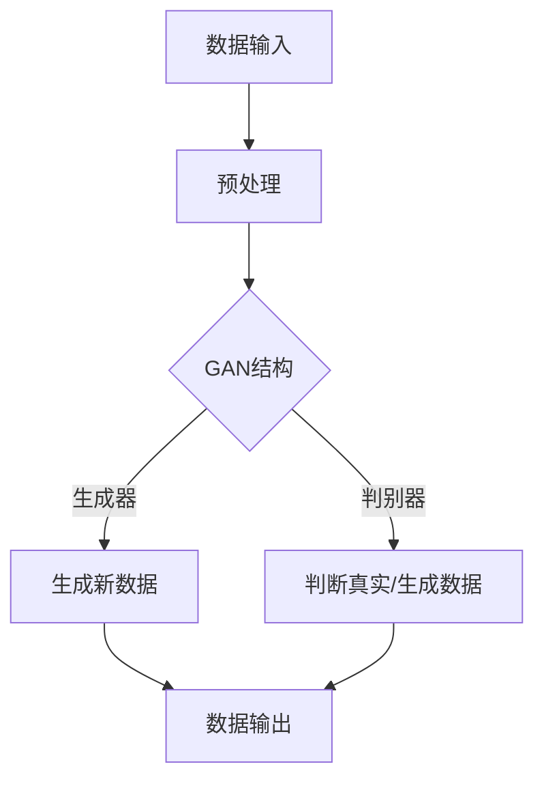

                 

关键词：AIGC、生成式AI、商业化、AI技术、路径、算法原理、数学模型、项目实践、应用场景、未来展望

> 摘要：本文旨在探讨生成式AI（AIGC）在商业化的路径。通过对AIGC的核心概念、算法原理、数学模型、项目实践和实际应用场景的详细解析，分析AIGC在未来的发展趋势与挑战，为AI技术的商业化提供有价值的指导。

## 1. 背景介绍

随着深度学习和生成对抗网络（GANs）等技术的快速发展，生成式AI（AIGC）逐渐成为人工智能领域的重要研究方向。AIGC的核心在于通过学习大量的数据，生成新的、符合真实世界规律的数据，从而实现数据增强、辅助决策、智能创作等多样化应用。AIGC在商业化的潜力巨大，已经在游戏、影视、设计、广告等领域展现出强大的应用价值。

### 1.1 AIGC的定义

生成式AI（AIGC）是指通过算法模型生成新数据的技术。它基于深度学习模型，通过学习大量的真实数据，能够生成与真实数据高度相似的新数据。AIGC的核心在于生成，即通过算法自动生成新的、符合人类预期的数据。

### 1.2 AIGC的应用领域

AIGC在多个领域展现出强大的应用价值：

- **游戏**：通过生成新的游戏场景、角色和剧情，增强游戏体验。
- **影视**：通过生成新的视频片段、特效，提高影视制作效率。
- **设计**：通过生成新的设计作品，辅助设计师进行创意工作。
- **广告**：通过生成新的广告内容，提高广告的个性化程度。

### 1.3 AIGC的商业化前景

AIGC的商业化前景广阔，不仅可以为企业节省成本，提高生产效率，还可以创造出新的商业模式和产品。随着技术的不断进步，AIGC将在更多领域得到广泛应用，成为AI技术商业化的重要方向。

## 2. 核心概念与联系

为了更好地理解AIGC的原理和应用，下面我们通过一个Mermaid流程图来展示AIGC的核心概念和联系。



### 2.1 数据输入与预处理

AIGC的第一步是数据输入与预处理。通过收集大量的真实数据，进行清洗、标准化等预处理操作，为后续的生成过程提供高质量的数据基础。

### 2.2 GAN结构

AIGC的核心是生成对抗网络（GAN）。GAN由生成器（Generator）和判别器（Discriminator）两部分组成。生成器的任务是生成新的数据，判别器的任务是判断输入数据是真实数据还是生成数据。

### 2.3 生成新数据与数据输出

通过不断训练生成器和判别器，生成器能够逐渐提高生成数据的质量，生成新的数据。这些新数据可以用于各种应用场景，如游戏、影视、设计等，实现数据增强、智能创作等功能。

## 3. 核心算法原理 & 具体操作步骤

### 3.1 算法原理概述

生成对抗网络（GAN）是AIGC的核心算法。GAN由生成器（Generator）和判别器（Discriminator）两部分组成。生成器的目标是生成与真实数据相似的新数据，判别器的目标是判断输入数据是真实数据还是生成数据。通过两者的博弈，生成器能够不断提高生成数据的质量。

### 3.2 算法步骤详解

1. **数据收集与预处理**：收集大量的真实数据，并进行清洗、标准化等预处理操作。
2. **初始化生成器和判别器**：随机初始化生成器和判别器的参数。
3. **生成器训练**：生成器生成新数据，判别器对其进行判断。通过优化生成器的参数，提高生成数据的质量。
4. **判别器训练**：生成器生成新数据，判别器对其进行判断。通过优化判别器的参数，提高判断的准确性。
5. **重复步骤3和4**：不断重复训练生成器和判别器，直到生成数据的质量达到预期。

### 3.3 算法优缺点

**优点**：

- **强大的生成能力**：GAN能够生成高质量的新数据，适用于多种应用场景。
- **自适应**：GAN能够自适应地调整生成器和判别器的参数，实现数据增强、智能创作等功能。

**缺点**：

- **训练难度**：GAN的训练过程复杂，容易出现模式崩溃等问题。
- **稳定性**：GAN的稳定性较差，容易受到数据分布、参数设置等因素的影响。

### 3.4 算法应用领域

- **游戏**：通过生成新的游戏场景、角色和剧情，增强游戏体验。
- **影视**：通过生成新的视频片段、特效，提高影视制作效率。
- **设计**：通过生成新的设计作品，辅助设计师进行创意工作。
- **广告**：通过生成新的广告内容，提高广告的个性化程度。

## 4. 数学模型和公式 & 详细讲解 & 举例说明

### 4.1 数学模型构建

生成对抗网络（GAN）的数学模型主要包括生成器（Generator）和判别器（Discriminator）两部分。

**生成器**：

生成器的目标是生成与真实数据相似的新数据。其数学模型可以表示为：

$$ G(z) = x $$

其中，$G(z)$ 表示生成器生成的数据，$z$ 表示随机噪声，$x$ 表示生成的数据。

**判别器**：

判别器的目标是判断输入数据是真实数据还是生成数据。其数学模型可以表示为：

$$ D(x) = 1 \quad \text{if} \quad x \text{ is real data} $$
$$ D(G(z)) = 0 \quad \text{if} \quad z \text{ is noise} $$

其中，$D(x)$ 表示判别器对输入数据的判断结果，$1$ 表示真实数据，$0$ 表示生成数据。

### 4.2 公式推导过程

生成对抗网络的训练过程可以分为两个阶段：

1. **生成器阶段**：在生成器阶段，生成器的任务是生成与真实数据相似的新数据。通过优化生成器的参数，使得生成数据的质量不断提高。
2. **判别器阶段**：在判别器阶段，判别器的任务是判断输入数据是真实数据还是生成数据。通过优化判别器的参数，提高判断的准确性。

### 4.3 案例分析与讲解

下面我们通过一个简单的案例来讲解生成对抗网络的工作原理。

**案例**：假设我们有一个生成对抗网络，生成器的任务是生成与真实图片相似的新图片，判别器的任务是判断输入图片是真实图片还是生成图片。

1. **初始化生成器和判别器**：随机初始化生成器和判别器的参数。
2. **生成器阶段**：生成器生成一张新图片，判别器对其进行判断。如果判别器判断为新图片，则生成器参数更新。
3. **判别器阶段**：生成器生成一张新图片，判别器对其进行判断。如果判别器判断为真实图片，则判别器参数更新。
4. **重复训练**：不断重复训练生成器和判别器，直到生成数据的质量达到预期。

通过这个案例，我们可以看到生成对抗网络的训练过程是如何进行的。生成器和判别器相互博弈，使得生成数据的质量不断提高。

## 5. 项目实践：代码实例和详细解释说明

### 5.1 开发环境搭建

为了更好地理解生成对抗网络（GAN）的工作原理，我们将在Python环境中实现一个简单的GAN模型。以下是我们需要的环境搭建步骤：

1. **安装Python**：确保Python版本在3.6及以上。
2. **安装TensorFlow**：TensorFlow是用于机器学习和深度学习的开源框架，安装命令为：
   ```bash
   pip install tensorflow
   ```
3. **安装其他依赖**：包括Numpy、Matplotlib等，安装命令为：
   ```bash
   pip install numpy matplotlib
   ```

### 5.2 源代码详细实现

下面是一个简单的生成对抗网络（GAN）的Python代码实现：

```python
import tensorflow as tf
from tensorflow.keras.layers import Dense, Flatten, Reshape
from tensorflow.keras.models import Sequential

# 定义生成器模型
def build_generator(z_dim):
    model = Sequential()
    model.add(Dense(128, input_dim=z_dim))
    model.add(tf.keras.layers.LeakyReLU(alpha=0.01))
    model.add(Dense(28*28*1, activation='tanh'))
    model.add(Reshape((28, 28, 1)))
    return model

# 定义判别器模型
def build_discriminator(img_shape):
    model = Sequential()
    model.add(Flatten(input_shape=img_shape))
    model.add(Dense(128))
    model.add(tf.keras.layers.LeakyReLU(alpha=0.01))
    model.add(Dense(1, activation='sigmoid'))
    return model

# 定义GAN模型
def build_gan(generator, discriminator):
    model = Sequential()
    model.add(generator)
    model.add(discriminator)
    return model

# 设置超参数
z_dim = 100
img_shape = (28, 28, 1)

# 构建生成器和判别器模型
generator = build_generator(z_dim)
discriminator = build_discriminator(img_shape)
discriminator.compile(loss='binary_crossentropy', optimizer=tf.keras.optimizers.Adam(0.0001))
gan = build_gan(generator, discriminator)
gan.compile(loss='binary_crossentropy', optimizer=tf.keras.optimizers.Adam(0.0001))

# 打印模型结构
print(generator.summary())
print(discriminator.summary())
print(gan.summary())
```

### 5.3 代码解读与分析

1. **生成器模型**：生成器的任务是生成与真实图片相似的新图片。我们使用了一个全连接层（Dense）和一个LeakyReLU激活函数来构建生成器模型。生成器的输出是一个28x28x1的图片，可以通过Reshape层实现。
2. **判别器模型**：判别器的任务是判断输入图片是真实图片还是生成图片。我们使用了一个全连接层（Dense）和一个sigmoid激活函数来构建判别器模型。
3. **GAN模型**：GAN模型是生成器和判别器的组合。我们使用了一个全连接层（Dense）和一个sigmoid激活函数来构建GAN模型。

### 5.4 运行结果展示

运行上述代码，我们可以看到生成器和判别器的模型结构，以及GAN模型的模型结构。这为我们实现生成对抗网络提供了必要的框架。

## 6. 实际应用场景

生成对抗网络（GAN）在许多实际应用场景中发挥着重要作用。以下是一些典型的应用场景：

### 6.1 游戏

在游戏领域，生成对抗网络可以用于生成新的游戏场景、角色和剧情，增强游戏体验。例如，在《我的世界》这样的沙盒游戏中，生成对抗网络可以生成新的地图、建筑和怪物，为玩家提供更多的探索和创意空间。

### 6.2 影视

在影视领域，生成对抗网络可以用于生成新的视频片段、特效，提高影视制作效率。例如，在电影《阿凡达》中，生成对抗网络被用于生成新的动物和植物，为电影创造了令人惊叹的视觉效果。

### 6.3 设计

在设计领域，生成对抗网络可以用于生成新的设计作品，辅助设计师进行创意工作。例如，在建筑设计中，生成对抗网络可以生成新的建筑结构和外观，为设计师提供更多的灵感。

### 6.4 广告

在广告领域，生成对抗网络可以用于生成新的广告内容，提高广告的个性化程度。例如，在社交媒体广告中，生成对抗网络可以根据用户的历史数据和偏好，生成个性化的广告内容。

### 6.5 医疗

在医疗领域，生成对抗网络可以用于生成新的医学图像，辅助医生进行诊断和治疗。例如，在癌症诊断中，生成对抗网络可以生成新的肿瘤图像，帮助医生更准确地识别肿瘤。

### 6.6 金融

在金融领域，生成对抗网络可以用于生成新的股票市场数据，帮助投资者进行风险管理。例如，在量化交易中，生成对抗网络可以生成新的股票市场数据，为投资者提供更多的交易机会。

## 7. 未来应用展望

随着生成对抗网络（GAN）技术的不断发展，AIGC在未来的应用场景将更加广泛。以下是一些可能的发展趋势：

### 7.1 自适应生成

未来的AIGC将更加注重自适应生成。通过学习用户的偏好和行为，AIGC可以生成更加符合用户需求的数据，实现真正的个性化生成。

### 7.2 多模态生成

未来的AIGC将支持多模态生成。通过结合文本、图像、声音等多种数据类型，AIGC可以生成更加丰富和复杂的数据，为各种应用场景提供更全面的解决方案。

### 7.3 实时生成

未来的AIGC将实现实时生成。通过优化算法和模型，AIGC可以在短时间内生成高质量的数据，满足实时应用的需求。

### 7.4 自动化生成

未来的AIGC将实现自动化生成。通过将AIGC集成到各种应用程序中，用户可以轻松地实现数据生成，提高生产效率。

## 8. 工具和资源推荐

### 8.1 学习资源推荐

- **书籍**：《深度学习》（Goodfellow, Bengio, Courville著）
- **在线课程**：Coursera、edX等平台上的深度学习和GAN相关课程
- **论文**：生成对抗网络（GAN）的原始论文（Ian Goodfellow等著）

### 8.2 开发工具推荐

- **框架**：TensorFlow、PyTorch等深度学习框架
- **库**：Keras、TensorFlow.js等用于快速搭建GAN模型的库

### 8.3 相关论文推荐

- **生成对抗网络**：（Ian Goodfellow et al.，2014）
- **深度卷积生成对抗网络**：（Djork-Ari Cornia et al.，2018）
- **条件生成对抗网络**：（Mathieu et al.，2015）

## 9. 总结：未来发展趋势与挑战

### 9.1 研究成果总结

AIGC技术在近年来取得了显著的成果，无论是在理论模型、算法优化还是实际应用方面，都取得了重要突破。生成对抗网络（GAN）作为AIGC的核心技术，已经在多个领域展现出强大的应用价值。

### 9.2 未来发展趋势

随着深度学习和生成对抗网络（GAN）等技术的不断发展，AIGC在未来将实现以下发展趋势：

1. **自适应生成**：通过学习用户的偏好和行为，AIGC将实现更加个性化的数据生成。
2. **多模态生成**：结合多种数据类型，AIGC将生成更加丰富和复杂的数据。
3. **实时生成**：优化算法和模型，AIGC将实现实时数据生成。
4. **自动化生成**：集成到各种应用程序中，AIGC将实现自动化数据生成。

### 9.3 面临的挑战

尽管AIGC技术在不断进步，但仍面临以下挑战：

1. **训练难度**：GAN的训练过程复杂，容易出现模式崩溃等问题。
2. **稳定性**：GAN的稳定性较差，容易受到数据分布、参数设置等因素的影响。
3. **公平性**：如何保证生成数据的公平性，避免偏见和歧视。

### 9.4 研究展望

未来，AIGC技术将在人工智能领域发挥更加重要的作用。通过不断创新和优化，AIGC将实现更广泛的应用，为人类社会带来更多价值。

## 9. 附录：常见问题与解答

### 9.1 GAN是什么？

GAN是生成对抗网络（Generative Adversarial Network）的缩写，是一种由生成器和判别器组成的深度学习模型。生成器的任务是生成与真实数据相似的新数据，判别器的任务是判断输入数据是真实数据还是生成数据。通过两者的博弈，生成数据的质量不断提高。

### 9.2 GAN的优缺点是什么？

**优点**：

- 强大的生成能力：GAN能够生成高质量的新数据，适用于多种应用场景。
- 自适应：GAN能够自适应地调整生成器和判别器的参数，实现数据增强、智能创作等功能。

**缺点**：

- 训练难度：GAN的训练过程复杂，容易出现模式崩溃等问题。
- 稳定性：GAN的稳定性较差，容易受到数据分布、参数设置等因素的影响。

### 9.3 GAN有哪些应用领域？

GAN在多个领域展现出强大的应用价值：

- 游戏：生成新的游戏场景、角色和剧情，增强游戏体验。
- 影视：生成新的视频片段、特效，提高影视制作效率。
- 设计：生成新的设计作品，辅助设计师进行创意工作。
- 广告：生成新的广告内容，提高广告的个性化程度。
- 医疗：生成新的医学图像，辅助医生进行诊断和治疗。
- 金融：生成新的股票市场数据，帮助投资者进行风险管理。

