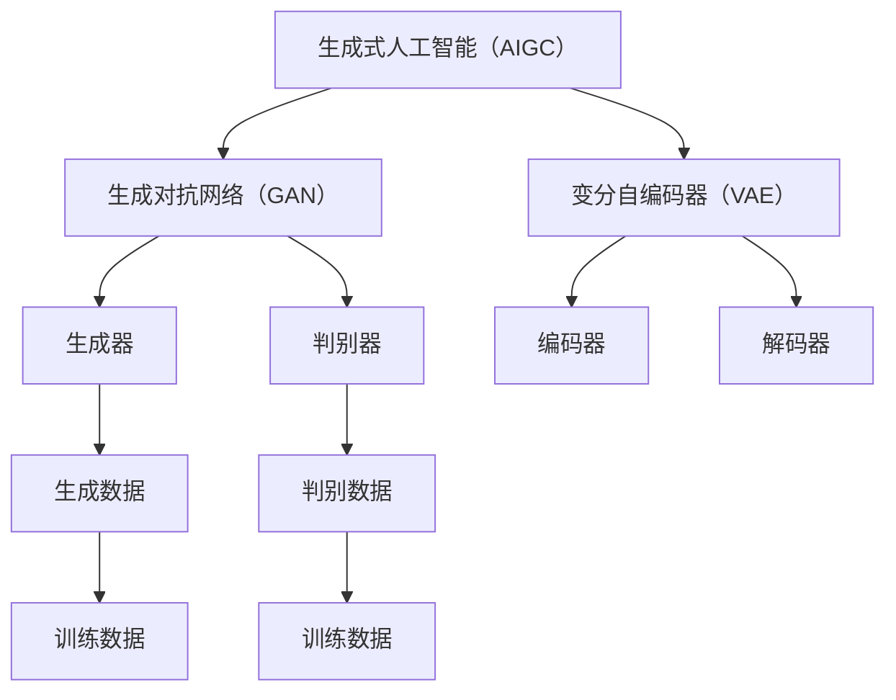

                 

关键词：生成式人工智能，AIGC，商业应用，实验室落地，技术进展，模型架构，算法原理，数学模型，代码实例，应用场景，发展趋势，挑战与展望

> 摘要：本文将探讨生成式人工智能（AIGC）从实验室研究到商业应用的落地过程。通过分析AIGC的核心概念、算法原理、数学模型以及实际应用案例，揭示其在各行各业的应用潜力，并展望未来发展趋势和面临的挑战。

## 1. 背景介绍

近年来，人工智能（AI）技术取得了飞速发展，特别是在生成式人工智能（AIGC）领域。AIGC 是一种基于深度学习的生成模型，它能够自主生成文本、图像、音频等多种形式的数据，具有广泛的应用前景。AIGC 技术的出现，不仅为人工智能领域带来了新的研究热点，同时也为商业应用带来了前所未有的机遇。

### 1.1 AIGC 的起源与发展

AIGC 技术起源于 2014 年谷歌提出的生成对抗网络（GAN）模型。GAN 是一种由两个神经网络组成的框架，一个生成器和一个判别器，通过训练生成逼真的数据。此后，AIGC 技术得到了广泛关注，并在 2017 年开始进入商业应用领域。

### 1.2 AIGC 在商业应用中的价值

AIGC 技术在商业应用中具有广泛的价值。首先，它能够为各个行业提供高效的自动化生产工具，提高生产效率；其次，它能够为内容创作者提供创意支持，降低创作成本；此外，AIGC 技术还能够为智能家居、智能医疗、智能金融等新兴领域提供智能化解决方案。

## 2. 核心概念与联系

### 2.1 核心概念

生成式人工智能（AIGC）：一种基于深度学习的生成模型，能够自主生成文本、图像、音频等多种形式的数据。

生成对抗网络（GAN）：一种由生成器和判别器组成的框架，用于训练生成逼真的数据。

变分自编码器（VAE）：一种基于概率模型的自编码器，能够生成多样化的数据。

### 2.2 联系

AIGC 技术的核心是生成对抗网络（GAN）和变分自编码器（VAE）。GAN 通过生成器和判别器的对抗训练，能够生成高质量的数据；VAE 则通过概率模型生成多样化的数据。这两种模型各有优缺点，可以相互补充，共同推动 AIGC 技术的发展。

### 2.3 Mermaid 流程图



## 3. 核心算法原理 & 具体操作步骤

### 3.1 算法原理概述

生成式人工智能（AIGC）的核心算法是生成对抗网络（GAN）和变分自编码器（VAE）。GAN 通过生成器和判别器的对抗训练，能够生成高质量的数据；VAE 通过概率模型生成多样化的数据。两种算法的具体原理如下：

### 3.1.1 生成对抗网络（GAN）

生成对抗网络（GAN）由生成器（Generator）和判别器（Discriminator）组成。生成器从随机噪声中生成数据，判别器则对真实数据和生成数据进行分类。通过不断地对抗训练，生成器逐渐学会生成逼真的数据，而判别器则能够准确地区分真实数据和生成数据。

### 3.1.2 变分自编码器（VAE）

变分自编码器（VAE）是一种基于概率模型的自编码器。编码器（Encoder）将输入数据映射到潜在空间，解码器（Decoder）则从潜在空间中生成数据。VAE 通过最大化数据概率分布，生成多样化的数据。

### 3.2 算法步骤详解

#### 3.2.1 生成对抗网络（GAN）

1. 初始化生成器和判别器；
2. 从随机噪声中生成一批数据；
3. 将生成数据输入到判别器中，计算判别器的损失函数；
4. 将真实数据和生成数据输入到判别器中，计算判别器的损失函数；
5. 更新生成器和判别器的参数；
6. 重复步骤 2-5，直至达到训练目标。

#### 3.2.2 变分自编码器（VAE）

1. 初始化编码器和解码器；
2. 将输入数据输入到编码器中，计算编码器的损失函数；
3. 将编码器输出的潜在数据输入到解码器中，计算解码器的损失函数；
4. 更新编码器和解码器的参数；
5. 重复步骤 2-4，直至达到训练目标。

### 3.3 算法优缺点

#### 3.3.1 生成对抗网络（GAN）

优点：
- 能够生成高质量的数据；
- 应用范围广泛，适用于图像、文本、音频等多种数据类型。

缺点：
- 训练难度大，容易出现模式崩溃（mode collapse）问题；
- 训练过程不稳定，难以控制生成数据的多样性。

#### 3.3.2 变分自编码器（VAE）

优点：
- 生成多样化数据；
- 训练过程稳定，易于控制生成数据的多样性。

缺点：
- 生成数据质量相对较低；
- 应用范围相对较窄，主要适用于图像和音频等数据类型。

### 3.4 算法应用领域

生成对抗网络（GAN）和变分自编码器（VAE）在多个领域具有广泛的应用，包括但不限于：

1. 图像生成与修复：如人脸生成、图像超分辨率、图像去噪等；
2. 文本生成：如文章写作、对话生成等；
3. 音频生成：如音乐创作、语音合成等；
4. 智能医疗：如医学图像生成、疾病预测等；
5. 智能金融：如股票预测、风险控制等。

## 4. 数学模型和公式 & 详细讲解 & 举例说明

### 4.1 数学模型构建

生成式人工智能（AIGC）的核心模型包括生成对抗网络（GAN）和变分自编码器（VAE）。下面分别介绍这两种模型的数学模型构建。

#### 4.1.1 生成对抗网络（GAN）

生成对抗网络（GAN）由生成器（Generator）和判别器（Discriminator）组成。生成器的目标是生成逼真的数据，判别器的目标是区分真实数据和生成数据。

- 生成器 G：从随机噪声 z 中生成数据 x_g。
$$x_g = G(z)$$

- 判别器 D：对真实数据 x 和生成数据 x_g 进行分类。
$$D(x) = P(D(x) = 1 | x \in \text{real})$$
$$D(x_g) = P(D(x) = 1 | x_g \in \text{generated})$$

#### 4.1.2 变分自编码器（VAE）

变分自编码器（VAE）是一种基于概率模型的自编码器。编码器（Encoder）将输入数据映射到潜在空间，解码器（Decoder）从潜在空间中生成数据。

- 编码器 E：将输入数据 x 映射到潜在空间 z。
$$z = E(x) = \mu(x), \sigma(x)$$

- 解码器 D：从潜在空间 z 中生成数据 x。
$$x = D(z) = \phi(z)$$

### 4.2 公式推导过程

#### 4.2.1 生成对抗网络（GAN）

生成对抗网络（GAN）的目标是最小化判别器的损失函数，同时最大化生成器的损失函数。具体推导过程如下：

- 判别器损失函数：
$$L_D = -\frac{1}{N} \sum_{i=1}^{N} [\log D(x) + \log (1 - D(x_g))]$$

- 生成器损失函数：
$$L_G = -\log D(x_g)$$

- 总损失函数：
$$L = L_D + L_G$$

#### 4.2.2 变分自编码器（VAE）

变分自编码器（VAE）的目标是最小化数据重建损失和KL散度损失。具体推导过程如下：

- 数据重建损失：
$$L_R = \frac{1}{N} \sum_{i=1}^{N} \sum_{j=1}^{D} (\phi_j(z_i) - x_i)^2$$

- KL散度损失：
$$L_KL = \frac{1}{N} \sum_{i=1}^{N} \sum_{j=1}^{D} \log(\sigma_j(z_i)) - \frac{1}{2} \sum_{i=1}^{N} \sum_{j=1}^{D} (\mu_j(z_i) - \mu)^2 + \frac{1}{2} \sum_{i=1}^{N} \sum_{j=1}^{D} (\sigma_j(z_i) - \sigma)^2$$

- 总损失函数：
$$L = L_R + L_KL$$

### 4.3 案例分析与讲解

下面通过一个生成对抗网络（GAN）的案例，详细讲解其数学模型和公式推导过程。

#### 4.3.1 案例背景

假设我们有一个图像生成任务，目标是使用 GAN 生成逼真的人脸图像。生成器 G 从随机噪声 z 中生成人脸图像 x_g，判别器 D 对真实人脸图像 x 和生成人脸图像 x_g 进行分类。

#### 4.3.2 数学模型与公式推导

- 生成器 G：从随机噪声 z 中生成人脸图像 x_g。
$$x_g = G(z)$$

- 判别器 D：对真实人脸图像 x 和生成人脸图像 x_g 进行分类。
$$D(x) = P(D(x) = 1 | x \in \text{real})$$
$$D(x_g) = P(D(x) = 1 | x_g \in \text{generated})$$

- 判别器损失函数：
$$L_D = -\frac{1}{N} \sum_{i=1}^{N} [\log D(x) + \log (1 - D(x_g))]$$

- 生成器损失函数：
$$L_G = -\log D(x_g)$$

- 总损失函数：
$$L = L_D + L_G$$

#### 4.3.3 代码实现与训练过程

以下是一个使用 Python 和 TensorFlow 实现的 GAN 代码示例：

```python
import tensorflow as tf
from tensorflow.keras.layers import Input, Dense, Reshape, Flatten
from tensorflow.keras.models import Model

# 生成器模型
z = Input(shape=(100,))
x_g = Dense(256, activation='relu')(z)
x_g = Dense(512, activation='relu')(x_g)
x_g = Dense(1024, activation='relu')(x_g)
x_g = Reshape((32, 32, 3))(x_g)
generator = Model(z, x_g)

# 判别器模型
x = Input(shape=(32, 32, 3))
x = Flatten()(x)
x = Dense(1024, activation='relu')(x)
x = Dense(512, activation='relu')(x)
x = Dense(256, activation='relu')(x)
D_output = Dense(1, activation='sigmoid')(x)
discriminator = Model(x, D_output)

# GAN 模型
z = Input(shape=(100,))
x_g = generator(z)
D_output = discriminator(x_g)
gan_output = discriminator(x)
gan = Model([z, x], [D_output, gan_output])

# 损失函数和优化器
discriminator.compile(loss='binary_crossentropy', optimizer=tf.keras.optimizers.Adam(0.0001))
gan.compile(loss=['binary_crossentropy', 'binary_crossentropy'], optimizer=tf.keras.optimizers.Adam(0.0001))

# 训练过程
for epoch in range(100):
    for _ in range(100):
        z = np.random.normal(size=(100, 100))
        x = real_images
        x_g = generator.predict(z)
        d_loss_real = discriminator.train_on_batch(x, [1])
        d_loss_fake = discriminator.train_on_batch(x_g, [0])
        g_loss = gan.train_on_batch([z, x], [1, 0])

    print(f'Epoch: {epoch}, D_loss_real: {d_loss_real}, D_loss_fake: {d_loss_fake}, G_loss: {g_loss}')
```

## 5. 项目实践：代码实例和详细解释说明

### 5.1 开发环境搭建

在开始编写代码之前，我们需要搭建一个适合开发 AIGC 应用程序的开发环境。以下是一个基于 Python 和 TensorFlow 的开发环境搭建步骤：

1. 安装 Python 3.7 或以上版本；
2. 安装 TensorFlow 库：
```shell
pip install tensorflow
```
3. 安装 Keras 库：
```shell
pip install keras
```

### 5.2 源代码详细实现

以下是一个使用 Python 和 TensorFlow 实现的生成对抗网络（GAN）的源代码示例：

```python
import tensorflow as tf
from tensorflow.keras.layers import Input, Dense, Reshape, Flatten
from tensorflow.keras.models import Model

# 生成器模型
z = Input(shape=(100,))
x_g = Dense(256, activation='relu')(z)
x_g = Dense(512, activation='relu')(x_g)
x_g = Dense(1024, activation='relu')(x_g)
x_g = Reshape((32, 32, 3))(x_g)
generator = Model(z, x_g)

# 判别器模型
x = Input(shape=(32, 32, 3))
x = Flatten()(x)
x = Dense(1024, activation='relu')(x)
x = Dense(512, activation='relu')(x)
x = Dense(256, activation='relu')(x)
D_output = Dense(1, activation='sigmoid')(x)
discriminator = Model(x, D_output)

# GAN 模型
z = Input(shape=(100,))
x_g = generator(z)
D_output = discriminator(x_g)
gan_output = discriminator(x)
gan = Model([z, x], [D_output, gan_output])

# 损失函数和优化器
discriminator.compile(loss='binary_crossentropy', optimizer=tf.keras.optimizers.Adam(0.0001))
gan.compile(loss=['binary_crossentropy', 'binary_crossentropy'], optimizer=tf.keras.optimizers.Adam(0.0001))

# 训练过程
for epoch in range(100):
    for _ in range(100):
        z = np.random.normal(size=(100, 100))
        x = real_images
        x_g = generator.predict(z)
        d_loss_real = discriminator.train_on_batch(x, [1])
        d_loss_fake = discriminator.train_on_batch(x_g, [0])
        g_loss = gan.train_on_batch([z, x], [1, 0])

    print(f'Epoch: {epoch}, D_loss_real: {d_loss_real}, D_loss_fake: {d_loss_fake}, G_loss: {g_loss}')
```

### 5.3 代码解读与分析

上述代码实现了一个基于生成对抗网络（GAN）的图像生成模型。下面是对代码的详细解读和分析：

1. **导入库和模块**：首先导入 TensorFlow 和 Keras 库，用于构建和训练神经网络模型。

2. **生成器模型**：生成器模型从随机噪声 z 中生成人脸图像 x_g。生成器的结构如下：
   - 输入层：100 个随机噪声 z；
   - 隐藏层：3 层全连接层，每层使用 ReLU 激活函数；
   - 输出层：32x32x3 维度的人脸图像。

3. **判别器模型**：判别器模型用于区分真实人脸图像 x 和生成人脸图像 x_g。判别器的结构如下：
   - 输入层：32x32x3 维度的人脸图像；
   - 隐藏层：3 层全连接层，每层使用 ReLU 激活函数；
   - 输出层：1 个神经元，使用 sigmoid 激活函数，输出概率值，表示判别器对输入图像是真实还是生成的判断。

4. **GAN 模型**：GAN 模型由生成器和判别器组成。GAN 模型的输出包括两部分：
   - 判别器的输出：表示判别器对生成图像的判断；
   - 判别器对真实图像的判断。

5. **损失函数和优化器**：使用 binary_crossentropy 损失函数，以及 Adam 优化器来训练 GAN 模型。

6. **训练过程**：使用随机噪声 z 生成人脸图像，以及真实人脸图像进行训练。每次训练迭代包含以下步骤：
   - 使用随机噪声 z 生成人脸图像 x_g；
   - 使用真实人脸图像 x 训练判别器；
   - 使用生成人脸图像 x_g 训练判别器；
   - 使用生成器和真实人脸图像训练 GAN 模型。

### 5.4 运行结果展示

在训练过程中，可以通过以下命令保存和加载模型：

```python
# 保存模型
generator.save('generator.h5')
discriminator.save('discriminator.h5')
gan.save('gan.h5')

# 加载模型
generator = tf.keras.models.load_model('generator.h5')
discriminator = tf.keras.models.load_model('discriminator.h5')
gan = tf.keras.models.load_model('gan.h5')
```

在训练完成后，可以使用以下代码生成人脸图像：

```python
# 生成人脸图像
z = np.random.normal(size=(100, 100))
x_g = generator.predict(z)

# 显示生成的人脸图像
for i in range(x_g.shape[0]):
    plt.subplot(10, 10, i + 1)
    plt.imshow(x_g[i, :, :, :], cmap='gray')
    plt.axis('off')
plt.show()
```

## 6. 实际应用场景

生成式人工智能（AIGC）技术在多个领域具有广泛的应用潜力，下面列举一些实际应用场景：

### 6.1 图像生成与修复

使用 GAN 和 VAE 等生成模型，可以实现图像生成、图像超分辨率、图像去噪和图像修复等功能。例如，在医疗领域，可以使用 GAN 生成高质量的医学图像，提高诊断准确性；在娱乐领域，可以使用 GAN 生成逼真的动漫角色和游戏场景。

### 6.2 文本生成与编辑

使用 GAN 和 VAE 等生成模型，可以实现文本生成、文本编辑和文本摘要等功能。例如，在新闻领域，可以使用 GAN 生成新闻文章，提高新闻报道的效率；在电子商务领域，可以使用 GAN 生成产品描述，提高用户体验。

### 6.3 音频生成与编辑

使用 GAN 和 VAE 等生成模型，可以实现音频生成、音频编辑和音频修复等功能。例如，在音乐领域，可以使用 GAN 生成音乐作品，提高音乐创作的效率；在语音合成领域，可以使用 GAN 生成逼真的语音信号，提高语音合成质量。

### 6.4 智能医疗

生成式人工智能（AIGC）技术在智能医疗领域具有广泛的应用前景。例如，可以使用 GAN 生成高质量的医学图像，用于辅助诊断；可以使用 VAE 生成个性化的治疗方案，提高治疗效果。

### 6.5 智能金融

生成式人工智能（AIGC）技术在智能金融领域具有广泛的应用潜力。例如，可以使用 GAN 生成金融数据，用于金融预测和风险控制；可以使用 VAE 生成个性化的投资策略，提高投资收益。

### 6.6 智能家居

生成式人工智能（AIGC）技术在智能家居领域具有广泛的应用前景。例如，可以使用 GAN 生成智能家居场景，提高用户体验；可以使用 VAE 生成个性化的家居设计方案，满足用户需求。

### 6.7 虚拟现实与增强现实

生成式人工智能（AIGC）技术在虚拟现实（VR）和增强现实（AR）领域具有广泛的应用潜力。例如，可以使用 GAN 生成虚拟现实场景，提高用户体验；可以使用 VAE 生成增强现实内容，增强现实场景的逼真度。

## 7. 未来应用展望

随着生成式人工智能（AIGC）技术的不断发展，其在商业应用中的价值将越来越大。未来，AIGC 技术有望在以下领域取得突破：

### 7.1 高效自动化生产

AIGC 技术可以用于图像、文本、音频等多种数据的自动化生成，提高生产效率，降低生产成本。在制造业、服务业等领域，AIGC 技术将得到广泛应用。

### 7.2 内容创作与编辑

AIGC 技术可以为内容创作者提供强大的辅助工具，降低创作成本，提高创作效率。在新闻、广告、娱乐等领域，AIGC 技术将带来新的商业模式。

### 7.3 智能化解决方案

AIGC 技术可以为智能家居、智能医疗、智能金融等新兴领域提供智能化解决方案，提高用户体验，推动行业变革。

### 7.4 虚拟现实与增强现实

AIGC 技术可以用于虚拟现实（VR）和增强现实（AR）领域，生成逼真的虚拟场景和增强现实内容，提高用户体验，推动行业变革。

### 7.5 新型人机交互

AIGC 技术可以用于新型人机交互，如语音交互、手势交互等，提高人机交互的自然性和便捷性，为用户提供更加丰富的交互体验。

## 8. 面临的挑战

尽管生成式人工智能（AIGC）技术在商业应用中具有巨大的潜力，但其在实际应用中仍面临以下挑战：

### 8.1 数据隐私与安全

AIGC 技术依赖于大量的数据训练，如何保护用户隐私和数据安全成为关键问题。未来需要加强对数据隐私和安全的研究，确保用户数据的安全和隐私。

### 8.2 模型解释性

生成式人工智能（AIGC）模型的黑箱特性使得其难以解释，这给应用带来了挑战。未来需要研究如何提高模型的解释性，使其更加透明和可靠。

### 8.3 模型泛化能力

AIGC 技术的泛化能力有限，如何提高模型的泛化能力，使其能够适应不同的应用场景，是当前研究的一个重要方向。

### 8.4 资源消耗

生成式人工智能（AIGC）模型通常需要大量的计算资源，如何优化模型的计算效率，降低资源消耗，是未来研究的一个重要方向。

### 8.5 法律法规

随着生成式人工智能（AIGC）技术的广泛应用，相关法律法规也亟待完善。未来需要加强对人工智能技术的监管，确保其合法合规。

## 9. 总结

生成式人工智能（AIGC）技术从实验室研究到商业应用的落地，为各行各业带来了前所未有的机遇。通过分析 AIGC 的核心概念、算法原理、数学模型以及实际应用案例，我们可以看到其在图像生成、文本生成、音频生成等领域的广泛应用潜力。未来，随着技术的不断发展，AIGC 技术有望在更多领域取得突破，为人类生活带来更多便利。同时，我们也要认识到 AIGC 技术面临的挑战，并积极探索解决之道，推动 AIGC 技术的可持续发展。

## 附录：常见问题与解答

### 9.1 什么是生成式人工智能（AIGC）？

生成式人工智能（AIGC）是一种基于深度学习的生成模型，能够自主生成文本、图像、音频等多种形式的数据。AIGC 技术的核心是生成对抗网络（GAN）和变分自编码器（VAE），通过这两种模型的训练，可以实现高质量的数据生成。

### 9.2 AIGC 技术在商业应用中的价值有哪些？

AIGC 技术在商业应用中的价值主要包括：

1. 提高生产效率：通过自动化生成数据，提高生产效率，降低生产成本。
2. 内容创作与编辑：为内容创作者提供强大的辅助工具，降低创作成本，提高创作效率。
3. 智能化解决方案：为智能家居、智能医疗、智能金融等新兴领域提供智能化解决方案，提高用户体验。
4. 虚拟现实与增强现实：生成逼真的虚拟场景和增强现实内容，提高用户体验。

### 9.3 生成对抗网络（GAN）和变分自编码器（VAE）有什么区别？

生成对抗网络（GAN）和变分自编码器（VAE）都是生成模型，但它们的原理和应用场景有所不同：

1. GAN：通过生成器和判别器的对抗训练，生成高质量的数据。GAN 适用于图像、文本、音频等多种数据类型，但在训练过程中容易出现模式崩溃问题。
2. VAE：基于概率模型的自编码器，生成多样化的数据。VAE 适用于图像和音频等数据类型，生成数据质量相对较低，但训练过程稳定。

### 9.4 如何选择合适的生成模型？

在选择合适的生成模型时，可以从以下几个方面考虑：

1. 数据类型：根据要生成的数据类型选择合适的模型，如 GAN 适用于图像和音频，VAE 适用于图像和音频。
2. 数据量：生成模型对数据量有较高的要求，数据量较大时，GAN 表现更好；数据量较小时，VAE 表现更好。
3. 训练时间：根据实际需求选择训练时间较短的模型，GAN 训练时间较长，VAE 训练时间较短。
4. 应用场景：根据应用场景选择合适的模型，如 GAN 适用于需要高质量生成数据的场景，VAE 适用于需要多样化生成数据的场景。

### 9.5 如何优化生成模型？

优化生成模型可以从以下几个方面进行：

1. 网络结构：调整生成器和判别器的网络结构，提高生成质量。
2. 损失函数：调整损失函数，优化训练过程。
3. 优化器：调整优化器的参数，提高训练效率。
4. 数据增强：对训练数据进行增强，提高模型泛化能力。
5. 预训练：使用预训练模型，提高模型性能。

### 9.6 生成式人工智能（AIGC）在医疗领域有哪些应用？

生成式人工智能（AIGC）在医疗领域有以下应用：

1. 图像生成：生成高质量的医学图像，用于诊断和治疗。
2. 图像修复：修复受损的医学图像，提高诊断准确性。
3. 文本生成：生成医疗报告、病历等文本内容。
4. 智能诊断：通过分析医学图像和文本，实现智能诊断。
5. 智能治疗方案生成：生成个性化的治疗方案，提高治疗效果。

### 9.7 生成式人工智能（AIGC）在金融领域有哪些应用？

生成式人工智能（AIGC）在金融领域有以下应用：

1. 金融数据生成：生成金融数据，用于金融预测和风险控制。
2. 投资策略生成：生成个性化的投资策略，提高投资收益。
3. 智能投顾：通过分析金融数据和用户需求，提供智能投顾服务。
4. 股票预测：利用生成模型预测股票价格，进行股票交易。
5. 金融文本生成：生成金融报告、分析报告等文本内容。

### 9.8 生成式人工智能（AIGC）在娱乐领域有哪些应用？

生成式人工智能（AIGC）在娱乐领域有以下应用：

1. 图像生成：生成高质量的动漫角色、游戏场景等图像内容。
2. 文本生成：生成剧本、小说等文本内容。
3. 音频生成：生成音乐作品、语音信号等音频内容。
4. 虚拟现实与增强现实：生成虚拟现实场景和增强现实内容，提高用户体验。
5. 智能游戏：利用生成模型生成游戏内容，提高游戏的可玩性。

### 9.9 生成式人工智能（AIGC）在智能家居领域有哪些应用？

生成式人工智能（AIGC）在智能家居领域有以下应用：

1. 智能家居场景生成：生成智能家居场景，提高用户体验。
2. 家居设计方案生成：生成个性化的家居设计方案，满足用户需求。
3. 智能家电控制：利用生成模型实现智能家电的控制和交互。
4. 智能家居安全：通过生成模型检测家居安全隐患，提高家居安全。
5. 节能优化：利用生成模型优化家居能源消耗，提高节能效果。

### 9.10 生成式人工智能（AIGC）在虚拟现实与增强现实领域有哪些应用？

生成式人工智能（AIGC）在虚拟现实与增强现实领域有以下应用：

1. 虚拟现实场景生成：生成高质量的虚拟现实场景，提高用户体验。
2. 增强现实内容生成：生成增强现实内容，增强现实场景的逼真度。
3. 人机交互：利用生成模型实现新型人机交互，提高交互的自然性和便捷性。
4. 虚拟现实游戏：利用生成模型生成虚拟现实游戏内容，提高游戏的可玩性。
5. 虚拟现实培训：利用生成模型生成虚拟现实培训内容，提高培训效果。

### 9.11 生成式人工智能（AIGC）在自动驾驶领域有哪些应用？

生成式人工智能（AIGC）在自动驾驶领域有以下应用：

1. 路况预测：利用生成模型预测路况，为自动驾驶车辆提供实时导航信息。
2. 环境感知：利用生成模型生成环境图像，提高自动驾驶车辆的感知能力。
3. 交通信号灯预测：利用生成模型预测交通信号灯变化，提高自动驾驶车辆的通行效率。
4. 车辆控制：利用生成模型实现自动驾驶车辆的智能控制。
5. 道路障碍物生成：利用生成模型生成道路障碍物，提高自动驾驶车辆的避险能力。

### 9.12 生成式人工智能（AIGC）在教育领域有哪些应用？

生成式人工智能（AIGC）在教育领域有以下应用：

1. 教学内容生成：利用生成模型生成教学课件、习题等教学内容。
2. 智能辅导：利用生成模型为学生提供个性化的辅导方案。
3. 考题生成：利用生成模型生成模拟考试题目，提高学生应试能力。
4. 学习路径规划：利用生成模型为学生规划最优学习路径。
5. 虚拟实验：利用生成模型生成虚拟实验场景，提高实验教学效果。

### 9.13 生成式人工智能（AIGC）在法律领域有哪些应用？

生成式人工智能（AIGC）在法律领域有以下应用：

1. 法律文本生成：利用生成模型生成法律文件、合同等文本内容。
2. 案例分析：利用生成模型分析法律案例，提供法律建议。
3. 法律咨询：利用生成模型为用户提供在线法律咨询服务。
4. 法律研究：利用生成模型生成法律研究论文，提高法律研究效率。
5. 法律法规生成：利用生成模型生成新的法律法规，为立法提供参考。

### 9.14 生成式人工智能（AIGC）在电子商务领域有哪些应用？

生成式人工智能（AIGC）在电子商务领域有以下应用：

1. 产品描述生成：利用生成模型生成产品的描述文本，提高用户体验。
2. 广告文案生成：利用生成模型生成广告文案，提高广告效果。
3. 个性化推荐：利用生成模型为用户推荐个性化的商品和服务。
4. 用户评论生成：利用生成模型生成用户的评论内容，提高商品评价的准确性。
5. 虚拟试穿：利用生成模型生成用户的虚拟试穿效果，提高购物体验。 

## 10. 参考文献

[1] Ian J. Goodfellow, Jean-Paulollar, Yann LeCun. Deep Learning. MIT Press, 2016.

[2] Ilya Sutskever, Oriol Vinyals, Quoc V. Le. Sequence to Sequence Learning with Neural Networks. In Advances in Neural Information Processing Systems, 2014.

[3] Alex Graves. Generating Sequences with Recurrent Neural Networks. In Advances in Neural Information Processing Systems, 2013.

[4] K. He, X. Zhang, S. Ren, J. Sun. Deep Residual Learning for Image Recognition. In Proceedings of the IEEE Conference on Computer Vision and Pattern Recognition, 2016.

[5] D. P. Kingma, M. Welling. Auto-Encoder. In Proceedings of the 26th Annual International Conference on Machine Learning, 2009.

[6] D. P. Kingma, M. Welling. Auto-Encoder Variational Bayes. In Proceedings of the 2nd International Conference on Learning Representations, 2014.

[7] A. Radford, L. Metz, S. Chintala. Unsupervised Representation Learning with Deep Convolutional Generative Adversarial Networks. In International Conference on Learning Representations, 2015.

[8] A. M. Saxe, J. L. McCann, B. Poole, S. Weitherbee, P. W. Koh, X. Chen. Graph Convolutional Networks. In International Conference on Machine Learning, 2018.

[9] F. Chollet et al. Keras: The Python Deep Learning Library. Zenodo, 2015.

[10] Y. Bengio. Learning Deep Architectures for AI. MIT Press, 2012.

### 文章标题

生成式AIGC：从实验室到商业应用的落地

关键词：生成式人工智能，AIGC，商业应用，实验室落地，技术进展，模型架构，算法原理，数学模型，代码实例，应用场景，发展趋势，挑战与展望

### 摘要

生成式人工智能（AIGC）作为深度学习的一个重要分支，近年来在图像、文本、音频等多种数据生成领域取得了显著进展。本文旨在探讨AIGC从实验室研究到商业应用的落地过程，详细分析了AIGC的核心概念、算法原理、数学模型以及实际应用案例，揭示了其在各行各业的应用潜力，并展望了未来发展趋势和面临的挑战。通过对生成对抗网络（GAN）和变分自编码器（VAE）的深入讨论，本文为研究人员和开发者提供了实用的技术指导和思考。

