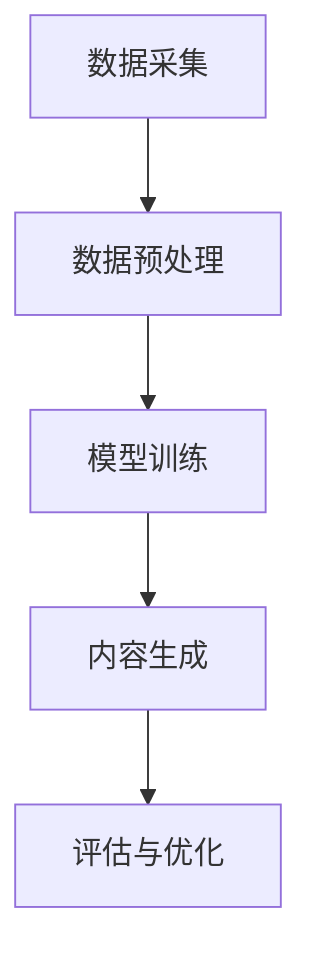

                 

关键词：生成式AI、AIGC、数据驱动、商业价值、模型应用

> 摘要：本文深入探讨了生成式人工智能（AIGC）的原理及其从数据到商业价值的实现过程。通过对核心概念、算法原理、数学模型、项目实践等方面的详细分析，本文旨在为读者提供一份全面、系统的技术指南，帮助理解AIGC在现代商业应用中的巨大潜力。

## 1. 背景介绍

### 1.1 生成式AI的定义与发展

生成式人工智能（Generative AI）是一种能够生成新数据的人工智能模型，它通过对现有数据的理解和学习，生成与训练数据相似的新数据。自2010年代中期以来，生成式AI经历了飞速发展，特别是深度学习技术的突破，使得生成式AI在图像、文本、音频等多种数据类型上取得了显著成果。

### 1.2 AIGC的概念与特性

AIGC（AI-Generated Content）是生成式AI的一种应用形式，它将人工智能与内容生成技术相结合，实现了从数据到内容的自动化生产。AIGC具有以下几个主要特性：

- **高效率**：能够快速生成大规模、高质量的内容。
- **低成本**：减少人力成本，提高生产效率。
- **灵活性**：能够根据需求定制生成不同类型的内容。
- **多样性**：生成的数据内容具有丰富的多样性。

### 1.3 数据驱动与商业价值

在现代商业环境中，数据已经成为最重要的资产之一。数据驱动的决策能够显著提高企业的运营效率和竞争力。AIGC通过生成新的数据内容，为企业提供了丰富的数据资源，从而推动了商业价值的实现。

## 2. 核心概念与联系

### 2.1 数据生成的基本原理

AIGC的核心在于生成数据，这个过程依赖于以下几个关键概念：

- **数据预处理**：对输入数据进行分析和处理，提取有用的信息。
- **模型训练**：使用深度学习算法对数据进行分析和建模，训练生成模型。
- **数据生成**：通过训练好的模型生成新的数据内容。

### 2.2 AIGC架构

AIGC的架构通常包括以下几个部分：

- **数据采集**：收集各种类型的数据，如文本、图像、音频等。
- **数据预处理**：清洗、转换和归一化数据。
- **模型训练**：使用预处理后的数据进行模型训练。
- **内容生成**：利用训练好的模型生成新的数据内容。
- **评估与优化**：对生成的内容进行评估和优化，以提高质量。

### 2.3 Mermaid 流程图



## 3. 核心算法原理 & 具体操作步骤

### 3.1 算法原理概述

AIGC的核心算法包括生成对抗网络（GAN）、变分自编码器（VAE）等。以下是对这些算法的基本原理的概述：

- **生成对抗网络（GAN）**：GAN由生成器（Generator）和判别器（Discriminator）组成。生成器生成数据，判别器判断数据是否真实。通过训练，生成器逐渐生成更真实的数据，而判别器的准确率逐渐提高。
- **变分自编码器（VAE）**：VAE通过编码器和解码器实现数据的重建。编码器将数据编码为一个潜在空间中的点，解码器从潜在空间中生成数据。

### 3.2 算法步骤详解

#### 3.2.1 GAN的训练步骤

1. **初始化生成器和判别器**：生成器和判别器通常由神经网络组成，初始化时可以随机初始化或者使用预训练的模型。
2. **生成器训练**：生成器尝试生成与真实数据相似的数据，判别器评估这些数据的真实度。
3. **判别器训练**：判别器尝试区分真实数据和生成数据，生成器优化其生成的数据，以逃避判别器的判断。
4. **交替训练**：生成器和判别器交替进行训练，直到生成器生成的数据质量达到预定的标准。

#### 3.2.2 VAE的训练步骤

1. **编码器训练**：编码器将数据映射到一个潜在空间中的点。
2. **解码器训练**：解码器从潜在空间中生成数据，以重建输入数据。
3. **联合训练**：编码器和解码器共同训练，优化整个模型的性能。

### 3.3 算法优缺点

- **GAN**：
  - **优点**：生成数据的多样性高，生成的数据质量好。
  - **缺点**：训练过程不稳定，容易出现模式崩塌（mode collapse）。
- **VAE**：
  - **优点**：训练过程稳定，生成的数据质量较高。
  - **缺点**：生成数据的多样性相对较低。

### 3.4 算法应用领域

AIGC的应用领域非常广泛，包括但不限于：

- **图像生成**：如艺术作品、面部生成、场景渲染等。
- **文本生成**：如文章、故事、对话等。
- **音频生成**：如音乐、语音合成等。

## 4. 数学模型和公式 & 详细讲解 & 举例说明

### 4.1 数学模型构建

AIGC中的数学模型主要包括生成模型和判别模型。以下是以GAN为例的数学模型：

#### 4.1.1 生成模型

生成模型（Generator）通常表示为：

$$ G(z) = G(\mathbf{z}) = \mathbf{x} $$

其中，$\mathbf{z}$ 是潜在空间中的向量，$G(\mathbf{z})$ 是生成器生成的数据。

#### 4.1.2 判别模型

判别模型（Discriminator）通常表示为：

$$ D(x) = \sigma(\mathbf{W}_D \mathbf{x} + \mathbf{b}_D) $$

其中，$x$ 是真实数据或生成数据，$D(x)$ 是判别器的输出概率，表示$x$ 为真实数据的置信度。

### 4.2 公式推导过程

#### 4.2.1 GAN的目标函数

GAN的目标函数通常表示为：

$$ \min_G \max_D V(D, G) = \mathbb{E}_{x \sim p_{data}(x)} [D(x)] - \mathbb{E}_{z \sim p_z(z)} [D(G(z))] $$

其中，$V(D, G)$ 是判别器和生成器的联合损失函数，$p_{data}(x)$ 是真实数据的分布，$p_z(z)$ 是潜在空间的分布。

#### 4.2.2 VAE的目标函数

VAE的目标函数通常表示为：

$$ \min_{\phi, \theta} V(\theta) = \mathbb{E}_{x \sim p_{data}(x)} \Bigg[ \log D(x) + D(\mu(x), \sigma^2(x)) \Bigg] $$

其中，$D(x)$ 是判别器的输出概率，$\mu(x)$ 和 $\sigma^2(x)$ 分别是编码器输出的均值和方差。

### 4.3 案例分析与讲解

#### 4.3.1 图像生成案例

以生成人脸图像为例，使用GAN进行图像生成。首先，收集大量人脸图像作为训练数据。然后，初始化生成器和判别器，通过交替训练，生成器逐渐生成更逼真的人脸图像，而判别器逐渐提高区分真实人脸和生成人脸的能力。

#### 4.3.2 文本生成案例

以生成文章为例，使用VAE进行文本生成。首先，收集大量文章作为训练数据。然后，初始化编码器和解码器，通过联合训练，编码器将文章编码为潜在空间中的点，解码器从潜在空间中生成文章。

## 5. 项目实践：代码实例和详细解释说明

### 5.1 开发环境搭建

搭建AIGC项目所需的开发环境，主要包括Python、TensorFlow或PyTorch等。

### 5.2 源代码详细实现

以下是一个简单的GAN图像生成的Python代码示例：

```python
import tensorflow as tf
from tensorflow.keras.layers import Dense, Flatten
from tensorflow.keras.models import Sequential

# 生成器模型
def build_generator(z_dim):
    model = Sequential()
    model.add(Dense(128, input_dim=z_dim))
    model.add(tf.keras.layers.LeakyReLU(alpha=0.01))
    model.add(Dense(28*28*1, activation='tanh'))
    return model

# 判别器模型
def build_discriminator(img_shape):
    model = Sequential()
    model.add(Flatten(input_shape=img_shape))
    model.add(Dense(128))
    model.add(tf.keras.layers.LeakyReLU(alpha=0.01))
    model.add(Dense(1, activation='sigmoid'))
    return model

# 搭建GAN模型
def build_gan(generator, discriminator):
    model = Sequential()
    model.add(generator)
    model.add(discriminator)
    return model

# 模型训练
def train(model, data, z_dim, epochs):
    for epoch in range(epochs):
        # 生成随机噪声
        z = np.random.normal(0, 1, (batch_size, z_dim))
        # 生成器生成图像
        generated_images = generator.predict(z)
        # 训练判别器
        real_images = data[:batch_size]
        real_labels = np.ones((batch_size, 1))
        fake_labels = np.zeros((batch_size, 1))
        d_loss_real = discriminator.train_on_batch(real_images, real_labels)
        d_loss_fake = discriminator.train_on_batch(generated_images, fake_labels)
        d_loss = 0.5 * np.add(d_loss_real, d_loss_fake)
        # 训练生成器
        g_loss = model.train_on_batch(z, real_labels)
        print ('[Epoch %d/%d] [d_loss: %f] [g_loss: %f]' % (epoch, num_epochs, d_loss, g_loss))
```

### 5.3 代码解读与分析

以上代码实现了GAN的人脸图像生成。其中，`build_generator` 函数用于构建生成器模型，`build_discriminator` 函数用于构建判别器模型，`build_gan` 函数用于构建GAN模型，`train` 函数用于训练模型。

### 5.4 运行结果展示

运行以上代码后，可以观察到生成的人脸图像逐渐变得更加真实。

## 6. 实际应用场景

### 6.1 艺术创作

AIGC在艺术创作领域具有广泛的应用，例如生成艺术作品、音乐、文学作品等。通过AIGC，艺术家可以更高效地创作，同时也能为观众带来全新的艺术体验。

### 6.2 娱乐产业

在娱乐产业中，AIGC被广泛应用于电影特效、动画制作、虚拟现实等领域。通过AIGC，可以生成逼真的场景和角色，提高影视作品的质量。

### 6.3 企业应用

在企业应用中，AIGC可以用于数据生成、内容营销、客户服务等方面。通过AIGC，企业可以更有效地管理数据，提高营销效果，提升客户满意度。

## 7. 工具和资源推荐

### 7.1 学习资源推荐

- **书籍**：《深度学习》、《生成对抗网络》
- **在线课程**：Coursera、edX上的相关课程
- **博客**：Towards Data Science、AI Village等

### 7.2 开发工具推荐

- **框架**：TensorFlow、PyTorch
- **库**：NumPy、Pandas、Matplotlib

### 7.3 相关论文推荐

- **GAN相关**：《Generative Adversarial Networks》、《Unsupervised Representation Learning with Deep Convolutional Generative Adversarial Networks》
- **VAE相关**：《Variational Autoencoder》、《Unsupervised Learning of 3D Representations of Human Pose and Shape from Monocular Videos》

## 8. 总结：未来发展趋势与挑战

### 8.1 研究成果总结

AIGC在图像、文本、音频等多种数据类型上取得了显著成果，其在艺术创作、娱乐产业、企业应用等领域具有巨大的潜力。

### 8.2 未来发展趋势

- **算法优化**：进一步优化生成模型和判别模型的算法，提高生成数据的质量。
- **应用拓展**：探索AIGC在更多领域的应用，如医疗、金融等。
- **数据隐私**：研究如何在保障数据隐私的前提下，有效利用数据生成技术。

### 8.3 面临的挑战

- **数据质量**：如何提高生成数据的质量和多样性。
- **计算资源**：如何降低AIGC模型的计算资源需求。
- **伦理与法律**：如何解决AIGC在应用过程中可能引发的伦理和法律问题。

### 8.4 研究展望

AIGC作为人工智能的一个重要分支，具有广泛的应用前景。未来，我们将看到更多创新的AIGC应用场景，同时也需要关注其在伦理和法律方面的挑战。

## 9. 附录：常见问题与解答

### 9.1 什么是GAN？

GAN（生成对抗网络）是一种由生成器和判别器组成的深度学习模型，用于生成与真实数据相似的新数据。生成器生成数据，判别器判断数据是否真实。通过交替训练，生成器逐渐生成更真实的数据。

### 9.2 VAE与GAN的区别是什么？

VAE（变分自编码器）和GAN都是生成模型，但它们有不同的架构和目标。VAE通过编码器和解码器实现数据的重建，其目标是最小化重构误差。GAN则由生成器和判别器组成，其目标是最小化生成器的损失函数和最大化判别器的损失函数。

### 9.3 AIGC在商业应用中的优势是什么？

AIGC在商业应用中的优势主要包括高效率、低成本、灵活性和多样性。通过AIGC，企业可以更高效地生成数据，降低人力成本，提高生产效率，同时生成的内容具有丰富的多样性，满足不同的商业需求。

### 9.4 如何保障AIGC的数据隐私？

保障AIGC的数据隐私可以通过以下方法实现：

- **数据加密**：对输入数据进行加密处理，确保数据在传输和存储过程中的安全性。
- **数据去识别化**：对输入数据中的个人识别信息进行去除或匿名化处理。
- **隐私保护算法**：使用隐私保护算法，如差分隐私，确保在数据使用过程中不会泄露个人隐私。

**作者：禅与计算机程序设计艺术 / Zen and the Art of Computer Programming**

