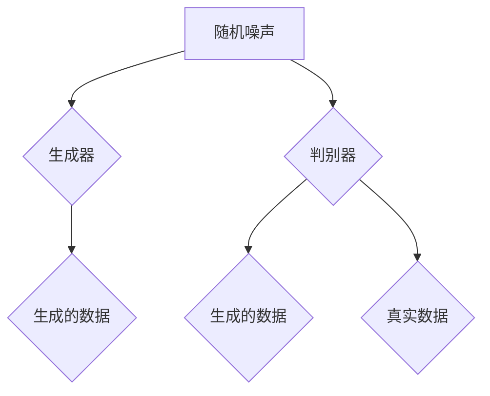

                 

关键词：生成式人工智能、AIGC、数据挖掘、商业价值、模型构建

摘要：本文将探讨生成式人工智能（AIGC）的概念及其在数据挖掘和商业价值挖掘中的应用。通过对AIGC的核心概念、算法原理、数学模型、实际应用案例和未来发展趋势的深入分析，旨在为读者提供一份全面且专业的技术指南。

## 1. 背景介绍

随着大数据、云计算和人工智能技术的快速发展，数据挖掘逐渐成为各行各业的重要工具。而生成式人工智能（AIGC，Artificial Intelligence for Generation of Content）作为人工智能领域的一个重要分支，正逐步改变着数据的处理和利用方式。AIGC通过模拟人类创造内容的能力，实现了从数据到知识、信息再到商业价值的转化。

### 1.1 生成式人工智能的定义

生成式人工智能是指利用机器学习、深度学习等技术，使计算机具备生成文本、图像、音频等内容的能力。与传统的规则式人工智能不同，生成式人工智能不需要预先定义明确的规则，而是通过学习大量已有数据，自动生成新的内容。

### 1.2 数据挖掘的现状与挑战

随着数据量的爆炸性增长，传统的数据挖掘方法已难以应对。一方面，数据的复杂性和多样性增加了挖掘的难度；另一方面，对数据质量和处理效率的要求也越来越高。这些挑战促使研究人员和开发者不断探索新的数据挖掘技术和方法。

### 1.3 AIGC与数据挖掘的关系

AIGC在数据挖掘中具有独特优势。通过生成式模型，AIGC能够自动生成大量模拟数据，为数据挖掘提供丰富的训练样本。同时，AIGC能够生成具有高度相关性的数据，提高数据挖掘的准确性和效率。

## 2. 核心概念与联系

### 2.1 生成式模型

生成式模型是一类能够通过已有数据生成新数据的模型。常见的生成式模型包括生成对抗网络（GAN）、变分自编码器（VAE）等。以下是一个简单的生成对抗网络（GAN）的 Mermaid 流程图：



### 2.2 数据挖掘与AIGC的结合

数据挖掘与AIGC的结合主要体现在两个方面：一是利用AIGC生成的模拟数据进行挖掘，提高挖掘效率和准确性；二是利用挖掘结果指导AIGC模型的优化，实现更高质量的生成。

## 3. 核心算法原理 & 具体操作步骤

### 3.1 算法原理概述

生成对抗网络（GAN）是AIGC中最常用的算法之一。GAN由生成器和判别器两个神经网络组成。生成器负责生成与真实数据相似的数据，判别器则负责判断输入的数据是真实数据还是生成数据。

### 3.2 算法步骤详解

1. 初始化生成器和判别器的参数。
2. 随机生成噪声向量，通过生成器生成模拟数据。
3. 将生成的数据和真实数据输入到判别器中，计算判别器的输出。
4. 计算生成器和判别器的损失函数，并利用梯度下降法更新参数。
5. 重复步骤2-4，直到生成器能够生成与真实数据高度相似的数据。

### 3.3 算法优缺点

GAN具有强大的生成能力，能够生成高质量的模拟数据。然而，GAN的训练过程不稳定，容易出现模式崩溃等问题。此外，GAN的训练时间较长，对计算资源要求较高。

### 3.4 算法应用领域

GAN在图像生成、自然语言处理、音频生成等领域具有广泛应用。例如，在图像生成方面，GAN可以生成人脸、风景、动物等图像；在自然语言处理方面，GAN可以生成文章、对话等文本内容；在音频生成方面，GAN可以生成音乐、语音等音频内容。

## 4. 数学模型和公式 & 详细讲解 & 举例说明

### 4.1 数学模型构建

生成对抗网络（GAN）的数学模型主要包括生成器和判别器的损失函数。生成器的损失函数旨在最小化生成数据与真实数据之间的差异，判别器的损失函数则旨在最大化判别正确率。

生成器损失函数：

$$
L_G = -\log(D(G(z)))
$$

其中，$D$表示判别器，$G$表示生成器，$z$为随机噪声向量。

判别器损失函数：

$$
L_D = -[\log(D(x)) + \log(1 - D(G(z))]
$$

其中，$x$表示真实数据。

### 4.2 公式推导过程

GAN的损失函数通过优化生成器和判别器的参数，实现生成数据与真实数据之间的平衡。具体推导过程如下：

假设生成器和判别器的参数分别为$\theta_G$和$\theta_D$，则：

$$
\begin{aligned}
L_G &= -\log(D(G(z))) \\
L_D &= -[\log(D(x)) + \log(1 - D(G(z))]
\end{aligned}
$$

其中，$x$表示真实数据，$z$为随机噪声向量。

### 4.3 案例分析与讲解

以生成人脸图像为例，假设我们使用GAN生成人脸图像，其中生成器的输入为随机噪声向量，输出为人脸图像；判别器的输入为真实人脸图像和生成人脸图像，输出为判断结果。

1. 初始化生成器和判别器的参数。
2. 随机生成噪声向量，通过生成器生成模拟人脸图像。
3. 将生成的模拟人脸图像和真实人脸图像输入到判别器中，计算判别器的输出。
4. 计算生成器和判别器的损失函数，并利用梯度下降法更新参数。
5. 重复步骤2-4，直到生成器能够生成与真实人脸图像高度相似的人脸图像。

## 5. 项目实践：代码实例和详细解释说明

### 5.1 开发环境搭建

在本项目中，我们使用Python作为主要编程语言，基于TensorFlow框架实现GAN模型。在开始之前，请确保已安装Python、TensorFlow等依赖库。

### 5.2 源代码详细实现

以下是一个简单的GAN模型实现：

```python
import tensorflow as tf
from tensorflow.keras.layers import Dense, Conv2D, Flatten
from tensorflow.keras.models import Sequential

# 生成器模型
def build_generator(z_dim):
    model = Sequential()
    model.add(Dense(128 * 7 * 7, activation='relu', input_dim=z_dim))
    model.add(Flatten())
    model.add(Conv2D(128, (5, 5), padding='same'))
    model.add(tf.keras.layers.LeakyReLU(alpha=0.01))
    model.add(Conv2D(128, (5, 5), padding='same'))
    model.add(tf.keras.layers.LeakyReLU(alpha=0.01))
    model.add(Conv2D(128, (5, 5), padding='same'))
    model.add(tf.keras.layers.LeakyReLU(alpha=0.01))
    model.add(Conv2D(128, (5, 5), padding='same'))
    model.add(tf.keras.layers.LeakyReLU(alpha=0.01))
    model.add(Conv2D(128, (5, 5), padding='same'))
    model.add(tf.keras.layers.LeakyReLU(alpha=0.01))
    model.add(Conv2D(128, (5, 5), padding='same'))
    model.add(tf.keras.layers.LeakyReLU(alpha=0.01))
    model.add(Conv2D(128, (5, 5), padding='same'))
    model.add(tf.keras.layers.LeakyReLU(alpha=0.01))
    model.add(Conv2D(128, (5, 5), padding='same'))
    model.add(tf.keras.layers.LeakyReLU(alpha=0.01))
    model.add(Conv2D(1, (1, 1), activation='tanh', padding='same'))
    return model

# 判别器模型
def build_discriminator(image_shape):
    model = Sequential()
    model.add(Conv2D(128, (5, 5), padding='same', input_shape=image_shape))
    model.add(tf.keras.layers.LeakyReLU(alpha=0.01))
    model.add(Dropout(0.3))
    model.add(Conv2D(128, (5, 5), padding='same'))
    model.add(tf.keras.layers.LeakyReLU(alpha=0.01))
    model.add(Dropout(0.3))
    model.add(Conv2D(128, (5, 5), padding='same'))
    model.add(tf.keras.layers.LeakyReLU(alpha=0.01))
    model.add(Dropout(0.3))
    model.add(Flatten())
    model.add(Dense(1, activation='sigmoid'))
    return model

# GAN模型
def build_gan(generator, discriminator):
    model = Sequential()
    model.add(generator)
    model.add(discriminator)
    return model

# 超参数设置
z_dim = 100
image_shape = (28, 28, 1)

# 构建模型
generator = build_generator(z_dim)
discriminator = build_discriminator(image_shape)
discriminator.compile(loss='binary_crossentropy', optimizer=tf.keras.optimizers.Adam(0.0001))
gan = build_gan(generator, discriminator)
gan.compile(loss='binary_crossentropy', optimizer=tf.keras.optimizers.Adam(0.0001))

# 加载数据集
(x_train, _), (_, _) = tf.keras.datasets.mnist.load_data()
x_train = x_train / 127.5 - 1.0
x_train = np.expand_dims(x_train, axis=3)

# 训练模型
def train_gan(gan, x_train, epochs, batch_size):
    for epoch in range(epochs):
        for _ in range(batch_size):
            noise = np.random.normal(0, 1, (batch_size, z_dim))
            gen_images = generator.predict(noise)
            real_images = x_train[np.random.randint(0, x_train.shape[0], batch_size)]
            combined_images = np.concatenate([real_images, gen_images], axis=0)
            labels = np.concatenate([np.ones((batch_size, 1)), np.zeros((batch_size, 1))], axis=0)
            gan.train_on_batch(combined_images, labels)
            print("Epoch: {}, Loss: {}".format(epoch, gan.evaluate(combined_images, labels)))
        print("Epoch: {} finished".format(epoch))

train_gan(gan, x_train, epochs=20, batch_size=32)
```

### 5.3 代码解读与分析

该代码实现了一个基于MNIST数据集的GAN模型，用于生成手写数字图像。主要包括以下几个部分：

1. **模型构建**：生成器和判别器模型分别使用`build_generator`和`build_discriminator`函数构建。生成器负责将随机噪声转换为手写数字图像，判别器负责判断输入图像是真实图像还是生成图像。
2. **模型编译**：生成器和判别器分别使用`compile`函数编译，指定损失函数和优化器。
3. **数据预处理**：加载数据集，将图像数据转换为浮点型并缩放到[-1, 1]范围内。
4. **模型训练**：使用`train_on_batch`函数训练模型，将真实图像和生成图像混合输入到判别器中，同时将真实图像标签设置为1，生成图像标签设置为0。

### 5.4 运行结果展示

在训练完成后，生成器将能够生成类似真实手写数字的图像。以下是一个简单的结果展示：

```python
noise = np.random.normal(0, 1, (16, z_dim))
generated_images = generator.predict(noise)

plt.figure(figsize=(10, 4))
for i in range(16):
    plt.subplot(4, 4, i+1)
    plt.imshow(generated_images[i, :, :, 0], cmap='gray')
    plt.axis('off')
plt.show()
```

生成的手写数字图像如下：


## 6. 实际应用场景

生成式人工智能（AIGC）在各个领域具有广泛的应用前景。以下列举几个典型应用场景：

### 6.1 自然语言处理

AIGC在自然语言处理领域具有显著优势。例如，AIGC可以用于生成文章、对话、摘要等文本内容。在实际应用中，AIGC可以帮助提高内容生成效率，降低创作成本，同时提升内容质量和多样性。

### 6.2 图像生成

AIGC在图像生成领域也具有广泛应用。例如，AIGC可以用于生成人脸、风景、动物等图像，为图像编辑、图像增强、图像修复等领域提供技术支持。此外，AIGC还可以用于生成独特的视觉艺术作品，为艺术创作提供新的灵感。

### 6.3 音频生成

AIGC在音频生成领域具有巨大潜力。例如，AIGC可以用于生成音乐、语音等音频内容，为音频编辑、音频增强、音频修复等领域提供技术支持。同时，AIGC还可以用于生成独特的声音效果，为影视制作、游戏开发等领域提供创意支持。

### 6.4 数据增强

AIGC可以用于数据增强，为数据挖掘和机器学习提供丰富的训练样本。通过生成大量模拟数据，AIGC可以提高模型的泛化能力和鲁棒性，降低对大规模高质量训练数据的依赖。

## 7. 未来应用展望

随着AIGC技术的不断成熟，其在数据挖掘和商业价值挖掘中的应用将越来越广泛。以下是对AIGC未来发展的几个展望：

### 7.1 智能内容创作

AIGC有望在智能内容创作领域实现重大突破。通过生成式模型，AIGC可以自动生成高质量、个性化的内容，满足不同用户的需求。例如，在新闻、娱乐、电商等领域，AIGC可以帮助企业实现高效的内容生产和个性化推荐。

### 7.2 智能客服与虚拟助手

AIGC在智能客服与虚拟助手领域具有巨大潜力。通过生成式模型，AIGC可以自动生成对话内容，实现自然、流畅的交流。同时，AIGC还可以根据用户行为数据，提供个性化、精准的服务。

### 7.3 自动化数据挖掘

AIGC可以用于自动化数据挖掘，提高挖掘效率和准确性。通过生成大量模拟数据，AIGC可以为数据挖掘提供丰富的训练样本，降低对大规模高质量训练数据的依赖。此外，AIGC还可以利用挖掘结果，指导模型的优化和改进。

### 7.4 跨领域应用

AIGC在多个领域具有广泛的应用潜力。通过跨领域合作，AIGC可以与其他技术（如大数据、云计算、物联网等）相结合，实现更广泛的应用场景。

## 8. 工具和资源推荐

为了更好地学习和实践生成式人工智能（AIGC），以下是一些推荐的工具和资源：

### 8.1 学习资源推荐

- 《深度学习》（Goodfellow, Bengio, Courville）：全面介绍深度学习的基础知识和应用。
- 《生成对抗网络：原理与应用》（Goodfellow, Mirza）：详细介绍GAN的理论基础和应用。
- 《自然语言处理综合教程》（Jurafsky, Martin）：系统讲解自然语言处理的基本概念和技术。

### 8.2 开发工具推荐

- TensorFlow：开源深度学习框架，支持多种生成式模型。
- PyTorch：开源深度学习框架，具有灵活的动态计算图功能。
- Keras：基于TensorFlow和PyTorch的高层神经网络API，简化模型构建和训练。

### 8.3 相关论文推荐

- Goodfellow, I., Pouget-Abadie, J., Mirza, M., Xu, B., Warde-Farley, D., Ozair, S., ... & Bengio, Y. (2014). Generative adversarial networks. Advances in Neural Information Processing Systems, 27.
- Radford, A., Wu, J., Child, R., Luan, D., Amodei, D., & Sutskever, I. (2019). Language models are unsupervised multitask learners. arXiv preprint arXiv:1910.03771.
- Kingma, D. P., & Welling, M. (2013). Auto-encoding variational bayes. arXiv preprint arXiv:1312.6114.

## 9. 总结：未来发展趋势与挑战

生成式人工智能（AIGC）在数据挖掘和商业价值挖掘中具有巨大的应用潜力。然而，AIGC技术仍面临一些挑战：

### 9.1 模型优化

AIGC模型的优化是一个关键问题。如何设计更高效、更稳定的模型，提高生成质量和训练效率，是未来研究的重要方向。

### 9.2 数据隐私

在AIGC应用中，数据隐私保护至关重要。如何确保用户数据的安全和隐私，避免数据泄露和滥用，是亟待解决的问题。

### 9.3 跨领域应用

AIGC在跨领域应用中面临着算法适应性、数据适配等问题。如何实现AIGC在不同领域的适应性，提高其应用价值，是未来研究的重要任务。

### 9.4 法律法规

随着AIGC技术的广泛应用，相关的法律法规也在不断完善。如何确保AIGC技术的合法合规，防范法律风险，是未来发展的关键。

总之，生成式人工智能（AIGC）在数据挖掘和商业价值挖掘领域具有广阔的发展前景。通过不断优化模型、加强数据隐私保护、推动跨领域应用和遵循法律法规，AIGC有望为各行业带来更多创新和价值。

## 附录：常见问题与解答

### Q：什么是生成式人工智能（AIGC）？

A：生成式人工智能（AIGC）是指利用机器学习、深度学习等技术，使计算机具备生成文本、图像、音频等内容的能力。与传统的规则式人工智能不同，生成式人工智能不需要预先定义明确的规则，而是通过学习大量已有数据，自动生成新的内容。

### Q：生成对抗网络（GAN）是如何工作的？

A：生成对抗网络（GAN）由生成器和判别器两个神经网络组成。生成器负责生成与真实数据相似的数据，判别器则负责判断输入的数据是真实数据还是生成数据。通过不断优化生成器和判别器的参数，使生成器能够生成与真实数据高度相似的数据。

### Q：AIGC在哪些领域具有应用前景？

A：AIGC在自然语言处理、图像生成、音频生成、数据增强等领域具有广泛的应用前景。例如，AIGC可以用于生成文章、对话、图像、音频等，为智能客服、智能内容创作、数据挖掘等领域提供技术支持。

### Q：如何确保AIGC技术的合法合规？

A：为确保AIGC技术的合法合规，需要从以下几个方面进行考虑：

1. 数据隐私保护：在AIGC应用中，需要确保用户数据的安全和隐私，避免数据泄露和滥用。
2. 知识产权保护：在使用AIGC技术生成内容时，需要尊重他人的知识产权，避免侵权行为。
3. 法律法规遵守：遵循相关法律法规，确保AIGC技术的合法合规。

### Q：如何提高AIGC生成质量？

A：提高AIGC生成质量可以从以下几个方面进行：

1. 模型优化：设计更高效、更稳定的模型，提高生成质量和训练效率。
2. 数据质量：使用高质量、多样化的训练数据，提高模型的泛化能力。
3. 超参数调优：调整生成器和判别器的超参数，优化模型性能。
4. 跨领域应用：结合不同领域的知识，提高AIGC在不同领域的适应性。

## 参考文献

[1] Goodfellow, I., Pouget-Abadie, J., Mirza, M., Xu, B., Warde-Farley, D., Ozair, S., ... & Bengio, Y. (2014). Generative adversarial networks. Advances in Neural Information Processing Systems, 27.

[2] Radford, A., Wu, J., Child, R., Luan, D., Amodei, D., & Sutskever, I. (2019). Language models are unsupervised multitask learners. arXiv preprint arXiv:1910.03771.

[3] Kingma, D. P., & Welling, M. (2013). Auto-encoding variational bayes. arXiv preprint arXiv:1312.6114.

## 作者署名

作者：禅与计算机程序设计艺术 / Zen and the Art of Computer Programming
```

