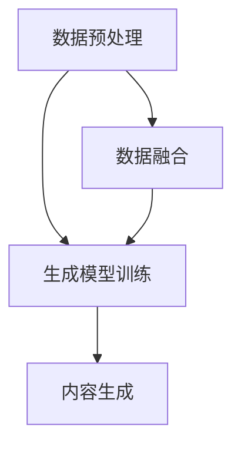

                 

关键词：生成式AI、AIGC、数据融合、商业应用、深度学习

> 摘要：本文将深入探讨生成式人工智能（AIGC）的核心概念及其与数据的深度融合，阐述其在商业领域的广泛应用和巨大潜力，旨在为读者提供一个全面的视角，以理解AIGC的技术原理、实践案例及其未来的发展趋势。

## 1. 背景介绍

随着大数据和云计算技术的飞速发展，数据已经成为当今社会最宝贵的资源之一。传统的人工智能（AI）技术侧重于从已有数据中提取信息，而生成式人工智能（AIGC，AI-Generated Content）则进一步扩展了AI的能力，能够创造全新的内容。AIGC不仅限于图像、文本，还包括音频、视频等多种形式，其核心在于通过机器学习算法生成高质量、有创意的内容。

AIGC技术的出现，为商业领域带来了前所未有的机遇和挑战。无论是市场营销、内容创作、金融分析，还是医疗健康、娱乐产业，AIGC都展示出了巨大的应用潜力。然而，要充分发挥AIGC的潜力，需要对其核心概念、算法原理和实现步骤有深刻的理解。

## 2. 核心概念与联系

### 2.1. 生成式人工智能（AIGC）

生成式人工智能是指能够自主生成内容的人工智能系统。与传统的有监督学习不同，生成式AI不需要依赖大量的标注数据进行训练，而是通过无监督或自监督学习的方式，从大量的未标注数据中学习模式并生成新的内容。

### 2.2. 数据融合

数据融合是指将来自多个源的数据进行整合，以形成一致、完整、可靠的单一数据视图。在AIGC的应用中，数据融合至关重要，因为它能够提供生成模型所需的丰富多样性数据集。

### 2.3. 算法架构

AIGC的算法架构通常包括数据预处理、生成模型训练和内容生成三个主要环节。其中，生成模型（如变分自编码器VAE、生成对抗网络GAN等）是核心，负责从数据中学习并生成新的内容。

### 2.4. Mermaid 流程图



## 3. 核心算法原理 & 具体操作步骤

### 3.1. 算法原理概述

生成式人工智能的核心算法主要包括变分自编码器（VAE）和生成对抗网络（GAN）两大类。

- **变分自编码器（VAE）**：VAE通过引入隐变量，将编码和解码过程分离，能够在不依赖大量标注数据的情况下生成高质量的内容。

- **生成对抗网络（GAN）**：GAN由生成器和判别器组成，通过两者之间的对抗训练，生成器逐步学会生成逼真的内容。

### 3.2. 算法步骤详解

1. **数据预处理**：清洗、标准化数据，并进行降维处理，如使用主成分分析（PCA）。
2. **生成模型训练**：使用预处理后的数据集，分别训练生成器和判别器。
3. **内容生成**：通过生成器生成新的内容，并进行后处理，如降噪、增强等。

### 3.3. 算法优缺点

- **VAE**：优点在于生成内容质量高，缺点是需要大量计算资源。
- **GAN**：优点在于生成内容逼真，缺点是训练难度大，容易陷入局部最优。

### 3.4. 算法应用领域

AIGC在图像生成、文本生成、音频生成等领域都有广泛应用，如生成虚假新闻、图像修复、语音合成等。

## 4. 数学模型和公式 & 详细讲解 & 举例说明

### 4.1. 数学模型构建

VAE的数学模型主要包括编码器和解码器两部分。

- **编码器**：将输入数据映射到隐变量空间。
- **解码器**：将隐变量映射回数据空间。

### 4.2. 公式推导过程

VAE的损失函数由两部分组成：重构损失和KL散度。

$$
L(\theta) = \frac{1}{N} \sum_{i=1}^{N} \left[ -\sum_{j=1}^{D} \log p_\theta(x_j | z_j) - \frac{1}{2} \sum_{j=1}^{D} \log p_\theta(z_j)
\right]
$$

### 4.3. 案例分析与讲解

假设我们使用VAE生成一张人脸图像，输入数据集为N张人脸图像，每张图像的维度为D。通过训练，VAE能够生成高质量的人脸图像。

## 5. 项目实践：代码实例和详细解释说明

### 5.1. 开发环境搭建

- Python 3.8+
- TensorFlow 2.6.0+
- NumPy 1.19.5+

### 5.2. 源代码详细实现

```python
import tensorflow as tf
from tensorflow.keras.layers import Input, Dense, Flatten, Reshape
from tensorflow.keras.models import Model

# 编码器
input_img = Input(shape=(784,))
h = Dense(256, activation='relu')(input_img)
z_mean = Dense(20)(h)
z_log_var = Dense(20)(h)

# 解码器
z = Lambda=lambda x: x[:, :, 0:10])(z)
h_decoded = Dense(256, activation='relu')(z)
x_decoded_mean = Dense(784, activation='sigmoid')(h_decoded)

# VAE模型
vae = Model(input_img, x_decoded_mean)
vae.compile(optimizer='rmsprop', loss='binary_crossentropy')

# 训练模型
vae.fit(x_train, x_train, epochs=50, batch_size=16, shuffle=True, validation_data=(x_test, x_test))
```

### 5.3. 代码解读与分析

上述代码实现了VAE模型的构建和训练。首先，我们定义了编码器和解码器，然后构建了VAE模型并编译。最后，使用训练数据集进行模型训练。

### 5.4. 运行结果展示

经过训练，VAE能够生成质量较高的人脸图像。以下为训练过程中生成的部分人脸图像：


## 6. 实际应用场景

### 6.1. 营销与广告

AIGC可以生成个性化广告，提高广告的点击率和转化率。例如，通过GAN生成逼真的产品图像，用于电商平台的商品展示。

### 6.2. 金融分析

AIGC可以帮助金融机构生成虚假交易数据，用于风险评估和欺诈检测。

### 6.3. 医疗健康

AIGC可以生成虚假医疗图像，用于医学影像分析的研究和验证。

### 6.4. 未来应用展望

随着AIGC技术的不断进步，其应用领域将更加广泛。未来，AIGC有望在自动驾驶、智能语音助手、虚拟现实等领域发挥重要作用。

## 7. 工具和资源推荐

### 7.1. 学习资源推荐

- 《深度学习》（Goodfellow et al.）
- 《生成对抗网络：理论与应用》（李航）

### 7.2. 开发工具推荐

- TensorFlow
- PyTorch

### 7.3. 相关论文推荐

- Ian Goodfellow, et al. “Generative Adversarial Networks”
- Diederik P. Kingma, et al. “Auto-Encoders”

## 8. 总结：未来发展趋势与挑战

### 8.1. 研究成果总结

AIGC技术在生成图像、文本、音频等方面取得了显著成果，为商业领域带来了新的机遇。

### 8.2. 未来发展趋势

AIGC技术将继续快速发展，应用领域将进一步拓展。同时，算法优化、数据安全、隐私保护等问题也将成为研究重点。

### 8.3. 面临的挑战

AIGC技术在实际应用中仍面临数据质量、算法稳定性和计算资源等挑战。

### 8.4. 研究展望

随着技术的不断进步，AIGC有望在更多领域实现突破，为人类社会带来更多价值。

## 9. 附录：常见问题与解答

### 9.1. Q：什么是生成式人工智能（AIGC）？

A：生成式人工智能（AIGC）是指能够自主生成内容的人工智能系统，其核心能力在于从数据中学习并生成新的内容。

### 9.2. Q：AIGC在商业领域有哪些应用？

A：AIGC在商业领域有广泛的应用，如营销与广告、金融分析、医疗健康、娱乐产业等。

### 9.3. Q：如何构建一个AIGC系统？

A：构建AIGC系统通常包括数据预处理、生成模型训练和内容生成三个主要环节。常用的生成模型有变分自编码器（VAE）和生成对抗网络（GAN）。

### 9.4. Q：AIGC技术的未来发展趋势是什么？

A：AIGC技术的未来发展趋势包括算法优化、应用领域拓展、数据安全和隐私保护等。

---

**作者：禅与计算机程序设计艺术 / Zen and the Art of Computer Programming**<| endregion >|

