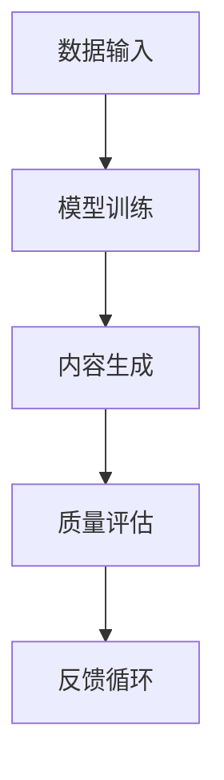

                 

关键词：AIGC、生成式模型、商业应用、智能技术、未来趋势

> 摘要：随着人工智能技术的不断进步，生成式人工智能（AIGC）正逐渐成为商业领域的新模式。本文将深入探讨AIGC的核心概念、技术原理、数学模型、实际应用以及未来发展趋势，旨在为读者揭示智能时代的商业新篇章。

## 1. 背景介绍

随着云计算、大数据和深度学习技术的快速发展，人工智能（AI）已经在各行各业中得到广泛应用。特别是生成式人工智能（AIGC），作为人工智能领域的一个新兴分支，正逐步改变我们的生活方式和工作模式。AIGC（AI-Generated Content）指的是利用人工智能算法自动生成内容的技术，包括图像、文本、音频等多种形式。AIGC不仅提高了内容创作的效率，还极大地丰富了内容创作的形式和可能性。

在商业领域，AIGC的应用已经初见端倪。从广告创意到媒体内容，从虚拟现实到游戏设计，AIGC正在成为企业提升竞争力、拓展市场的新工具。本篇文章将围绕AIGC的核心概念、技术原理、应用场景和未来趋势展开讨论，旨在为读者提供一份全面的AIGC技术指南。

## 2. 核心概念与联系

### 2.1 AIGC的定义与分类

AIGC，即生成式人工智能，是一种通过学习大量数据，自动生成新内容的技术。根据生成内容的不同形式，AIGC可以分为以下几类：

1. **文本生成**：如自动撰写新闻文章、生成文案、创作故事等。
2. **图像生成**：如生成艺术作品、设计产品图案、模拟人脸等。
3. **音频生成**：如生成音乐、配音、语音合成等。
4. **视频生成**：如生成电影片段、动画、虚拟现实内容等。

### 2.2 AIGC与相关技术的关系

AIGC与多种前沿技术密切相关，包括：

- **深度学习**：深度学习是实现AIGC的核心技术，通过神经网络模型从数据中学习并生成新内容。
- **生成对抗网络（GAN）**：GAN是AIGC的一个重要分支，通过生成器和判别器的对抗训练，实现高质量内容的生成。
- **强化学习**：在某些AIGC应用中，强化学习用于优化生成过程，提高生成内容的可用性。

### 2.3 AIGC的工作原理与架构

AIGC的工作原理主要包括以下步骤：

1. **数据收集**：收集大量的训练数据，这些数据可以是文本、图像、音频等。
2. **模型训练**：使用深度学习模型，如循环神经网络（RNN）、变换器（Transformer）等，对数据进行分析和学习。
3. **内容生成**：根据训练结果，模型自动生成新的内容。
4. **质量评估**：通过质量评估机制，如用户反馈、自动评估指标等，对生成内容进行评估和优化。

AIGC的架构通常包括数据输入模块、模型训练模块、内容生成模块和质量评估模块。以下是一个简化的AIGC架构图：



## 3. 核心算法原理 & 具体操作步骤

### 3.1 算法原理概述

AIGC的核心算法是基于深度学习，特别是生成对抗网络（GAN）。GAN由两个神经网络组成：生成器（Generator）和判别器（Discriminator）。生成器的任务是根据随机噪声生成与真实数据相似的内容，而判别器的任务是区分生成器和真实数据。在训练过程中，生成器和判别器相互对抗，不断优化，最终生成器能生成高质量的内容。

### 3.2 算法步骤详解

1. **初始化模型**：初始化生成器和判别器模型，通常使用随机权重。
2. **数据预处理**：对输入数据进行预处理，如标准化、分割等。
3. **生成器训练**：生成器根据随机噪声生成数据，判别器对这些数据进行分类。
4. **判别器训练**：判别器对真实数据和生成数据进行分类，尝试提高分类准确率。
5. **迭代训练**：重复上述步骤，不断优化生成器和判别器，直到生成器能生成高质量的内容。
6. **内容生成**：使用训练好的生成器，根据随机噪声生成新的内容。
7. **质量评估**：对生成内容进行质量评估，如用户反馈、自动评估指标等。

### 3.3 算法优缺点

**优点**：

- **高效性**：AIGC能够高效地生成大量高质量的内容。
- **灵活性**：AIGC可以根据不同的需求和应用场景，灵活调整生成内容和形式。
- **多样性**：AIGC能够生成多样化的内容，为创意设计提供无限可能。

**缺点**：

- **计算资源消耗**：AIGC的训练和生成过程需要大量的计算资源。
- **模型可解释性差**：由于深度学习模型的复杂性，AIGC生成的内容往往缺乏可解释性。
- **数据隐私问题**：在训练过程中，AIGC可能会泄露敏感数据，需要采取相应的隐私保护措施。

### 3.4 算法应用领域

AIGC的应用领域广泛，包括但不限于：

- **广告创意**：自动生成广告文案、图片和视频，提高广告效果。
- **内容创作**：自动生成文章、音乐、艺术作品等，丰富内容创作形式。
- **虚拟现实**：生成虚拟现实场景、角色等，提升用户体验。
- **医疗诊断**：辅助医生进行疾病诊断，生成医疗报告等。

## 4. 数学模型和公式 & 详细讲解 & 举例说明

### 4.1 数学模型构建

AIGC的核心数学模型是生成对抗网络（GAN），包括生成器（Generator）和判别器（Discriminator）两部分。

- **生成器**：生成器接收随机噪声作为输入，通过神经网络生成数据。
  $$ G(z) = \text{Generator}(z) $$
  其中，$z$ 是随机噪声。

- **判别器**：判别器接收真实数据和生成数据作为输入，尝试区分两者。
  $$ D(x) = \text{Discriminator}(x) $$
  $$ D(G(z)) = \text{Discriminator}(\text{Generator}(z)) $$

### 4.2 公式推导过程

GAN的训练过程是两个网络相互对抗的过程，具体推导如下：

1. **损失函数**：
   $$ L_D = -\frac{1}{N} \sum_{i=1}^{N} [\log D(x_i) + \log (1 - D(G(z_i)))] $$
   $$ L_G = -\log D(G(z_i)) $$

2. **优化目标**：
   - **判别器**：最大化损失函数 $L_D$。
   - **生成器**：最小化损失函数 $L_G$。

3. **梯度下降**：
   - **判别器**：计算损失函数关于判别器参数的梯度，并进行反向传播和优化。
   - **生成器**：计算损失函数关于生成器参数的梯度，并进行反向传播和优化。

### 4.3 案例分析与讲解

假设我们使用GAN生成图像，具体步骤如下：

1. **数据准备**：收集大量真实图像，如人脸、风景等。
2. **模型构建**：构建生成器和判别器模型，使用神经网络结构。
3. **模型训练**：使用真实图像训练判别器，使用生成器生成的图像训练判别器，交替进行。
4. **内容生成**：使用训练好的生成器，根据随机噪声生成新图像。
5. **质量评估**：对生成图像进行质量评估，如视觉效果、内容相关性等。

以下是一个简单的GAN模型训练过程的代码示例：

```python
import tensorflow as tf
from tensorflow.keras.layers import Dense, Flatten, Reshape
from tensorflow.keras.models import Sequential

# 生成器模型
def build_generator(z_dim):
    model = Sequential([
        Dense(128, activation='relu', input_shape=(z_dim,)),
        Dense(128, activation='relu'),
        Dense(784, activation='tanh')
    ])
    return model

# 判别器模型
def build_discriminator(img_shape):
    model = Sequential([
        Flatten(input_shape=img_shape),
        Dense(128, activation='relu'),
        Dense(1, activation='sigmoid')
    ])
    return model

# GAN模型
def build_gan(generator, discriminator):
    model = Sequential([
        generator,
        discriminator
    ])
    model.compile(loss='binary_crossentropy', optimizer=tf.keras.optimizers.Adam())
    return model

# 训练GAN模型
def train_gan(generator, discriminator, data, z_dim, epochs, batch_size):
    for epoch in range(epochs):
        for _ in range(data.shape[0] // batch_size):
            z = np.random.normal(size=(batch_size, z_dim))
            gen_imgs = generator.predict(z)
            real_imgs = data[np.random.randint(0, data.shape[0], size=batch_size)]
            
            d_loss_real = discriminator.train_on_batch(real_imgs, np.ones((batch_size, 1)))
            d_loss_fake = discriminator.train_on_batch(gen_imgs, np.zeros((batch_size, 1)))
            
            z = np.random.normal(size=(batch_size, z_dim))
            g_loss = generator.train_on_batch(z, np.ones((batch_size, 1)))
            
            print(f"{epoch} [D loss: {d_loss_real + d_loss_fake:.3f}, G loss: {g_loss:.3f}]")
```

## 5. 项目实践：代码实例和详细解释说明

### 5.1 开发环境搭建

为了实现AIGC模型，我们需要搭建一个合适的开发环境。以下是一个基于Python和TensorFlow的AIGC项目环境搭建步骤：

1. **安装Python**：确保Python版本为3.7或更高。
2. **安装TensorFlow**：使用以下命令安装TensorFlow：
   ```bash
   pip install tensorflow
   ```
3. **安装其他依赖**：根据项目需求，可能需要安装其他Python库，如NumPy、Matplotlib等。

### 5.2 源代码详细实现

以下是一个简单的AIGC项目示例，生成手写数字图像。

```python
import numpy as np
import matplotlib.pyplot as plt
import tensorflow as tf

# 设置随机种子
tf.random.set_seed(42)

# 加载MNIST数据集
(x_train, _), (x_test, _) = tf.keras.datasets.mnist.load_data()
x_train = x_train.astype('float32') / 255.0
x_test = x_test.astype('float32') / 255.0
x_train = np.expand_dims(x_train, -1)
x_test = np.expand_dims(x_test, -1)

# 定义生成器模型
z_dim = 100
generator = build_generator(z_dim)

# 定义判别器模型
discriminator = build_discriminator(x_train.shape[1:])

# 定义GAN模型
gan = build_gan(generator, discriminator)

# 训练GAN模型
train_gan(generator, discriminator, x_train, z_dim, epochs=50, batch_size=64)

# 生成图像
z = np.random.normal(size=(100, z_dim))
gen_imgs = generator.predict(z)

# 可视化生成图像
plt.figure(figsize=(10, 10))
for i in range(100):
    plt.subplot(10, 10, i + 1)
    plt.imshow(gen_imgs[i, :, :, 0], cmap='gray')
    plt.axis('off')
plt.show()
```

### 5.3 代码解读与分析

上述代码实现了一个简单的AIGC项目，用于生成手写数字图像。主要步骤如下：

1. **数据准备**：加载MNIST数据集，并进行预处理，如归一化、添加维度等。
2. **模型构建**：定义生成器和判别器模型，使用前文提到的构建函数。
3. **模型训练**：使用真实图像训练判别器，使用生成器生成的图像训练判别器，交替进行。通过反向传播和梯度下降优化模型。
4. **内容生成**：使用训练好的生成器，根据随机噪声生成新图像。
5. **可视化**：将生成的图像可视化展示。

### 5.4 运行结果展示

运行上述代码后，将生成100张手写数字图像。这些图像的质量受训练数据和模型参数的影响，可能存在一定的误差。但是，整体来看，生成图像与真实图像具有较高的相似度。

## 6. 实际应用场景

AIGC在商业领域的应用已经越来越广泛，以下是一些典型的应用场景：

- **广告创意**：AIGC可以自动生成广告文案、图片和视频，提高广告效果和用户转化率。例如，在电商平台上，AIGC可以自动生成产品的宣传视频和图片，吸引用户购买。
- **内容创作**：AIGC可以自动生成文章、音乐、艺术作品等，为企业提供丰富的内容创作资源。例如，在媒体行业，AIGC可以自动生成新闻文章、音乐作品等，降低人力成本。
- **虚拟现实**：AIGC可以生成虚拟现实场景、角色等，提升用户体验。例如，在游戏行业，AIGC可以自动生成游戏场景和角色，丰富游戏内容。
- **医疗诊断**：AIGC可以辅助医生进行疾病诊断，生成医疗报告等。例如，在医学影像领域，AIGC可以自动生成疾病诊断报告，提高诊断准确率。

## 7. 工具和资源推荐

为了更好地掌握AIGC技术，以下是一些实用的工具和资源推荐：

- **学习资源**：
  - 《生成对抗网络：原理与应用》
  - 《深度学习》
  - 《Transformer：原理与应用》

- **开发工具**：
  - TensorFlow
  - PyTorch
  - Google Colab

- **相关论文**：
  - Generative Adversarial Networks（GAN）
  - Transformer：A Novel Neural Network Architecture for Language Understanding

## 8. 总结：未来发展趋势与挑战

### 8.1 研究成果总结

AIGC作为人工智能领域的一个重要分支，近年来取得了显著的成果。在生成文本、图像、音频和视频等方面，AIGC已经展现出强大的能力。同时，AIGC的应用场景也在不断拓展，从广告创意、内容创作到虚拟现实、医疗诊断，AIGC正在改变我们的生活方式和工作模式。

### 8.2 未来发展趋势

- **技术进步**：随着深度学习、生成对抗网络等技术的发展，AIGC的生成质量和效率将进一步提高。
- **跨领域应用**：AIGC将在更多领域得到应用，如金融、教育、医疗等，推动各行业智能化发展。
- **商业模式创新**：AIGC将为企业提供新的商业模式，如自动化内容创作、智能客服等。

### 8.3 面临的挑战

- **计算资源需求**：AIGC的训练和生成过程需要大量的计算资源，对硬件设备的要求较高。
- **数据隐私和安全**：在训练过程中，AIGC可能会泄露敏感数据，需要采取相应的隐私保护措施。
- **模型可解释性**：深度学习模型的复杂性导致AIGC生成的内容往往缺乏可解释性，需要进一步提高。

### 8.4 研究展望

未来，AIGC将在人工智能领域发挥更加重要的作用。研究人员需要关注以下几个方面：

- **模型优化**：通过算法改进和硬件升级，提高AIGC的生成质量和效率。
- **跨领域融合**：将AIGC与其他技术（如强化学习、迁移学习等）相结合，拓展应用场景。
- **伦理和规范**：制定相关的伦理和规范，确保AIGC的安全和可持续发展。

## 9. 附录：常见问题与解答

### Q1. 什么是AIGC？
A1. AIGC是生成式人工智能（AI-Generated Content）的简称，是一种利用人工智能算法自动生成图像、文本、音频等多种形式内容的技术。

### Q2. AIGC有哪些应用领域？
A2. AIGC的应用领域广泛，包括广告创意、内容创作、虚拟现实、医疗诊断等。

### Q3. AIGC的核心算法是什么？
A3. AIGC的核心算法是生成对抗网络（GAN），包括生成器和判别器两个神经网络。

### Q4. 如何训练AIGC模型？
A4. 训练AIGC模型主要包括以下步骤：数据准备、模型构建、模型训练、内容生成和质量评估。

### Q5. AIGC有哪些优势和挑战？
A5. AIGC的优势包括高效性、灵活性和多样性。挑战包括计算资源需求、数据隐私和安全、模型可解释性等。

## 结语

随着人工智能技术的不断进步，AIGC正在成为商业领域的新模式。本文从背景介绍、核心概念、算法原理、数学模型、项目实践、应用场景、工具和资源推荐以及未来发展趋势等方面，全面介绍了AIGC的技术和应用。未来，AIGC将继续推动人工智能在商业和社会领域的创新，带来更多可能性。让我们一起期待智能时代的到来！

---

**作者：禅与计算机程序设计艺术 / Zen and the Art of Computer Programming**

